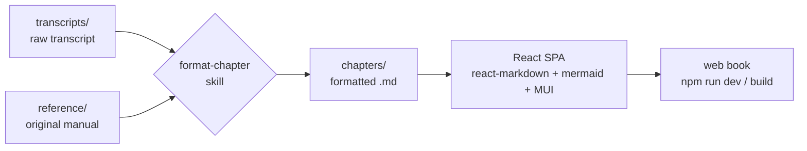

# Behavior Ops — Book Web App

Turning raw chapter **transcripts** of *Behavior Ops* by **Charles Huge** into a
polished, **readable web book** — faithful to every word, enriched with diagrams,
charts, callouts, and clean typography, presented as a React single-page app.

## How it works



There is **no build/transform step for content**. The skill produces a faithful,
structured `chapters/chapter-NN.md`, and the React app renders that Markdown
directly in the browser: callouts, pipe tables, and ```mermaid diagrams (rendered
live), with the chapter opener, Key Takeaways panel, and Change Log styled to the
book's design system. Diagrams render client-side via the `mermaid` package — no
image pre-render. All visual design lives in `src/components/BookProse.jsx` and
`src/theme.js`.

## Folder map

| Folder | What goes in it |
|---|---|
| `transcripts/` | Raw transcript per chapter (`chapter-03.md` or `.txt`). **You drop these in.** |
| `reference/` | The **original manual** + concept notes — the authority for fixing errors. |
| `chapters/` | Finished, formatted chapter Markdown (skill output). **The app reads these directly.** |
| `assets/diagrams/` | Source chart scripts (e.g. matplotlib `.py`) and their PNGs. |
| `public/assets/diagrams/` | Static images the app serves (chart PNGs referenced from chapters). |
| `src/` | The React app — components, pages, theme, content loader. |
| `index.html` / `vite.config.js` | Vite entry + config. |
| `.claude/skills/format-chapter/` | The editorial workflow skill. |

## Workflow

1. **Add the original manual** to `reference/` (one time — see `reference/README.md`).
2. **Drop a transcript** into `transcripts/` (e.g. `transcripts/chapter-04.md`).
3. Ask Claude: **"format chapter 4"** (invokes the `format-chapter` skill). It will:
   - read the transcript and the manual,
   - fix transcription/factual errors **without dropping any content**,
   - restructure into a real book chapter,
   - add diagrams, tables, and callouts,
   - and report a Change Log of every correction.
4. The chapter appears automatically in the app's table of contents and at
   `/#/chapter/4` — the app discovers `chapters/*.md` by frontmatter, no code edit.

## Run it

```bash
npm install      # first time only
npm run dev      # dev server with hot reload (edit a chapter .md and it updates)
npm run build    # static production build → dist/
npm run preview  # smoke-test the production build
```

The app uses `HashRouter`, so the static build deploys to any host (GitHub Pages,
Netlify, S3) with no server rewrite rules. For a GitHub Pages subpath, set
`base: '/<repo-name>/'` in `vite.config.js` before building.

## Toolchain

- **Node 18+** and **npm**.
- **Vite + React** (`npm run dev` / `build`).
- **MUI** (component library + theming, incl. dark mode), **react-markdown**
  (+ `remark-gfm`, `remark-directive`, `rehype-slug`), **mermaid** (live diagrams).
- **Python 3 / matplotlib** — only if a chapter needs a custom data chart (saved as
  a PNG under `public/assets/diagrams/`).

### Design system
Everything about how chapters *look* — fonts, palette, callout boxes, headings,
tables, figures, drop caps, light/dark mode — lives in **`src/theme.js`** (palette
+ themes) and **`src/components/BookProse.jsx`** (chapter typography). Edit those to
restyle the entire book. Preview instantly with `npm run dev`.

## The one rule

**No word of the author's content is ever omitted.** The workflow only formats,
corrects clear errors (logged), and enriches. See
`.claude/skills/format-chapter/SKILL.md` and `reference/style-guide.md`.
