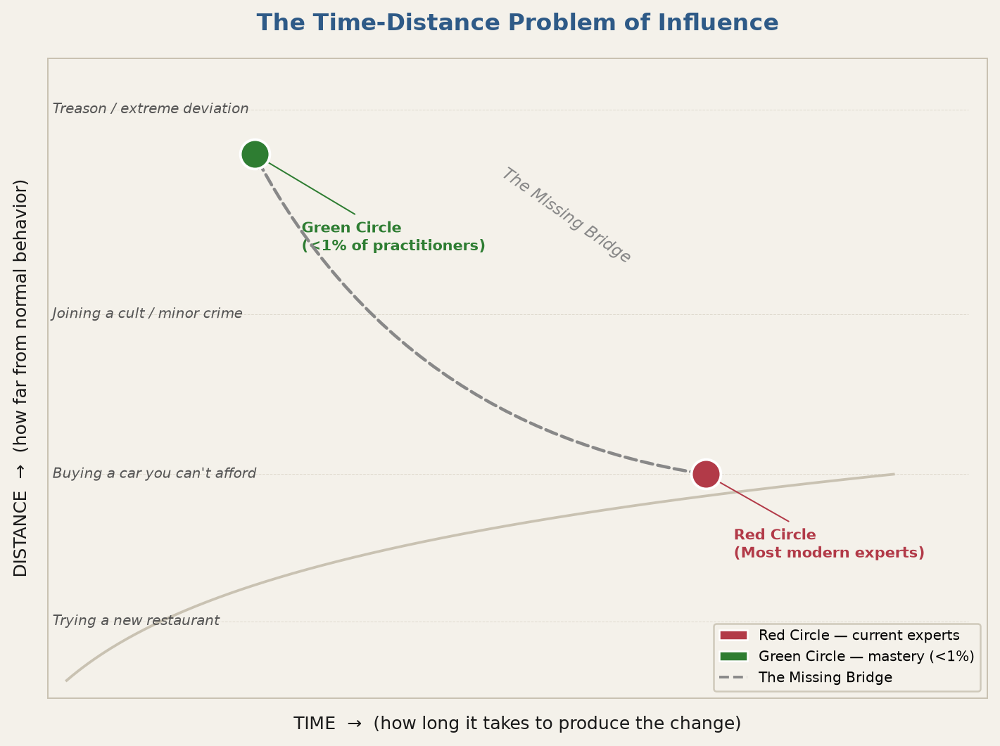
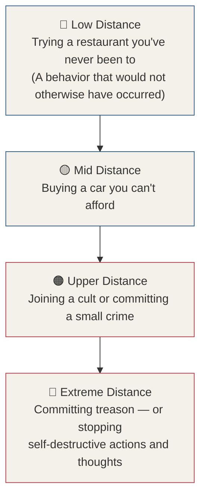
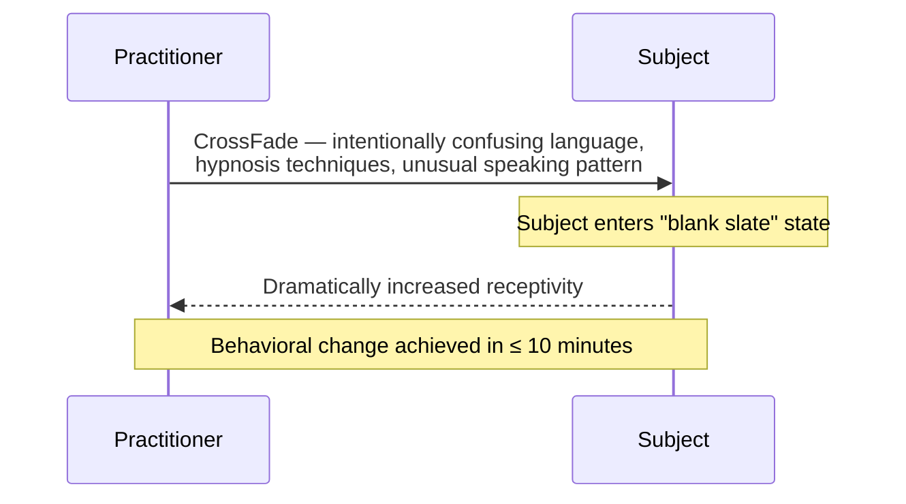
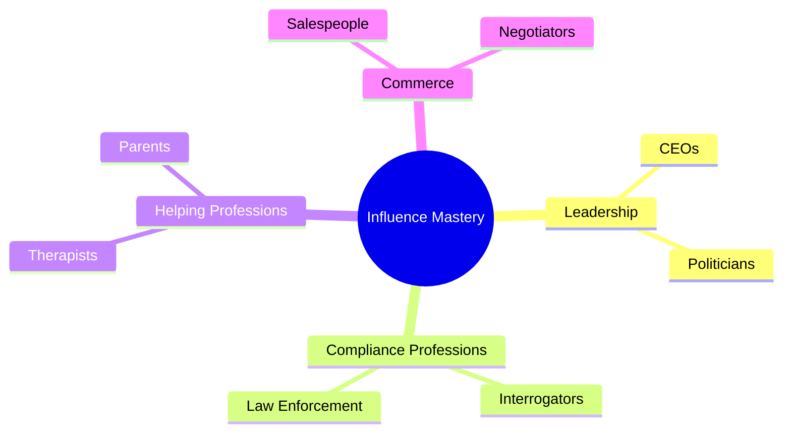

# Chapter 3 — The Time-Distance Problem of Influence

> *"While everyone around me seemed to view persuasion and influence as a lock pick — having to jiggle something around in a lock and hope for the best — I found the master key."*

The time-distance problem is the single issue I have spent my life attempting to overcome. It is the central challenge of every practitioner who has ever tried to influence human behavior at a serious level, and it explains why even the best-trained experts in the world fall short of what is truly possible.

This chapter defines the problem precisely, maps it visually, traces my search for a solution, and introduces the discovery that changed everything.

---

## The Problem Stated Simply

When a person falsely confesses to a murder, the average length of that interrogation is about 16 hours. That is a very long time. Most people can be talked into almost anything if they are kept in a situation long enough.

The question I have spent my life solving is this: **Why does it take so long?** And more urgently — does it have to?

The problem was that the available skills being taught at any level of persuasion and influence training were elementary at best. New skills had to be created to cross what I call the **time-distance problem**.

::: callout
**The Core Question.** How can I get someone to deviate from their normal behavior to an extreme degree in a *short* amount of time? What skills or techniques bridge the gap from small changes in behavior over a long period of time, to large changes in behavior over a very short period of time?
:::

---

## Reading the Graph

In the visual resources that accompany this material, a graph illustrates the glaring reality of the current state of knowledge in influence and persuasion training — and why this issue demands solving (see Figure 3.1).

The graph uses two axes:

| Axis | What It Measures |
|---|---|
| **Y-axis (vertical) — Distance** | How far from their normal behavior a person can be made to perform or act |
| **X-axis (horizontal) — Time** | How long it will take to cause that change to happen |

The knowledge that most experts possess is profoundly lacking. They cannot move the red dot very far upward on the distance axis without also moving it far to the right on the time axis. In other words, they may achieve higher-level results with persuasion — but it takes forever, and it still does not move the needle very far upward. The gray line on the graph is what I call the **missing bridge**, represented as the arrow connecting the dots from red to green. It symbolizes the enormous gap in skills and techniques.

The training I needed to develop required that I get an operative from that red circle to the green circle. I had to find a way to bridge that gap.

---

## The Distance Axis — A Scale of Behavioral Deviation

When we talk about distance, we can assume there are degrees of deviation from normal behavior. The scale runs from the mundane to the extreme (see Figure 3.2).

*Figure 3.2 — The Distance Scale. Every level represents behavior that would not otherwise have occurred.*

At the **lowest part** of the distance axis, you may be able to talk someone into going to a restaurant they have never been to. This effectively made a behavior occur that would not otherwise have occurred.

Moving **midway up** the distance axis, a person may be talked into buying a car they cannot afford.

Moving **further up**, a person may be persuaded to join a cult or commit a small crime.

At the **very top** of the distance axis is where extreme behavioral deviations occur. This is where my experience lies. My training was initially designed to talk foreign nationals into committing treason — and facing the consequences of being caught.

::: warning
**Both Extremes.** This axis refers to both the negative and the positive. At the top of the distance line you will find a person robbing a bank or committing murder — but you will equally find a person stopping self-destructive actions or thoughts. Extreme persuasion can be made to do good as well as harm. Like any tool, it can be weaponized or used for good. The **intent** is what makes a tool ethical.
:::

---

## The Time Axis — and Why Experts Fail

The serious problem is not that experts cannot influence people at all — they can. The problem is that the further up the distance axis you want to go, the further right you are forced to travel on the time axis. The relationship between distance and time, as most experts practice it, is slow and incremental.

People can be talked into much higher levels on the distance line. The question is: **how long will it take?**

In the training I developed, my goal was to get an operative to that green circle — a major change of behavior in a short period of time. Most modern experts operate at the red circle. Fewer than 1% of people in the world operate anywhere close to the green circle.

---

## The Search for the Missing Skills

I discovered that the gap existed not due to a lack of academic knowledge, but due to a **lack of skill**. There was plenty of academic knowledge available. It simply did not translate to real-world results. Some individuals operated at the red dot; only very highly skilled individuals operated closer to the green dot.

My next step was to ask two key questions:

1. **What are these skills?**
2. **Why haven't I been able to find them?**

Even after decades of research — and with a high government security clearance — I could not pinpoint these skills. Countless taxpayer dollars were spent flying in experts and consulting with professors, salespeople, authors, and gurus. After all my efforts, I compiled hollow information that was anecdotal at worst and only slightly beneficial in the real world at best.

::: definition
**The Missing Bridge** — the gap between where modern experts operate (red circle: moderate distance, long time) and the goal of influence mastery (green circle: extreme distance, short time). The bridge is not academic knowledge. It is a specific set of skills that, until now, have never been systematically taught.
:::

---

## The Breakthrough — CrossFade

In 2002, I learned a technique called **CrossFade** that involved using intentionally confusing language, a dash of hypnosis techniques, and speaking in an unusual way. I tried this method immediately, and watched as the person I was speaking to morphed into what I can only describe as a blank slate. After a short conversation — often no more than 10 minutes — I found myself in a position where I was able to change a person's behavior dramatically.

The technique was powerful. And as you will learn in this manual, it also led me to the biggest discovery of my life.

*Figure 3.3 — The CrossFade sequence: a short, structured interaction that bypasses normal resistance and produces dramatic behavioral change.*

While everyone around me seemed to view persuasion and influence as a lock pick — having to jiggle something around in a lock and hope for the best — I found the **master key**.

The one thing that led to the development of the **Behavior Tradecraft System** — the admin password to the human brain — is something I call the **Hierarchy of Influence**. We will dive deeper into this very soon.

---

## What Is Influence?

In the end, the true measure of skill and success comes down to our ability to persuade and influence human beings. Whether you are a CEO, a salesperson, a therapist, an interrogator, or a parent — skills that help us relate to other humans are the bridge to true success.

::: definition
**Influence** — communication or behavior performed by one person, who causes another person to think or take actions they would not have otherwise taken.
:::

When we use influence, we leverage a person's neurology and psychology simultaneously to create electrical and chemical reactions. The measure of how effective that influence is comes down to a person's ability to direct and choreograph the movement of that electricity, and the symphony of those brain chemicals.

---

## Why Is This So Important?

Almost all success can be traced back to someone's ability to understand, read, interpret, and direct human behavior. From politicians and CEOs to psychologists and drill sergeants, the level of success comes down to skills that affect human behavior.

*Figure 3.4 — Influence mastery is the common denominator across every field where human outcomes matter.*

---

## What Can It Really Do?

These skills can be used to do almost anything. There is no limit I have discovered as to what they can help achieve. From the mundane to the monumental, a person can be made to vary their behavior in ways that are slight modifications or drastic changes.

Anything is possible.

---

## Key Takeaways

- The **time-distance problem** is the defining challenge of influence: the higher the behavioral change required, the longer current experts take to produce it — and they still fall far short of what is possible.
- The **Distance axis** measures how far from normal behavior a person acts; the **Time axis** measures how long it takes to get them there.
- Examples of behavioral distance range from choosing a new restaurant (low) all the way to committing treason (extreme). Both positive and negative extremes exist at the top of the scale.
- Most modern experts operate at the **red circle** — moderate results, long timelines. Fewer than 1% reach the **green circle** — major results, short timelines.
- The gap is not an absence of academic knowledge; it is an absence of **real-world skill**.
- The discovery of **CrossFade** in 2002 was the first technique to reliably produce dramatic behavioral change in under 10 minutes, and led directly to the **Hierarchy of Influence**.
- **Influence** is defined as: communication or behavior performed by one person that causes another to think or act in ways they would not have otherwise — achieved by directing the electrical and chemical activity of the brain.
- Like any tool, influence can be used for harm or good. **Intent** is what makes it ethical.

