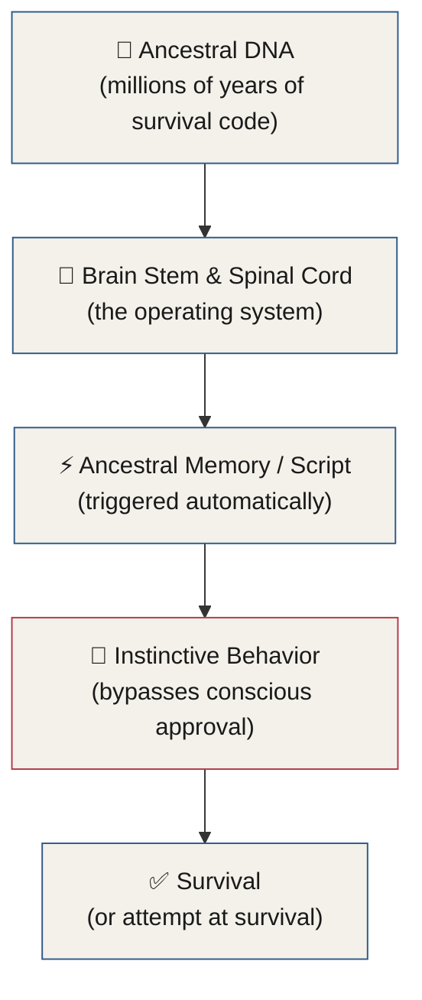
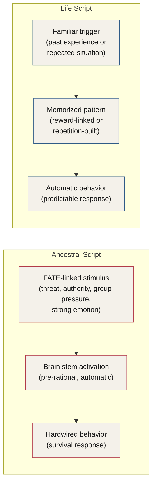
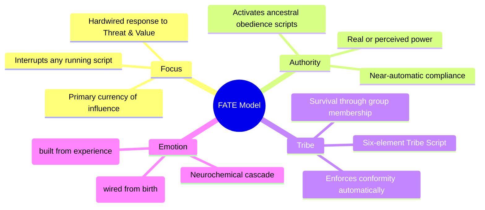
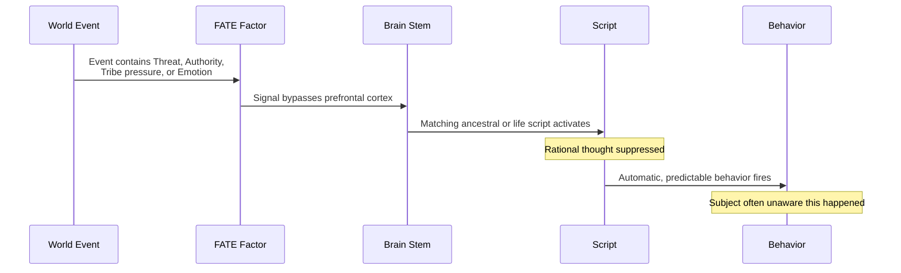
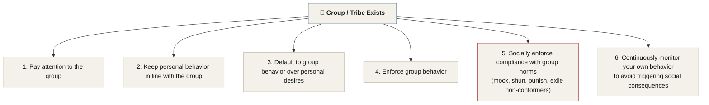

# Chapter 4 — The Pillars of Human Influence

> *"The people in this world who determine the outcomes are those with the greatest skills in understanding, reading, and guiding human behavior. There are little to no exceptions."*

Somewhere in the world right now, an innocent person is confessing to a crime they did not commit. An intelligent man is joining a cult. A bankrupt woman is buying something she doesn't want. And a professional — perhaps a therapist — is using covert techniques to stop a patient from serious self-harm.

These are all examples of influence at play. The more skill you have in influence, the more power you have to shape the world around you. Use these tools wisely, and treat them with immense respect.

In this section, we'll uncover the foundational reasons why influence works and walk through several models that reveal its inner workings. You will understand influence more deeply than a psychologist, with more clarity than a leading sales professional. The Pillars of Influence will offer new insights, and you will learn facets of influence that most experts completely miss. This section is intended to be a go-to reference to return to as you progress further through the manual.

---

## The 13 Laws of Influence

These are the immutable laws of influence that will stand the test of time and serve as guideposts along your journey to true mastery. They are the result of hundreds of years of research and my entire life spent obsessing over how the mind works.

This list is presented here before the Pillars of Influence so that you have a known place to return to as each law begins to introduce itself throughout the manual.

::: callout
**The 13 Laws of Influence**

1. Cease suffering first.
2. Know yourself.
3. Know your audience.
4. Be the leader and the role model when no one is looking.
5. Speak the subject's language.
6. Leadership is who you are, not what you do.
7. Whatever level of control you desire over others, you need three times that level of control over yourself.
8. Mindset is more important than knowledge.
9. Your social surroundings dictate your future.
10. Use cognitive dissonance as a lever for yourself and others.
11. Get brilliant on the basics while others seek skill placebos.
12. Let every skill stay hidden, and every victory belong to the subject.
13. Influence yourself and others by changing perspective, context, and permission — in that order.
:::

---

## The Five Fundamental Models

There are five fundamental models that comprise the Pillars of Influence. You are about to be introduced to each of them.

| Model | What It Reveals |
|---|---|
| **The FATE Model** | The four evolutionary entry points into the human mind |
| **The Six Ounces Model** | How weight and leverage are distributed in influence |
| **The Authority Triangle** | The geometry of hierarchical power and compliance |
| **The Hierarchy of Influence Factors** | The stack-ranked forces that drive human decisions |
| **The Skills Map** | The full terrain of practitioner competencies |

*Figure 4.1 — The five models that together form the Pillars of Influence. The FATE Model is covered in full in this chapter.*

This chapter covers the FATE Model in depth. The remaining four models will be introduced in the sections that follow.

Before we explore these models, I want to explain how influence actually works from a perspective that may be entirely new to you.

---

## Why Persuasion Works — The Brain Stem First

**Good persuasion works because our ancestors needed to live.**

What does this mean? It means that effective persuasion leverages the depths of the brain. The least effective form of persuasion is through language — yet it is the most common form people use.

Many teachers of persuasion limit their teachings to language. Most people and companies focus on finding the right words to say. When sales continue to fail, they search for a new script, ignoring the fundamentals of how influence and persuasion actually work.

::: callout
**The Core Principle.** The closer to the brain stem a method is capable of reaching, the more effective it is.
:::

There are hundreds of real-life examples of extreme persuasion that prove this point. In the **Milgram experiment**, random volunteers were persuaded into administering electric shocks at apparently lethal levels to total strangers — or so they thought. In other experiments, people willingly sat in a room as it filled with smoke, despite the real threat of dying from asphyxiation.

Countless real-life examples confirm that these extreme deviations from normal behavior are not only achievable but can be performed on almost anyone. Here is the unsettling part: the one thing all of these examples have in common is that **language had no bearing on whether the subject complied**. The words didn't matter. No hypnotist planted commands in people's heads. No secret magical language convinced these people to do seemingly insane things. Words played a minimal role in pushing people to do extreme things far out of character.

Words are important — but we are not born with them. We are, however, born with all kinds of other programming: facial expressions, genetic predispositions, the ability to read and send nonverbal signals, and hundreds of other programs that run in the background of our mental operating systems throughout our lives. We can even inherit phobias and fears through our DNA.<!-- Citation: likely Dias (2015) and Ressler (2014) on epigenetic inheritance of conditioned fear responses — verify against original manual before publication -->

---

## Ancestral Memory — The Operating System We Didn't Choose

If you have ever held a baby with their feet barely touching the ground, you have noticed how their legs automatically pedal in midair, as though they are trying to walk or run. Parents love this and often attribute it to the baby wanting to walk. In fact, the baby has no idea what is happening. The baby's brain is not really involved in the motion. The baby's brain stem — with a few million years of programming built into it — reacts to the level surface below it, **innervating** a spinal cord reflex.

This reflex is what I call an **ancestral memory**. Our ancestors walked, and it helped them survive. Our neurology memorized this piece of data and stored it in the spinal cord. If a behavior helped our ancestors survive long enough to reproduce, that behavior was stored on a hard drive within our DNA so that it would continue to keep future humans alive.

Point to the base of your brain. Try it now. Where is it? Most people point to the back of their head or the lower part of their neck. In reality, your spinal cord goes all the way into the lumbar area of your lower back.

**The spinal cord is the boss of the body.** The brain stem handles subconscious bodily functions — the instincts that keep us alive. This is why you cannot hold your breath until you die. Your brain stem recognizes the threat to your life and takes action whether you approve or not.

Our species is hardwired to respond to certain scenarios and conditions. These programming instructions are built into our software from birth.

*Figure 4.2 — The ancestral memory pipeline. Survival-critical behaviors encoded in our DNA surface through the brain stem and fire without conscious consent.*

---

## Maslow's Hierarchy and the Tribal Priority Stack

To understand why we do what we do, consider Abraham **Maslow's** hierarchy of human needs:

Maslow's hierarchy shows us how our priorities are determined, with physiological and safety needs forming the base of the pyramid. **When something threatens the lower end of the pyramid, our attention fixates on that threat** — making us wildly more suggestible, predictable, and impulsive.

If we think of the tribes that existed a million years ago, virtually all of their energy was focused on food and survival — the base of the pyramid. If something threatened their access to food and water, it was a massive deal that occupied their attention above all else. This behavior kept our ancestors alive, and it lives in us today.

Remember: **the way people respond to actual scarcity of resources is roughly the same as the way they respond to the threat of scarcity.** Perception is as powerful as reality.

The people who lived in tribes also responded to the tribal leader. If they disobeyed the tribal leader, they faced consequences such as public shame, incarceration, banishment, or death. Each of these threatened the lower-level needs on Maslow's pyramid.

---

## Behavioral Scripts — The Brain's Automation Engine

Ancestral memories are stored in the brain stem and spinal cord. These memories function like scripts — they tell the brain to run a certain program. It happens without our consent or awareness. When an event or experience triggers something our ancestors embedded in our brain stem, a script begins to run.

These little scripts can take over our rational behavior. Sometimes this is positive — the script saves our lives. Other times it gets us into trouble. These scripts have been with us for millions of years and they are here to stay. Nothing has the capacity to modify them.

### Two Types of Behavioral Script

Humans operate on two types of behavioral scripts every day:

::: definition
**Ancestral Script** — an automated, subconscious behavioral pattern that activates in response to a given stimulus because of ancestral DNA. One example is the automatic reaction of the body to protect arteries when startled or fearful. Ancestral scripts are activated by events or circumstances that contain elements of the FATE model — focus, authority, tribe, and emotion. They are hardwired responses to stimuli that can override rational or logical thought processes and create unconscious impulses toward survival-rooted behaviors, completely subduing rational decision-making.
:::

::: definition
**Life Script** — an automated behavioral pattern learned throughout life. These patterns are built to save cognitive energy by creating automations for tasks a person regularly repeats, such as operating a cash register or tying shoes. They also save time by memorizing behavioral responses to conflicts that were successful in the past — or a set of memorized behaviors that achieved a positive reward, such as pleasing parents, using drugs, or having sex.
:::

*Figure 4.4 — The two script types. Ancestral scripts fire from inherited DNA; life scripts are built from personal experience.*

### The 4 Rules of Behavioral Scripts

::: callout
**The 4 Rules of Behavioral Scripts**

1. If a script is **interrupted**, focus is created.
2. If a script is borrowed from someone's **past experience** (a life script), predictability is created.
3. If a script is borrowed from **ancestors**, automation is created.
4. If a script is **openly discussed**, its power is lessened.

Understanding these as early as possible in your training is paramount to your development as an operator.
:::

### Cognitive Mode

Another form of life script is the kind built from repeated behaviors — tying shoes, typing emails, driving a car, showering. When we do things frequently, the brain develops a script to memorize the behavior and repeat it in the future.

When someone works on a single task for a few weeks, their brain identifies it as a repeating behavior. The brain essentially says: *I'm going to pay attention and memorize all these steps so it becomes easier in the future.* This occurs because our brains love conservation of energy. Passing a task to the automatic part of the brain saves enormous amounts of cognitive load.

::: definition
**Cognitive Mode** — the brain's energy-conservation mechanism; it wires itself to perform familiar tasks almost mindlessly and effortlessly so that multiple tasks can be handled simultaneously. How else could someone drive a car, monitor traffic, sing along to the radio, and drink coffee all at once?
:::

Our ancestors needed this too. A million years ago, a woman picking berries needed to pay attention to the surrounding environment for signs of approaching predators. When berry-picking became automatic, she could dedicate her full awareness to threat detection. Her brain memorized these repetitive behaviors — and because it helped keep her alive, that code was written into her DNA so future generations could benefit from it.

**When a person is running a script of any kind, not only can their behavior be reliably predicted, but their entire decision process can also be hacked into.** In the influence section, you will learn exactly how this works. Sometimes a person needs to be pushed deeper into a currently running script to become hypercompliant. Other times the scripts need to be broken entirely to get the brain into a state of compliance.

::: warning
**Handle With Care.** Knowing how to identify, trigger, and interrupt scripts is among the most powerful knowledge in this manual. These tools work on anyone — including you. Use them with the ethical intent befitting a professional operator.
:::

---

## The FATE Model

The FATE Model shows us — in order of importance — what our ancestors prioritized to survive. It provides the critical detail on how effective persuasion works and can also be used as a diagnostic tool: modern situations like legal trials and sales calls can be analyzed through its lens.

*Figure 4.5 — The FATE Model. Four evolutionary entry points into the human mind, in descending order of ancestral priority.*

The FATE Model can also be understood as a sequence:

*Figure 4.6 — How a FATE-laden stimulus travels from world event to automatic behavior, bypassing rational oversight.*

### Focus

Focus was vital to our ancestors — in many ways, it kept them alive. Here are three examples of how automatic focus supported survival:

**One.** Your ancestor is returning to the tribe with a large bag of berries. She passes the same bush she has passed for years. She hears a stick crack behind it. Focus shifts entirely to that sound. She is not thinking about her children, her tribe, or her newborn baby. Her brain is hardwired to immediately attend to anything out of the norm that could potentially be a threat.

**Two.** One of your ancestors is hunting. A movement in the corner of his eye alerts him to a nearby animal he can kill. His focus feeds his family. On his way home, an unfamiliar spot of color catches his eye. His focus is captured. He discovers medicinal plants that will provide life-saving assistance to his family and tribespeople.

**Three.** One evening, your ancestor passes tribesmen gathered around a fire. An elder is telling a captivating story about how he survived a saber-toothed tiger attack and used the dead animal's skin to survive the cold night. The story captures her attention. She stops what she is doing to listen. This information later helps her survive a similar attack, allowing her to live and raise her children.

These ancestral tendencies — being snapped to attention by something out of the norm, something that could be a threat or a source of value — are still wired into us today.

Our focus is hardwired to rapidly respond to two main elements:

| Element | What it represents | Ancient example | Modern example |
|---|---|---|---|
| **Threat** | Potential injury or loss | Stick snap behind a bush | Breaking news, a negative email |
| **Value** | Potential reward | Movement of prey animal | A celebrity, a financial opportunity, an attractive person |

**Focus is your primary currency when it comes to influence and persuasion.** The ability to generate focus in another person is the single most important element of mastering human influence. A person who lived a million years ago with no ability to focus on threats or resources would have perished long before they could have reproduced. The survival of the fittest is how we know none of your ancestors died without passing on their genes.

All persuasion and influence comes down to the ability to capture and direct a person's focus. The more captivated a person is, the more easily they are persuaded — just as the sound of a stick snapping behind a bush has the potential to be either a threat (a predator) or a value (a meal).

Television news networks constantly leverage the power of potential threats to hold your attention. This is why news channels are filled with stories of violent and negative encounters. A million years ago, value might have been a fish that could feed a family. Today, the value that drives focus could be seeing a celebrity, gaining access to money, or finding a potential mate.

These are referred to as **psychological loopholes** — gaps in our ability to resist influence when factors are present that override our critical judgment. These gaps are behavioral traits inherited from our ancestors, originally designed to keep us out of harm's way, help us get along within our tribe, ensure compliance with tribal authorities, and facilitate recognition of important patterns such as the movement of snakes or the sounds of approaching predators.

### Authority

Authority refers to our programmed response to a person or group that we perceive as having power over us. Authority has been proven to generate compliance and obedience in human beings in a way that is practically automatic. It is so powerful that it can almost stand on its own as an influence technique.

In ancient times, not heeding the orders of the tribal leader could spell a swift death. In today's world, things are not so different. Disobeying an authority can land you in jail or result in death. It may also limit or remove your access to resources. Failing to get along with a group can cause you to suffer social punishments — being ridiculed, outcast, or shunned — which also limits your access to resources.

Paying attention to authority kept our species alive and allowed societies to evolve into what they are today. **The presence of an authority — whether real or perceived — sets off an ancestral script that can and will take over our behavior without our consent, and often without our awareness.** Our brains are pre-programmed with the ability to recognize authoritarian behavior in other humans. A specific set of actions will activate this automatic program in virtually anyone.

### Tribe

The tribe was critical to our species. It was, in fact, one of the main reasons ancient humans — *Homo sapiens* — outsurvived the physically stronger Neanderthals. **We work better in groups.**

Living and working in groups allowed our ancestors to access resources more effectively and therefore survive longer. The tribe sheltered, fed, and protected us. It is the reason we have technology and advancement across so many fields. Our ability to form communities is a major reason our species sits at the top of the food chain.

Our ancestors did hard work, much of it independently. But the tribe was always the focus of most of their lives. In ancient times, there were severe and often lethal consequences for not prioritizing the tribe:

- Failing to pay attention to tribe members when a predator was near could mean death for you and others.
- Ignoring nonverbal signals of tribe members who had become sick from a new food could mean death for you or others.
- Failing to do what other tribe members were doing could lead to becoming an outcast — which meant no reproduction and the end of your genetic line.
- Not attending to tribe members when hunting could mean missing resources, or death.
- Prioritizing yourself over the needs of the tribe could lead to ostracism — no reproduction, no babies, and the death of your genes on Earth.
- Not paying attention to high-level tribe members who held resources could mean less access to food or medicine, and potential death.
- Being antisocial toward high-status tribe members could mean punishment, banishment, or death.
- Not noticing a tribe member's small child wandering into a predator-infested area could mean death.

In almost every case, failing to place importance on the people of one's tribe would likely have ended in suffering or death. This is the reason why so many seemingly bizarre findings have emerged in psychological research on groups and group behavior — from the Stanford Prison Experiment to the bystander effect, which we will cover later.

**When a group is created, an automatic script is triggered in us — a script written by our ancestors.**

*Figure 4.7 — The six elements of the Tribe Script. These run automatically when any group context is detected.*

### Emotion

If you touch a hot stove as a child, a neurochemical reaction occurs in your brain — not just the chemical process in your hands that forms a blister. That neurochemical reaction sets up an automatic reminder system to avoid that behavior in the future.

Long ago, our ancestors formed hundreds of automatic chemical responses to various scenarios and passed them down to us. When a threat — like a saber-toothed tiger — is present, the nervous system kicks into gear, sending a cascade of chemicals throughout the body to elevate the heart rate, push blood away from the torso, dilate the pupils, and take all kinds of other preparedness measures.

There are two subcategories within the Emotion branch of the FATE Model:

| Subcategory | Source | Example |
|---|---|---|
| **Ancestral Script** | Inherited via DNA from birth | Adrenaline surge when startled; attraction toward a potential mate; revulsion at the smell of decay |
| **Life Script** | Built from personal experience and culture | Heart-racing anxiety when you see police lights in your rearview mirror |

The reactions that form ancestral scripts are stored in the mammalian brain and limbic system — which we will cover in depth in a later section. They are ready to be triggered at a moment's notice to protect the human at all costs, even when they are not necessarily the best solution given the circumstances.

An ancestral script is designed to keep you safe. Some scripts are wired to move you *toward* things — an attractive potential mate, a source of food. Others are wired to move you *away* from things — the smell of rot, signs of disease. Ancestral scripts are written in our neurology from birth and make use of all other parts of the FATE Model. When we think about being socially outcast or disobeying an authority figure, for instance, we feel emotional discomfort — that is an ancestral script firing.

When it comes to life scripts, we form these as we develop as humans based on experience, culture, and exposure. Flashing police lights in the rearview mirror were not something our ancestors dealt with. But in our lives, we have learned to register it as a negative signal. **The ancestral script for "deal with a potential threat" activates** — as if the police car is an incoming tiger. The heart rate increases, blood pressure rises, and adrenaline floods the veins. According to your body, the police car poses the same level of threat as an approaching saber-toothed tiger.

During our lifetimes, we develop precise mechanisms for dealing with the world around us. A child who defeats a bully by fighting may go on to default to that same approach as an adult. A child who dealt with bullies by running develops similarly patterned behavior and tends to apply it to other problems in later life. **Our lives are governed far more by scripts — memorized behavioral patterns — than most people will ever realize.**

In a coming section, you will learn exactly what these scripts say, how to trigger them, how to identify them, and how to hack into other people's scripts.

---

## Key Takeaways

- The people who most shape the outcomes of others are those with the greatest mastery of understanding, reading, and guiding human behavior — **there are little to no exceptions**.
- The **13 Laws of Influence** are immutable principles that serve as permanent guideposts. Return to them throughout your training.
- Five models form the **Pillars of Influence**: the FATE Model, the Six Ounces Model, the Authority Triangle, the Hierarchy of Influence Factors, and the Skills Map. The FATE Model is the foundation.
- **Language is the weakest form of persuasion.** The most powerful techniques bypass language entirely and target the brain stem and ancestral nervous system.
- **Ancestral memories** are survival-critical behaviors encoded in our DNA and stored in the brain stem and spinal cord. They fire automatically in response to FATE-linked stimuli, overriding rational thought.
- **Maslow's hierarchy** reveals that threats to lower-level needs (physiological, safety) immediately hijack attention and make people vastly more suggestible. Perceived scarcity triggers the same response as actual scarcity.
- There are two types of behavioral scripts: **Ancestral Scripts** (inherited, automatic) and **Life Scripts** (learned through experience or repetition). Both can be predicted, triggered, and hacked.
- The **4 Rules of Scripts**: interrupting one creates focus; borrowing from past experience creates predictability; borrowing from ancestors creates automation; openly discussing one lessens its power.
- **Cognitive Mode** is the brain's energy-saving automation system. Once a behavior is scripted, attention frees up — and the script becomes highly predictable to an outside observer.
- The **FATE Model** — Focus, Authority, Tribe, Emotion — maps the four ancestral entry points into the human mind. Every major influence technique operates through one or more of these doors.
- **Focus is the primary currency of influence.** It is hardwired to respond to Threat and Value. Whoever controls focus controls the frame.
- The **Tribe Script** runs automatically whenever group context exists, enforcing conformity through six built-in behaviors — up to and including banishment of non-conformers.
- **Emotion** is the neurochemical layer of influence. Ancestral emotional scripts are hardwired from birth; life emotional scripts are built from personal history. Both can be leveraged — and both can be interrupted.

<!--
## Change Log

| Original (transcript) | Corrected | Reason |
|---|---|---|
| "fake model" / "faint model" (×many) | "FATE model" | Consistent ASR mishearing throughout |
| "Mazlow" / "Mazel's" | "Maslow" / "Maslow's" | Proper name: Abraham Maslow |
| "enservating a spinal cord reflex" | "innervating a spinal cord reflex" | Correct anatomical/neurological term |
| "high-level guide members" | "high-level tribe members" | "guide" is ASR error; context is clearly "tribe" |
| "had behavior was stored in a hard drive" | "that behavior was stored on a hard drive" | Grammar repair |
| "Right." (standalone, tribe script items 3 and 5) | "Three." / "Five." | Numbering continuation misread by ASR |
| "ceased suffering first" (Law 1) | "Cease suffering first" | Imperative mood, consistent with other laws |
| "The more cultivated a person is" | "The more captivated a person is" | "Captivated" is confirmed correct — Focus section is explicitly about capturing attention; "cultivated" (refined/educated) makes no sense here |
| "No hypnotist commanded people's heads" | "No hypnotist planted commands in people's heads" | "commanded people's heads" is non-grammatical; transcript garbled "no commands into people's heads" |
| "DS 2015. Wrestler, 2014." | HTML comment citation flag | Likely Dias (2015) and Ressler (2014) on epigenetic inheritance of fear — verify against original manual |
-->
