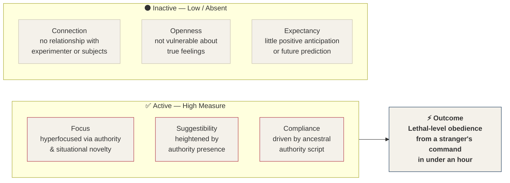

# Chapter 5 — The 6 Axis Model of Influence

> *"Everything you will learn is either to measure or to modify one of the factors on the 6 Axis Model of Influence. Everything."*

The 6 Axis Model shows you precisely what six factors need to be present for influence or persuasion to occur. It is so powerful that you will be referring to it throughout your entire training — and, in fact, for the rest of your career.

**Behavior profiling skills** give you the ability to measure where a person is on the 6 Axis Model. **Persuasion skills**, however, give you the ability to modify the elements on the model. Whatever you are learning when it comes to tradecraft, you are either learning how to measure where someone is on the 6 Axis Model, or how to modify where they are on it. This model will be something you reference on a regular basis. It is the most powerful tool that I believe exists in this field — once you are able to understand it.

---

## The Six Definitions

Let's unpack the definitions of the terms on the model.

::: definition
**1. Suggestibility** — The degree to which a person will accept and then act on a given suggestion by an operator.
:::

::: definition
**2. Focus** — The degree to which a person will maintain attention on something and exclude other competing stimuli from awareness.
:::

::: definition
**3. Openness** — The degree to which a person feels they can completely become vulnerable with another person. Marked by an absence of fear of social or societal repercussions.
:::

::: definition
**4. Connection** — The degree to which a person feels a sense of social connection with another, marked by a desire for future contact.
:::

::: definition
**5. Compliance** — The degree to which a person will comply with the direction to perform an action.
:::

::: definition
**6. Expectancy** — The degree to which a person reasonably feels they can predict — either consciously or unconsciously — what is to come, and that it will be enjoyed.
:::

---

## The Minimum Threshold — Why Only Three Are Needed

::: callout
**Key Principle.** Only three of the six qualities need to be present for someone to be persuaded — but they do have to be present to a large degree.
:::

An extreme example is the Milgram experiment, covered in depth in the next section. In that experiment, only three items were present in large measure. The Milgram experiment on obedience was hyperfocused on **Focus**, **Suggestibility**, and **Compliance** — and not on Connection, Openness, or Expectancy. The experiment essentially poured fuel onto those three factors. Once they were elevated in the participants, the subjects became hyper-obedient — to the point of apparently inflicting lethal harm on strangers in under an hour, simply because a person in authority told them to.

---

## The Milgram Experiment Through the 6 Axis Lens

To help examine and understand this crucial model, let's look at exactly how and why the Milgram experiment worked so well.

In the Milgram experiment, random people believed they were administering electric shocks to strangers at progressively dangerous levels — in some cases at what appeared to be a lethal voltage. The participants were not connected with each other, nor with the experimenter in charge. They also did not have much expectancy as to what was going to happen next. As a result, they were not very open or vulnerable about their true feelings. Three of the six axes — **Connection, Openness, and Expectancy** — were essentially inactive.

However, they were highly suggestible and compliant due to the presence of authority. And they were hyperfocused on the situation because ancestral scripts — triggered both by the authority present and by the novelty of the setting — had activated. More on the weapon we call novelty in a later section.

*Figure 5.2 — The Milgram experiment mapped onto the 6 Axis Model. Three axes were elevated to extreme levels; three were entirely absent. The result: profound, life-altering obedience from a stranger's command.*

Even with only three qualities active, the experiment produced profound results — people deviated dramatically from their normal social behaviors. The internal compass we all carry — the life script that says *do not harm others* — was completely overwritten because it was trumped by an ancestral script.

::: callout
**Remember.** Every factor on the 6 Axis Model is modifiable and fluid. These characteristics in people change on a regular basis in response to environmental factors and in the presence of people who know how to modify them. As you reference this manual, remain aware that everything you will learn is either to measure or to modify one of the factors on the 6 Axis Model of Influence. **Everything.**
:::

---

## The 6 Axis Model as a Planning and Postmortem Tool

While it may seem like a simple graphic illustrating how influence works, the 6 Axis Model can be used as a **training tool**, a **planning tool**, and a **postmortem diagnostic tool** — assisting in discovering what went wrong and what can be improved.

In **legal cases**, the model can be used to plan for jury trials or to evaluate an attorney's ability to persuade a jury. In **sales**, it can be used to plan for a meeting or call, or to analyze how a sales call was lost and what can be done to correct the behavior.

For the remainder of this training manual, every method you will be exposed to will revolve around leveling up the capacity for each of the six axes in a person or group. Every technique that follows will pivot around either increasing the value of one of the six axes, or determining a value based on nonverbal communication and then measuring its change over time.

---

## When to Prioritize Each Axis

In some situations, you may need to prioritize one axis over the others. The Openness axis, for instance, might not be critical for car sales, but is vital for therapy or mentoring. Situations will dictate that you place much higher importance on developing one particular axis because it will serve as a gateway to developing the others toward the desired outcome.

| Axis | When to Make It Your Top Priority |
|---|---|
| **Focus** | Situations that require you to be more **memorable** than persuasive |
| **Openness** | Situations that require a strong **deviation from a person's normal behavior** |
| **Connection** | Situations that require more **trust and emotion** than logic and judgment |
| **Suggestibility** | Situations requiring a deviation from baseline that the subject might **perceive as illogical or unusual** |
| **Compliance** | Situations requiring a gradual increase in compliant behavior that becomes **self-sustaining over time** |
| **Expectancy** | Situations requiring **excitement and trust**, where subjects will use predictions about the future to make present-moment decisions |

*Figure 5.3 — When to prioritize each axis, based on the nature of the situation.*

---

## Priority Stacks for Real-World Scenarios

In the following examples, I've laid out what an operator's priorities might look like based on the desired end result of each situation. As you read through this list, take note of which two elements are placed at the highest priority — and try to mentally process why prioritizing those elements would assist the operator in obtaining the desired results with the subject.

While the final items on each list are prioritized last, this does not mean they are unimportant. A lower position often indicates **chronological sequence**: these axes will most likely come into play later in the interaction as the higher-priority axes create the conditions for them. So these lists show both the operator's priorities and, roughly, the order in which the axes would be leveraged as the conversation or interaction unfolds.

| Scenario | Priority 1 | Priority 2 | Priority 3 | Priority 4 | Priority 5 | Priority 6 |
|---|---|---|---|---|---|---|
| Car Sales | Expectancy | Focus | Suggestibility | Compliance | Connection | Openness |
| Door-to-Door Sales | Focus | Connection | Expectancy | Openness | Suggestibility | Compliance |
| Interrogation | Compliance | Suggestibility | Focus | Connection | Openness | Expectancy |
| Speed Dating | Focus | Expectancy | Connection | Suggestibility | Openness | Compliance |
| Shark Tank | Focus | Expectancy | Connection | Suggestibility | Compliance | Openness |
| Job Interview | Focus | Connection | Expectancy | Openness | Compliance | Suggestibility |
| Written Sales (Email / Web) | Suggestibility | Focus | Expectancy | Connection | Compliance | Openness |
| Therapist | Openness | Suggestibility | Expectancy | Compliance | Focus | Connection |
| Dentist (Nervous Patient) | Expectancy | Suggestibility | Compliance | Connection | Openness | Focus |
| Asking for a Free Coffee | Focus | Suggestibility | Openness | Connection | Compliance | Expectancy |
| Cult Recruiter | Focus | Suggestibility | Openness | Expectancy | Connection | Compliance |

*Figure 5.4 — Priority stacks for eleven real-world scenarios. Columns represent rank order; lower-ranked axes are still important — they tend to come into play chronologically later in the interaction.*

---

### Car Sales

**Expectancy → Focus → Suggestibility → Compliance → Connection → Openness**

Openness falls last because most customers present an idealized version of themselves to a salesperson — and the salesperson knows this, allowing the customer to maintain a persona or mask throughout the interaction.

---

### Door-to-Door Sales

**Focus → Connection → Expectancy → Openness → Suggestibility → Compliance**

Focus is critical here. This operator is at a stranger's house and must build a relationship and trust quickly. Focus becomes the gateway to Connection. Connection becomes the gateway to Expectancy. Getting the customer to make positive predictions about the future of the conversation is critical to the salesperson's ability to get invited into the home for a demonstration. The continued positive Expectancy then leads to Openness in the customer.

---

### Interrogation

**Compliance → Suggestibility → Focus → Connection → Openness → Expectancy**

Compliance is so essential to the interrogator that it becomes their number one priority. Small acts of compliance build quickly, making the suspect feel more openness toward the interrogator. Focus is then increased dramatically when the interrogator begins the hard line of questioning. Expectancy is placed last because the interrogator does not want the suspect thinking about the future at all. In the interrogation section later, you will learn about the concept of forcing someone into short-term thinking.

---

### Speed Dating

**Focus → Expectancy → Connection → Suggestibility → Openness → Compliance**

In a matter of minutes, there may not be time to fully build Compliance and Openness. Focus takes the lead because of the short time window — building a high level of Focus in the subject ensures the methods for rapid persuasion are more effective. Expectancy is second because we want this subject to make positive predictions about the future, so that we wind up connecting after the speed dating event. Connection is third: once Expectancy rises to a higher level, the operator can then level up Connection to become more memorable and social.

---

### Shark Tank

**Focus → Expectancy → Connection → Suggestibility → Compliance → Openness**

You will notice this is similar to the priorities for speed dating. In many instances where time is limited, Focus tends to take the lead as a priority.

---

### Job Interview

**Focus → Connection → Expectancy → Openness → Compliance → Suggestibility**

With limited time, the operator smartly places Focus at the top. Connection is second because job interviews require a psychological decision that is not solely based on facts. After Connection is built and elevated, the operator can then level up Expectancy so the interviewer imagines this candidate working at the company in a much more vivid way than they imagine the other applicants. Making the interviewer more Suggestible or Compliant is the lowest priority here.

---

### Written Sales (Email or Webpage)

**Suggestibility → Focus → Expectancy → Connection → Compliance → Openness**

In an online sales setting, there are typically only seconds to gain someone's attention. Since most people do not click on something they have just discovered online and immediately buy it, the behavior the operator wants deviates from the subject's normal behavior — which is why Suggestibility is the highest priority. If customers typically click away from web pages quickly, the operator needs Suggestibility to get them to deviate from how they normally behave online. Focus is second, maintained long enough to reach the third priority: Expectancy — getting the customer to imagine all the ways they can use and apply the product in their life.

---

### Therapist

**Openness → Suggestibility → Expectancy → Compliance → Focus → Connection**

You might be thinking that Connection is in the wrong place. It is not. For a powerful and highly effective therapist to solve problems fast, getting Openness is the key. Once the patient is more open, the therapist can increase Suggestibility using the techniques taught later in this manual. With heightened Suggestibility and Expectancy, the therapist can make suggestions and offer guidance that sticks with the patient in a much deeper and more meaningful way.

Prioritizing Connection and Focus is what most therapists are trained to do — and that is precisely why treatment can take years or even decades. Patients who are treated quickly will not need to return and continue spending money. It is a great business strategy, but it is not what causes people to change their behavior fastest.

---

### Dentist with a Nervous Patient

**Expectancy → Suggestibility → Compliance → Connection → Openness → Focus**

The patient desperately needs to be able to picture and predict that things will go well — so Expectancy leads. Higher Suggestibility makes it much easier for the dentist to offer powerful words of reassurance and calm the patient down. Focus is placed last not because it is unimportant, but because it will already be at or near 100% in this situation — driven by nervousness and the inherent authority that doctors naturally carry when seeing patients.

---

### Asking for a Free Coffee at Starbucks

**Focus → Suggestibility → Openness → Connection → Compliance → Expectancy**

The operator places a high degree of importance on Focus and Suggestibility. If you refer back to the table of when to prioritize each axis (Figure 5.3), you will notice that the reasons to prioritize Focus, Suggestibility, and Openness are all present in this scenario. Focus leads because of the short period of time available. Suggestibility follows because of the need to cause the barista to do something they might perceive as illogical or unusual. Openness follows due to the need to get the barista to step outside their normal patterns of behavior.

---

### Dangerous Cult Recruiter

**Focus → Suggestibility → Openness → Expectancy → Connection → Compliance**

Someone recruiting people into a cult would follow the same initial priorities as the Starbucks scenario.

---

## Building Your Training Around the Model

These priority stacks are not rules — they were laid out here so you could gain perspective and enhance the way you think about the 6 Axis Model. When I train sales teams or intelligence operatives, my first goal is to identify the desired end result and use the 6 Axis Model like a map. Once I determine the priorities they will most often need — or the axes they are most lacking in — I can build the training to suit the precise needs of the client.

In consulting work, the same principle applies. An entire jury in a courtroom needs a 6 Axis Model analysis so that the attorney — my client — can deliver precise and tailored techniques built to leverage the right priorities at the right moment.

::: callout
**A Promise.** As you continue your training, refer back to this section often. Every time you learn more, this section will mean more. After a month or two of practicing tradecraft, the entire Pillars of Human Influence section will sound like a totally different audiobook — bringing new insights and connecting dots that didn't exist before.
:::

---

## Why Focus Appears in Both Models

You may have noticed that **Focus** is listed in both the FATE Model and the 6 Axis Model. To offer more clarity: these are not the same thing.

| Model | Brain Level | What "Focus" Refers To |
|---|---|---|
| **FATE Model** | Mammalian brain (brain stem / limbic system) | Things that make an animal sharpen its focus onto something — novelty, a new sound, movement, or unexpected events while a script is running |
| **6 Axis Model** | Human brain (neocortex) | Things that gain and maintain focus in the rational mind — conversational and linguistic novelty, interesting topics or situations, and good storytelling |

*Figure 5.5 — Focus in the FATE Model versus Focus in the 6 Axis Model. The same word; a different brain layer.*

The FATE Model's Focus operates at the level of instinct — the ancestral snap of attention toward a potential threat or opportunity. The 6 Axis Model's Focus operates at the level of conscious engagement — the cultivated, sustained attention that makes ideas land and stick. Both matter, and both require different tools.

---

## Key Takeaways

- The **6 Axis Model** is the most powerful framework in this field. Every behavior skill you will ever learn is either a way to **measure** or to **modify** one of its six axes.
- The six axes are: **Suggestibility, Focus, Openness, Connection, Compliance, and Expectancy**. Each is a quality that, when elevated in a subject, contributes to the conditions required for influence to occur.
- **Only three axes need to be present in high measure** for persuasion to occur. The Milgram experiment demonstrated this with lethal effectiveness — only Focus, Suggestibility, and Compliance were elevated, and the results were profound.
- Every axis is **modifiable and fluid** — they change constantly in response to environment and in the presence of people who know how to shift them.
- The 6 Axis Model works as a **planning tool** before an interaction, a **training framework** for developing skills, and a **postmortem diagnostic** for understanding why an interaction succeeded or failed.
- **Different situations demand different axis priorities.** Therapy requires Openness first. Interrogation requires Compliance first. Speed dating requires Focus first. Knowing which axis to lead with is the beginning of strategy.
- **Priority rank is also chronological order.** Lower-priority axes are not less important — they often come into play later in the interaction as the higher-priority axes create the conditions for them.
- **Focus appears in both the FATE Model and the 6 Axis Model**, but they are different instruments targeting different brain layers. FATE-level Focus hits the mammalian brain through novelty and instinct. 6 Axis Focus engages the neocortex through storytelling, linguistic novelty, and genuine interest.
- **Return to this section often.** After a month or two of practice, this entire chapter will reveal connections and deliver insights that are invisible the first time through.

<!--
## Change Log

| Original (transcript) | Corrected | Reason |
|---|---|---|
| "AVIP profiling skills" | "behavior profiling skills" | Author correction |
| "6 access model" (throughout) | "6 Axis Model" | ASR mishearing of "axis" as "access" |
| "6 ounces model" (closing section) | "6 Axis Model" | ASR mishearing of "axis" as "ounces" |
| "trade fund" | "tradecraft" | ASR mishearing |
| "Mildrum experiment" / "Milgrim experiment" | "Milgram experiment" | Proper name: Stanley Milgram |
| "Melbourne experiments on obedience" | "Milgram experiment on obedience" | ASR misread "Milgram" as "Melbourne" |
| "the noble experiment on the 6 axis modern" | Section heading removed; integrated into prose | "noble" is likely ASR for "Milgram"; "modern" is ASR for "Model" — this was Charles reading a heading aloud, now rendered as a subsection |
| "Daughter-to-door sales" | "Door-to-door sales" | ASR error |
| "Zara is a stranger's house" | "This operator is at a stranger's house" | ASR garbled phrase |
| "Bocus becomes a gateway to connection" | "Focus becomes a gateway to connection" | ASR error; same phoneme swap as "Bocus is placed at the end" in dentist section |
| "Bocus is placed at the end" | "Focus is placed at the end" | ASR error |
| "barister" | "barista" | ASR error / misspelling |
| "after you've completed a month or 2 of points, this with tradecraft" | "after a month or two of practicing tradecraft" | ASR garbled phrase; "points, this with" reconstructed from context |
| "In an online sales lesson" | "In an online sales setting" | ASR error; "lesson" makes no contextual sense here |
| "the fake model refers to the mammalian brain" | "the FATE Model refers to the mammalian brain" | Consistent ASR mishearing of "FATE" as "fake" throughout manual |
| "the human brain on neocortex" | "the human brain or neocortex" | ASR error; "on" → "or" |
| "Focus then would be different for each mansion" | "Focus then would be different for each model" | ASR garbled; "mansion" → "model" from context |
| "In the face model" | "In the FATE Model" | Consistent ASR error |
-->
