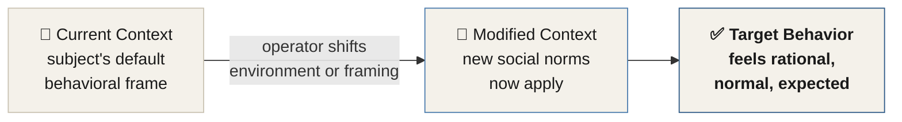
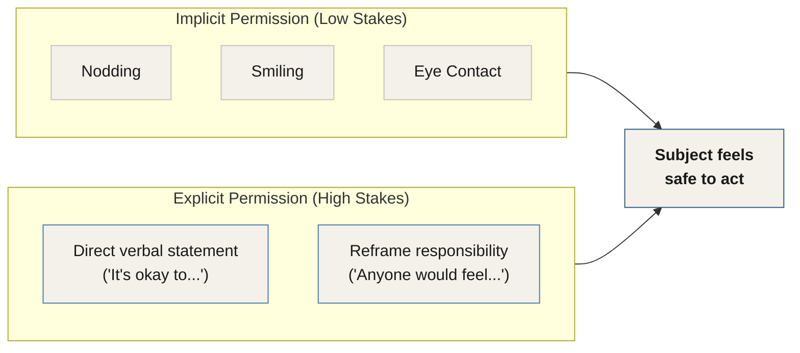

# Chapter 6 — The PCP Model

> *"The PCP model is the foundation of all influence. It contains the raw elements of how all persuasion works — how it starts, how it develops, and how it ends."*

The PCP Model — **Perception, Context, Permission** — is something you will want to revisit on a daily basis to enhance your understanding of how influence works. It is simple. But it is one of the most powerful tools I have ever created.

Breaking down the PCP Model and developing an understanding of how deep this model can penetrate any situation you find yourself in will bring exponential value to your tradecraft.

---

## Where the PCP Model Fits

The PCP Model is the foundation of all influence. Any situation you decide to analyze or deconstruct should *first* be approached using this model before you apply the other tools — such as the 6 Axis Model and the FATE Model. This is not an optional first step. It is the first step.

::: callout
**Sequence Principle.** Always apply the PCP Model before the 6 Axis Model and the FATE Model. The PCP Model identifies the raw conditions; the other tools then give you precision instruments to measure and modify them.
:::

The model contains the raw elements of how *all* persuasion works. Not most. All. How it starts, how it develops, and how it ends. Three letters. Everything.

---

## Perception

::: definition
**Perception** — How a person perceives the meaning of an interaction, and thus makes predictions and assumptions about what is socially and behaviorally acceptable.
:::

Perception can be shifted to modify how a subject defines not only the interaction itself, but the deeper-reaching levels of inner experience — including self-worth.

**A shift in perception is the initial catalyst for deep-level persuasion.** Perception shifting takes place through social, behavioral, and psychological means. When perception is changed early in an interaction, subjects become more suggestible and more likely to eagerly adapt to changes in context.

### How Perception Forms

As human beings, our perceptions are influenced by our beliefs, values, and experiences. These perceptions play a critical role in shaping how we interpret the world around us — including our interactions with others. When we interact with someone, we are constantly making predictions and assumptions about what is socially and behaviorally acceptable, based on those perceptions.

If we perceive that someone is angry, we may assume they are going to yell or become aggressive. The assumption flows automatically from the perception.

But here is the key insight: those perceptions can be shifted. Through social, behavioral, and psychological interventions, you can alter what a subject perceives — and in doing so, you alter every assumption that flows from it. When you shift perception early, the subject enters an altered state of receptivity before the heavier work of the interaction even begins.

::: callout
**Operator Note.** Perception shifting does not need to be dramatic to be effective. A subtle reframe of how a subject reads the social meaning of the moment — what kind of interaction this is, who you are within it, what it is appropriate to feel or say — can be enough to raise suggestibility and open the door to context modification.
:::

---

## Context

::: definition
**Context** — The environment or circumstances that shape or modify a person's social framework and understanding of what social and interpersonal behavior is allowable. This includes the groups with whom they interact and the culture in which they live. Social customs, mindsets, traditions, and behaviors all influence social context.
:::

Context is what makes it acceptable to strip all your clothes off to get into a shower — and what makes it entirely unacceptable to do the same thing in a business meeting. All behavior is subject to context.

> *"Every action you can think of, with few exceptions, is allowable and even expected within the appropriate context."*

As an operator, you will learn throughout this manual to make shifts and changes in context so that a subject feels as though a certain behavior is rational, understandable, and normal.

### Context Controls Behavior

Our behavior is highly influenced by the norms and expectations of the context in which we find ourselves. In a formal business meeting, we behave professionally, avoid informal language, and refrain from making inappropriate jokes. Change the context — and our behavior changes with it.

In a social gathering with close friends, we feel comfortable behaving in a more relaxed and informal manner, using casual language and making jokes that would be entirely inappropriate in a professional setting. In a nightclub with loud music and flashing lights, we feel comfortable dancing and behaving in a more outgoing way than we would in a quiet library.

The same person. Different behavior. The only variable is context.

::: callout
**Operator Principle.** By modifying the context, you can make any behavior possible. Context defines the invisible rules everyone in the room is following — and you are the one who gets to write those rules.
:::

### What Context Modification Looks Like in Practice

When you want to encourage a team-building activity, you create a relaxed, informal environment that fosters collaboration and open communication. When you want to discourage a negative behavior — such as smoking — you change the context by creating a smoke-free environment or promoting healthier alternatives.

The principle scales to every influence scenario. The examples change; the mechanism does not.

*Figure 6.2 — Context modification. Shifting the subject's contextual frame makes the target behavior feel expected rather than unusual.*

---

## Permission

::: definition
**Permission** — In a tradecraft sense, the degree to which a person feels both the *ability* and the *license* to perform an action that is suggested or implied from an outside source.
:::

Permission provides reassurance and comfort during any time a prediction cannot be reliably made about the outcome of a situation. It provides individuals with a license to behave in certain ways — and it diffuses their feeling of responsibility for the outcomes of their actions.

### Why Permission Matters

Permission is an essential component of human behavior. When individuals feel they have permission to behave in a certain way, they are far more likely to do so without fear of judgment or repercussion.

I have often found that people are held back by their own beliefs and perceptions about what is socially acceptable. A person may feel that it is not appropriate to express their emotions openly in front of others. In such cases, granting permission is a powerful tool for helping that individual overcome their inhibitions.

By explicitly giving someone permission to express their emotions, you are effectively removing the barriers that may be holding them back. You are not changing who they are. You are dismantling the invisible fence.

::: callout
**Key Insight.** Permission does not necessarily mean giving someone explicit verbal consent to do something. Rather, it is about creating an environment where people feel safe and comfortable enough to be themselves.
:::

### Explicit and Implicit Permission

In low-stakes situations, permission may be given entirely through nonverbal cues — nodding, smiling, or making eye contact. Each of these signals to the subject that their behavior is acceptable and welcomed. The message is received without a single word being spoken.

In higher-stakes situations, permission may need to be stated directly. The delivery changes. The mechanism does not.

*Figure 6.3 — Implicit vs. explicit permission. Both paths lead to the same outcome: a subject who feels safe enough to act.*

---

## The PCP Model in Sequence

Understanding the three components in isolation is only the beginning. The real power of the PCP Model is in how these elements chain together. Each one prepares the ground for the next.

| Step | Component | What the Operator Does | Effect on the Subject |
|------|-----------|----------------------|----------------------|
| 1 | **Perception** | Reframe how the subject reads the situation | Raises suggestibility; subject becomes more receptive |
| 2 | **Context** | Modify the social and environmental frame | Normalizes target behavior; reduces social resistance |
| 3 | **Permission** | Grant the license to act (explicitly or through nonverbal cues) | Removes inhibition; subject acts without fear of judgment |

*Figure 6.4 — The PCP sequence. Each step creates the conditions the next step requires.*

Perception shifts make context modification easier. Context modification makes permission more effective. When all three are operating together, the subject does not experience what is happening as influence. They experience it as a natural and comfortable decision of their own.

---

## Key Takeaways

- The **PCP Model** stands for **Perception, Context, Permission** — and it is the foundation of all influence, containing the raw elements of how persuasion works, how it starts, how it develops, and how it ends.
- **Always apply the PCP Model first** — before the 6 Axis Model or the FATE Model. It is the entry point for analyzing or deconstructing any influence situation.
- **Perception** is how a subject interprets the meaning of an interaction and forms assumptions about what is socially acceptable. Shifting it early raises suggestibility and opens the subject to context change.
- **A shift in perception is the initial catalyst for deep-level persuasion.** It takes place through social, behavioral, and psychological means — and does not need to be dramatic to be effective.
- **Context** defines what behavior is allowable. The same person will behave radically differently in a business meeting versus a nightclub — same person, different context. As an operator, you write the rules of the context.
- **Modify the context and you make any behavior possible.** Every action, with few exceptions, is allowable and even expected within the appropriate context.
- **Permission** is the degree to which a subject feels both the *ability* and the *license* to perform an action suggested by an outside source. It provides reassurance, and it diffuses personal responsibility.
- People are frequently held back not by lack of desire but by lack of permission. **Granting permission — explicitly or implicitly — removes the invisible barriers** between the subject and the behavior.
- **Permission does not require words.** Nodding, smiling, and eye contact are all sufficient in low-stakes situations. The mechanism is the signal — not the medium.
- The three components work as a **chain**: Perception sets the stage, Context normalizes the behavior, and Permission delivers the license to act. When all three are working together, the subject experiences it as a natural, self-directed decision.

<!--
## Change Log

| Original (transcript) | Corrected | Reason |
|---|---|---|
| "penitent any situation" | "penetrate any situation" | ASR error; "penitent" makes no sense in context; "penetrate" fits Charles's meaning of the model reaching deeply into any scenario |
| "trade credit" | "tradecraft" | Consistent ASR mishearing throughout the manual |
| "the fake model" | "the FATE Model" | Consistent ASR mishearing throughout the manual (documented in ch5 change log) |
| "waters socially" | "what is socially" | ASR error; "waters" is a mishearing of "what's" |
| "business music" | "business meeting" | ASR error; makes no contextual sense |
| "culture in which they lip" | "culture in which they live" | ASR error; "lip" is a mishearing of "live" |
| "in a more relaxed and informed manner" | "in a more relaxed and informal manner" | ASR error; the contrast with "formal" makes clear the author said "informal" |
| "icon terms" | "eye contact" | ASR error; "making icon terms is a signal" → "making eye contact is a signal" — nonverbal cue context confirms this |
| "what I'm not. I modifying" | "what is not. By modifying" | ASR garbled phrase; reconstructed from context ("what is not" completes the contrast; "By modifying" opens the next clause) |
| "An individuals feel" | "When individuals feel" | ASR mishearing of "When" as "An"; grammatically corrected |
| "is important to note" | "It is important to note" | Missing word "It" — likely ASR drop of sentence-initial word |
-->
