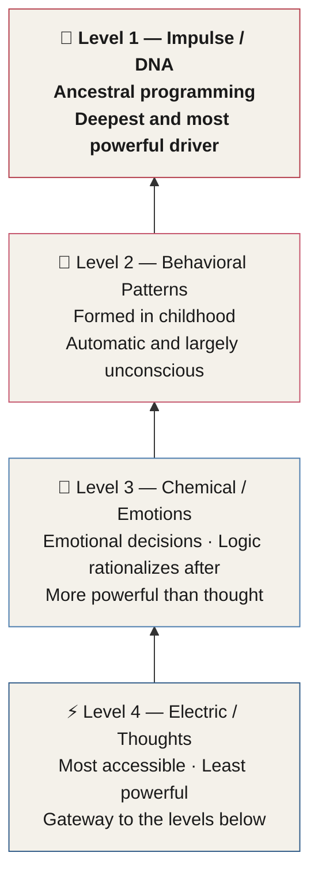
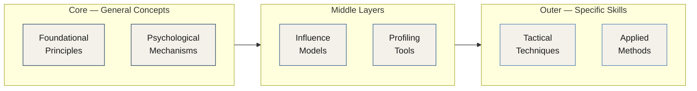

# Chapters 7 & 8 — The Authority Triangle, Hierarchy, and Behavioral Toolkit

> *"The authority triangle is the centerpiece of influence and persuasion capacity — it spells out the fundamental ingredients of true authority."*

Five models form the operational backbone of the entire Behavior Ops system. Together they answer three critical questions: What makes you an authority? What levers inside another person drive influence? And what tools will you use to read, plan, and execute?

---

## The Authority Triangle

The **Authority Triangle** is the centerpiece of influence and persuasion capacity. It spells out the fundamental ingredients of true authority — and those ingredients are what make deep-level influence possible.

Each side of the triangle represents a different category of qualities. Together they define what you project as an operator, what others unconsciously perceive, and which lifestyle habits either support or undermine your authority.

| Side | Full Name | Belongs To | Role |
|------|-----------|------------|------|
| **B** | Behavior | The Operator | Internal traits that produce the external representation of authority |
| **E** | Effect | The Subject | What others unconsciously perceive to decide whether authority is present |
| **H** | Habits | The Operator | Lifestyle areas where problems cause nonverbal behaviors that undermine authority |

*Figure 7.2 — The three sides of the Authority Triangle and their roles.*

### Side B — Behavior

The Behavior side of the triangle details the characteristics that make up the **external representation of authority**. These are the internal traits of the operator:

- **Confidence**
- **Discipline**
- **Leadership**
- **Gratitude**
- **Enjoyment**

These traits are not abstract virtues — they are behavioral outputs. The way confidence manifests in posture, voice, and decision-making. The way discipline shows in consistency and follow-through. The way genuine enjoyment radiates in energy and presence. Each trait produces observable, unconsciously perceived signals that either build or erode the authority others assign to you.

### Side E — Effect

The Effect side of the triangle is what others **see unconsciously** to decide whether a person is an authority. These are the tripwires that must be met to activate the ancestral scripts that respond to authority. They are the effects the subject goes through when encountering a true authority:

- **Movement**
- **Appearance**
- **Confidence**
- **Connection**
- **Intent**

::: callout
**Tripwire Principle.** The Effect side operates below conscious awareness. A subject does not think "this person moves with purpose, therefore I recognize their authority." The recognition happens automatically, via ancestral scripts that have been running for thousands of years. If these tripwires are not met, those scripts do not activate — and no amount of words or credentials will compensate.
:::

### Side H — Habits

The Habits side lists the lifestyle areas — **in order** — most likely to cause unwanted behaviors that detract from your authority. Issues in these areas will produce nonverbal behaviors that are unconsciously and negatively perceived by others:

- **Environment**
- **Time**
- **Appearance**
- **Social**
- **Financial**

::: warning
**The Habits Cascade.** Problems in these lifestyle areas do not stay contained. They leak into nonverbal behavior — posture, microexpressions, vocal tone, eye contact — and others pick them up unconsciously. The authority they assign to you is silently discounted, even when they cannot articulate why. The authority section of this manual will cover all of these in depth, with a full assessment to help you determine your current level of authority and specific steps to improve each side of the triangle, maximizing your effectiveness for human outcomes.
:::

---

## The Hierarchy of Influence Factors

The **Hierarchy of Influence Factors** illustrates what we can leverage inside another person to influence, persuade, motivate, and inspire them to action.

Much like Maslow's Hierarchy of Needs, this hierarchy is laid out so that **the base of the pyramid is the most fundamental and the most powerful motivator**, while the top is the weakest when it comes to influence.

Reading from the bottom up:

### Level 1 (Base) — Impulse / DNA

> *"We are more influenced by our ancestors than by anything else."*

At the foundation lies **ancestral programming** — the impulses and instincts encoded over thousands of years of evolution. This is the most powerful force available to anyone seeking to influence human behavior. It predates thought, emotion, and learned habit. When you activate an ancestral script, you are working at the deepest level of the human operating system.

### Level 2 — Behavioral Patterns

The **patterns of behavior we form in childhood and beyond** are a formidable force in our lives — governing much of what we do, often without awareness. Where ancestral impulse is hardwired from birth, behavioral patterns are conditioned over a lifetime, but they operate just as automatically.

### Level 3 — Chemical (Emotions)

We are **emotional decision makers**. When we make decisions, we use logic to rationalize the action afterward — but chemistry has more influence over that decision than electrical activity does. Emotion is not the weakness in human reasoning; it *is* human reasoning at its most honest level.

::: callout
**The Rationalization Trap.** When you make an emotional decision, the story you tell yourself about *why* you made it is constructed after the fact. The chemistry happened first. Understanding this is one of the most important operating principles in all of Behavior Ops.
:::

### Level 4 (Apex) — Electric (Thoughts)

Our thoughts are **electrical fireworks** — and they are only the gateway to everything else. Electrical activity is important and vital, but where that electricity goes and what chemicals it triggers in the brain are exponentially more important than the thought itself. Targeting someone's conscious thoughts is the most accessible lever available, but it is the weakest one on the hierarchy.

::: definition
**Why the Hierarchy Matters.** This model will be referenced continuously throughout the manual. It is your guide for choosing *where* to target influence at any given moment. Working at the base requires more skill — but produces deeper, more durable change. Working at the apex is easier to access but produces shallower results.
:::

*Figure 7.4 — The four levels of the Hierarchy of Influence Factors, shown bottom-up. Arrows represent the path from the most accessible (top) to the most powerful (base).*

---

## The Behavioral Table of Elements (BTE)

The **Behavioral Table of Elements** — or **BTE** — is a profiling tool that enables the **rapid detection of stress and discomfort in people**.

It was initially designed exclusively for the US government to provide a **universal language** for intelligence operators communicating about behaviors witnessed in interrogations. It has since become a global standard, translated into **13 languages** and rooted in peer-reviewed research that is updated annually to reflect new and emerging science.

Today the BTE is also used to **program and train artificial intelligence systems** deployed for security and threat prediction — making it one of the few behavioral science frameworks to cross from human intelligence into machine learning applications.

::: definition
**BTE — Three Functions.**
1. A **profiling tool** for the rapid detection of stress and discomfort in real time.
2. A **training system** providing a universal shared language for operators.
3. A **postmortem tool** for analyzing video captured from any situation.

The BTE will be covered in depth in the behavior profiling section.
:::

| Function | Description |
|----------|-------------|
| **Profiling** | Real-time detection of stress and discomfort in a subject |
| **Training** | Universal language enabling operators to communicate precisely about observed behaviors |
| **Postmortem** | Video analysis tool for any captured interaction or incident |

*Figure 7.5 — The three functions of the BTE.*

---

## The Taxonomy of Human Influence

The **Taxonomy of Human Influence** is a master model you will continually refer to throughout your training. As complex as it appears at first, it will become a valuable resource as you progress.

::: callout
**Notice this.** Linguistic skills are not on the Taxonomy model. Words and language — the thing most people instinctively reach for when they think about persuasion — do not appear here. This model operates at deeper mechanisms entirely.
:::

The Taxonomy shows the **logical progression of influence and persuasion**, moving from general concepts on the inside to specific skills and techniques on the outside. As you progress, each phase will become clearer, and you will develop a deeper understanding of what influence actually is and how it works.

*Figure 7.6 — The Taxonomy of Human Influence. General foundational concepts sit at the core; specific applied techniques sit at the outer edge.*

Over time, you will find that many layers or steps can be skipped completely, while others are vital to the skill level you are developing. The Taxonomy will serve you long into the future — both as a **training tool** and as a **planning tool** for real-world situations.

---

## The Skills Map

The **Skills Map** is included here only for reference as a member of the Pillars of Influence. It serves as a model of what is possible regarding tactics and techniques, and helps you determine which techniques you will learn are most effective for targeting the **FATE Model** and the **6 Axis Model**.

The Skills Map is not a checklist or a fixed curriculum sequence. It is a compass — something you will return to throughout your training to orient yourself within the larger landscape of what Behavior Ops makes available to you.

---

## Key Takeaways

- The **Authority Triangle** (B–E–H) is the centerpiece of influence and persuasion capacity. It defines the fundamental ingredients of true authority and what makes deep-level influence possible.
- **Side B (Behavior)** covers the internal traits of the operator that produce the external representation of authority: Confidence, Discipline, Leadership, Gratitude, and Enjoyment.
- **Side E (Effect)** describes what subjects perceive *unconsciously* to decide whether authority is present — Movement, Appearance, Confidence, Connection, and Intent. These are the tripwires that activate ancestral authority scripts. If they are not met, authority does not register, regardless of credentials or intent.
- **Side H (Habits)** lists the lifestyle areas — Environment, Time, Appearance, Social, Financial — where unresolved problems *leak* into nonverbal behavior and silently undermine authority. The authority section includes a full assessment and corrective steps for each side.
- The **Hierarchy of Influence Factors** is a four-level pyramid. The base (Impulse / DNA) is the *most* powerful; the apex (Electric / Thoughts) is the *least* powerful. Influence deepens as you move down the pyramid.
- **We are emotional decision makers.** Chemistry drives the decision; logic rationalizes it afterward. Targeting the Chemical level is therefore significantly more powerful than targeting thoughts alone.
- **Ancestral programming** is the most potent driver of human behavior — more powerful than habits, emotions, or rational thought. Working at this base level requires the most skill but produces the deepest, most durable change.
- The **Behavioral Table of Elements (BTE)** is a peer-reviewed, government-developed profiling tool for rapid detection of stress and discomfort. It functions as a profiling tool, a training system, and a postmortem analysis tool — and is now used to train AI systems for security and threat prediction. It has been translated into 13 languages.
- The **Taxonomy of Human Influence** maps the full logical progression of influence and persuasion, from foundational principles inward to specific applied techniques outward. Linguistic skills do not appear on this model.
- The **Skills Map** — a member of the Pillars of Influence — shows the full range of possible tactics and techniques, and orients which ones are most effective for targeting the FATE Model and the 6 Axis Model.

<!--
## Change Log

| Original (transcript) | Corrected | Reason |
|---|---|---|
| "Expect. The effects the subject goes through." | "Effect." (side name) | ASR error — the side of the triangle is named "Effect"; the word "The effects" immediately following confirms it |
| "Abbots. The habits of the operator that make authority possible." | "Habits." (side name) | ASR error — the side is "Habits" not "Abbots"; "The habits of the operator" immediately following confirms it |
| "tanks on? Anony of human influence" | "Taxonomy of Human Influence" | Severe ASR garble — "tanks on? Anony" is a mishearing of "Taxonomy"; confirmed by context and subject matter |
| "fate model" | "FATE Model" | Consistent ASR mishearing throughout the manual |
| "6 axis model" | "6 Axis Model" | Consistent ASR mishearing throughout the manual |
-->
