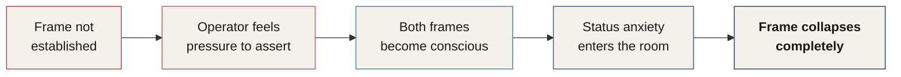

# Chapter 9 — Mastering the Social Frame

> *"Anyone can be confident in the shower. The frame is what holds your confidence when you're in the presence of others."*

Every interaction you will ever have is shaped by an invisible architecture — the frame. Understanding how frames work, how they collide, and how to build one powerful enough to contain others without crushing them is one of the most fundamental operating skills in Behavior Ops.

---

## What Is a Frame?

A **frame** is the internal definition a person creates out of a social interaction. It is how that person views the world in a given situation — shaped by their past experiences, beliefs, and self-image.

Our society exists largely because of unspoken contracts between individuals. Following social norms makes life easier by freeing up cognitive energy for other decisions. The way you view the world *is* a frame. Everyone views the world through frames at all times, and very few people are consciously aware of this throughout their day.

When two people meet, they each bring a frame to the situation. **The person who has the strongest frame will assume control over the meaning and context of the situation.** Frames continually battle with each other in the background — almost completely outside of awareness. When one person's beliefs and confidence levels are higher, their frame is adopted by the other person unconsciously.

::: definition
**Frame** — The internal definition a person creates out of a social interaction. Shaped by past experiences, beliefs, and self-image, the frame controls how someone interprets the meaning of what is happening around them.
:::

You are always influenced first by your own frame. Control over the meaning of the interaction shifts to the other person — unless you understand frames and know how to ensure your frame is more in control than theirs.

Although this sounds Machiavellian, it is happening unconsciously every day of your life. You are now simply making a choice to be intentional about it — to do things in a way that allows you to help the most people possible.

---

## The Anatomy of a Frame

A frame is comprised of four corners: **Expectation, Beliefs, Perception,** and **Definition**.

These corners are listed in order of difficulty — from the **easiest** to bypass to the **most difficult** to bypass. When your frame must be stronger than someone else's, you address each corner in exactly this sequence. Building your own frame follows the same process.

### Corner 1 — Expectation
*"What's probably going to happen is…"*

Expectation is first because it is the easiest to exploit or subvert. You already know what a life script is — which means you can make reasonable assumptions about what a person is likely to expect in various scenarios.

If someone is an employee at Starbucks, for example, you know they are expecting you to approach the counter and place an order. This expectation could be subverted very easily by doing something that breaks it.

When something occurs that we do not expect — like a stick snapping behind a bush — it generates automatic and immediate focus. This injection of novelty causes the brain to behave as though it is saying: *"Whoa. This is different from the other times. I need to pay attention. The autopilot script I have for this doesn't apply here."*

### Corner 2 — Beliefs
*"What's probably true about this situation is…"*

Beliefs are the second consideration because they are the second easiest to subvert. The beliefs within a mental frame refer to what a person believes to be true about the situation — not what they predict will happen (that is expectation), but what they believe about the environment they are in.

These are the beliefs they hold about themselves, about you, and about the social construct of the environment. They are also a measure of how someone views their own social capacity within the interaction — the assumptions they are making about your status and about how they are permitted to interact with you.

If you are at a convention or networking event wearing a suit, someone's belief might be that they can approach you on equal social standing — that the conversation will be more or less on equal footing. People are always making unconscious assumptions about your status and authority, and comparing it to their own.

**Here is the three-step process to subvert the Beliefs corner:**

1. Subvert the Expectation corner — cause something to happen that lets their brain know this is not what they expected.
2. Determine or estimate what they are likely to believe about the situation from a hierarchical perspective.
3. Ensure your behavior is above their expectations without resorting to overpowering them.

::: callout
**The Status Trap.** The more conscious you are of social standing and hierarchy, the less you will have it in social interactions. The single greatest failure of every operator I have ever trained is worrying about — or even obsessing over — where they fall on the social status hierarchy compared to others. When you truly have confidence, you will no longer think about where you stand.
:::

### Corner 3 — Perception
*"What's true about this is…"*

Nothing about someone's perceptions is *the* truth — they are only what that person believes to be true through their own lens.

The Perception corner is what someone believes to be factually true about themselves and the environment. If someone genuinely believes they are smarter than most people, this will operate as fact within the Perception corner of their frame. People tend to default to these perceived facts to feel better about who they are and what they can do.

If you are approaching a security guard at a large office building, the Perception corner of their frame contains the fact that they are in charge — that they have the authority to control the conversation. At a networking event, someone might continuously remind themselves that they are a senior vice president and therefore possess social status and authority.

Here is how a person's frame begins to collapse into yours:

1. You have created a situation where they can no longer make predictions about you.
2. You have behaved in a way they didn't expect, which has stopped them from making assumptions about your behavior.
3. Now, in the Perception corner of their frame, they can no longer resort to a solid foundation of "truth" about the situation — and so they become more open and willing to assume your frame.

### Corner 4 — Definition
*"What's absolutely true is…"*

Definition refers to a person's position, title, the rules they must follow, and the actual authority granted to them in the current situation. Other people in the room would most likely agree with everything a person holds in the Definition corner.

At a networking event, the director of the event uses this truth to feel more confident, more at ease engaging with others, and more comfortable having conversations with everyone in the room. These definitions give us psychological permission to behave in ways we might not otherwise behave.

Definition is the **most difficult** part of a frame to change — but it is exponentially easier to change and subvert once the other three corners are addressed.

> **Note:** We are not modifying facts. Rather, we are making the facts less needed and less relevant to this person.

| Corner | Inner Question | Agreed upon by… |
|--------|---------------|-----------------|
| **Expectation** | What's probably going to happen? | This person alone |
| **Beliefs** | What's probably true about this situation? | A supportive mother would agree |
| **Perception** | What's true about this? | Their friends would agree |
| **Definition** | What's absolutely true? | Almost everyone would agree |

*Figure 9.2 — The four corners of the frame and whose reality each one occupies.*

---

## How Frames Work in Practice

Let's look at a real scenario. When a client asks why they should be working with you, they are pushing you into their frame. Here is what that frame might look like:

- **Expectation** — *"This person is selling something. They will probably act like other salespeople."*
- **Beliefs** — *"They will talk to me about the features and benefits of their services. I will be able to ask questions about it to determine whether I should buy."*
- **Perception** — *"I've done this before. I'm not a pushover. I won't make decisions without knowing everything I can. I'm talking to a salesperson who needs me and needs my money."*
- **Definition** — *"I'm in a position to say no. This salesperson is calling to offer me something, and they want me to say yes."*

What most people feel in this situation is a need to assert themselves — because their own frame isn't in place.

When the frame doesn't do the work on its own, many people resort to using language and behavior to force their frame to be accepted. This has two massive problems:

1. It brings both frames into each person's conscious mind.
2. It brings the concern about status and hierarchy into the conscious mind of the operator — ruining their ability to use their frame at all.

*Figure 9.3 — The collapse chain: when the frame isn't established and the operator tries to force it.*

---

## Large Framing — A Better Way to Think About This

When you have a powerful frame, you only gain control of other people's frames — not the people themselves.

There is one proven, successful way to establish your frame. But when I tell you what it is, it will likely trigger a desire to bring status and hierarchy into your conscious mind. Please resist that thought.

**Enter strong and gain control immediately — but do so while making the person feel confident and important.** This is the behavior of a leader.

Here is what framing is **not**:

- Controlling
- Domineering
- Concerned with status
- Concerned with hierarchy
- Positioning for power

Instead of using the phrase *frame control*, use the alternative: **large framing**.

::: definition
**Large Framing** — Growing your frame to a size where others fit comfortably *within* it, rather than controlling or destroying anyone else's. The phrase assumes nothing about the other person and focuses only on the growth of the operator's own frame.
:::

Your main task as an operator is to grow your frame to a size where it can comfortably and calmly *contain* — rather than crush — other people's frames. Once your frame is large enough and strong enough, it provides other people's frames with a protected area to rest and relax within.

Since framing is an unconscious process, people do not resist adopting someone else's frame in social settings. Let the frame do the work on its own.

---

## The Three Roadblocks to Large Framing

Three major roadblocks prevent large framing. These are the most common obstacles in the years I have spent training operators to be the most confident person in the room:

1. **A fear of social judgment.**
2. **Fixation on how you are being perceived.**
3. **Deriving your identity, confidence, or self-worth from social feedback.**

::: warning
**Self-Control Is Everything.** As a behavior profiler, the first thing I typically look for in any person I meet is their level of self-control — from posture and composure to the habits that show in their appearance. Self-control is the pivotal change-maker of this world. It is the single deciding factor between massive success and failure. You can determine someone's level of self-control by observing how they drive a vehicle. People with low self-control weave through traffic or speed up as they near an exit.
:::

---

## How Frames Develop: The Parent–Child Model

Every social interaction involves a minimum of two frames. The larger frame will always take over — and people are completely fine with this, because the process of assuming someone else's frame is unconscious.

When parents have a very young child, the parents' frame wins without contest. Think about how a parent uses the four corners of the frame to establish social control of the relationship.

During adolescence, the child begins developing a firmer frame. As they mature, their frame develops in **reverse order** — from the hardest corner to the easiest:

1. They initially form **definitions** of what is absolutely true.
2. Their **perceptions** become sharper.
3. Those perceptions lead them to form **beliefs** about the world and themselves.
4. Once they see the world through those beliefs, they form more concrete **expectations** of what to expect and what they can get away with.

Teenagers often begin testing a parent's frame — starting by doing something the parents don't expect, modifying the beliefs the parents have about their own authority. The parent then changes their perception. If the child successfully takes control, the parent's definitions shift to a new reality in which the child is permitted to behave in new ways.

::: callout
**Build the Frame — Then Forget It.** The more an operator is conscious of frames in social settings, the weaker the frame will be. Build the frame — then forget about it completely. Frames should be *assumed*, not *used*.
:::

---

## Competitive vs. Collaborative: The Two Frame Mindsets

There are two mindsets around framing, and one is exponentially more powerful than the other.

| Mindset | Orientation | Outcome |
|---------|-------------|---------|
| **Competitive** | Hierarchy, status, control, power, social standing | Weakens your frame; rooted in insecurity |
| **Collaborative** | Every interaction lifts both people | The leader's mindset — always wins |

*Figure 9.4 — Competitive vs. Collaborative frame mindsets.*

The competitive person is permanently concerned with where they stand in the hierarchy. This is bad news. A collaborative person sees every interaction as a collaborative effort that brings both people up. That is the leader's mindset.

When a collaborative person meets a competitive one, the collaborative frame wins — but *only if the frame is large*. Once the competitive person sees there is no threat of competition or status, they surrender — because they feel safe within the collaborative frame.

This is why people were kinder to their neighbors in Hawaii after Pearl Harbor. It is why a hurricane can bring communities at war together. When your frame is collaborative rather than competitive, you will never have to worry about frame control.

---

## The Five Frames That Always Win

When someone begins to challenge your frame, there are five frames you can assume. The first is the most recommended.

### 1. The Father Frame

The Father frame is what a fatherly role model looks like. This is the most recommended frame for all of life — not just when you need it on occasion. Let it become a habit rather than a technique.

This frame is about composure and maturity: lifting others up, providing encouragement, and projecting confident authority with kindness and stillness in equal measure. It is largely unaffected by other frames and almost always assumes custody of the frames in the room.

### 2. The Child Frame

The Child frame is all about testing other people's frames. Instead of projecting their own frame, the person using a Child frame challenges others by poking at their frames — questioning credibility, intentions, and status. It's never fun to encounter. The reason the person is testing so much is that it is the only way they can assume any control. Since the Child doesn't really have a frame of their own, they gain control by subverting or questioning everyone else's.

When you recognize the Child frame in someone, you can safely assume your frame is significantly larger than theirs. This is a good thing — they will buy into your frame. Give them what a child needs: the Father frame.

::: callout
**The Child Frame as a Signal.** When someone is aggressively testing your frame, treat their behavior as interesting to witness. When you react to the test with humor rather than defensiveness, it tends to soften the edges of the other person's frame — and their challenge evaporates.
:::

You can also respond with the Child frame yourself: non-reactive, showing no reaction to the other person's behavior, or even pretending the attempt to subvert you never took place at all. You can picture this as imagining yourself simply staring at someone instead of replying when they say something to challenge you. This gives the impression the other person has limited power or significance in the situation.

### 3. The Mirror Frame

The Mirror frame reflects the challenge back to the person — showing them what their attempts look like.

In one form, you repeat their words back to them. In another, you narrate what just happened and then shift back to being non-reactive. Repeating their words back brings their attempt into the open, where they can examine it themselves. Calmly explaining their behavior in plain language drains the power from their frame instantly.

> *Example: Someone in a public setting questions you to make you look less credible. Your response, delivered with a smile:*
>
> *"It's not often someone openly questions my credibility. That could be persuasive to some people — a way to bring someone down. You don't seem like that kind of person, though. I'd be happy to chat about your question in a few minutes."*

### 4. The Crazy Person Frame

The Crazy Person frame operates as if you exist on an entirely different plane of existence from the other person. You might behave as though you didn't hear them and speak only about something completely unrelated. You might acknowledge them but act as though they said something entirely different from what they actually said.

This frame is useful when someone without a strong frame is challenging you and you need to quickly demonstrate that their behavior will not affect you in any way. It sends a clear signal that their challenge will not succeed. You would be surprised at how many people are unwilling to escalate frame testing.

> *Example: Someone says, "I think you've got a ton of crappy material, Charles."*
>
> *Long, awkward pause while looking or facing away.*
>
> *"I've been craving a McDonald's ice cream cone for like two weeks. Those machines are broken half the time though. Do you know karate?"*

### 5. The Detached Person Frame

When someone is detached, they lack the capacity to participate evenly when it comes to emotional involvement and contribution. The detachment appears in social settings as a non-reactive, confident demeanor.

Think of the difference between a mirror and a black wall. The key to this method is to show zero reactivity to the other person's injected disturbance — allowing 100% of the emotion to stay on their side of the conversation.

---

| Frame | Core Posture | Best Used When… |
|-------|-------------|-----------------|
| **Father** | Composure, maturity, authority with kindness | Default — make it your permanent operating frame |
| **Child** | Non-reactive; ignores or stares down challenges | Their testing reveals their frame is smaller than yours |
| **Mirror** | Reflects the challenge back in plain language | A calm, articulate exposure will deflate the attempt |
| **Crazy Person** | Operates on a completely different plane | You need to quickly show the challenge won't land |
| **Detached** | Black-wall non-reactivity; emotion stays on their side | Zero engagement with the disturbance is the message |

*Figure 9.5 — The Five Frames and their optimal deployment.*

---

## Responding to Frame Challenges

When someone challenges your frame, **composure, maturity, and authority** are the cornerstone character traits above all else.

**Kill monsters while they are small** — long before they grow. Do not allow an undesired behavior to repeat itself more than once. Every repetition rewards the behavior and increases the challenger's confidence in continuing it.

When someone is accusing you or questioning you in an attempt to control the frame, **never respond by defending yourself or speaking about yourself.** Instead, redirect every response back to them:

> *"You seem to feel quite strongly about this."*
>
> *"It looks like you have a lot going on."*
>
> *"You definitely have some persuasive comments."*
>
> *"These questions seem to come from a good place. I'll bet you have a lot on your plate."*
>
> *"You seem to be very concerned about this. It's not often I see so much emotion — that's pretty rare."*

You can also respond by simply talking about something completely different from the original challenge. The amount of attention you pay to these people is also important. If your frame is large, it has no place for someone who is challenging you — and your self-worth dictates that your attention belongs elsewhere.

::: callout
**Always Assume the Collaborative Mindset.** When someone attempts to challenge you, they are trying to bring you into their frame and draw you into their conversation. When you simply assume the Father frame, you no longer need any techniques to deal with these people. Your responses become automatic because of the frame you have adopted.
:::

---

## Warning Shots

We tend to rely on the fact that most people are not willing to escalate conflict and will default to peace and safety. This means you can escalate *extremely* fast — the moment a challenge is presented.

Used rarely and carefully, a warning shot can be highly effective. The only reason to use it sparingly is that it pulls you away from collaborative and toward competitive. But when it is needed, here are softer warning shots that extinguish most frame challenges:

> *"Was your intention to be rude?"*
>
> *"Did you intentionally say that like that?"*
>
> *"What is it you'd like to get out of this conversation?"*
>
> *"This didn't seem like an attempt to gain some kind of dominance until just now."*
>
> *"Is everything okay? You certainly don't seem like the 'I need to assert dominance' kind of person."*
>
> *"Have I done something to upset you?"*
>
> *"I know that you've got more self-control than that — is something wrong?"*

In each example, the person is offered a gracious pathway to retreat. You are providing them the opportunity to admit a mistake and helping them save face by adopting your frame. It is often even more effective to insert a self-admission — something like: *"I've been extremely stressed before, and I know it made me act in ways I didn't mean to."*

::: callout
**Sun Tzu's Principle.** *"Build your opponent a golden bridge to retreat across."* Giving someone a dignified exit is more powerful than cornering them — because they will adopt your frame willingly rather than under duress. This principle appears again in the interrogation section.
:::

---

## Avoiding Frame Challenges: The "Those Types" Call-Out

This technique should always be delivered with a smile. You simply assume the person is not one of *those types* of people — the ones who behave the way they are currently behaving:

> *"Jason, I know you pretty well, and I know you're not one of those types of people. Something has to be way off here. Is there something I said?"*

This is spoken in the frame of a mentor — with more composure and leadership than anything else. Read on the page it may seem snarky, but it is spoken in the verbal tone of Andy Griffith or Barack Obama: calm, warm, and from a position of quiet authority.

**Quick notes on avoiding and responding to challenges:**

- Address everyone present to make them all feel involved — not just the most confident people in the room.
- Let your attention wander and give aloof body language when someone is rude. Do not let it occupy real estate in your focus or mind.
- Act as though it is not happening, or as though that person's voice carries no significance.
- Don't let your ego decide what to do. Be open to it all. Let the situation happen without worrying about status and hierarchy.
- When they are back on track, give positive attention, openness, and receptivity — and use their name in conversation.

---

## Pacing Reality

When you pace someone's reality, you get them to unconsciously agree with you. Their mind cannot help but agree with what you are saying, which creates a momentary pattern of agreement that makes them more likely to accept your terms.

Examples of pacing reality:

> *"There's a good case there, for sure."*
>
> *"I totally agree that…"*
>
> *"So many people I know think the exact same way."*
>
> *"You raised such a great point. That's absolutely correct, in my opinion."*

You can also pace by naming what they are thinking while you are speaking:

> *"I know that's a scary idea."*
>
> *"I realize that's absolutely ridiculous on its face."*
>
> *"This idea is really hard to accept — it's unusual, weird even."*
>
> *"I totally get your point, and I don't want to knock it down at all. It's actually really spot on."*

---

## Using Archetypes to Get Out of Anything

Dr. Jordan Peterson is a master of this technique. When someone brings up an argument or challenges his frame during a heated interview, he will often bring up a story archetype in his speech and compare what is being discussed with a classic narrative pattern.

This works on several levels simultaneously:

1. The other person's mind instantly identifies with the story.
2. They are inclined to agree that there is potential correlation between the two narratives.
3. They are inclined to accept the comparison because it sounds well-considered — even if they don't fully grasp it.

**Archetypes will create more agreement than arguments.**

---

## The Seven Story Archetypes

There are seven foundational story archetypes. Understanding these well enough to reach for them in real time gives you a vehicle that bypasses argument and generates agreement at a deep, unconscious level. They will be explored in far greater depth in the storytelling section of this book.

### 1. Rags to Riches

The rags-to-riches archetype follows an individual who transitions from poverty to wealth — or from very little to great abundance — through extraordinary circumstances, action, or luck. Ultimately, they gain the love, respect, admiration, and power they initially lacked.

*Examples: Cinderella (Charles Perrault); Aladdin (Arabian Nights, trans. Sir Richard Burton); Great Expectations (Charles Dickens); Jane Eyre (Charlotte Brontë); The Great Gatsby (F. Scott Fitzgerald).*

### 2. The Quest

The classical quest archetype follows a hero who must face suffering, remove obstacles, and persevere through difficult times in pursuit of something vital — a place, a person, or an objective. The result is often a powerful display of loyalty and commitment.

*Examples: The Odyssey (Homer); Beowulf (Anonymous); The Epic of Gilgamesh (Anonymous); Ramayana (Indian epic); The Quest for the Holy Grail (trans. Pauline M. Matarasso).*

### 3. Rebirth

The rebirth archetype uses the cycle of death and renewal as its central theme. Protagonists are given a chance to reflect on the lives they have lived and grow through that reflection. These stories convey the importance of self-knowledge and personal transformation.

*Examples: Paradise Lost (John Milton — the story of Adam and Eve); Lancelot and Guinevere (Chrétien de Troyes); My Name Is Memory (Ann Brashares); The Incarnations (Susan Barker).*

### 4. Defeating the Monster

The hero-versus-monster archetype represents the triumph of good over evil — demonstrating that with courage, self-belief, and resilience, anything is possible. Ancient tales such as that of Oedipus, the first great hero who overcame the Sphinx to take the throne of Thebes, have shown us time and again how this concept generates powerful, persuasive messages.

*Examples: Beowulf (Anonymous); Dracula (Bram Stoker); Day of the Triffids (John Wyndham); Jack and the Beanstalk; Coraline (Neil Gaiman).*

### 5. Comedy

Comedy archetypes — the neurotic, the rebel, the innocent, the eccentric, the buffoon, the cynic, the narcissist, the dreamer — create connection through humor and lightheartedness. By subtly including comic elements in communication, a persuader can achieve greater effects partly through the power of laughter and its capacity to dissociate emotion.

*Examples: Three Men in a Boat (Jerome K. Jerome); Cold Comfort Farm (Stella Gibbons); Scoop (Evelyn Waugh); Catch-22 (Joseph Heller); The Hitchhiker's Guide to the Galaxy (Douglas Adams).*

### 6. Tragedy

Tragic characters allow readers to feel intense sorrow and powerful connection. They share common features: noble origins, hubris or arrogance, a fatal flaw (*hamartia*), the exercise of free will, punishment, and ultimately — self-awareness.

*Examples: Hamlet (William Shakespeare); The Great Gatsby (F. Scott Fitzgerald); The Fault in Our Stars (John Green); Wuthering Heights (Emily Brontë); The Book Thief (Markus Zusak).*

### 7. The Voyage and Return

Heroes who embark on long voyages and return to their homelands represent the archetype of the transformative journey. Odysseus, after years of traveling, finds his home in disarray and is desperate to come back. The journey — successful or tragic — is integral to the story regardless of its outcome.

*Examples: Alice in Wonderland (Lewis Carroll); The Wonderful Wizard of Oz (L. Frank Baum); Ramayana (Indian epic); Orpheus and Eurydice (Greek myth); The Chronicles of Narnia (C.S. Lewis).*

---

| Archetype | Core Pattern | Representative Examples |
|-----------|-------------|------------------------|
| **Rags to Riches** | Poverty → abundance through circumstances or will | Cinderella, Great Expectations, The Great Gatsby |
| **The Quest** | Hero pursues a vital goal against formidable obstacles | The Odyssey, The Epic of Gilgamesh, Beowulf |
| **Rebirth** | Death or loss leads to transformation and self-knowledge | Paradise Lost, The Incarnations |
| **Defeating the Monster** | Hero overcomes evil; triumph of good over darkness | Beowulf, Dracula, Coraline |
| **Comedy** | Humor and lightness build connection and agreement | Catch-22, The Hitchhiker's Guide to the Galaxy |
| **Tragedy** | Noble character undone by fatal flaw; self-awareness arrives too late | Hamlet, Wuthering Heights, The Fault in Our Stars |
| **Voyage and Return** | Transformative journey away from — and back to — home | The Wizard of Oz, Alice in Wonderland, The Chronicles of Narnia |

*Figure 9.6 — The Seven Story Archetypes and their core patterns.*

---

## Why Archetypes Work

People are drawn to story archetypes because they offer powerful insight into the human condition and universal truths. These archetypes tap into emotions and create deep resonance. They provide an understanding of what it means to be human — which can be comforting and familiar in difficult times.

We often find ourselves agreeing with the themes and messages in story archetypes because they speak to inner truth, resonating deeply and providing a sense of clarity that is often difficult to find otherwise.

These archetypes were covered at length here so that you have a grasp on not only how developing powerful frames works, but how to communicate ideas, arguments, and challenges *through* these archetypes as vehicles. Later in the book, the storytelling section will dive much deeper into how and why these trigger such a powerful agreement frame in the human mind. For now: archetypes create more agreement than arguments.

---

## Your Frame Is Huge

We, as a species, derive much of our beliefs about ourselves by looking at the outside world. When we meet a powerful, kind, confident leader, we assume they are well-respected — that they have always been this way. But why?

What humans look for is **certainty**. When someone around us is speaking or behaving with more certainty than we are, we assume they could not have lived their life this way unless everyone around them was completely fine with it. They would have received negative feedback a long time ago if their behavior were unacceptable.

Even in a room alone with one other person, **you carry the weight of the tribe behind you** — because so many people live their lives based on social feedback. If you behave confidently and maintain that behavior, it is assumed that thousands of people have already validated it.

> **Your level of confidence is backed by the weight of 5,000 people. Don't forget that.**

The frame, on the other hand, is how well you simply *continue* to maintain your behavior in the presence of another frame. Anyone can be confident alone. The frame is what holds your confidence when you are in the presence of others.

---

## Key Takeaways

- A **frame** is the internal definition a person creates out of a social interaction — shaped by past experiences, beliefs, and self-image. The person with the stronger frame assumes control over the meaning of the interaction.
- The frame has **four corners**, ordered from easiest to hardest to subvert: **Expectation → Beliefs → Perception → Definition**. Subvert them in this sequence — the first three make the fourth collapse much more easily.
- Subverting the Beliefs corner follows a three-step process: (1) cause something that violates their expectation; (2) estimate what they believe hierarchically; (3) behave above their expectations without overpowering them.
- **People do not assert dominance — their frames do.** You do not force your frame on anyone. You grow it large enough that others fit comfortably within it.
- Use the term **large framing** rather than "frame control." It assumes nothing about the other person and focuses only on the growth of the operator's own frame.
- The three roadblocks to large framing: fear of social judgment; fixation on how you are perceived; and deriving self-worth from social feedback.
- **Build the frame — then forget it completely.** The more conscious an operator is of frames in social settings, the weaker their frame becomes. Frames should be *assumed*, not *used*.
- The **competitive mindset** (status, hierarchy, control) weakens your frame. The **collaborative mindset** (every interaction lifts both people) is the leader's mindset — and always wins over competitive framing.
- The **five frames that always win**: Father (composure and maturity with authority — the default), Child (non-reactive; signals the challenger's frame is small), Mirror (reflects the attempt back in plain language), Crazy Person (signals the challenge simply won't land), Detached (black-wall non-reactivity — emotion stays entirely on their side).
- When responding to frame challenges, **never defend yourself or speak about yourself** — redirect every response back to the person.
- **Warning shots** escalate fast and are best used sparingly — they pull you toward competitive. Always offer a gracious retreat: *"Build your opponent a golden bridge to retreat across."* (Sun Tzu)
- **Pacing reality** creates unconscious agreement — stating what someone is already thinking generates a pattern of agreement that makes them more likely to accept your frame.
- The **seven story archetypes** — Rags to Riches, The Quest, Rebirth, Defeating the Monster, Comedy, Tragedy, and Voyage and Return — create more agreement than arguments. They bypass conscious resistance by triggering deep, universal recognition.
- **Your confidence is backed by the tribe.** When you behave confidently and maintain it, others unconsciously assume it has already been validated by thousands of people. Your frame holds your confidence when you are in the presence of others.

<!--
## Change Log

| Original (transcript) | Corrected | Reason |
|---|---|---|
| "Leaves." | "Beliefs." | ASR error — second corner label misheard; "What's probably true about this situation is…" immediately following confirms it |
| "Exception." | "Perception." | ASR error — third corner label misheard; context and surrounding content confirm it |
| "Deception." (salesperson frame) | "Perception." | ASR error — same corner, same mishearing in a different passage |
| "Read." (numbered list) | "Three." | ASR error: the digit "3." was read aloud and misheard as the word "Read." |
| "has stops them" | "has stopped them" | Grammar error |
| "unless it be a habit" | "Let it be a habit" | ASR error — "Let" misheard as "unless"; the directive sense of the sentence requires "Let" |
| "mentioning yourself staring" | "imagining yourself staring" | ASR error — "imagining" misheard as "mentioning"; the phrase "mentioning yourself" is non-grammatical in context |
| "ranks to riches" | "rags to riches" | ASR error — "rags" misheard as "ranks"; the archetype's name and all examples confirm it |
| "Jay Gansby" | "Jay Gatsby" | ASR error — character name from The Great Gatsby |
| "Sunzoo" | "Sun Tzu" | ASR error — the Chinese military strategist's name |
| "Belgian Malinoir" | "Belgian Malinois" | ASR error — dog breed name |
| "Day of the Triffords" | "Day of the Triffids" | ASR error — John Wyndham novel |
| "Jack and the Beanstog" | "Jack and the Beanstalk" | ASR error — traditional fairy tale title |
| "Comedine." | "Comedy." | ASR error — archetype section heading |
| "Free men in a boat" | "Three Men in a Boat" | ASR error — Jerome K. Jerome novel ("Three" misheard as "Free") |
| "Scoop by Evelyn Woe" | "Scoop by Evelyn Waugh" | ASR error — author's surname |
| "Wonderful Wizard of Oz by Frank Bohm" | "by L. Frank Baum" | ASR error — author's name |
| "New Chronicles of Narnia" | "The Chronicles of Narnia" | ASR error — "The" misheard as "New" |
| "Be a big of Gilgamesh" | "The Epic of Gilgamesh" | Severe ASR error — title garbled |
| "Christian Detroit" | "Chrétien de Troyes" | ASR error — 12th-century French poet's name misheard as "Christian Detroit" |
| "by Anne Bruschers" | "by Ann Brashares" | ASR error — author of My Name Is Memory |
| "Marcus Zuzak" | "Markus Zusak" | ASR error — author of The Book Thief |
| "Fredo Baggins" | "Frodo Baggins" | ASR/speaking error — character from The Lord of the Rings |
| "Hamlets by William Shakespeare" | "Hamlet" | ASR error — plural "Hamlets" and title suffix garbled |
| "It never fun" | "It's never fun" | Grammar error |
| "Chase" (in Crazy Person example) | "Charles" | ASR error — author's own name misheard; confirmed by context (Charles is demonstrating response to a direct challenge) |
| "mentions yourself" → "mentioning yourself" | "imagining yourself" | See row above for "mentioning yourself staring" |
-->
