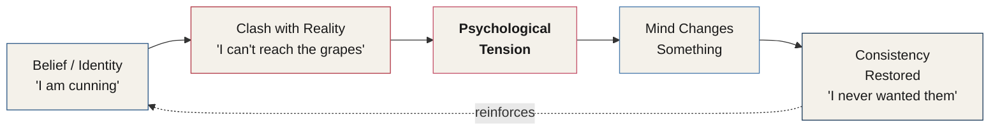
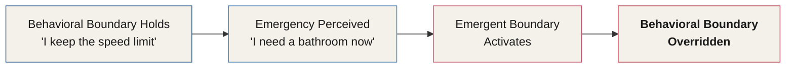

# Chapter 10 — Cognitive Dissonance and the Boundaries to Influence

> *"Evidence and proof are no match for the power of cognitive dissonance."*

Understanding cognitive dissonance is essential to everything that follows in this manual. It explains why people sometimes adjust their thinking the moment their identity and their words collide — and why you will see this phenomenon everywhere once you know how to look for it, both in the people around you and in yourself.

Even with the best tools for changing behavior and beliefs, you will still run into resistance. That resistance has a shape. In the second half of this chapter, you will learn the four boundaries every subject must cross before a new behavior becomes possible — and why a hypnotist can do things a salesperson never could.

---

## When Belief and Reality Collide

Cognitive dissonance occurs when a person's thoughts or behaviors conflict with their identity, their environment, or the way they believe they should behave in a given context. People are deeply uncomfortable with inconsistency — and that discomfort demands resolution.

::: definition
**Cognitive Dissonance** — coined by Leon Festinger, an inconsistency between beliefs, behavior, and information that produces psychological tension. When this tension appears, people change something — a belief, a perception, a definition, or a behavior — to reduce it.
:::

Festinger didn't arrive at this theory from a lab bench alone. He personally infiltrated a doomsday cult and wrote about the experience in a book called *When Prophecy Fails*.

## When Prophecy Fails

The group Festinger studied claimed to be receiving messages from a mysterious force in space called the Guardians. The Guardians had warned that a flood would destroy the world on December 21, 1954.

Festinger's real interest wasn't the prediction itself — it was what happened *after* the flood failed to arrive. The date came and went. Nothing happened. And the members of the cult didn't abandon their beliefs. **They believed them with even more conviction than before.** Festinger called this **belief perseverance**.

::: definition
**Belief Perseverance** — the tendency to hold onto a belief even more strongly after it has been directly contradicted by evidence, especially when that belief is reinforced by a community of fellow believers.
:::

Even with proof and evidence of their own error sitting right in front of them, the cult members were encouraged by other believers to keep the faith. Evidence and proof are no match for the power of cognitive dissonance.

## The Sour Grapes Loop

Aesop's fable of the fox and the grapes illustrates this mechanism perfectly. A fox is trotting along a path one day and notices a beautiful bunch of grapes hanging from a high vine. He stares at them for a while, then strategizes how he might climb up to reach them. After some effort, he realizes he can't get to them.

The fox believes he is cunning and powerful. That belief now conflicts with the plain fact that a bunch of grapes has just defeated him. Since he cannot change his ability to reach the grapes, he changes something else instead: he convinces himself the grapes were sour, and that he never really wanted them in the first place. With this new belief in place, he goes home at the end of the day still feeling like the one who chose not to eat the grapes.

This is the loop that runs underneath every example in this chapter — the fox, the cult members, and every human case that follows.

*Figure 10.1 — The dissonance-resolution loop. A belief about the self collides with reality, producing tension. Rather than change the belief, the mind usually changes the story — and the original belief comes out reinforced, not weakened.*

## Cognitive Dissonance in Humans

### The Relationship That Shouldn't Work

Imagine a young woman who meets a guy she really likes. They share all kinds of similar interests, and her friends and family all love him too. As the relationship develops, she notices that he's prone to aggression and rage. She questions her feelings, and her sense of confidence is reduced. There is now real tension between who she thinks she is and who she's allowing herself to become by staying in the relationship.

Over time, she starts to justify his behavior, allowing it to continue. The tension resolves itself in whatever way is easiest:

> *"He's not lying — that was just a misunderstanding."*
>
> *"He's not gaslighting me. Maybe I was confused."*
>
> *"He may have a rage problem, but his father hurt him a lot as a kid."*

### The Child Who Learns to Cope

A child may grow up in a horrible family. His mother criticizes him, belittles him, lies to him, makes him doubt his own memory, and wrecks his self-esteem. As the child grows, he resolves the tension by convincing himself that his mom just works harder than other moms — that other families are probably the same, and must be faking happiness at school too.

This new belief — that everyone else is secretly going through the same thing — eases the tension he feels. Cognitive dissonance becomes the norm for him as he grows up. Later in life, he can't figure out why he keeps getting into relationships with narcissists.

::: callout
**Children Are Experts.** Children are remarkably skilled at resolving cognitive dissonance — it's how so many children in bad conditions manage to remain stable throughout childhood. The tools that keep them stable in the moment are frequently the same tools that keep them repeating painful patterns as adults.
:::

## The Smoker's Toolkit

Consider a man who smokes cigarettes. He knows smoking is unhealthy. That fact sits in direct conflict with his belief that he is an intelligent person. To ease the tension, he reaches — unconsciously — for one of several tools. Each one maps onto a different element of the mental frame you'll recognize from Chapter 9: **Expectation, Perception, Belief,** and **Definition** — plus a fifth option most people avoid: changing the **behavior** itself.

| Lever | What He Tells Himself |
|---|---|
| **Change the Expectation** | *"Smoking isn't that bad. Lots of people do it, and I'm going to be fine. My grandmother lived till she was 95 and smoked every day."* |
| **Change the Perception** | *"Smart people all throughout history have smoked and lived long lives."* |
| **Change the Belief** | *"I eat enough veggies and still play golf, so my lifestyle compensates for the unhealthy habit of smoking."* |
| **Change the Definition** | *"A smoker is someone who smokes a lot and is addicted. I only smoke a few cigarettes a day, and I could quit whenever I want."* |
| **Change the Behavior** | Quit smoking. Pretty hard to do. |

*Figure 10.2 — The five levers available to resolve dissonance. Four correspond directly to the four corners of the frame introduced in Chapter 9; the fifth — changing the behavior itself — is the one most people reach for last.*

Notice the pattern: four of the five levers reshape the *story*. Only one reshapes the *behavior*. That asymmetry is the whole chapter in miniature.

## Why We Need to Resolve It At All

If we want to understand the world, we need a clear picture of it — so we are motivated to restore consistency wherever it breaks down. It is physically uncomfortable to sit inside cognitive dissonance. If you view yourself as an ethical person and your boss asks you to lie, you will likely feel it immediately.

Many people are put in situations exactly like this. Some will refuse — in order to preserve their self-image. Some will decide that misrepresenting a few minor details about the product isn't that bad. Another person may become **agentic**, unconsciously convincing themselves that someone else is responsible for their actions — that they are only following orders.

Hundreds of experiments tell us the same thing: when our conduct clashes with our beliefs, we change the belief instead of the conduct. This is an unconscious process. We don't notice it happening. Your mind is simply telling you the easiest story available.

::: warning
**The Stock Excuses.** Watch for these — in others, and in yourself:

- *"Everyone else does it."*
- *"It is for the greater good."*
- *"It's not illegal."*
- *"It's only one time."*
- *"No one was injured."*
- *"I'm not killing anyone."*
- *"Yeah, but I'm a good father/mother."*

Each one is the mind trading a harder truth for an easier story.
:::

If cognitive dissonance is powerful enough to make people ignore facts and evidence sitting right in front of them, imagine what it can do once it's deliberately leveraged with advanced psychology. Keep it in mind through the rest of this manual — you will see it in every direction, and you will learn to use it as one of the most powerful tools in your arsenal for changing behavior and belief.

---

## The Four Boundaries to Influence

Even with the best tools for shaping behavior and belief, you will face resistance. That resistance comes in the form of the **four boundaries to influence**.

You'll often hear hypnotists claim that a person can't be made to do anything under hypnosis that they wouldn't normally do in everyday life. This isn't exactly true — and understanding why requires a working vocabulary for the four boundaries that govern human behavior.

::: definition
**The Four Boundaries to Influence**

1. **Behavioral Boundary** — the limit a person believes they are restricted to, by either their social environment or their own personal beliefs.
2. **Context Boundary** — the limit on personal behavior that determines what is permissible and allowed in a given environment.
3. **Social Permissive Boundary** — the behavioral limit placed on an individual by the behavior of others in a group. The group's behavior provides absolute permission to act in ways a person normally would not.
4. **Emergent Boundary** — the removal of all other boundaries and behavioral limits, caused by a situation perceived as an emergency — a flood, a fire, a medical crisis.
:::

With this vocabulary in place, we can now examine why a hypnotist can get someone to do something entirely outside their normal behavior — simply by moving them across a boundary.

## The Myth of Hypnotic Limits

Suppose a male hypnotist with predatory intentions wants a woman to remove all her clothing in his clinic. This is a behavior she would not normally perform — she would likely be terrified by the very idea. If the hypnotist discovers she is a good subject who goes deep into trance easily, he doesn't need to overpower her behavioral boundary at all. He simply has her vividly relive a different scenario as if it were real: driving home from work one evening, tossing her car keys onto the counter, and getting ready for a warm bath in her own bathroom.

In that context, removing her clothing is completely acceptable — it's what any of us would do to get into a shower or bath. Nothing about her behavioral boundary has moved. What moved is the **context**. And a shift in context, even a *perceived* one, is what makes a behavior not just acceptable but natural and desired.

::: callout
**Not a How-To.** This example illustrates *how* a context boundary works — it is not an endorsement of using it this way. As stated at the outset of this manual: *"Use these tools wisely, and treat them with immense respect."* Understanding this mechanism is what allows an operator to recognize — and defend against — its misuse.
:::

## Context Is Everything

Context determines whether we feel we have permission, or even an expectation, to behave a certain way. Compare what's normal for one role or setting against another:

| Setting or Role | What's Acceptable There | Why It Wouldn't Fly Elsewhere |
|---|---|---|
| A hypnotist's session | Asking someone to lie down, close their eyes, and focus only on the sound of a voice | A salesperson doing the same would be seen as bizarre |
| A barber's chair | Holding an open razor to a client's throat | Anyone else doing this would be terrifying |
| A doctor's office | Casually telling someone to take off their pants | Unthinkable in almost any other setting |
| Alone in a bathroom | Getting completely undressed | Behind a context boundary at the workplace |
| A concert crowd | Shouting song lyrics at the top of your lungs | Would not happen at a family dinner |
| A funeral | Openly crying in front of others | Resisted at a dinner with friends, even with the same feelings present |
| A financial advisor's office | Asking a client directly about their income | Can't ask the same question while checking into a flight at the airport |
| A college exam room vs. a boat party | Two completely different social cue sets for the same group of young women | Neither set of cues transfers to the other setting |

*Figure 10.3 — Context boundaries in everyday life. The behavior doesn't change; the permission granted by the setting does.*

We don't, in most cases, carry hard behavioral boundaries around with us everywhere we go. What we are actually dealing with, far more often, is a **context boundary** — the fact that certain behaviors are only tolerable and expected within certain settings.

## When Boundaries Override Each Other

Boundaries aren't independent of one another — one can override another entirely. Picture a law-abiding citizen driving down a long, empty highway. No other cars are in sight, yet they still maintain the speed limit — that's their personal behavioral boundary at work.

Then they suddenly realize they need to find a bathroom, urgently. In this moment, the behavioral boundary is broken by an **emergent boundary**. They break the speed limit to reach the nearest restroom.

<!-- ASR? verify: citation rendered as "Dignam, 2009" in the source audio — likely "Dignum, F. (2009)," a researcher known for work on the emergence and enforcement of social norms; spelling and exact title unconfirmed against the original manual -->
*(Dignam, 2009 — on the emergence and enforcement of social behavior.)*

*Figure 10.4 — The emergent boundary in action. A perceived emergency doesn't argue with the behavioral boundary — it simply removes it.*

## Putting the Boundaries to Work

| # | Boundary | The Question It Answers |
|---|---|---|
| 1 | **Behavioral** | Can I do this? |
| 2 | **Context** | Is this the right time for this? |
| 3 | **Social Permissive** | Is everyone else doing this too? |
| 4 | **Emergent** | I don't care. I'll do it. |

*Figure 10.5 — The four boundaries and the internal question each one answers.*

These boundaries are **not** arranged in a strict hierarchy — they are ordered here according to how often they tend to appear. The behavioral boundary is the most common; the emergent boundary is the least common. In practice, the order in which these boundaries reveal themselves varies enormously from one situation to the next. This ordering is simply the closest approximation to a useful structure.

Like every other model in the Pillars of Human Influence — and much like the Behavioral Table of Elements from Chapter 7 — these boundaries serve three purposes: a **planning tool** before an interaction, a **reference and training tool** while you build skill, and a **postmortem tool** for breaking down an interaction after it has occurred.

As an operator who will use these methods for good, keep coming back to one question whenever you're thinking about influence:

> **What boundary must the subject cross in order to behave in a way that I need them to?**

As you progress in your training, these boundaries should continue to come to mind — as should every other model referenced in this section. Returning to them again and again is what will keep producing groundbreaking discoveries in your life and your training.

---

In the next section, you'll explore the inner workings of the human brain. By the end of it, you should have a firmer grasp of neuroscience than most people who call themselves neuroscientists online.

## Key Takeaways

- **Cognitive dissonance** is the psychological tension that arises when beliefs, behavior, and information conflict. People are motivated to resolve it — usually by changing a belief rather than a behavior.
- Festinger's study of a doomsday cult in *When Prophecy Fails* revealed **belief perseverance**: when a prediction fails, believers often emerge *more* convinced, not less. Evidence is no match for cognitive dissonance.
- Aesop's fox-and-grapes fable models the **dissonance-resolution loop**: belief clashes with reality, tension appears, and the mind changes the story rather than the belief — reinforcing the original self-image.
- The same loop plays out in real relationships (justifying a partner's rage) and in childhood (a child in a bad home convincing himself every family is secretly the same) — patterns that can persist for a lifetime.
- The **smoker's toolkit** shows five levers for resolving dissonance — changing the Expectation, Perception, Belief, or Definition (the four corners of the frame from Chapter 9), or changing the Behavior itself, which is the hardest and rarest choice.
- Watch for the **stock excuses** — "everyone else does it," "it's for the greater good," "it's only one time" — each one is the mind trading a harder truth for an easier story.
- **Hypnotists can access behaviors salespeople cannot** — not by breaking a behavioral boundary, but by shifting the subject's perceived **context boundary** until the new behavior feels natural and desired.
- The **four boundaries to influence** are Behavioral (*Can I do this?*), Context (*Is this the right time?*), Social Permissive (*Is everyone else doing this?*), and Emergent (*I don't care, I'll do it*) — ordered by frequency of appearance, not by hierarchy.
- Boundaries can **override** one another — an emergent boundary (a perceived emergency) can instantly dissolve a long-held behavioral boundary.
- Like the BTE, the boundaries model works as a **planning tool, a training/reference tool, and a postmortem tool**. The operating question to carry forward: *What boundary must the subject cross in order to behave in a way that I need them to?*

<!--
## Change Log

| Original (transcript) | Corrected | Reason |
|---|---|---|
| "Arthur Leon Festinger" | "Leon Festinger" | Factual correction — the social psychologist's name was Leon Festinger; "Arthur" is not part of his recorded name |
| "Bestinger deeply examined why the blatantly foolish prediction..." | "Festinger deeply examined why the blatantly foolish prediction..." | ASR error — name misheard |
| "Parable describes how a fox..." | "The parable describes how a fox..." | Grammar — missing article |
| "The fox spend some time staring at them." | "The fox spends some time staring at them." | Grammar — subject/verb agreement |
| "he's not lying, that was just misunderstanding" | "he's not lying — that was just a misunderstanding" | Grammar — missing article, punctuation for clarity |
| "than other mums, than other families are probably the same" | "than other moms — that other families are probably the same" | Grammar — run-on clause corrected for clarity, no content change |
| "he will employ unconsciously to ease the tension he feels between the silliness of smoking and the belief that he's intelligence" | "...the belief that he's intelligent" | Grammar — noun used where adjective required |
| "Some will refuse to preserve the self image." | "Some will refuse — in order to preserve their self-image." | Grammar/punctuation — original phrasing obscured the meaning (refusing the boss's request preserves self-image, as opposed to complying) |
| "misinterpreting a few minor details about the product isn't that bad" | "misrepresenting a few minor details about the product isn't that bad" | ASR/word-choice — "misinterpreting" doesn't fit the agentive framing of choosing to shade the truth; "misrepresenting" matches the context of a boss asking someone to lie |
| "Everyone else does it. is for the greater good." | "'Everyone else does it.' / 'It is for the greater good.'" | Grammar — missing subject "It" restored |
| "These challenges are called before barriers to influence. The form barriers to influence." | "Even with the best tools... you will face resistance. That resistance comes in the form of the four boundaries to influence." | Severe ASR garble — "before barriers" / "The form barriers" reconstructed as "the four boundaries," consistent with the term "boundaries" used exclusively for the rest of the section |
| "Emergence boundary. The emergent boundary is..." | "Emergent Boundary — the removal of..." | ASR/consistency — the label was misheard as "Emergence"; the adjective form "Emergent" matches the naming pattern of the other three boundaries and is used in the definition sentence itself |
| "This behavior would be behind a context sparrow while they were at the workplace" | "This behavior would be behind a context boundary at the workplace" | ASR error — "sparrow" is a mishearing of "boundary" |
| "A person alone in a bathroom has no barrier to getting naked" | "...has no boundary to getting naked" | Terminology consistency — harmonized with the technical term "boundary" used throughout this section |
| "The facts that certain behaviors are tolerable and expected only within certain contexts." | "The fact is that certain behaviors are tolerable and expected only within certain contexts." | Grammar — subject/verb correction |
| "In this case, they have a behavioral boundary to breaking the law." | Retained as-is | Author's own phrasing; meaning (a personal boundary against breaking the law) is clear in context |
| "From Dignam 2009, emergence and enforcement of social behavior." | Retained, flagged inline | Citation name/title uncertain without source manual; likely "Dignum, F. (2009)" — flagged with an ASR verification comment rather than silently altered |
| "One, behavioral boundary, can I do this? To context boundary." | "1. Behavioral — Can I do this? 2. Context boundary — ..." | ASR error — spoken "Two" misheard as "To" |
| "For emergence boundary, I don't care. I'll do it." | "4. Emergent — I don't care. I'll do it." | ASR error — spoken "Four" misheard as "For"; "emergence" harmonized to "emergent" per the boundary-naming fix above |
| "A hypnotist can do all kinds of things, a salesperson cannot." | "A hypnotist can do all kinds of things a salesperson cannot." | Punctuation — comma removed to fix run-on/comma splice |
-->
