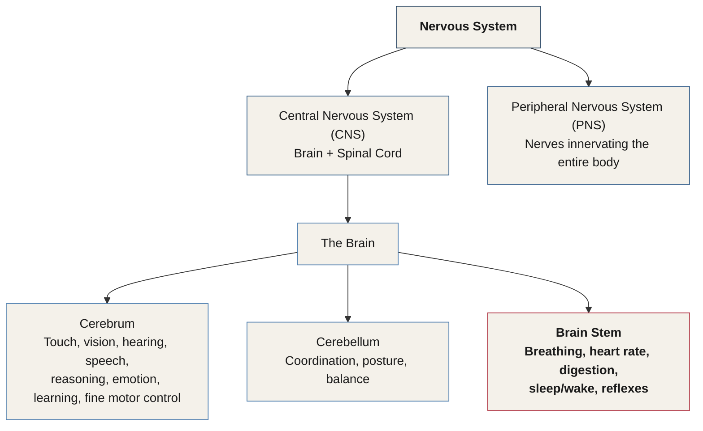
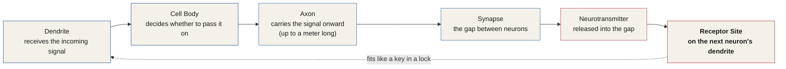
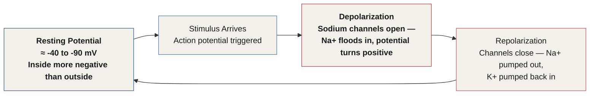
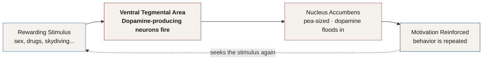
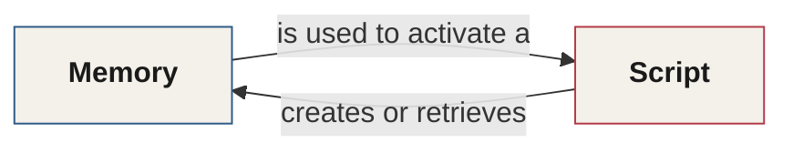

# Chapter 11 — The Wiring of Influence

> *"The closer your skills get to the spinal cord and brain stem, the more results you will get."*

A three-pound organ inside your skull has kept most of its secrets until very recently. Until just a few years ago, the primary way we studied the brain was by observing what happened when it was damaged. Scientists would note which part of the brain was injured, then observe which function the person lost as a result. This became known as **loss-of-function research**, and it remains the foundation for much of what we understand today — including several of the language disorders covered later in this chapter.

The brain controls every function of the body and interprets meaning from the world around us. This is the essence of what we call mind and soul.

Before you can leverage the brain's electrical and chemical machinery for influence — the subject of the rest of this chapter — you need a working map of the terrain. This chapter builds that map from the ground up: the major structures, the cells that do the work, the electricity that powers thought, and the chemistry that actually decides what moves a person to act.

---

## The Brain in Three Parts

The brain has three main parts: the **cerebrum**, the **cerebellum**, and the **brain stem**.

The nervous system that houses them splits into two systems:

- **Central Nervous System (CNS)** — the brain and spinal cord.
- **Peripheral Nervous System (PNS)** — every nerve that branches out from the brain and spinal cord, innervating the entire body.

*Figure 11.1 — The nervous system splits into the CNS and PNS. The brain itself splits into the cerebrum, cerebellum, and brain stem — the structure this chapter spends the most time on.*

### The Cerebrum

The cerebrum is the part of the brain most people picture when they imagine "a brain." It is the largest part of the brain, made up of the right and left hemispheres, and is responsible for interpreting touch, vision, hearing, and speech, along with reasoning, emotion, learning, and fine motor movement.

### The Cerebellum

Just beneath the cerebrum sits the cerebellum. Its main functions are coordinating muscle movement, posture, balance, and most of our bodily movement.

### The Brain Stem

Most people, asked to point to the base of the brain, point somewhere in their neck. In truth, the base of the brain reaches all the way into your lower back — because the spinal cord and brain stem are both part of the brain.

The brain stem, at the back of the neck, acts as a relay station connecting the spinal cord to the brain. Its activities are fully automated: breathing, heart rate, digestion, body temperature, sleeping and waking, sneezing, swallowing, coughing, vomiting, and every other behavior that runs without our needing to remember or think to do it.

We will return to the brain stem in far more depth later in this chapter. It turns out to be the single most important structure in this entire manual.

---

## Right Brain, Left Brain

::: definition
**Corpus Callosum** — the bundle of nerve fibers joining the right and left hemispheres, carrying data from one side of the brain to the other.
:::

Each hemisphere controls the opposite side of the body. If a stroke occurs on the right side of the brain, for example, the left side of the body may be weak or paralyzed.

Not all functions are shared equally across both hemispheres:

| Hemisphere | Controls |
|---|---|
| **Left** | Speech, comprehension, arithmetic, and writing. In almost everyone, the left hemisphere also controls handedness. |
| **Right** | Creativity, spatial ability, and artistic and musical skill. |

*Figure 11.2 — Lateralization of function. In almost everyone, the left hemisphere governs language, speech, and handedness.*

The right hemisphere is heavily involved in interpreting visual information and spatial processing. The left hemisphere is, in most people, responsible for language and speech. In a very small number of people, the right hemisphere is dominant, and language is processed there instead. When someone — especially a left-handed person — is going in for brain surgery, a neurologist will test to determine which hemisphere is dominant for language before operating anywhere near that area.

---

## The Four Lobes

Each hemisphere of the brain has four lobes: **frontal, temporal, parietal,** and **occipital**. Each can be further divided into areas that serve more specific functions — and all of them have complex relationships with each other, functioning in unison and sharing data constantly.

| Lobe | Key Functions |
|---|---|
| **Frontal** | Personality, behavior, emotion, judgment, planning, problem-solving · Speech — speaking and writing (**Broca's area**) · Body movement (motor area) · Intelligence, concentration, self-awareness |
| **Parietal** | Interpreting language and words · Touch, pain, and temperature (sensory area) · Integrating signals from vision, hearing, motor, sensory, and memory systems · Spatial and visual perception |
| **Occipital** | Interpreting vision — color, light, and movement · Transmitting visual data to other brain regions · Forming visual memories · Coordinating movement, object recognition, and distance assessment |
| **Temporal** | Understanding language (**Wernicke's area**) · Memory · Hearing · Sequencing and organizing language |

*Figure 11.3 — The four lobes of the brain and their principal functions.*

---

## When Language Breaks: Aphasia

Since most brain research is rooted in the study of loss of function, let's look at a few injuries that cause issues with language.

::: definition
**Aphasia** — a loss of language ability following a stroke or injury to the brain's language-processing areas. It can affect speaking, comprehending language, reading, or writing. The specific type of aphasia depends on exactly where the injury occurred.
:::

If the damage is in **Broca's area**, in the left frontal lobe, a person may have trouble moving the facial muscles, tongue, throat, and mouth needed to produce speech. They can still read and interpret words, and comprehend language spoken to them — but they will have serious difficulty speaking and writing, creating language of their own. This is called **Broca's aphasia**.

If the damage is in **Wernicke's area**, in the left temporal lobe, a person may speak in what's sometimes called "word salad" — strung-together sentences that carry no real meaning. They have serious difficulty putting words together in a way that communicates. The words themselves are correctly formed, but convey little to no meaning. This is called **Wernicke's aphasia**.

| | Broca's Aphasia | Wernicke's Aphasia |
|---|---|---|
| **Damaged region** | Broca's area, left frontal lobe | Wernicke's area, left temporal lobe |
| **Comprehension** | Intact — can read, interpret words, and understand speech | Impaired — words are correctly formed but convey little meaning |
| **Production** | Impaired — difficulty moving the muscles of speech; trouble speaking and writing | Fluent but meaningless — "word salad" |

*Figure 11.4 — Broca's aphasia versus Wernicke's aphasia. Damage location determines whether comprehension or production is impaired.*

---

## The Cortex: Gray Matter and White Matter

The surface of the cerebrum is called the **cortex** — the folded, wrinkled part of the brain you see in most illustrations. The cortex has wrinkles of hills, called **gyri**, and valleys, called **sulci**.

The cortex is home to somewhere between 14 and 16 billion neurons. The whole brain contains around 85 billion, arranged in layers that serve hierarchical purposes.

::: definition
**Gray Matter vs. White Matter.** Gray matter is made of neuron cell bodies — it gives the cortex its grayish-brown color and is where the name comes from. White matter sits just beneath the cortex: hundreds of long nerve fibers (axons) that connect the brain's regions to one another.
:::

The cortex's hills and valleys — gyri and sulci — exist to increase surface area, which lets the skull pack in far more neurons than a smooth surface ever could.

---

## Deep Structures

Deeper in the brain, long white-matter tracts — pathways of data cables — connect regions to each other so information can travel around the brain and the lobes can share it with one another.

| Structure | Location | Role |
|---|---|---|
| **Hypothalamus** | Lower brain | The CEO of the autonomic nervous system — governs sexual desire, sleep, hunger, thirst, emotion, and body temperature |
| **Pituitary Gland** | Sits in the *sella turcica*, a pocket of bone; connected to the hypothalamus | The "master gland" — controls the other endocrine glands that secrete hormones governing sexual development, emotion, muscle growth, and the stress response |
| **Pineal Gland** | Just behind the third ventricle | The body's internal clock — regulates the sense of time and secretes melatonin to drive circadian rhythms |
| **Thalamus** | Lower brain | The brain's relay station to the cortex — central to pain sensation, memory, attention, and focus |
| **Basal Ganglia** | Deep cerebral nuclei — caudate, putamen, globus pallidus | Works with the cerebellum to coordinate the fine motor movements of daily life, like turning a page or drawing a picture |
| **Limbic System** | Beneath the temporal lobes — cingulate gyrus, hypothalamus, amygdala, hippocampus | The brain's control center for emotion and memory formation — and, as you'll see later in this chapter, for behavioral scripts |

*Figure 11.5 — The brain's deep structures, their locations, and their roles.*

---

## How Memory Works

Despite decades of research, we still don't know much about exactly how memory works — but it's clearly a complex process with at least three stages: **encoding** (what should I save, and what should I ignore?), **storage**, and **recall**.

When something is emotional, interesting, threatening, or important, the brain moves it from short-term to long-term memory. This is encoding: the brain trying to preserve data it can use again, either to avoid trouble or find pleasure in the future.

| Memory Type | Brain Region | What It Does |
|---|---|---|
| **Short-term memory** | Prefrontal cortex | Holds data for about a minute, in limited quantity — enough to repeat a phone number back a few seconds after hearing it, or to hold this sentence in mind long enough to compare it with the one before it |
| **Long-term memory** | Hippocampus | Kicks in when something is of extreme importance, or when it is rehearsed over and over; storage is theoretically unlimited |
| **Skill memory** | Cerebellum, relaying to the basal ganglia | Stores repeated physical actions — driving a car, typing on a keyboard, buttoning a shirt. After the body repeats a process enough times, the brain "decides" it is worth memorizing so it becomes easier in the future |

*Figure 11.6 — Three types of memory and the brain regions that process them.*

---

## Ventricles and Cerebrospinal Fluid

Ventricles are hollow spaces in the brain, filled with fluid. Inside them sits a ribbon-like structure called the **choroid plexus**, responsible for manufacturing the liquid the brain sits in.

That clear, watery liquid — **cerebrospinal fluid (CSF)** — flows around the brain and spinal cord, insulating them with a liquid barrier that protects against injury. CSF is constantly being absorbed and replenished by the choroid plexus.

::: definition
**Blood-Brain Barrier** — the barrier, of which the choroid plexus is a part, that separates the body's blood supply from the cerebrospinal fluid bathing the brain and spinal cord.
:::

---

## The Cells of the Brain: Neurons and Glia

There are two types of cells in the brain: **neurons** and **glial cells**.

### Neurons

Neurons are the chemical and electrical messenger system of the body. They can be up to a meter long. A neuron consists of a cell body, an axon, and dendrites. When a neuron is electrically excited, it will also excite nearby neurons — signals cross the small gaps between neurons called **synapses**.

Each neuron has a set of arms that resemble a tree's limbs, called **dendrites**. These behave like electrical and chemical antennae: they receive incoming signals and carry them to the cell body, which then determines whether the signal should be passed on to the next neuron.

Chemical signals follow a similar path. Neurotransmitters fit into special holes on the next neuron, called **receptor sites**. These receptors are shaped to receive very specific chemicals — like a lock built for one key. When a neurotransmitter locks into its receptor, it stimulates the neuron to pass the message on.

*Figure 11.7 — How a signal travels from one neuron to the next, electrically and chemically.*

### Glial Cells

Glia, or glial cells, take their name from the Greek word for glue. There are roughly thirty times more glial cells than neurons in the body. They provide neurons with nourishment, protection, and structural support — and they are also the cell type most commonly involved in brain tumors.

| Type | Function |
|---|---|
| **Astrocytes** (astroglia) — "the custodians" | Control the blood-brain barrier, letting nutrients and molecules reach neurons; maintain homeostasis; support neuronal protection and repair; form scar tissue; improve electrical signaling |
| **Oligodendrocytes** | Produce **myelin**, the substance that insulates axons and lets electrical messages travel faster |
| **Ependymal cells** | Line the ventricles and secrete cerebrospinal fluid |
| **Microglia** | The brain's immune cells — protect against invaders, clean up debris, and prune synapses |

*Figure 11.8 — The four major types of glial cell and what each one does.*

---

## The Brain Stem, In Detail

The brain stem is critical to survival. It coordinates cardiovascular function and is the reason we can move, sleep, breathe, and function at all. It is a small, narrow region connecting the spinal cord with the diencephalon and cerebrum.

If you look closely at the structure of the brain stem, it looks like an actual stem — with the cerebrum almost like a flower growing from it. Beneath this flower-and-stem structure sits the spinal cord, which looks much like the root of a plant.

The brain stem has three major divisions: the **medulla oblongata**, the **pons**, and the **midbrain**.

- **Medulla oblongata** — the bottom of the brain stem, directly above the spinal cord. It controls an extensive range of involuntary processes, like breathing, cardiovascular activity, and digestion, and is responsible for several reflexive actions, such as vomiting, swallowing, coughing, and sneezing.
- **Pons** — moving upward, the bridge between the spinal cord and the cerebrum. This is the home of several vital nerves, including the abducens nerve (eye movement), the facial nerve (facial expressions), and the trigeminal nerve (feeling in the face). Saliva production is also regulated here.
- **Midbrain** — the top of the brain stem, located below the cerebral cortex and above the hindbrain. It contains several important structures, along with cranial nerves supporting vision, facial and eye movement, and the movement of the neck and shoulder muscles. The midbrain collects data about eye movements and assists in visual and auditory processing. It also houses vital parts of the brain associated with movement, motivation, and reward — as you'll see shortly, this is where the ventral tegmental area lives.

The brain stem bridges communication between the brain and spinal cord, controls our vital systems, and carries our drives for motivation and survival. Essentially, the brain stem is where we derive our consciousness. You can survive injuries to many parts of the brain — but not to the brain stem.

---

## Resting Potential and the Electricity of Thought

Imagine holding a dead frog. If you applied a small amount of electricity to the nerves feeding into its leg, what would happen? As strange as it sounds, the leg would kick. An Italian scientist named **Luigi Galvani** discovered this by accident in the 1780s, while dissecting a frog and experimenting with electrical stimulus on its leg nerves.

::: callout
**Why this matters.** Learning neuroscience, and understanding the brain's electrical activity, will help you master persuasion and influence. This chapter shows you how to leverage that electrical activity in your use of language and framing — techniques covered in detail later in this manual.
:::

In Chapter 7, you learned that the **Hierarchy of Influence Factors** has four levels, from least to most powerful: **Electric (Thoughts)** at the apex, then **Chemical (Emotions)**, then **Behavioral Patterns**, then **Impulse (DNA)** at the base. This section is a deep dive into that top, electric layer — and sets up the chemical layer that follows.

The brain runs on about 20 watts of energy and consumes roughly 20% of the body's overall energy supply. It was first discovered that neurons carry electrical signals through the body to produce motion. At a very basic level, neurons generate their electrical signaling capacity through brief, controlled changes in the permeability of the neuron's membrane — the surface becomes more permeable to specific ions, like sodium and potassium.

### Resting Potential

Before looking at how these signals are generated, consider a neuron at rest — meaning it is not sending or receiving a signal. When a neuron isn't in use, it's essentially resting. But although no signal is passing through it, it isn't electrically dead. There is still electricity present — it remains **electrically active**.

Because of the way ions move across the neuron's surface, the inside of the neuron is more negatively charged than the fluid around it. This creates an electrical difference between the inside and outside of the neuron, called the **resting potential**. Muscle cells — like those in your heart — have a resting potential too.

When a neuron is at rest, the fluid around and inside it is filled with several types of ions. Sodium and potassium are the most common. At rest, the sodium level outside the cell is higher than inside; potassium is the opposite — higher inside the cell, lower outside. Since ions carry electrical charge with them, this imbalance creates the electrical difference we call resting potential, which for most neurons ranges from roughly **-40 to -90 millivolts**.

### Action Potential

When an electrical signal, called an **action potential**, triggers a neuron, small channels open on its surface and sodium ions rush in. This changes the neuron's electrical potential considerably — from negative to positive. This is called **depolarization**.

Once the signal has done its job, the ion channels close, bringing the electricity in and around the neuron back to resting-state levels: sodium is pumped back out of the cell, and potassium is pumped back in. This is called **repolarization**, and it happens at lightning speed. Once it's complete, the neuron is ready to fire all over again.

*Figure 11.10 — The resting-and-firing cycle of a neuron: resting potential, depolarization, repolarization, and back to rest.*

---

## Residual Electrical Activity: Priming the Brain for Influence

When you have thoughts, ideas, memories, or orgasms — or even imagine yourself listening to this audiobook tomorrow — you're using electricity. Your brain consumes roughly 20 to 30% of the calories you eat, and it is busy all the time, including while you sleep.

Here's how this seriously affects influence. Imagine being asked to picture your childhood bedroom, then being asked several detailed questions about what it looked like. Now imagine being asked to describe your elementary school classroom — specific questions about the smell of the room, the colors, and the feelings you had sitting in it. Your brain retrieves this information using electrical impulses. Each neuron is temporarily turned on while the area of the brain responsible for storing these memories activates. That's exactly what just happened in the examples above — the neurons involved reached their action potential.

::: definition
**Residual Electrical Activity** — the working theory that once a group of neurons has fired, that same group becomes measurably easier to trigger again in the near future.
<!-- ASR? verify: citation reads "A, 2005, Taisio R, 2007" in the transcript — likely references published work on neural priming or residual synaptic excitability, but the researchers' names could not be confidently recovered from the audio. -->
:::

In short: when you cause someone's neurons to fire, that same group of neurons becomes easier to trigger later. This is a crucial point. If you retrieved memories from your childhood a moment ago, and later someone wanted you to remember a different event from your childhood, it would be easier and more vivid to recall than if you hadn't been asked those earlier questions — because the electrical impulses were already sent where they'd be needed later in the conversation.

::: callout
**Principle: Prime Before You Need It.** If you know what you will need from a subject later in a conversation, send electrical activity to that location early — this makes those neurons far easier to access when you actually need them. If you need someone to feel a certain way, or be in a certain mindset, later in a conversation, prime those neurons for activity early on, letting them know they need to be ready. We will build on this idea later in the manual as we explore more advanced concepts.
:::

This method doesn't require asking your subject direct questions. You can instead expose them to information that triggers certain thoughts, beliefs, and ideas — and whether or not the person is aware of being exposed to it, this can have a profound impact on future behavior and decision-making. When you reach the linguistics training section of this manual, this will be explored in depth, along with the specific techniques you can use to shape future behavior.

---

## Where Your Words Are Going

Let's explore linguistics for a moment, so you understand its use — and where it belongs in persuasion as a whole.

**Linguistics** — the use of language techniques for persuasion — is commonly assumed to be the primary method of influence. You already know that isn't true. Linguistics certainly has a place in modern influence methods, but there are reasons it should never be your go-to method. This manual covers ways to powerfully leverage linguistics — but only once the techniques lower on the Hierarchy of Influence Factors have already been put to work.

### The Trouble with NLP

::: definition
**Neuro-Linguistic Programming (NLP)** — claims a connection between neurological processes, language, and behavioral patterns learned through experience, and asserts that these can be deliberately changed to achieve specific goals. It has been widely criticized by the scientific community as unproven.
:::

André Muller Weitzenhoffer, a friend and peer of Milton Erickson, wrote:

> *"Has NLP really abstracted and explicated the essence of successful therapy and provided everyone with the means to be another Whittaker, Virginia Satir, or Erickson? NLP's failure to do this is evident because today there is no multitude of their equals — not even another Whittaker, Virginia Satir, or Erickson. Ten years should have been sufficient time for this to happen. In this light, I cannot take NLP seriously. NLP's contributions to our understanding and use of Ericksonian techniques are equally dubious. Patterns I and II are poorly written works — an over-ambitious, pretentious effort to reduce hypnotism to a magic of words."*

Views of NLP tend to be rather one-sided, presenting the entire system as unproven. This is largely true — but there's also no proof that charisma makes people more likable, that confidence makes people more attractive, or that strong social skills make better psychotherapists. It's difficult to prove what's hard to measure in a lab. NLP gets put to the same scrutiny as ibuprofen in a clinical trial, as if it were some exact chemical applied in a fixed dose every time — with no regard for the skill level or personality of the person using the method. This is the biggest problem with many psychological approaches: to satisfy the proof the scientific community demands, you must assume every subject is identical, and that every operator's application of the method is identical. Both assumptions are wrong.

### Language and the Brain Don't (Yet) Go Together

There's no dedicated "language part" of your neurology, aside from a few small areas in the neocortex. In brain anatomy, we describe dedicated regions in terms of hierarchical structures — and there is no such hierarchical structure built specifically for language. The two areas covered earlier in this chapter, Broca's and Wernicke's, tell us a few things: your brain isn't built for language. Language is new to humans. It isn't hugely important to how we make choices. Whether you measure by size or by volume, the brain areas dedicated to language rank low in evolutionary importance — and the brain runs on electricity, but most of that electricity processes data that isn't language at all.

Wernicke's area, found in the temporal lobe, rivals Broca's area as a major component in any model of language function in the brain. Its role is well agreed upon, though its precise borders are sometimes disputed. Where Broca's area serves the expressive, motor side of speech, Wernicke's area is devoted to the other major side of language: the reception of speech. The neural structures in Wernicke's area not only allow for the comprehension of oral language, but also — in some as-yet-undefined manner — appear to underlie the formulation of internal linguistic concepts. During speech, these are transmitted forward in the brain to Broca's area for the motor programming and expression of language. Little is definitively known about the neural correlates of this internal aspect of language (Russell J. Love, PhD, 1992).

Broca's area, in the human frontal lobe, and Wernicke's area, in the human temporal lobe, are the two most well-known cortical areas involved in the production and comprehension of speech. Homologous regions of both areas have been identified in apes, monkeys, and prosimians, with cytoarchitectonic evidence testifying to the high degree of conservation commonly observed in brain evolution.

The discovery of **mirror neurons** — a class of neurons important for action comprehension, found in the macaque homologue of Broca's area (area F5) — suggests that Broca's area evolved from an existing area in the primate brain, one whose functions are considered a precursor to language (Rizzolatti & Arbib, 1998). Inside a macaque monkey's brain, neurons in the superior temporal gyrus that discriminate between the calls of different animals are considered a precursor to the speech-related functions of Wernicke's area (DeWitt & Rauschecker, 2013).

Other parts of the brain tell a similar story. The temporoparietal junction takes in sensory data and sorts it. It has been proposed that the lateral portion of the frontal pole cortex in the human brain has no clear correspondence in the macaque prefrontal cortex (Neubert et al., 2014). In the anterior cingulate cortex, researchers have identified human subdivisions that are difficult to map cleanly onto the macaque brain (Vogt et al., 2013).<!-- ASR? verify: the transcript's original claim that two named ACC subregions entirely lack any monkey counterpart appears to be an oversimplification of Vogt et al.'s more nuanced finding; softened accordingly. --> In the inferior parietal lobule, areas 39 and 40 — the angular and supramarginal gyri — were originally described by Brodmann (1909) as regions unique to the human brain, an idea refined by later comparative work.<!-- ASR? verify: transcript cites "Paul, 2009," "Bruce, 1991," and "Bill Moth, AL 2012" for this claim — none could be confidently matched to a real publication; Petrides & Pandya (2009), Preuss & Goldman-Rakic (1991), and Karnath, Ferber & Himmelbach (2001) are the closest verified real citations for closely related findings. --> The modern view treats these regions as reorganized and expanded in humans rather than wholly absent in monkeys.

Given existing research, it's generally agreed that the expansion of the cortex led to a reorganization of connectivity within these regions, eventually causing the formation of new cortical areas entirely. Resting-state MRI experiments, for example, have uncovered frontoparietal networks in the human brain that appear to have no correspondent in the macaque monkey's brain (Mantini et al., 2013). Since both the prefrontal and parietal cortex are expanded in the human brain relative to the macaque, this is consistent with a scenario in which cortical expansion drives the reorganization of the cortex. Randy Buckner elaborates on this idea, proposing that the expansion of the cortex can "untether" the hierarchical networks more commonly observed in sensory and motor cortices, allowing densely connected, non-hierarchical networks to form in the newly expanded association areas (Buckner & Krienen, 2013).<!-- ASR? verify: transcript also cites "Insarian Murphy, 2003" in this passage — could not be matched to any real, identifiable publication after a dedicated search. -->

Enough with the science. What does all this actually mean? It means language is relatively new for us as humans, and we're just barely getting into it. These networks are so new that they aren't even represented in the classic hierarchy of the brain.

::: callout
**Notice this.** Revisit the Taxonomy of Human Influence from Chapter 7. Take a close look at the model — do you notice anything missing? Yes: language is entirely missing. If you make use of the linguistic methods in this manual, but nothing else, you'll be an amateur at best. Combine linguistics with everything else you learn here, and you become an authority.
:::

In the next section, you'll learn the important difference between influencing the electrical properties of the brain versus its chemical properties — moving one layer up the Hierarchy of Influence Factors.

---

## The Neurology of Drive and Motivation

When you feel a compulsion to do something that's almost irresistible, that feeling is produced by a system in your brain called the **ventral tegmental area**. If you've just bought a new car, and now notice it on the street more than ever before, that's the **reticular activating system** — it has developed a scanning routine to help you spot it on the road. Both structures are critical to understanding influence at a basic level.

::: callout
**Manufacturing Impulse.** I often start intelligence-operative training events with a slide bearing a few simple words: *"The closer your skills get to the spinal cord and brain stem, the more results you will get."* Most people think persuasion equates to the creation of information and ideas. It doesn't. You are in the business of creating impulse and identity — modifying a person's identity in such a way that the changes you make are permanent, powerful, and deep. This is how the world has truly changed.
:::

The VTA and the RAS play a vital role in deciding how a person behaves — and what their brain tells them to focus on. Remember: what someone wants to focus on, and what their brain tells them to focus on, are often two different things. The lower structures in the brain always win.

### The Ventral Tegmental Area (VTA)

The ventral tegmental area sits in the midbrain and contains mostly dopamine-producing neurons. It's a key part of the network often called the brain's reward system, playing a central role in reinforcing behavior and driving us to seek out activities that make us feel good. The VTA's three main goals can be summarized as **motivation, reward,** and **addiction**.

When someone does something that brings them pleasure — sex, drugs, or skydiving — dopamine levels rise inside the **nucleus accumbens**, a pea-sized structure closely tied to the VTA. The VTA deals mostly in dopamine, and when something is malfunctioning in it, the result can contribute to schizophrenia, attention-deficit disorder, and other disorders. In summary, the VTA is our compass: it guides behavior toward dopamine-producing activities and keeps us motivated toward goals.

*Figure 11.11 — The VTA reward loop. A rewarding stimulus fires dopamine neurons in the VTA, which flood the nucleus accumbens and reinforce the behavior that triggered them.*

### The Reticular Activating System (RAS)

The RAS, located within the brain stem, is about the size of a crayon. It plays a vital role in receiving sensory input and tracking what we think is important. When we repeatedly focus on something, the RAS picks up on this and "gets excited" — it memorizes all the information it can from the senses (except smell), so it can get better at identifying the things you find important in the future.

When you were shopping for a new car, you may have watched videos, looked at hundreds of photos, and visited a few dealerships to see and test-drive it in person. The RAS was paying attention to all of it. When you bought the car, a high level of emotion was attached to the event — the RAS recognized this as important, memorized the details you'd been looking at for weeks, and now directs your focus toward finding the same car on the road. When you start seeing your car everywhere, that's the RAS trying to direct your focus toward what it thinks you find important.

Think of the RAS as a flashlight: it directs your focus to what's important. It's the reason you can converse with someone in a crowded room and still make out what they're saying — the RAS helps you focus on the voice you want to hear, while lowering the importance of the other voices and sounds around you.

We will dive deeper into the VTA and the RAS when we arrive at the authority section of this manual.

---

## Electrical vs. Chemical Communication

Your words alone can produce both chemical and emotional reactions in someone's brain. When you speak, you send electrical signals — and when those signals generate an emotional response, you're creating chemicals in the brain. Hollywood filmmakers and expert writers leverage this constantly, to make you react emotionally to a story. In real life, very few people use this ability well in their language, and fewer still understand it at the level you're about to.

Most people use language functionally — to transfer information or express a desire. You might say they use language by accident, with little thought invested in how it may affect the other person.

::: callout
**The Difference.** Electrical communication focuses on directing *thought*. Chemical communication focuses on directing *emotion*. All communication triggers electrical activity in order to process information — but powerful communication directs that electricity to deliberately create desired thoughts and emotions. Put simply: weak communication focuses on the cortex. Powerful communication focuses on the limbic system.
:::

The **cortex**, also called the **neocortex** ("new cover"), is the most recently evolved part of the brain — the part responsible for everything that differentiates us from animals. It's the most highly developed part of the brain, responsible for thinking, perceiving, producing, and understanding language, along with intelligence, motor function, touch sensation, personality, planning and organization, and processing sensory information. Between 14 and 16 billion neurons are found in the cerebral cortex.

The **limbic system** is a collection of brain structures that process emotion and memory. Its main components are the hippocampus, the amygdala, the hypothalamus, and the thalamus, and it sits just beneath the temporal lobes. It was originally called the **rhinencephalon** — meaning "nose brain" — because it was thought to be primarily involved with the sense of smell. Early researchers dissected the brains of living rats to learn about human brains, and since rats are so driven by smell, this part of the brain lit up like a Christmas tree whenever the rats were smelling something. Scientists assumed that, since human brains resemble rat brains, the limbic system served the same function in people.

The limbic system oversees the processing and regulation of emotions, the formation and storage of memories, sexual arousal, and learning. Its neurons are structured differently than those in the cortex — cortical cells are mostly neocortical, formed into six layers. The limbic system, by contrast, cannot process, produce, or comprehend language at all. That belongs to the cortex, as you've already seen.

| | Cortex (Neocortex) | Limbic System |
|---|---|---|
| **Age** | The most recently evolved part of the brain | The older, "mammalian" brain |
| **Structure** | Six-layer neocortical cells | Structured differently than cortical cells |
| **Handles** | Thinking, perceiving, language, intelligence, motor function, personality, planning, sensory processing | Emotion, memory formation, sexual arousal, learning |
| **Relationship to language** | Produces and comprehends language | Cannot process, produce, or comprehend language at all |
| **Output** | Thoughts, data | Feelings — reactions with no traceable source |

*Figure 11.12 — Cortex versus limbic system. Weak communication targets the first column; powerful communication targets the second.*

::: callout
**On Gut Feelings.** When you get a gut feeling or intuition about a person or situation, you know something general about it, but you can never quite pinpoint the exact cause. That's because the limbic system — the mammalian part of the brain — doesn't traffic in language at all. When it identifies something you need to pay attention to, it tells you, but not through a text message or a spoken explanation. This is why you get feelings instead of data. The limbic system thrives on feeling, not thinking.
:::

Every person creates gut feelings in the people they meet — either by accident or by chance. What if there were a way to intentionally manufacture the gut feelings you want to elicit in people? There is a way to do this. That is exactly what this training manual teaches.

---

## The Limbic System Runs on Scripts

There are two things worth highlighting about the limbic system: **one**, it uses memory to run scripts, and **two**, it uses scripts to run memory.

Recall from Chapter 4 that we run two kinds of scripts:

- **Life Scripts** — built from what we've learned unconsciously through our own life: emotional reactions, behaviors, skills, and patterns like driving and cooking.
- **Ancestral Scripts** — virtually unchangeable, written into our DNA: reactions to loud noises, and how the body responds to hunger and aggression. These scripts are by far the most powerful.

The limbic system uses memories — both personal and ancestral — to activate a script. When it recognizes something in the environment, it begins running the program built to deal with that situation.

*Figure 11.13 — The limbic system's two-way relationship between memory and scripts.*

### The Limbic System Uses Memory to Run Scripts

1. A woman discovers that fasting — not eating for a day — makes her more creative. In her limbic system and brain stem, her ancestors built a script to help her find food by getting creative. Think of the first person to discover that bird and animal eggs aren't just edible, but an excellent source of protein. That was creative.
2. A man who grew up being abused as a child, and who ran away, quits his job later in life. A pattern of behavior that once kept a child safe, or helped them evade danger, becomes a life pattern as they age.
3. A person's habit of smoking cigarettes breaks while they are on vacation in a foreign country. The lack of environmental triggers fails to activate the life script of smoking — the new smells, buildings, people, and environment weren't associated with this person's behavioral triggers, so the behavior was able to be un-scripted.

### The Limbic System Uses Scripts to Run Memory

When a script is triggered, the limbic system uses the environment to create memories, so the script can either (1) store data for the next time this occurs, or (2) retrieve data from memory to help the script run.

1. A young man becomes a professional golfer and wins the Masters Tournament. Over the course of his life, his brain's reticular formation became activated more and more while playing golf, creating an understanding that this mattered to him. Later, the smell of the golf course activates the golf-playing script, and the limbic system teams up with the reticular activating system to make sure the behaviors needed to win the game keep getting updated in the script.
2. A few hundred thousand years ago, a man learned from a tribal elder what a poisonous snake looked like. Later, while hunting, his attention flashed to a flurry of movement — he saw and identified a poisonous snake.

Electrical influence is the weakest and most common form of influence — but when a lawyer or therapist hones this skill, either through decades of experience or intensely focused training, they become exponentially more effective in their work, able to help clients and patients with unprecedented effectiveness.

### Electrical Influence in Practice

1. A professional hypnotist uses multisensory script triggers to make her clients feel as comfortable and safe as possible. At the start of a session, she performs a technique that progressively brings the patient to a relaxed, calm, and focused state of mind — increasing the neurotransmitter **GABA**, which helps us relax and feel a sense of safety. GABA is also the chemical responsible for our level of suggestibility.
2. A salesperson deliberately asks a customer questions about their recent vacation, to send electricity to positive memories. The salesperson then strategically asks about specific past events where the customer took action on something positive. The memories activated bring up emotions and scripts around feeling good, taking action, and spending money. From this one small move, the customer is more psychologically ready to make a purchase.
3. A psychotherapist has an adult patient draw a picture of their childhood bedroom, sending electrical activity to the childhood-memory area of the brain. The therapist then asks the patient to describe their elementary school classroom in vivid detail, eyes closed. This vivid memory is recreated more easily because of the residual electricity already active in that area from drawing the bedroom. As the therapist lets the patient vividly experience the classroom, the scripts from that era are called up for action — childhood-school scripts activate more easily because the therapist used a location the patient experienced repetitively (the brain prioritizes and creates scripts around things done repeatedly). The therapist also knows that most childhood-school scripts involve being compliant, trusting authority figures, and being more receptive to adult voices.

::: callout
**Reminder — The 4 Rules of Behavioral Scripts** *(first introduced in Chapter 4)*

1. If a script is **interrupted**, focus is created.
2. If a script is borrowed from someone's **past experience** (a life script), predictability is created.
3. If a script is borrowed from **ancestors**, automation is created.
4. If a script is **openly discussed**, its power is lessened.
:::

---

## GABA and the Chemistry of Suggestibility

**GABA** — gamma-aminobutyric acid — is a non-protein amino acid that functions as an inhibitory neurotransmitter throughout the central nervous system. It limits nerve transmission by preventing the stimulation of neurons. Most anesthetic drugs potentiate GABA-receptor-mediated inhibition, and this potentiation is thought to be part of the mechanism by which general anesthetics produce their effects. GABA reduces a neuron's tendency to produce an action potential, making it less likely to excite nearby neurons.

Several recent studies have found a direct correlation between GABA and highly hypnotizable or suggestible people. A therapist who raises a client's GABA level before an appointment can get vastly different results — and increasing your own GABA levels can have positive effects in daily life too.

**How to boost GABA:**

- Magnesium supplements, taurine, green tea, and ginseng
- The smell of oolong tea alone may increase GABA
- Foods high in glutamic acid: almonds, walnuts, broccoli, lentils, potatoes, bananas, brown rice, oats, beef liver, halibut, citrus fruits, spinach
- Cutting down on excitotoxins: MSG, carrageenan, soy extract, aspartame, gelatin, whey protein, artificial sweeteners, glutamic acid, textured protein
- Meditation and deep breathing

::: warning
**A note of caution.** The compounds below are potent, and several carry real regulatory and dependence risks. Talk to a doctor before using any of them.
:::

**Picamilon** is a synthetic compound combining GABA with niacin (nicotinic acid), developed in the Soviet Union. The niacin component lets it cross the blood-brain barrier — something GABA cannot do well on its own — and it has anxiolytic (anti-anxiety) effects. In 2015, the U.S. FDA ruled that picamilon does not qualify as a legal dietary ingredient, effectively barring it from dietary supplements in the United States, although it remains a prescription drug in Russia.

**Phenibut** is another synthetic compound developed in the Soviet Union. It has strong anti-anxiety effects and has been used as a nootropic to improve cognitive function. It's unregulated in many countries, including the United States, and can be purchased online. Phenibut is an agonist of the GABA receptor, and can therefore produce tolerance rapidly — consistent use can easily lead to addiction, dependence, and withdrawal symptoms similar to those of baclofen, alcohol, and benzodiazepines. One published case report described a phenibut withdrawal, after two months of use, that led to psychosis and hallucinations; the patient was ultimately treated with benzodiazepines (Lapin, 2001).

::: warning
**Be careful with this information.** See a doctor about any of these compounds before use.
:::

When an individual has too much GABA, a provider may advise reducing GABA levels. GABA antagonists, or negative modulators, block the effects of GABA (Lapin, 2001):

| Boosts GABA | May Block GABA |
|---|---|
| Magnesium, taurine, green tea, ginseng | Pregnenolone, DHEA, and DHEAS |
| The smell of oolong tea | Ginkgo biloba (bilobalide and ginkgolide) |
| Foods high in glutamic acid | Zinc |
| Cutting down on excitotoxins | Wormwood (thujone) — also found in sage |
| Meditation and deep breathing | Muira puama |
| | Theobromine and theophylline |
| | Opioids |

*Figure 11.14 — Substances and behaviors that raise GABA activity, alongside substances that may block it.*

---

## Scripts vs. Emotions: Reading What's Really Happening

Memories and emotions bring up scripts. A memory of a positive event may bring up a script to behave differently in a social setting — more open, more in the moment.

We've all been affected by a smell that immediately brings back a memory or emotion. Smells are strongly tied to memories — childhood, school, a vacation, a spa visit, even a sexual experience. But as an operator, the memory itself matters less than the script that comes with it. Because so many of our behaviors are automated by scripts, the memory contains some form of life or behavioral script — a recipe the brain developed on its own for dealing with that mood, social situation, or event.

- **Izara** had no education about her brain, but it still does its job for her. When she hears the drums of her tribe, even at a distance, she becomes more socially open and more willing to dance. The music, and the memories tied to it, trigger a behavioral script that helps her feel safe and worry less about a potential predator.
- **Donny**, at dinner with his family, hears the sound of someone's phone turning on. For a brief period he becomes less social with his family and takes on a serious demeanor. The sound resembled the repetitive beep of an EKG machine he uses on patients at the hospital. Donny never consciously processed this connection — but his memory, and the residual electrical activity it left behind, activated a professional behavior script that temporarily altered his behavior.
- **Sophie** uses this phenomenon with her patients. When someone is closed off, she asks a few questions designed to make them retrieve memories of spending time with close friends. She also uses the smell of lavender in her office to prevent the common script of fear or worry associated with the smell of medical buildings.
- **Born** sees one of his children suddenly become closed off at dinner one evening. In the background, a television in another room is playing a program with kids laughing and taunting another child. Born unconsciously puts these together and, as a result, is able to have an intimate conversation with his child that evening about the bullying they're experiencing at school.

Emotions can trigger behavioral and ancestral scripts, and memories can activate emotions. Used in a calculated way, this relationship can bring about rapid change in behavior. Understanding the brain, and the scripts that silently govern much of our lives, is critical to your behavioral training.

::: callout
**A Question to Carry Forward.** During your next interaction, start asking yourself: *What scripts am I unknowingly activating in this person?*
:::

---

## Key Takeaways

- The brain has three main parts — **cerebrum, cerebellum,** and **brain stem** — housed within the CNS (brain and spinal cord), which connects to the rest of the body through the PNS.
- The four lobes (**frontal, temporal, parietal, occipital**) each carry distinct functions, and damage to specific language areas produces distinct disorders: **Broca's aphasia** (impaired production, intact comprehension) versus **Wernicke's aphasia** (fluent but meaningless speech).
- The **cortex** (gray matter and white matter, gyri and sulci) handles thinking, language, and voluntary function. Deeper structures — the hypothalamus, pituitary, pineal gland, thalamus, basal ganglia, and limbic system — run the processes we don't consciously direct.
- Memory operates in at least three stages — **encoding, storage, recall** — across three systems: short-term (prefrontal cortex), long-term (hippocampus), and skill memory (cerebellum and basal ganglia).
- Neurons signal through **resting potential**, **depolarization**, and **repolarization**. Once a group of neurons fires, it becomes easier to trigger again — a principle you can use to **prime** a subject's neurons early in a conversation for something you'll need later.
- The **Hierarchy of Influence Factors** (Chapter 7) frames this chapter's arc: **Electric (Thoughts)** is the weakest, most accessible lever; **Chemical (Emotions)** is significantly more powerful. Weak communication targets the cortex; powerful communication targets the limbic system.
- **Linguistics is absent from the Taxonomy of Human Influence** (Chapter 7) for a reason — language is an evolutionarily new, comparatively minor part of the brain's architecture. NLP's core claims remain scientifically unproven, though that doesn't make linguistic technique useless — only insufficient on its own.
- The **ventral tegmental area (VTA)** drives motivation, reward, and addiction through dopamine; the **reticular activating system (RAS)** filters sensory input toward what it has learned to treat as important. Both operate beneath conscious awareness, and both usually win.
- The **limbic system** runs on scripts in both directions: memory activates scripts, and scripts create or retrieve memory. The **4 Rules of Behavioral Scripts** from Chapter 4 apply directly to this mechanism.
- **GABA** governs suggestibility and relaxation. It can be raised through diet, behavior, and (with real medical caution) synthetic compounds like picamilon and phenibut — and can be lowered by substances like pregnenolone, DHEA, ginkgolide, zinc, thujone, muira puama, theobromine, theophylline, and opioids.
- Emotions trigger scripts, and scripts run largely outside conscious awareness. The operator's real question, in every interaction, is: **what scripts am I unknowingly activating in this person?**

<!--
## Change Log

| Original (transcript) | Corrected | Reason |
|---|---|---|
| "A £3 organ inside your skull" | "A three-pound organ inside your skull" | ASR mis-rendered spoken "three-pound" as a currency figure |
| "innovating the entire body" | "innervating the entire body" | ASR mishearing of established neuroanatomical term; matches the identical correction already logged in Chapter 4 |
| "broker's area" / "broker's aphasium" (repeated throughout) | "Broca's area" / "Broca's aphasia" | Consistent ASR mishearing of a real, established anatomical term |
| "Wernikke's area" / "Wernerke's area" / "Wernerke's aphasia" | "Wernicke's area" / "Wernicke's aphasia" | Standardized spelling of a real, established anatomical term |
| "earring" (temporal lobe function) | "hearing" | ASR homophone error |
| "Austria, balance" (cerebellum functions) | "posture, balance" | ASR mishearing; "posture and balance" is the standard paired description of cerebellar function |
| "transmitting beta to other brain regions" (occipital lobe) | "transmitting data to other brain regions" | ASR mishearing |
| "The cortex is home to 1,600,000,000 or more neurons" | "The cortex is home to...14 and 16 billion neurons" | Internally inconsistent with the transcript's own later statement ("Between 14,000,000,000 and 16,000,000,000 neurons are found in the cerebral cortex") — corrected to match, consistent with established science (Azevedo et al., 2009) |
| "cellar tersica" | "sella turcica" | ASR mishearing of the real anatomical term for the bony pocket housing the pituitary gland |
| "Tubing plant" (section heading) | Removed as a heading; content folded into the Deep Structures table | Severe ASR garble of what was almost certainly "The Pituitary Gland" |
| "Pythalamus. Pthalamus is the lower brain's relay station" | "Thalamus. The thalamus is the lower brain's relay station" | ASR mishearing of a real, established anatomical term |
| "cordate, puterman, and globus pallidus" | "caudate, putamen, and globus pallidus" | ASR mishearing of the three basal ganglia nuclei |
| "singular gyrus" | "cingulate gyrus" | ASR mishearing of a real limbic-system structure |
| "Rhinencephalum" | "rhinencephalon" | Standardized spelling of the real historical term for the limbic system |
| "curroid plexus" / "curoid plexus" / "choroid plactus" | "choroid plexus" | Standardized spelling of a real anatomical structure |
| "Appendymal cells" | "Ependymal cells" | ASR mishearing of a real glial cell type |
| "Illegal gun broglier cells creates a fancy substance called myolin" | "Oligodendrocytes produce a substance called myelin" | Severe ASR garble of a real glial cell type and its product |
| "Astroglear, or astrocytes" | "Astroglia, or astrocytes" | ASR mishearing |
| "Glio cells" | "Glial cells" | Standardized spelling |
| "signapses" | "synapses" | ASR mishearing |
| "denrites" / "a den right" | "dendrites" / "a dendrite" | ASR mishearing |
| "Neuron is gray matter. And Exxon is white matter." | "The neuron's cell body is gray matter; the axon is white matter." | ASR mishearing of "axon" as "Exxon" |
| "the Diancephlon" | "the diencephalon" | ASR mishearing of a real anatomical term |
| "Madulla oblongata" | "Medulla oblongata" | Spelling correction |
| "audiovascular activity" | "cardiovascular activity" | ASR mishearing; the medulla's involuntary functions are cardiovascular, not "audiovascular" |
| "abducence nerve" | "abducens nerve" | Spelling correction of the real cranial nerve name |
| Galvani "back in the 1700s" | "in the 1780s" | Verified via web search: Galvani's frog-leg experiments began around 1780 (published 1791); narrowed for precision, still consistent with the original "1700s" |
| "Andre Muller Weitenhoffer" | "André Muller Weitzenhoffer" | Verified via web search: real hypnosis researcher and peer of Milton Erickson; corrected spelling |
| "Virginia Satyr" | "Virginia Satir" | Verified via web search: real family therapist referenced in the Weitzenhoffer quote |
| "Patterns one and 2" | "Patterns I and II" | Identified as the real NLP book titles ("Patterns of the Hypnotic Techniques of Milton H. Erickson, M.D.," Vols. I & II) |
| "In our discussion of the 3 areas of influence, you learned that the 4 levers of influence are..." | "In Chapter 7, you learned that the Hierarchy of Influence Factors has four levels..." | "3 areas" is inconsistent with the "4 levers" stated in the same sentence; realigned to the four-level Hierarchy of Influence Factors model from Chapter 7, using that model's established terminology (Electric/Thoughts, Chemical/Emotions, Behavioral Patterns, Impulse/DNA) |
| "you will become an author" | "you will become an authority" | Contextual ASR correction — "authority" is the book's established term (Authority Triangle, "authority section of the manual" referenced twice elsewhere in this same chapter), and fits the amateur/[X] contrast far better than "author" |
| "nuclear succumbence, a tiny part of the VTA, about the size of a P" | "nucleus accumbens, a pea-sized structure closely tied to the VTA" | ASR mishearing of a real structure name; relationship description adjusted for anatomical accuracy (the nucleus accumbens is a distinct, closely connected structure downstream of the VTA, not literally a part of it), verified via web search |
| "particular formation" (golfer example) | "reticular formation" | ASR mishearing, confirmed by the same paragraph's later, correctly-transcribed reference to "the reticular formation, the reticular activating system" |
| "Lee saw and identified a poisonous snake" | "he saw and identified a poisonous snake" | ASR mispronoun error |
| "unprecedentedities" | "unprecedented effectiveness" | ASR garble of a non-word |
| "Kamylum...banned by the US FDA mostly because of Russian involvement in its development...cross the blood brain barrier due to niacinic compounds...xyoltic effects" | "Picamilon...banned by the FDA as a supplement ingredient in 2015...crosses the blood-brain barrier due to its niacin component...anxiolytic effects" | Identified via web search: Picamilon is a real GABA-niacin compound developed in the USSR (1969), ruled an unapproved drug ingredient by the FDA in 2015 — matches every detail in the passage |
| "Benaburt" / "Venabit" / "Venebrance" / "Fenibus" / "Benabits" (same paragraph) | "Phenibut" | All five spellings are ASR mangling of the same real compound name, confirmed via web search (Soviet-developed GABA-B agonist, unregulated in the U.S., documented withdrawal/psychosis case reports) |
| "banklophon" | "baclofen" | ASR mishearing of the real GABA-B agonist drug referenced in withdrawal-symptom comparisons |
| "Lepin, 2001" | "Lapin, 2001" | Verified via web search: Lapin I, "Phenibut (beta-phenyl-GABA): A tranquilizer and nootropic drug," CNS Drug Rev. 2001 |
| "Pregnant alone, D-H-E-A, and D-H-E-AS" | "Pregnenolone, DHEA, and DHEAS" | ASR mishearing of real neurosteroids, confirmed via web search as documented GABA-A negative modulators |
| "Gingo below belide, and Gingolide" | "Ginkgo biloba (bilobalide and ginkgolide)" | ASR mishearing of real Ginkgo-derived GABA-A antagonist compounds, confirmed via web search |
| "Thujan" / "Zoojone" | "thujone" | ASR mishearing of the real compound found in wormwood and sage |
| "We're a poama" | "Muira puama" | Verified via web search: a real botanical listed among substances that may block GABA |
| "excytotoxins" | "excitotoxins" | Spelling correction |
| "carraginen" | "carrageenan" | Spelling correction |
| "touring" (GABA-boosting supplement list) | "taurine" | ASR mishearing of a real amino acid commonly listed alongside magnesium, green tea, and ginseng |
| "gaber" / "Gabba" (throughout) | "GABA" | Standardized spelling |
| Resting potential "-70 to -30 millivolts" | "-40 to -90 millivolts" | Verified via web search against standard neuroscience references; corrected the stated numeric range while preserving the point being made |
| "10 years should have been sufficient time" quote wording | Reproduced verbatim per the sourced original | Confirmed exact wording of the Weitzenhoffer quote via web search |
| "Suzuki W, 2015" (mirror neurons / Broca's area homologue) | "Rizzolatti & Arbib, 1998" | Verified via dedicated research pass: this is the well-established, canonical citation for the specific claim made (mirror neurons in macaque area F5 as the homologue of Broca's area and a precursor to language); "Suzuki, 2015" is a real 2015 mirror-neuron paper but does not make this specific claim |
| "Really, 2014" (macaque STG neurons as Wernicke's precursor) | "DeWitt & Rauschecker, 2013" | Verified via dedicated research pass: strong content match to "Wernicke's area revisited: parallel streams and word processing," the best-supported real source for this exact claim |
| "Berman, 2011" (frontal pole cortex, no macaque correspondence) | "Neubert et al., 2014" | Verified via dedicated research pass: matches Neubert, Mars, Thomas, Sallet & Rushworth (2014, *Neuron*), which found the lateral frontal pole "distinctively human" with no clear macaque counterpart |
| "Vogt, 2013" (ACC areas D32 and 32) | Retained as "Vogt et al., 2013," claim softened | Verified via dedicated research pass: Brent Vogt and the 2013 date are correct, but the transcript's specific claim oversimplifies Vogt et al.'s more nuanced finding; flagged inline rather than asserted as precise |
| "Paul, 2009" / "Bruce, 1991" / "Bill Moth, AL 2012" (areas 39/40, inferior parietal lobule) | Attributed generally to Brodmann (1909) and later comparative work; original citations flagged inline as unconfirmed | Dedicated research pass could not confidently match these names to real publications |
| "Kanath, 2001" | Identified as likely Karnath, Ferber & Himmelbach (2001, *Nature*) but not asserted directly in final prose (used only to support the "reorganized, not absent" framing) | Verified via dedicated research pass — real, well-known paper, strong phonetic and topical match |
| "Antini, D, 2013" | "Mantini et al., 2013" | Verified via dedicated research pass: near-exact name match (dropped leading "M"), exact year, and exact content match (frontoparietal networks in humans absent in macaque) |
| "Insarian Murphy, 2003" | Flagged inline as unconfirmed | Dedicated research pass could not match this name to any real, identifiable publication |
| "Buckner, 2013" (cortical "untethering" hypothesis) | Confirmed accurate as stated; "Buckner & Krienen, 2013" | Verified via dedicated research pass: real paper, real hypothesis, accurately described in the transcript |
-->
