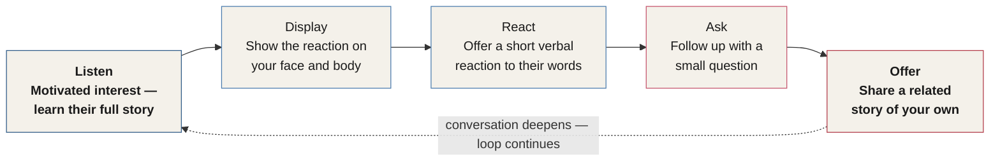
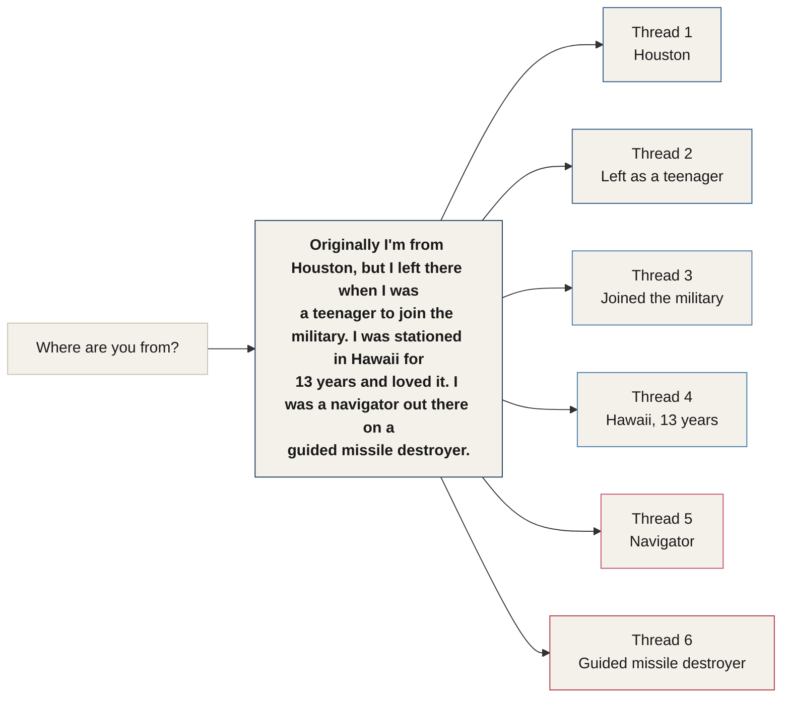

# Chapter 12 — Authority and Obedience

> *"Persuasion is 80% who you are, 15% what you do, and 5% who the other person is."*

In the coming sections, we will unpack the **Authority Triangle**, which you were first introduced to in the Pillars of Influence section back in Chapter 7. That triangle represents the key elements that make up authority. Authority is easy to deconstruct and analyze, because our ancestors left us several clues about it — clues that have been largely ignored until now.

Very few people are willing to undergo a personal transformation. What you're about to learn will not only change your life, but will give you enormous capacity to bring change to others' lives — change that can have positive effects for generations to come.

::: callout
**The Master Key.** Authority, charisma, and composure act, in many ways, as a master key to the human mind. Most people on this planet will live their entire lives without ever knowing how vulnerable they are to influence. The human brain has no firewall, and critical thinking can disappear in less than a second — without the person noticing the shift has occurred. Much of this is due to authority.
:::

To have true authority, you must possess certain social skills. This is because **influence is who you are versus what people think.** Before we open up the Authority Triangle itself, you need the foundation it's built on: social skill, small talk, and the mindset of an operator. That is the subject of this chapter.

---

## Social Skill: An Introduction to Charisma

Social skills win every time. The power of social skills cannot be underestimated. They contribute heavily to every aspect of our lives — from parenting, to how we interact with a spouse, to how we work with coworkers and a boss.

### The Flight Checklist Problem

If I handed you the flight checklist binder for a Boeing 737 aircraft, would you feel comfortable flying the plane? I hope not.

Most people — and even large companies — want to focus on a list of steps and techniques. They want the flight checklist instead of the skill to actually fly the plane. When people try to learn how to influence others, they want the scripts and formulas, but not the underlying skill.

I have a script that I wrote a long time ago that's guaranteed to get you a free coffee at any coffee shop. Everyone at my training events wants this script. I offer it to them with a question first: if I handed this same, perfect script to a person with social anxiety, how would they do?

They would not do very well, of course.

Now flip it. I could hand an arguably *bad* script to a person with high-level social skills, confidence, and charisma — and they would wipe the floor with the person holding the good script.

::: callout
**Scripts vs. Skills.** A script is a fixed set of words. A skill is the capacity to deliver — and adapt — any words at all. The scripts and tactics in this manual are only as powerful as the skill behind them. Build the skill first.
:::

But since you are likely intrigued, here is the free coffee script:

1. Walk up holding your phone as if looking at a map, and open with: *"Would you happen to know which way is northeast?"*
2. Pivot into a short, warm story: *"We had this huge volunteer project last year at the shelter, and it was fascinating how many people were so giving and completely generous — just giving of their time, for free."*
3. Make the ask: *"Oh, shoot — my wallet's in the car. Do you think I could get this on the house today?"*
4. Close with gratitude, using the employee's name if they're wearing a name tag: *"Thank you so much."*
5. Break eye contact and wait for them to say, "No problem."

Scripts can be exciting — but imagine having an incredible script *and* the authority and social skills to pull it off. Later in this manual, you'll hear loads of different scripts and tactics for all kinds of situations. First, though, I'd like you to develop your internal skills of authority, composure, and social ability. In the end, it all boils down to this: **persuasion is 80% who you are, 15% what you do, and 5% who the other person is.**

---

## The Art of Small Talk

The art of small talk is often discounted. People say they hate it, or complain that it's too shallow and that they prefer deeper conversation. But the fact is, small talk is an essential part of who we are as a society. Every social aspect of our lives involves some form of it.

Your ability to engage in small talk will become an essential building block toward reaching deeper connections, stronger impact, and deeper levels of influence. Small talk is important, regardless of how you feel about it — and, importantly, **this art form can be learned.** It is not a biological trait, and it's not something you're simply born with.

::: definition
**Good Small Talk — Three Rules.**
1. You show interest in them.
2. You share a similar or related story.
3. You make them feel *interesting* — not merely *interested*.
:::

While some people seem to be naturals when it comes to small talk, you can level up your own skill to master this art and become as good as — or even better than — a natural. Let's break down a few methods. You'll need these skills for many of the assignments that come later in this manual, so pay close attention and practice as much as required. Consider this your daily homework.

### The Small Talk Formula: Listen, Display, React, Ask, Offer

*Figure 12.1 — The Small Talk Formula. Each stage feeds the next, and Offer naturally loops back into more Listening as the conversation deepens.*

#### Listen

Listening comes first for a good reason: listening to others, and being genuinely interested in them, is what makes *you* interesting.

Remember people's names and stories. If someone offered you a thousand dollars to remember a stranger's name, would you? Of course you would. It's not about memory — it's about motivation. Stay motivated to know people well.

Instead of gathering only a brief summary of someone when you first meet them, challenge yourself to get a full rundown — a full picture of their life. You can use the contacts folder in your phone to take notes on what you learn: birthdays, favorite places to visit, children's names, and any other relevant information.

#### Display

Show your reaction to their remarks with your face and body, when it's appropriate. If someone is telling you a story about a moment they were surprised, your own surprise should show on your face. This is nonverbal proof that you don't just have empathy — you are interested and invested in the story they're telling you.

Display a nonverbal reaction to the key points in their stories whenever you can, to connect them to you. Once they see that their words are having an impact on you, they'll be more likely to keep communicating with you at an increasingly deeper level.

Even with someone you've known for years, make it a new goal to learn something new about them in every conversation. This small goal carries several benefits:

- You learn more about them.
- You make them feel interesting.
- You collect important information from them.
- You set up a positive feedback loop where the person becomes increasingly more open.
- You find small talk and concentration easier, because you start the conversation with this outcome already in mind.

#### React

Offer a verbal reaction to their words — even if it's only a few words of your own. This might look like:

> **Other person:** "I've been working at this company for about 18 months now, and I can't believe people ever leave. They take such good care of everyone."
>
> **Your response:** *"Sounds like an amazing place to work."* — said with raised eyebrows, to show excitement and surprise.

This small response prompts them to keep talking, or to ask you about your own life.

#### Ask

Ask a question to learn more. In the scenario above, you said, "Sounds like an amazing place to work." In this phase of the formula, you simply follow that up with a small question about the place they work — something like, *"Do you plan on staying for a while?"*

This small question, especially right after the reaction remark, prompts a smoother, more natural discussion that makes them feel good about talking with you. Most importantly, it makes them feel interesting.

#### Offer

After they answer the small question, offer a related story — something you read about that company, friends who enjoy their jobs, how you wish you could be working there, a story about your own favorite job, a heartfelt compliment about how the company's owner takes care of employees, or a similar story about finding the right place to work.

When this happens, the conversation flows, and plenty of topics naturally come forward that don't feel forced or contrived. The offer is the natural continuance of the flow of conversation.

Give this formula a try as soon as possible — even on the phone with a customer support specialist. Practicing keeps your skills sharp, especially when the stakes are low. These skills aren't meant to be something you turn on or activate only when you need them. They're meant to live within you and become part of your natural behavior.

---

## Cultivating Powerful Social Skills by Imitation

When you watch world-class communicators speak, you can absorb their behavior in many ways. Later in this manual, you will learn the skills to build a full behavior profile of people like this. For now, we just want to copy their style of nonverbal delivery.

You'll often hear people mention eye contact, posture, tone, and humor when they describe great communicators. These are fine observations — but they're missing an element. They are symptoms to focus on, not the cause.

::: callout
**Watch for the Worldview, Not the Symptoms.** When you study videos of great communicators, pay attention to their nonverbal indicators — but pay even more attention to this: their worldview. How does this person see the world? How do they see the person they're communicating with? What are they thinking as they communicate? What is their level of comfort? What is their level of genuine interest in the other person?
:::

Everyone — even Oprah — feels like a faker sometimes. Any behavior that's new needs to be practiced at first. Developing these new skills isn't faking it. **It's training.** In fact, the military's Special Forces use these same methods to develop new skills. Remember: you're not faking it, you're in training.

---

## Overcoming the Fear of Small Talk

Most of our issues with small talk stem from a fear of failure or embarrassment. This fear holds people back from making lifelong connections and developing valuable relationships. These fears are almost always ridiculous — but we listen to them anyway. That's because listening to fear kept our ancestors safe, at one point or another. We evolved into creatures that default to listening to fearful thoughts — the same ancestral-memory mechanism from Chapter 4: a behavior encoded because it once kept our ancestors alive.

Here is a quick list of possible fears you may feel in social settings:

- If I say anything, I might get embarrassed.
- The other person might not want to talk.
- If I start a conversation, I won't be able to end it, and I'll be stuck here forever.
- People don't like small talk.
- I won't be able to keep the conversation going.
- I don't know what to say to kick off the conversation.
- I could start a conversation, but it might sound stupid.
- What if I say the wrong thing?
- They look busy. I'll do it another time.

These are just a few examples of the hundreds of concerns that run through our heads in these types of social situations.

::: callout
**Journal Your Fears.** Keep a running list of these concerns in your journal, and keep adding to it — your list will be longer than you might imagine. Getting these thoughts out of your head and onto paper is important. When they stay in the dark, they have the power to operate without your consent, and often without your awareness. Getting them out lets you confront them head-on and strip them of their power. This is the same principle behind Rule 4 of the Behavioral Scripts from Chapter 4: *if a script is openly discussed, its power is lessened.*
:::

### The Biggest Fear in the Western World

What do you think the most common fear is? It's not death. They say it's public speaking, but technically that isn't true — no one is afraid of public speaking itself. What people are actually afraid of is the negative reaction they might receive *from* public speaking. Recognizing and clarifying this helps to control the fear.

The same reframe applies everywhere. When someone has a fear of heights, they actually have an irrational fear of *falling* from heights. When someone is afraid of spiders, they are actually afraid of *being bitten* by a spider. The irrationality of the fear becomes more apparent once it's labeled correctly — and it becomes clearer how unlikely the fear is to actually come true.

Here is an important fact: **almost all people appreciate it when you make the effort to speak with them.** If you have a fear of starting conversations, this is important to keep in mind.

### Whose Job Is It to Start the Conversation?

In order to advance your skills of influence, you must develop your ability to start conversations. If you can't start conversations and keep them going, you'll never feel comfortable leading them. Get this skill into your comfort zone as fast as you can. **The responsibility to guide a conversation lies on your shoulders.** Don't wait and assume the other person will speak first.

When I was younger, I played a game with friends at a local bar in Hawaii, where I was stationed in the military. The game was simple: you had to meet someone, then introduce them to strangers, then repeat.

I would approach a table with a few people having a beer, and introduce myself by starting a conversation. I'd get to know them and make them all feel interesting. Then I would excuse myself, meet another group of a few people, and do the same. Somehow, I would then bring the two groups together and introduce them all to each other. As they were talking with one another, I would turn back and start a conversation with yet another group — repeating the process until almost everyone in the bar had one thing in common: me.

Everyone assumed I knew the whole bar, even though I'd barely spoken to anyone individually. Eventually, I would overhear people bragging that they'd known me for a long time — even though they didn't know me at all. It was a very fun game.

### Conversation Starters

Here are a few one-liners that can get you started if you need help sparking a conversation:

- "How did you get started in the industry?"
- "What's the deal with [X]?"
- "What's your opinion on all this?"
- "What did you think about [X]?"

For kids or teens:

- "What class did you like most today? Why?"

Tech-help and shared-context openers:

- "Do you know how to crop a photo on here?"
- "I have a photo open on my phone — my friend and I are having a debate. Do you remember the actor's name from that movie?" <!-- ASR? verify: transcript reads "Do you remember the actor's name from Todd?" — reconstructed as a shared-context opener about a movie, consistent with the preceding "having a debate" and "photo open on your phone" fragments; the specific movie title could not be confidently recovered from the audio. -->

These vary in how formal or informal they are, but they can get you started in almost any situation.

---

## The FORD Method — Focusing the Conversation

Initial conversations tend to flow around a few key topics. In the military, we learned an acronym to represent these — you can use it to focus your conversations and questions around what matters most to people.

| Pillar | What to Ask About |
|---|---|
| **F — Family** | Them, and the people close to them |
| **O — Occupation** | What they do for a living — and what they like most about it |
| **R — Recreation** | What they like to do for fun |
| **K — Knowledge** | What they know a lot about |

*Figure 12.2 — The FORD Method, focused on the four topics most conversations naturally flow around.* <!-- ASR? verify: the widely-documented public version of this technique (Family, Occupation, Recreation, Dreams) is generally attributed to CX consultant John DiJulius. The transcript's fourth pillar is "Knowledge — what they know a lot about," not "Dreams" — retained as spoken since it may be Charles's own operational variant of the method. -->

This is a variation on the well-known small-talk technique usually taught as **FORD** — Family, Occupation, Recreation, Dreams. In this manual, the fourth pillar is Knowledge: what a person knows a lot about.

---

## The 4 Threads Formula

When you speak to anyone, you'll hear responses to questions that are basically socially programmed replies to basic questions. Usually, these responses are short and don't offer much to talk about. You can defeat these kinds of dead-end responses forever by using the **4 Threads Formula**.

::: definition
**The 4 Threads Formula** — offering a person four topics they can grab onto whenever they ask you almost anything.
:::

Here's an example of what you commonly hear in response to a basic question:

> **Person:** "Where are you from?"
> **You:** "Houston."

That reply doesn't do much to facilitate a conversation. But what if you could answer the question in a way that gives the person the answer *plus* four other things they can grab onto and talk about with you? It gives them far more opportunity to find common ground with you, and to start a more meaningful conversation.

Here's what it looks like when an operator uses the 4 Threads Formula:

> **Person:** "Where are you from?"
> **Operator:** "Originally I'm from Houston, but I left there when I was a teenager to join the military. I was stationed in Hawaii for 13 years and loved it. I was a navigator out there on a guided missile destroyer."

Let's look at that sentence again, thread by thread — when the listener hears something that interests them, they'll grab onto it and ask more:

*Figure 12.3 — The 4 Threads Formula in action. One sentence, six separate hooks — even if the listener has no interest in Hawaii, five other threads remain for them to grab onto.*

Even if the person hates Hawaii, they have several other options to talk about in their follow-up. This technique is so powerful that it can keep almost any conversation going indefinitely, especially when you pair it with the other techniques in this section.

---

## Brilliant on the Basics

The biggest mistake most people make, when they aren't successful at something, is searching for a solution more complex than it needs to be. If their problem feels complex, they feel the need for an equally complex solution to fix it. And if a solution turns out to be simple and easy, it can actually create discomfort — because if something so small could have solved the problem, why didn't they do it in the first place?

They feel silly at that point, so they forego the simple solution and continue looking for more complex ones. In reality, they should be thinking differently. We often don't want to attribute our failure to simple solutions, just to keep our egos intact. Complexity becomes part of our identity.

This section is about self-development and building personal authority. To achieve that, pay close attention to three actions:

1. **Set priorities.**
2. **Set goals.**
3. **Measure progress.**

::: callout
**The Kindergarten Test.** A good rule of thumb: if a kindergartner wouldn't be able to fully understand a solution, it's probably not the right solution. Think about the incredible life changes a person could achieve by just following the advice given to children in kindergarten:

Make your bed. Show interest in others. Exercise. Brush your teeth. Don't put others down. Enjoy yourself. Be kind. Wake up early, go to bed early. Eat healthy foods. Take it one step at a time. Be in charge of your own mood.

These are all things we learn before second grade. How many of these rules do you fully live by today? All the overly complex self-help books in the world can't stand up to the wisdom we give to children — wisdom we so rarely follow ourselves.
:::

In the military, there's a saying I've always thought was incredible, and I've used it personally and professionally for decades: **don't worry about advanced until you're brilliant on the basics.** In other words, getting good at the basics is the foundation of the house. This is the same idea behind Law 11 of the 13 Laws of Influence from Chapter 4 — *"Get brilliant on the basics while others seek skill placebos."* Let's build it here.

---

## The Rock in the Shoe

This concept refers to what happens when someone tries to appear natural while experiencing discomfort below the surface. It gives off a visible appearance of discomfort, or the masking of something hidden.

This can happen when a part of your personality feels unnatural — and therefore uncomfortable. It will happen as you develop your skills. And it's something that reduces over time, the more you practice these skills through repetition.

---

## Demon Exposition

Exposing your demons refers to identifying your weaknesses *before* your strengths. There are countless business books that talk about finding your strengths and leveraging them. That may sound good — but imagine applying this strategy to your children. If your child is failing English and math, should you tell them to ignore it so they can focus on art and history instead? No. Your attention should be on the areas where they're failing. The focus should be on preventing failure, not on inflating grades in the areas where they're already succeeding.

What if you adopted this same strategy with your car? The engine is failing, so you spend a load of money getting the windows tinted. That would make no sense.

::: callout
**Weaknesses First.** To be successful, we must acknowledge our points of failure first, then focus on our strengths. Identifying your own areas of weakness is something you will do later in this section. It's critical to know any behaviors you have that could be contributing to outcomes in your life you didn't want.
:::

Don't get me wrong — focusing on strengths is great. But only *after* you've identified, and are working on, any low points that could cause failure in your life. You don't necessarily need an immediate plan to deal with them, but you must be aware of them, so you can spot them when they come into play or start interfering with your life and business.

---

## The Operator's Mindset

Being in full authority means having the mindset of a true operator. You probably already know that mindset makes success happen more than skill does. It's the reason that if all the money in the world were divided equally among everyone, that money would soon return to the very same pockets it came from.

There are four mindset ratings an operator can have. It's important to keep track of your own mindset daily — just keeping track can allow your subconscious mind to help bring it to where it needs to be.

- **Mindset 1 — Succeeding.** *"I can do anything, and I have the tools I need to accomplish anything. If I'm missing a tool, I will find it and succeed."*
- **Mindset 2 — Lacking.** *"I can do anything, but I don't have the tools and resources that other people seem to have."*
- **Mindset 3 — Restricted.** *"Everything I want is accessible, but I'm not the kind of person who can accomplish, earn, or achieve these kinds of things."*
- **Mindset 4 — Failing.** *"With no capability, and everyone else taking all the resources from the rest of us, there's nothing I can do."*

Identifying your own quadrant will help make sense of the tools you're about to learn in this section. It also carries some surprising benefits you may not expect — it has the potential to show you where many of the beliefs holding you back tend to reside. You might notice your own self-talk surfacing as you move through this material.

::: callout
**A Flashlight for Your Blind Spots.** This mindset review sits here at the beginning on purpose — to give you a flashlight to shine into your own dark corners, where some of your limiting beliefs might be hiding. It's the same flashlight metaphor used for the RAS in Chapter 11 — only here, it's pointed inward. Pay attention to your own self-talk as you move through this chapter on authority.
:::

---

## Key Takeaways

- **Authority, charisma, and composure act as a master key to the human mind.** The brain has no firewall — critical thinking can disappear in under a second, without the person noticing the shift. This chapter builds the foundation for the Authority Triangle, unpacked in the sections that follow.
- **Scripts are not skills.** A great script in the hands of someone with weak social skills fails; a mediocre script in the hands of someone with genuine skill succeeds. Build the skill first — **persuasion is 80% who you are, 15% what you do, and 5% who the other person is.**
- **Small talk is a learnable skill, not a trait.** Good small talk follows three rules: show interest, share a related story, and make the other person feel *interesting* — not merely interested.
- **The Small Talk Formula** — Listen, Display, React, Ask, Offer — is a repeatable structure for turning any exchange into a real conversation. Practice it in low-stakes settings until it becomes natural.
- **Imitate the worldview, not just the symptoms.** Eye contact, posture, tone, and humor are outputs. What separates great communicators is how they see the world and the person in front of them. New behavior isn't faking — it's training, the same way Special Forces train new skills.
- **Fear of small talk is almost always irrational**, and naming a fear correctly — public speaking is really fear of negative reaction; heights is really fear of falling — strips it of power. Journaling your fears applies Chapter 4's Rule 4 directly: a script openly discussed loses its grip.
- **The responsibility to start a conversation is always yours.** Waiting for the other person to go first is a losing strategy.
- **The FORD Method** (Family, Occupation, Recreation, and — in this manual's variant — Knowledge) focuses a conversation around the topics people naturally gravitate toward.
- **The 4 Threads Formula** turns a one-word answer into four or more conversational hooks, giving the other person far more surface area to find common ground with you.
- **Get brilliant on the basics before chasing advanced technique** — a direct application of Law 11 from Chapter 4. If a kindergartner couldn't understand a solution, it's probably the wrong one.
- **The Rock in the Shoe** — new skills will feel unnatural and create visible discomfort at first. This fades with repetition.
- **Demon Exposition** — identify your weaknesses before you build on your strengths. Fixing what's failing matters more than polishing what already works.
- **The Operator's Mindset** has four levels — Succeeding, Lacking, Restricted, Failing — defined by the self-talk running underneath them. Identifying your own mindset is the flashlight into your own limiting beliefs.

<!--
## Change Log

| Original (transcript) | Corrected | Reason |
|---|---|---|
| "small book is an essential part" | "small talk is an essential part" | ASR mishearing — clearly "small talk," matching the section's entire subject |
| "get a full rundown, full degree in their life" | "get a full rundown — a full picture of their life" | Grammar repair; "full degree" does not form a coherent phrase in context, "full picture" preserves the intended meaning of thoroughness |
| "You set up a passitive behavior where the person becomes increasingly more open" | "You set up a positive feedback loop where the person becomes increasingly more open" | ASR mishearing of "positive"; "feedback loop" clarifies the compounding effect described |
| "Once their level of comfort, once their level of genuine interest in the other person." | "What is their level of comfort? What is their level of genuine interest in the other person?" | Broken rhetorical pattern — surrounding sentences are all parallel questions ("How does this person see the world?" etc.); "Once their" does not fit and is almost certainly a mishearing of "What's their" |
| "There's a few one miners that can get you started" | "Here are a few one-liners that can get you started" | ASR mishearing of "one-liners"; confirmed by the list of short conversation-starting phrases that follows |
| "Do you know how to crop a photo on here, and then a photo open on your phone? My friend and I are having a debate. Do you remember the actor's name from Todd?" | Split into two separate openers: "Do you know how to crop a photo on here?" and "I have a photo open on my phone — my friend and I are having a debate. Do you remember the actor's name from that movie?" | ASR ran two distinct one-liner examples together; separated along the natural sentence break. "Todd" does not parse as a name, place, or title in context and was reconstructed as "that movie" (flagged inline) |
| "The acronym is four. Family... Occupation... Recreation... And knowledge what they know a lot about." | "The FORD Method" (Family, Occupation, Recreation, Knowledge) | "Four" is a near-homophone of the real, well-documented small-talk acronym FORD (Family, Occupation, Recreation, Dreams); corrected the acronym name to match verified real-world terminology while preserving the transcript's own fourth pillar ("Knowledge") as spoken, flagged inline as a possible personal variant |
| "You say Houston?" | "You: 'Houston.'" | Punctuation/formatting fix — presented as a flat reply, not a question, consistent with the point being made about dead-end answers |
| "Is an example of what you commonly hear in response to a basic question." | "Here's an example of what you commonly hear in response to a basic question." | Grammar repair |
| "Is that sentence again? Originally, I'm from Houston. Thread. So I left when I was a teenager, two threads. To join the military, that bread. I was stationed in Hawaii, for thread, 13 years, and loved him. I was a navigator, bit thread, out there, a guided missile destroyer. Sixth thread." | "Let's look at that sentence again, thread by thread..." — reconstructed as six clearly numbered threads (Houston / left as a teenager / joined the military / Hawaii for 13 years / navigator / guided missile destroyer) | Heavy ASR numeral misreading, consistent with the same failure pattern already logged in Chapter 4 ("Right." for "Three."/"Five."); "two threads" → "thread two," "that bread" → "thread three," "for thread" → "thread four," "loved him" → "loved it" (referring to Hawaii, not a person), "bit thread" → "thread five," "Sixth thread" → "thread six" |
| "why didn't they do us in the first place?" | "why didn't they do it in the first place?" | ASR mishearing — "it" (the simple solution), not "us" |
| "Said priorities. Set goals. Measure progress." | "Set priorities. Set goals. Measure progress." | ASR mishearing of "Set," made obvious by the parallel construction with "Set goals" immediately following |
| "Pranks us, be in charge of your own mood." | "Be in charge of your own mood." | The lead-in word before this item does not form a coherent word or phrase in any reasonable reconstruction and was treated as ASR noise, not as dropped author content — the substantive instruction ("be in charge of your own mood") is fully preserved |
| "Recognizing and clarifying this helps to control this fare." | "...helps to control the fear." | ASR homophone error ("fare" / "fear") |
| "they are amply afraid of being bitten by a spider" | "they are actually afraid of being bitten by a spider" | ASR mishearing; matches the parallel "they actually have an irrational fear" one sentence earlier |
| "The irrationality of the fair becomes more apparent" | "The irrationality of the fear becomes more apparent" | ASR homophone error ("fair" / "fear") |
| "strip them with their power" | "strip them of their power" | Grammar repair |
| "What have you adopted this strategy with your car?" | "What if you adopted this same strategy with your car?" | ASR mishearing ("have" / "if"); matches the parallel construction two sentences earlier, "Imagine if you did this to your children" |
| "Mindsets one... Mindset too... Mindset's free... Mindset four." | "Mindset 1... Mindset 2... Mindset 3... Mindset 4." | ASR numeral misreading of "one/two/three/four" as "one/too/free/four," the same failure pattern seen elsewhere in the manual |
| "this sanction" | "this section" | ASR homophone error ("sanction" / "section") |
-->
