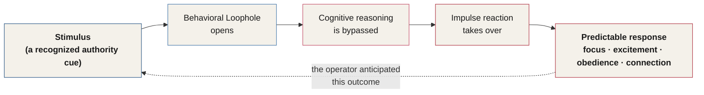
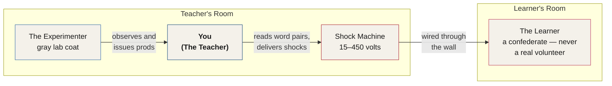
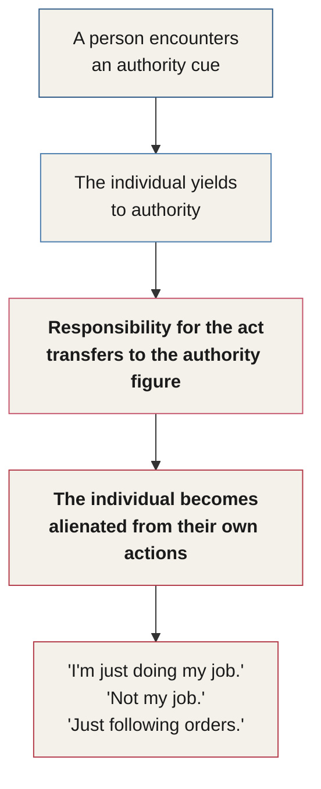

# Chapter 13 — The Agentic Shift

> *"It is not so much the kind of person a man is as the kind of situation in which he finds himself that determines how he will act."* — Stanley Milgram

Normal people can become murderers in less than an hour.

Listen to this short quote from Dr. Stanley Milgram, regarding the infamous experiment — first run in 1961 — that we'll cover next:

> *"I observed a mature and initially poised businessman enter the laboratory, smiling and confident. Within twenty minutes, he was reduced to a twitching, stuttering wreck, rapidly approaching a point of nervous collapse. He constantly pulled on his earlobe and twisted his hands. At one point he pushed his fist into his forehead and muttered, 'Oh God, let's stop it.' And yet he continued to respond to every word of the experimenter, and obeyed to the end."*

It was the summer of 1961. In New Haven, Connecticut — 73 degrees outside, a gentle breeze. Inside an unassuming red brick building on the Yale University campus, a man in a gray lab coat was talking strangers into murder.

What do you think it would take for you to be talked into murder? Most people would reply that they could never be talked into such a thing. However, 65% of the participants in the study shocked another human being to death. Or at least they thought they did.

What causes a human to go from zero to killer? If 65% of us are willing to kill because a stranger in a lab coat tells us to, should we worry?

---

## The Fortress Illusion

Just like we have visual blind spots, we have behavioral blind spots — a small hole that allows someone to reach into our mind and start pulling levers they shouldn't have access to. What if this mental blind spot is something that could be measured, exploited, and used for controlling not only people in a lab, but entire communities?

None of us would like to believe we are this vulnerable to the world around us. We tend to go through our lives firmly believing that our minds are somewhat of a fortress — that the only access is what we allow.

::: definition
**The Fortress Illusion** — the false belief that your mind is a locked, self-controlled fortress, entered only by what you consciously permit. It is not only incorrect, it is dangerous to believe. Imagine going to sleep with the rock-solid belief that all your doors are locked tight — you'll sleep more soundly, but if you've missed some doors, the house isn't secure. The Fortress Illusion makes us an easier target for persuasion and authority precisely because it lets us relax when we should be paying closer attention.
:::

In this section, we're going to closely examine the research into obedience — digging through the psychological factors at play, and investigating what's happening in the mind when a person is under the spell of authority. Next, we'll discuss the factors that trigger that automatic obedience, and how you can trigger that same response in others.

## The Behavioral Loophole

In our examination of authority, I want to illustrate exactly how authority triggers automatic obedience, and expose the secrets behind it. We're going to investigate and dissect the causes, reasons, and dark sides of automatic human behavior. With this, I'll distill the exact methods to access these behavioral loopholes.

::: definition
**Behavioral Loophole** — an inborn quality of the human brain, rooted in protecting us from harm. It is an automatic response to a specific type of stimulus that creates a gap in our behavior: we instantly shift from *processing* information through cognitive reasoning to *reacting* to information through impulse. Because these loopholes are universal in human behavior, they can be reliably exploited — allowing an operator to predict an outcome, and use the loophole to obtain a desired impulse response, such as focus, excitement, or a desire to connect.
:::

*Figure 13.1 — The Behavioral Loophole. A recognized stimulus bypasses cognitive reasoning entirely, producing a predictable, exploitable impulse response.*

Why and how can a person hijack the human brain's normally rational decision-making centers? Let's find out.

---

## Meet Stanley Milgram

Imagine it's 1962. You respond to a newspaper ad that reads: *"We'll pay you $4 for one hour of your time."* It says a study on memory is being conducted at Yale University, and they need all types of people. They'll even pay you for the gas to come to campus. All you have to do is mail a detachable coupon to Dr. Stanley Milgram.

Before we walk through what happens next, it's worth knowing who was waiting for you on the other side of that coupon.

Dr. Stanley Milgram was of average height and a serious person. He grew up in the Bronx. His mother, Adele, had emigrated from Romania; his father, Samuel, from Hungary — both arriving in the United States during World War I. His father ran his own bakery in the Bronx. Many of his extended family stayed with them during his childhood, some still bearing Nazi concentration camp tattoos. This left quite a mark on Milgram's personality — at his own bar mitzvah, his speech was solely about the suffering European Jews endured in World War II, and how those events would impact Jews around the world for decades to come.

He earned his bachelor's degree in political science from Queens College, New York, in 1954, and his PhD in 1960 from Harvard in social psychology. He began teaching at Yale shortly thereafter.

Milgram's research showed a special interest in Adolf Eichmann, an organizer of the Holocaust. Eichmann's trial in Israel — and his defense that he was simply "following orders" — inspired the development of the obedience experiments. Milgram simply wanted to know: was it true that a person could commit atrocities, as Eichmann claimed while standing trial, simply because they were "just following orders"?

---

## Walking Into the Lab

When you arrive, a doctor greets you and one other participant in the lobby and explains the study: *"We'll be conducting a study on memory and learning. One of you will be the teacher, and one will be the learner. The teacher will read a pair of words to the learner in the next room. If the learner responds incorrectly, the teacher will administer increasing electric shocks."*

You draw the straw for the teacher position — though in reality, that draw was always rigged. The "learner" in the experiment was always an actor, a confederate who never actually volunteered to be a test subject. The real, naive volunteer was always assigned the teacher's role.

The man in the lab coat shows you where the learner will be seated in the next room. As he does, he lets you see the electrodes placed onto the learner's arm — so that you feel the same electricity the learner will supposedly feel. You exit the room with the man in the lab coat and close the door.

You're shown to the teacher's station. At this desk, there's a large electrical control box with shock levers ranging from 15 to 450 volts, finally ending in the letters "XXX" on the final shock lever. Next to the shock machine, there's a clipboard with the groups of words you're to read to the learner.

::: callout
As you take your seat, there's a 65% chance you'll go so far as to "kill" the person in the next room.
:::

*Figure 13.2 — Inside the lab. The shock machine and the experimenter both sit in the teacher's room, next to you — the learner is heard, never seen.*

As participants entered, they had the opportunity to feel a sample shock from the machine — which was, in fact, the only real shock delivered in the entire experiment. After the learner was situated in his seat, the man in the lab coat detailed the purpose and procedure: this was a test of human memory and learning. The teacher would read several word pairs and offer the learner a multiple-choice question to match them. If the learner answered correctly, the teacher would say so through the microphone on the desk beside the shock machine — a microphone that looked like something a 1980s police dispatcher would use. If the learner answered incorrectly, the teacher was to deliver a shock that increased in voltage with each wrong answer.

Initially, the learner would get several answers correct. But as time passed, the number of incorrect answers increased, and the teacher — according to the rules of the experiment — had to continue delivering increasingly painful electric shocks. Of course, the learner was an actor, and no shocks were ever actually delivered — but the teacher did not know this.

The teacher was told the microphone was a one-way communication tool, but he could hear the protests, screaming, and pleas for help through the wall. The sounds of the learner in pain were, in fact, coming from a recording — prerecorded pain responses, begging to end the experiment, and outright screams. Every teacher expressed disapproval, discomfort, and stress; some cried.

Sometimes the discomfort from the screams and the escalating shocks made a volunteer quit and terminate the experiment early. But for most, they made it well past 200 volts before they refused to go further — if they refused at all. They continued even while witnessing screams, painful protests, and demands to stop the experiment coming from the adjacent room. The volunteers' actions caused them real stress and emotional pain. Throughout the experiment, even as most continued to obey the man in the lab coat, participants would sweat, cry, tremble, stutter, and pull their hair — as they knowingly continued to inflict dangerous electric shocks on the stranger in the next room.

So why would these people obey? What triggers this response?

---

## Predictions vs. Reality

The participants' response wasn't an anomaly at all. In fact, we can look at the predictions of what would happen versus the actual results of the experiment. A team of psychologists and doctors analyzed the experiment before it began, to estimate what level of obedience would be achieved.

The team predicted that 99% of participants would refuse to obey all the way to 450 volts. In reality, 65% went all the way, continuing to 450 volts until the experiment was finished — despite the agonizing screams and cries of the man in the next room.

The team predicted that 86% of people would refuse to go to the dangerous level of 210 volts. In reality, every single participant obeyed — 100% of participants shocked the man in the next room all the way to 210 volts.

---

## The Agentic Shift

In the 2015 film *Experimenter*, actor Peter Sarsgaard portrays Dr. Milgram and discusses a concept he calls the agentic state. He looks into the camera and says:

> *"There was a time, I suspect, when men and women could give a fully human response to any situation, when we could be fully absorbed in the world as human beings. But more often now, people don't get to see the whole situation. It's only some part of it. There's a division of labor, and people carry out small, narrow, specialized jobs, and we can't act without some sort of direction from on high. I call this the agentic state. The individual yields to authority, and in doing so, becomes alienated from his own actions."* (*Experimenter*, 2015)

::: definition
**The Agentic State** — the mental reorganization of responsibility for one's own actions. In the agentic state, a person no longer views the responsibility for their actions as their own. Instead, they place that responsibility onto the person who is in a position of authority. Milgram identified this state as a social psychologist trying to expose the thought processes of war criminals who claimed they were "just following orders" while committing atrocities.
:::

The agentic state is store policy. It's *"I'm just doing my job."* Or, *"That's not my job."* Or, *"I don't make the rules."* *"We don't do that here."* *"Just following orders."* *"It's the law."* In the agentic state, the individual defines himself as an instrument carrying out the wishes of others — a soldier, a nurse, an administrator, an actor, a corporate employee, or even academics and artists.

*Figure 13.4 — The Agentic Shift. Once responsibility transfers to the authority figure, the individual's own moral brakes disengage.*

In everyday life, we see this agentic state everywhere. The mere presence of an authority figure — or someone we merely perceive as having authority — causes this agentic shift to begin, and triggers this automatic obedience response.

In the Milgram experiment, the authority figure was nothing more than a well-groomed man in a lab coat with a clipboard. He had no actual title, name tag, or credentials. The lab coat and his behavior alone triggered an agentic shift in everyone who participated. 100% of participants obeyed all the way to 210 volts.

Of course, if someone interviewed you beforehand and asked whether you'd go all the way to 450 volts, you'd likely insist you never would — that you'd resist the experimenter and walk out of the room. But the experiment has been replicated over 100 times with extremely similar results. Most "kill." Everyone obeys to some extent. Everyone.

---

## Why We Obey

So why do people obey? The experimenter never issued orders, shouted, screamed, demanded, or otherwise threatened anyone. He just spoke — and only ever used four prods to obtain full compliance.

| Prod | What the Experimenter Said |
|---|---|
| 1 | "Please continue." |
| 2 | "The experiment requires that you continue." |
| 3 | "It's absolutely essential that you continue." |
| 4 | "You have no other choice but to continue." |

*Figure 13.5 — The four prods. No threats, no orders — just four calm, escalating statements were enough to carry most participants to the end of the board.*

Dr. Milgram thought the university setting might have been contributing to the obedience — that a lab on a university campus could create some inherent, subconscious assumption of safety. So after repeating the experiments inside shabby apartments in low-end parts of town, researchers found that the same results continued to occur. Even performing the experiment in 21 other countries, in varying settings, still produced shockingly similar results (Blass, 2004).

### Variations of the Experiment

Milgram went on to vary certain aspects of his experiments:

- **Distance from the experimenter.** By moving the experimenter — the man in the lab coat — further away from the participant, the likelihood of disobedience increased.
- **The learner pounding on the walls.** Milgram had the learner begin pounding on the walls at one point, to see if it would change the rate of disobedience. It didn't change much.
- **Physical proximity and touch.** One variation drastically increased a participant's likelihood of disobedience: bringing the learner into the same room, and having the teacher physically hold the learner's hand down onto a metal plate placed on the same desk as the shock machine, in order to deliver the shock.

What does this experiment show us? If you just look at the numbers, it appears that a great deal of your neighbors could randomly turn into murderous villains. But that isn't the case. The reality is that our brains are almost hardwired to follow people with authority — authority is something else our brains are built to look for.

From about age two, we learn about authority, social conformity, and obedience. Obedience alone makes our lives easier, and becomes the go-to response when we meet authority figures. It's so ingrained in our behavior that we don't notice the agentic shift taking place. It is sometimes too late before we're able to realize we've given up control.

---

## Perceived Authority vs. Real Authority

The participants in the Milgram experiment walked into a Yale University building and met a well-groomed, well-spoken man in a pressed gray lab coat. The lab coat alone is usually enough to trigger obedience in others, as we'll discuss in a later investigation. This lab coat gave the experimenter no real authority at all — it was all *perceived* authority.

What happens differently when we encounter perceived authority versus real authority? Nothing. Our brains don't scan the scenario for the differentiation unless there's some glaringly obvious reason to do so.

::: callout
**Perceived authority is equally effective.** In one of the Milgram experiments, a man in a lab coat took a regular sampling of people throughout a city who were not students — and, using nothing more than a few phrases, convinced them to "murder" a total stranger. Through clenched fists, crying, protests, hair-pulling, and wrenched faces, they obeyed. And they killed.
:::

Was it just the lab coat? Did people just naturally respond to it in some mysterious way? There is a well-researched human reaction to lab coats and medical personnel in general — what's known as the white coat effect. But there's no evidence to suggest the white coat effect alone was fully responsible for the results of the Milgram experiment (Brase & Richmond, 2004). Soon, we will dissect a few more studies and pull back the layers of human obedience to perceived authority.

The factors responsible for the high level of obedience in the Milgram experiment are varied — but we can break most of them down into replicable parts: behavior, speech, appearance, and wants, all unconsciously projected by the authority figure. These are the same tripwires wired into the Effect side of the **Authority Triangle** from Chapter 7 — the unconscious cues a subject reads to decide, in an instant, whether authority is present. And they run on the same circuitry as the **ancestral programming** at the base of the Hierarchy of Influence Factors: authority is not a modern social nicety, it is one of the oldest, deepest scripts our ancestors left running in us.

In the Milgram experiments, there were very clear patterns that repeat themselves countless times in your everyday life. What's surprising is how little attention you likely pay to these patterns. Chances are you've seen them a dozen times this week alone. When you begin to recognize them, things change. Big time.

---

## Key Takeaways

- **The Fortress Illusion** — the false belief that your mind is a locked fortress accessed only by what you consciously allow — makes you an easier target for authority and persuasion, not a harder one, because it lets you relax when you should be paying attention.
- **A Behavioral Loophole** is an inborn quality of the brain, rooted in self-protection, that shifts a person from cognitive reasoning to impulse reaction the instant it's triggered — universal enough to be reliably exploited by an operator.
- **The Milgram obedience experiments (Yale, first run in 1961)** showed that 100% of participants obeyed to 210 volts, and 65% obeyed all the way to 450 volts — far beyond what the psychologists who reviewed the design in advance predicted (99% expected refusal at 450V; 86% expected refusal at 210V).
- **The Agentic State** is the mental reorganization of responsibility: a person stops seeing their actions as their own and hands that responsibility to the authority figure in front of them. It's "just following orders," "not my job," and "store policy" — heard everywhere, every day.
- **The four prods** the experimenter used to sustain full obedience were entirely non-coercive — no threats, no shouting, just four calm, escalating statements.
- **Obedience wasn't about Yale, and it wasn't unique to America.** The results held in shabby off-campus offices and across replications in 21 other countries.
- **Distance and touch change obedience dramatically; sound does not.** Moving the experimenter farther away sharply increased disobedience, and forcing physical contact between teacher and learner drastically increased it — but the learner pounding on the wall barely moved the needle.
- **Authority triggers obedience from around age two onward**, and becomes such an automatic, go-to response that most people never notice the agentic shift taking place until it's already happened.
- **Perceived authority works exactly as well as real authority.** The lab coat carried no title, credential, or actual power — and it was enough. Our brains don't check credentials unless something glaringly forces the distinction.
- **The white coat effect is real but insufficient on its own** to explain Milgram's results — the deeper drivers are the same behavior, speech, appearance, and unconscious "wants" that make up the Effect side of the Authority Triangle from Chapter 7, running on the same ancestral programming that sits at the base of the Hierarchy of Influence Factors.

<!--
## Change Log

| Original (transcript) | Corrected | Reason |
|---|---|---|
| "regarding his infamous experiment from 1963, the Will cover next" | "regarding the infamous experiment — first run in 1961 — that we'll cover next" | Grammar repair ("the Will cover" → "that we'll cover"); date correction — Milgram's obedience experiments were conducted starting August 1961 at Yale; 1963 is the year the findings were published in the Journal of Abnormal and Social Psychology, a commonly conflated date. Verified via web search. |
| "a mature and initially polished businessman" | "a mature and initially poised businessman" | ASR mishearing — verified against Milgram's actual published quote, which reads "poised," not "polished." |
| "He constantly pulled on his air lobe and twisted his hands." | "He constantly pulled on his earlobe and twisted his hands." | ASR mishearing ("air lobe" → "earlobe"), confirmed against the verified original quote. |
| "muttered, oh God, let's stop him" | "muttered, 'Oh God, let's stop it.'" | ASR mishearing ("him" → "it") — corrected against the verified original quote, which refers to stopping the experiment, not a person. |
| "And yeah, he continued to respond" | "And yet he continued to respond" | ASR mishearing ("yeah" → "yet"), confirmed against the verified original quote. |
| "It was July of 1963." | "It was the summer of 1961." | Factual/date correction to match when the experiment was actually conducted (see above); exact month not independently verifiable, so narrowed to "summer" rather than asserting July. |
| "an unassuming red bricks building" | "an unassuming red brick building" | Grammar repair. |
| "What is, just like we have visual blind spots, we have behavioral blind spots." | "Just like we have visual blind spots, we have behavioral blind spots." | ASR mishearing/false start ("What is") removed as filler; sentence reads cleanly without it. |
| "What of this mental blind spot is something that could be measured?" | "What if this mental blind spot is something that could be measured," | ASR mishearing ("What of" → "What if"), matching the rhetorical-question pattern of the surrounding sentence. |
| "Is not so much the kind of person a man is. is the kind of situation in which he finds himself. that determines how he will act." | "It is not so much the kind of person a man is as the kind of situation in which he finds himself that determines how he will act." | Reconstructed as Milgram's real, verified quote (from *Obedience to Authority*, 1974), which the ASR had broken into disconnected fragments with incorrect punctuation. |
| "Imagine it's 1962." | Retained as-is | Not corrected — Milgram's data collection ran from August 1961 through May 1962, so 1962 remains accurate for a participant responding to the ad later in that window. |
| "Bead says a study on memory is being conducted" | "It says a study on memory is being conducted" | ASR mishearing ("Bead says" → "It says"). |
| "You exit the room with the man in the loud coat." | "You exit the room with the man in the lab coat." | ASR mishearing ("loud coat" → "lab coat"), consistent with every other reference to the lab coat in the chapter. |
| "Unless you feel the electricity that the learner will feel." | "so that you feel the same electricity the learner will supposedly feel" | ASR mishearing ("Unless" → "so that"); reconstructed to match the documented procedure, in which the real participant received a genuine sample shock before the study began. |
| "ending in the letters, XXX on the final shock weaver" | "ending in the letters 'XXX' on the final shock lever" | ASR mishearing ("weaver" → "lever"), consistent with "shock levers" earlier in the same paragraph. |
| "His parents, Adele and Samuel, emigrated from Romania during World War I." | "His mother, Adele, had emigrated from Romania; his father, Samuel, from Hungary — both arriving in the United States during World War I." | Factual correction verified via web search — Milgram's mother emigrated from Romania and his father from Hungary, not both from Romania. |
| "Some still bearing Nancy concentration cam tattoos." | "some still bearing Nazi concentration camp tattoos" | ASR mishearing ("Nancy" → "Nazi", "cam" → "camp"). |
| "from Queen's College, New York, in 1954, and his PhD in 1961 from Harvard" | "from Queens College, New York, in 1954, and his PhD in 1960 from Harvard" | Spelling correction ("Queen's College" → "Queens College," the institution's actual name) and factual date correction (PhD conferred 1960, not 1961), both verified via web search. |
| "as I can said, while standing trial in Israel, that I was just following orders" | "as Eichmann claimed while standing trial, simply because they were 'just following orders'" | ASR mishearing ("as I can said" → "as Eichmann [claimed]") — Adolf Eichmann is the real historical figure the sentence is about, confirmed by context and web search. |
| "Who never volunteered to participate was always given the teacher straw." | "a confederate who never actually volunteered to be a test subject. The real, naive volunteer was always assigned the teacher's role." | Grammar/clarity repair — the fragment as transcribed reversed the roles; reconstructed to match the documented procedure (the rigged draw always made the real volunteer the "teacher"). |
| "In the learner's room, there was also a desk, chair, and a large 3 foot long machine... Seated behind the learner's chair, however, was a separate desk and chair, reserved for the man who'd be overseeing the experiment." | "In the teacher's room: desk, chair, shock machine; separate desk/chair behind for the experimenter" | Corrected an ASR room-label mix-up ("learner's room" → "teacher's room") — the shock machine and the experimenter's desk were in the same room as the teacher/participant, not the learner, per the documented procedure; the surrounding paragraphs (a participant "exits the room," is "shown to the teacher's station") only make sense with this correction. |
| "which was actually the only real shop delivered" | "which was, in fact, the only real shock delivered" | ASR mishearing ("shop" → "shock"). |
| "was very well grinned" | "was well-groomed" | ASR mishearing ("grinned" → "groomed"), consistent with the later, unambiguous "well-groomed, well-spoken man" description of the same figure. |
| "the learner was actually an anton" | "the learner was an actor" | ASR mishearing ("an anton" → "an actor"). |
| "made the volunteers quick and terminated the experiment" | "made a volunteer quit and terminate the experiment early" | ASR mishearing ("quick" → "quit"). |
| "coming from the adjacent ring" | "coming from the adjacent room" | ASR mishearing ("ring" → "room"). |
| "In fence, we can look at" | "In fact, we can look at" | ASR mishearing ("fence" → "fact"). |
| "to make estimations on one level of obedience would be achieved" | "to estimate what level of obedience would be achieved" | Grammar repair. |
| "In reality, Every participant obeyed." | "In reality, every single participant obeyed." | Capitalization/grammar repair. |
| "Actor Peter Sarsgan portrays Dr. Milgram" | "actor Peter Sarsgaard portrays Dr. Milgram" | Spelling correction — verified real actor's name via web search. |
| "On the radar, 2015." | "(*Experimenter*, 2015)" | Reconstructed as an inline film citation — the fragment as transcribed doesn't parse as a sentence, and the quote it follows is drawn directly from the 2015 film *Experimenter*. |
| "an a gentic shift" | "an agentic shift" | ASR word-boundary error ("a gentic" → "agentic"). |
| "This lab code gave the experimenter no real authority at all." | "This lab coat gave the experimenter no real authority at all." | ASR mishearing ("lab code" → "lab coat"). |
| "What happens differently and we counter perceived authority versus real authority. Nothing." | "What happens differently when we encounter perceived authority versus real authority? Nothing." | ASR mishearing ("and we counter" → "when we encounter") and punctuation repair. |
| "Received authority is equally effective." | "Perceived authority is equally effective." | ASR mishearing ("Received" → "Perceived"), matching the paragraph's entire subject (perceived vs. real authority). |
| "Milgrim" (multiple instances) | "Milgram" | ASR misspelling normalized to the correct spelling throughout, matching the correct spelling used elsewhere in the same transcript. |
| "the same results continued to occur... Even performing the experiment in 21 other countries, in varying sensing" | "...in varying settings" | ASR mishearing ("sensing" → "settings"). |
| "Glass 2004" | "Blass, 2004" | ASR mishearing of the real researcher's surname — Thomas Blass, author of *The Man Who Shocked the World: The Life and Legacy of Stanley Milgram* (2004) and of the definitive cross-cultural review of Milgram replications. Verified via web search. |
| "by moving the experimenter, the man in the land coat" | "by moving the experimenter — the man in the lab coat" | ASR mishearing ("land coat" → "lab coat"). |
| "hold the learner's hand down onto a metal plate... as the shot machine" | "...as the shock machine" | ASR mishearing ("shot" → "shock"). |
| "Is something else that our brains look for." | "authority is something else our brains are built to look for" | Grammar reconstruction — the dangling fragment was merged into the preceding sentence about brains being hardwired to follow authority. |
| "Obedience alone makes our lives easier. and becomes the go to response" | "Obedience alone makes our lives easier, and becomes the go-to response" | Grammar/punctuation repair. |
| "This lab code gave the experimenter no real authority at all. It was all perceived authority." | (lab code → lab coat, see above) | Duplicate instance of the same correction. |
| "There's no evidence to suggest that what they call the white coat effect was fully responsible for the results of the Milgrim experiment. Jelani, 2005." | "there's no evidence to suggest the white coat effect alone was fully responsible for the results of the Milgram experiment (Brase & Richmond, 2004)." | Citation correction — no researcher named "Jelani" studying the white coat effect could be found. The closest verified match by topic and date is Brase, G. L., & Richmond, J. (2004), "The White–Coat Effect: Physician Attire and Perceived Authority, Friendliness, and Attractiveness," *Journal of Applied Social Psychology*, 34, 2469–2481 — an exact title match for "the white coat effect," one year off from the transcript's "2005." |
| "The fact is responsible for the high level of obedience in the Milgrim experiment are varied, but weakened is still most of them into replicable parts, such as behavior, speech, appearance, and wants being unconsciously projected by the authority figure." | "The factors responsible for the high level of obedience in the Milgram experiment are varied — but we can break most of them down into replicable parts: behavior, speech, appearance, and wants, all unconsciously projected by the authority figure." | Heavy ASR/grammar reconstruction of a badly garbled sentence; meaning preserved and clarified. |
| "Or the surprising is how little attention you likely paid to these patterns." | "What's surprising is how little attention you likely pay to these patterns." | ASR mishearing ("Or the surprising" → "What's surprising") and tense cleanup. |
-->
