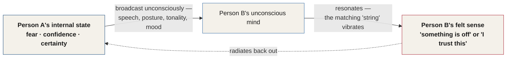
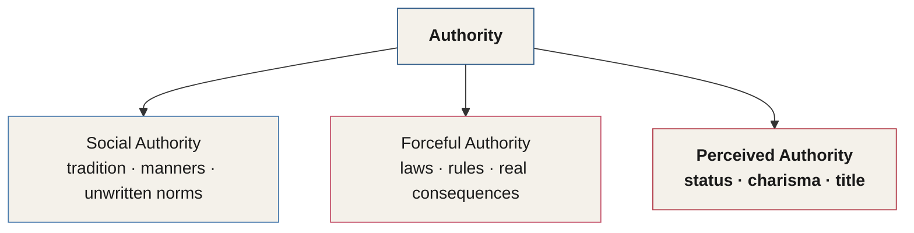

# Chapter 14 — Hardwired for Obedience

> *"Control the manner in which a man interprets his world, and you have gone a long way toward controlling his behavior."* — Stanley Milgram

Not too long ago, humans were tribal. Most of our ancestors lived in small societies of 100 to a few hundred people. These small tribes lived off the land wherever they were, and mostly got along with the neighboring tribes of humans. Agriculture soon settled in as the way to guarantee an abundant food supply. Each of these tribes typically had one leader.

Adherence to the leader's rules didn't just keep you safe — it kept you alive. Dishonoring or disobeying the tribal leader had consequences. Some leaders might have just killed you, while others simply made you into a social outcast, ensuring no one would risk mating with you in your tribe — which sucks. Our brains evolved to obey authority. It kept us alive, and it kept us procreating. In fact, the shape and capability of our brains hasn't changed in around 180,000 years (Provoj Mihik, 2013).<!-- ASR? verify: citation transcribed as "Provoj Mihik, 2013" — could not confirm a matching researcher via web search; kept as transcribed per the skill's uncertainty rule -->

---

## Social Resonance

Imagine walking into a huge piano store with pianos from wall to wall. If you walked up to one of the pianos in the store and hit the middle C key, it would make a loud sound, vibrating at 261.66 hertz — which our brain interprets as the note of C. The sound would fill the room, but here's where it gets really interesting: the C string on every other piano in the room would also begin to vibrate. This is because the sound wave resonates with every C string of every piano in the store, and therefore causes them to vibrate.

Humans operate in much the same way. Our bodies and minds resonate with what's around us. Our social behaviors are highly sensitive to the nonverbal signals of the humans around us. Since we are tribal animals, coherence produces harmony and allows communication without words. This theory of behavior is called social coherence, and is also referred to as the energetic field environment by the HeartMath Institute.

We broadcast a tremendous amount of information with our bodies. Our speech, mannerisms, carriage, posture, tonality, vocabulary, mood, and dozens of other factors contribute to someone's interpretation of who we are — all of it broadcast on a level outside our conscious awareness.

Imagine two people interacting as two pianos. If you experience fear, apprehension, or uncertainty, those are the strings you're causing to vibrate in others. If you're confident and certain of your actions, you'll cause those strings to vibrate in people instead. Even if you firmly believe you're hiding these feelings, they leak out. They always will. Your unconscious mind has a direct line of communication with the unconscious minds of others — and your unconscious mind can't lie.

::: callout
**When something feels "off."** When humans have a feeling that something is just off — that we can't place our finger on — that's the unconscious mind telling us it has received several signals that conflict with what our eyes are seeing.
:::

*Figure 14.1 — Social Resonance. Person A's internal state, hidden or not, broadcasts nonverbally and "rings" the matching string in Person B's unconscious mind — exactly like a struck C key setting off every other C string in the room.*

As we grow older, we develop a strong sense of who we can follow, based on cues and nonverbal signs we don't consciously process. From childhood, we learn how to spot danger, anger, happiness, and several other emotions, and into adulthood most of us have a pretty well-defined subconscious radar to warn us of danger. Becoming automatically obedient to someone who is dangerous could spell disaster, and possibly death.

And while it sounds like I'm describing a tribal community, think about the Milgram experiment: the man in the lab coat was well trained to flip internal authority switches and create obedience (see Chapter 13). The authority radar we develop is constantly scanning for signals of who to follow. This has been proven in over a thousand social psychology studies, and is evident in all human behavior. In times of crisis, the average person spends most of their time either searching for someone to follow, or following someone.

The signals our brains most commonly look for are status symbols and uniforms. Status symbols — cards, luxury items, and clothing — signal authority. A uniform could be a police uniform, a business suit, or some other clothing, depending on the circumstances.

### The Smoke-Filled Room

In 1968, Drs. Bibb Latané and John Darley conducted a social psychology experiment in which Columbia University students were invited to simply share their views about problems with city life. Those who responded to the flyers were asked to sit in a waiting room with a few forms to fill out while they waited.

The real experiment had nothing to do with the surveys — the waiting room was where the experiment would actually take place. Students would come into the waiting room, and after a few minutes of filling out the forms, smoke would begin to seep into the room through a vent in the wall. Before four minutes had elapsed, enough smoke had entered the room to interfere with vision and cause coughing.

The experiment evaluated participants under two conditions. In the first, students were by themselves in the room filling out the forms. In the second, students were in the room with three or four other students.

In the first condition, when students were alone, almost every student got up to figure out where the smoke was coming from, and immediately left the room to report the condition to people in the hallway.

In the second condition, something different happened. Only one of the students in the room was an actual participant in the experiment — the other three were actors. As the smoke filled the room, the three actors pretended not to notice it at first. They might eventually look up at the smoke and dismiss it as no big deal. If the real participant questioned them about it, they responded casually and continued filling out their surveys, calmly waving the smoke from their faces as they went on with their questionnaires.

Only 10% of students in the presence of these unconcerned peers reported the smoke or left the room. 90% remained in the room with the actors while it continued to fill with smoke.

| Condition | Who else was in the room | Result |
|---|---|---|
| Alone | No one | Nearly all students left immediately to report it |
| With 3 passive actors | 3 confederates who ignored the smoke | 10% reported it — 90% stayed in the room |

*Figure 14.2 — The Smoke-Filled Room (Latané & Darley, 1968). Alone, participants acted on the danger almost immediately. Surrounded by calm strangers, 90% sat through a room filling with smoke, scanning the room for someone else to decide it mattered.*

This study shows us the power of group influence — that was Drs. Latané and Darley's stated intention. But there's also a hidden aspect to this study: the experiment participants, while in the waiting area with others, scanned the room, looking for someone to make the decision. Their brains likely scanned the room even before the smoke started filling it.

This authority radar we have doesn't shut off. It's constant and inborn, searching for clues to make estimations about context. In some cases, you recognize it immediately — like when speaking to a police officer. In other cases, it's subtler. Throughout our lives, there is authority being exerted over us to some degree. When we are children, it's teachers, school policy, and parents' rules at home. As we grow older, the authorities in our lives increase: not only do we have company policies and corporate authorities, we also have laws from state and federal regulators. Police exert authority in the name of policymakers, and employees in the stores we visit exert authority in the name of their own corporate policymakers. So not only does the number of authority figures increase as we age — they also become more ambiguous. You often can't exactly pinpoint the source of the authority.

Coming up, we'll examine a few more research studies and see how the authority loophole is always at play in our lives. As we look closely at what happened in each, you'll be able to see the same inborn authority radar we saw at work in the smoke-filled room.

---

## An Investigation into Authority

> *"Any fool can make a rule, and every fool will mind it."* — Henry David Thoreau

With so many research studies done on obedience and authority, how is it that we continue to be unaware of the presence of a mental loophole that can be exploited by anyone with a little training?

Before we get into specific techniques, we're going to investigate a few cases. These, I hope, will provide you with the necessary filter with which to judge the seriousness of the chapters to follow — covering techniques, tactics, and practical application.

There are many thousands of examples I could have chosen, but I've selected a few here that really shine a bright light on our programming's vulnerability when we are exposed to authority.

In extreme cases, it's easy to see how someone could be made to obey — being forced at gunpoint, threatened with harm, or told to by a well-recognized authority can make us do things. Because, as we've seen, even some guy in a gray lab coat has the ability to talk 65% of people into murder (see Chapter 13). It's the small cases occurring in our daily lives that we're so oblivious to.

### Charisma as Authority: Charles Manson

Charles Manson stood a mere 5 foot 2 — yet he commanded a small army of misled youths, talking them into murder and running his flock like an authoritative yet charismatic leader. While there were several compounding factors contributing to his ability to command such a devoted following, his charisma is probably his most commonly discussed trait. To this day, Manson has a cult-like following.

Despite his use of drugs, forced rituals, and his capacity for target selection, Manson had powerful social authority over this small group. His authority allowed him to make crazy demands of his flock — demands that eventually escalated to murder.

How did Manson command such automatic obedience? In short, it comes down to the amount of perceived authority he had. His followers underwent what we described in Chapter 13 as the agentic state, wherein they no longer felt fully responsible for their own actions.

Authority, whether real or imagined, flips a switch inside us. When the switch flips, there's no alarm or notification that announces a security breach — your brain simply accepts the situation, along with the orders you might be given.

### The Crosswalk

Several studies have been done about the level of influence required to make someone break a crosswalk signal. One study in particular found people far more likely to break the signal if someone else did it first (Krause, 2010).

In one experiment, an actor stands with a small crowd waiting for the crosswalk signal to allow them to cross. He then breaks the crosswalk signal and starts walking across the street. People who were closer to him were more likely to follow him — and if he was wearing professional clothing, such as a business suit and tie, the number of people who followed him through the intersection illegally increased drastically.

We unconsciously use clothing to identify authority figures, and our brains seem to be perfectly fine becoming agentic in the presence of someone our unconscious mind has determined to be an authority.

::: callout
**Questions worth sitting with.** Why does a suit make us obedient? Why do most people wait to make a choice until someone else has? What's the reason behind this behavior being programmed almost from birth? And if all it takes is a suit to make someone break the law, how malleable are the behaviors and choices we don't think much about?
:::

### The Line-Judgment Experiment

Another great experiment that demonstrates authority was conducted by researcher Solomon Asch in 1956. In this experiment, about 10 students were seated at a long table. The experimenter presented them with two cards: one had a single line drawn down the center of it; the other had three lines, labeled A, B, and C. The students were asked to determine which of the three lines was equal in length to the line on the first card.

Nine of the 10 students at the table were actually actors in the experiment, and only one person in the room was a real participant. All the actor students would deliberately choose the incorrect line — meaning everyone at the table would choose the wrong line except the real participant, and often it was glaringly obvious that it was incorrect. Asch wanted to see whether the real participant would conform to the answers given by the actors.

32% of participants went along with the crowd and conformed to the obviously incorrect answer on every critical trial. 75% conformed at least once. 25% of participants never conformed at all.

Asch concluded that students who did conform did it for two reasons: either they wanted to fit in with the group, or they trusted the opinion of the group more than they trusted their own.

::: definition
**Normative influence** — conforming because you want to fit in with the group.

**Informational influence** — conforming because you trust the majority's judgment over your own.
:::

In today's freely and openly questioning culture, it's believed that if this experiment were reproduced, the levels of conformity would be markedly lower. However, these conformity and group-trusting behaviors are so prevalent that you can't spend two minutes on social media without seeing a post, video, or photo of something that contains elements of conformity and group influence.

I do think our culture may have gotten away from conformity to small, in-person groups like the one in Asch's experiment. But I still believe the desire to conform — even if it means conforming to a group that prides itself on nonconformity — is still alive and well in every corner of our culture.

---

## The Bystander Effect

Group conformity doesn't have to be verbalized, discussed, or witnessed. In some cases, complete strangers do it without exchanging a single word.

In March of 1964, Kitty Genovese was driving home from the bar where she worked, at around 2:30 a.m. She made it home and parked her red Fiat in a railroad station parking lot about 100 feet from the door of her apartment. Unknown to her, a man named Winston Moseley had followed her home.

He got out of his car, armed with a hunting knife, and started approaching her. Because he ran, Winston caught up with her quickly and stabbed her twice in the back. The screams alerted people, and the attacker fled — but returned 10 minutes later to find Kitty, still breathing, staggering near a hallway at the exterior of her apartment. Winston stabbed her several more times before raping her and taking $49 from her purse. An ambulance was later called, and she died on the way to the hospital.

This type of crime happens more frequently than it should. But what is shocking about this case is the number of people police discovered had witnessed it. The police reports and the *New York Times* later reported that 38 people witnessed the attack.<!-- Citation: the widely reported "38 witnesses" figure originates in the New York Times' 1964 coverage; a 2007 American Psychologist review (Manning, Levine & Collins) later found no solid evidence for 38 witnesses who observed the murder and remained inactive throughout — the exact count has since been disputed by scholars, though the underlying case and the term it produced are historically accurate and are presented here as Charles originally reported them. --> 38. Where the hell didn't anyone call the police?

The reason no one called the police would later come to be known as the bystander effect.

::: definition
**The Bystander Effect** — a social psychology phenomenon in which people are less likely to help the victim of a crime, or a person in need of serious help, if other people are around. The more people around, the less likely the victim is to get help or intervention (Fischer et al., 2011; Darley & Latané, 1968).
:::

In environments where several people are present, we undergo a psychological shift called diffusion of responsibility. The presence of other people lowers our feeling of responsibility to take action. And whether it's due to anonymity or some other force, people in groups tend to make a silent agreement not to intervene or assist someone in need. Helping could be dangerous, and it breaks the behavioral and social norm of what everyone else is doing.

### Liverpool Street Station

An experiment conducted in London tested this theory recently.<!-- ASR? verify: citation transcribed as "Call psychologist, 2009" — could not confirm the researcher's or broadcaster's exact name via web search; the described setup and outcomes (100 passersby / ~50 passersby / 6-second response) match a documented 2009 staged bystander experiment filmed at Liverpool Street Station, London --> Researchers took three people and had them lie on the ground in desperate need of help: one was a man in street clothes, one was a woman, and the third was a man in a business suit.

The man in street clothes lay on the grounds of Liverpool Street station, curled up, begging for help, howling in pain. Up to 100 people passed by, stepped over him, and no one helped.

About 50 people passed by the woman, who was lying on the steps of the station as if she was completely dead or unconscious. Some people stopped to look from a distance, and it wasn't until several minutes had elapsed that someone decided to help. The moment that one person decided to help, others began to help too — the people who had been looking on from a safe distance came over to offer assistance.

This has been proven in dozens of other experiments: if someone breaks the norm and decides to help, it gives permission to the rest of the group to do so. It's rare for this to happen, however. The man in the business suit was on the ground for a mere six seconds before someone assisted him. This apparent increase in social status gave some kind of permission for others to provide assistance to him.

| Presentation | Bystanders who passed without helping | Time until someone helped |
|---|---|---|
| Man in street clothes, visibly in pain | Up to 100 | No one helped |
| Woman, appearing unconscious | About 50 | Several minutes |
| Man in a business suit | — | 6 seconds |

*Figure 14.4 — Liverpool Street Station, London (2009). The same need for help, presented three ways. The business suit — perceived authority and status — collapsed the group's silent agreement not to intervene almost instantly.*

Also often ignored in these experiments and the videos made of them online is that the bystanders make almost a silent agreement not to assist — but when one person decides to break that agreement, it gives the others permission to do so too.

Within a group on the street, or in almost any scenario, the brain is searching for the authority figure to show what's acceptable. When this diffusion of responsibility happens, responsibility is lowered — just like in the agentic state Milgram described (see Chapter 13). We search for authority all the time. It's only in these exaggerated circumstances that it becomes glaringly apparent.

---

## The Power of a Uniform

Dr. Philip Zimbardo is famous for the Stanford Prison Experiment, conducted in 1971 and designed to investigate the effects of perceived power and authority. Students were randomly chosen to be guards and prisoners in a makeshift prison built inside a university building. As the experiment went on, abuse began to occur, and students became so absorbed in their roles that they were traumatized by the experience, forgetting they could end the experiment at any time. After only six days, the experiment — originally planned to run for two weeks — was terminated (Zimbardo, 1971).

Dr. Zimbardo is also the president of the Heroic Imagination Project, a group that gathers psychological findings and develops meaningful insights people can use every day to better their lives. Their website is heroicimagination.org.

The Heroic Imagination Project posted an interesting video about how we conform to uniforms and authority. In the video, a normal-looking man is dressed in a nondescript uniform that resembles a train conductor's, carrying nothing more than a walkie-talkie. He strode around a public venue and asked citizens to comply with seemingly ridiculous tasks — such as walking around an apple,<!-- ASR? verify: transcribed as "walking around an apple" — could not confirm the exact wording or locate the specific video via web search; kept as transcribed --> littering, jumping onto bricks to steady them, and going out of their way to touch a specific brick in a wall.

Roughly 90% of requests were followed to the letter — including requests to break the law. The mere presence of the uniform was enough to cause an agentic shift in the people who interacted with the experiment (Zimbardo, 2011).

In another video by Dr. Zimbardo's team, a man in the same uniform stands beside a "prisoner." As a member of the public approaches, the man in the uniform asks the passerby to assist him — to watch over the prisoner with a Taser, and to shock him if he tries to escape. The fake officer then walks off briefly to retrieve his phone, which he'd forgotten in his car. While he's gone, the prisoner-actor begins asserting his desire to leave. The citizen usually orders him to stay in place — and then the prisoner makes an attempt at escape.

Citizens who participated gave chase, and wound up using the Taser to subdue him to the ground. In reality, the Taser was just a stick with a strobe light on the end and did nothing — but the prisoner reacted as though he were being shocked, and eventually complied with the citizens' orders (Zimbardo, 2011).

The consequences for disobeying an authority figure are sometimes severe. From childhood, we develop a reverence for authority, and a fear of consequences that continues on into adulthood.

::: callout
**A background program.** These authority-searching behaviors are similar to a background program running on a computer. We don't notice they're running at all, but there's no real way to shut them down. Any attempt to shut them down simply increases our awareness of how much control others have over our behavior. Denying this power exists only weakens our ability to resist false authority.
:::

Our behavior is sculpted by groups, culture, and many other influences that act as powerful, silent authorities in our lives — quietly shaping our behavior, desires, and interactions while we live fully convinced that we are in control of what we do.

---

## Authority in the Brain

> *"Nothing so conclusively proves a man's ability to lead others as what he does from day to day to lead himself."* — Thomas J. Watson, Sr.

In my opinion, one of the most compelling descriptions of authority and leadership was written by Marcus Aurelius, who lived from 121 to 180 AD. Late in his life, while serving as Roman emperor, he kept a private journal, since translated and published as *The Emperor's Handbook*. His description highlights so many important aspects, many of which have been used to define what it means to be a man — though I think it applies equally to both sexes. It's timeless.

Marcus Aurelius describes a mentor named Maximus:

> *"Maximus set an example of self-mastery, steadiness of purpose, and good cheer, which no circumstance — not even illness — could extinguish. He combined in beautiful measure gravity with charm, and did whatever needed to be done without making a fuss. Everyone believed that what he said was what he thought, and that he never acted with an intention to do harm or give offense. Nothing surprised or frightened him. He never seemed to be in a hurry or slow to accomplish a task. He was neither intimidated nor embarrassed, on the one hand, nor was he ever aggressive or suspicious, on the other. So giving, forgiving, and loyal was he by nature that he appeared to be a man whose virtues were inborn rather than acquired. It is unimaginable that anyone ever felt superior or inferior around him. Perhaps he possessed, above all, a pleasing sense of humor."*<!-- ASR? verify: closing line transcribed as "Perhaps Jesus' pleasing sense of human" — reconstructed as "Perhaps he possessed... a pleasing sense of humor" based on context and sentence rhythm; exact original phrasing from The Emperor's Handbook not independently confirmed -->

We are all different, though we tend to respond to similar stimuli when it comes to leadership and authority. In this chapter, we've investigated what makes these qualities seem inborn instead of learned — how we develop them determines the impact we have on the world around us.

### Three Types of Authority

There are essentially three types of authority: social, forceful, and perceived.

*Figure 14.5 — The Three Types of Authority. Social authority is culture's unwritten rulebook; forceful authority carries the threat of real consequences; perceived authority is granted by the brain the instant it recognizes a status cue — real or not.*

**Social authority** is developed throughout a culture, through normative behavior such as traditions, respect for elders, manners, and so on — it's how a culture eventually winds up with its unwritten list of how one ought to behave in society. These rules also dictate things like how you're supposed to dress at work, which direction you face in the elevator, and not screaming back at the parents of a crying baby on an airplane.

**Forceful authority** is any authority that carries the consequence of eventual force, such as laws and government regulations. Even small things — like children being required to obey their teachers and their parents' house rules — can result in small uses of force. Forceful authority is present from around the time we are two years old.

**Perceived authority** is the force exerted on us as a result of leadership, social status, charismatic people, celebrities, and doctors. We unconsciously assign authority to people who seem to already have it, whether they're a legitimate authority or not.

The unconscious assignment of authority, and our blindness to it, is the reason behind many tragedies in history.

> *"The greatest crimes in the world are not committed by people breaking the rules. It's people who follow orders that drop bombs and massacre villages."* — Banksy, *Wall and Piece*

When we unconsciously fall into obedience, it is the result of perceived authority. We subconsciously assign importance or status to a person as a result of their character, appearance, behavior, or title.

---

## Key Takeaways

- **We evolved to obey.** Tribal humans lived under a single leader; disobedience meant death or exile from the mating pool. That evolutionary pressure wired obedience into a brain that has changed very little since.
- **Social Resonance** — our bodies and speech broadcast our internal state (fear, confidence, uncertainty) below conscious awareness, and other people's unconscious minds "resonate" with it, the way a struck piano string sets off every matching string in the room. This is also called social coherence, or the energetic field environment (HeartMath Institute).
- **The Smoke-Filled Room (Latané & Darley, 1968)** showed that alone, people act on danger almost immediately — but surrounded by calm strangers, 90% sat through a room filling with smoke, silently scanning the group for someone else to decide it mattered.
- **Authority figures multiply and blur as we age** — from parents and teachers in childhood to corporate policy, store employees, and state and federal law as adults — making the source of authority harder to pin down even as its presence increases.
- **Charles Manson commanded murder through perceived authority and charisma alone** — his followers entered the same agentic state described in Chapter 13, no longer feeling responsible for their own actions.
- **Following the crowd through a crosswalk** is more likely when someone else breaks the signal first — and dramatically more likely when that person is dressed in a business suit (Krause, 2010).
- **Asch's line-judgment experiment (1956)**: 32% of participants conformed to an obviously wrong group answer on every trial, 75% conformed at least once, and only 25% never conformed — driven by normative influence (wanting to fit in) or informational influence (trusting the group over yourself).
- **The Bystander Effect**, named after the murder of Kitty Genovese in 1964, is the finding that the more people present, the less likely any one of them intervenes — a diffusion of responsibility (Fischer et al., 2011; Darley & Latané, 1968).
- **At Liverpool Street Station, perceived status collapsed the group's silent agreement not to help** — a man in street clothes was stepped over by up to 100 people, while a man in a business suit received help in six seconds.
- **The power of a uniform is not symbolic — it's measurable.** Zimbardo's Stanford Prison Experiment (1971, terminated after just 6 days of a planned 2 weeks) and the Heroic Imagination Project's uniform videos both show roughly 90% compliance with a stranger's orders, including orders to break the law.
- **There are three types of authority** — social (culture's unwritten rules), forceful (backed by real consequence), and perceived (granted unconsciously based on status, charisma, or title) — and it is perceived authority, unconsciously assigned and rarely questioned, that Banksy and history both point to as the root of humanity's worst atrocities.
- **Marcus Aurelius's portrait of Maximus** — steadiness, self-mastery, and a total absence of any need to intimidate or defer — offers a timeless picture of authority that commands respect without ever demanding it.

<!--
## Change Log

| Original (transcript) | Corrected | Reason |
|---|---|---|
| "Stanley Milbram" | "Stanley Milgram" | ASR mishearing of the researcher's name; verified spelling against Chapter 13 and web search. |
| "Control the manner in which a man interprets his world. You've gone a long way toward controlling his behavior." | "Control the manner in which a man interprets his world, and you have gone a long way toward controlling his behavior." | Reconstructed as Milgram's verified real quote (from *Obedience to Authority*), confirmed via web search. |
| "Each of these tribes typically had one liter." | "Each of these tribes typically had one leader." | ASR mishearing ("liter" → "leader"). |
| "Provoj Mihik, 2013" | Retained as-is | Could not identify a real matching researcher via web search; flagged inline per the skill's uncertainty rule rather than guessing a name. |
| "hit the middle sea key" | "hit the middle C key" | ASR mishearing ("sea" → "C"), consistent with "the note of C" later in the same sentence. |
| "the Heart Meth Institute" | "the HeartMath Institute" | ASR mishearing of the real organization's name; verified via web search, including their real "energetic field environment" and "social coherence" terminology. |
| "If you experience fair, apprehension, or uncertainty" | "If you experience fear, apprehension, or uncertainty" | ASR mishearing ("fair" → "fear"). |
| "Dr. Biblatan and Dr. John Darley" | "Drs. Bibb Latané and John Darley" | ASR mishearing of the real researchers' names (the 1968 Columbia University "smoke-filled room" study); verified via web search. |
| "reported the smoke or left the ring." | "reported the smoke or left the room." | ASR mishearing ("ring" → "room"). |
| "It was the intention of doctors Latan and Dali" | "that was Drs. Latané and Darley's stated intention" | ASR mishearing of the same researchers' names; grammar smoothed. |
| "Grounds are lives. There is authority being exerted over us to some degree." | "Throughout our lives, there is authority being exerted over us to some degree." | ASR mishearing/garbled fragment reconstructed to fit surrounding context. |
| "our program's vulnerability" | "our programming's vulnerability" | Light grammar smoothing; consistent with the "mental operating system" / "background program" metaphor established in Chapter 4 and used again later in this chapter. |
| "some guy in a gray loud coat" | "some guy in a gray lab coat" | ASR mishearing ("loud coat" → "lab coat"), consistent with Chapter 13. |
| "It's the small cases that occur in our daily lives. We are so oblivious to." | "It's the small cases occurring in our daily lives that we're so oblivious to." | Grammar repair — fragment merged into one sentence. |
| "his flog" / "Manton had powerful social authority" | "his flock" / "Manson had powerful social authority" | ASR mishearing ("flog" → "flock", "Manton" → "Manson"). |
| "several compounding fans contributing" | "several compounding factors contributing" | ASR mishearing ("fans" → "factors"). |
| "an egentic chef. wherein they no longer felt fully responsible" | "the agentic state, wherein they no longer felt fully responsible" | ASR mishearing ("egentic chef" → "agentic state"); this is the same concept defined in Chapter 13, so the established term and spelling were used. |
| "Kraus, 2010" | "Krause, 2010" | Likely ASR misspelling of the real researcher's name behind a 2010 study on collective/social-information use in pedestrian road-crossing behavior; verified via web search. |
| "crossword signal" (2 instances) | "crosswalk signal" | ASR mishearing ("crossword" → "crosswalk"). |
| "or unconscious mind is determined to be an authority" | "our unconscious mind has determined to be an authority" | ASR mishearing/grammar repair ("or" → "our", tense fix). |
| "a researcher named Solomon Ash in 1956" | "researcher Solomon Asch in 1956" | ASR mishearing of the real researcher's name; verified via web search (Asch's major 1956 conformity paper is real). |
| "All the answer students would deliberately choose" | "All the actor students would deliberately choose" | ASR mishearing ("answer" → "actor"), consistent with "actor students" used later in the same paragraph. |
| "32% of participants went along with the crowd and conforms" / "75% conform at least one time, and 25% of the participants never conform" | "conformed" (tense corrected throughout) | Grammar repair; percentages verified accurate against the real Asch results via web search. |
| "In today's freely and openly questioning culture, is believed" | "In today's freely and openly questioning culture, it's believed" | ASR mishearing/grammar repair ("is believed" → "it's believed"). |
| "Kitty Genevieve" | "Kitty Genovese" | ASR mishearing of the real victim's name; verified via web search. |
| "Winston Mosley" | "Winston Moseley" | ASR mishearing/misspelling of the real perpetrator's name; verified via web search. |
| "Because he ran, the Winston caught up with her quickly" | "Because he ran, Winston caught up with her quickly" | Grammar repair (stray "the" removed). |
| "Winston stamped her several more times" | "Winston stabbed her several more times" | ASR mishearing ("stamped" → "stabbed"), consistent with "stabbing her twice in the back" earlier in the same paragraph. |
| "Fisher 2011" | "Fischer et al., 2011" | ASR mishearing of the real researcher's name behind the landmark bystander-effect meta-analysis in *Psychological Bulletin*; verified via web search. |
| "Darling J L, 1968" | "Darley & Latané, 1968" | ASR mishearing of the same two researchers named earlier in the chapter, citing their companion 1968 paper on diffusion of responsibility. |
| "Culping could be dangerous" | "Helping could be dangerous" | ASR mishearing ("Culping" → "Helping"), which fits the paragraph's subject (non-intervention). |
| "Call psychologist, 2009" | Retained as an unattributed citation, flagged inline | Could not confirm the researcher's/broadcaster's exact name via web search; the described setup and results (100 passersby / ~50 passersby / 6-second response) match a real, documented 2009 staged bystander experiment at Liverpool Street Station, London. |
| "though someone decided to help" | "that someone decided to help" | Grammar repair. |
| "The moment the men decided to help" | "The moment that one person decided to help" | ASR mishearing/grammar repair ("the men" → "that one person"), consistent with singular "someone" used throughout the surrounding sentences. |
| "began coming over to auto offer assistance" | "came over to offer assistance" | ASR error (stray "auto" removed). |
| "just like in the agentic state that Stanley Milken described" | "just like in the agentic state Milgram described" | ASR mishearing ("Milken" → "Milgram"). |
| "that becomes glaringly apparent" | "that it becomes glaringly apparent" | Grammar repair. |
| "Any 1998." | "(Zimbardo, 1971)" | The stray fragment did not parse as a citation; corrected to reference the year the Stanford Prison Experiment actually took place, verified via web search. |
| "Dr. Zimbado" / "Dr. Zimbara" / "Zimbado, 2011" (multiple instances) | "Dr. Zimbardo" / "(Zimbardo, 2011)" | ASR mishearing of the real researcher's name, normalized throughout. |
| "so just walking around an apple" | "such as walking around an apple" | Grammar smoothing only ("so just" → "such as"); the object itself ("an apple") could not be confirmed via web search and is flagged inline rather than guessed. |
| "an gentic shift" | "an agentic shift" | ASR word-boundary error ("an gentic" → "agentic"). |
| "asks the assistant to assist him" | "asks the passerby to assist him" | ASR mishearing/grammar repair — at this point in the video the passerby has not yet been established as an "assistant." |
| "retrieve his phone that he'd forgot in his car" | "retrieve his phone, which he'd forgotten in his car" | Grammar repair. |
| "an actor starts asserting his desire to leave" | "the prisoner-actor begins asserting his desire to leave" | Clarity repair — "an actor" was ambiguous given two actors are present in the scene (uniformed man and prisoner). |
| "wound up using the Taser to subdue him onto the ground" | "wound up using the Taser to subdue him to the ground" | Grammar repair. |
| "continues longing to adulthood" | "continues on into adulthood" | ASR mishearing ("longing" → "on into"). |
| "sculptured by groups, culture" | "sculpted by groups, culture" | Light grammar smoothing to the more common modern usage. |
| "Is holding my opinion, but I think one of the most compelling descriptions" | "In my opinion, one of the most compelling descriptions" | ASR mishearing/grammar repair of a garbled opening clause. |
| "His description highlights so many important aspects, many have used to define what it is to be a man." | "His description highlights so many important aspects, many of which have been used to define what it means to be a man." | Grammar repair. |
| "Marcus Aurelius describes Maximus in his book, The Emperor's Handbook, written 121 to 180 AD." | "Marcus Aurelius, who lived from 121 to 180 AD... kept a private journal, since translated and published as The Emperor's Handbook." | Factual correction — 121–180 AD are Marcus Aurelius's own birth and death years, not the dates the book was written; the journal (later titled Meditations, and published in modern translation as The Emperor's Handbook by David and C. Scot Hicks) was written mostly in his final decade, on military campaign. Verified via web search. |
| "but no circumstance, not even illness, could extinguish" | "which no circumstance — not even illness — could extinguish" | Grammar repair ("but" → "which") for a dangling relative clause. |
| "This is unimaginable that anyone ever felt superior or inferior around him." | "It is unimaginable that anyone ever felt superior or inferior around him." | ASR mishearing ("This is" → "It is"). |
| "Perhaps Jesus' pleasing sense of human." | "Perhaps he possessed, above all, a pleasing sense of humor." | ASR mishearing ("Jesus'" → "he possessed," "human" → "humor") — reconstructed from context; flagged inline as the exact original phrasing could not be independently confirmed. |
| "He was neither intimidated or embarrassed on the one hand. Nor aggressive or suspicious on the other." | "He was neither intimidated nor embarrassed, on the one hand, nor was he ever aggressive or suspicious, on the other." | Grammar repair (or/nor pairing, sentence merged). |
| "Perceived authority is the force that ends on us" | "Perceived authority is the force exerted on us" | ASR mishearing ("ends on" → "exerted on"). |
| "mannets, et cetera" | "manners, and so on" | ASR mishearing ("mannets" → "manners"); "et cetera" smoothed to match the book's conversational register. |
| "not screaming back at the parents of the crying baby in the airplane" | "not screaming back at the parents of a crying baby on an airplane" | Grammar repair. |
| "Forceful authority is present from the time we were about 2 years old." | "Forceful authority is present from around the time we are two years old." | Grammar/tense repair. |
| "The greatest crimes in the world are not committed by people breaking the rules or by people following the rules. is people who follow orders that drop bonds and massacre villages. Banksy, wall and peace." | "The greatest crimes in the world are not committed by people breaking the rules. It's people who follow orders that drop bombs and massacre villages." — Banksy, *Wall and Piece* | Reconstructed to match Banksy's real, verified quote from his book *Wall and Piece* (ASR had duplicated/garbled the first clause and misheard "bombs" as "bonds" and "Wall and Piece" as "wall and peace"). |
| "When we unconsciously fall into obedience is the result of perceived authority." | "When we unconsciously fall into obedience, it is the result of perceived authority." | Grammar repair. |
-->
