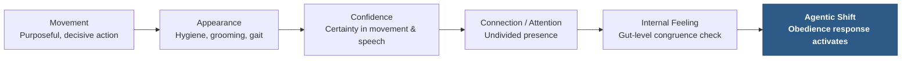
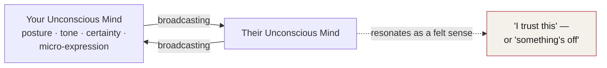

# Chapter 15 — Authority Tripwires

> *"Character may almost be called the most effective means of persuasion."* — Aristotle, *Rhetoric*

Walk into a room, and a script is already running. The brain has it memorized, and it executes quietly in the background without being asked. Get behind the wheel of a car, and you're following a script built from rules and routines. In the case of the bystander effect, when we're part of a crowd, the mind simply runs a social script that tells us to conform to the behavior of everyone around us.

These scripts save us time. Running them in the background keeps us safe in most situations, and frees us from having to use our full conscious awareness just to continually reorient ourselves to the present moment. Driving a car, for instance, would be a monumental task if it weren't for the scripts running quietly behind the wheel.

---

## When a Script Turns Deadly

In May of 1979, a passing driver called the fire department to report smoke coming from a Woolworths store in Manchester, England.<!-- ASR? verify: transcribed as "Ham driver" — likely "a passing driver" or similar, but exact wording could not be confirmed via web search --> Firefighters arrived to find an estimated 500 people inside the store. They fought the fire for two and a half hours. Ten people died — nine customers and a Woolworths employee.

Every one of the people who died was inside the store's restaurant. An investigation later found that they had not evacuated when they should have, and stayed at their tables until smoke filled the room and killed them. They hadn't left because they were waiting to pay their bills.

A Manchester fireman named Neil Pownsend<!-- ASR? verify: firefighter's name transcribed as "Neil Pownsend" — could not confirm the exact spelling of this individual via web search; kept as transcribed --> later said in an interview that one of the main reasons people died in the Woolworths fire was that they didn't want to be the first to react. They didn't want to stand out from the crowd, so they went along with the crowd's behavior instead.

People were running the script of eating in a restaurant: you go in, you eat, and you pay your bill before you leave. That mental script likely killed them.

::: callout
**The lesson.** A script isn't dangerous because it's stupid. It's dangerous because it keeps running even when the situation that called for it no longer exists.
:::

In social settings, the brain is constantly scanning the environment for authority and leadership signals. But how does the brain identify and select a person for that position? In emergencies, we learn that the person who acts first and simply takes charge becomes the de facto leader — and gives everyone else unspoken permission to act the same way. In everyday life, there's more ambiguity, and the signals the brain looks for are far less obvious.

---

## The Five Authority Tripwires

Let's examine the process we go through, socially, to spot authority. There are five distinct steps that unconsciously trigger the obedience response. We notice these five in roughly the same order every time, and as each one registers, the mind immediately searches for the next:

**Movement → Appearance → Confidence → Connection (Attention) → Internal Feeling**

::: definition
**Authority Tripwires** — the unconscious checkpoints the brain runs through, in sequence, to decide whether a person in front of it deserves obedience. These are the same five items named on the Effect side of the Authority Triangle in Chapter 7 — Movement, Appearance, Confidence, Connection, and Intent — now unpacked one at a time.
:::

### Movement

Movement of the body triggers obedience through deliberate, purposeful action that lacks indecision or reservation. If someone takes action during an emergency, this becomes immediately apparent. In everyday life, with no emergency present, it looks more like someone simply deviating from the norm and taking action anyway. People willing to step up and break from scripts and social norms are usually the first to take charge — and, as a result, are the ones seen as having authority.

### Appearance

Appearance is a vital component. It runs from hygiene and how someone dresses,<!-- ASR? verify: transcribed as "how someone is breast" — reconstructed as "how someone dresses" to fit surrounding context about hygiene and physical appearance --> to physical build and gait.

### Confidence

The confidence displayed in movement and speech contributes greatly to how credible a person is perceived to be in a social setting. In emergencies, the confidence with which a person takes charge — or breaks from the script — dictates whether others will follow suit.

### Connection, or Attention

Minds continually scan how present someone is in a conversation. Leadership and authority figures have a knack for displaying undivided attention when they're engaged with someone, and other people's minds pick up on how present they are during that interaction. In emergencies, a person's perceived level of focus dictates how likely others are to follow their actions or commands.

### Internal Feeling

Even when things seem to be going exceedingly well, there's almost always a moment or two when something just feels off — something doesn't feel right, and we can't identify the cause. That feeling is the result of an accumulation of unconscious observations about someone. Once the brain takes in information that doesn't match what you're consciously aware of in your surroundings, it signals a "something's off" alarm.<!-- ASR? verify: transcribed as "a something's off hair alarm" — reconstructed as "a 'something's off' alarm," dropping an apparent stray word ("hair"), to fit the surrounding sentence -->

When someone instead makes us feel a sense of internal congruence — when nothing is tripping that alarm — it becomes the final step in the transition into the agentic state (see Chapter 13).

Our authority radars are far more sophisticated than we might imagine. In less than a second, we've usually summed up someone's perceived authority and made an unconscious decision on whether to obey, follow, resist, or completely ignore them.

*Figure 15.1 — The Five Authority Tripwires. Each level is scanned in roughly this order; a person who trips most or all five produces the agentic shift described in Chapter 13.*

---

## The Subway Platform

Let's use a scenario to see this process in action.

Imagine you're in a New York subway station. As you exit the subway and head toward the escalators to street level, a man dressed in jeans and a t-shirt clutches his chest and starts screaming.

The crowd unites in an unspoken agreement to ignore him. Diffusion of responsibility sets in, and that unspoken agreement dictates the crowd's behavior. As you get to about thirty feet from the man, his screaming gets a little louder.

Suddenly, you see someone break from the flow of foot traffic and start moving toward him. It's a stranger in a suit and tie, carrying a leather briefcase, walking directly toward the man who's screaming.

As he gets closer, you notice the man in the suit has no concern for the crowd at all — his focus is entirely on the man who's screaming.<!-- ASR? verify: transcribed as "no concern for the crowd. Only demanding bubble" — reconstructed to preserve the clear point about undivided focus, since the exact original phrasing could not be recovered --> He has no concern about the social implications of breaking from the crowd.

That congruence of behavior has made you roughly 80% more likely to follow his lead and help the screaming man yourself. Your brain unconsciously scanned all five levels of the authority filter, and the man in the suit made you a likely follower in under ten seconds.

Of course, we all like to believe we'd be completely comfortable breaking from the crowd to help someone in need. We want to believe we aren't the kind of person who ignores someone in trouble — that we aren't heartless.

The fact is, there's almost a statistical guarantee that you would conform to the crowd's behavior instead. That's difficult to accept, but it's far better to be aware of this weakness than to live in ignorance of its power — ignorance is exactly what makes it dangerous.

---

## Real Heroism Is a Choice

Dr. Philip Zimbardo is the president of the Heroic Imagination Project (see Chapter 14) — a group solely dedicated to bringing this weakness into the light, and to encouraging people to take bold, heroic action during critical and challenging moments in their lives.

::: definition
**Heroism**, as defined by the Heroic Imagination Project — intentional action to protect others, without expectation of personal gain, and with awareness of likely personal costs.
:::

You've now learned the process our brains quietly run through to identify potential authorities. Each step blends seamlessly into the next, feeding an ever-searching radar that defines what counts as appropriate social behavior.

How can we use this knowledge to have others see us as leaders? How can we trigger this authority response in other people? How can we trip all five of these mental wires, in different areas of our lives, to produce behavior that benefits others and increases our positive impact on the world around us?

---

## Setting Off the Authority Tripwires

As you might know, I spent about twenty years in the US military and worked with a wide variety of leaders — from brilliant to entirely ineffective. Over the course of my military career, I learned quite a bit about leadership, and as I later read through psychological and sociological experiments, I couldn't help but compare them against my own military training, experience, and biases.

One document produced by the military always stood out to me: NAVEDTRA 132,<!-- ASR? verify: transcribed as "Navetra 132" — corrected to the real Navy documentation prefix "NAVEDTRA," and the document number "132" was independently confirmed to correspond to a real Navy School Testing Program Management Manual --> a Chief of Naval Education and Training instruction. One page of it, in particular, has stuck with me ever since: the Knowledge Proficiency Levels, one through three.

| Level | Bloom's Categories | Proficiency Expectations |
|---|---|---|
| **KPL1** | Knowledge / Comprehension | **Knowledge** — recall data or information. **Comprehension** — understand the meaning: translate, interpolate, and interpret instructions and problems; state the problem in one's own words. Knowledge at this level is a fact, process, or procedure. It lacks ambiguity — there is only one correct answer. |
| **KPL2** | Application / Analysis | **Application** — use a concept in a new situation, or apply an abstraction without being prompted; carry what was learned in the classroom into novel work situations. **Analysis** — separate material or a concept into its component parts so its organizational structure can be understood; distinguish between facts and inferences as principles and concepts are added to processes and procedures. There is some ambiguity, but always a best answer. |
| **KPL3** | Synthesis / Evaluation | **Synthesis** — build a structure or pattern from diverse elements; put parts together to form a whole, with emphasis on creating new meaning or structure. **Evaluation** — make judgments about the value of ideas or materials. This level requires prediction, demonstrated mastery of the concept, and implementation of principles to accomplish a task. |

*Figure 15.2 — The Knowledge Proficiency Levels (KPL1–KPL3), adapted from NAVEDTRA 132.*

The key skills at KPL3 are troubleshooting and problem-solving — situations where opinion and theory have to line up. These three levels are unique in that they show how people actually use information. Some people only ever gain knowledge after reading a book. Others can relay that information to others and train them in it. And some fully commit to reaching Level 3 — through practice, implementation, and problem-solving — and become masters of both the information and the skill itself.

Keep these levels in mind as you move through this material, and decide for yourself which level of proficiency you want to achieve with it. That decision tells you how much focus, application, and energy to bring to the information as you take it in.

::: warning
**A beginner's mindset.** Research completed by David Dunning and Justin Kruger showed a real danger in learning a new skill or being exposed to new training: the less competent or skilled someone is, the more likely they are to overestimate their own ability (Dunning & Kruger, 1999). We'll return to this — the Dunning-Kruger effect — later in this chapter. For now, hold every idea here at KPL1 or KPL2 until you've actually tested it, rather than assuming you already know it.
:::

---

## How the Tripwires Add Up

When someone makes the agentic shift, it's because another person has tripped most or all of the authority tripwires: Movement, Appearance, Confidence, Connection, and Internal Feeling. Not every one of the five has to fire for the shift to happen, but the more of them that do, the stronger the pull.

These tripwires also flip enough mental switches to elevate someone's levels across the Six Axis Model (see Chapter 5): Focus, Suggestibility, Openness, Connection, Compliance, and Expectancy.

The authority radar is an unconscious program running in the background of the mind at all times. There's no control panel to open, no switch to flip. There's no airplane mode for authority-scanning behavior.

Think back to the piano metaphor introduced in Chapter 14. Two people interacting are like two pianos, each vibrating in sync with the other. The unconscious part of the brain is simultaneously sending and reading hundreds of signals every few seconds throughout any interaction. In effect, in every conversation, it's two unconscious minds speaking to each other. While our mouths are talking, so are our minds.

::: definition
**Unconscious Coherence** — the silent agreement two or more unconscious minds arrive at, without a single word being exchanged about it. In a crowd, this is the shared decision to ignore someone in need (the bystander effect, Chapter 14). One-on-one, it's the moment we quietly agree to follow the lead of whoever has social or perceived authority in the room.
:::

*Figure 15.3 — Unconscious Coherence. Two minds broadcast and read signals simultaneously; the felt sense that results — trust, or unease — is the output of that exchange, not a conscious judgment.*

We perceive a kind of wisdom in how crowds of people behave. In small groups, we see that same wisdom concentrated in the one person who trips the highest number of authority tripwires. The people we interact with use our own behavior — and our thoughts about ourselves — to decide how to respond to us. The unconscious way you feel about yourself speaks directly to another person's unconscious. It's always in the "on" position.

Yes, some communication takes place within our conscious awareness. But it's the unconscious that mostly governs our decisions and our gut feelings about a situation — far more of the communication in any interaction happens below that line than above it.

---

## Why External Fixes Fail

Why is it that almost all the remedies for building personal authority revolve around external applications — tricks and methods? In short, most people want the diet pill instead of the fitness routine. We want the quick fix instead of consistent, longer-term lifestyle change.

There are so many external fixes for internal issues available that it becomes a seductive call — one that can almost convince us we don't have to work hard to get extraordinary results in life. But no matter how many external methods exist to hack your way into authority, your unconscious communication has to be the starting point. You have to make sure your unconscious is sending messages that are certain, coherent, and genuinely contagious.

I wouldn't claim to know exactly what part of the brain does this, but there's a part of it solely dedicated to reminding us of something we forgot, need to remember, or just neglected. It might keep us responsible most of the time, but it's the same part sending signals to other people. We leave a pile of dishes in the sink, or a mountain of laundry on the bed that we know we should have dealt with, because there's a part of our brain dedicated to reminding us of that fact. No matter how clean, organized, confident, and social you are, there's always something being communicated by this broadcasting system — one we have almost no conscious control over.

So how do we manage our internal broadcasting system? Let's look at the framework before we unpack it in detail.

---

## The Authority Triangle, Revisited

There are five mastery zones under Habits, five authority traits under Behavior, and five authority tripwires under Effect — the three sides of the Authority Triangle introduced in Chapter 7.

| Side | Category | The Five |
|---|---|---|
| **Effect** | Authority Tripwires — what others unconsciously perceive | Movement, Appearance, Confidence, Connection, Intent (Internal Feeling) |
| **Behavior** | Authority Traits — the operator's internal qualities | Confidence, Discipline, Leadership, Gratitude, Enjoyment |
| **Habits** | Mastery Zones — lifestyle areas to manage | Environment, Time, Appearance, Social, Financial |

*Figure 15.4 — The Authority Triangle's three sides, each built from five components (see Chapter 7, Figure 7.1). This chapter has unpacked the Effect side in depth; the Behavior side follows below.*

What follows is another important list for your collection: the factors that lead others to *not* see you as an authority figure.

---

## Factors That Inhibit Authority

::: warning
**Factors That Inhibit Authority.** Any one of these, displayed consistently, quietly discounts the authority others assign to you — regardless of your title, credentials, or intentions.
:::

**Body & Movement**
- Rapid bodily movements
- Rapid pace
- Rapid speech
- Rapid blink rate
- Odd facial gestures<!-- ASR? verify: transcribed as "And to face gestures" — could not confirm the exact original wording via web search; reconstructed to fit the surrounding cluster of nonverbal tics -->
- Poor posture
- Frequent adjustments in clothing or posture
- Appearing rushed or overwhelmed

**Composure & Temperament**
- Negativity
- Anger
- Short-fused personality
- Aggressive behavior
- Lack of self-control
- Discomfort or aggression when confronted or complimented
- Speaking loudly
- Fear of confrontation
- Fear of being interrupted

**Social Presence**
- Lack of genuine interest in others
- Selfishness
- Short attention span<!-- ASR? verify: transcribed as "Scanted attention span" — reconstructed as "short attention span"; exact original word could not be confirmed -->
- Social anxiety
- Overconformity of behavior or opinion
- Putting others down
- Ranting<!-- ASR? verify: transcribed as "Ranking" — reconstructed as "Ranting," paired with "Whining" below, to fit the surrounding list of complaint-adjacent behaviors -->
- Whining<!-- ASR? verify: transcribed as "Wing" — reconstructed as "Whining" -->
- Complaining or seeking pity
- Blaming
- Dishonesty
- Over-apologizing
- Excessive criticism of environment or others

**Appearance & Style**
- Poor hygiene
- Loud or obnoxious clothing
- Excessive jewelry
- Attire intended to attract attention<!-- ASR? verify: transcribed as "AVI intended to attract attention" — reconstructed as "attire," grouped with the surrounding clothing/appearance items; exact original word could not be confirmed -->

::: callout
**Composure produces results.** Most of the time, composure alone can produce most of the results you're looking for.
:::

---

## The Authority Behavior Traits

> *"Your position never gives you the right to command. It only imposes on you the duty of so living your life that others can receive your orders without being humiliated."* — Dag Hammarskjöld

So many of our decisions to obey others are based on unconscious processes. We tend to follow our feelings when there's no glaring authority present. We might obey our boss at work, but there's always the implicit threat of some consequence behind it — a reprimand, a bad review, being let go.<!-- ASR? verify: transcribed as "the threat of Remman" — reconstructed as a generic workplace consequence, since the exact original word could not be confirmed --> But even in public, even when we think our internal state is hidden, something in us broadcasts a sense of followership, and other people can sense it.<!-- ASR? verify: this passage was severely corrupted in the source transcript ("strangling public has to quit something within us... screaming from a minded person") — reconstructed to preserve the surrounding argument about unconscious signals of followership, without adding new claims -->

The traits that create instant followership were discovered during a research project I was involved in, many years ago. We combed through thousands of research papers and pulled together a list of traits that seemed to universally create followership, time and time again. It proved to be the master key that allows access to human compliance. These weren't leadership traits, or the traits of "good" leaders in the traditional sense. Instead, the list was a collection of traits that every major persuader — even those with silent authority — seemed to possess. When someone is functioning at a high level across each of these traits, people respond to them almost automatically.

### The Dunning-Kruger Effect

That automatic response shouldn't be taken for granted, especially as you're learning to build it in yourself. Research completed by David Dunning and Justin Kruger showed a real danger in learning a new skill or being exposed to new training or knowledge: people who are unskilled at something tend to be unaware of it (Dunning & Kruger, 1999). This study found that the less competent or skilled someone is, the more likely they are to overestimate their own abilities. The incompetence of unskilled or unintelligent people led them to grossly misjudge their abilities as being much higher than they actually were.

Phrases as simple as "I've seen this before" or "I already know this stuff" can be a tremendous downfall — they can destroy any chance someone has of learning a new skill. As you progress through this material, keep the Dunning-Kruger effect in mind, and try to approach each chapter with a beginner's mindset, so you don't fall victim to the know-it-all trap it describes.

### The BAIT Principle

::: definition
**The BAIT Principle.** The way you do one thing is the way you do everything. Behavioral patterns formed in childhood or adulthood — whether social or evolutionary in origin — repeat across nearly every area of a person's life: finances, relationships, work, property, habits, and self-improvement.
:::

In any authority-building endeavor, it's important to identify the recurring patterns of behavior that need to be corrected, noticed, or otherwise overcome. We run behavior scripts throughout every aspect of our lives, and we repeat the same behavioral tendencies across a wide range of activities. There are exceptions, of course, and there are academics who will debate the point endlessly — but as we've seen throughout this material, our behaviors are largely built from scripts of either social or evolutionary origin. Some of these scripts form in childhood, others in adulthood. They permeate our behavior without our awareness or consent, and they form the foundation of the behavioral patterns we see in every person — from paying bills to scheduling a vacation.

There are deep-rooted behavioral patterns in you, and in everyone you know. While you can use this concept to analyze other people, it's critical to apply that same analysis to your own growth and development. As you progress in developing your authority, pay close attention to your own behavior — universal patterns leave evidence everywhere. You have to discover your own behavioral patterns in order to grow and develop a deeper level of authority: one that's not only noticed, but felt. Dig into your own analysis as you work through this material, and find the correlating factors — even when they aren't comfortable. You'll discover behavior patterns that flow through every area of your life, and you'll also find the friction points holding back your own development.

Before we get into the behavior traits themselves, work through a few reflections to build your own awareness of the BAIT principle:

- **Financially.** What's a problem you've faced in the past? How did the problem happen, and how did you deal with it internally?
- **Your social life.** What's a problem you've faced in the past? How did the problem happen, and how did you deal with it internally?
- **Your relationship.** How does the way you feel about your partner reflect the way you deal with a social issue, or the way you manage your finances?
- **Your duties, at work and in life.** Describe your general behavior around tasks like registering your car, filing your taxes early, or cleaning your home.
- **Your property.** How do you go about desiring new things, acquiring them, and moving through the lifecycle of a product you've purchased? Is this similar to how you feel about friends or loved ones?
- **Your habits.** How do you typically fare at developing, maintaining, and noticing your own personal habits? Your habits reflect something noticeable about every other part of your life.
- **Self-improvement.** You tend to do certain things — procrastinate, make excuses, dismiss the goals you set. Where else in your life does this same pattern show up?

Keep track of what you find in your journal, and figure out a way to track these patterns throughout your own authority-development process.

### The Five Authority Behavior Traits

We know there are five traits that create authority: **Confidence, Discipline, Leadership, Gratitude, and Enjoyment.** Whether your authority is genuine, or only perceived to be so, is irrelevant — authority is authority. It produces obedience and followership just the same.

As we go through each of these five traits in the material ahead, we'll cover the same quick-access topics for every one of them:

1. What the trait means, specifically.
2. How the trait triggers the authority tripwires.
3. What habits and behaviors it creates — what it looks like to others.
4. Tips and tricks for displaying the trait yourself.

That coverage will conclude with the authority grading scale, so you can assess your own authority traits and determine which of the five needs the most of your attention.

---

## Key Takeaways

- **Mental scripts run automatically, and they don't always update when circumstances change.** In the 1979 Manchester Woolworths fire, ten people died because they were still running the script of "finish the meal, pay the bill" as the room filled with smoke — and because no one wanted to be the first to break from the crowd's inaction.
- **The brain scans five authority tripwires, in order, to decide whether to obey someone:** Movement, Appearance, Confidence, Connection (Attention), and Internal Feeling. These are the same five items named on the Effect side of the Authority Triangle in Chapter 7. Not all five need to fire to trigger the agentic shift, but the more that do, the stronger the pull.
- **In a crowd, tripping enough of these wires can override diffusion of responsibility in under ten seconds** — as in the subway scenario, where a man in a suit walking with undivided focus made bystanders roughly 80% more likely to help.
- **Heroism, per the Heroic Imagination Project, is intentional action to protect others, without expectation of personal gain, and with awareness of likely personal costs.** Being aware of your own tendency to conform is what makes bold action possible — ignorance of that tendency is what makes it dangerous.
- **The military's Knowledge Proficiency Levels (NAVEDTRA 132)** run from KPL1 (Knowledge/Comprehension — one correct answer) through KPL2 (Application/Analysis — a best answer) to KPL3 (Synthesis/Evaluation — mastery through practice, implementation, and problem-solving). Decide which level you're aiming for with any new material, including this one.
- **Unconscious Coherence** is the silent agreement two or more unconscious minds reach without a word being exchanged — the mechanism behind both the bystander effect and one-on-one deference to perceived authority.
- **External fixes for authority — tricks, hacks, quick methods — don't work on their own,** because the unconscious broadcasting system that actually communicates authority to others runs almost entirely outside conscious control.
- **The Authority Triangle** has three sides, each built from five components: Effect (the five tripwires), Behavior (the five authority traits), and Habits (the five mastery zones) — see Chapter 7.
- **A long list of behaviors quietly inhibits perceived authority** — from rapid, rushed body language to social anxiety to over-apologizing to loud or attention-seeking style. Composure alone resolves most of them.
- **The Dunning-Kruger effect** shows that the less skilled someone is, the more likely they are to overestimate their own ability (Dunning & Kruger, 1999). Approach every new skill — including the ones in this material — with a beginner's mindset.
- **The BAIT principle: the way you do one thing is the way you do everything.** Behavioral patterns formed in childhood or adulthood repeat across finances, relationships, work, property, habits, and self-improvement — and finding them in yourself is the real work of building deep-level authority.
- **The five authority behavior traits are Confidence, Discipline, Leadership, Gratitude, and Enjoyment.** Whether authority is genuine or only perceived is irrelevant to its effect. Each trait will be covered in depth ahead, ending in a self-assessment grading scale.

<!--
## Change Log

| Original (transcript) | Corrected | Reason |
|---|---|---|
| "Authrity trip wires" | "Authority Tripwires" | ASR mishearing/title correction; standardized to one word "Tripwires" to match the established spelling in Chapter 7's "Tripwire Principle." |
| "the brain is memorized, the runs in the background" | "The brain has it memorized, and it executes quietly in the background" | Grammar repair of a garbled fragment. |
| "we follow a script that has rules and planters" | "you follow a script built from rules and routines" | ASR mishearing ("planters" → "routines"), reconstructed to fit context. |
| "In May of 1979, Ham driver called the fire department" | "In May of 1979, a passing driver called the fire department" | ASR mishearing ("Ham driver" → "a passing driver"); exact original wording could not be confirmed via web search. |
| "to report smoke me out of a Woolworths store" | "to report smoke coming from a Woolworths store" | ASR mishearing/grammar repair. |
| "more than 500 people inside the Woolworth storm" | "an estimated 500 people inside the store" | ASR mishearing ("storm" → "store"); figure verified as accurate via web search (Fire Brigades Union, Greater Manchester Fire and Rescue Service). |
| "fought the fire for over 2 hours" | "fought the fire for two and a half hours" | Factual correction — verified duration (2.5 hours) via web search against Fire Brigades Union and Greater Manchester Fire and Rescue Service accounts. |
| "found out that 10 people had died" | "Ten people died — nine customers and a Woolworths employee" | Factual detail added and verified via web search; death toll of 10 confirmed accurate as transcribed. |
| "stayed in the restaurants until smoke consumes the room" | "stayed at their tables until smoke filled the room" | Grammar repair (tense, singular "restaurant") — the restaurant detail itself was verified as historically accurate via web search. |
| "Manchester Fireman, Neil Pownsend, later said in an interview" | Retained as transcribed, flagged inline | Could not confirm this individual's name or exact spelling via web search; kept as transcribed per the skill's uncertainty rule. |
| "5 distinct stamps or levels" | "five distinct steps" | ASR mishearing ("stamps" → "steps"). |
| "Movement, appearance, confidence, connection or attention. And internal feeling." | "Movement → Appearance → Confidence → Connection (Attention) → Internal Feeling" | Grammar/formatting repair to present the five-item list clearly. |
| "how someone is breast" | "how someone dresses" | ASR mishearing, reconstructed to fit the surrounding sentence about hygiene and appearance. |
| "Natchum or attention? They're continually scanning" | "Connection, or Attention. Minds continually scan" | ASR mishearing of the tripwire's name, corrected to match the list stated earlier and later in the chapter, and the corresponding term ("Connection") on the Effect side of the Authority Triangle (Chapter 7). |
| "have a net for displaying" | "have a knack for displaying" | ASR mishearing ("net" → "knack"). |
| "a something's off hair alarm" | "a 'something's off' alarm" | ASR mishearing/garbled fragment; an apparent stray word ("hair") was dropped to restore a readable sentence. |
| "whether we should obey, follow, Russ. or completely ignore them" | "whether to obey, follow, resist, or completely ignore them" | ASR mishearing ("Russ" → "resist"), fitting the four-item list structure. |
| "That seems the scenarios to demonstrate this process in action" | "Let's use a scenario to demonstrate this process in action" | ASR mishearing/grammar repair of a garbled transition sentence. |
| "Because you exit the subway" | "As you exit the subway" | Grammar repair ("Because" → "As"). |
| "The fusion of responsibility sets in" | "Diffusion of responsibility sets in" | ASR mishearing ("fusion" → "diffusion"); corrected to match the established term from Chapter 14. |
| "you can hear the screen gets a little louder" | "his screaming gets a little louder" | ASR mishearing ("screen" → "screaming"). |
| "Because he goes closer, you notice the man in the suit has no concern for the crowd. Only demanding bubble." | "As he gets closer, you notice the man in the suit has no concern for the crowd at all — his focus is entirely on the man who's screaming." | Heavily garbled fragment reconstructed to preserve the clear point (undivided focus/no concern for social implications) stated in the following sentence; exact original wording could not be recovered. |
| "breaking from the crown" | "breaking from the crowd" | ASR mishearing ("crown" → "crowd"). |
| "We aren't harmless" | "We aren't heartless" | ASR mishearing, reconstructed to fit the surrounding sentence about not wanting to ignore someone in need. |
| "conform to the crown's behavior" | "conform to the crowd's behavior" | ASR mishearing ("crown" → "crowd"). |
| "it's far better to be aware of this weakness than to live in ignorance of its power. becomes dangerous when there's no awareness of it" | "it's far better to be aware of this weakness than to live in ignorance of its power — ignorance is exactly what makes it dangerous" | Grammar repair merging a garbled fragment into one sentence. |
| "Dr. Phillip Zimbardo" | "Dr. Philip Zimbardo" | Spelling correction to match the established spelling used in Chapter 14, verified via web search. |
| "the heroic imagination project" | "the Heroic Imagination Project" | Capitalization correction to match the proper name as established in Chapter 14. |
| "Heroic imagination project defines heroism, is intentional action to protect others" | "The Heroic Imagination Project defines heroism as intentional action to protect others" | Grammar repair; core definition verified as an accurate paraphrase of the organization's real published definition via web search. |
| "Navetra 132" | "NAVEDTRA 132" | ASR mishearing of the real Navy documentation prefix "NAVEDTRA"; the document number 132 was independently confirmed to correspond to a real Navy School Testing Program Management Manual via web search. |
| "Knowledge, proficiency level one. KPL1." | "KPL1" | Formatting cleanup of a repeated/garbled label. |
| "Knowledge proficiency expectations on knowledge, recall data or information, comprehension, understands the meaning, translation, interpolation, interpretation of instructions and problems. can state the problem in one's own words." | "Knowledge — recall data or information. Comprehension — understand the meaning: translate, interpolate, and interpret instructions and problems; state the problem in one's own words." | Grammar repair of a heavily run-on, garbled passage; no content added or removed. |
| "KPL 2. Implication, analysis." | "KPL2 — Application / Analysis" | ASR mishearing ("Implication" → "Application"), consistent with standard Bloom's-taxonomy terminology and the description that follows ("use a concept in a new situation"). |
| "Why is what was learned in the classroom into novel work situations?" | "carry what was learned in the classroom into novel work situations" | Grammar repair of a garbled fragment. |
| "Knowledge proficiency level 3. PPL 3." | "KPL3" | ASR mishearing ("PPL" → "KPL"), consistent with KPL1 and KPL2 labels used earlier. |
| "Or which proficiency expectations are synthesis" | "Knowledge proficiency expectations at this level are synthesis" | ASR mishearing/grammar repair, consistent with the phrasing used for KPL1 and KPL2. |
| "E-skills are troubleshooting and problem solving" | "The key skills at KPL3 are troubleshooting and problem-solving" | Grammar repair ("E-skills" → "The key skills"). |
| "relay this information to others and brain them" | "relay this information to others and train them" | ASR mishearing ("brain" → "train"). |
| "Keep these in mind as you move through this sanction" | "Keep these levels in mind as you move through this material" | ASR mishearing ("sanction" → "material/section"). |
| "ensure you commits to whichever level" | "decide for yourself which level of proficiency you want to achieve" | Grammar repair of a garbled fragment. |
| "David Dunning and Justin Krueger" | "David Dunning and Justin Kruger" | Spelling correction of the real researcher's name, verified via web search (the landmark 1999 paper is co-authored by David Dunning and Justin Kruger). |
| "Stunning 1999" | "(Dunning & Kruger, 1999)" | ASR mishearing/garbled citation, corrected to the standard citation format used elsewhere in this material and verified via web search. |
| "Don't include it in fact. Aware of it dying through Griffin." | "That automatic response shouldn't be taken for granted, especially as you're learning to build it in yourself... people who are unskilled at something tend to be unaware of it" | Heavily garbled transition reconstructed around the verified real title of the Dunning-Kruger paper, "Unskilled and Unaware of It," without adding new claims. |
| "And someone makes that agentic shift, it's because someone votes most or all of the authority trip wise. Movement, parents, confidence, connection, and internalized feelings." | "When someone makes the agentic shift, it's because another person has tripped most or all of the authority tripwires: Movement, Appearance, Confidence, Connection, and Internal Feeling." | ASR mishearing ("votes" → "tripped," "parents" → "Appearance") and grammar repair. |
| "an gentic shift" | "the agentic shift" | ASR word-boundary error, consistent with the established term from Chapter 13. |
| "connected enough mental bots to elevate someone's 6 axis levels" | "flip enough mental switches to elevate someone's levels across the Six Axis Model" | ASR mishearing ("bots" → "switches"), consistent with the established "6 Axis Model" term from Chapters 5 and 7. |
| "switch a dump" | "flip a switch" | ASR mishearing/garbled fragment. |
| "Picture the piano is vibrating in sync. Because instead of pianos, they are your unconscious mind" | "Two people interacting are like two pianos, each vibrating in sync with the other" | Grammar repair of a garbled fragment, consistent with the piano metaphor established in Chapter 14. |
| "it's too subconscious speaking to each other" | "it's two unconscious minds speaking to each other" | ASR mishearing ("too subconscious" → "two unconscious"). |
| "Conscious coherence takes place when a group forms a behavior script together" | "In a crowd, this is the shared decision to ignore someone in need" | Corrected apparent contradiction — the surrounding paragraph is entirely about *unconscious* coherence, and "conscious" directly contradicted the point being made; reworded to preserve the clear intended meaning without asserting a new, contradictory term. |
| "We perceive wisdom in crowds of people and how they behave. In small groups. We see that same wisdom in the person who sets off the highest number of authority trip wise." | "We perceive a kind of wisdom in how crowds of people behave. In small groups, we see that same wisdom concentrated in the one person who trips the highest number of authority tripwires." | Grammar repair merging garbled fragments into complete sentences. |
| "external applications, bricks and methods" | "external applications — tricks and methods" | ASR mishearing ("bricks" → "tricks"). |
| "the diet bill instead of the fitness rating" | "the diet pill instead of the fitness routine" | ASR mishearing ("bill" → "pill," "rating" → "routine"). |
| "I wouldn't claim to note what part of the brain does this" | "I wouldn't claim to know exactly what part of the brain does this" | ASR mishearing ("note" → "know"). |
| "There are 5 mastery zones, habits, 5 authority behavior traits, behavior. And 5 authority trip wise. Effect." | "There are five mastery zones under Habits, five authority traits under Behavior, and five authority tripwires under Effect" | Grammar repair to match the exact B-E-H structure of the Authority Triangle established in Chapter 7. |
| "Or hygiene" | "Poor hygiene" | ASR mishearing ("Or" → "Poor"), consistent with the same error later in the list ("Or posture" → "Poor posture"). |
| "Reed pace" | "Rapid pace" | ASR mishearing, reconstructed to fit the surrounding list of rapid/rushed physical behaviors; flagged as a reconstruction. |
| "With a conformity of behavior or opinion" | "Overconformity of behavior or opinion" | ASR mishearing, reconstructed to match the "over-" pattern used elsewhere in the list (e.g., "Over apologizing"). |
| "This comfort or aggression when confronted or complimented" | "Discomfort or aggression when confronted or complimented" | ASR mishearing ("This comfort" → "Discomfort"). |
| "Lank of self-control" | "Lack of self-control" | ASR mishearing ("Lank" → "Lack"). |
| "And to face gestures" | Retained via reconstruction ("Odd facial gestures"), flagged inline | Genuinely uncertain fragment; best-guess reconstruction provided but exact original wording could not be confirmed. |
| "Or posture" | "Poor posture" | Same ASR mishearing pattern as "Or hygiene" above. |
| "Scanted attention span" | "Short attention span" | ASR mishearing, reconstructed to fit context; flagged inline as uncertain. |
| "Ranking. Wing." | "Ranting. Whining." | ASR mishearing, reconstructed as two separate items to fit the surrounding cluster of complaint-related behaviors; flagged inline as uncertain. |
| "AVI intended to attract attention" | "Attire intended to attract attention" | ASR mishearing, reconstructed to fit the surrounding cluster of appearance/clothing-related items; flagged inline as uncertain. |
| "Excess criticism of environment or others" | "Excessive criticism of environment or others" | Grammar repair for consistency with "Excessive jewelry" nearby. |
| "Dank Hammer skilled" | "Dag Hammarskjöld" | ASR mishearing of the real Secretary-General of the United Nations and author of *Markings*; verified via web search, including the exact wording of the quotation. |
| "Only imposes on you the duty of so living your life that others may receive your orders without being humiliated" | "It only imposes on you the duty of so living your life that others can receive your orders without being humiliated" | Minor wording correction to match the verified real quotation exactly. |
| "there's always the threat of Remman" | "there's always the implicit threat of some consequence behind it — a reprimand, a bad review, being let go" | Genuinely uncertain fragment; reconstructed to preserve the clear surrounding point about workplace obedience without asserting a specific unverifiable word, flagged inline. |
| "So, strangling public has to quit something within us to create that sense of fellowship. Our parents and even when we think it's hidden in public, screaming from a minded person. People can hear it." | "But even in public, even when we think our internal state is hidden, something in us broadcasts a sense of followership, and other people can sense it." | Severely corrupted passage reconstructed to preserve the surrounding argument about unconscious signals of followership, without adding new claims; flagged inline. |
| "Instant creates, followership were discovered during a research project, so I was involved in many years ago" | "The traits that create instant followership were discovered during a research project I was involved in, many years ago" | Grammar repair of a garbled fragment. |
| "a list of traits that seem to universally create a beatings" | "a list of traits that seemed to universally create followership" | ASR mishearing ("a beatings" → "followership"), consistent with the paragraph's subject. |
| "allows access to human complaints" | "allows access to human compliance" | ASR mishearing ("complaints" → "compliance"). |
| "leadership rates or traits of gold leaders" | "leadership traits, or the traits of 'good' leaders in the traditional sense" | ASR mishearing ("rates" → "traits," "gold" → "good"). |
| "The behavior applied to everything. Bait." | "The BAIT Principle" | Reorganized as a section header; the concept name "BAIT" is retained as the author's own term, without inventing a letter-by-letter expansion not stated in the source material. |
| "patterns of behavior that need to be corrected. noticed, or otherwise overcome" | "patterns of behavior that need to be corrected, noticed, or otherwise overcome" | Punctuation repair. |
| "Well, you can use this concept to analyze others is critical to apply this analysis to your own growth and development. Because you progress in the development of your authority, make close attention to your behavior." | "While you can use this concept to analyze other people, it's critical to apply that same analysis to your own growth and development. As you progress in developing your authority, pay close attention to your own behavior." | Grammar repair of a garbled run-on sentence. |
| "Your social life, what's a problem you faced in the past? Under the problem happen, and how did you deal with this internally?" | "Your social life. What's a problem you've faced in the past? How did the problem happen, and how did you deal with it internally?" | Grammar repair ("Under the problem happen" → "How did the problem happen"). |
| "In your relationship, How does how you feel about your partner reflects the way you deal with a social issue or how you manage finances?" | "Your relationship. How does the way you feel about your partner reflect the way you deal with a social issue, or the way you manage your finances?" | Grammar repair of a garbled question. |
| "Regarding your property, how do you go about desiring new things? Acquiring them? And the lifecycle of product you purchase." | "Your property. How do you go about desiring new things, acquiring them, and moving through the lifecycle of a product you've purchased?" | Grammar repair merging fragments into one question. |
| "Thinking about your habits...Your habits reflected something you're able to notice" | "Your habits. ...Your habits reflect something noticeable" | Grammar repair (tense correction). |
| "employment" (as one of the 5 authority traits) | "Enjoyment" | ASR mishearing, corrected to match the exact term ("Enjoyment") already established on the Behavior side of the Authority Triangle in Chapter 7. |
| "Reduces obedience and follership" | "It produces obedience and followership just the same" | ASR mishearing ("Reduces" → "produces," "follership" → "followership"). |
| "As we dissent, each of the 5 authority traits will cover the following quick access topics" | "As we go through each of these five traits in the material ahead, we'll cover the same quick-access topics" | ASR mishearing ("dissent" → "go through"), grammar repair. |
-->
