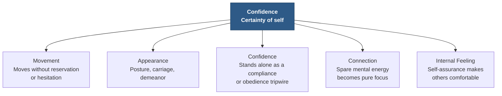
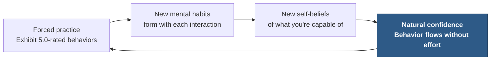

# Chapter 16 — Confidence

> *"Confidence is not a personality trait. It's a skill."*

Confidence can be easily defined as having **certainty of self**. This means being certain of your own worth, and being certain that outcomes will usually work out in your favor. When you believe in your own abilities or skills, you exude self-confidence — and this creates a social magnetism that you can see reflected in others.

::: definition
**Confidence** — certainty of self: being certain of your own worth, and being certain that outcomes will usually work out in your favor.
:::

::: warning
**Confidence never means being rude** — obnoxious, distasteful, or otherwise acting like a tyrant.<!-- ASR? verify: transcribed as "acting as a giant" — reconstructed as "acting like a tyrant" to fit the surrounding list of rude/obnoxious behaviors --> Never forget: *we rise by lifting others.*
:::

Confidence is the first of the five Authority Behavior Traits laid out in Chapter 15 — Confidence, Discipline, Leadership, Gratitude, and Enjoyment — and as promised there, we'll cover the same quick-access topics for each: what the trait means, how it triggers the authority tripwires, what habits and behaviors create it and what it looks like to others, and the tips and tricks for displaying it yourself.

---

## The Common Traits of Low Self-Confidence

People who have low self-confidence typically have a few common traits:

- Trouble saying no
- Indecision and over-analysis in decision-making processes
- Difficulty spending time alone
- Seeking reassurance from the environment and their social circle
- Over-apologizing
- Fear of failure
- Putting others down, or being overly critical
- Sensitivity to criticism
- Fear of being interrupted
- Fear of subordination
- Fear of public judgment
- Frequent worry or concern for their standing on the social ladder, or concern with identifying their position in a social hierarchy

---

## How Confidence Triggers the Authority Tripwires

Confidence triggers several of the authority tripwires from Chapter 15. The way a confident person moves — without reservation or hesitation — trips the **Movement** tripwire. The visual appearance of a confident person trips the **Appearance** tripwire in many cases. The **Confidence** and **Connection** tripwires are set off by assured behavior. And a sense of self-assurance makes others comfortable, setting off the final **Internal Feeling** tripwire (see Figure 16.1).

*Figure 16.1 — One trait, five tripwires. Confidence is the only Authority Behavior Trait capable of setting off every tripwire on the Effect side of the Authority Triangle — and of standing alone as a compliance tripwire in its own right.*

### Movement

The movement of confident people is apparent. Think of the last time you walked through an airport or a busy street, and how most people agree to the social concept of walking like each other. This behavior actually makes it easier for humans to navigate in crowded areas. This crowd-walk is programmed in us as an automatic response to being in crowds — and the more we do it, the more it gets ingrained into our behavior.

How does this help us? The less we have to focus on the environment, the less our brain has to work. Things that we do all the time are memorized into behavioral patterns that help us save mental effort. Tying our shoes would be exhausting if we hadn't developed muscle memory for the task. Walking through a crowd would require constant attention if our brains didn't create a shortcut.

### Appearance

The posture, carriage, and demeanor of a confident person is apparent hundreds of yards away. When you move up the scale on the self-assessment matrix, you'll see a noticeable reaction in others.

### Confidence

Confidence itself is an authority tripwire. It appears first on the traits list because, unlike the other traits, it can stand alone as a compliance or obedience tripwire.

### Connection

The amount of focus you're able to bring to situations will be determined by how much mental energy you're expending elsewhere. When a person has a strong sense of confidence, self-monitoring, anxiety, social discomfort, and other mental processes aren't there to expend their mental energy. Having focus — whether on a task or on the person you're speaking to — creates followership.

### Internal Feeling

People, especially strangers, have no ability to judge who you are and how to treat you other than by your own behavior. When people see you being completely confident in any situation, they assume that is your normal behavior, and they become more comfortable around you.

> They're also more likely to follow your lead if they perceive that you believe in your actions more than they believe in their own.

---

## What Habits and Behaviors Create Confidence

Confidence is formed through **repetition** and **control**. Confidence comes naturally when you achieve control over all aspects of the mastery zones (the Habits side of the Authority Triangle — Chapter 7). But you can develop confidence *before* achieving mastery-zone control, through **forced practice**.

By forcing yourself to exhibit 5-rated behaviors on the Authority Self-Assessment, you prove to yourself that you're able to successfully behave this way in social situations. Every new interaction during which you exhibit 5.0 authority behaviors forms new mental habits. These interactions then create new self-beliefs of what you're capable of (see Figure 16.2).

*Figure 16.2 — The forced-practice loop. Acting out 5.0-rated behaviors before you feel them builds the mental habits — and then the self-beliefs — that eventually make confidence automatic.*

Start working on the authority mastery zones today, even if it's something small.

::: callout
**Form the river.** Remember: even a massive river that runs through the earth, creating a deep groove in the earth's surface, started with a single drop of water. Form small grooves in your behavior on a daily basis. It's easy to get discouraged, and most people will give up while moving through the process. Don't be one of them. Form the river. Once you do, the water — your behaviors — will flow automatically, without effort.
:::

I've provided assessments, checklists, and lists of daily tasks later in this manual. Don't worry about perfection. So many students suffer paralysis when they miss a day, screw up a journal, forget to fill out an accountability checklist, or act foolishly on occasion. Perfection is impossible.

::: callout
**Aim for consistency over perfection.**
:::

---

## What Confidence Looks Like to Others

From a visual-only perspective, confidence has several factors, and may trip the Movement and Appearance tripwires:

**Posture & frame**

- Erect, comfortable posture — top of the head aligned with the pelvis
- Lowered, relaxed shoulders
- Legs spread a comfortable distance apart from each other
- Comfortable tilting the head, or being physically vulnerable

**Face & eyes**

- General facial appearance of enjoyment
- Relaxed lower eye muscles
- Limited eyebrow-raising when someone is speaking to you
- Slow eye-blink ("shutter") speed

**Movement & breath**

- Slow bodily movements, as if moving underwater
- A manner of walking that communicates certainty and conviction
- Movement of the body that has no reservation or hesitation
- Relaxed, normal breathing

**Openness & contact**

- Comfortable and relaxed arms, legs, hands, and fingers
- Comfortable and physically open behaviors around others and in conversation
- Comfortable making physical contact with others during conversation
- Reacting physically, with genuine emotion, to the emotional high points of others' stories

---

## Tips and Tricks to Display Confidence

Confidence is hard to fake externally. Even giving off the right nonverbal signals and physical movements, there will always be some part that doesn't match — or appear congruent — to the brains of the people you interact with.

### Let Go of Outcomes

Start letting go of outcomes today. Be confident that things will work out the way you'd like them to, and you'll be surprised how often it happens.

### A Note on Beta Blockers

Some students have taken a prescription from their doctor called beta blockers, also known as beta-adrenergic blocking agents. They're used to lower blood pressure, but they've also been shown to reduce social anxiety (Steenen et al., 2016).<!-- Citation: Steenen, S.A. et al. (2016), "Propranolol for the treatment of anxiety disorders: Systematic review and meta-analysis," Journal of Psychopharmacology 30(2), 128–139 — verified via web search; transcript's "Steam in 2016" corrected to the real author --> Speak with your doctor about this if you think it may work for you. A temporary reduction in social anxiety while taking beta blockers may help create behavioral habits — new life scripts — that would have otherwise been impossible, or taken much longer to create.

### The Rules of Confidence

The character traits of confidence are summed up in the Authority Self-Assessment. Confidence is not a personality trait — it's a skill. Here are some rules of confidence I've created from my many decades of experience:

1. **Realize everyone is actually faking it.**
2. **Set expectations of generalized positive outcomes.**
3. **Realize the worst-case scenario is usually no big deal.**
4. **Appearance matters. Look confident.**

### A Note on the Appearance of Confidence

A research study conducted by Yoo (2013) demonstrated that the utilization of functional tape was effective in the reduction of forward head posture. In the study, Yoo concluded that the forward-head-posture angle significantly decreased for participants during computer work with neck-retraction tape, compared to workers who did not utilize tape.<!-- Citation: Yoo, W.G. (2013), "Effect of the Neck Retraction Taping (NRT) on Forward Head Posture and the Upper Trapezius Muscle during Computer Work," Journal of Physical Therapy Science 25(5) — verified via web search; transcript's "you, 2013" corrected -->

In a study conducted by Saavedra-Hernández et al. (2012), it was concluded that functional taping is an effective treatment protocol for decreasing neck pain and disability in individuals presenting with mechanical neck pain.<!-- Citation: Saavedra-Hernández, M. et al. (2012), "Short-term effects of kinesio taping versus cervical thrust manipulation in patients with mechanical neck pain: a randomized clinical trial," JOSPT 42(8), 724–730 — verified via web search; transcript's "Sevedra Hernandez" corrected --> The beneficial effects of functional tape include physical corrections, fascia relaxation, space recuperation, ligament and tendon support, movement rectification, and lymphatic fluid circulation (Plan, 2011).<!-- ASR? verify: citation transcribed as "Plan 2011" — the benefits list itself is verbatim from published kinesio-taping literature, but no author named "Plan" (2011) could be confirmed via web search; the author name is likely misheard and could not be recovered -->

### Praise — Earned, Not Given

Getting a compliment makes you a little more confident — but the praise distorts your self-image *without proof*. If you become more confident after finishing a goal, you've **earned** the confidence boost. Praise can be hollow, and it will deteriorate over time. It also causes you to lose confidence in the absence of praise.

Don't let other people's praise or criticism define your level of competence — or anything else. Make a list of your **earned achievements**.

### Role Application

Assign yourself a role in every conversation before it starts:

- *"My job here is to make them feel interesting."*
- *"In this conversation, I'll make this person feel powerful."*
- *"My job here is to talk to them and discover their needs."*

Role application works in two ways. **One**, it allows you to plan ahead, so you don't feel like you're going in blind. And **two**, it gives you a reason to be there, keeping your mind focused on the role that you've defined for yourself.

Imagine an expensive luxury store near you — one that might make you feel nervous to enter. You know you can't afford anything in there, so walking in would likely make you feel like an imposter. But if your boss asked you to take his no-spending-limit company credit card and purchase something in that store, you'd be completely confident walking in. The discomfort disappears because of the *role* you are living as you enter the store.

Think of how you best communicate, and then build your roles around your biggest strengths. Determine how you can use role application to leverage confidence to the maximum extent possible.

### Confidence, Tailored for You

Confidence looks and sounds different to each of us. You need to define confidence specifically for *you*. What does it look like? What does it feel like? How do you define it? Is it comfort on the red carpet, or climbing Mount Everest?

What drives your definition of confidence? Is it one — or some — of the following?

- Achievement
- Social skills
- Recognition
- Reactions of others
- Ability to stay comfortable
- Comfort under pressure
- Convincing others you're confident

Who do you feel is truly confident? What are their traits? Take a moment to really dig into this exercise in order to maximize your training: think of some people you consider to be confident, and then write out a description of each. You'll quickly have a traits-analysis tool for determining *your* style of confidence.

### Give Compliments

Give compliments in social situations — but remember not to suck up. Giving compliments has three positive effects:

1. **Social prowess.** The greatest leaders of our time were complimentary when they spoke to others. They would offer compliments to make others feel comfortable in their presence.
2. **Feel-good.** Complimenting others makes you feel good, which then raises your comfort level, allowing you to be more confident.
3. **People skills.** Getting comfortable giving compliments improves your social skills — the critical element of persuasion.

### Fitness

Do one thing daily that's good for your body. Eating well, working out, making your bed, and exercising self-discipline boosts your confidence, which has a direct positive impact on your self-esteem. You're tricking your brain into believing that you are disciplined, successful, healthy, et cetera.

### Share Your Insecurities

Being open and vulnerable not only makes people more likely to identify with you — it also makes people automatically more willing to do the same. As you learned, Openness is a major gateway to influence on the 6 Axis Model (Chapter 5). Being open and vulnerable has many positive effects:

- People like imperfect people.
- It takes all the power away for someone to judge you, or use it against you.
- It provides a good window for someone to reassure you, if you're just beginning to raise your confidence and need a boost.

### Cold Showers

Dousing yourself in cold water can do all kinds of amazing things to your mind and body.<!-- ASR? verify: transcribed as "Down ringing cold water" — reconstructed as "Dousing yourself in cold water" --> I'll list a few of the benefits here.

**Immune function.** A simple cold shower can help your immune system in several ways. Research shows that exposure to cold water triggers an anti-inflammatory norepinephrine release, while increasing red blood cells, white blood cells, and platelets significantly. Another study found swimmers had an improved adaptation to oxidative stress, and were better able to tackle inflammation — and inflammation is related to almost all chronic diseases. A further study found that cold-water swimming can raise the tolerance of the body to potential injury. Your cold shower is doing the same.

**Depression reduction.** Due to the high density of cold receptors in the skin, a cold shower is expected to send an overwhelming number of electrical impulses from peripheral nerve endings to the brain, which could result in an antidepressive effect. This finding is from a study by the Virginia Commonwealth University School of Medicine, in Richmond.<!-- Citation: Shevchuk, N.A. (2008), "Adapted cold shower as a potential treatment for depression," Medical Hypotheses — verified via web search; the transcript's "University School of Medicine, Richmond" matches VCU School of Medicine, Richmond, VA --> Another study showed depression syndromes were relieved in those who took two or three cold showers per week.

**Metabolism.** People who take a daily cold shower show an increase in metabolism, because the cold water increases activation in brown adipose tissue — good fat, which is used to generate heat and insulate against the cold. It's the type of fat we want, and kicking it into action boosts our metabolism.

**Productivity.** A study in the Netherlands, involving 3,000 participants, found those who finished their daily shower with a 30- to 90-second blast of cold water were 29% less absent than their colleagues after just 30 days of the trial.<!-- Citation: Buijze, G.A. et al. (2016), "The Effect of Cold Showering on Health and Work: A Randomized Controlled Trial," PLoS One — verified via web search: 3,018 participants, 30/60/90-second cold-shower arms, 29% reduction in sickness absence; transcript's "30 to 92nd blast" corrected to "30- to 90-second blast" --> It speaks volumes that two-thirds of those who completed the study continued with their daily cold-shower ritual once the trial ended.

**Energy.** Cold showers stimulate our sympathetic nervous system, which is responsible for our fight-or-flight response to danger. This triggers a hormone release, which leaves you feeling buzzing every time.

**Beat fatigue.** One interesting study suggests brief cold-water exposure can help with chronic fatigue, also known as overtraining syndrome. There appears to be a strong link between chronic fatigue and insufficient hypothalamus function — which cold-water exposure has been shown to reverse.

**Fertility.** Well — for men. There's evidence showing high-water-temperature exposures, like baths, hot tubs, and hot showers, can reduce male fertility. Testicles need a cool environment to operate optimally, and a cold shower delivers exactly that.

**Improved hair and skin (sexiness).** Cold showers have been shown to improve your hair and skin. In a cold shower, your skin becomes more taut — which is your pores contracting. Your hair also improves, because cold water doesn't wash away the natural oils on your hair and skin the way hot water does. Dr. Jessica Krant says excessively hot water will strip healthy natural oils from your skin too quickly (Krant, 2015).<!-- Citation: Dr. Jessica Krant, board-certified NYC dermatologist — verified as a real person who gives exactly this advice about hot water stripping natural oils; transcript's "Crammed 2015" corrected -->

### Shift Your Voice

Confident people speak with a different tone of voice. Just as you can adjust your body to change how you feel, you can do the same with your voice.

### Download a To-Do List App

Checking things off lists is a surefire way to make you feel incredible about yourself and your abilities. This seemingly small task gives the brain *proof* — evidence that you are someone who gets things done. And this boosts confidence. Over time, you will develop a reputation for getting done what you set out to do.

We get addicted to people's approval because we don't approve of ourselves.

> Confidence can be defined as having a stellar reputation with yourself.

And these steps are the pathway to it. Having a stellar reputation with yourself is the single strongest technique to blow up your confidence.

### Don't Compare

They say that comparison is the thief of joy — but I would say that comparison is the thief of *confidence*. You never know what another person is thinking, feeling, or experiencing, and you certainly don't know what they have been through in their past. So comparing yourself to them makes no sense. Said another way: don't compare someone else's chapter ten to your chapter one.

Stopping external comparisons will help you focus on yourself, and will, as a result, boost your confidence.

### Our Strongest Social Drive

One of our most powerful drivers, when it comes to behavior, is the need to **stay consistent with how we define ourselves**. If you develop a running list of why you're awesome, you'll have a useful reference to refer to — one that then guides your thoughts and behaviors. The more you look at your list and add to it, the more your brain will begin to adhere to this new self-view. You'll start automatically living up to the new self-view in order to stay consistent with what your brain is reading about yourself.

::: warning
**Watch your labels.** If you call yourself introverted, shy, unconfident, or low-status, your brain will work its butt off to find evidence of these traits — and will start behaving in those ways.<!-- ASR? verify: transcribed as "work its out off" — reconstructed as "work its butt off" -->
:::

### Let Future Regret Drive Your Actions

Now is the time for action. You don't have the time to *not* do this. Look around — everyone secretly regrets that they didn't go for it at some point in their past. You do not need permission. **Act now.**

---

## The Escalatory Pyramid

The following is a list of various situations that might make someone uncomfortable. Read through them and ask yourself which ones make *you* uncomfortable. You can start developing your confidence by gradually increasing activity in your daily life that pushes you slightly outside of your comfort zone (see Figure 16.3).

1. Say hello to a stranger.
2. Make eye contact during and after saying hello.
3. Say hello with a smile and eye contact.
4. Say hello with a smile, posture, and eye contact.
5. Compliment a stranger.
6. Compliment a stranger with longer eye contact.
7. Compliment with eye contact, and maintain the silence that follows.
8. Compliment with eye contact and a follow-up question.
9. Compliment with eye contact, a follow-up question, and a secondary compliment.
10. Compliment with eye contact and added physical contact.
11. Start a conversation with a stranger.
12. Ask a stranger for advice.
13. Ask a stranger for advice with longer eye contact.
14. Ask a stranger for advice with longer eye contact and physical contact.
15. Deliver a speech to a group of people you don't know very well.
16. Directly ask someone on a date without introducing yourself.
17. Take charge of a group of strangers in a public place.

### Discomfort Ideas

When you begin feeling comfortable with a previously uncomfortable situation, you can layer additional stress onto the situation in order to keep increasing your confidence over time. There are a few things you can do to increase the social stress and build more confidence:

- Longer physical contact
- Longer eye contact
- Prolonged silence in between dialogue
- Increased tension and questions
- Asking for increasing favors
- Increased level of social permissiveness
- Using topics that decrease in social acceptability

---

Confidence is something you can develop. It's not a trait you're born with — and it is the most important element of persuasion. So be sure to revisit this section of the manual often as you continue your training.

---

## Key Takeaways

- **Confidence is certainty of self** — being certain of your own worth, and certain that outcomes will usually work out in your favor. It creates a social magnetism reflected in others, and it never means being rude, obnoxious, or tyrannical: *we rise by lifting others.*
- **Low self-confidence has recognizable signatures**: trouble saying no, indecision and over-analysis, difficulty being alone, reassurance-seeking, over-apologizing, fear of failure, criticism, interruption, subordination, and public judgment, and constant worry about one's position in the social hierarchy.
- **Confidence trips all five authority tripwires** from Chapter 15 — Movement (moving without hesitation), Appearance (posture, carriage, demeanor), Confidence itself (the only trait that stands alone as a compliance tripwire), Connection (spare mental energy becomes focus, and focus creates followership), and Internal Feeling (self-assurance makes others comfortable and more likely to follow your lead).
- **Confidence is formed through repetition and control.** It comes naturally with mastery-zone control, but you can build it early through forced practice: every interaction in which you exhibit 5.0-rated behaviors on the Authority Self-Assessment forms new mental habits, which create new self-beliefs about what you're capable of.
- **Form the river**: even a massive river started with a single drop of water. Aim for consistency over perfection — perfection is impossible, and paralysis over missed days is how most people quit.
- **Visible confidence is a body-wide signal**: erect posture with the head aligned over the pelvis, relaxed eyes and shoulders, slow blinks, slow underwater-like movement, open positioning, comfortable physical contact, and genuine emotional reactions to others' stories.
- **Confidence is hard to fake externally** — incongruence leaks. The deeper fixes: let go of outcomes, earn your praise through finished goals rather than compliments, and remember the four rules — everyone is faking it, expect generalized positive outcomes, the worst case is usually no big deal, and appearance matters.
- **Role application removes imposter feelings**: assign yourself a job in every conversation ("make them feel interesting"), the way a no-spending-limit company card would make you walk confidently into a luxury store you couldn't afford.
- **Daily levers stack**: compliments (social prowess, feel-good, people skills), one daily act of fitness or discipline, sharing insecurities (Openness on the 6 Axis Model), cold showers (immunity, mood, metabolism, productivity, energy, fatigue, fertility, hair and skin), a confident voice, and a to-do list app that proves to your brain you get things done.
- **Confidence is a stellar reputation with yourself.** Don't compare your chapter one to someone else's chapter ten; keep a running list of why you're awesome, because your brain works to stay consistent with how you define yourself — for better or worse.
- **Climb the Escalatory Pyramid**: from saying hello to a stranger, through layered compliments and advice-seeking, up to speeches and taking charge of a group in public — then layer on discomfort (longer contact, silence, tension, escalating favors) to keep growing.
- **Confidence can be developed. It is not a trait you're born with — and it is the most important element of persuasion.**

<!--
## Change Log

| Original (transcript) | Corrected | Reason |
|---|---|---|
| "you exuse self-confidence" | "you exude self-confidence" | ASR mishearing ("exuse" → "exude"). |
| "This figures a social magnetism" | "this creates a social magnetism" | ASR mishearing ("figures" → "creates"); exact original verb could not be confirmed. |
| "otherwise acting as a giant" | "otherwise acting like a tyrant" | ASR mishearing ("giant" → "tyrant"), reconstructed to fit the surrounding list (rude, obnoxious, distasteful); flagged inline. |
| "authority trip wise" / "trip wires" (throughout) | "authority tripwires" | Standardized to the one-word spelling established in Chapters 7 and 15. |
| "Indecision and over analysis for decision making processes" | "Indecision and over-analysis in decision-making processes" | Grammar repair. |
| "the final internalized feeling trip wire" / "internalized feelings" (section heading) | "Internal Feeling" | Normalized to the tripwire's established name from Chapter 15 ("Internal Feeling"). |
| "This crowdwalk" | "This crowd-walk" | Hyphenation for readability; author's coined term retained. |
| "apparent 100s of yards away" | "apparent hundreds of yards away" | Formatting repair of a numeral artifact. |
| "It appears 1st on the traits list" | "It appears first on the traits list" | Formatting repair. |
| "creates follership" | "creates followership" | ASR mishearing, consistent with the same correction in Chapter 15. |
| "no ability to judge who you are and how to treat you. other than your own behavior" | "no ability to judge who you are and how to treat you other than by your own behavior" | Grammar repair of a sentence fragment. |
| "exhibit 5 rated behaviors on the authority self-assessment" | "exhibit 5-rated behaviors on the Authority Self-Assessment" | Formatting; capitalized as the proper name of the assessment referenced in Chapter 15 ("the authority grading scale"). |
| "Forms small grooves in your behavior" | "Form small grooves in your behavior" | Grammar repair (imperative, matching the surrounding instructions). |
| "later in the audiobook" / "this section of the audiobook" | "later in this manual" / "this section of the manual" | Medium adaptation for the written edition, consistent with prior chapters' usage of "this manual." |
| "So many students of a paralysis when they miss a day" | "So many students suffer paralysis when they miss a day" | ASR mishearing ("of a" → "suffer"). |
| "Her function is impossible." | "Perfection is impossible." | ASR mishearing ("Her function" → "Perfection"), restoring the sentence that sets up "consistency over perfection." |
| "may trip the movement and appearance trip wise" | "may trip the Movement and Appearance tripwires" | ASR mishearing ("wise" → "wires"). |
| "Slow eye blink speed, shutter speed." | "Slow eye-blink ('shutter') speed" | Formatting repair — the aside rendered as a parenthetical. |
| "Comfortable tilting head or being physically vulnerable" | "Comfortable tilting the head, or being physically vulnerable" | Grammar repair. |
| "Legs spread in a comfortable distance apart" | "Legs spread a comfortable distance apart" | Grammar repair. |
| "And reacts physically with genuine emotion to emotional high points of other stories" | "Reacting physically, with genuine emotion, to the emotional high points of others' stories" | Grammar repair ("other stories" → "others' stories"), matched to the list's parallel structure. |
| "beta adrenergive blocking agents" | "beta-adrenergic blocking agents" | ASR mishearing of the real pharmacological term. |
| "Steam in 2016" | "(Steenen et al., 2016)" | ASR mishearing of the real author; verified via web search — Steenen et al. (2016), "Propranolol for the treatment of anxiety disorders: Systematic review and meta-analysis," Journal of Psychopharmacology. |
| "Don. ... To ... Three. ... Four." | "1. ... 2. ... 3. ... 4." | ASR misreading of spoken numerals ("Don" → "One," "To" → "Two"); rendered as a numbered list. |
| "A research study conducted by you, 2013" / "In the study, you concluded" | "conducted by Yoo (2013)" / "Yoo concluded" | ASR mishearing of the researcher's name; verified via web search — Yoo, W.G. (2013), neck-retraction-taping study in the Journal of Physical Therapy Science, matching the stated findings exactly. |
| "Sevedra Hernandez, 2012" | "Saavedra-Hernández et al. (2012)" | ASR mishearing of the real lead author; verified via web search — Saavedra-Hernández et al. (2012), JOSPT, kinesio taping vs. cervical thrust manipulation for mechanical neck pain. |
| "Plan 2011" | Retained as "(Plan, 2011)", flagged inline | The benefits list is verbatim from published kinesio-taping literature, but no 2011 author named "Plan" could be confirmed via web search; the name is likely misheard and could not be recovered. |
| "Roll application" (throughout) | "Role application" | ASR homophone error. |
| "Is my job here to make them feel interesting." | "My job here is to make them feel interesting." | Grammar repair (garbled word order in a self-talk example). |
| "But you don't feel like you're going in blind" | "so you don't feel like you're going in blind" | ASR mishearing ("But" → "so"). |
| "You know you can't afford anything in that." | "You know you can't afford anything in there" | ASR truncation repair. |
| "if your boss asks you to take his no spending limit company credit card" | "if your boss asked you to take his no-spending-limit company credit card" | Grammar repair (tense consistency). |
| "as you enter the storm" | "as you enter the store" | ASR mishearing ("storm" → "store"). |
| "were complementary when they spoke to others" / "Complementing others" | "complimentary" / "Complimenting others" | ASR homophone error ("complementary" → "complimentary"). |
| "the 6 axis model" | "the 6 Axis Model" | Standardized to the established name from Chapter 5. |
| "It takes all power away for someone to judge or use it against you" | "It takes all the power away for someone to judge you, or use it against you" | Grammar repair. |
| "Down ringing cold water can do all kinds of amazing things" | "Dousing yourself in cold water can do all kinds of amazing things" | ASR mishearing, reconstructed; flagged inline. |
| "A list a few of the benefits here" | "I'll list a few of the benefits here" | ASR mishearing ("A list" → "I'll list"). |
| "anti-inflammatory neuropenephrine release" | "anti-inflammatory norepinephrine release" | ASR mishearing of the real neurotransmitter name. |
| "better able to tackle information. Information is related to almost all chronic diseases." | "better able to tackle inflammation — and inflammation is related to almost all chronic diseases" | ASR mishearing ("information" → "inflammation"), consistent with the sentence's subject (oxidative stress, chronic disease). |
| "a study by the University School of Medicine, Richmond" | "the Virginia Commonwealth University School of Medicine, in Richmond" | Completed the institution's real name; verified via web search — Shevchuk (2008), "Adapted cold shower as a potential treatment for depression," written at VCU School of Medicine, Richmond, VA, matching the stated mechanism exactly. |
| "depression syndromes were relieved and those who took two or three cold showers" | "depression syndromes were relieved in those who took two or three cold showers" | ASR mishearing ("and" → "in"). |
| "generate heat and insulators against the cold" | "generate heat and insulate against the cold" | ASR mishearing ("insulators" → "insulate"). |
| "a 30 to 92nd blast of cold water" | "a 30- to 90-second blast of cold water" | ASR numeral error ("92nd" → "90-second"); verified via web search against the real trial (Buijze et al., 2016, PLoS One: 3,018 participants, 30/60/90-second arms, 29% reduction in sickness absence). |
| "Gold showers have been shown to improve your hair and skin" | "Cold showers have been shown to improve your hair and skin" | ASR mishearing ("Gold" → "Cold"). |
| "which is your paws contracting" | "which is your pores contracting" | ASR homophone error ("paws" → "pores"). |
| "Crammed 2015" | "(Krant, 2015)" | ASR mishearing of the dermatologist's name; Dr. Jessica Krant verified via web search as a real board-certified dermatologist quoted giving exactly this advice. |
| "your brain will work its out off" | "your brain will work its butt off" | ASR mishearing, reconstructed; flagged inline. |
| "what they have been through in that past" | "what they have been through in their past" | ASR mishearing ("that" → "their"). |
| "That's another way." | "Said another way:" | ASR mishearing of a transition phrase, reconstructed to introduce the chapter-ten/chapter-one line. |
| "a useful reference to refer to which then guides our thoughts and behaviors" | "a useful reference to refer to — one that then guides your thoughts and behaviors" | Grammar repair (pronoun consistency). |
| "Listen through them" | "Read through them" | Medium adaptation for the written edition. |
| "Make eye content" / "eye content" (throughout) | "eye contact" | ASR mishearing ("content" → "contact"). |
| "Compliments a stranger" / "Complements with eye contact" / "Continent with eye content" | "Compliment a stranger" / "Compliment with eye contact" | ASR mishearing/homophone errors in the escalation list, normalized to imperative parallel structure. |
| "Compliments with eye contact and maintain with silence" | "Compliment with eye contact, and maintain the silence that follows" | Grammar repair of a garbled list item. |
| "Compliments with eye contact and added physical content" | "Compliment with eye contact and added physical contact" | ASR mishearing ("content" → "contact"). |
| "Ask for increasing favors" / "Use topics that decrease..." | "Asking for increasing favors" / "Using topics that decrease..." | Grammar repair for list parallelism. |
| "Is the most important element of persuasion." | "it is the most important element of persuasion" | ASR truncation repair ("Is" → "it is"). |
-->
