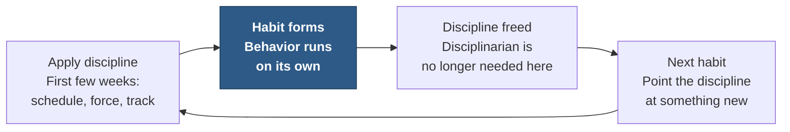
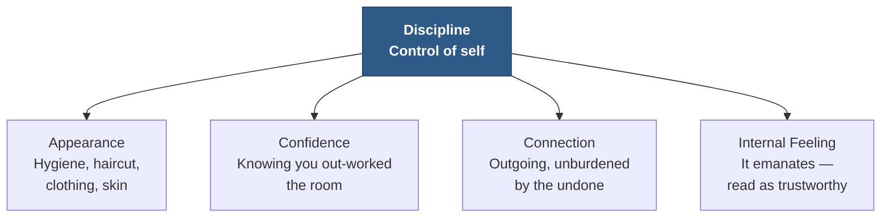
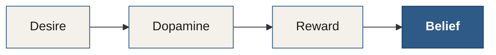

# Chapter 17 — Discipline

> *"The definition of self-discipline is a state where the present self is able to ignore desires in service of the future self."*

Self-discipline simply means the ability to impose your desired will onto yourself. It's the ability to persevere, think ahead, finish what you start, and exercise self-restraint when you're faced with something that might not be in your best interest. The two hallmarks of self-discipline are the ability to control your own behavior and the ability to delay gratification.

Discipline is the second of the five Authority Behavior Traits laid out in Chapter 15 — Confidence, Discipline, Leadership, Gratitude, and Enjoyment — and as with Confidence, we'll cover the same quick-access topics: what the trait means, how it triggers the authority tripwires, what habits and behaviors create it, and the tips and tricks for building it into your own life.

::: definition
**Self-discipline** — the ability to impose your desired will onto yourself: to persevere, think ahead, finish what you start, and exercise self-restraint against what isn't in your best interest. Its two hallmarks are **controlling your own behavior** and **delaying gratification**.
:::

---

## The Two Roles You Play for Yourself

Self-discipline means playing two roles for yourself: the role of **Butler** and the role of **Disciplinarian**. One serves your future self; the other vetoes your present self. Together they are the whole of discipline (see Table 17.1).

| Role | Job | Fires when… |
|---|---|---|
| **The Butler** | Takes care of your future self — sets them up for an easy, successful day | You're deciding what to leave for tomorrow: the coffee, the outfit, the tidy home, the full night's sleep |
| **The Disciplinarian** | Vetoes bad decisions — forces the right action in the moment | You want to throw your clothes on the floor, skip the gym, eat crap, or hit snooze one more time |

*Table 17.1 — The two roles of self-discipline. The Butler is proactive and generous; the Disciplinarian is reactive and firm. You need both.*

---

## The Power of Being Your Own Butler

The power of being your own butler cannot be overstated.<!-- ASR? verify: transcribed as "cannot be understated" — corrected to the intended idiom "cannot be overstated," which matches the surrounding claim that the power is very great --> If your current self is always thanking your past self, that's a sign things are going well. If your current self is concerned with taking care of your future self, that's also a good sign. Conversely, if your current self is angry or resentful toward your past self, that's a bad sign.

Staying focused on taking care of your future self creates so much room in your life for other authority traits — mainly **Enjoyment**. From making your bed to laying out the clothing your future self will need in the morning, there's power in being your own butler.

Imagine how easy it is to feel gratitude when one of the major sources of that gratitude is your own past self. Imagine how empowering it feels to care so much about your future self that you're willing to slightly deprive your present self to benefit him or her.

::: callout
**Keep this on the fridge.** The butler concept may seem small, but it's so powerful that it's worth keeping on the fridge, the mirror, the dashboard, or the desk:

> **Are you taking care of future \[your name here\]?**
:::

Ask yourself the honest questions:

- Did your past self leave you a sink full of dishes?
- Did your past self go to bed late and not give a damn about the time you had to wake up?
- Did your past self make you get into an unmade bed?
- Did your past self create a bad financial situation for you?

It's time to move your focus toward being the butler of your future self.

---

## The Disciplinarian — Your Decision-Vetoing Machine

Being the disciplinarian can be as challenging as being the butler. The disciplinarian acts as a **decision-vetoing machine**, forcing you to take the right action when necessary. It steps in immediately:

- when you feel tired and want to throw your clothes on the floor;
- when you feel like staying up late to finish binge-watching that show;
- when you feel like not going to the gym;
- when you feel like eating crappy food;
- when your hand is poised to hit the snooze button for the eleventh time.

Taking the right action is difficult without the right habits in place. Take one or two small behaviors to fix at a time, until they become easy to manage — and easy for you to veto the bad behaviors. Keep moving forward, and in just a few months you'll see major improvements in your lifestyle.

---

## You Only Need Enough Discipline to Form a Habit

So many people assume they need more discipline to get things done throughout their lives. In reality, **you only need the discipline required to form a habit**. Once a habit is formed, you no longer require discipline for that task.

When you see people regularly going to the gym, it's usually not because of discipline — at least for most people. They go because they are in the *habit* of going. They used discipline for the first few weeks to build the habit: convincing themselves they had time, forcing themselves to schedule the gym, and holding themselves accountable for going every day. After a little while, the disciplinarian is no longer required for that task and can move on to developing the next habit (see Figure 17.1).

*Figure 17.1 — Develop habits with discipline, then do it again. Discipline is the startup cost of a habit, not its running cost. Once the behavior is automatic, the discipline you spent on it is returned to you — spend it on the next habit.*

After twenty years in the military, I know that it's **deliberate habit formation** that separates those who succeed from those who fail. Successful people have habits, and it only takes a few tablespoons of discipline to create them. You actually can do this, for real.

---

## How Discipline Triggers the Authority Tripwires

Discipline shows itself in interesting ways in conversation and social settings. When someone has self-discipline, it tends not to announce itself directly — instead it shows up through other channels. It trips several of the authority tripwires from Chapter 15 (see Figure 17.2).

*Figure 17.2 — One trait, four tripwires. Discipline rarely shows up as itself; it leaks out through Appearance, Confidence, Connection, and Internal Feeling.*

### Appearance

Discipline shows itself in personal appearance. Personal hygiene, haircut, clothing, and skin condition can all reflect the amount of self-discipline someone has.

### Confidence

Self-discipline feeds confidence. In many situations, just knowing you have more discipline than most of the people around you is enough to raise your confidence. Knowing that you woke up two hours earlier, worked twice as hard, or ate better than anyone else in the room shows up in your behavior — in ways that aren't always obvious.

### Connection

Having self-discipline lets you be more outgoing and less concerned about all the things you haven't done. It prevents the *"I'm irresponsible"* reminder system we talked about earlier.

### Internal Feeling

You've likely met someone in your life who has incredible self-discipline, and you could tell it somehow emanated from them. You can develop that same kind of discipline — the kind people *feel* in a conversation. When we know someone has an admirable level of self-discipline, we know they stick to their own timelines, which leads us to see them as more **trustworthy**.

---

## What Habits and Behaviors Create Discipline

Self-discipline is created through **repetition, reminders, tracking, and force**. You must be willing and able to force yourself into having discipline in any area of your life. Forcing the present version of you to think of the future you is the only way to turn self-discipline into an unconscious process.

::: definition
**Self-discipline (working definition)** — a state where the present self is able to ignore its own desires in service of the future self.
:::

### Loving Yourself

Before you can be a good butler to your future self, build a relationship with yourself:

- Do something fun. Alone.
- Develop a new romantic relationship with yourself.
- Go on an isolation vacation for a weekend. Don't talk, don't text. Spend time with you.
- Take the damn credit you've earned.

### Step One — Environment

Act today to shift your environment,<!-- ASR? verify: transcribed as "Val today to shift the environment" — reconstructed as "Act today to shift your environment"; the exact verb could not be recovered --> so your **reticular formation** can recognize that a change is happening. This way, more attention gets paid to your new self-development. (The reticular activating system — introduced in Chapter 11 — is the brain's scanning routine for what matters; give it something new to scan for.)

- Change your alarm-clock tone.<!-- ASR? verify: transcribed as "Ping your alarm clock turn" — reconstructed as "Change your alarm-clock tone" to fit the surrounding list of environment changes --> Create novelty in your morning routine.
- Buy a different car.
- Rearrange the furniture.
- Change your phone wallpaper.
- Change your wall art.
- Paint the house.
- Join a new meetup group or social group.

### Step Two — Future Projection

Vision-board the hell out of your life. Spend hours doing this. Get total clarity about your goals. If the images don't clearly communicate your goals, keep redefining the goals — or find new images. Your future rehearsal of success should be a **daily practice**.

Your brain will try to default to threat identification, and that's okay. Remember that your brain's main purpose is to protect you, so it does have its limitations.

---

## New Habits Worth Starting

Discipline is mysterious to many of us. When we see people going to the gym every day or eating a healthy diet, we assume they have tremendous discipline — but they don't. **You only need a teaspoon of discipline to start a habit.**

Here are some new habits worth considering. Notice that every one of them has the same underlying reason (see Table 17.2).

| New habit | Why you're really doing it |
|---|---|
| Being in bed on time | Concern for your future self |
| Eating clean | Concern for your future self |
| Developing your social-interaction skills | Concern for your future self |
| Daily journaling | Concern for your future self |
| Improving your physical health | Concern for your future self |

*Table 17.2 — Different habits, one motive. Every worthwhile habit traces back to the same source: concern for your future self.*

I'm certain that no one reading this book is doing so just for the experience. You want a return on your investment of time and money. By choosing to read this book, you've **already** shown concern for your future self. First, recognize that. Then take yourself on a date to celebrate.

When you have clear goals, you're a lot more likely to change your habits and develop the discipline you need.

---

## Your "Why"

The biggest source of self-discipline is having a reason to perform the task. You can call it your **Why**. Self-discipline is about counting on yourself:

- What are the actions you're willing to do?
- How far are you willing to go?

---

## The Morning Routine — Manage Your Boot-Up Sequence

Start with a morning routine. Manage your **boot-up sequence**, and never mess with it while you're booting up. Leave your phone on airplane mode and concentrate on the routine itself until you feel ready to conquer the day. Protect your morning boot-up viciously.

1. **Make your bed.** You've completed one accomplishment already.
2. **Energize** — coffee, exercise, cold showers, et cetera.
3. **Journal.**
4. **Schedule the day**, or review the schedule. *("I will win before 11 a.m.")*<!-- ASR? verify: transcribed as "I will wang before 11 a.m." — reconstructed as the mantra "I will win before 11 a.m."; the exact wording could not be recovered -->
5. **Meditation, yoga.**
6. **Focus on your vision board** — only positive input.<!-- ASR? verify: transcribed as "old and positive input" — reconstructed as "only positive input" to fit the following instruction to stay out of the news -->
7. **Stay out of the news.** Someone will tell you if there's something going on.
8. **Lean environment.** Tidy before you work.

You're learning to persuade other humans — start with yourself. The earlier you wake up, the bigger the time advantage you have over everyone who chooses to sleep in.

---

## Self-Control

Our history and literature are filled with characters who suffered a lack of self-control. Stories feature them to teach lessons about the ability to choose your own fate and control your life — from **Eve** in the Garden of Eden, to the myth of **Odin**, who could not temper his desires.<!-- ASR? verify: "Odin" is transcribed clearly and is a real mythological figure whose insatiable pursuit of wisdom and power fits "could not temper his desires"; retained as stated -->

There is a mountain of research suggesting that the single biggest indicator of success in adulthood is a **child's ability to delay gratification**.<!-- Citation: the delayed-gratification research is Walter Mischel's Stanford "marshmallow test" (begun 1970); follow-up studies linked longer waiting in childhood to better adult outcomes (SAT scores, educational attainment, BMI). Verified via web search. -->

### Delayed Gratification — The Cue and the Reward

Scientists found that when a monkey is given a lever that makes a raisin drop from a tube, there's a surge of dopamine in the monkey's brain. However, when they added a light that came on *just before* the raisin dropped, they discovered something remarkable: **the light produced more dopamine than the actual raisin did.**<!-- Citation: this is Wolfram Schultz's dopamine reward-prediction-error work in macaque monkeys (1980s–90s). As the animal learned the light predicted the reward, the dopamine burst shifted from the reward itself to the predictive cue. Schultz used a juice reward; the mechanism matches the author's account exactly. Verified via web search. -->

The **anticipation** of reward is what drives behavior — more than the actual reward. When our environment hints at an upcoming reward, dopamine levels start to rise immediately. This is a trick our brains play on us.

### The Brain's Calculation

Dopamine drives action, but the brain still makes calculations. Here's how it works: our brains adjust according to when a reward is expected, with **immediate rewards prioritized over later rewards**. This is your brain essentially telling your future self *"forget you."*

You can control this. Knowing how the brain works is the first step to gaining full control of it.

::: callout
**The temporal-discounting trap.** Your brain values a reward now far more than the same reward later — so it keeps voting for the present self. Discipline is the deliberate override: making the present self act on behalf of a future self the brain would otherwise ignore.
:::

---

## The State of Calm Enjoyment

Throughout every interaction I've had with successful people, the single universal trait I've been able to identify is something I call **calm enjoyment**.

::: definition
**Calm enjoyment** — the pleasure derived from getting done the things you know have to be done.
:::

Many people rush to accomplish things, only to become overwhelmed and fall victim to competing tasks and priorities. If you wanted to identify a common trait in unsuccessful or dissatisfied people, you'd see that they tend to *neglect the things that must be done*, lacking calmness in the accomplishment of their projects and tasks.

When it comes to small tasks, many of us continue the cycle of promising to do it later — or thinking it might go away if we don't look. People who suffer from stress or anxiety typically haven't set themselves up for peaceful living. Success can be achieved through practice. If you find yourself lost, unhappy, unfulfilled, or just plain disorganized, that's the result of a lack of practice. **Success and satisfaction come from practice, too.**

### The Kid Who Didn't Do Their Homework

Imagine yourself in middle school. We all remember the kid who never did their homework. Some of us — including me — *were* that kid. For many of us, there wasn't anything really stopping us. We just prioritized other things we enjoyed more than homework. In many cases it was literally a fifteen-minute assignment that could have been easily completed, but somehow other things got in the way.

This habit of not prioritizing required tasks often leads to a long period of habit-forming that lasts well into adulthood. With each passing year, one becomes more clever — making it easier and easier to explain the behavior, excuse the neglect, and ignore the tasks that must be done.

It's critical, no matter where you are in life, to focus on this one habit to change how you live: **build new habits, and break the old ones.**

We all have tasks piling up — bills, chores, diet choices, errands, dishes, the unmade bed, the college courses we wanted to take, raking leaves, cleaning, calling old friends, and our actual health. Focus on the calm enjoyment of things that need to be done. You'll be thankful in the future.

Take a moment to examine how most people default to never even considering this about their own lives. They simply live day to day in search of immediate reward: **the greatest amount of pleasure in the least amount of time.**

### The Magic Pathway

Here is the loop that runs beneath all of it (see Figure 17.3).

*Figure 17.3 — The magic pathway. Desire triggers dopamine, dopamine drives us toward the reward, and the reward hardens into belief. It happens automatically — which is exactly why it needs a disciplinarian watching it.*

Many people assume drug addicts must have pretty messed-up lives, but this is often not true. They are actually normal people, like you and I — but with dopamine reward centers that are way out of their control.

---

## Your Very Own Butler

Our lives are the product of everything our past self set up for us. Sometimes the you of the past did something stupid, and our present selves are the ones who have to pay the price. We've all stayed up too late the night before an important exam. We've all eaten too much, or done things we knew we'd feel horrible about afterward.<!-- ASR? verify: transcribed as "We ate too much or we knew we'd feel horrible after them in" — reconstructed as "We've all eaten too much, or done things we knew we'd feel horrible about afterward" -->

Your present self must be more concerned with taking care of *future* you than with itself. When we do things our future self won't benefit from, we're being **present-selfish**.

Think of five successful people who come to mind. I'm willing to bet you can see a pattern in their lives: they've prioritized the needs of their future self above their present self's desires.

### The Three Selves in Harmony

One of the greatest discoveries I've ever made is that our three selves must all work together in harmony. Your past self was deeply concerned with taking care of your present self — and therefore you are deeply concerned with taking care of your future self. That is all three selves working in harmony (see Figure 17.4).

When you go to bed at night, your thoughts should go directly to the desires of your future self. What would he or she need in the morning to have a great day?

- **A cup of coffee?** Go straight to the coffee maker and set it up so future you only has to press a single button.
- **Medicine in the morning?** Lay it out for them the way you would for a person you were serving as a butler. Set them up for success.
- **An outfit for tomorrow?** Prepare it so future you only has to put everything on. Lay out the shoes, socks, and underwear where they'll be found easily and comfortably.
- **A calm, organized home?** If you like organized spaces, tidy the house before bed so they'll wake up to a centered, organized home.
- **A well-rested body?** Get in bed and put the phone away. Read a book your future self will thank you for, then get the amount of sleep they'll need — and be grateful for.
- **A huge savings account?** Start saving now. Your actions are a gift to your future self.
- **A record of your growth?** If you have trouble remembering things about your life and your growth, keep a journal of your personal growth so they'll have something to reference in the future.
- **A body you're proud of next summer?** Good news: your future self will be using the same body you're living in right now. Get started on their gift today.
- **A new skill or knowledge?** Is there a particular thing you wanted to learn? Invest the time and effort now, so they'll be happy knowing they've successfully acquired it.

You've got to become a butler for your future self. The ability to embrace this mentality is what separates successful and happy people from those who are dissatisfied and unhappy.

And here's the good news: **it's addictive.** The more gratitude you send back to your past self, the more excited you'll feel about setting up your future self.

### Three Goals for the Three Selves

Here are the three goals for each self to strive for:

1. Your **past self** is always receiving gratitude from the present self.
2. Your **present self** is feeling gratitude for the past self while working its butt off for the future self.
3. Your **future self** is always feeling gratitude for you, now.

---

## Value and Mass Are Not the Same

There are so many books filling hundreds of pages on the topic of discipline, but this one chapter alone tells you everything you need to know. Whenever I finish writing a book, the first question so many people ask is, *"How many pages is it?"* Don't fall into that trap. **Value and mass are not the same.**

As you grow, learn to see your future self in every action you take:

- What effect will this have on them?
- Will I be pissed off that I made this choice?
- Is this in line with the life they want to have?
- Does this set them up for the goals I have set for them?

---

## Key Takeaways

- **Self-discipline is the ability to impose your desired will onto yourself** — to persevere, think ahead, finish what you start, and exercise self-restraint. Its two hallmarks are controlling your own behavior and delaying gratification.
- **Discipline means playing two roles for yourself**: the **Butler**, who takes care of your future self, and the **Disciplinarian**, a decision-vetoing machine that forces the right action in the moment (no clothes on the floor, no skipped gym, no snooze for the eleventh time).
- **Be your own butler.** If your present self keeps thanking your past self, things are going well; if it resents the past self, they're not. Keep the question where you'll see it: *"Are you taking care of future \[your name\]?"*
- **You only need enough discipline to form a habit.** Discipline is the startup cost, not the running cost. Gym-goers aren't disciplined — they're *habituated*. Spend a few weeks of discipline to build a habit, then point that freed-up discipline at the next one. After twenty years in the military, the author is certain deliberate habit formation is what separates success from failure.
- **Discipline trips four authority tripwires** from Chapter 15 — **Appearance** (hygiene, grooming, clothing, skin), **Confidence** (knowing you out-worked the room), **Connection** (outgoing, unburdened by the undone), and **Internal Feeling** (it emanates, and reads as trustworthy because you keep your own timelines).
- **Discipline is built through repetition, reminders, tracking, and force.** Working definition: a state where the present self ignores its own desires in service of the future self. Support it by loving yourself, shifting your **environment** to wake up the reticular formation (Chapter 11), and **future-projecting** daily with a vision board.
- **Every worthwhile habit has one motive** — concern for your future self: being in bed on time, eating clean, sharpening social skills, journaling, improving your health. By reading this book at all, you've already shown that concern.
- **Find your Why.** The biggest source of self-discipline is having a reason to perform the task. Then protect your **morning boot-up sequence** viciously: make the bed, energize, journal, schedule, meditate, feed the vision board, avoid the news, keep a lean environment. The earlier you rise, the bigger your advantage.
- **The brain is wired against the future.** Anticipation of a reward drives more dopamine than the reward itself (the monkey and the light), and the brain discounts later rewards in favor of immediate ones. Discipline is the deliberate override. A child's ability to delay gratification is one of the biggest predictors of adult success.
- **Cultivate calm enjoyment** — the pleasure of getting done what has to be done. Dissatisfied people neglect required tasks; success and satisfaction come from practice. Don't be the kid who skipped the fifteen-minute assignment for twenty years.
- **The magic pathway runs on its own**: Desire → Dopamine → Reward → Belief. It's the same loop that runs an addict's out-of-control reward center — which is exactly why it needs a disciplinarian watching it.
- **Keep the three selves in harmony**: care and gifts flow *forward* (each self setting up the next like a butler), gratitude flows *backward* (each self thanking the one before). Do the butler's work at night — coffee, medicine, outfit, tidy home, savings, sleep, a gift toward next summer's body.
- **Value and mass are not the same.** This one chapter tells you what you need. In every action, ask whether it sets up the future self you're building.

<!--
## Change Log

| Original (transcript) | Corrected | Reason |
|---|---|---|
| "playing 2 roles for your son" | "playing two roles for yourself" | ASR mishearing ("your son" → "yourself"); the passage defines the two roles you play for your own self. |
| "The role with Butler" | "the role of Butler" | ASR mishearing ("with" → "of"). |
| "Power of being your own butler cannot be understated" | "The power of being your own butler cannot be overstated" | Corrected to the intended idiom; flagged inline. |
| "creates so much room in your life or other authority traits, mainly enjoyment" | "creates so much room in your life for other authority traits — mainly Enjoyment" | ASR mishearing ("or" → "for"); Enjoyment capitalized as the fifth Authority Behavior Trait (Chapter 15). |
| "The burner concept may seem small" | "The butler concept may seem small" | ASR mishearing ("burner" → "butler"); the entire passage concerns the butler. |
| "Are you taking care of future, insert your name here?" | "Are you taking care of future [your name here]?" | Rendered the fill-in-the-blank device as a bracketed placeholder. |
| "not give a shit on time you had to wake up" | "not give a damn about the time you had to wake up" | Grammar repair ("on time" → "about the time"); mild profanity softened for the written edition. |
| "Did your past self create a financial situation for you?" | "Did your past self create a bad financial situation for you?" | Added the implied "bad" to complete the sense of the parallel list of past-self failures. |
| "But when you feel like staying up late... The disciplinarian takes over when you feel like not going to the gym. eating crappy food. Or when your hand is poised..." | Rendered as a single clean bulleted list of the disciplinarian's trigger moments | Reconstructed the garbled run-on into the list Charles was enumerating; no items added or dropped. |
| "How disciplined triggers authority trip wires?" | "How Discipline Triggers the Authority Tripwires" | ASR mishearing ("disciplined" → "discipline"); "trip wires" standardized to "tripwires" per Chapters 7 and 15. |
| "Discipline shows itself in interesting ways and conversation and social settings" | "…in interesting ways in conversation and social settings" | ASR mishearing ("and" → "in"). |
| "Internalized feelings" (section heading) | "Internal Feeling" | Normalized to the tripwire's established name from Chapters 15 and 16. |
| "It prevents the I'm irresponsible reminder system we talked about earlier in the audiobook." | "…the 'I'm irresponsible' reminder system we talked about earlier." | Punctuation for the quoted self-label; "in the audiobook" dropped in favor of "earlier," consistent with the written-edition adaptation used throughout. |
| "You've likely met someone in your life. who has incredible self-discipline, and you know that it somehow emanates from them." | "You've likely met someone in your life who has incredible self-discipline, and you could tell it somehow emanated from them." | Repaired the broken sentence boundary. |
| "Self-discipline is created through repetition, reminders, tracking and force." | "…through repetition, reminders, tracking, and force." | Serial-comma/grammar repair; retained as the section's organizing definition (mirrors Chapter 16's "repetition and control"). |
| "Go in isolation vacation for a weekend." | "Go on an isolation vacation for a weekend." | Grammar repair ("in" → "on an"). |
| "Val today to shift the environment" | "Act today to shift your environment" | ASR mishearing; verb reconstructed and flagged inline. |
| "Ping your alarm clock turn, create novelty" | "Change your alarm-clock tone. Create novelty…" | ASR mishearing ("turn" → "tone") reconstructed to fit the list of environment changes; flagged inline. |
| "By a different car." | "Buy a different car." | ASR homophone error ("By" → "Buy"). |
| "Draw a new meetup group or social group." | "Join a new meetup group or social group." | ASR mishearing ("Draw" → "Join"). |
| "Vision board the shit out of your life." | "Vision-board the hell out of your life." | Retained the emphatic phrasing; mild profanity softened for the written edition. |
| "Your brain will try to default a threat identification" | "Your brain will try to default to threat identification" | Grammar repair (missing "to"). |
| "By choosing to listen to this audiobook, you'd already shown concern" | "By choosing to read this book, you've already shown concern" | Medium adaptation ("listen to this audiobook" → "read this book"); ASR grammar repair ("you'd" → "you've"). Applied consistently to the "no one listening to this audiobook" line as well. |
| "Then take yourself on a date to celebrate. You have clear goals. You're a lot more likely to change your habits" | "…Then take yourself on a date to celebrate. When you have clear goals, you're a lot more likely to change your habits" | Added "When" to restore the conditional the fragment implies. |
| "You can call it your Y." | "You can call it your Why." | ASR mishearing ("Y" → "Why"). |
| "I will wang before 11 a.m." | "I will win before 11 a.m." | ASR mishearing; reconstructed as a morning mantra and flagged inline. |
| "Focus on your vision board, old and positive input." | "Focus on your vision board — only positive input." | ASR mishearing ("old and" → "only"); flagged inline. |
| "S-control." | "Self-Control" | ASR truncation of the section title. |
| "the myth of Odin, who could not temper his desires" | (retained) | "Odin" is transcribed clearly and is a real mythological figure whose insatiable pursuit of wisdom/power fits the description; kept as stated and flagged inline. |
| "our brains are just according to when a reward is expected" | "our brains adjust according to when a reward is expected" | ASR mishearing ("are just" → "adjust"). |
| "Bills, chores, diet voices, errands, dishes" | "bills, chores, diet choices, errands, dishes" | ASR mishearing ("voices" → "choices"). |
| "Magic pathway. Desire. Dopamine, reward, belief. Happens." | Rendered as the flow "Desire → Dopamine → Reward → Belief" (Figure 17.3) with "It happens automatically" in the caption | Reconstructed the fragmented dictation into the pathway Charles was naming; no content added. |
| "Our present souls are the ones who have to pay the price." | "…our present selves are the ones who have to pay the price." | ASR mishearing ("souls" → "selves"), consistent with the chapter's past/present/future *self* framework. |
| "We ate too much or we knew we'd feel horrible after them in." | "We've all eaten too much, or done things we knew we'd feel horrible about afterward." | Reconstructed the garbled sentence; flagged inline. |
| "Or past self was deeply concerned with taking care of present self." | "Your past self was deeply concerned with taking care of your present self." | ASR mishearing ("Or" → "Your/Our"); resolved to "Your" for consistency with the surrounding second-person address. |
| "Your future self need medicine in the morning." / "Your future self need an outfit tomorrow." | "Medicine in the morning?" / "An outfit for tomorrow?" | Rendered as the parallel question-and-answer butler checklist Charles was building. |
| "Sent them up for success." | "Set them up for success." | ASR mishearing ("Sent" → "Set"). |
| "Keep a journal among your personal growth" | "keep a journal of your personal growth" | ASR mishearing ("among" → "of"). |
| "The ability to embrace this mentality separates, successful and happy people. those who are dissatisfied and unhappy. Is the good news." | "…separates successful and happy people from those who are dissatisfied and unhappy. And here's the good news:" | Repaired the garbled sentence ("separates X from Y") and the truncated transition ("Is the good news" → "here's the good news"). |
| "the more excited you all feel about setting up your future self" | "the more excited you'll feel about setting up your future self" | ASR mishearing ("you all" → "you'll"). |
| "One, your past self... Two, your present self... Three, the future self..." | Rendered as a numbered list of the three goals | Formatting of spoken enumeration. |
| "filling 100s of pages" | "filling hundreds of pages" | Formatting repair of a numeral artifact. |
-->
