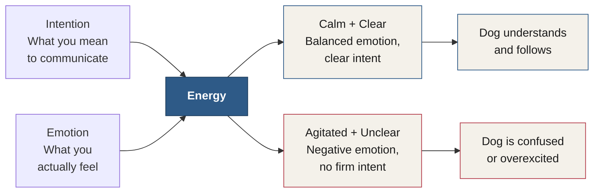

# Chapter 18 — Leadership

> *"Humans are the only animals on the earth that will follow an unstable leader."*

Leadership is the third of the five Authority Behavior Traits laid out in Chapter 15 — Confidence, Discipline, Leadership, Gratitude, and Enjoyment. This time, though, the clearest description of it didn't come from a psychologist, a general, or a Roman emperor. It came from a dog trainer.

---

## The Wisdom of Cesar Millan

This chapter's wisdom is taken from the online blog of **Cesar Millan** — also known as the "Dog Whisperer" on television — and from his book *Be the Pack Leader*.<!-- Citation: Cesar Millan (b. 1969) is a real dog behaviorist and television personality, star of "Dog Whisperer with Cesar Millan" (National Geographic Channel, 2004–2012). "Be the Pack Leader: Use Cesar's Way to Transform Your Dog...and Your Life" (2007, with Melissa Jo Peltier) is a real, published book. The transcript's "Caesar Malone" is corrected throughout to "Cesar Millan" — verified via web search. --> I think he unintentionally wrote a perfect description of what it means to be a leader — not just of dogs, but of other humans as well. Here's how Cesar explains himself.

### Rules, Boundaries, and Limitations

A dog's mother begins training her puppies from birth. She makes them wait for food. She controls when they play. She determines how far they can travel. Adult dogs need these same rules, boundaries, and limitations from you — their pack leader — during dog training.

::: definition
**Rules, Boundaries, and Limitations** — the structure a pack leader provides. A mother enforces them for her puppies from birth; a human pack leader enforces them for an adult dog throughout its life.
:::

**Calm, Assertive.**<!-- ASR? verify: transcribed as "I'm assertive. Bank leader doesn't project emotional or nervous energy" — reconstructed as a "Calm, Assertive" lead-in followed by "The pack leader doesn't project emotional or nervous energy," matching the chapter's established term "calm, assertive energy"; exact original wording could not be recovered --> The pack leader doesn't project emotional or nervous energy — so neither should you. In the wild, the pack leader uses calm, assertive energy to influence how the dog interacts with its surroundings. The mother enforces these laws in a quiet way, such as picking up a puppy by the scruff of its neck if it strays outside the den.

### Setting Boundaries

Ownership of territory is very important. Dogs in the wild claim space by first asserting themselves in a calm and confident way, and then communicating this ownership through clear body language and eye contact. A dog who understands that you, as the pack leader, own the space in which it lives will respect your asserted authority during dog training.

### Right Timing

Enforcing waiting is another way that pack leaders assert their position. Puppies wait to eat;<!-- ASR? verify: transcribed as "But these weights to eat" — reconstructed as "Puppies wait to eat" to parallel the earlier example of the mother making puppies wait for food; exact original wording could not be recovered --> adult dogs wait until the pack leader indicates that it's time to travel. Waiting is a form of psychological work for the dog. Domestication means that dogs don't need to hunt for food — but they can still work for it.

### Active Leadership

Establish your position as pack leader by asking your dog to work. Take your dog on a walk before you feed him. And just as you don't give affection unless your dog is in a calm, submissive state, don't give food until your dog acts calm and submissive. Exercise will help the dog — especially a high-energy one — achieve this state.

### Know Your Pack

The true test of leadership is knowing your pack. I want to know my pack, and what fulfills them — this creates balance. Formulating a training plan, setting an intention, and following through creates even more strength in your relationship, and its depth. To me, this shows respect for the needs of your dog, and of yourself. This is what distinguishes the true pack leader from the rest.

::: callout
**What distinguishes a true pack leader.** They are honest. They are real. They are accepting. They're in touch. They are present. They are respectful. They are balanced. And they know their pack.
:::

In all these ways, I think, the pack leader in nature sets rules, boundaries, and limitations — and in doing so, nurtures the dog's healthy state of mind.

---

## Energy

Because humans are intellectual beings, we communicate mostly through words. This makes it easy for us to fall into the trap of assuming dogs also communicate with spoken language.

While it may seem like our dogs understand specific words and associate them with specific actions, they're mostly responding to the *intent* we've attached to the word. If you tell your dog to sit without intention behind it, your dog won't sit. Conversely, you can approach your dog with the intent to get her to sit and say the word "lamp" — or nothing at all — and she will sit.

### Dogs Read Energy, Not Words

Dogs pay less attention to our words, because they're actually focusing on our energy, which is expressed through our intention and our emotions. Our emotions, in turn, are expressed through our tone of voice and body language. This is how dogs communicate with each other,<!-- ASR? verify: transcribed as "Midge is how dogs communicate with each other" — reconstructed as "This is how dogs communicate with each other"; exact original wording could not be recovered --> and you can see it in any dog park. A dog will indicate submission by lowering parts of its body, particularly its head and ears. A dog will show dominance by raising its head, ears, or tail, and will show aggression by pinning its ears back and stiffening its body.

### The Energy Formula

The word **energy** can sometimes be confusing. What exactly is energy? Cesar explains it this way: energy is how any being presents itself to the world. Think of it as your personality, disposition, temperament — or whatever word makes sense to you. For humans, energy is what we get when our intentions meet our emotions. Cesar expresses it as a formula:

::: definition
**Intention × Emotion = Energy**<!-- Citation: "Intention × Emotion = Energy" is Cesar Millan's own stated formula — confirmed via web search, including his public social-media posts using this exact phrasing. -->
:::

This formula explains why calm, assertive energy works so well with dogs. We are calm and assertive; our emotions are balanced, and our intent is clear. Dogs understand this.

On the other hand, negative emotions and a lack of firm intent present weak energy, and confuse our dogs. This is why you can't stop a barking dog by yelling angrily — the dog doesn't hear you commanding it. Instead, it hears you joining in the barking, increasing its excitement.<!-- ASR? verify: transcribed as "Dog doesn't hear you commanding it. No. And instead, here's you joining in the bargain. Increasing his excitement." — reconstructed as above; exact original wording could not be recovered --> That's also why baby talk confuses dogs — they read it as submissive, weak energy. Depending on their natural position in the pack, they may become anxious, or very dominant, in response.

Dogs follow balanced energy because it's what their instincts tell them to do. It's up to us to provide that calm balance (see Figure 18.1).

*Figure 18.1 — The energy formula. Intention and emotion combine into energy whether you mean them to or not. Calm and clear produces a dog that understands and follows; agitated and unclear produces a dog that's confused or overexcited.*

---

## The Keys to Mastering the Natural Dog Laws

Learning what the laws are is one thing. Learning how to use them to help your dog is another. Here are the keys to mastering them.<!-- ASR? verify: transcribed as "Lower the keys to mastering them" — reconstructed as "Here are the keys to mastering them"; exact original wording could not be recovered -->

### Dogs Are Instinctual

Dogs are creatures of instinct who live in the present moment. They don't dwell on the past or worry about the future — they react instinctively to whatever is happening around them. Therefore, it's crucial to correct them only when they misbehave, and avoid rewarding unwanted behaviors with attention or affection. To truly respect your dog's nature, it's essential to let them be a dog, and resist the temptation to treat them like a human child. By observing and learning from your dog's behavior, you can also tap into your own instincts and learn to live in the moment.

### To Dogs, Energy Is Everything

Energy is the primary way dogs communicate with each other, while humans rely mainly on language. Although dogs can comprehend words associated with particular objects or actions, they're more attuned to our energy and tone of voice. Energy is conveyed through our intention and body language, and dogs respond best to calm, assertive energy. When our energy is balanced and our intentions are clear, dogs can understand us easily. But if our intentions are unclear, or we become agitated, our message becomes muddled, and our dogs may respond inappropriately.

Project a serious, calm, and assertive energy when communicating with your dog, and you establish clear communication and build a strong bond. Your energy speaks louder than words — it's up to you to ensure that it's always balanced and clear.

### Dogs Are Animals First

A dog sees itself as an animal, first and foremost. This is because all animals, including dogs, are instinctual and communicate primarily through energy. Of course, dogs don't have words for it.<!-- ASR? verify: transcribed as "Old dogs don't have words for it" — reconstructed as "Of course, dogs don't have words for it"; exact original wording could not be recovered --> They view themselves as a particular species of animal — distinct from, say, a squirrel or a cat, but the same as other dogs. Dogs don't have a concept of *breed*, and instead exhibit breed traits through their instinctual behavior: huskies pull, and terriers hunt. To a dog, its name is simply a word used to get its attention — the dog will never think, *"I am \[name\],"* the way humans do.

To truly master the art of dog training, it's vital to let your dog be a dog. You must communicate with it like another animal would — not like a human.

::: warning
**Never correct using the name.** It's crucial never to use your dog's name when giving a correction — doing so creates a negative association with that word in your dog's mind.
:::

Remember, a dog is an animal, first and foremost. Understanding and respecting its instinctual nature, you'll be able to communicate with it more effectively and build a stronger bond.

### The Dog's Senses Form His Reality

Dogs experience the world through their senses in a specific order: nose, eyes, and ears.<!-- Citation: "Nose, eyes, ears" is Cesar Millan's own established framework, published as "Principle 6 for Achieving Balance" on cesarsway.com. Verified via web search; transcript's "in a specific order. knows, eyes, and ears" corrected accordingly. --> The sense of smell is so acute that long before we can see or hear something, dogs have already detected it with their noses. A dog's sense of smell is tens of thousands of times more sensitive than a human's, making it their most powerful tool for sensing their surroundings.

Engaging a dog's sense of smell can be an incredibly effective training technique. By using scent to guide their attention, you can direct your dog's focus to where you want it — through treats or pleasant scents. Conversely, unpleasant scents that are undetectable to humans can be used to establish invisible boundaries. Understanding and utilizing a dog's sense of smell is vital for effective training and communication, helping you establish boundaries, guide its attention, and build a stronger bond with your companion.

### Dogs Are Social Pack Animals

From a psychological and behavioral perspective, dogs function best when they have a clear pack leader and hierarchy. The concept of pack hierarchy is deeply ingrained in dogs, due to their evolutionary history as pack animals — in a pack, each member has a specific role and rank, which helps maintain order and prevent conflict.

Without clear leadership, dogs may become anxious, confused, or even aggressive. In the absence of a strong leader, dogs may try to assert their own dominance, leading to power struggles and conflict within the pack. As a responsible dog owner, it's crucial to establish yourself as the pack leader, and provide your dog with clear guidance and direction. This creates a sense of stability and security, because the dog knows what's expected of it and what its role is within the pack. When dogs feel secure and confident in their place in the pack, they're happier and more relaxed.

By taking on the role of pack leader, you establish a harmonious relationship with your dog, and ensure that it feels safe, secure, and happy in its environment.

| # | Law | What it means |
|---|---|---|
| 1 | Dogs are instinctual | They live in the present and react to what's happening now — correct only in the moment of misbehavior. |
| 2 | To dogs, energy is everything | Energy, not language, is the primary channel of communication. |
| 3 | Dogs are animals first | Before breed, before name, a dog is an animal — never use its name during a correction. |
| 4 | Their senses form their reality | Dogs experience the world in a fixed order: nose, eyes, ears. |
| 5 | Dogs are social pack animals | They need a clear leader and hierarchy, or they become anxious, confused, or aggressive. |

*Table 18.1 — The five natural dog laws, as Cesar Millan describes them.*

Adhering to these natural dog laws, you're providing the leadership your dog needs — especially by maintaining calm, assertive energy, and letting your dog be a dog.

---

## Unassertive Energy

One thing Cesar said seriously impacted my personal development as a leader: that humans are the only animals on the earth that will follow an unstable leader.<!-- Citation: close paraphrase of Cesar Millan's widely documented statement, e.g. "Humans are the only species on earth that will follow a totally unbalanced, unstable leader." Verified via web search. --> I was stunned.<!-- ASR? verify: transcribed as "I had this, I was stunned" — the fragment "I had this," was dropped as a false start; "I was stunned" retained as the completed thought --> Cesar had just revealed the key element of leadership — not just for humans, but for all mammals — and he did it in a way that didn't even talk about language.

Most leadership books, even the bestsellers, like the books by John C. Maxwell,<!-- Citation: John C. Maxwell is a real, prolific leadership author (e.g. "The 21 Irrefutable Laws of Leadership," "Developing the Leader Within You"). Verified via web search. --> aren't about leadership at all. They're well written. They're guides to effective management. Not leadership.

If Cesar is right — and I spent twenty-three years proving it — then **stability is the core of leadership**. This is why composure is so powerful when it's paired with genuine confidence, and the other authority traits.

::: callout
**Stability is the core of leadership.** Not charisma. Not volume. Not even language. A pack leader — human or otherwise — earns followership by being the stable, calm-assertive point the pack can orient around.
:::

---

## Key Takeaways

- **Leadership is the third of the five Authority Behavior Traits** from Chapter 15 — and its clearest description came from a dog trainer: Cesar Millan, the "Dog Whisperer," in his blog and his book *Be the Pack Leader*.
- **Rules, boundaries, and limitations** are what a pack leader provides — the same structure a mother enforces for her puppies from birth, and what an adult dog still needs from you.
- **Calm, assertive energy** means the pack leader never projects emotional or nervous energy. Ownership of territory, clear body language, and eye contact all communicate calm, confident authority.
- **Right timing and active leadership**: pack leaders enforce waiting — for food, for travel — and require work before reward: a walk before a meal, no affection or food until the dog is calm and submissive.
- **Know your pack.** The true test of leadership is knowing what fulfills the pack you lead, then formulating a plan, setting an intention, and following through. True pack leaders are honest, real, accepting, in touch, present, respectful, and balanced — and they know their pack.
- **Dogs read energy, not words.** Intent, not vocabulary, drives behavior — a dog will sit for a nonsense word said with the right intention, and won't sit for "sit" said without it.
- **Energy = Intention × Emotion**, in Cesar's own formula. Calm and clear energy produces a dog that understands and follows; agitated, unclear energy — yelling at a barking dog, baby talk — produces a dog that's confused, anxious, or overexcited.
- **The five natural dog laws**: dogs are instinctual; to dogs, energy is everything; dogs are animals first; their senses form their reality (nose, eyes, ears); and dogs are social pack animals who need a clear leader.
- **Humans are the only animals that will follow an unstable leader.** Most leadership books — even Maxwell's — are really guides to management, not leadership. Stability, not charisma, is the core of leadership, and it's most powerful paired with genuine confidence and the other authority traits.

<!--
## Change Log

| Original (transcript) | Corrected | Reason |
|---|---|---|
| "Caesar" (throughout) | "Cesar" | ASR mishearing of the real name of Cesar Millan, the "Dog Whisperer"; verified via web search. |
| "Caesar Malone" | "Cesar Millan" | ASR mishearing of the real surname; verified via web search. |
| "This action has been taken from the online blog" | "This chapter's wisdom is taken from the online blog" | ASR mishearing ("action" for a word like "section"); reworded to fit as the chapter's own lead-in. |
| "what it means to be a human leader. to not just dogs, but other humans as well" | "what it means to be a leader — not just of dogs, but of other humans as well" | Grammar repair of a garbled sentence boundary. |
| "Adult dogs need these same rules, boundaries and limitations from you. that pack leader when dog training." | "Adult dogs need these same rules, boundaries, and limitations from you — their pack leader — during dog training." | Grammar repair; "that" → "their" and sentence boundary reconstructed. |
| "I'm assertive. Bank leader doesn't project emotional or nervous energy." | "**Calm, Assertive.** The pack leader doesn't project emotional or nervous energy" | ASR mishearing reconstructed as a heading + sentence, matching the chapter's established term "calm, assertive energy"; flagged inline as uncertain. |
| "the parent leader uses calm assertive energy" | "the pack leader uses calm, assertive energy" | ASR mishearing ("parent" → "pack"), consistent with the passage's subject throughout. |
| "his surroundings" (of the dog) | "its surroundings" | Grammar consistency (the dog as "it," not "he"), matching pronoun usage elsewhere in the chapter. |
| "eye content" (throughout) | "eye contact" | ASR mishearing ("content" → "contact"), consistent with the same correction in Chapters 15 and 16. |
| "will respect your asserted authority while dog training" | "will respect your asserted authority during dog training" | Minor grammar smoothing. |
| "But these weights to eat." | "Puppies wait to eat;" | ASR mishearing reconstructed to parallel the earlier "mother makes them wait for food" example; flagged inline as uncertain. |
| "An adult dogs wait until" | "adult dogs wait until" | Grammar repair (article/number agreement). |
| "Act leadership." | "Active Leadership" | ASR mishearing/truncation, reconstructed as the section heading. |
| "And just as you don't give affection, unless your dog is in a calm, submissive state, then give food until your dog acts calm and submissive." | "And just as you don't give affection unless your dog is in a calm, submissive state, don't give food until your dog acts calm and submissive." | Grammar repair of a garbled conditional sentence. |
| "especially a high energy one" | "especially a high-energy one" | Hyphenation for readability. |
| "Know your pang." | "Know Your Pack" | ASR mishearing ("pang" → "pack"), reconstructed as the section heading. |
| "True test of leadership is knowing your pack." | "The true test of leadership is knowing your pack." | Grammar repair (missing article). |
| "Formulating a training plan, setting an intention, and following through then creates even more strength in your relationship bond. And its depth." | "Formulating a training plan, setting an intention, and following through creates even more strength in your relationship, and its depth." | Grammar repair of a garbled sentence boundary. |
| "To me, this shows respect. With the needs of your dog and yourself." | "To me, this shows respect for the needs of your dog, and of yourself." | Grammar repair of a garbled sentence boundary. |
| "They accept." | "They are accepting." | Grammar repair for parallelism with the surrounding list ("They are honest," "They are real," etc.). |
| "the pant leader in nature sets rules, boundaries, and limitations, I think. And in doing so, nurtures their dogs' healthy state of mind." | "the pack leader in nature sets rules, boundaries, and limitations — and in doing so, nurtures the dog's healthy state of mind, I think." | ASR mishearing ("pant" → "pack"); "I think" repositioned to preserve Charles's editorial hedge (echoing his own "I think" in the chapter's opening line) while repairing the sentence's grammar. |
| "assuming the dogs also communicate with spoken language" | "assuming dogs also communicate with spoken language" | Grammar repair (dropped extraneous article). |
| "Well, it may seem like our dogs understand specific words and associate them with specific actions, they're mostly responding to the intent" | "While it may seem like our dogs understand specific words and associate them with specific actions, they're mostly responding to the intent" | ASR mishearing ("Well" → "While"), restoring the intended contrast. |
| "your dog won't set it" | "your dog won't sit" | ASR homophone error ("set" → "sit"). |
| "Versly" | "Conversely" | ASR mishearing/truncation. |
| "Dogs pay less attention to our words, because they are actually focusing on our energy. Express through our intention and emotions." | "Dogs pay less attention to our words, because they're actually focusing on our energy, which is expressed through our intention and our emotions." | Grammar repair of a garbled sentence fragment. |
| "Midge is how dogs communicate with each other." | "This is how dogs communicate with each other." | ASR mishearing, reconstructed; flagged inline as uncertain. |
| "dog will indicate submission by lowering parts of his body, particularly as head and ears" | "A dog will indicate submission by lowering parts of its body, particularly its head and ears" | Grammar repair ("as" → "its"; added article "A"). |
| "Word energy can sometimes be confusing." | "The word **energy** can sometimes be confusing." | Grammar repair (missing article; term set off for clarity). |
| "Think for it as your personality" | "Think of it as your personality" | ASR mishearing ("for" → "of"). |
| "Humans, energy is what we get when our intentions meet our emotions." | "For humans, energy is what we get when our intentions meet our emotions." | Grammar repair (missing "For"). |
| "Caesar expresses it as a formula. Intention, times emotion, equals energy." | "Cesar expresses it as a formula: **Intention × Emotion = Energy**" | Formatted as the equation Cesar states; verified via web search as his own established formula. |
| "negative emotions and lack of firm intent presents weak energy" | "negative emotions and a lack of firm intent present weak energy" | Grammar repair (subject-verb agreement; missing article). |
| "Dog doesn't hear you commanding it. No. And instead, here's you joining in the bargain. Increasing his excitement." | "the dog doesn't hear you commanding it. Instead, it hears you joining in the barking, increasing its excitement." | ASR mishearing ("here's" → "hears," "bargain" → "barking") reconstructed; flagged inline as uncertain. |
| "It's up to us to provide that calm, sort of balance." | "It's up to us to provide that calm balance." | Dropped filler ("sort of"). |
| "Lower the keys to mastering them." | "Here are the keys to mastering them." | ASR mishearing, reconstructed; flagged inline as uncertain. |
| "Dogs or beaches of instinct who live in the present moment." | "Dogs are creatures of instinct who live in the present moment." | ASR mishearing ("or beaches" → "are creatures"). |
| "avoid rewarding, unwonted behaviors" | "avoid rewarding unwanted behaviors" | ASR homophone error ("unwonted" → "unwanted"). |
| "docs respond best to calm assertive energy" | "dogs respond best to calm, assertive energy" | ASR typo/mishearing ("docs" → "dogs"). |
| "we established clear communication" | "you establish clear communication" | Tense/person consistency with the surrounding imperative sentence. |
| "Old dogs don't have words for it." | "Of course, dogs don't have words for it." | ASR mishearing, reconstructed; flagged inline as uncertain. |
| "Dogs don't have a concept of greed and instead exhibit breed traits" | "Dogs don't have a concept of *breed*, and instead exhibit breed traits" | ASR mishearing ("greed" → "breed"), confirmed by the following sentence about breed-specific instinctual behavior (huskies pull, terriers hunt). |
| "The dog will never think. I am name. As humans do." | "the dog will never think, \"I am \[name\],\" the way humans do" | Formatting repair of a garbled internal-thought quotation. |
| "To truly master the art of dog training, is vital to let your dog be a dog." | "To truly master the art of dog training, it's vital to let your dog be a dog." | Grammar repair (missing "it's"). |
| "Furthermore, is crucial never to use your dog's name when giving a correction." | Rendered as a warning callout: "It's crucial never to use your dog's name when giving a correction" | Grammar repair (missing "it's"); set off as a callout per the style guide's use of warning boxes for cautionary instructions. |
| "a dog is an animal, 1st and foremost" | "a dog is an animal, first and foremost" | Formatting repair of a numeral artifact, consistent with the same fix in Chapter 16. |
| "in a specific order. knows, eyes, and ears." | "in a specific order: nose, eyes, and ears." | ASR mishearing ("knows" → "nose"); verified via web search as Cesar Millan's own "Principle 6 for Achieving Balance." |
| "Dog sense of smell is 10s of 1000s of times more sensitive than a human's" | "A dog's sense of smell is tens of thousands of times more sensitive than a human's" | Grammar and numeral-formatting repair. |
| "treats or pleasant sense" / "unpleasant sense that are undetectable" | "treats or pleasant scents" / "unpleasant scents that are undetectable" | ASR homophone error ("sense" → "scents"). |
| "understanding and utilizing a dog sense of smell" | "understanding and utilizing a dog's sense of smell" | Grammar repair (missing possessive). |
| "With psychological and behavioral perspective" | "From a psychological and behavioral perspective" | ASR mishearing ("With" → "From a"). |
| "conflict amongst dogs" | "conflict within the pack" | Minor smoothing for clarity; no change in meaning. |
| "By taking on the role of pet leader" | "By taking on the role of pack leader" | ASR mishearing ("pet" → "pack"), consistent with the passage's subject throughout. |
| "Adhering to the natural dog laws" | "Adhering to these natural dog laws" | Minor grammar smoothing; phrase retained and used as the section heading, since it names the five-law list Charles just walked through. |
| "One thing Caesar said that seriously impacted my personal development as a leader. Was that humans are the only animals..." | "One thing Cesar said seriously impacted my personal development as a leader: that humans are the only animals..." | Grammar repair of a garbled sentence boundary. |
| "I had this, I was stunned." | "I was stunned." | Dropped an unresolved false start ("I had this,"); flagged inline. |
| "Caesar just revealed the key element of leadership for not just humans. But for all mammals, and he did it in a way that didn't talk about language." | "Cesar had just revealed the key element of leadership — not just for humans, but for all mammals — and he did it in a way that didn't even talk about language." | Grammar repair of a garbled sentence boundary. |
| "Their guides to effective management." | "They're guides to effective management." | ASR homophone error ("Their" → "They're"). |
| "I spent 23 years proving it" | "I spent twenty-three years proving it" | Number spelled out for consistency with house style (Chapters 15 and 17 spell out years of experience in prose). |
-->
