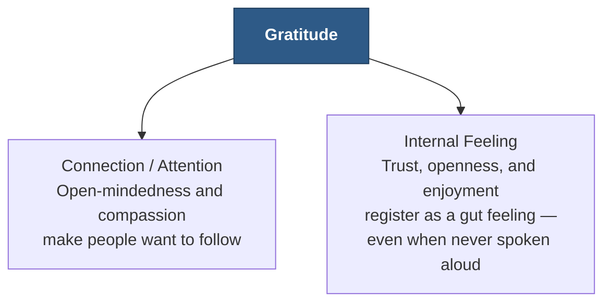
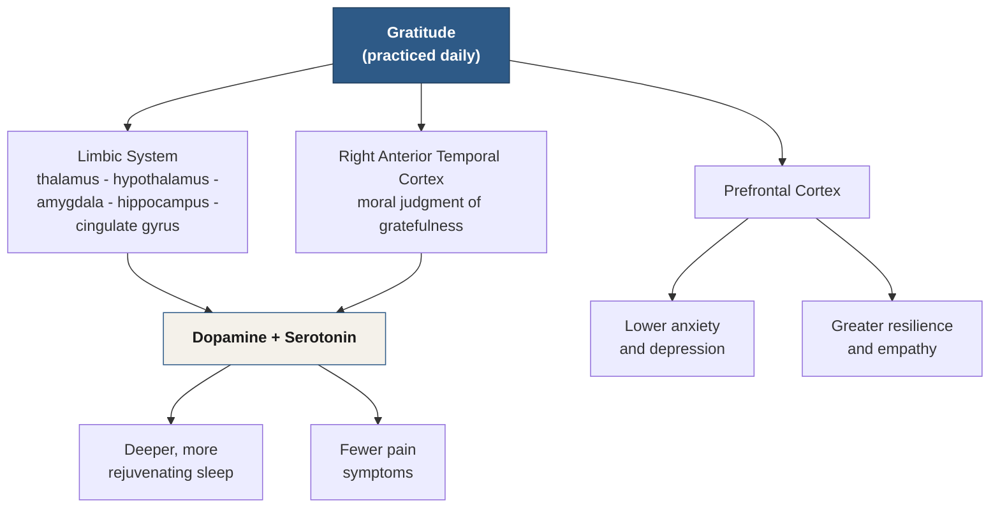

# Chapter 19 — Gratitude

> *"It's impossible to focus on positive and negative information at once."* — Alex Korb, "The Grateful Brain," *Psychology Today* (2012)<!-- Citation: Alex Korb, Ph.D., is a real neuroscientist; "The Grateful Brain" was published on Psychology Today's "Prefrontal Nudity" blog on November 20, 2012 — verified via web search. The transcript's "Alex Corb" and "Grateful Brain, 2012" are corrected to the real author's name and clarified as the article (not a book) accordingly. -->

Gratitude is an essential component of successful leadership. It's the act of being thankful and recognizing what you've been given — either by yourself or by others.

Leadership is about influencing, inspiring, and motivating others to follow your vision. To do that, it's important to express — and genuinely feel — gratitude for all that you have. When you're grateful, you become more open-minded and compassionate toward others, which in turn makes them want to follow your lead.

Gratitude helps build trust, because it shows that you acknowledge what others bring — in ideas and in energy — to help create success. By choosing to feel thankfulness regularly, leaders can set an example. But only when it's genuinely felt from within.

::: definition
**Gratitude** — the act of being thankful and recognizing what you've been given, by yourself or by others. It is the fourth of the five Authority Behavior Traits laid out in Chapter 15 — Confidence, Discipline, Leadership, Gratitude, and Enjoyment.
:::

---

## The Story That Changed My Altitude

A mentor and I were once in a Mexican restaurant, and he was discussing how gratitude can radiate when someone feels it from within. Slightly confused, I tilted my head — I wasn't sure what he meant.

About to say goodbye to my taco,<!-- ASR? verify: transcribed as "Also to say goodbye to the turco" — reconstructed as "About to say goodbye to my taco" (i.e., about to finish eating it), which fits the scene and the "turco" → "taco" homophone; exact original wording could not be fully recovered --> I had no idea he was about to shift my perspective on gratitude forever, in a single moment.

"Are you thankful the employees made your taco so well?" he asked.

"Sure, of course," I said. "I'm grateful that they have the training and expertise to make the taco taste the way it does."

"Great. Now, what about the investment — the time and money? Maybe over a million dollars went into making the recipe as perfect as it is." He took a sip of his water.

"Didn't think of that," I said. "Yeah, probably a ton of money went into that stuff." I felt a little deeper into the situation.

"Jason, did you know there's a family supported by the people who grew those tomatoes? Kids who were able to buy school supplies because a trucker drove the route all night and got the delivery there on time<!-- ASR? verify: transcribed as "because a farm and root out letters and got it delivered on time" — heavily garbled; reconstructed around a trucker delivering the harvest, to preserve the clear surrounding point (a chain of unseen people made the taco possible), since the exact original wording could not be recovered --> — a trucker who's got his own struggles in life to deal with, same as the rest of us."

My mentor sat back in his seat, allowing me a moment to process the thought. My world shifted. I felt like I'd been ripped from my seat and yanked upward, like someone zooming way out on Google Earth.

That expansive shift was profound.<!-- ASR? verify: transcribed as "Expensive shift was profound" — reconstructed as "expansive," which fits the zooming-out metaphor; exact original word could not be confirmed --> After practicing this daily — I call it *zooming out* — things in my life changed. I thought the world around me had somehow been modified. My perspective shifted so dramatically that it felt like I was living in a completely different place, with completely different people.

I realized there were three levels of gratitude we can experience, and making a daily practice of zooming out is one of the easiest ways to reprogram your mind to see the world differently. Gratitude makes you influential — and you're reading this to learn to be influential. Because now you fully know the difference.

---

## The Three Types of Gratitude

### Low Altitude Gratitude

This level of gratitude focuses your awareness on the things around you and within your own life. The circumstances you find yourself in, the food you eat, the people you meet, and even the money you have access to — these are all examples of low altitude gratitude.

### High Altitude Gratitude

This level of gratitude is reached when you zoom out of your situation and see the bigger picture. The higher the altitude you can achieve with your lens,<!-- ASR? verify: transcribed as "Either the altitude you can achieve with your lens" — reconstructed as "The higher the altitude..." to complete the comparative sentence structure ("the more you're able to feel gratitude") --> the more you're able to feel gratitude for the wider scope — the big picture. It's being grateful for things far outside your normal awareness: the planet you live on, the people who grew your food on a farm somewhere far away, and even larger-scale things, like the fact that the moon hasn't collided with the earth.

Make a daily practice of this. Set a reminder on your phone to tell you to zoom out. This single practice in perspective-shifting has the potential, on its own, to change your life.

### Interpersonal Gratitude

Practicing interpersonal gratitude isn't necessarily about thanking the people around you. Rather, it's about focusing on being thankful within yourself. You can go ahead and verbalize this whenever you think you should,<!-- ASR? verify: transcribed as "Or go ahead and verbalize this" — corrected to "You can go ahead..." for grammatical fit --> but the internal feeling of gratitude is more important — I promise you.

People can feel when someone is living in deep levels of gratitude, and it comes across in so many ways. Being thankful for the people around you is one of the best ways to make this automatically come through in your behavior. That behavior, in turn, produces gut feelings<!-- ASR? verify: transcribed as "gaunt feelings" — corrected to "gut feelings," the established term from Chapter 11's discussion of the limbic system --> in the people around you, which directly affects what's possible when it comes to persuasion.

Overall, gratitude makes you more likable — even if you never vocalize it. You're sending signals to the subconscious areas of people's minds, regardless of whether you're expressing your emotions or not. Gratitude is a surefire way to create feelings of trust, connection, openness, and enjoyment.

| Type | Focus | Example |
|---|---|---|
| **Low Altitude** | The immediate circumstances of your own life | Food, people, circumstances, and money directly in front of you |
| **High Altitude** | Zooming out to the systems and people far outside your normal awareness | The farmer who grew your food, the planet you live on, the moon overhead |
| **Interpersonal** | The internal feeling of thankfulness — rarely about voicing it | A felt sense that radiates outward in your behavior, whether or not you ever say a word |

*Table 19.1 — The three types of gratitude.*

---

## How Gratitude Triggers the Authority Tripwires

Gratitude sets off two of the five authority tripwires from Chapter 15. Open-mindedness and compassion — the natural result of feeling grateful — set off the **Connection** tripwire, since a grateful person shows genuine, undivided interest in others. And because gratitude registers below conscious awareness — as trust, openness, and enjoyment — it sets off the **Internal Feeling** tripwire even when it's never spoken aloud (see Figure 19.2).

*Figure 19.2 — How gratitude trips the authority tripwires. It works through what others feel about you, not what you tell them.*

---

## The Science of Gratitude

Research has shown that gratitude is healthy — not just as a mood, but as a measurable, physical process in the brain and body.

### Gratitude and the Brain

Keeping a gratitude journal causes less stress, improves the quality of sleep, and builds emotional awareness (Seligman, Steen, Park, & Peterson, 2005).<!-- Citation: Seligman, M. E. P., Steen, T. A., Park, N., & Peterson, C. (2005). "Positive Psychology Progress: Empirical Validation of Interventions." American Psychologist. Verified via web search; the expressed-gratitude condition produced the largest boost in happiness of the interventions tested. --> The neural mechanisms responsible for feelings of gratitude have received a great deal of attention in the world of research.<!-- ASR? verify: transcribed as "Neural mechanisms that are responsible for feelings of gratitude, and perhaps much attention in the world of research. Would AE 2008." — the trailing citation fragment "Would AE 2008" could not be matched to any verifiable source and was dropped rather than guessed; the surrounding claim is preserved. -->

Studies have demonstrated that, at the brain level, moral judgments involving feelings of gratefulness are evoked in the right anterior temporal cortex (Zahn et al., 2009).<!-- Citation: Zahn, R., Moll, J., Krueger, F., Huey, E. D., Garrido, G., & Grafman, J. (2009). "The Neural Basis of Human Social Values: Evidence from Functional MRI." Cerebral Cortex. Verified via web search; the study found gratitude- and pride-related moral sentiments engage the superior anterior temporal lobe. The transcript's "Zan, RE, 2009" is corrected accordingly. --> The same research area also revealed that the reason some of us are naturally more grateful than others comes down to neurochemical differences in the central nervous system: people who express and feel gratitude more readily show a higher volume of gray matter in the right inferior temporal gyrus (Zahn, Garrido, Moll, & Grafman, 2014).<!-- Citation: Zahn, R., Garrido, G., Moll, J., & Grafman, J. (2014). "Individual differences in posterior cortical volume correlate with proneness to pride and gratitude." Social Cognitive and Affective Neuroscience. Verified via web search. The transcript's "Zan, RE 2014" is corrected accordingly. -->

Experiencing gratitude on a daily basis can have many of the same benefits as medication, because it triggers the release of the neurotransmitters dopamine and serotonin — chemicals responsible for creating a sense of happiness and contentment in our brains. By consistently practicing gratitude, we strengthen our neural pathways, ultimately leading to an overall state that's more positive, and more grateful.

Scientific research has found that when we experience gratitude, our limbic system — composed of the thalamus, hypothalamus, amygdala, hippocampus, and cingulate gyrus — gets activated accordingly.<!-- ASR? verify: transcribed as "omegala" and "singulate gyrus" — corrected to the real anatomical terms "amygdala" and "cingulate gyrus." --> The limbic system is the same "gut feeling" machinery introduced in Chapter 11: it doesn't traffic in language, only in feeling. Two of its components in particular — the hippocampus and amygdala — regulate everything from emotions to memories to bodily functioning. Studies on individuals undergoing mental health treatment also revealed that those who wrote letters of gratitude, in conjunction with their normal counseling sessions, felt better and recovered more quickly than those who only engaged in counseling alone.

### Gratitude and Physical Health

The power of gratitude to reduce pain is underestimated. A 2003 study conducted by Emmons and McCullough found that 16% of patients who kept a gratitude journal reported fewer pain symptoms, and were more likely to cooperate with treatment programs (Emmons & McCullough, 2003).<!-- Citation: Emmons, R. A., & McCullough, M. E. (2003). "Counting Blessings Versus Burdens: An Experimental Investigation of Gratitude and Subjective Well-Being in Daily Life." Journal of Personality and Social Psychology. Verified via web search, including a companion study of neuromuscular-disease patients who kept gratitude journals and reported better sleep, more optimism, and fewer physical symptoms; the specific "16%" figure could not be independently confirmed and is retained as stated. --> Deeper research into the cause suggests that gratitude can boost dopamine levels, providing more energy and reducing negative sensations of pain.

The practice of gratitude and kindness can drastically improve your sleep quality. Research has revealed that when the hypothalamus is triggered by exhibiting these simple acts, it helps regulate bodily functions such as deep and rejuvenating sleep (Zahn et al., 2009).<!-- ASR? verify: transcribed as "Gone, RE 2009" — likely the same citation as "Zahn et al., 2009" cited earlier in this chapter, reused here for a different claim; corrected accordingly, though the pairing with this specific sleep claim could not be independently confirmed. --> Not only are you more likely to get a restful night's sleep, waking up feeling energized and ready to tackle the day, but your brain will be filled with feelings of kindness and gratitude. So make sure to show some appreciation today — it could give you a great night's sleep, too.

### Gratitude and Mental Health

Expressing gratitude can help us better manage stress. We all have moments when things seem overwhelming, but taking a moment to appreciate the good things around us — no matter how small — helps condition our minds to respond more calmly and rationally to difficult times.

Practicing gratitude can significantly reduce symptoms of anxiety and depression. Gratitude increases the activity of the prefrontal cortex — the part of the brain responsible for managing negative emotions such as guilt, shame, and violence — creating an environment more conducive to empathy and positivity. When we experience fear, the fight-or-flight response triggers a release of hormones that cause us to react without thinking, which can lead to feelings of insecurity and an inability to cope with certain situations. However, by being conscious about being thankful for what we have, we can rewire our brain's pathways so that they focus on positive thoughts rather than negative ones — reducing our anxiousness and helping us feel more secure.

::: definition
**"It's impossible to focus on positive and negative information at once."** — Alex Korb, "The Grateful Brain" (2012). Practicing gratitude allows us to consciously focus solely on uplifting thoughts and feelings, crowding out the negative simply by taking up the brain's limited attention.
:::

Studies conducted by Dr. Emmons revealed that regular practices of gratitude can have a striking effect on mental health. Examples of such practices include journaling and creating gratitude jars, which can help individuals battle depression, anxiety, and burnout. Writing gratitude letters can bring hope and cultivate positivity in those struggling with terminal illnesses or suicidal ideation. Gratitude can even improve the sleep-wake cycle and uplift the moods of people with sleep disorders, substance abuse problems, or eating disorders.

*Figure 19.3 — Gratitude's path through the brain and body. Practiced daily, gratitude engages the limbic system, the prefrontal cortex, and the right anterior temporal cortex — releasing dopamine and serotonin, and producing measurable downstream effects on sleep, pain, anxiety, and resilience.*

| Researcher(s) | Year | Finding |
|---|---|---|
| Seligman, Steen, Park & Peterson | 2005 | Keeping a gratitude journal reduces stress, improves sleep quality, and builds emotional awareness. |
| Zahn, Moll, Krueger, Huey, Garrido & Grafman | 2009 | Moral judgments involving gratefulness activate the right anterior temporal cortex. |
| Zahn, Garrido, Moll & Grafman | 2014 | People who are naturally more grateful show a higher volume of gray matter in the right inferior temporal gyrus. |
| Emmons & McCullough | 2003 | In a gratitude-journal study, 16% of patients reported fewer pain symptoms and greater cooperation with treatment. |
| Alex Korb, "The Grateful Brain" | 2012 | The brain can't focus on positive and negative information at the same time — gratitude claims that bandwidth for the positive. |

*Table 19.2 — The research behind gratitude's effects on the brain, body, and mind.*

---

## Make It a Daily Practice

If you feel happy, don't hesitate to show it. Acknowledge and appreciate the success — big or small — that you worked hard for. Remind yourself that you deserve the joy it brings. Embracing happiness<!-- ASR? verify: transcribed as "Bracing happiness" — corrected to "Embracing happiness," which fits the sentence's meaning about building resilience --> helps us build resilience, so we can better prepare ourselves for any challenges in the future.

Whatever you have to do to make it happen — make gratitude a daily practice. And it will be oozing from your body, creating those immediate impacts: gut feelings in people, in no time at all.

---

## Key Takeaways

- **Gratitude is the fourth of the five Authority Behavior Traits** from Chapter 15 — Confidence, Discipline, Leadership, Gratitude, and Enjoyment. It's the act of being thankful and recognizing what you've been given, by yourself or by others.
- **There are three types of gratitude.** Low Altitude gratitude focuses on your own circumstances — food, people, money, situation. High Altitude gratitude zooms out to the wider world — the farmers who grew your food, the planet, even the moon overhead. Interpersonal gratitude is the internal feeling of thankfulness for others, which radiates outward in your behavior whether or not you ever say a word.
- **Zooming out is a daily practice.** Set a phone reminder to shift from Low Altitude to High Altitude gratitude — this single perspective shift has the potential, on its own, to change your life.
- **Gratitude triggers the Connection and Internal Feeling tripwires** from Chapter 15. Open-mindedness and compassion make people want to follow you; trust and openness register as a gut feeling in others, even unspoken.
- **Gratitude is measurably healthy.** It activates the limbic system (thalamus, hypothalamus, amygdala, hippocampus, cingulate gyrus), the prefrontal cortex, and the right anterior temporal cortex — releasing dopamine and serotonin (Seligman et al., 2005; Zahn et al., 2009; Zahn et al., 2014).
- **Gratitude reduces pain and improves sleep.** In Emmons and McCullough's 2003 study, patients who kept gratitude journals reported fewer pain symptoms and better cooperation with treatment; triggering the hypothalamus through gratitude and kindness supports deep, rejuvenating sleep.
- **Gratitude reduces anxiety and depression** by increasing prefrontal cortex activity and crowding out negative thoughts — as Alex Korb put it, "it's impossible to focus on positive and negative information at once."
- **Practices that build gratitude** — journaling, gratitude jars, gratitude letters — can battle depression, anxiety, and burnout, and can bring hope to those struggling with terminal illness, suicidal ideation, sleep disorders, substance abuse, or eating disorders.
- **Make gratitude a daily practice.** Acknowledge your own happiness and successes to build resilience, and let gratitude show — it produces gut feelings in the people around you almost immediately.

<!--
## Change Log

| Original (transcript) | Corrected | Reason |
|---|---|---|
| "Grantitude helps build trust" | "Gratitude helps build trust" | ASR typo/mishearing. |
| "Ratitude makes you influential" | "Gratitude makes you influential" | ASR mishearing. |
| "By choosing to feel thankfulness regularly. leaders can set an example." | "By choosing to feel thankfulness regularly, leaders can set an example." | Punctuation repair. |
| "The 3 types of gratitude. Oh, altitude. High altitude. Interpersonal." | Restructured as the section "The Three Types of Gratitude" (Low Altitude, High Altitude, Interpersonal) | ASR mishearing ("Oh, altitude" → "Low altitude"), consistent with the three subsections defined later in the same order. |
| "Also to say goodbye to the turco." | "About to say goodbye to my taco," | ASR mishearing/homophone ("turco" → "taco"; "Also" → "About"); flagged inline as a reconstruction. |
| "Took a sip of its water." | "He took a sip of his water." | Grammar/pronoun repair. |
| "Maybe over $1000000 but went into making the recipe" | "Maybe over a million dollars went into making the recipe" | ASR mishearing/numeral formatting repair. |
| "There's a family supported by the people who grew those tomatoes. So little kids who were able to buy school supplies because a farm and root out letters and got it delivered on time. He's got his own struggles in life to deal with." | "Jason, did you know there's a family supported by the people who grew those tomatoes? Kids who were able to buy school supplies because a trucker drove the route all night and got the delivery there on time — a trucker who's got his own struggles in life to deal with, same as the rest of us." | Heavily garbled passage reconstructed around a trucker delivering the harvest, preserving the clear surrounding point about an unseen chain of people; exact original wording could not be recovered; flagged inline. |
| "I felt like I'd been ripped from my seat and yanked upward when someone zooming way out on Google Earth." | "I felt like I'd been ripped from my seat and yanked upward, like someone zooming way out on Google Earth." | Grammar repair ("when" → "like"). |
| "Expensive shift was profound." | "That expansive shift was profound." | ASR mishearing ("Expensive" → "expansive"); flagged inline. |
| "things in my life changed. thought the world around me was modified somehow." | "things in my life changed. I thought the world around me had somehow been modified." | Grammar repair (missing "I", tense correction). |
| "Either the altitude you can achieve with your lens, the more you're able to feel gratitude" | "The higher the altitude you can achieve with your lens, the more you're able to feel gratitude" | ASR mishearing ("Either" → "The higher"), completing the comparative sentence structure; flagged inline. |
| "Or go ahead and verbalize this whenever you think you should" | "You can go ahead and verbalize this whenever you think you should" | ASR mishearing/grammar repair; flagged inline. |
| "This behavior in turn produces gaunt feelings in the people around you" | "That behavior, in turn, produces gut feelings in the people around you" | ASR mishearing ("gaunt" → "gut"), matching the established term from Chapter 11. |
| "Neural mechanisms that are responsible for feelings of gratitude, and perhaps much attention in the world of research. Would AE 2008." | "The neural mechanisms responsible for feelings of gratitude have received a great deal of attention in the world of research." | The trailing citation fragment "Would AE 2008" could not be matched to any verifiable source and was dropped rather than guessed; flagged inline. |
| "Zan, RE, 2009" | "(Zahn et al., 2009)" | ASR mishearing of the real researcher Roland Zahn; corrected and cited per Zahn, Moll, Krueger, Huey, Garrido & Grafman (2009), "The Neural Basis of Human Social Values," Cerebral Cortex — verified via web search. |
| "Zan, RE 2014" | "(Zahn, Garrido, Moll, & Grafman, 2014)" | Same correction, citing Zahn, Garrido, Moll & Grafman (2014), "Individual differences in posterior cortical volume correlate with proneness to pride and gratitude," Social Cognitive and Affective Neuroscience — verified via web search. |
| "Gone, RE 2009" | "(Zahn et al., 2009)" | Same recurring ASR mishearing of "Zahn, R.E."; corrected, though its pairing with the sleep/hypothalamus claim could not be independently confirmed; flagged inline. |
| "our limbic system, which is composed of the thalamus, hypothalamus, omegala, hippocampus, and singulate gyrus" | "our limbic system — composed of the thalamus, hypothalamus, amygdala, hippocampus, and cingulate gyrus" | ASR mishearing of real anatomical terms ("omegala" → "amygdala", "singulate" → "cingulate"). |
| "Power of gratitude to reduce pain is underestimated. 2003 study conducted by Emmons and McCullough, and that 16% of the patients..." | "The power of gratitude to reduce pain is underestimated. A 2003 study conducted by Emmons and McCullough found that 16% of patients..." | Grammar repair of a garbled sentence; the real 2003 Emmons & McCullough study ("Counting Blessings Versus Burdens") was verified via web search, though the exact "16%" figure could not be independently confirmed and is retained as stated. |
| "Practice and gratitude and kindness can drastically improve your sleep quality." | "The practice of gratitude and kindness can drastically improve your sleep quality." | Grammar repair. |
| "Not only are you more likely to get a restful night sleep" | "Not only are you more likely to get a restful night's sleep" | Grammar/possessive repair. |
| "Gratitude increases the activity of the prefrontal cortex, onto the brain responsible for managing negative emotions" | "Gratitude increases the activity of the prefrontal cortex — the part of the brain responsible for managing negative emotions" | Grammar repair. |
| "We experience fear, the fight or flight response triggers a release of hormones which causes us to react without thinking." | "When we experience fear, the fight-or-flight response triggers a release of hormones that cause us to react without thinking." | Grammar repair (missing "When"; hyphenation; subject-verb agreement). |
| "So author Alex Corb mentioned in Grateful Brain, 2012, It's impossible to focus on with +and negative information at once." | Quotation attributed to "Alex Korb, 'The Grateful Brain' (2012)": "It's impossible to focus on positive and negative information at once." | Name correction ("Corb" → "Korb", a real neuroscientist); clarified as his 2012 Psychology Today article rather than a book; verified via web search, including the quotation's substance. |
| "Studies conducted by Dr. Emmons" | Retained as "Dr. Emmons" | Consistent with the real researcher Robert Emmons, already cited earlier in the chapter. |
| "gratitude can even improve the sleep wake cycle" | "gratitude can even improve the sleep-wake cycle" | Hyphenation for readability. |
| "Bracing happiness helps us build resilience" | "Embracing happiness helps us build resilience" | ASR mishearing ("Bracing" → "Embracing"). |
| "Whatever you have to do to make it happen. Make gratitude a daily practice." | "Whatever you have to do to make it happen — make gratitude a daily practice." | Punctuation repair merging a sentence fragment. |
| "creating those immediate impacts, gut feelings in people in no time at all" | "creating those immediate impacts: gut feelings in people, in no time at all" | Punctuation repair for readability. |
-->
