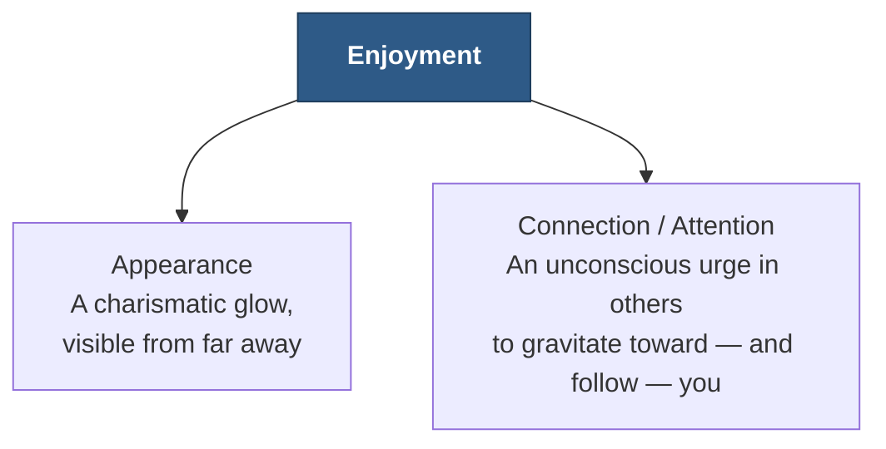

# Chapter 20 — Enjoyment

> *"The secret of happiness, you see, is not found in seeking more, but in developing the capacity to enjoy less."* — Dan Millman, *Way of the Peaceful Warrior* (1980)

The psychological state of enjoyment might be the most magnetic thing that attracts us to other people. Sit with me in an airport, and I'll ask you to point out a total stranger who is enjoying themselves. You'd be able to spot them from hundreds of yards away in a crowded space.

That quality lends itself to a charismatic appearance. People gravitate toward people who are enjoying themselves — a person has an unconscious urge to gravitate toward another, and in turn becomes more easily led by them.

::: definition
**Enjoyment** — a psychological state, independent of external events, in which a person can zoom out to see the bigger picture of life and find enjoyment in almost any activity. It is the fifth of the five Authority Behavior Traits laid out in Chapter 15 — Confidence, Discipline, Leadership, Gratitude, and Enjoyment.
:::

Enjoyment is one of the qualities that makes up the Behavior side of the Authority Triangle (Chapter 7), because it's arguably the most demonstrable social magnet there is.

---

## How Enjoyment Triggers the Authority Tripwires

If we traveled a million years back in time, no one would speak our modern languages. Yet we would still be able to recognize enjoyment, and all the other traits of authority. This is why your training began by studying the factors of nonverbal behavior — and in fact, all of your training should follow the same line of thinking: the further back in time you can effectively use a skill, the more important it is when it comes to influence and persuasion.

Enjoyment's charismatic appearance and its unconscious pull on other people set off two of the five authority tripwires from Chapter 15. The visible glow of a person in enjoyment trips the **Appearance** tripwire, and the unconscious urge it creates in others to gravitate toward that person — and become more easily led by them — trips the **Connection / Attention** tripwire (see Figure 20.1).

*Figure 20.1 — How enjoyment trips the authority tripwires. It works ancestrally — before language, before modern culture — which is exactly why it still works today.*

The more you can live in enjoyment, the more persuasive you will become. Enjoyment attracts others while also boosting your own confidence.

---

## The Daily Practice — A Better Question

You can practice this daily by setting up reminders in your life. Since questions drive what we focus on, continually ask yourself: *"How could I increase my enjoyment right now?"*

Use this question instead of negatively framed questions, such as "Why am I so depressed?" or "Why can't I feel good all the time?"

| Instead of asking... | Ask... |
|---|---|
| "Why am I so depressed?" | "How could I increase my enjoyment right now?" |
| "Why can't I feel good all the time?" | "How could I increase my enjoyment right now?" |

*Table 20.1 — Reframing the question redirects your focus from the deficit to the practice.*

---

## Enjoyment Is Not Excitement

In the neuroscience of influence material, you learned about the fundamental differences between happiness and pleasure. We're speaking about enjoyment here — remember that it's entirely different from simply being excited about something taking place.

You may well enjoy something that's happening, but being in enjoyment means you're not dependent on external events for that feeling. Enjoyment boils down to perspective. When someone is able to zoom out and see the bigger picture of life, they are able to enjoy almost any activity they're involved in.

---

## Lessons from *Way of the Peaceful Warrior*

Dan Millman's *Way of the Peaceful Warrior* comes at this from a slightly different angle.<!-- Citation: Dan Millman (b. 1946) is a real author and former world-champion gymnast; "Way of the Peaceful Warrior: A Book That Changes Lives" was first published in 1980. Character named "Socrates." The transcript's "Sir Dan Milman" is corrected to "Dan Millman" — verified via web search. -->

### Meditation in Any Action

An older mentor character, nicknamed Socrates, teaches a younger, ego-driven boy about meditation. The younger boy is required to clean the bathroom floors, and he makes a scene out of it, complaining the entire time. The older mentor offers this wisdom:

> *"A warrior learns to meditate during any action."*

The book has many insights into the activity of enjoyment and being in the moment.

### Two Ways to Be Rich

> *"You are rich if you have enough money to satisfy all your desires. So there are two ways to be rich: You earn, inherit, borrow, beg, or steal enough money to meet all your desires. Or, you cultivate a simple lifestyle of few desires — that way you always have enough money."* — Dan Millman, *Way of the Peaceful Warrior*<!-- Citation: verified via web search against multiple published quote sources; wording matches the transcript closely. -->

A peaceful warrior has the insight and discipline to choose the simple way — to know the difference between needs and wants. We have few basic needs, but endless wants.

> *"Full attention to every moment is my pleasure. Attention costs no money; your only investment is training. That's another advantage of being a warrior, Dan — it's cheaper!"* — Dan Millman, *Way of the Peaceful Warrior*

### The Universe Dialogue

In another life-changing moment of the book, Socrates shares his wisdom about the entire universe:

> *"And where," Socrates smiled, "is the universe?"*
>
> *"The universe? Well, there are theories about how it's shaped."*
>
> *"That's not what I asked. Where is it?"*
>
> *"I don't know. How can I answer that?"*
>
> *"That's the point. You cannot answer it, and you never will. There is no knowing about it. You are ignorant of where the universe is, and thus where you are. In fact, you have no knowledge of where anything is, or of what anything is, or how it came to be. Life is a mystery. My ignorance is based on this understanding. Your understanding is based on ignorance. This is why I'm a humorous fool, and you are a serious jackass."*
>
> — Dan Millman, *Way of the Peaceful Warrior*<!-- Citation: verified via web search against multiple published quote sources; wording matches the transcript closely. -->

---

## Score Yourself and Level Up

Wherever you land on the Authority Self-Assessment in the enjoyment category, set your goals appropriately to level up this important trait in your life.<!-- ASR? verify: transcribed as "the HABI authority assessment" — corrected to "the Authority Self-Assessment," the proper name of the grading scale established in Chapter 15 and used for the other Authority Behavior Traits in Chapter 16. --> You will find your life to be more enjoyable, and you will become more authoritative and powerful in all your interactions.

Charisma is a byproduct of enjoyment. We can see that positivity lends itself to powerful leaders — who don't just command respect, but earn a true following (Ilies, Morgeson, & Nahrgang, 2005).<!-- ASR? verify: transcribed as "Ilyas, 2006" — most likely refers to Ilies, R., Morgeson, F. P., & Nahrgang, J. D. (2005), "Authentic Leadership and Eudaemonic Well-Being: Understanding Leader-Follower Outcomes," The Leadership Quarterly, whose central finding — that genuine, positive leaders generate real follower engagement rather than mere compliance — matches this claim; exact year and spelling could not be independently confirmed from audio alone. -->

---

## Key Takeaways

- **Enjoyment is the fifth of the five Authority Behavior Traits** from Chapter 15 — Confidence, Discipline, Leadership, Gratitude, and Enjoyment. It's a psychological state, independent of external events, in which zooming out to see the bigger picture lets you enjoy almost any activity.
- **Enjoyment is one of the most demonstrable social magnets there is.** A person enjoying themselves is recognizable from hundreds of yards away — it triggers the Appearance and Connection/Attention authority tripwires, and creates an unconscious urge in others to gravitate toward, and follow, that person.
- **The oldest skills matter most.** Because enjoyment would still be recognizable a million years ago — before language, before modern culture — it ranks among the most fundamental tools of influence and persuasion.
- **Practice a better question daily.** Replace "Why am I so depressed?" or "Why can't I feel good all the time?" with "How could I increase my enjoyment right now?" — questions drive what we focus on.
- **Enjoyment is not excitement.** You may enjoy something that's happening, but being in enjoyment means you aren't dependent on external events for the feeling. It boils down to perspective — zooming out to see the bigger picture of life.
- **Dan Millman's *Way of the Peaceful Warrior* teaches enjoyment through Socrates:** a warrior learns to meditate during any action, even cleaning a bathroom floor; there are two ways to be rich — chase endless desires, or cultivate few of them; and true wisdom starts with admitting how little we actually know.
- **Score yourself on the Authority Self-Assessment** in the enjoyment category, and set goals to level it up — charisma is a byproduct of enjoyment, and positivity is what turns commanded respect into a true following.

<!--
## Change Log

| Original (transcript) | Corrected | Reason |
|---|---|---|
| "You'd be able to spot them from 10000s of yards away in a crowded area." | "You'd be able to spot them from hundreds of yards away in a crowded space." | ASR mishearing of "hundreds of," consistent with the identical phrase used for confidence in Chapter 16 ("apparent hundreds of yards away"). |
| "People gravitate towards people who are enjoying themselves. person has an unconscious urge to gravitate towards another person. They in turn become more easily led by them." | "People gravitate toward people who are enjoying themselves — a person has an unconscious urge to gravitate toward another, and in turn becomes more easily led by them." | Grammar repair (missing subject/article, run-on fragments joined). |
| "Enjoyment is one of the qualities on the authority triangle, because it's arguably the most demonstrable social magnet that is." | "Enjoyment is one of the qualities that makes up the Behavior side of the Authority Triangle (Chapter 7), because it's arguably the most demonstrable social magnet there is." | Grammar repair ("that is" → "there is") and terminology alignment with the Behavior/Effect/Habits structure of the Authority Triangle established in Chapters 7 and 15. |
| "We traveled a 1000000 years back in time. No one would speak our modern languages. Yet we would still be able to recognize enjoyments and all the other traits of authority." | "If we traveled a million years back in time, no one would speak our modern languages. Yet we would still be able to recognize enjoyment, and all the other traits of authority." | Grammar repair (added conditional "If"; numeral formatting; singular "enjoyment"). |
| "In fact, all of your training should follow the same line of thinking. Further back in time you can effectively use a skill. The more important it is when it comes to influence and persuasion." | "In fact, all of your training should follow the same line of thinking: the further back in time you can effectively use a skill, the more important it is when it comes to influence and persuasion." | Grammar repair, joining fragments into the intended comparative ("the further... the more...") structure. |
| "More you can live in enjoyment, the more persuasive you will become." | "The more you can live in enjoyment, the more persuasive you will become." | Grammar repair (missing "The"). |
| "why am I so depressed? Or how can I can't feel good all the time?" | "Why am I so depressed?" or "Why can't I feel good all the time?" | ASR mishearing/duplication ("how can I can't" → "why can't"), matching the parallel "why" structure of the first question. |
| "In the neuroscience of influence section, you learned about fundamental differences between happiness and pleasure. We're speaking about enjoyment. Remember that it's entirely different than simply being excited about something taking place." | "In the neuroscience of influence material, you learned about the fundamental differences between happiness and pleasure. We're speaking about enjoyment here — remember that it's entirely different from simply being excited about something taking place." | Grammar repair and light rephrasing for readability; no earlier chapter in this collection carries a section titled exactly this, so the callback is preserved as a reference to material outside the currently available chapters rather than invented. |
| "Well, you may enjoy something that's happening. Being in enjoyment means that you're not dependent on external events for this feeling." | "You may well enjoy something that's happening, but being in enjoyment means you're not dependent on external events for that feeling." | Grammar repair, adding the contrastive "but" the two sentences imply. |
| "In the way of the peaceful warrior, Sir Dan Milman comes at this from a slightly different angle." | "Dan Millman's *Way of the Peaceful Warrior* comes at this from a slightly different angle." | Real author's name is Dan Millman (no "Sir"); "Milman" corrected to "Millman"; book title italicized — verified via web search. |
| "While an older mentor character, nicknamed Socrates, is teaching a younger, ego driven boy, he teaches the boy about meditation." | "An older mentor character, nicknamed Socrates, teaches a younger, ego-driven boy about meditation." | Grammar repair (redundant "teaching... he teaches"); hyphenation of "ego-driven." |
| "he makes a scene out of it. Plaining the entire time." | "he makes a scene out of it, complaining the entire time." | ASR mishearing ("Plaining" → "complaining"); punctuation repair. |
| "The older mental offers the wisdom. The warrior learns to meditate during any action." | "The older mentor offers this wisdom: 'A warrior learns to meditate during any action.'" | ASR mishearing ("mental" → "mentor"); formatted as the quoted line of wisdom it represents. |
| "You're rich if you have enough money to satisfy all your desires. So there are 2 ways to be rich. You earn, inherit, borrow, beg, or steal enough money to meet all your desires. Or you cultivate a simple lifestyle of few desires. That way you always have enough money." | Formatted as a direct block quote: "You are rich if you have enough money to satisfy all your desires. So there are two ways to be rich: You earn, inherit, borrow, beg, or steal enough money to meet all your desires. Or, you cultivate a simple lifestyle of few desires — that way you always have enough money." | Verified near-verbatim against the published book via web search; formatted as a quotation and lightly punctuated. |
| "We have few basic needs, but endless ones." | "We have few basic needs, but endless wants." | Verified against the published quote via web search ("endless ones" is an ASR mishearing of "endless wants," which completes the needs-vs-wants contrast). |
| "That's another advantage of being a warrior, Dan. is cheaper." | "That's another advantage of being a warrior, Dan — it's cheaper!" | Grammar/punctuation repair; verified against the published quote via web search. |
| "Secret of happiness, you see, is not found in seeking more. But in developing the capacity to enjoy less. Dan Milman. Way of the Peaceful Warrior." | Formatted as an attributed quotation: "The secret of happiness, you see, is not found in seeking more, but in developing the capacity to enjoy less." — Dan Millman, *Way of the Peaceful Warrior* | Grammar/punctuation repair, name spelling corrected, and formatted as a proper attribution; verified verbatim via web search. |
| "And where, Socrates smiled, is the universe? Universes, well, there are theories about how it's shaped." | "'And where,' Socrates smiled, 'is the universe?' / 'The universe? Well, there are theories about how it's shaped.'" | Formatted as dialogue with corrected punctuation; "Universes" was an ASR mishearing of the character's echoed reply "The universe?"; verified against the published passage via web search. |
| "Don Milman, way of the peaceful warrior." | "Dan Millman, *Way of the Peaceful Warrior*" | ASR mishearing of the author's first name ("Don" → "Dan") and surname spelling; italicized book title for consistency. |
| "in terms of your score on the HABI authority assessment in the enjoyment category" | "on the Authority Self-Assessment in the enjoyment category" | Terminology alignment with the "Authority Self-Assessment" grading scale established in Chapters 15–16; flagged inline since "HABI" could not be confirmed as an intended acronym. |
| "who don't just command respect, that's a true following. Ilyas, 2006." | "who don't just command respect, but earn a true following (Ilies, Morgeson, & Nahrgang, 2005)." | Grammar repair and citation correction; "Ilyas, 2006" most likely refers to Ilies, Morgeson, & Nahrgang (2005), "Authentic Leadership and Eudaemonic Well-Being," The Leadership Quarterly — flagged inline as not independently confirmable from audio alone. |
-->
