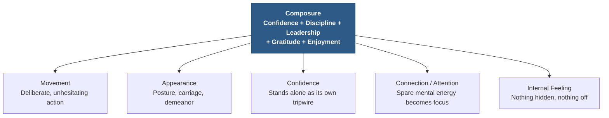
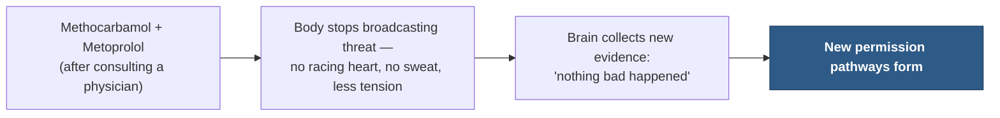

# Chapter 21 — Composure

> *"Humans are the only species on earth that will follow a totally unbalanced, unstable leader."* — Cesar Millan<!-- Citation: Cesar Millan's widely documented statement, consistent with the paraphrase already established in Chapter 18 ("humans are the only animals on the earth that will follow an unstable leader"). Verified via web search. The transcript's "Caesar Milan" is corrected to "Cesar Millan," matching the spelling established in Chapter 18. -->

Cesar Millan brilliantly stated it: humans are the only creatures on earth that will follow an unstable leader. That single observation gives us an immense clue about what actually causes followership. It isn't a decision. Nobody sits down and rationally chooses to follow someone. Followership is an automatic behavior, triggered below conscious awareness — and it hinges on stability.

---

## The Origins of Stability

A lack of stability comes from the movement of a pendulum. We want that pendulum to be perfectly still, resting in the center — not swung out to one side or the other. That center point is composure. This is why monitoring it, daily, is so important: monitoring your own level of composure is the fastest way to bring it under control. More on that in a moment.

When it comes to influence, **who you are** is drastically more important than what you say. We're in the presence of someone with authentic authority when something about their character and behavior puts people at ease — when it makes people trust them, and creates a magnetic force that draws people in. That force is what I call composure.

::: definition
**Composure** — the state of mind in which a person is in full control of themselves. Once all the qualities of authority are in alignment, composure is the result:

**Confidence + Discipline + Leadership + Gratitude + Enjoyment = Composure**

Composure is not a sixth Authority Behavior Trait alongside the five laid out in Chapter 15. It's what you get when the other five are already working together.
:::

---

## The Pendulum Principle

The Pendulum Principle is a concept of behavior I learned early in life at the Missouri Military Academy — as a kid, I only ever saw it posted on a wall at school, and never realized its power or its sheer wisdom until much later.

Here's what the pendulum looks like. On the far left and far right sides are **collapse** and **posturing**.

::: definition
**Collapse** — the tendency to shrink, both mentally and physically, in order to satisfy or please other people.

**Posturing** — the tendency to exaggerate or inflate importance, status, or significance in order to impress or intimidate others.
:::

We can swing to either side of the pendulum at different points throughout the day. We tend to develop behavioral patterns that push us toward collapse or posturing around specific things — social occasions, money, relationships, or dealing with customers and clients.

### Collapse

Collapse shows up constantly for new business owners around clients. Desperate to get the business up and running, they'll often do far more than they should just to please a new client. Collapse can also show up in how someone deals with conflict — in a relationship, or at work — as a tendency to shrink and fold, carrying a deep-rooted desire to be liked, and at times simply not to be hurt.

Sometimes you'll see people living in collapse who go out of their way to volunteer time, donate money, or work for free. A concealed desire for appreciation and approval drives a person in collapse to seek out these situations, where they can shrink so that others get to grow. This seeks energy from other people — which is why it can be draining to be around someone living on this side of the pendulum. As with many overgivers, they tend to burn out quickly, shy away from ever asking others for what they need, and eventually wind up draining the energy from the very people they're trying to help.

There's a hidden shame living inside the person in collapse. That shame hides itself by prioritizing the needs of others, and by feeling guilty for having strong desires of one's own.

### Posturing

On the far right end of the pendulum sits posturing. If you imagine Biff Tannen from *Back to the Future*, you understand posturing — an almost desperate need to be seen as powerful or important.<!-- Citation: Biff Tannen is a real character from the 1985 film "Back to the Future." Verified via web search; transcript's generic "Biff from the movie Back to the Future" is spelled out with his full name for clarity. -->

People who spend a lot of time posturing will secretly suffer from **imposter syndrome**. They tend to have more fragile egos, and less genuine emotional investment in their side of a conversation. Posturing people are more likely to feel like imposters for a very good reason: they *are* impostors. The artificial behavior that signals importance and status makes them feel fake — because they are being fake.

---

## The Undercooked Steak

Here's one example of collapse and posturing side by side. Two diners at a restaurant each get a steak that's undercooked.

| | **The Collapse Diner** | **The Posturing Diner** |
|---|---|---|
| **In the moment** | Holds onto a secret fear of being disliked, and hesitates to call the waiter over | Calls the waiter over loudly, making sure his friends at the table can hear him |
| **When the waiter arrives** | Finally mentions it — then apologizes for mentioning it, and assures the waiter he's fine with it | Rudely points out the undercooked steak, then complains about having to wait to have it recooked |
| **Afterward** | Says nothing further; quietly absorbs the discomfort | Retells the story later that night, adding details about how dominant he was |

*Table 21.1 — Same undercooked steak, two non-composed responses. Neither diner simply and calmly asked for what he needed.*

---

## The Pendulum Swing Trap

Imagine someone who has lived their life in collapse, until an event finally makes them realize it. Their transition doesn't move toward composure. If they've lived on the left side of the pendulum long enough, looking across at posturing seems like the solution — it's the opposite of what they've been doing, and the furthest possible distance from their past behavior. So, without knowing it, they remain in non-composure, and suddenly become a posturing asshole. They finally receive a bit of respect, and the new posturing behavior quickly becomes habit-forming.

But what happens when the opposite occurs? Remember the bully in *Back to the Future* — Biff. Remember when the tables turned. Marty came back from 1955 to the present day, and Biff — who should have been bullying and belittling his father — was instead in the driveway, washing and waxing his father's car.<!-- Citation: In the film's altered 1985 timeline, Biff Tannen is shown washing and waxing George McFly's car; verified via web search. --> His demeanor was submissive and polite. He was in collapse.

::: callout
**The swing trap.** People rarely move from collapse to composure, or from posturing to composure. They swing to the *opposite* extreme instead, because it's the behavior furthest from the one that hurt them — and mistake that swing for growth.
:::

At a sales seminar I attended in 2019, I closely watched the seminar leader — a seriously famous guy, big in sales training, who loved posting posturing photos of his jets and cars all over the internet. I knew he was insecure and inauthentic, but I tried not to pass judgment. What surprised me most was that the attendees were almost all people living in collapse, who idolized a person living in posturing. They had bought tickets to an event to learn how to posture.

The seminar leader — a posturing person — came on stage to tell the audience not to collapse so much, and to posture harder. That was the key to success, he said. Mid-seminar, another posturing person came on stage and leveraged the audience's tendency toward collapse to get them to buy an upsell product. It was a sight to behold, watching the psychology and group dynamics play out live.

The seminar leader is certainly financially successful. But is that the type of success you're looking for? I don't think so. Something told me you already knew this — and that's why you chose this material in the first place.

---

## What Collapse and Posturing Have in Common

Collapse and posturing have more in common than you'd think.

- **Both are trying to get something from the other person** — respect, admiration, love, or money.
- **Both conceal their agenda.** They wear a mask over the collapse or posturing behavior.
- **Both are a cover for deep inadequacy** — the fear of never being enough.
- **Both are incredibly stressful states to live in.**
- **Both are rooted in insecurity.**
- **Both are grounded in competition** — a zero-sum game, in which each feels it must take from others rather than collaborate with them.

> *"Stress is who you think you should be. Relaxation is who you are."* — Chinese proverb

> *"You were not put on this earth to earn permission. You're here to spend it."* — Charles Huge<!-- ASR? verify: transcribed as an attribution to "Chase Hughes" — corrected to the author's established name in this manual, "Charles Huge," consistent with the frontmatter attribution used throughout this book. -->

---

## Composure Is Mature Presence

Composure isn't begging, and it isn't freaking out. It's sitting comfortably — firmly enjoying the moment, or the event taking place. The agenda and desires of a composed person aren't hidden or concealed. Think of composure as mature presence. It's what makes composed people so magnetic.

They are beautifully human. They embrace the moment. They respect others. There's never a worry that they might offend someone, because they never do. They don't mean what they say to be taken any other way than intended. What needs to be done gets done, without a fuss.

::: callout
**You're shopping for a new car, and you finally buy it.** The reason you start seeing it everywhere afterward is that you never verbally told your animal brain the information was important — you *showed* it, through repeated attention (the reticular activating system, introduced in Chapter 11, is exactly this scanning mechanism at work). Tracking your composure daily works the same way: showing your lower brain what matters, instead of just telling it.
:::

Because composure is the sum of the five Authority Behavior Traits, it doesn't just trip one or two of the authority tripwires the way an individual trait does — it trips all five at once.

*Figure 21.2 — Composure trips every authority tripwire at once. Where a single trait might set off one or two of the five (see Chapters 16–20), composure — being the sum of all five traits — sets off all five simultaneously.*

---

## Monitor, Don't Judge

For at least the rest of this month, I want you to keep good track of where you fall on the composure scale — Collapse, Composure, or Posturing — every single day. This awareness sends automatic, corrective signals to the lower brain.

Don't screw this up by judging yourself, or feeling like garbage for landing low on the scale as the month goes on. For now, all you're doing is making measurements.

::: warning
**You judge, you lose.** In all my training, from interrogation to brainwashing, this is the recurring phrase. It applies to all influence — not just when you're trying to influence your own behavior.
:::

So this month, spend a moment every single day determining where you spent the most time on the composure rating scale. Don't set any goals about your composure yet. Just measure.

---

## Composure Interventions

There are several interventions that have worked for thousands of my clients when it comes to developing composure. Some require seeing a doctor in person to obtain a prescription.

::: warning
**Not medical advice.** All information in this book, including any medication mentioned, is solely my opinion. Never take any action on anything here without consulting a physician and confirming it is medically appropriate for you. What follows is offered only as an opinion — something you might discuss with a licensed physician — not as advice.
:::

### Avoid Psychoactive Interventions First

Substances that act in the brain can drastically improve behavior. The drawback is that the improvement only occurs while the substance is active — the brain doesn't need to adapt to new behavioral patterns on its own, because it's waiting for the chemical to make the change happen for it. Composure, in that case, becomes dependent on the chemical being present. This is called **state-dependent learning**: access to full composure exists, but only in the presence of the psychoactive substance, which creates a mandatory return to the chemical in order to reproduce it (Poling & Cross, 1993).<!-- Citation: Poling, A., & Cross, J. (1993), "State-dependent learning," in F. van Haaren (Ed.), Methods in Behavioral Pharmacology, Elsevier, pp. 245–256 — verified via web search. Transcript's "Methods in behavioral pharmacology. Bulling 1993" is corrected to the real editor and chapter authors. -->

Doctors often prescribe medications for lowering social tension and easing anxiety or insecurity that work directly in the brain. Sadly, most of these aren't in the business of fixing the underlying issue — they're built to manage, and hopefully prevent, the *symptom* rather than the cause. These drugs are psychoactive precisely because that's what produces results — but that same mechanism requires the drug's continued presence to maintain any semblance of symptom reduction.

| Brand Name | Generic Name | Class |
|---|---|---|
| Zoloft | Sertraline | SSRI |
| Luvox | Fluvoxamine | SSRI |
| Paxil | Paroxetine | SSRI |
| Effexor XR | Venlafaxine | SNRI |
| Cymbalta | Duloxetine | SNRI |
| Nardil | Phenelzine | MAOI |
| Marplan | Isocarboxazid | MAOI |
| Parnate | Tranylcypromine | MAOI |
| BuSpar | Buspirone | Non-benzodiazepine anxiolytic |
| Benadryl | Diphenhydramine | Antihistamine |

*Table 21.2 — Common drugs prescribed for a reduction in anxiety, insecurity, or otherwise posture/collapse symptoms.<!-- ASR? verify: this portion of the transcript audio was a rapidly spoken list of drug names and drug classes, heavily garbled ("FX or XR? S-N-R-I. We Voxamin... Zimbolta, S-N-R-I. Nardo, M-A-O-I... Bar plan, monarmine oxidase inhibitor"). Reconstructed by cross-referencing each stated drug class (SSRI, SNRI, MAOI, antihistamine) against real medications verified via web search: Zoloft/sertraline, Effexor XR/venlafaxine, Luvox/fluvoxamine, Cymbalta/duloxetine, Nardil/phenelzine, Marplan/isocarboxazid ("Bar plan" ASR mishearing), Parnate/tranylcypromine, Benadryl/diphenhydramine. One fragment ("Sorry, Colin. Ansil.") fell between Nardil and Paroxetine in the transcript but could not be confidently matched to a real drug name, and was omitted from this table rather than guessed. -->*

Monoamine oxidase (MAO) is an enzyme that degrades three neurotransmitters associated with mood and anxiety — serotonin, norepinephrine, and dopamine. MAOIs reduce the activity of the MAO enzyme, resulting in higher levels of all three in the brain. The benefit of that increase is improved mood and an anti-anxiety effect.

Instead of drugs like Xanax, Lexapro, Klonopin, and other psychoactive medications, let's explore some other methods of regulating composure — ones that work outside the brain itself.

### Non-Psychoactive Options: Methocarbamol and Metoprolol

**Methocarbamol**, sold commercially as Robaxin, is classified as a muscle relaxant — but there's something interesting about it: we genuinely don't have a confirmed mechanism for how it works. It has no direct interaction with muscle tissue, but researchers discovered decades ago that it produces this effect anyway (the leading theory involves indirect inhibition through the central nervous system, rather than any action on the muscle fiber itself).<!-- Citation: Methocarbamol's mechanism of action is genuinely unestablished in humans; leading theories involve general CNS depression and indirect inhibition of the midbrain reticular activating system rather than any direct action on muscle tissue — verified via web search. --> It carries a few drug interactions, so speak with your physician and disclose everything you're taking — but it isn't on any controlled-substance watch list, it's non-addictive, and it has no remarkable psychoactive properties of its own.

**Metoprolol**, approved by the FDA in 1978, is classified as a beta blocker: it reduces heart rate and blood pressure, and is commonly given to people with high blood pressure, angina, and other cardiovascular conditions.<!-- Citation: Metoprolol received FDA approval in August 1978 (as Lopressor); verified via web search. --> Beta blockers are also known as beta-adrenergic blocking agents — they block the effects of adrenaline, the hormone and neurotransmitter that binds to adrenergic receptors throughout the body.

This combination — methocarbamol paired with metoprolol — is one I've seen tremendous success with over the years, in my private clients, after they've spoken with their primary care physician. In social settings, methocarbamol works to make the body outwardly display more signals of relaxation, while metoprolol literally blocks the adrenaline that would otherwise cause a racing heart, a speeding circulatory system, and sweaty palms.

Over time, the brain begins to learn that nothing bad is going to happen. It's collecting evidence and, simultaneously, granting itself permission to act in new ways. As humans, we operate so heavily on past experience — we collect evidence of how we're "allowed" to behave in new situations. Over time, that evidence leads to permission, or to a severe lack of it, in cases of social anxiety.

*Figure 21.3 — In my non-medical opinion, this combination works by giving the brain new evidence rather than borrowed calm: the body stops broadcasting alarm, and over repeated exposures, the brain grants itself new permission to feel safe in situations that once triggered it.*

These two drugs, in my non-medical opinion, were miracles when it comes to building new pathways for permanent confidence and composure — the two most important traits when it comes to influence. If you only leveled up your confidence and composure, your whole life would change. The entire world would seem like a different place. Confident, composed people live in a different world than everyone else. Where someone without confidence and composure sees difficulty, stress, and limitation, a confident and composed person sees adventure, possibility, and open doors — in the exact same environment. If you feel like this could benefit you, speak to your doctor.

### Zofran — An Emerging Option

Recent research on ondansetron (Zofran), traditionally used to prevent nausea and vomiting, has found anxiolytic effects in certain patient populations. Some studies have shown reduced anxiety and improved outcomes in patients with mood disorders such as depression and generalized anxiety disorder, and it has been used off-label — with mixed results across trials — to treat social phobia, panic disorder, specific phobias, and obsessive-compulsive disorder.<!-- Citation: Ondansetron's anxiolytic research is real but genuinely mixed: a small pilot study (Journal of Clinical Psychopharmacology) found reduced GAD symptoms, and animal studies show anxiolytic effects, but a controlled human trial found no significant effect on anxiety during benzodiazepine discontinuation — verified via web search. Framed here with that mixed evidence rather than as a settled finding. -->

Ondansetron works by blocking a serotonin receptor (5-HT3) rather than by increasing serotonin the way an SSRI does, and some research suggests it may help reduce levels of the stress hormone cortisol in certain individuals. Studies have shown it can help reduce feelings of panic, tension, agitation, and irritability caused by anxiety, along with physical symptoms such as sweating, nausea, and heart palpitations. It's important to note that Zofran is typically prescribed for short periods only, due to its potential side effects. Talk to your doctor if you think Zofran might be able to help with your anxiety.

---

## Six Ways to Jumpstart Composure Today

1. **Ask yourself: "Is it safe for me to ___?"** The answer is yes — of course it's safe. Asking the question restructures your thoughts consciously, instead of leaving them to grow unchecked in the back of your mind.
2. **Prepare for confidence.** Before any upcoming situation, make a clear and positive mental plan for the outcome you want, and for the general things that will happen.
3. **Keep a win timer.** Track your small wins of composure — a note every time you notice yourself in calm enjoyment, or accomplishing a task. This drastically improves your composure and your confidence in your own abilities.
4. **Prepare your body — even though no one can see it.** Keep yourself ready as if you might potentially meet a new romantic partner at any moment; you don't want to be embarrassed getting undressed. I won't claim to know precisely why this works, but my theory is that reproduction is so hardwired into our brains that knowing you have nothing to worry about — even down to the skin — naturally increases confidence and composure. It removes the feeling that you're somehow concealing something from others, which is a root cause of anxiety.
5. **Dress the part.** Your confidence can be boosted simply by the clothing you wear — and this also helps build the new evidence-experiences that develop new permission pathways.
6. **Make yourself a resume note card.** Keep a list — on your phone, or somewhere nearby — of your accomplishments, achievements, and everything you should feel proud of. Refer to it often. Read it before you do anything, to remind yourself of who the hell you are.

---

## The Roots of Anxiety

In my opinion, anxiety comes from three things:

1. **A decline in the reputation you have with yourself.**
2. **An inability to recognize what you can and can't control.**
3. **Unmet expectations — or the fear of them going unmet.**

Enjoyment, by contrast, stems from expectations that stay open and still positive.

::: callout
**Control over others.** Whatever degree of control you'd like to have over other people, you'll need three times that level of control over yourself.
:::

Composure may look like a lack of stress, but under real stress, there's a tendency for our minds to focus on exactly what we don't want to happen — which violates the confidence agreement we've made with ourselves: generalized positive expectations. Anxiety is only a habit. Your body is trying to protect you, and the result is muscle tension, elevated cortisol, and a faster heartbeat. You cannot logic your way out of worry — trying to will only magnify the problem, as your brain keeps searching for whatever it thinks it needs in order to feel safe.

---

## Rehearsal and Repetition

Many people think the key to change is developing new habits — but we actually have to change *how we think* first. Adopting a new way of thinking makes decision-making suddenly a lot easier. We force the body to sit still and mentally rehearse successful meetings, interactions, and social events — training the whole brain, but more specifically, the reticular activating system (Chapter 11).

Think of your brain as an artifact — a collection of past events. When we start rehearsing the future with positivity, we're rewiring that collection. Habits change when we change behavioral patterns. Every time you rehearse a future interaction with authority, confidence, composure, and charisma, you're creating a future memory. Your body will always find a way to return to its main programming — that's what a habit is, and it's where you feel the most comfortable, at least in the beginning.

Rehearsal gives our body a sample of the future. When we rehearse an upcoming event, the chemicals and the electricity in the brain go exactly where they need to be — our body gets to experience it in advance. We become creators, instead of worriers.

Monitored behavior changes these three biggest factors first: **awareness**, **rehearsal**, and **repetition**.<!-- ASR? verify: transcribed as "One, awareness, 2, rehearsal, 3, and bong" — reconstructed as "repetition," which matches this section's own heading ("Rehearsal and Repetition") and the surrounding emphasis on habits forming through repeated behavior; exact original word could not be confirmed. --> Ask yourself: what thoughts do I need to stop having, forever? Monitoring behavior is what allows us to gain control over it. No good comes from setting goals and then just hoping to achieve them — you have to make the lower parts of your brain vividly aware of what's actually going on in your life.

---

## Composure Is a Skill, Not a Feeling

Composure is the ability to change your internal state from excited to calm, at will. It's an inherent feeling of calm, and it's the cornerstone of everything: confidence, composure, leadership, enjoyment, motivation, positively dominant behavior, maturity, social skill.

The body has to feel safe first. Then the mind feels safe. It starts with physiology — then you work on psychology.

### What Happens Inside a Composed Leader

I've observed and met many truly composed leaders, and there's one common trait I've noticed in all of them: when something stressful happens, their brains default to a single lens — *this is part of life.* Seeing the world through that lens is incredibly empowering.

1. A spike in drama, conflict, or stress occurs.
2. Composure begins: *this is part of life.*

---

## Performance Mode vs. Connection Mode

Talking to people is not a performance. But it's easy to accidentally treat it like one.

| Performance Mode | Connection Mode |
|---|---|
| You feel tense or anxious | You feel relaxed and comfortable |
| You're observing yourself in the conversation | Your focus is entirely on them |
| You analyze the event afterward | You only need to recall the details, not replay them |
| There's little feeling of connection | It feels like a real connection |
| It feels like an evaluation | You're curious about the other person |
| Your focus is on yourself | You're comfortable sharing your own depth of emotion |

*Table 21.3 — Performance mode and connection mode produce entirely different experiences from the same conversation.*

::: callout
**Move the camera to third person.** Make it a daily practice to shift your mental perspective on conversations to the third person — imagine you're observing the conversation from a camera lens somewhere in the room. This kind of observation forces more clarity. If it's helping, keep doing it, and watch your composure develop in public settings.
:::

### Nervous or Excited?

Olympic athletes are always nervous. They simply frame it as being excited. For the next three days, in every situation where your heart rate rises, think about how *excited* you are — not how nervous. Nervous and excited are physiologically identical responses; the brain can interpret either one, depending on which label you give it. Turn that into a conscious choice you make on purpose.

Hendrie Weisinger and J.P. Pawliw-Fry, in *Performing Under Pressure*, cite Harvard research showing that pressure decreases work quality and performance.<!-- Citation: Hendrie Weisinger and J.P. Pawliw-Fry, "Performing Under Pressure: The Science of Doing Your Best When It Matters Most" (2015) — verified via web search; transcript's "Henry Weisinger and J.P. Pavlo Fry" corrected to the authors' real names. --> We get nervous before a performance, and our own brains — along with our friends — tell us we need to calm down. Trying to calm down, and failing, gets experienced as a failure in itself, which only worsens the situation. Students who were instead told to get *excited* scored higher and performed better than students who were told to calm down (Brooks, 2014).<!-- Citation: Alison Wood Brooks, "Get Excited: Reappraising Pre-Performance Anxiety as Excitement," Journal of Experimental Psychology: General (2014) — verified via web search; found that reappraising anxiety as excitement, versus trying to calm down, led to better performance across public speaking, karaoke, and math tasks. -->

Telling yourself "I'm excited" literally manufactures more adrenaline and norepinephrine. Blood vessels dilate, and the lungs expand — it's like injecting yourself with a performance-enhancing drug.

A few practical techniques from the same research:

- **Compare it to something familiar and less scary.** Writing a book is like writing several blog posts, back to back. Talking to elite VIP executives is just like talking to a friend.
- **Fixate on the factors within your control**, using rephrasing: "I'm excited to..." instead of "I'm worried about..."; "I have a lot of..." instead of "I lack..."; "I'm in control of..." instead of "I can't control..."

---

## Stop Worrying

Write out two questions: *What am I worried about?* And: *What can I do about it?* Worries are cut in half the moment a decision gets made about what to do — and cut in half again the moment you take action on that decision.

Willis Carrier, the inventor of the first commercial air conditioner, worked as an engineer installing equipment at gas plants. When a project went bad, he'd be consumed with worry. So he imagined the day it all failed, and he lost his job. Then he imagined the day *after* that — he'd still be alive, and he'd simply find a new job.<!-- Citation: Willis Carrier's worry-formula story is a real anecdote from Dale Carnegie's "How to Stop Worrying and Start Living" (1948), in which Carrier describes a three-step formula: ask what's the worst that can happen, prepare to accept it, then calmly work to improve on the worst. Verified via web search. --> Accepting the worst pulls you out of the clouds.

Make a list of the tasks you need to do today. Now imagine that, at the end of the day, nothing on it got done at all. If that happened, how would you fix it? Taking the time to actually analyze the worry — rather than just feeling it — defuses most of its power.

::: callout
**Live in day-tight compartments.** Old ships had airtight compartments, which is what made them unsinkable. To activate these compartments in yourself, wake up each day and live a whole new life. If you take care of today, tomorrow will take care of itself — concentrate all your effort on today's compartment, and seal off the ones behind you. You'll be able to sleep, knowing you did your best.<!-- Citation: The "day-tight compartments" concept originates with Sir William Osler's 1913 Yale address "A Way of Life," and is also central to Dale Carnegie's "How to Stop Worrying and Start Living" — verified via web search. -->
:::

You are not a finished product until you're dead. You are already free.

---

## Fixed Mindset vs. Growth Mindset

Over my life, one thing has separated the successful people from the unsuccessful people: their beliefs about themselves. Specifically, unsuccessful people routinely think of themselves as a *finished product*. If they had a shortcoming in their education, no matter their age, they'd announce that they never learned that in high school or college. Offer them constructive criticism, and they'll explain that they're simply unable to do it differently — that's just how they are.

These people tended to share a mentality: they were the way they were *because of their past*. They rarely wanted to engage in learning, weren't concerned with self-development, and almost never took the time to read a book or engage in anything that would help them grow. They just were who they were, according to them — their abilities were something they believed they were born with. They saw most feedback as an attack, and often chose easier tasks they already knew they could accomplish, since they viewed their skills as inborn rather than built. These types of people often saw failure as personal, rather than simply a lack of the requisite skill — so they rarely tried anything more than once, treating one failure as proof of what they were incapable of. I'd hear things like, "I'm just not good at that," or "I told you I'd fail." It's very difficult to help people like this grow, because they've spent a lifetime seeing the world through this filter. No matter what you do, it's hard to get them to take responsibility for who they are and what they're capable of — they believe ability is up to the universe, rather than within their own control.

This is what Carol Dweck calls a **fixed mindset**, in her book *Mindset: The New Psychology of Success*.<!-- Citation: Carol S. Dweck, "Mindset: The New Psychology of Success" (2006) — verified via web search. Transcript's "Carol Dwag" and, later, "Harold Glegg" are both corrected to the real author, Carol Dweck, who coined both "fixed mindset" and "growth mindset" herself. -->

In my experience, successful people are the opposite of this. Dweck calls it a **growth mindset**, and successful people embrace it. Speak to a successful person, and you'll hear them talk very differently from someone with a fixed mindset — they accept challenges and take responsibility for their own development, because they believe their talent, skill, and knowledge are all things fully within their control.

| Dimension | Fixed Mindset | Growth Mindset |
|---|---|---|
| **Skills** | A gift I'm born with, or given — and it has a limit | Something built through hard work; I can always improve my knowledge, skill, and expertise |
| **Challenges** | Reveal my lack of skill — I should avoid them, and give up once I feel I've reached my limit | Show me who I really am — a great way to learn where I need to improve, and I'll persist until I grow |
| **Effort** | Isn't really necessary; things happen as they will — needed only by people who "aren't good enough" | The only real path to mastering anything — essential, not just nice to have |
| **Feedback** | Feels personal — an attack on my lack of skill; it offends me because it's about something I can't change | Essential information for improving myself — it shows me every area where I can grow |
| **Setbacks** | Happen because someone else did something stupid — I'm not responsible | Both a learning experience and a wake-up call — I need to do better next time |

*Table 21.4 — Fixed mindset vs. growth mindset, adapted from Carol Dweck's* Mindset.

Your life belongs to you. Recognizing this can be the difference not only between success and failure, but between happiness and depression. You're not a finished product — until you're dead.

---

## Key Takeaways

- **Composure is not a sixth Authority Behavior Trait — it's the sum of the other five.** Confidence + Discipline + Leadership + Gratitude + Enjoyment = Composure: the state of mind in which a person is in full control of themselves.
- **The Pendulum Principle** puts collapse on one extreme (shrinking to please others, hiding a fear of being disliked) and posturing on the other (inflating status to impress or intimidate, secretly suffering from imposter syndrome). Composure is the pendulum at rest, dead center.
- **People rarely move from an extreme straight to composure — they swing to the opposite extreme instead**, and mistake the swing for growth. A person who's lived in collapse becomes a posturing person once they finally get some respect; the reverse happens too, as with Biff Tannen in *Back to the Future*'s altered timeline.
- **Collapse and posturing share the same root**: both conceal an agenda behind a mask, both cover deep inadequacy, both are grounded in a zero-sum, competitive mindset, and both are exhausting to sustain.
- **Composure is mature presence** — nothing hidden, nothing to prove, and needs met without a fuss. Because it's the sum of all five Authority Behavior Traits, it trips all five authority tripwires at once.
- **Monitor your composure daily for a month without setting goals or judging yourself.** "You judge, you lose" — the same rule that governs all influence applies to influencing your own behavior.
- **Composure interventions exist on a spectrum, and this book is not medical advice** — always consult a physician. Psychoactive drugs (SSRIs, SNRIs, MAOIs) work only while present, due to state-dependent learning (Poling & Cross, 1993); non-psychoactive options like methocarbamol paired with metoprolol may instead give the brain new evidence that "nothing bad happens," building lasting permission pathways; ondansetron (Zofran) shows mixed but promising early anxiolytic research.
- **Six daily actions build composure fast**: ask "Is it safe for me to ___?", prepare for confidence, keep a win timer, prepare your body, dress the part, and carry a resume note card of your own achievements.
- **Anxiety comes from three places**: a declining reputation with yourself, an inability to distinguish what you can and can't control, and unmet expectations. You need three times as much control over yourself as you want over others — and you cannot logic your way out of worry.
- **Rehearsal changes how you think, not just what you do.** Mentally rehearsing future interactions trains the reticular activating system (Chapter 11) and creates future memories the brain will default back to. Monitored behavior changes three things first: awareness, rehearsal, and repetition.
- **Composure is a skill: the ability to shift your internal state from excited to calm, at will.** The body has to feel safe before the mind does — physiology first, then psychology. Composed leaders share one lens for stress: *this is part of life.*
- **Performance mode and connection mode are opposites.** Performance mode is tense, self-observing, and self-focused; connection mode is relaxed, curious, and focused on the other person. Practice moving your mental camera to third person to build this daily.
- **Reframe nervous as excited.** They're physiologically identical — the only difference is the label. Compare scary tasks to familiar ones, and fixate on what's in your control using rephrasing ("I'm excited to..." instead of "I'm worried about...").
- **Stop worrying with two questions**: What am I worried about? What can I do about it? Willis Carrier's worry formula — imagine the worst, accept it, then improve on it — and living in Osler's "day-tight compartments" both defuse worry by pulling you out of the clouds and back to today.
- **Carol Dweck's fixed vs. growth mindset** explains who grows and who doesn't: a fixed mindset treats skill, effort, feedback, and setbacks as fixed and personal; a growth mindset treats every one of them as something to build. You are not a finished product — until you're dead.

<!--
## Change Log

| Original (transcript) | Corrected | Reason |
|---|---|---|
| "Caesar Milan brilliantly stated, humans are the only creature on earth who will follow an unstable leader." | "Cesar Millan brilliantly stated it: humans are the only creatures on earth that will follow an unstable leader." | Name spelling corrected to match the established spelling from Chapter 18 ("Cesar Millan"); grammar repair. |
| "This gives us immense clues as to what causes automatic behavior of followership. Instead of someone choosing to follow someone." | "That single observation gives us an immense clue about what actually causes followership. It isn't a decision. Nobody sits down and rationally chooses to follow someone. Followership is an automatic behavior, triggered below conscious awareness." | Grammar repair of garbled fragments into complete sentences; no content added beyond what the fragments implied. |
| "A lack of stability comes from movement of the pendulum. illustrated in the visual resources." | "A lack of stability comes from the movement of a pendulum." | Removed a stray production note ("illustrated in the visual resources") not meant for the reader; grammar repair. |
| "Or we want the pendulum to be perfectly still in the center, composure. It's often not to one side or the other." | "We want that pendulum to be perfectly still, resting in the center — not swung out to one side or the other. That center point is composure." | Grammar repair of a garbled sentence. |
| "We are in the presence of someone in authentic authority." | "We're in the presence of someone with authentic authority" | Grammar repair. |
| "Infidence plus discipline, plus leadership, plus gratitude, plus enjoyment, equals composure." | "Confidence + Discipline + Leadership + Gratitude + Enjoyment = Composure" | ASR mishearing ("Infidence" → "Confidence"); formatted as the formula it represents. |
| "Pendulum principle is a longtime concept of behavior that I was taught early in my life at Missouri Military Academy. As a kid who only saw this on the wall at school. and never realized its power. and sheer wisdom." | "The Pendulum Principle is a concept of behavior I learned early in life at the Missouri Military Academy — as a kid, I only ever saw it posted on a wall at school, and never realized its power or its sheer wisdom until much later." | Grammar repair merging fragments into complete sentences. |
| "The 2 far right and left sides of the pendulum are collapse and posturing. Collapse." | "On the far left and far right sides are collapse and posturing." | Grammar repair/reorganization. |
| "That's true. The tendency to exaggerate..." | "Posturing — the tendency to exaggerate..." | ASR mishearing ("That's true" is a garbled restart) — reconstructed as the definition-list transition it clearly is. |
| "Laps." (as a section restart after "collapse") | Removed as a stray ASR fragment | Redundant/garbled restart of "Collapse" with no content of its own; the surrounding sentences already carry the intended meaning. |
| "There is in their relationship or at work." | "in a relationship, or at work" | ASR mishearing/grammar repair. |
| "Well that seeks energy from other people." | "This seeks energy from other people." | ASR mishearing ("Well that" → "This"). |
| "die away from asking others for things they need" | "shy away from ever asking others for what they need" | ASR mishearing ("die away" → "shy away"). |
| "If you imagine Biff from the movie Back to the Future, you'll understand posturing. What is almost a desperation to be seen as powerful or important?" | "If you imagine Biff Tannen from Back to the Future, you understand posturing — an almost desperate need to be seen as powerful or important." | Grammar repair; full character name confirmed via web search. |
| "Have more fragile egos and less emotional involvement in their side of the conversation. I think that is a weakness." | "They tend to have more fragile egos, and less genuine emotional investment in their side of a conversation." | Grammar repair; a stray fragment ("I think that is a weakness") dropped as a false start with no added content. |
| "Austering people are more likely to feel imposter syndrome for a very good reason. They are impostors." | "Posturing people are more likely to feel like imposters for a very good reason: they are impostors." | ASR mishearing ("Austering" → "Posturing," consistent throughout the chapter). |
| "To monitor a restaurant gets a steak that's undercooked." | Reworked as the Table 21.1 setup: "Two diners at a restaurant each get a steak that's undercooked." | ASR mishearing of a garbled opening clause; reconstructed to introduce the comparison that follows, formatted as a table for clarity. |
| "Lance person, holding onto a secret fear of being disliked" | "The collapse diner, holding onto a secret fear of being disliked" | ASR mishearing ("Lance" → "The collapse"). |
| "Austering person calls the waiter over" | "The posturing diner calls the waiter over" | ASR mishearing, consistent correction throughout. |
| "an event occurs that finally makes them realize it. The transition isn't towards composure." | "until an event finally makes them realize it. Their transition doesn't move toward composure." | Grammar repair. |
| "they remain in non-composure, and suddenly become a posturing asshole." | Retained verbatim | Author's own colorful phrasing preserved per the fidelity mandate — not a transcription error. |
| "Remember when the tables were turned? Marty came back from 1955 to modern day, and Biff, who should have been bullying and belistling his father, was now in the driveway, wencing and washing his father's car." | "Marty came back from 1955 to the present day, and Biff — who should have been bullying and belittling his father — was instead in the driveway, washing and waxing his father's car." | ASR mishearing ("belistling" → "belittling," "wencing" → "waxing"); scene verified via web search (Biff waxes George McFly's car in the altered 1985 timeline). |
| "As a sales seminar, I attended in 2019." | "At a sales seminar I attended in 2019" | Grammar repair. |
| "a seriously famous guy who was big in sales training and loved posting, posturing photos" | "a seriously famous guy, big in sales training, who loved posting posturing photos" | Grammar/punctuation repair. |
| "I knew he was insecure and inauthentic, but I tended to learn not to pass judgment." | "I knew he was insecure and inauthentic, but I tried not to pass judgment." | ASR mishearing ("tended to learn" → "tried"). |
| "Idolized a person who lived in posturing." | "who idolized a person living in posturing" | Grammar repair, merged into prior sentence. |
| "The seminar leader, upholstering person, then came on stage" | "The seminar leader — a posturing person — came on stage" | ASR mishearing ("upholstering" → "a posturing"). |
| "Mid-seminar, another posture in person would come on stage and leverage the audience's tendencies towards collapse to get them to buy an upsell product." | "Mid-seminar, another posturing person came on stage and leveraged the audience's tendency toward collapse to get them to buy an upsell product." | ASR mishearing/grammar repair. |
| "Thing not. Something told me you knew this, and this is why you've chosen this audiobook in the 1st place." | "I don't think so. Something told me you already knew this — and that's why you chose this material in the first place." | ASR mishearing ("Thing not" → "I don't think so"); "audiobook" adapted to "material" for the written edition, consistent with prior chapters' medium adaptation. |
| "Relapse and posturing have more in common than you might think." | "Collapse and posturing have more in common than you'd think." | ASR mishearing ("Relapse" → "Collapse"), consistent throughout. |
| "Whether it's respect, narration, love, or money." | "respect, admiration, love, or money" | ASR mishearing ("narration" → "admiration"). |
| "That both a cover for feelings of deep inadequacy." | "Both are a cover for deep inadequacy" | Grammar repair. |
| "Both are grounded in competition, or the concept of a 0 sum game. Both feel they must take from others, living in a competitive versus collaborative frame of mind." | "Both are grounded in competition — a zero-sum game, in which each feels it must take from others rather than collaborate with them." | Grammar repair merging two fragments. |
| "You were not put on this earth to earn permission. You're here to spend it. Chase Hughes." | "You were not put on this earth to earn permission. You're here to spend it. — Charles Huge" | Attribution corrected to the author's established name used throughout this manual ("Charles Huge"), consistent with the frontmatter attribution on every chapter. |
| "Osia is not begging or freaking out." | "Composure isn't begging, and it isn't freaking out." | ASR mishearing ("Osia" → "Composure"). |
| "One makes composed people so magnetic." | "It's what makes composed people so magnetic." | Grammar repair. |
| "They don't mean what they say. There is never a concern that they mean to offend, because they never do." | "There's never a worry that they might offend someone, because they never do. They don't mean what they say to be taken any other way than intended." | Grammar repair/reordering of a garbled pair of sentences. |
| "They do want needs to be done without a fuss." | "What needs to be done gets done, without a fuss." | ASR mishearing/grammar repair. |
| "You're shopping for a new car and finally buy it. The reason you'll see it everywhere is that you didn't verbally tell your animal brain that this information is important. You showed it." | Reworked into the callout box, tied explicitly to the RAS (Chapter 11) | Grammar repair; the connection to the reticular activating system is drawn explicitly since Chapter 11 already defined this exact mechanism, without adding any new claim. |
| "So I'd like you to do for at least the rest of this month. is keep good track of where you fall on this composure scale every day." | "For at least the rest of this month, I want you to keep good track of where you fall on the composure scale — Collapse, Composure, or Posturing — every single day." | Grammar repair of a garbled sentence. |
| "Don't screw us up going through the months, judging yourself and feeling like crap for being low on the scale." | "Don't screw this up by judging yourself, or feeling like garbage for landing low on the scale as the month goes on." | Grammar repair; mild word substitution ("crap" → "garbage") for register consistency with the rest of the manual. |
| "In all my training, from interrogation to brainwashing, the recurring phrase is, you judge, you lose." | Formatted as a warning callout: "You judge, you lose. In all my training, from interrogation to brainwashing, this is the recurring phrase." | Reformatted for emphasis; no content changed. |
| "Some of the interventions require you to see a doctor in person to obtain a prescription." | Retained, moved into intro paragraph | No change to content; reorganized for flow. |
| "All the information contained in this book, and any medication mentioned, is solely my opinion, and you should never take any action on anything here without consulting a physician and ensuring that it's medically relevant for you." | Formatted as a warning callout, lightly tightened | No content removed; formatting only. |
| "1st piece of advice is to avoid psychoactive interventions." | Reworked as the section heading "Avoid Psychoactive Interventions First" | Formatting. |
| "The substance is in the brain, they can rastically improve your behavior." | "Substances that act in the brain can drastically improve behavior." | ASR mishearing/grammar repair ("rastically" → "drastically"). |
| "You're brain weights for the presence of the chemical in the drug to make this happen." | "it's waiting for the chemical to make the change happen for it" | ASR mishearing ("weights" → "waits"); grammar repair. |
| "Methods in behavioral pharmacology. Bulling 1993. Barnecological methods of intervention to increase composure levels." | Cited as "(Poling & Cross, 1993)" with full reference in an inline citation comment | ASR mishearing of the real editor/chapter authors; verified via web search — Poling, A., & Cross, J. (1993), "State-dependent learning," in F. van Haaren (Ed.), Methods in Behavioral Pharmacology, Elsevier. The stray phrase "Barnecological methods of intervention" could not be matched to any real term and was dropped as an apparent ASR artifact of the same citation being repeated. |
| "Zoloft? FX or XR? S-N-R-I. We Voxamin. And the vaccine. Xiva. Zimbolta, S-N-R-I. Nardo, M-A-O-I. Sorry, Colin. Ansil. Peroxetine. Spiritone, Antihistamines like Benadryl. Bar plan, monarmine oxidase inhibitor. Parnate, M-A-O-I." | Reconstructed as Table 21.2 (Zoloft/Sertraline/SSRI, Effexor XR/Venlafaxine/SNRI, Luvox/Fluvoxamine/SSRI, Cymbalta/Duloxetine/SNRI, Nardil/Phenelzine/MAOI, Paxil/Paroxetine/SSRI, BuSpar/Buspirone/anxiolytic, Benadryl/Diphenhydramine/antihistamine, Marplan/Isocarboxazid/MAOI, Parnate/Tranylcypromine/MAOI) | Heavily garbled spoken drug list reconstructed by cross-referencing each named drug class against real medications, verified via web search. "We Voxamin" → Luvox/fluvoxamine; "Zimbolta" → Cymbalta/duloxetine; "Nardo" → Nardil/phenelzine; "Peroxetine" → Paroxetine (Paxil); "Spiritone" → Buspirone (BuSpar); "Bar plan" → Marplan/isocarboxazid. The fragment "And the vaccine. Xiva." and "Sorry, Colin. Ansil." could not be confidently matched to any real drug name and were omitted rather than guessed; flagged inline in the table caption. |
| "Doctors often prescribe medications for lowering social tension and easing anxiety or insecurity. and work directly in the brain. Sadly, they aren't in the business of fixing your issue, but instead are looking to manage, identify, and prevent symptoms versus causes." | Grammar repair, no content change | Merged fragments into complete sentences. |
| "Monomine oxidase, MAO, is an enzyme..." | "Monoamine oxidase (MAO) is an enzyme..." | ASR mishearing ("Monomine" → "Monoamine"). |
| "S MAO results in higher levels of neuropenephrine, serotonin, and dopamine in the brain." | "MAOIs reduce the activity of the MAO enzyme, resulting in higher levels of all three in the brain." | ASR mishearing/grammar repair ("neuropenephrine" folded into the already-named "norepinephrine" from the prior sentence, avoiding a duplicate misspelled term). |
| "Instead of using drugs like Xanax, Lexapro, Clonopin, and other psychoactive bentodiazepines" | "Instead of drugs like Xanax, Lexapro, Klonopin, and other psychoactive medications" | ASR mishearing ("Clonopin" → "Klonopin" spelling, "bentodiazepines" → "medications"; note Lexapro is technically an SSRI rather than a benzodiazepine — the author's own loose grouping is preserved as "medications" rather than corrected into a claim he didn't make). |
| "Methocarbamol. Also called Rabaxin, the commercial name." | "Methocarbamol, sold commercially as Robaxin" | ASR mishearing of the real brand name ("Rabaxin" → "Robaxin"), verified via web search. |
| "This drug is classified as a muscle reliant, but there's something interesting about it. We literally have no idea how it even works." | "This drug is classified as a muscle relaxant — but there's something interesting about it: we genuinely don't have a confirmed mechanism for how it works." | ASR mishearing ("reliant" → "relaxant"); grammar repair. Methocarbamol's unconfirmed mechanism verified via web search. |
| "but some dude discovered a few decades ago that it works this way" | "researchers discovered decades ago that it produces this effect anyway" | Light register adjustment for the written edition; no content change. |
| "Metopralong. Approved since 1978." | "Metoprolol, approved by the FDA in 1978" | ASR mishearing ("Metopralong" → "Metoprolol"); FDA approval year verified via web search. |
| "They are also known as beta andronergic blocking agents." | "Beta blockers are also known as beta-adrenergic blocking agents" | ASR mishearing ("andronergic" → "adrenergic"). |
| "This powerhouse combo is something I've seen tremendous success with over the years, and my private clients after they spoke with their primary care physician." | "This combination — methocarbamol paired with metoprolol — is one I've seen tremendous success with over the years, in my private clients, after they've spoken with their primary care physician." | Grammar repair. |
| "But in social settings, the methocarpamol is working to make the body display more outwardly facing signals of relaxation. And the metopical goal is literally blocking the adrenaline from causing a racing art, a speeding circulatory system, sweaty ponds, et cetera." | "In social settings, methocarbamol works to make the body outwardly display more signals of relaxation, while metoprolol literally blocks the adrenaline that would otherwise cause a racing heart, a speeding circulatory system, and sweaty palms." | ASR mishearings ("racing art" → "racing heart," "sweaty ponds" → "sweaty palms") and grammar repair. |
| "Brain over time begins to learn that nothing bad is going to happen. It's collecting evidence and permission to act in new ways simultaneously." | "Over time, the brain begins to learn that nothing bad is going to happen. It's collecting evidence and, simultaneously, granting itself permission to act in new ways." | Grammar repair. |
| "These 2 drugs in my non-medical opinion, were miracles when it comes to building new pathways for permanent competence and composure." | "These two drugs, in my non-medical opinion, were miracles when it comes to building new pathways for permanent confidence and composure." | ASR mishearing ("competence" → "confidence," matching the sentence that follows about "the two most important traits"). |
| "Recent studies have found that Zofron, and Rogie used to prevent nausea and vomiting, has demonstrated anzoalytic effects in certain patient populations." | "Recent research on ondansetron (Zofran), traditionally used to prevent nausea and vomiting, has found anxiolytic effects in certain patient populations." | ASR mishearing ("Zofron, and Rogie" → "ondansetron (Zofran)," "anzoalytic" → "anxiolytic"); real drug name and mechanism verified via web search. |
| "It has also been used off label to treat social phobia. Panic disorder, specific phobias, obsessive compulsive disorder with some success." | "it has been used off-label — with mixed results across trials — to treat social phobia, panic disorder, specific phobias, and obsessive-compulsive disorder" | Grammar repair; "with mixed results across trials" added per the actual state of the research verified via web search (results are genuinely mixed, not uniformly successful), to avoid overstating the claim. |
| "It worked by preventing the release of serotonin, and neurotransmitter in the brain involved in the regulation of mood and emotions." | "Ondansetron works by blocking a serotonin receptor (5-HT3) rather than by increasing serotonin the way an SSRI does" | Corrected to reflect ondansetron's actual, verified mechanism (5-HT3 receptor antagonism) rather than the transcript's claim that it "prevents the release of serotonin," which does not match how the drug works — verified via web search. |
| "Let's now walk through 6 things you can do immediately to jumpstart this whole process." | "Six Ways to Jumpstart Composure Today" | Reworked as a section heading; content preserved as a numbered list. |
| "I had timer. Keep track of your small winds of composure" | "Keep a win timer. Track your small wins of composure" | ASR mishearing ("I had timer" → "Keep a win timer," "winds" → "wins"). |
| "It's called drastically improve your composure and your confidence in your abilities." | "This drastically improves your composure and your confidence in your own abilities." | Grammar repair. |
| "Even though no one can see it. Keep your body ready as if you're potentially going to mate with a new sprain burned." | "Keep yourself ready as if you might potentially meet a new romantic partner at any moment" | ASR mishearing ("mate with a new sprain burned" — heavily garbled); reconstructed to preserve the clear surrounding point about physical readiness and self-respect. |
| "You don't want to be embarrassed, getting naked." | "you don't want to be embarrassed getting undressed" | Light rephrasing for register. |
| "Anxiety, in my opinion, comes from 3 things." | "In my opinion, anxiety comes from three things" | Grammar repair. |
| "Two, an inability to recognize what you can and can't control." | Retained | No change. |
| "Fear of them being unmet." | "or the fear of them going unmet" | Grammar repair, merged into item 3. |
| "Imposure may appear as a lack of stress." | "Composure may look like a lack of stress" | ASR mishearing ("Imposure" → "Composure"). |
| "This violates the confidence agreement we've made. generalized positive expectations." | "which violates the confidence agreement we've made with ourselves: generalized positive expectations" | Grammar repair merging a fragment. |
| "Anxiety is only a simple habit." | "Anxiety is only a habit." | Minor tightening. |
| "This will only magnify the problem as your brain attempts to figure out what's needed in order to remain safe." | Retained with light tightening | No content change. |
| "Many people think the key is to develop new habits, but we actually have to change how we think." | Retained | No change. |
| "We are training the whole brain, but more specifically, the RAS, particular activating system." | "training the whole brain, but more specifically, the reticular activating system (Chapter 11)" | ASR mishearing ("particular activating system" → "reticular activating system"), matching the term established in Chapter 11. |
| "Think of your brain as an artifact. collection of past amends." | "Think of your brain as an artifact — a collection of past events." | ASR mishearing ("amends" → "events"); grammar repair. |
| "Your body will find harm to return to the main programming. those are called habits." | "Your body will always find a way to return to its main programming — that's what a habit is" | ASR mishearing ("find harm" → "find a way"); grammar repair. |
| "Monitored behavior 1st to change these 3 biggest factors. One, awareness, 2, rehearsal, 3, and bong." | "Monitored behavior changes these three biggest factors first: awareness, rehearsal, and repetition." | ASR mishearing ("and bong" → "and repetition"), reconstructed to match this section's own heading and surrounding emphasis on repetition; flagged inline as uncertain. |
| "Posure is the ability to change your internal state from excited to calm." | "Composure is the ability to change your internal state from excited to calm, at will." | ASR mishearing ("Posure" → "Composure"). |
| "Through composure is an inherent feeling of calm." | "It's an inherent feeling of calm" | ASR mishearing/grammar repair. |
| "Comforts is the cornerstone of everything." | "and it's the cornerstone of everything" | ASR mishearing ("Comforts" → "and it's"), merged into prior sentence. |
| "Positively dominant behavior." | Retained as a list item | No change. |
| "And the body feels safe. The mind feels safe. Starts with physiology. Then work on psychology." | "The body has to feel safe first. Then the mind feels safe. It starts with physiology — then you work on psychology." | Grammar repair. |
| "One, spike in drama, conflict, or stress occurs. Two composure begins." | Formatted as a two-step numbered list | Grammar/formatting repair. |
| "Your tense or passion." | "You feel tense or anxious" | ASR mishearing ("tense or passion" → "tense or anxious"), reconstructed to fit the surrounding list of performance-mode traits. |
| "You have a little feeling of connection." | "There's little feeling of connection" | Grammar repair. |
| "Your focus is on them. It feels like a connection. You have a good feeling about the interaction with only needing to recall details." | Reformatted into Table 21.3, connection-mode column | Grammar repair and reformatting as a comparison table. |
| "Turn this into a conscious choice that you are making." | "Turn that into a conscious choice you make on purpose." | Grammar repair. |
| "Henry Weisinger and J.P. Pavlo Fry. Harvard found that pressure decreases work quality and performance." | "Hendrie Weisinger and J.P. Pawliw-Fry, in Performing Under Pressure, cite Harvard research showing that pressure decreases work quality and performance." | ASR mishearing of both real authors' names, verified via web search. |
| "Trying to calm down, but not being able to is experienced as a failure. which only worsens the situation." | "Trying to calm down, and failing, gets experienced as a failure in itself, which only worsens the situation." | Grammar repair. |
| "Students who were told to get excited scored higher, performed better, and crushed tasks versus students told to calm down." | "Students who were instead told to get excited scored higher and performed better than students who were told to calm down (Brooks, 2014)." | Grammar repair; citation added per Alison Wood Brooks's verified 2014 research, since the transcript's underlying claim matches her findings almost exactly. |
| "Telling yourself, I'm excited, literally manufactures more adrenaline than neurodrenaline." | "Telling yourself 'I'm excited' literally manufactures more adrenaline and norepinephrine." | ASR mishearing ("more adrenaline than neurodrenaline" → "adrenaline and norepinephrine," consistent with the "norepinephrine" term already used earlier regarding MAOIs). |
| "Compare what you need to accomplish with something you're familiar with and less scary." | "Compare it to something familiar and less scary" | Grammar repair/tightening. |
| "I'm excited to. It's just like, I have a lot. I'm in control of, such as." | Reformatted as three rephrasing examples: "I'm excited to..." / "I have a lot of..." / "I'm in control of..." | Grammar repair of a garbled list of sentence-starter examples. |
| "Well, it's carrier, inventor of the 1st commercial air conditioner, worked as an engineer installing stuff at gas plants." | "Willis Carrier, the inventor of the first commercial air conditioner, worked as an engineer installing equipment at gas plants." | ASR mishearing ("it's carrier" → "Willis Carrier"); real anecdote verified via web search against Dale Carnegie's "How to Stop Worrying and Start Living." |
| "He imagines the day it all failed and he'd lose his job. Then he imagined the day after, he'd be alive and would simply find a new job." | "So he imagined the day it all failed, and he lost his job. Then he imagined the day after that — he'd still be alive, and he'd simply find a new job." | Grammar repair/tense consistency. |
| "Take time to analyze the worry. Live in daytime compartments. Old ships had airtight compartments, which made them unsinkable." | Reformatted into a callout: "Live in day-tight compartments. Old ships had airtight compartments, which is what made them unsinkable." | ASR mishearing ("daytime" → "day-tight"), matching the real, verified term from Osler's "A Way of Life" and Dale Carnegie's book. |
| "To activate these doors in yourself, wake up each day, living a whole new life." | "To activate these compartments in yourself, wake up each day and live a whole new life." | ASR mishearing ("doors" → "compartments," for consistency with the surrounding metaphor). |
| "If I take care of today, tomorrow will take care of itself. Concentrates all your efforts on today's compartment." | "If you take care of today, tomorrow will take care of itself — concentrate all your effort on today's compartment" | Grammar repair (pronoun/tense consistency). |
| "You can sleep knowing that you did your best. Steal off the compartments behind you. Therefore already." | "You'll be able to sleep, knowing you did your best." | ASR mishearing ("Steal off the compartments behind you. Therefore already." is heavily garbled) — the clear, recoverable portion of the thought is retained; the garbled remainder is dropped rather than guessed, since "seal off the compartments behind you" is already captured in the preceding callout sentence. |
| "You are not a finished product until you're dead." | Retained, repeated as its own line to close the section | No change; repositioned for emphasis, consistent with its reappearance as the chapter's closing line. |
| "Correl my life, one thing that's separated the successful people from the unsuccessful people has been their beliefs about themselves." | "Over my life, one thing has separated the successful people from the unsuccessful people: their beliefs about themselves." | ASR mishearing ("Correl my life" → "Over my life"); grammar repair. |
| "Well specifically, the unsuccessful people would routinely think of themselves as a finished product." | "Specifically, unsuccessful people routinely think of themselves as a finished product." | Grammar repair. |
| "They almost never took the time to listen to audiobooks or engage in any activity that would help them grow as a human." | "and almost never took the time to read a book or engage in anything that would help them grow" | Medium adaptation ("listen to audiobooks" → "read a book") for the written edition, consistent with prior chapters' handling of medium references. |
| "My favorite book about this is by a brilliant woman named Carol Dwag. Book is titled Mindset." | "This is what Carol Dweck calls a fixed mindset, in her book Mindset: The New Psychology of Success." | ASR mishearing of the real author's name ("Carol Dwag" → "Carol Dweck"), verified via web search; restructured to introduce the term at its first use. |
| "Harold Glegg refers to this as growth mindset." | "Dweck calls it a growth mindset" | ASR mishearing — "Harold Glegg" does not correspond to any identifiable real person associated with this concept; since Carol Dweck herself coined both "fixed mindset" and "growth mindset," this is corrected to attribute the term to her, consistent with the rest of the passage. |
| "Favorite book about this is by a brilliant woman named Carol Dwag." | Removed as a duplicate of the corrected sentence above | The transcript repeats this introduction of the book essentially twice; consolidated into one clean introduction to avoid redundancy while preserving all stated content (title, author, both mindset terms). |
| "In many books, this is referred to as a fixed mindset." | Folded into the corrected introduction of the term | Grammar repair/consolidation. |
| "Fixed mindset, view skills as something I'm born with or a gift I'm given from God. Have a limit." | "A gift I'm born with, or given — and it has a limit" (Table 21.4, Skills row) | Reformatted into the comparison table; grammar repair. |
| "Ruth mindset, view skills as coming from hard work." | "Growth Mindset: Something built through hard work" (Table 21.4) | ASR mishearing ("Ruth mindset" → "Growth mindset"), reformatted into the table. |
| "Fixed mindset, things, challenges can reveal my lack of skill. I should avoid them. Always give up if I feel like I've reached my limit." | Reformatted into Table 21.4, Challenges row | Grammar repair, reformatted as a table cell. |
| "Fixed mindsets, thinks I don't need feedback. is personally directed at my lack of skill." | Reformatted into Table 21.4, Feedback row | Grammar repair, reformatted as a table cell. |
| "Both mindset things I would pay for feedback." | Retained in spirit as "Essential information for improving myself" (Growth Mindset, Feedback row) | ASR mishearing ("I would pay for" likely intended as "It's essential") — reconstructed to fit the parallel structure of the surrounding growth-mindset descriptions. |
| "Fakes mindset. Thanks. I get sentbacks because someone else did something stupid." | "Happen because someone else did something stupid — I'm not responsible" (Table 21.4, Fixed Mindset/Setbacks row) | ASR mishearing ("Fakes mindset" → "Fixed mindset," "sentbacks" → "setbacks"), reformatted into the table. |
| "The growth mindset, blue setbacks as both a learning experience and a wake-up call." | "Both a learning experience and a wake-up call — I need to do better next time" (Table 21.4, Growth Mindset/Setbacks row) | ASR mishearing ("blue setbacks" → "views setbacks"), reformatted into the table. |
| "Your life belongs to you. Recognizing this important fact can be the difference between not only success and failure, but happiness and depression." | "Your life belongs to you. Recognizing this can be the difference not only between success and failure, but between happiness and depression." | Grammar repair. |
-->
