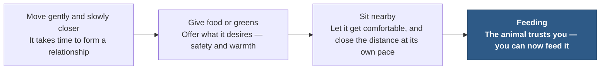

# Chapter 23 — Limiting Beliefs

> *"The moment you're able to locate, identify, and understand them, you place your hand onto a steering wheel that's been left unattended throughout your life."*

Back in Chapter 12, the mindset review came with a warning: it was a flashlight, pointed inward, meant to shine into the dark corners where your own limiting beliefs might be hiding.<!-- Citation: callback to Chapter 12's "A Flashlight for Your Blind Spots" callout, which introduced both "limiting beliefs" and "self-talk" as terms and promised they'd be picked up later in the manual. --> This chapter is where that flashlight finally gets switched on.

You were a kid in school when you were first given a simple plant diagram in science class. The teacher probably walked you through the anatomy of a plant, naming the various parts and reminding you to memorize them for an upcoming test.

---

## Bloom Where You're Planted

We often borrow plant terminology when we talk about people. We use words like *roots* to describe our upbringing or our subconscious mind, and plenty of other plant words to describe our lives. My mother, who has done more for me than anyone on earth, used a plant reference in a quote that has stayed with me my entire life.

> *"Bloom where you're planted."*
> — Charles Huge's mother

It's a simple, brilliant line, and it changed the way I viewed the world as a child. I would continually remind myself to be the best I could possibly be, regardless of where I was planted.

The quote hit a snag when I became an adult.

It's wonderful advice for children or young adults, because young people aren't really in control of where they find themselves. Telling them to bloom wherever they're planted is sound advice — for them. But what about adults? If an adult were to live by this quote, they'd inherently be believing that they have no control over where they're planted. In reality, adults *do* have control over where they're planted, and can change it if needed.

When I considered this quote as an adult, I realized it no longer worked. I was still running a belief that had kept me on track as a child — and as an adult, that same belief was now limiting me.

::: callout
**We do this constantly.** We hold on to ideas that once kept us safe and got us rewarded, even after they've stopped fitting who we are.
:::

---

## The Soil Beneath the Roots

Picture the plant diagram one more time. Remember those roots. My whole life, I thought that's what made a plant work — all those labeled parts are how a plant grows and operates. But there's something missing from most diagrams. People who compare roots to the subconscious mind may well be onto something. Yet if the roots represent the subconscious, what holds up everything the subconscious is doing?

Soil is the reason the plant exists in the first place. The soil holds up the entire plant, nurtures and protects it throughout its life, and governs the plant's location, nutrients, growth, stability, and support. **Our beliefs are the soil.**

As kids, we get almost no choice or awareness over which beliefs get formed as we move through life — just as there's no real awareness of the soil a plant grows in. And much like humans, diagrams of plants almost always forget to draw the soil that supports the plant at all. As we age, our beliefs solidify, making it harder and harder to notice that they even exist — and we carry beliefs from childhood into our adult lives without a single shred of awareness that we're doing it.

::: callout
**Luckily, we aren't a bush or a tree.** Once we become aware of our ability to identify — and then change — the soil we're planted in, everything changes.
:::

Our beliefs govern our lives, literally in every regard. But there isn't just one type of belief. Some of them hide — hidden from our awareness, convinced they'll stay in the dark for our own good, to protect us.

| | **Limiting** | **Helpful** |
|---|---|---|
| **Unconscious** | Unconscious, limiting belief | Unconscious, helpful belief |
| **Conscious** | Conscious, limiting belief | Conscious, helpful belief |

*Table 23.1 — The four kinds of belief. Some limiting beliefs can wear a helpful costume — which is exactly what makes them so hard to spot.*

Since the beliefs we hold run the entire show, it's mission-critical to get up to speed on how to gain control over the beliefs, thoughts, and patterns we carry — not just the ones from childhood, but the ones we've been accumulating our entire lives.

---

## You Can't Delete a Belief — Only Change Your Relationship to It

The idea of "changing your beliefs" is slightly misguided. Our beliefs will largely remain part of our lives. What actually changes is our *relationship* to them — how we choose to hear them when they show up. We have to develop a solid process for gaining control and awareness of our beliefs, because deleting them just isn't a winning plan.

The things we've done a million times — like reciting the alphabet — can't be deleted. No matter how hard you try to delete the alphabet from your mind, it will remain. The only thing you'll succeed in modifying is your own level of frustration and self-doubt.

There's an excellent formula that successful people follow. Most of them do it unconsciously and automatically. Here's a 3-step plan for making it conscious first, so you can eventually make it automatic.

1. **Learn to spot the belief and the limiting self-talk.**
2. **Modify the way the brain sees, hears, and processes that information.**
3. **Keep adding new beliefs to the modified processing method.**

Your beliefs and self-talk are what truly make you who you are. They affect how you move through the world, and they influence the results you get with other human beings. No amount of internet articles about body language, leadership, confidence, or social skills has the capacity to change you if the beliefs and self-talk running the show — in the background, without your awareness — are still in power.

Your beliefs (and from here on, "beliefs" is shorthand for limiting beliefs, self-talk, and limiting thoughts generally) have tremendous power, largely because they go unnoticed. It's simply assumed that their control over you is just a permanent part of your life. The moment you're able to locate, identify, and understand them, you place your hand onto a steering wheel that's been left unattended throughout your life.

---

## Impeaching Limiting Beliefs

::: definition
**Impeachment** — the action of calling into question the integrity or validity of something.
:::

Let's walk through the limiting-belief impeachment process. Get acquainted with your limiting beliefs and your negative self-talk. Learn how to identify precisely when they arrive, and keep track of them as if your success depends on it — because it does.

### The Four Categories

Limiting beliefs come in several forms, but they'll usually fit into four main categories.

1. **Comparing yourself to others.**
2. **Worrying about status or hierarchy.**
3. **Engaging in negative self-talk about capability.**
4. **Self-judgment and self-doubt.**

Even with all the skill in the world, an athlete will fail if they have a trusting relationship with their limiting beliefs. They could have the best physique, the healthiest diet, and the most capability — but if they've decided they aren't deserving of success, or that they aren't good enough to win, those beliefs will rightly come true.

With my clients, I often hear something like, *"Yeah, but I can't,"* or *"I get it, but that's not possible for me because...,"* or *"That might work for some people, but not me, because I'm not able to."* What's ironic is that these comments often show up right after we've just finished talking about limiting beliefs. The client is entirely unaware — they're simply vocalizing their own limiting beliefs in real time, as we're progressing through their training.

There's no need to go on a witch hunt. Once you've made your list of limiting beliefs, leave a few blank pages after it — it's highly likely more will surface as you progress through your training.

### Five Questions That Impeach a Limiting Belief

1. **Do I know an exception to this?**
2. **Is this helpful, or is it limiting my life?**
3. **Does this put me in charge?**
4. **What would a great coach tell me to do?**<!-- ASR? verify: transcribed as "One would an amateur coach tell me to do?" — reconstructed as "What would a great coach tell me to do?" to match the grammatical pattern of the parallel question that follows ("What would Charles tell me?") and the section's purpose of holding a limiting belief up against better outside counsel; "amateur" does not fit that purpose and the exact intended word is uncertain. -->
5. **What would Charles tell me?**<!-- ASR? verify: transcribed as "What would Chase tell me?" — corrected to "Charles," consistent with the established correction of "Chase Hughes" to "Charles Huge" (the author's own name) in Chapters 9 and 21. -->

::: warning
**Danger, warning.** Limiting beliefs can make you feel good — like, really good. They can keep you comfortable, make you feel safe, create feelings of being protected, and convince you that despite doing all you can, you just aren't capable of what other people are. They're sneaky, and sometimes they feel like a warm blanket. But in reality, they are a crippling, destructive force in your life.
:::

Now that you've learned about them, you'll gradually start identifying them as time goes on. The easiest way to spot a limiting belief is to listen for any thought that seems to justify an inability to do something.

---

## Exercise: Spot Your Own Limiting Beliefs

I know you've read and listened to other books with exercises in them, and I also know you likely just did those exercises in your head. Because why not?

Not this time. Get up, get a pen and paper, and start writing. This exercise matters for your progress. Believing you don't actually need to do it is a limiting belief in itself — so if you're feeling resistance to doing this exercise, you may have just identified an important limiting belief in yourself.

From the list below, note any beliefs that might be hindering you from taking action.

- I haven't decided to really engage in life.
- I'm uncomfortable being wrong.
- I have unresolved issues with friends and family.
- I'm not clear on my deepest core values.
- I'm addicted or attached to substances, people, or behaviors.
- I'm currently living a big lie, and most people don't know it.
- It's hard to see myself as massively successful.
- I have financial problems or other major lifestyle concerns.
- I'm missing key, empowering relationships in my life.
- My needs are not being met by others, but I help them meet theirs.
- My thoughts are most often about myself, my own well-being.
- I feel like life works out so well for others, but not for me.
- I've not had access to the same resources as others.
- Successful people succeed because they trick — or [some other negative word] — people.
- I'm under a lot of stress.
- I feel anxiety often when in social settings.
- I feel anxiety when asking clients for money.
- I don't take care of myself or my health the way I should.

### Identifying Limiting Beliefs: The External Version

How would you complete these sentences?

- When I see somebody confidently living with others, I think they must be **___**.<!-- ASR? verify: transcribed as "confidently living with others" — retained as-is; the intended phrase (possibly "confidently living their life" or similar) could not be confirmed. -->
- When I encounter someone with far more money than me, I assume they **___**.
- If someone appears to be in an extremely satisfying relationship, I think they probably **___**.
- When I see ads online promising to deliver the results I want, my initial reaction is **___**.
- When someone gives me advice I know I actually need, my initial reaction is to **___**.
- If someone is getting more attention than me in a business meeting, my reaction is to assume they **___**.
- If someone is more socially skilled than I am, I assume they probably **___**.
- When I see someone confidently ask for money, my reaction is usually to think **___**.
- When I encounter someone with more status than me, my reaction is to **___**.
- If I meet people who compliment me, I **___**.
- If someone tells me I'm not charging enough money, I **___**.

As you go through this list, keep in mind these may only be the *introduction* to your limiting beliefs. Ask yourself why you think these thoughts, and get down to the root of each issue you identify. Ask: is this helping me? Is this thought process holding me back from developing further in my life?

---

## Common Limiting Beliefs, by Domain

### Money

Does the word alone conjure up limiting beliefs? For people of every economic status, the answer is usually yes. Money is something we're programmed to feel a certain way about, usually from childhood — most often by our parents, though sometimes by culture, friends, society, or social media.

Money is a resource that results from helping others, and that you can use to keep helping others. The possibilities are endless in terms of the good money can do in the world. But here are some of the things that stand in the way.

- Money is a source of evil in the world.
- Having too much money can be a bad thing.
- If I have money to spend, I might want to take up drugs or alcohol.
- I have to work to get a salary that's barely enough to sustain me.
- Money is only for paying bills.
- Having money means people will be out to get me.
- I have to have money saved, because I could get into an accident at any time.
- Money is only for spending.
- I will never have as much money as I want.
- I will never save enough money to go on a vacation.
- Money sustains my survival, so I have to have it.
- You only live once — spend money today.
- You only live once — sacrifice today for a better tomorrow.
- Money is hard to get.
- I will only earn money if I work myself to the bone.
- If I want more money, that means I'm greedy.
- Money is not important at all.
- If I think about money, I'm neglecting my spiritual growth.
- I can get a lot of money just from sheer luck.
- I'm not good at managing money.
- I'm not destined to have a lot of money.

As you go through this list, if something sounds familiar, run it through the impeachment process and fully dissect the thought down to its core belief. Don't skip any of them.

### Relationships

As with money, relationships are something we get early training on as children. Many of our limiting beliefs about them are formed unconsciously, then carried into adulthood just as unconsciously. The way we view ourselves in relationships — even in people who otherwise seem healthy and well-adjusted — can be just as imaginary as any other belief.<!-- ASR? verify: transcribed as "The way we view ourselves, even people who seem healthy, is just imaginary." — reconstructed for grammar while preserving the apparent point that self-perception in relationships can be illusory even in people who otherwise seem well-adjusted; exact intended wording is uncertain. --> But these beliefs play a major role in how we see the world, and in what we think we deserve — not only in terms of money, but in terms of people too.

- I have one idea of what a relationship is, and I want nothing other than that.
- I'll only settle for a man or woman who is perfect.
- My relationships aren't working because there's something wrong with me.
- I just want the status of being in a relationship, nothing more.
- I don't want a relationship, because of the negative experiences I've seen growing up — such as between my parents or extended family.
- Having a relationship takes a lot of work — it's something I don't want to invest in.
- Our relationship feels too good to be true. Something bad must happen soon.
- I'm doomed to have bad relationships forever.
- People are only nice to get something out of me.
- No one can truly understand me.

### Health

Bad news: limiting beliefs are things that hide in the dark. Most of us are unaware of how powerful they are in our lives until we do an exercise like this one — and our subconscious mind believes whatever we tell it to believe. Good news: our brains may believe all of these limiting beliefs, but once you identify one, you can rewrite it. The only way to change anything is to start with identification and awareness.

- To achieve good health means spending a lot of money.
- It's too difficult to change my lifestyle.
- There's no time to think about my health.
- I don't want to invest in a gym membership I'll never use.
- I'll never lose as much weight as I'd like.
- It's too much hard work.
- Healthy food tastes horrible.
- I don't feel like I can follow through on any health plan.
- I can't afford a personal trainer.
- People make fun of me — call me a health nut.
- I really don't know what "healthy" means.
- I'm as healthy as I can be and don't need to make any changes.
- It's too complicated to keep track of health monitors.
- I don't have the energy to exercise.
- I don't want to wake up earlier than I usually do.
- I love sugar and carbs too much.
- I'm surrounded by unhealthy food.
- I don't want to sweat.
- Healthy is not for me.
- Giving up energy drinks and red meat is enough.

### Working

We're rarely conscious of our own thoughts, and our thoughts about work are often buried deepest of all. Earning money is something we all have to do — how we do it differs, and what differs even more is how we *view* it, and how those beliefs shape our everyday lives.

- Work is a modern form of slavery.
- I will not settle for anything less than my dream job.
- I will never get my dream job.
- What I do for work is too hard.
- Work takes up too much of my time.
- If I enjoy my job, it's not really work.
- If I don't enjoy my work, I'm doing it right.
- My work forces me to do things I don't want to do — wake up too early, commute, and so on.
- I'm not happy at my current job.
- All the good jobs are taken.
- The economy is bad.
- It's too late for me to get the training I'd need for the job I want.
- I'm in the wrong line of work.
- My colleagues are out to get me.
- Everyone at my work is better than me.
- I wish I could do less work for more money.
- I don't have time for a social life.

### Yourself

Self-confidence can be affected by our limiting beliefs about money. One of them can lead us down a path where we believe that having more money equals being more confident, and therefore happier. But this is cruelly untrue, and it can lead to further damage to your self-image — or to whatever it is that actually makes you feel unique and special. It downplays your self-worth in the long run.<!-- ASR? verify: this intro paragraph was heavily garbled in the transcript ("can lead to further damage to your self image, or won't you feel makes you unique and special. This downplays on your self-worth in the long run.") and has been reconstructed to carry a coherent, grammatical meaning consistent with the surrounding point about money-based self-worth; the author's exact original wording is uncertain. -->

- I will never be happy until I have expensive things.
- People will not pay attention to me or love me if I have no money.
- I need the latest of everything on the market to be happy.
- Happiness means giving up on the physical world entirely.
- I am not worthy of attention.
- I have nothing to give to other people, to society, and so on.
- I'm perfect and do not need to change.
- I will forever remain imperfect and flawed.
- I was born in the wrong era, or the wrong generation.
- People will never understand the real me.
- I was doomed to failure from the day I was born.
- It's someone else's fault that I'm not successful.
- If that event hadn't happened, I'd be rich right now.
- Being in debt is a never-ending hole.
- I don't have the time to work on myself.
- There will always be people better than me.
- Being successful means being number one at everything.
- I failed before, so I will fail again.
- I'm too stupid to be successful.
- I wasn't born into the same circumstances as others.

<!-- Citation: the author states these lists are "partially paraphrased from positivecreators.com" — verified via web search; positivecreators.com/list-of-limiting-beliefs/ is a real, existing page ("The Ultimate List Of 101 Limiting Beliefs That Hold Us Back"), and several items above (e.g., the health-belief items about monitors, energy, waking early, sugar/carbs, unhealthy surroundings, sweating) closely match language on that page. Attribution retained as stated by the author. -->

These lists have been partially paraphrased from positivecreators.com.

---

## The Ten I Hear Most Often

Of everything above, these are the limiting beliefs I see most often in my own clients.

1. I don't deserve to make money doing what I love — it should be a hard process.
2. I'm not good enough.
3. I don't have enough experience.
4. If I take action, the consequences could be really bad.
5. People don't listen to me.
6. No one appreciates me.
7. Things don't work out for me.
8. People can't have everything they want.
9. Getting sick is unavoidable.
10. I am helpless to heal myself.

---

## Taming the Wild Animal

Your thoughts are like a wild animal. To control them, you first have to let them run, and make space for them. Like an animal, you have to befriend them — build a positive relationship, and build trust with the systems operating in your subconscious mind. And like an animal, your thoughts don't respond to the spoken word — so use the same techniques you'd use to befriend a wild animal.

*Figure 23.2 — Befriending a limiting belief follows the same four-step sequence used to earn the trust of a wild animal: it cannot be commanded, only won over.*

::: callout
**Identify your limiting beliefs. Make them visible. Embrace them, then rewrite them.** The further a limiting belief is dragged into the sunlight, the more control you have over it. Are you willing to make the effort? The reward is a completely new life.
:::

Identifying your personal limiting beliefs is the beginning of your journey. The next phase of your development as an operator happens when you bring mastery into the parts of your life that not everyone can see. In the coming section, you'll see that what you do when no one's looking has a serious impact on your authority.<!-- ASR? verify: transcribed as "in the common section, you will see..." — corrected to "coming section," a near-homophone that fits the sentence's function as a bridge into upcoming material; exact wording of the original bridge line to the next chapter could not be confirmed. -->

---

## Key Takeaways

- **"Bloom where you're planted" works for children, not adults.** Kids have no control over where they're planted, so the advice is sound. Adults do have control over their soil, and can change it — clinging to the child's version of the belief as an adult quietly turns a once-protective idea into a limiting one.
- **Beliefs are the soil, not the roots.** Roots (the subconscious) get all the attention in the plant metaphor, but the soil beneath them — your beliefs — is what actually governs location, nutrients, growth, stability, and support. It's the layer almost every diagram, and almost every person, forgets to draw.
- **Beliefs come in four flavors: conscious/unconscious, crossed with limiting/helpful.** Some limiting beliefs disguise themselves as helpful ones, which is exactly what makes them dangerous.
- **You cannot delete a belief — only change your relationship to it.** Like the alphabet, deeply repeated beliefs can't be erased; trying only produces frustration and self-doubt. The 3-step alternative: spot the belief and its self-talk, modify how the brain processes it, then keep feeding new beliefs into that modified process.
- **Impeachment means calling a belief's integrity or validity into question.** Limiting beliefs fall into four categories — comparing yourself to others, worrying about status or hierarchy, negative self-talk about capability, and self-judgment or self-doubt. Five questions impeach them: Do I know an exception to this? Is this helping or limiting my life? Does this put me in charge? What would a great coach tell me to do? What would Charles tell me?
- **Limiting beliefs feel good — that's the danger.** They create comfort, safety, and a sense of protection, which is precisely why they're so hard to give up.
- **Do the exercises on paper, not in your head.** Resistance to writing them down is itself a limiting belief worth noticing.
- **Common limiting beliefs cluster around money, relationships, health, work, and yourself** — run any that sound familiar through the impeachment process rather than skipping past them.
- **The ten most common beliefs Charles hears from clients** range from "I don't deserve to make money doing what I love" to "I am helpless to heal myself" — all worth checking against your own self-talk.
- **Your thoughts are a wild animal, not a machine to be commanded.** Befriending them takes the same four steps as taming any wild animal: move closer slowly, offer what they desire, sit nearby until they're comfortable, and only then can you feed them.
- **Identify. Make visible. Embrace. Rewrite.** The further a limiting belief is dragged into the sunlight, the more control you have over it — and the reward is a completely new life. The next stage of development is mastering what you do when no one's watching.

<!--
## Change Log

| Original (transcript) | Corrected | Reason |
|---|---|---|
| "Bloom, where you planted. Bloom where you're planted." | "Bloom where you're planted." | Grammar/ASR repair of a garbled repetition into the single clean line the author is quoting. |
| "The quote hit a snag when I became an adult." (placement) | Retained, restructured as its own beat | No content change; repositioned as a standalone line for emphasis. |
| "My whole life, I thought that's what makes a plan to work." | "My whole life, I thought that's what made a plant work." | ASR mishearing ("plan" → "plant"), consistent with the rest of the paragraph. |
| "People who compare the roots to the subconscious mind may well be onto something." | Retained | No change. |
| "Much like the plans, there's no real awareness of the soil." | "Much like the plants, there's no real awareness of the soil." | ASR mishearing ("plans" → "plants"). |
| "As we age, our beliefs become solidified, making an other and harder to gain awareness that they even exist." | "As we age, our beliefs become solidified, making it harder to gain awareness that they even exist." | Grammar repair of a garbled clause ("making an other and harder"). |
| "Some limiting beliefs can wear a helpful costume." | Retained | No change; reused as the caption for Table 23.1. |
| "My brain clients, I often hear something like..." | "With my clients, I often hear something like..." | ASR mishearing ("My brain clients" → "With my clients"). |
| "Guess acquainted with your limiting beliefs and negative self-talk." | "Get acquainted with your limiting beliefs and negative self-talk." | ASR mishearing ("Guess" → "Get"). |
| "One would an amateur coach tell me to do?" | "What would a great coach tell me to do?" | ASR mishearing/reconstruction — flagged inline as uncertain; see the inline comment at point of use. |
| "What would Chase tell me?" | "What would Charles tell me?" | Corrected per the established pattern from Chapters 9 and 21, where "Chase Hughes" is corrected to "Charles Huge" (the author's own name); flagged inline. |
| "I am helpless to heal myself." (list) | Retained | No change. |
| "The way we view ourselves, even people who seem healthy, is just imaginary." | "The way we view ourselves in relationships — even in people who otherwise seem healthy and well-adjusted — can be just as imaginary as any other belief." | Grammar reconstruction of a garbled sentence; flagged inline as uncertain. |
| "Self-confidence can be affected by our limiting beliefs regarding money. ... can lead to further damage to your self image, or won't you feel makes you unique and special? This downplays on your self-worth in the long run." | "Self-confidence can be affected by our limiting beliefs about money. One of them can lead us down a path where we believe that having more money equals being more confident, and therefore happier. But this is cruelly untrue, and it can lead to further damage to your self-image — or to whatever it is that actually makes you feel unique and special. It downplays your self-worth in the long run." | Grammar reconstruction of a heavily garbled paragraph; flagged inline as uncertain. |
| "Being in debt is a never ending whole." | "Being in debt is a never-ending hole." | ASR mishearing ("whole" → "hole"). |
| "I'm not born into the same circumstances as others." | "I wasn't born into the same circumstances as others." | Light grammar/tense repair for consistency with the surrounding first-person list. |
| "When I see somebody confidently living with others, I think they must be." | Retained as-is, formatted as a fill-in-the-blank | Ambiguous phrase; flagged inline rather than guessed. |
| "I said no, it can be comfortable with you. Allowing it to get closer. When it's ready, it will get closer." | "Sit nearby. Let it get comfortable, and close the distance at its own pace. When it's ready, it will come closer." | Grammar reconstruction of a garbled sentence, folded into the trust-building sequence. |
| "In the common section, you will see that what you do when no one's looking has a serious impact on your authority." | "In the coming section, you'll see that what you do when no one's looking has a serious impact on your authority." | ASR mishearing ("common" → "coming"), flagged inline as the closest coherent reading. |
| "The next phase of your development as an operator happens when you bring mastery into the parts of your life. But not everyone can see." | "The next phase of your development as an operator happens when you bring mastery into the parts of your life that not everyone can see." | Grammar repair merging two garbled fragments into one clear sentence. |
-->
