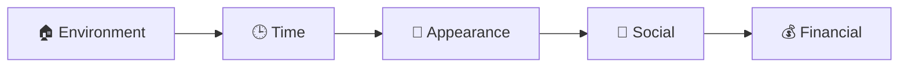

# Chapter 24 — The Mastery Zones

> *"You're not overbooked. You're overprioritized."*

Back in Chapter 7, the Habits side of the Authority Triangle was named but not yet unpacked: Environment, Time, Appearance, Social, Financial — the lifestyle areas that leak into nonverbal behavior and silently discount the authority others assign to you, whether or not they can say why.<!-- Citation: callback to Chapter 7's "Side H — Habits" and its "Habits Cascade" callout, which named the five mastery zones and promised a full assessment "in the authority section of this manual." --> This chapter is where that promise comes due — along with a downloadable tool to measure yourself against all of it, and a hard look at two lies our culture tells us about why change so often fails to stick.

---

## The Mastery Zones

The mastery zones are the areas of your life that need to be brought under control so that your subconscious signals align to broadcast the behavior that triggers followership. They are meant to be mastered **in order** — Environment, then Time, then Appearance, then Social, then Financial. Each one feeds into the mastery of the next, which makes the transition into the following zone easier.

::: callout
**Why order matters.** We have a limited supply of willpower and discipline to spend each day. Mastering one zone at a time doesn't just make the work easier — it helps you avoid burnout. Motivation and mood play a vital role in how much willpower you have on a given day, and diet and exercise make a huge difference in both.
:::

*Figure 24.1 — The five mastery zones, in mastery order. Each zone's control feeds into the next, so willpower is spent where it compounds instead of being spread thin across all five at once.*

### Environment

The environment zone is simply your surroundings — your office, your home, your car. Mastering it means getting the objects and things around you under control: organizing, cleaning, and building environment systems that keep everything in its place. That control supplies the platform everything else is built on.

In your home, get organized and take appropriate action the moment it's needed. Don't walk past a mess. Don't leave dishes undone, or ignore a pile of laundry staring you in the face. Spend the time you need getting control of your environment — get help if you need to.

Rate yourself honestly, on a scale from 1 (very low) to 5 (very high), for each of the following:

| # | Statement |
|---|---|
| 1 | My ability to maintain the cleanliness of my environment. |
| 2 | My ability to never leave a mess. |
| 3 | My ability to handle disorganization immediately. |
| 4 | My ability to never walk past a mess. |
| 5 | My ability to maintain a clear and clean workspace. |
| 6 | My ability to remove excess items from my vehicle upon exiting. |
| 7 | My ability to prioritize tasks that allow my future self to thrive in an organized and clean environment. |
| 8 | My ability to create routines that support organization and order. |
| 9 | My ability to inspire others to follow my behavior. |
| 10 | My ability to maintain an organized electronic ecosystem for myself — files, desktop, e-storage. |
| 11 | My ability to remain focused on maintaining cleanliness and order when stress is present. |
| 12 | My ability to maintain control over my desire to leave it until tomorrow when it comes to picking up after myself. |

*Table 24.1 — Environment self-rating. Score each statement 1–5, then set your goal one level above your current score.*

### Time

The time zone is all about your control of your time and your ability to prioritize. Start using a calendar for everything, and stick to your plans. Set aside an hour a week — Sunday night is best — to plan the week ahead. When you have long-term goals, break them down into monthly, weekly, and daily milestones, then use that list to feed your calendar.

One of the biggest problems people run into when trying to master their time is getting overwhelmed. In my experience, this typically comes from a single point of failure: **assigning equal weight to tasks.**

::: callout
**The priority principle.** Setting your top five priorities, and thinking of everything else in terms of priority, is the only way you'll ever have time to master your time. If you assign *Grey's Anatomy* the same weight as an important project or time with your kids, of course it will feel like you're overbooked. You're not overbooked. You're overprioritized.
:::

Rate yourself honestly, on a scale from 1 to 5, for each of the following:

| # | Statement |
|---|---|
| 1 | My ability to maintain a schedule. |
| 2 | My ability to plan a week in advance. |
| 3 | My ability to set goals and divide them into milestones. |
| 4 | The likelihood that I will frequently review my goals and milestones. |
| 5 | The likelihood that I will review my calendar or planner at the beginning of each day. |
| 6 | My ability to say no when lower-priority requests or tasks are presented to me. |
| 7 | My ability to experience calm enjoyment during tasks I would rather not do. |
| 8 | My ability to experience calm enjoyment in busy or stressful times. |

*Table 24.2 — Time self-rating. Score each statement 1–5, then set your goal one level above your current score.*

### Appearance

As you've seen in the many studies referenced throughout this book, appearance matters a lot. Getting a grip on yours cannot be accomplished overnight — it requires lifestyle changes in fitness, diet, and posture. Appearance isn't only about the physical, though that's a crucial component. Everything from the way you cross your arms to the way you walk, dress, and carry yourself tells people who you are, on both a conscious and unconscious level. Even people who claim they don't judge have an authority radar that has no problem judging the hell out of you.

Seek assistance wherever possible. Explore every method available to overhaul your appearance and elevate it into the authority zone. Walking differently, for example, takes a lot of practice — but unless you develop the internal qualities that trigger authority, walking confidently becomes a *byproduct* of developing yourself. Our culture is obsessed with quick fixes, so it may seem like the answer is as simple as faking how you walk. It isn't. When you change internally, the way you present yourself externally changes automatically. There is no need to fake anything at all.

**The Appearance of Authority** — here is what it actually looks like, trait by trait:

- Well groomed
- Clothing appropriate to context — clean and free of wrinkles
- Skin clear and bright
- Teeth clean and bright
- Erect posture, slow body movements, a slower eye shutter speed
- Very little facial touching
- Deepened, deliberate breathing
- Connected, genuine eye contact
- Avoidance of trends and fads
- A healthy body, with an appropriate weight-to-height ratio
- Good hygiene
- A lack of reservation in speech and movement

Make a list of what you'd like to modify about yourself, and what you'd like to change about your habits and lifestyle choices. Use a three-column list — **habits, lifestyle, and visual** — to set goals. Keep setting goals and milestones for as long as you need to in these areas, and build your ideal self.

::: warning
**Remember.** Although it may seem unfair, appearance matters more in social settings than accomplishments or achievements do. The reference section of this manual includes dozens of journal articles describing the extreme social effects of physical attractiveness.
:::

Rate yourself honestly, on a scale from 1 to 5, for each of the following:

| # | Statement |
|---|---|
| 1 | My ability to eat healthy foods despite my desire to do otherwise. |
| 2 | My ability to maintain a hygiene regimen on a daily basis. |
| 3 | My ability to keep my appearance in line with perceived authority figures in my own culture or social sphere. |
| 4 | My overall physical appearance of health. |
| 5 | The rating a stranger would estimate as my health, if only given a photo of me. |
| 6 | The rating a stranger would estimate as my diet, if only given a photo of me. |
| 7 | My ability to dress and present myself like a respected authority. |
| 8 | My ability to move confidently and deliberately in the presence of stressful, authoritative, or domineering stimuli. |

*Table 24.3 — Appearance self-rating. Score each statement 1–5, then set your goal one level above your current score.*

### Social

You will become the people you spend the most time with. Our parents cautioned us against hanging out with the wrong crowd when we were kids, and they were right — the fact is, when we grow up, we keep being heavily influenced by the people we spend our time with. Jim Rohn famously said that we are the average of the five people we spend the most time with.<!-- Change: "Jim Roan" corrected to "Jim Rohn," verified via web search as the motivational speaker credited with popularizing this exact idea. --> Your social circle matters. Your social behavior matters.

The social zone requires you to develop new skills in conversation, nonverbal communication, and social behavior. It also requires making sure you're spending time with people who won't unconsciously diminish your authority.

Rate yourself honestly, on a scale from 1 to 5, for each of the following:

| # | Statement |
|---|---|
| 1 | My ability to converse with people I don't know. |
| 2 | My ability to converse with people of higher status than mine. |
| 3 | My ability to make new friends through in-person interactions. |
| 4 | My ability to admit fault when I'm wrong. |
| 5 | My ability to accept compliments from others gracefully. |
| 6 | My ability to introduce people. |
| 7 | My ability to tell a good story. |
| 8 | My ability to make small talk to build rapport. |
| 9 | My ability to ask a neighbor I don't know well to turn the music down without a fight. |
| 10 | My ability to make a stranger laugh. |
| 11 | My ability to be vulnerable and open in conversations. |
| 12 | My ability to address difficult situations with people close to me. |
| 13 | My ability to address difficult conversations with people at work. |
| 14 | My ability to stay present and out of my head during conversations. |
| 15 | My ability to issue orders when it's appropriate. |
| 16 | My ability to ask a stranger for a favor. |
| 17 | My comfort with overseeing a person or group of new people I don't know well. |

*Table 24.4 — Social self-rating. Score each statement 1–5, then set your goal one level above your current score.*

Build your list of personal-development goals from your scores on the points above. If you'd like even more honesty, ask a friend to rate you on each of them — this ensures you aren't being deceptive with yourself. Work to develop yourself socially, and remove negative people from your life who are hurting your ability to achieve the outcomes you want. If a negative influence is in your life for good, or is part of your family, try as hard as you can to only engage with them at their best and in their best moments.

### Financial

Your financial situation has less to do with your bank account balance and more to do with how you handle money. Financial problems are one of the biggest reasons people commit suicide, get divorced, and go on antidepressants in the United States. Gaining control of your financial situation goes a long way toward shutting down the nonverbal signals your brain sends about financial stress.

Something as simple as making a budget, seeing a financial advisor, and starting a new financial plan can completely change the way you're perceived by others. When you discover the path away from financial stress, and see relaxation waiting in the future, the physical and visible effects you exhibit in conversation are often immediate. The financial habits and discipline you develop put you mentally above the crowd — and people will feel it.

Rate yourself honestly, on a scale from 1 to 5, for each of the following:

| # | Statement |
|---|---|
| 1 | My ability to manage finances and plan for the future. |
| 2 | My ability to focus my spending on my future happiness. |
| 3 | My ability to resist impulse purchases. |
| 4 | My ability to pay bills on time or early. |
| 5 | The rating a bank would give my credit score, on a 1–5 scale. |
| 6 | My ability to stay out of unnecessary debt. |

*Table 24.5 — Financial self-rating. Score each statement 1–5, then set your goal one level above your current score.*

---

## The Huge Authority Inventory

> *"The world will ask you who you are. And if you don't know, the world will tell you."*
> — Carl Jung<!-- Citation: this quote is widely attributed to Carl Jung across quotation sites, but its presence in Jung's own published writings could not be independently confirmed via web search. Retained as commonly attributed, consistent with how the source material presents it. -->

The **Huge Authority Inventory (HAI)** was developed to rapidly identify lifestyle and behavioral areas of strength and weakness.<!-- Change: "Hughes Authority Inventory" corrected to "Huge Authority Inventory." No prior chapter uses "Hughes"; the author's own name — used consistently as "Charles Huge" throughout the book's frontmatter and text — makes "Huge" the clear intended reading, and the acronym HAI still holds. --> This assessment pinpoints the areas where you need the most improvement when it comes to your ability to convey authority.

There are countless business books that encourage people to ignore their shortcomings and focus only on their strengths and positive traits. I find this entirely ridiculous.

::: warning
**The child failing two classes.** Imagine a parent telling a child to ignore the two classes they're failing, and to focus instead on art and PE — the classes they're doing well in — while the rest keep failing. No parent would accept that. Yet this is exactly what "focus on your strengths" advice asks adults to do with their own lives.
:::

Imagine doing this with a car. If your engine needed $2,000 worth of repairs, and all you had was $2,000, would you spend it on a new paint job because the exterior is the most important part? No. Hopefully, you'd spend the money on the parts that needed the most improvement.

When it comes to authority, your **low** scores on this assessment are what shine a bright light on the areas of your life that need the most work. Low scores are the key reason operators fail when it comes to influence and persuasion. The HAI evaluates you across many dimensions, helping you know yourself better while establishing appropriate goals to raise your scores where they're needed.

::: definition
**The Huge Authority Inventory (HAI)** — a two-part self-assessment: a **behavior traits evaluation** covering the five Authority Behavior Traits (Chapters 16–20), and a **lifestyle assessment** covering the five mastery zones (this chapter). Together, they are the formal, printable version of the "Authority Self-Assessment" promised back in Chapter 15.
:::

### Behavior Traits Evaluation

Download the HAI from the visual resources and print it. Mark next to each behavior trait the level that applies to you, and set goals appropriate to your score. If most of your marks land at level three, for example, your goal isn't level five — your goal is to move to the *next* highest level. If you scored low — a one or a two — your goal is to move as fast as possible to a three or a four.

The authority behavior traits evaluated are **Confidence, Discipline, Leadership, Gratitude, and Enjoyment** — the same five traits named on the Behavior side of the Authority Triangle in Chapter 7, and covered in depth across Chapters 16 through 20.

### Lifestyle Assessment

Next is the lifestyle assessment. Each of the lifestyle traits discussed in this chapter — Environment, Time, Appearance, Social, and Financial — is evaluated here. Mark each statement from one to five: one meaning your ability is very low, five meaning it's very high.

For each low score, there's a self-exploration journey to take, to discover *why* the score is low. In many instances, you'll find that the low score leads back to a limiting belief, or a personal behavior pattern that needs to change in order to develop authority in your life.<!-- Citation: direct thread back to Chapter 23's "Limiting Beliefs," which promised that low scores elsewhere in the manual would often trace back to exactly this. -->

### Scoring Your Results

All people are different. If you scored low on a lifestyle item, your priority is to discover the personal beliefs, behaviors, habits, or routines allowing it to occur — then build a plan to level up the *lowest* section first. If you scored lowest in the social section, for example, you'd need to get that section handled first, and your goal-setting priorities would need to address it first.

The same principle applies when scoring the authority behavior trait section. If discipline was the lowest of the five traits, that's the single largest factor hindering your ability to influence and persuade people.

::: callout
**Always leverage the correction of weakness over the empowering of strong points.** It's easier to focus on strong points — that's why books telling people to only think about their positive traits sell so well. But if one behavior is holding you back from being influential, fixing that behavior is more powerful than leveraging something that was never causing you to fail in the first place.
:::

---

## The Dopamine Deception

There are two massive lies destroying people in today's world. Your doctors, teachers, the media, social media, marketing, your friends, and even your coaches lied to you about them. The sad part is that they likely didn't know they were lying — because they were lied to as well.

From addiction to psychological disorders, these two lies are holding people back psychologically, and keeping them from reaching their potential to change the world. I realize this may seem overly dramatic, but understanding the importance of this point is vital to me as your mentor. Once you're aware of these two lies, you may decide to use them to take control of a situation — or you may decide to use them to help someone else, or yourself, develop beyond what you thought was your potential.

### The Two Lies of Our Culture

These two lies present a crippling problem: we believe them without realizing we've been programmed to do so, and we live our lives as if they were truth. The scary part is that we aren't conscious of them, and they impact our lives every day without us noticing.

| # | The Lie | The Problem It Creates |
|---|---|---|
| 1 | **Pleasure is happiness.** | We confuse or ignore the difference between pleasure and happiness — a state I call **pleasure rich and happy poor**. |
| 2 | **The details are all that matter.** | We focus on symptoms and ignore the cause of issues — a condition I call **cause blindness**. |

*Table 24.6 — The two lies of our culture, and the problem each one creates.*

### Pleasure Rich, Happy Poor

::: definition
**Pleasure rich and happy poor** — the condition of a person who, unaware of the difference between pleasure and happiness, continually and unsuccessfully seeks to fulfill themselves. It causes people to unknowingly chase situations that produce pleasure (dopamine), while expecting to experience happiness (serotonin).
:::

In many cases, this condition leaves a person feeling increasingly unfulfilled. Most depression and anxiety are the result of unmet expectation. This condition causes the unmet expectation to be experienced unconsciously, while the feelings of unfulfillment are felt consciously and intensely. Individuals are often unable to identify the cause of these deep feelings of unfulfillment — which leads to even more depression or negative emotion.

### Cause Blindness

::: definition
**Cause blindness** — the tendency of a person or group to focus on symptoms in order to fix an issue, while ignoring the root cause. It is equally present when individuals or groups pursuing a goal mistakenly focus on attaining the *symptoms* of having reached that goal, rather than the goal itself.
:::

American comedian Daniel Tosh spoke to this, likely without even knowing it, in a stand-up bit for television:

> *"Money doesn't buy happiness. Do you live in America? Because it buys a WaveRunner. Have you ever seen a sad person on a WaveRunner? Have you? Seriously, have you? Try to frown on a WaveRunner. You can't."*

Here are a few examples of cause blindness in everyday life:

| Who | The Symptom They Chase | The Cause They Ignore |
|---|---|---|
| A doctor | Prescribes medication to treat the symptom | An illness rooted in poor diet and lack of exercise |
| A coach | Drills strong body language for a presentation | Body language is a *symptom* of confidence, not confidence itself |
| A politician | Stirs up a crowd over a surface-level issue | The cultural cause underneath the issue |
| A corporate CEO | Mandates that salespeople use the client's name in the first 60 seconds | Using a name early isn't a tactic — it's a symptom of caring about people and having good social skills |
| A young man | Buys the same shoe brand as his favorite athletes | The training, discipline, and gifts that made the athlete |
| A man | Orders the gear real Navy SEALs use | The selection, training, and mindset that make someone a SEAL |
| A body-language expert | Writes an article on the body-language symptoms of confidence | Good posture is a symptom of confidence — not its cause |
| A therapist | Recommends daily meditation, citing research that less-anxious people meditate daily | A possible deficit in neurotransmitters, unresolved trauma, or poor life skills |
| A self-help expert | Tells people to make their bed every day | Making the bed is a symptom of being driven — not a way to build drive |
| A magazine article | Lists the daily routines of highly productive people | Never mentions that they all eat well, exercise, and meditate |
| Someone | Buys a car they can't afford after seeing a successful person drive one | The car is a symptom of success, not its source |

*Table 24.7 — Eleven everyday examples of cause blindness: the symptom chased versus the cause ignored.*

In the CEO's case, the pattern doesn't stop with one salesperson — the company keeps mandating the symptom of good social skills company-wide, without ever developing the actual skills that create those behaviors in the first place.

Even professional academics are guilty of this. Researchers may observe that confident people display excellent posture, and publish a paper showing the correlation. A tribe of experts then publishes articles about how good posture can *give* you confidence — completely ignorant of the fact that good posture is a symptom of confidence, not its source.

Doctors around the world are more focused on symptoms than causes. Our political debates narrowly fixate on small symptoms of major issues, while the major issues themselves go ignored. Self-help books promise to fix a long list of problems, but reading through many of them only gives a false feeling of having achieved something — because the book helped you attain some of the *symptoms* of the desired result, without ever delivering the result itself.

There are millions of articles online detailing how to build confidence, achieve discipline, or get thin and healthy. The makeup industry is built on this same principle: promoting products that simulate the appearance of health — makeup that gives skin the *symptoms* of being healthy. In politics and medicine, self-help and coaching, symptoms have somehow become more important than causes. Cause blindness is present in just about every industry you could examine.

### Why Experts Fail — Targeting the Wrong Brain

Consider how experts deal with solving critical issues like addiction, eating disorders, diet problems, exercise routines, and medication regimens. Why do they all fail so often? Because the experts fail to recognize the critical role of dopamine. They ask patients to follow a new routine or adopt new habits, when what they should be trying to do is remap the brain's dopamine centers.

Why do coaches fail so often at helping someone achieve a major life goal, or change their psychology about money? Everyone has a learned dopamine pattern already in place that must change before anything else can occur. This is non-negotiable. The **reticular activating system (RAS)** needs to be reprogrammed — but so many experts focus on the wrong part of the brain to alter behavior. Understanding this point of failure is vital to your ability to modify your own behavior, as well as to influence or modify the behavior of others.

To illustrate, take diet routines as an example. They fail so frequently because they completely ignore the actual methods necessary to change diets in real life. The brain's **reticular formation** does not prioritize the new diet, and the **VTA (ventral tegmental area)** is hardwired to seek out completely different behavior than the one that's desired.

Rewiring the reticular formation — the reticular activating system, introduced in Chapter 11 — is hard, but it can be done. Remember: the lower parts of the brain don't operate the way we do. We deal in ideas and language. It deals in emotions, impulses, and reactions. It can't speak English, yet we keep trying to use English to rewrite it.

::: warning
**This method is doomed to fail from the moment it begins.** Rewiring the lower brain takes repetition and emotional involvement — not explanation. We have to use the FATE Model to control and rewire the lower parts of the brain and change any behavioral pattern.
:::

Here's a quick breakdown of behavioral rewiring, in order of importance:

1. Use the **FATE Model** to change the lower, animal brain.
2. Use the **6 Axis Model** to change the upper, human brain.

### The Black Triangle and the Red Triangle

In the visual resources, there is a black triangle and a red triangle. The **black triangle** is what it looks like, in diagram form, when a doctor or coach tries to modify a patient's behavior by targeting thoughts, ideas, and desires. These are arguably important — but they are the wrong levers. They are the least effective triangle.

The **red triangle** represents what should actually be changed in order to modify behavior. The points of the black triangle are what wire the brain — and in doing so, they create the red triangle. Hundreds of repetitions of a person's thoughts, ideas, and desires create **habits**. Those habits then become a source of **dopamine**, tracked by the VTA. Dopamine's reward signal tells the reticular formation to keep searching for these things. Experts target the things that don't matter much, and ignore the neuroscience of behavioral change — making the same mistake as the amateurs.

::: warning
**The huge mistake.** Everyone assumes that psychology alone will change behavior, and ignores the physiology. The black triangle represents the psychological elements of behavioral change; the red triangle shows the physiological elements — and the physiological is what sits at the core of all behavior.
:::

It's true that changing behavior may *begin* with modifying thoughts, desires, and ideas. But targeting these elements alone will not produce anything real. It's like taking out a mortgage for the blueprint of a house — you're spending money on ideas instead of something tangible. We are all taught that the problems in our lives occur because of issues with the black triangle — again, ignoring physiology.

Coaches and doctors struggle to get their clients and patients to comply with new behaviors, and most of their efforts end in failure. To succeed in changing behavior, every action must be focused on the red triangle — targeting the physiological aspects of change, instead of the simple ideas that make us feel like something might be happening.

### Pleasure Versus Happiness

Our culture is wired to seek pleasure while desiring happiness. We're bombarded from a young age by marketing, ads, television, and media telling us there's no difference between the two. This blurring of lines was a deliberate, calculated effort to sell products and build a consumer culture. From college professors and parents to news anchors and celebrities, we're consistently overloaded with information that wires us to conflate happiness and pleasure — to think they're one and the same.

Pleasure and happiness are neurochemically similar, which is one reason they're so often confused. The other reason is our culture, with advertising and media constantly trying to trick our minds into conflating the two.

| | Pleasure | Happiness |
|---|---|---|
| **Driven by** | Dopamine | Serotonin |
| **Feels like** | A momentary surge that feels good, then fades | Connection, and a sense that things are as they should be |
| **What follows** | We continue seeking more of it | — |

*Table 24.8 — Pleasure versus happiness. Neurochemically similar enough to blur together, but built for entirely different jobs.*

Over time, depression and suffering can grow exponentially in a person who is seeking pleasure while expecting to arrive at happiness.

When dealing with subjects, understand that this knowledge can be leveraged using a person's bribes.<!-- ASR? verify: transcribed as "a person's bribes" — most likely intended as something closer to "a person's drives," given the very next sentence promises methods "to identify a person's sources of dopamine in under a few minutes." Retained as transcribed pending verification. --> Later, you'll learn the methods to identify a person's sources of dopamine in under a few minutes. Remember that this applies to yourself as well — the more you understand how to modify neurochemicals in yourself, the more you'll see how to leverage the neurochemistry of others.

I recognize that this section on becoming persuasive is extremely dense. I've packed in enough resources to last an entire year as your mentor — be sure to continually refer back to them when you need advice, guidance, or reminders. As you develop yourself as an operator, keep in mind that while the other sections of this manual cover how to persuade *people*, this section is about becoming persuasive yourself. They are entirely different things.

Next, we're going to cover the Behavioral Table of Elements — and I'm going to show you how to leverage behavior profiling like a world-class interrogator.

---

## Key Takeaways

- **The five mastery zones — Environment, Time, Appearance, Social, Financial — are mastered in order,** each feeding into the next. Willpower and discipline are finite each day, so tackling one zone at a time avoids burnout; mood, motivation, diet, and exercise all shape how much willpower is available.
- **Environment mastery means never walking past a mess** and building routines and organized systems — physical and electronic — that hold up under stress.
- **Time mastery fails at a single point: assigning equal weight to every task.** Set your top five priorities and think in terms of priority, or you'll feel perpetually overbooked when you're really just overprioritized.
- **Appearance is never faked successfully.** Confident posture, movement, and presence are byproducts of real internal development — not a costume you can put on independent of the inner work.
- **You become the average of the people you spend time with (Jim Rohn).** The social zone requires new conversational and nonverbal skills, and honest pruning of relationships that unconsciously diminish your authority.
- **Financial discipline shuts down a major source of unconscious stress signaling.** A budget and a plan change how you're perceived, often immediately.
- **The Huge Authority Inventory (HAI)** is a two-part, printable self-assessment: the behavior traits evaluation (Confidence, Discipline, Leadership, Gratitude, Enjoyment — Chapters 16–20) and the lifestyle assessment (the five mastery zones above).
- **Always correct weakness before you leverage strength.** Your lowest score — whether a mastery zone or an authority trait — is the single largest factor holding back your influence, and low scores often trace back to a limiting belief (Chapter 23).
- **Two lies run beneath modern life: "pleasure is happiness," and "the details are all that matter."** They produce, respectively, **pleasure rich and happy poor** (chasing dopamine while expecting serotonin) and **cause blindness** (fixing symptoms while ignoring root causes) — present in medicine, politics, self-help, and the makeup industry alike.
- **Behavioral rewiring has a strict order of operations:** the FATE Model changes the lower, animal brain; the 6 Axis Model changes the upper, human brain. Reversing the order fails, because the lower brain doesn't process language — it processes repetition and emotion.
- **The black triangle (Thoughts, Ideas, Desires) is the wrong lever; the red triangle (Habits, Dopamine/VTA, RAS Search) is the right one.** Hundreds of repetitions of the black triangle are what wire the brain into the red triangle — and only targeting the red triangle produces real, durable behavior change.
- **Pleasure (dopamine) is a momentary surge that fades and demands more; happiness (serotonin) comes from connection.** Confusing the two is a primary driver of depression and unfulfillment when expectations go unmet without our conscious awareness.

<!--
## Change Log

| Original (transcript) | Corrected | Reason |
|---|---|---|
| "Range yourself honestly on a one to 5 scale" | "Rate yourself honestly, on a scale from 1 (very low) to 5 (very high)" | ASR mishearing ("Range" → "Rate"), consistent with the same fix needed in the Appearance and Financial sections below. |
| "Liability to handle disorganization immediately. Never walking past a mass." | "My ability to handle disorganization immediately." / "My ability to never walk past a mess." | ASR mishearing ("Liability" → "My ability," "mass" → "mess") and restoration of the parallel "My ability to..." structure shared by every other item in the list. |
| "Race yourself honestly on a one to 5 scale" | "Rate yourself honestly, on a scale from 1 to 5" | Same ASR mishearing pattern ("Race" → "Rate"). |
| "Brain to yourself honestly on a one to 5 scale" | "Rate yourself honestly, on a scale from 1 to 5" | Same ASR mishearing pattern ("Brain to" → "Rate"). |
| "Jim Roan famously said" | "Jim Rohn famously said" | ASR mishearing of the motivational speaker's name; verified via web search. |
| "The Hughes Authority Inventory, HAI" | "The Huge Authority Inventory (HAI)" | ASR mishearing of the author's own surname. No prior chapter uses "Hughes"; every chapter's frontmatter and body text consistently use "Charles Huge," making "Huge" the clear intended reading. The HAI acronym is unaffected. |
| "Carl Young" | "Carl Jung" | ASR mishearing of the psychologist's name; verified via web search. |
| "the same principle applies" / "sanction" wording around the behavior trait scoring section | Lightly cleaned for grammar; no content added or removed. |
| "the details are all that matter" | Retained as-is | Confirmed against surrounding context (this is the second of the "two lies," paired explicitly with cause blindness) — no ASR issue, kept verbatim. |
| "Wave, Runner" / "wave runner" | "WaveRunner" | Corrected to the real product's actual spelling (Yamaha WaveRunner), verified via web search; the Daniel Tosh bit and its wording were also confirmed against the real routine. |
| "chain bond's diets in real life" | "change diets in real life" | ASR mishearing; the surrounding sentence is specifically about diet routines failing, and this reading is the most grammatically coherent fit. |
| "We are all tours. The problems occur in our lives..." | "We are all taught that the problems in our lives occur..." | ASR mishearing ("tours" → "taught"), consistent with the chapter's recurring theme that our culture teaches us to target the wrong triangle. |
| "spending money on ideas instead of something tendible" | "spending money on ideas instead of something tangible" | ASR mishearing / spelling correction. |
| "Coachers and doctors struggle" | "Coaches and doctors struggle" | ASR mishearing. |
| "Succeed in changing behaviors on every action must be focused on the red triangle" | "To succeed in changing behavior, every action must be focused on the red triangle" | Grammar repair of a garbled clause; no content added. |
| "the faint model" | "the FATE Model" | Consistent ASR mishearing of "FATE" throughout the manual, matching the established correction from Chapters 5 and 6. |
| "the six axis model" | "the 6 Axis Model" | Standardized to the numeral form used more frequently across Chapters 4–7 (both forms appear in the manual; Chapter 15 uses the spelled-out form). |
| "mapped down by your VTA" | "tracked by the VTA" | Minor cleanup of a redundant/unclear phrase; no content added. |
| "a person's bribes" | Retained as transcribed, flagged inline | Could not be confidently resolved; best guess is "a person's drives," given the immediately following sentence about identifying "a person's sources of dopamine." Flagged with an inline ASR comment rather than silently corrected. |
-->
