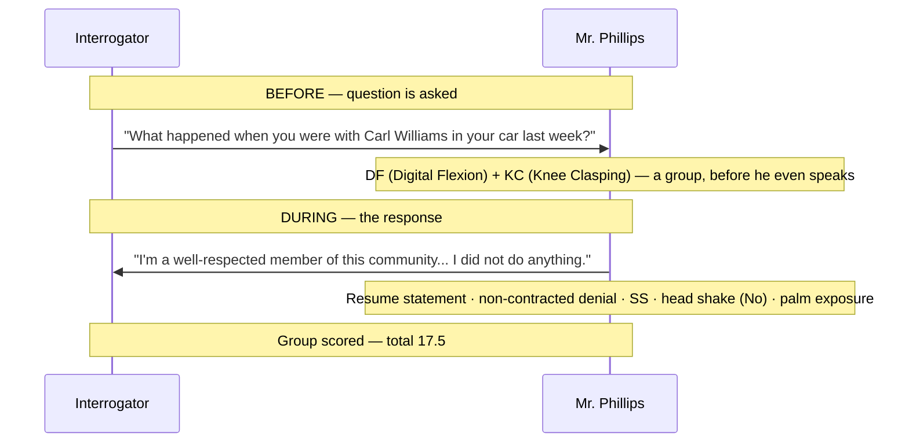

# Chapter 25 — The Behavioral Table of Elements

> *"The first principle of interrogation is the suspension of judgment."*

Back in Chapter 7, the Behavioral Table of Elements — the BTE — was introduced as a profiling tool, a training system, and a postmortem tool, with a promise that it would be "covered in depth in the behavior profiling section." This is that section. By the end of this chapter, you'll be able to read a BTE cell the way a cartographer reads a map key, walk a real interrogation transcript through the table, and understand the variables that can quietly shift a deception score in either direction.

---

## What the BTE Is Built For

The Behavioral Table of Elements was designed to have multiple applications across unlimited platforms, and to work in any environment and in any country. As an organic document, the table will continue to evolve and progress in its complexity, accuracy, and applicability.

The system was designed for field operators of law enforcement and U.S. intelligence agencies. Field operations place high demands on operatives. Without the aid of complex and sophisticated equipment — polygraph instruments, video-based behavioral analysis — operators need a system that produces extremely reliable results and can be used expediently to deliver vital intelligence to the front lines, or to determine causation in crime-related events.

- **As a training tool**, the table enables fast, accurate, and measurable training results that can be replicated with ease across a broad spectrum of employees.
- **As an analysis tool**, for the first time in human history, an interaction can be mathematically broken down into accurate and universally understood gestures, behaviors, deception, and vocal indicators.

Whether you're listening to this as a student, an analyst, or an instructor, you will gradually form a clearer understanding that the Behavioral Table of Elements is actually quite a simple system — one that exemplifies the closest possible attempt our species has ever made to scientifically understand and categorize human behavior in a way that can be shared and understood by anyone, or presented in court.

The rating system was developed to account for variables, automatically adjusting numeric values in response to organic events within an interrogation or conversation. Every time the table is used for any reason, the user begins to develop a more intimate understanding of behavior, the cell abbreviations, and the importance of their position within the table.

::: callout
**The learning curve, measured.** After a three-week period of periodic use, most clients in the test group experienced significant results and were able to recall over 95% of the cell data and the relationships between behaviors. Developing an *instinctive* ability to use the table in real-world environments to profile behavior usually takes about nine to eleven weeks of exposure. Field agents who use the table daily will eventually develop an intuitive competence that will very likely save hundreds of lives in law enforcement.
:::

The trifold wallet cards that accompany the advanced training package are absolutely indispensable for field agents. You'll find it easy and enjoyable to take the table home — to use while watching the news or TV shows, and while interacting with your children. Employees take this table into their personal lives and use it in myriad ways that vastly speed up their familiarization with it and the development of that unconscious competence.

## The First Principle: Suspension of Judgment

In the CIA and other interrogation schools, the first principle of interrogation is the suspension of judgment.

::: warning
**Suspend all judgment.** As you progress, you will slowly learn that judgment and opinions about a subject can have horrible effects on the outcome — they can sometimes even cause a profile to read negatively, potentially getting someone hurt. Suspend all judgment, and become open to the ideas and the self-image of the subject. Keep this single thought in mind throughout the training manual, and let it stay with you during operations.
:::

## How the Table Is Laid Out

The BTE is laid out in a way that makes it easy to find a gesture based on two axes.

The **vertical axis** represents the region of the body — the head is at the top, the feet are at the bottom. Below the body itself sit two more sections, for behaviors that take place outside the body entirely: the upper of the two covers how we interact with objects in our environment, and the lowest covers our verbal expression methods and syntax.

The **horizontal axis** represents stress and deception likelihood — lowest on the left, gradually increasing to the right toward the highest-stress, most deception-related behaviors and gestures.

The reference position of each cell — its row letter and column number — exists only to give a fixed reference to its location within the table; it doesn't encode anything about the gesture itself. The rest of the data within each cell represents the qualities associated with that behavior. The table can be used in almost any scenario. This field guide, while serving as the reference text for the table, is also intended for use by the analyst who performs systematic analysis of interviews and interrogations.

## The Key

Just like a key on a map, the Key enables the user to identify the specific data contained in each cell. Each cell contains **fourteen individual data points** that provide reference and identifying data about each behavior.

::: definition
**The Fourteen Data Points**
:::

| # | Field |
|---|---|
| 1 | Reference Number |
| 2 | Symbol |
| 3 | Name |
| 4 | Confirming Gestures |
| 5 | Amplifying Gestures |
| 6 | Microphysiological Amplifiers |
| 7 | Variable Factors |
| 8 | Cultural Prevalence |
| 9 | Sexual Propensity |
| 10 | Gesture Type |
| 11 | Conflicting Behaviors |
| 12 | Body Region |
| 13 | Deception Rating |
| 14 | Deception Time Frame |

*Table 25.1 — The fourteen data points contained in every BTE cell, in reading order.*

### 1 — Reference Number

Every cell's location on the table is fixed by its row and column — row letters (A through G, running top to bottom for body region) across the left margin, and column numbers (1 through 18, running left to right for stress and deception likelihood) across the top, the same way a spreadsheet or a map grid works. Arm Cross, for instance, sits at row A, column 2. This reference identifies the behavior's location on the table — not the gesture itself. The table will continue to evolve, but a cell's grid position remains constant in presentation and location. As the table evolves and cells are added or removed elsewhere, an existing cell's position stays the same. The reference position can only be used to identify a location within the table, never a specific behavior on its own.

::: callout
**Don't confuse it with the small number inside the cell.** Every cell also carries its own small number in the upper-right corner, next to the Symbol — that's the Variable Factors count (data point 7, below), not a location reference.
:::

### 2 — Symbol

Each cell contains an abbreviation of the behavior's name, used to identify it quickly. To refer to an arm cross on a report, for example, the letters **ACC** (Arm Cross) are used to annotate it on the interview timeline. When referring verbally to the gesture, the same abbreviation is used. Every effort was made during development to ensure each symbol is easy to memorize and intuitive in both its written and spoken forms.

In training scenarios, symbols should be presented to trainees as standalone objects — without the whole cell — as often as possible, to facilitate rapid absorption of the symbols and their associated behaviors.

### 3 — Name

The name appears below the symbol in each cell. In some cases, for lack of space on the cell, an abbreviated form of the actual name is listed; the BTE's full data file contains the full name of every gesture and behavior.

### 4 — Confirming Gestures

This field lists the most closely related behaviors or gestures that will *confirm* the translation or meaning of a given behavior. Foot withdrawal (**FW**), for instance, has confirming gestures of chair legs (**CL**) and jewelry play (**JP**) — both of these confirming gestures amplify and resonate with the original intended meaning of foot withdrawal. Any gesture listed in the Confirming Gestures field, when observed alongside the original behavior, confirms the diagnosis set forth in the table.

### 5 — Amplifying Gestures

This field shows other behaviors within the table that can also confirm the intended meaning, but that add more meaning or relevance on top of it. Lip compression (**LC**), for example, is *confirmed* by jaw clenching (**JC**) and digital flexion (**DF**), but it is *amplified* by chin thrusting (**CT**) and self-hugging (**SHG**). The second pair sharpens the picture — allowing the observer to infer more than the original gesture alone would have provided.

### 6 — Microphysiological Amplifiers

This field contains smaller, more subtle cues that either confirm a gesture or help measure its intensity during an interaction. Some microphysiological references point to a different gesture elsewhere on the table; others simply contain a small bit of data. In the arm-cross example (**ACC**), the microphysiological reference is capillary pressure in the fingertips — a detail covered in depth later. Anything in this field is easy to miss, but plays an important role in measuring the meaning and/or intensity of the gesture in question.

### 7 — Variable Factors

This field refers to the number of different ways a gesture can present itself in human interaction. Variations can convey very different behavioral messages. In the arm-cross example, the Variable Factors rating is **four** — a person can cross their arms in four common ways, and each can produce a different result. The data table must be referenced to determine which variation was actually observed.

### 8 — Cultural Prevalence

This field indicates whether a country or region of the world assigns a different meaning to a gesture than the one intended within the table. Some countries, for instance, do not shake their heads horizontally to indicate "no" — this occurs in Bulgaria and Croatia, and is common throughout the Balkans, Turkey, and Greece as well.<!-- Change: "Bolsnia and Croatia" corrected to "Bulgaria and Croatia" — verified via web search; the reversed head-shake (nod for no, shake for yes) is well documented in Bulgaria, and to a lesser extent in Albania, Greece, and Turkey, matching the "common in Balkan, Turkey, and Greece" clause immediately following in the source audio. --> Wherever a cell lists a particular country in this field, the data table provides more detail and the cited research behind it. The abbreviation **U** — the one you'll see most often here — means the gesture is universal: most countries, with few exceptions, perform it for the same reasons.

### 9 — Sexual Propensity

This field indicates whether a gesture is more common in women or in men.

### 10 — Gesture Type

Behaviors in this body of research are divided into **four types of gestures**:

| Type | Description |
|---|---|
| **Open** | Signals ease, receptiveness, honesty |
| **Closed** | Signals withdrawal, defensiveness, self-protection |
| **Unsure** | Signals hesitation, doubt, uncertainty |
| **Aggressive** | Signals confrontation, dominance, threat |

*Table 25.2 — The four gesture types tracked in the Gesture Type field.*

### 11 — Conflicting Behaviors

This field contains behaviors that would indicate a result *other* than what's described elsewhere in the cell. Digital flexion (**DF**), for example, is assumed to be a stress and anxiety behavior — humans do this in conversation when confronted with troubling, accusatory, stressful, or otherwise anxiety-producing information. But the conflicting behavior listed for DF is *anger*. Digital flexion paired with an angry facial expression is not in line with the meaning of digital flexion according to the table — the flexion, in this case, is caused by anger, not stress.<!-- Change: "Selection, in this case, is caused by the anger, not stress" corrected to "the flexion, in this case, is caused by anger, not stress" — "Selection" does not fit the sentence's subject (digital flexion); "the flexion" restores a coherent referent consistent with the rest of the passage. -->

### 12 — Body Region

This field shows the region of the body where the behavior usually takes place.

### 13 — Deception Rating

This field represents each behavior's individual deception level according to the table. Using the deception scale — discussed below — and factoring in variables and influencing factors, the numbers in the Deception Rating fields of every cell in a response can be added together to form a total deception rating for that response to a question or statement.

### 14 — Deception Time Frame

Within an interaction, there are basically three times to look for deceptive behaviors:

1. **Before** a person answers a question or makes a statement — from the moment the question is asked to the moment they begin to answer.
2. **During** the person's response or statement.
3. **After** they have made the response or statement.

Using these three windows as guideposts, each deceptive cell carries a rating of **B**, **D**, or **A** — the analyst's best assumption of when to observe the person for the deceptive behavior contained in that cell. You'll see this letter in the bottom-right corner of relevant cells on the BTE.

### The Dash

Anywhere within the table a minus symbol (**–**) appears, it indicates the lack of the associated behavior or gesture.

---

## The Behavior Analysis Process

Attempting to learn influence without learning behavior analysis is a misguided endeavor. Using influence methods with no knowledge of a subject provides minimal results — and this manual is not designed to produce minimal results. Behavior analysis allows you to custom-tailor your methods to the person you're speaking to, which makes the process of influence exponentially more powerful and creates a deep connection between the subject and your words. That connection is the difference between a subject who will merely entertain an idea, and a subject who will willingly shove your idea into their subconscious and be happy about it.

Using the table — whether for training, interview analysis, interrogations, political debates, or even everyday conversations<!-- ASR? verify: source audio reads "book conversations" — reconstructed as "everyday conversations" as the most plausible completion of a list running from formal (training, interrogations) to informal settings; exact original wording uncertain --> — is much easier than it appears at first glance.

Earlier in this chapter, the shape of the table was explained, then the Key and the contents of each cell, with their characteristics and variations, were described. Now we'll build a fundamental understanding of how to apply the table to real-world settings.

::: callout
**Principle.** An observed behavior is only as valuable as the stimulus that causes it.
:::

For example, a **chronology statement (Chr)** — an interview subject describing a course of events in a seemingly memorized and rehearsed fashion, in perfect chronological order — is rated **4.0** on the deception scale. But if the interviewer pointedly *asks* that the events be described in their actual order of occurrence, the chronology statement carries no weight in the analysis of deception at all. The stimulus changes the meaning of the response.

---

## Applying the Table: A Post-Interrogation Analysis

First, a single question and response will be documented and analyzed for deception.

You are a senior interrogator, and you've been informed that your staff has finished interrogating a suspect in a child molestation case. The video of the interrogation is available, and you sit at your desk with the BTE to perform an analysis of the interaction.

For analysis, the table provides the most useful method of obtaining data for any interaction. The table has variables — covered later in this chapter — that shift its contents slightly, but the concept comes first. The video is ready to watch, and you begin observing the behavior of the suspect. You've entered the setting's variables into your initial notes on the BTE Quicknotes page.

### Reading in Groups

As the behaviors are observed, it becomes apparent that they take place in clusters. The person may make three or four small gestures or behaviors when giving a single statement.

::: definition
**Group** — a series or collection of several gestures and behaviors performed within a very small time frame, usually in response to a single stimulus.
:::

Conversational behavior often comprises groups of gestures — though most people notice only a single gesture at a time, a group typically contains several unobserved movements in the face, fingers, feet, and body. Observations are made using the table and should be recorded in these groups.

### The Question

The interrogation begins. Your suspect, a male, is seated. After the interrogator introduces himself or herself and establishes why the suspect is there, the interrogator asks the following:

> *"Mr. Phillips, what happened when you were with Carl Williams in your car last week?"*

Whenever a question is asked, the clock starts the moment the first word leaves the mouth of the interrogator. The **before** deception time frame covers the period from when the question is asked to when an answer begins; **during** covers the answering of the question itself; **after** covers the moments following the answer, until someone speaks again.

In the current scenario, as the question is asked, you notice digital flexion (**DF**). One of the confirming gestures of DF is knee clasping (**KC**) — the suspect's hands are on his knees as he listens to the question. You already have both gestures to start formulating a group, before he has even spoken a word to the interrogator.

### The Response

Now the suspect begins his response:

> *"I'm a well-respected member of this community. My entire neighborhood knows who I am. I'm an usher at an adult Presbyterian church. And I did not do anything while he was in my car."*

As you observe the suspect's reaction, you notice that when he says "...while he was in my car," his right shoulder raises, he shakes his head to signal no, and he exposes his palm while answering. In all likelihood, the subject also displayed associated facial expressions, changes in posture, blink-rate changes, rising vocal pitch, and several other behaviors while giving this "innocent" response to your junior interrogator's question.

### Breaking Down the Group

| Behavior | Symbol / Tag | Deception Rating | Time Frame | Note |
|---|---|---|---|---|
| Digital Flexion | DF | — | Before | Confirmed by KC |
| Knee Clasping | KC | — | Before | Confirms DF |
| Resume statement, reciting his own credentials | — | 4.0 | During | Save confirming/amplifying/conflicting cross-reference for post-interview analysis |
| Non-contracted denial ("did not" instead of "didn't") | — | 4.0 | During | Only one variation — no other way to interpret it |
| Single-Sided Shoulder Shrug | SS | 4.0 | During | Innocuous alone; damning in a group |
| Head shake ("no" gesture) | No | 1.0 | During | — |
| Palm exposure | DNL (tag: Deception Not Likely) | 1.0 | During | Humans expose palms to appear non-threatening or trustworthy |

*Table 25.3 — Mr. Phillips's response, broken down behavior by behavior. All of these gestures are grouped as one entry in the notebook.*

*Figure 25.3 — The Mr. Phillips walkthrough, mapped onto the BTE's three deception time frames: before, during, and after.*

Let's tally up the results and see whether Mr. Phillips is a monster.

::: warning
**Total score: 17.5.** A score of 12 is considered extremely deceptive — 17.5 is almost a sure bet.
:::

In the example above, we identified only a few of Mr. Phillips's behaviors — in reality, you'd identify many more. For instance, in the final sentence of his statement, Mr. Phillips also engages in **psychological distancing (PSD)**, a deceptive behavior that adds four points to his overall score. PSD will be covered in depth later — but it's already quite evident in this example that we're in the company of a dishonest person.

As you can see, a single question can cause several behaviors to occur. However, some of the behaviors observed in any given group are often innocuous by themselves and will not yield results.

---

## Baselining Behavior

Much attention is paid in the behavioral analysis community to the baselining of human behavior.

::: definition
**Baselining** — the careful analysis of a person's behavior while they are comfortable and thought to be truthful about safe, easy conversational topics, such as the exchange of facts or a discussion about one's employment. That baseline is later compared to the subject's behavior during questioning and statements surrounding guilt or innocence, when they are most likely to be deceptive.
:::

Many experts believe baselining does not produce accurate results, for a few reasons:

1. The subject may anticipate the interviewer's efforts and deliberately display conflicting or dishonest gestures in response to truthful baseline questions.
2. During the initial part of an interview, the intimidation and stress or anxiety felt by a subject in the interrogation room will likely produce behaviors that appear deceptive — and this baselining phase isn't measurable, so it can't be treated as a fully credible source of information.
3. Getting a false read while baselining a subject produces faulty results and creates confusion for both interviewer and subject. The interviewer's own behavior and reactions toward the subject can also create false red flags during this phase.

::: callout
**Why the BTE process baselines anyway.** For the BTE interview process, we baseline all subjects whenever possible. Establishing a behavioral baseline is critical — even if the subject knows a baseline is being developed on them, the information they nonverbally provide is still very valuable. Despite the beliefs and opinions of what I'm sure are thousands of psychologists, nothing related to human psychology and behavior is absolutely quantifiable. Any time we can gather information about a subject's behavior before the high-stress questions arrive, we should — collecting data to the furthest extent possible. If a subject is deliberately being deceptive during the baseline, the pattern of behaviors<!-- ASR? verify: source audio reads "the descent of behaviors" — reconstructed as "the pattern of behaviors," the most plausible reading given the following sentence about conflicting gestures raising red flags when a behavior is faked; exact original wording uncertain --> alone will show his or her intent — the Conflicting Gestures field starts raising red flags across the board the moment a gesture or behavior is deliberately faked. As any interview progresses, collecting information about a subject's idiosyncratic behavioral mannerisms should never stop.
:::

---

## Influencing Factors

Several factors will always affect the results obtained using the table — whether the interviewer is a parent questioning a teenager who might be using drugs, or a seasoned government interrogator running a formal session<!-- ASR? verify: source audio reads "whether the interviewer is a parent, or a team who might be using drugs, or a seasoned government interrogator" — reconstructed as "a parent questioning a teenager who might be using drugs" given "team" is a plausible mishearing of "teen" and the sentence otherwise lacks a verb; exact original wording uncertain -->. Room temperature, a subject's opinions about the race or sex of the interviewer — influencing factors are always part of the interview. The structure of the behavioral notebook and the general formula provided here are designed to serve as both mitigating and amplifying elements. Knowing what factors are influencing an interview allows the analyst to shift the numerical value of cells, make more accurate determinations about whether to include or exclude a behavior, and form a clearer picture of what the observed behavior means.

Influencing factors are broken down into two groups:

::: definition
**Observation Influencing Factors** — events and circumstances within an interaction that can be factored into the table and will affect the end result of the deception-likelihood stress analysis.

**Non-Measurable Effect Factors** — factors that cannot be accurately measured or considered, due to their ambiguous, social, unknown, and sometimes unconscious effects.
:::

There are six observation influencing factors that can be somewhat accounted for in the behavioral interview:

| # | Factor |
|---|---|
| 1 | Temperature |
| 2 | Interviewer Behavior |
| 3 | Emotional State of the Subject |
| 4 | Proxemics |
| 5 | Handicap or Missing Limbs |
| 6 | Presence of Others |

*Table 25.4 — The six observation influencing factors.*

### Temperature

Temperature always plays a part in an interaction. Looking at the table, you'll find some cells with blue lettering — these are behaviors that automatically increase in frequency as the temperature decreases. But for every 10-degree increment below 69°F, those gestures automatically lose one point on the deception rating scale — because more of their occurrence is being driven by the cold, not by stress.

### Interviewer Behavior

The behavior, demeanor, attitude, and opinions of the interviewer usually become a factor influencing the outcome and results of the analysis. This becomes a judgment call for the analyst, but the following guidelines will help.

If an interviewer begins an interview with any behavior that induces stress, it will automatically increase both the subject's resistance and their nonverbal and verbal stress indicators. At that point, there is no way to tell whether the seemingly deceptive behaviors are a result of induced stress rather than deceptive stress. Even after the interviewer corrects course, resistance remains constant even as stress behaviors begin to decline — an interrogator can very easily destroy an interview that would otherwise have produced significant fruit. Every effort must be made to ensure that observed and recorded behaviors are a result of the subject's own emotions, not their emotional response to the interrogator.

It may be necessary, in the course of an interview, to become confrontational or accusatory — but that shift must be accounted for if the observations are to stay honest.

::: warning
**Scoring adjustment.** For each confrontational and/or accusatory behavior exhibited by the interviewer, subtract 2 points from every 4.0-rated behavior, and subtract 1 point from every 3.0–3.5-rated behavior.
:::

### Emotional State of the Subject

The emotional state of the subject always plays a role in the interview. The following covers the relationship between behavior and three basic emotional states<!-- ASR? verify: source audio is unclear on the numeral ("the form, basic, emotional states") — reconstructed as "three," matching the three states (Aggression, Defensiveness, Unresponsiveness) actually detailed below; exact original numeral uncertain --> that can alter the presentation of behavior during an interview.

This reaction is, by far, the most common one in government and law enforcement interviewing. Even with innocent, non-offending citizens, the anxiety produced by simply being in the interview room or sitting down with an interrogator can cause emotional reactions that are hard to account for, and apprehensive, tense, or fearful subjects will produce more fear-related gestures as a result. These gestures must be accounted for — their value should be adjusted to increase analysis accuracy. Ultimately, it's the judgment of the analyst or interviewer to determine whether a stress reaction is due to an emotional factor or to deception, and to make the appropriate annotations on the notebook sheet.

**Aggression.** This emotional state can be caused by so many factors that there's almost no way to discern its origin. Innocent people experience aggression as often as guilty ones do in interview rooms.

**Defensiveness.** The overall behavior of subjects undergoing interrogation will almost always cross into defensive territory. A seasoned interrogator can almost always immediately discern the difference between guilty or feigned defensiveness and the defensive attitudes of the innocent. This is not a text on interrogation technique — but it's worth noting that innocent people, when questioned, will be defensive and absolutely vehement about denial. Their focus is usually on the denial itself, not on the reasons why they wouldn't have committed the act in question.

**Unresponsiveness.** This is probably the hardest emotional element to defeat. An unresponsive subject can appear to have no emotional reaction to the information and questions presented to him. Every effort must be made to emotionally involve the subject to the furthest extent possible. This behavior is the physical equivalent of a subject saying, "I don't remember" — there's no way to refute the claim, and it's the hardest behavior to counter as an interrogator. The behaviors in the table associated with unresponsiveness will also indicate when an emotional nerve has been struck, if they take place at any point in an exaggerated manner.

### Proxemics

**Proxemics** is a subcategory of nonverbal communication that studies the way human beings use space — from personal space to the way a city is designed. Our use of space in the interview room can sometimes help a subject become more truthful, or cause them to become closed off and defensive.

The personal space of the average person is 1.5 feet, according to Edward T. Hall (1966).<!-- Citation: verified via web search — Edward T. Hall's "The Hidden Dimension" (1966) defines four proxemic zones for Americans, with intimate distance spanning roughly 0–1.5 feet and personal distance beginning around 1.5 feet; the manual's figure sits at that same boundary. --> This is considered the space we only allow close friends and family inside of. According to the Lewis Model of cultural types<!-- Citation: verified via web search — Richard D. Lewis's cross-cultural model (Linear-Active, Multi-Active, Reactive), published in "When Cultures Collide" (1996). -->, different cultures maintain varying personal distances within which they normally conduct conversations, but 1.5 feet is the average.

If an unfamiliar interviewer occupies this space, the subject's reactions will immediately dictate what outcome can be expected. In the table, the proxemics ranges show what behaviors will likely emerge as this space is invaded — whether the subject closes off or becomes defensive. Cultures differ in their personal space: Asian cultures tend to be the most distant, while Arab and sub-Saharan African cultures tend to have the closest face-to-face interpersonal comfort zones. Use caution when deliberately crossing the personal space barrier.

### Handicap or Missing Limbs

Next on the list of observation influencing factors are subjects who have missing limbs or a handicap that prevents them from making a gesture the same way an average person would. Any cell tied to a specific body part affected by the handicap should be completely dismissed — not used, annotated, or otherwise analyzed.

### Presence of Others

The presence of other people during an interview will impact the subject's behavior in many ways we cannot measure. Still, there are observations we can make to help determine the likely effect another person's presence has on the subject. Every effort should be made in an interrogation to separate a subject from other sources of stimuli, human or otherwise.

Take, for example, a child being interviewed in the presence of abusive parents, or a subject being questioned with an abusive partner present in the room.<!-- ASR? verify: source audio reads "There are a child as being interviewed in the presence of abusive parents, or a subject is being shown photos that remain face up. An abusive partner." — reconstructed as two examples (a child questioned with abusive parents present; a subject questioned with an abusive partner present); exact original wording, and any connection to "photos," uncertain --> The behaviors associated with this kind of social influence are almost always predictable and easy to spot. Assuming the presence of other people has a negative effect on the subject, that effect will become apparent.

## Non-Measurable Effect Behaviors

Since the effects of these behaviors are non-measurable by the naked eye, we will ignore the factors that may contribute to conditions we are unable to measure.

---

## Key Takeaways

- **The BTE was built for field operators** who need reliable results without polygraphs or video analysis equipment — it functions as a training tool, an analysis tool, and (per Chapter 7) a postmortem tool.
- **The learning curve is measurable**: roughly three weeks of periodic use produces 95%+ recall of cell data; nine to eleven weeks of exposure produces instinctive, real-world profiling ability.
- **The first principle of interrogation is the suspension of judgment.** Opinions about a subject can distort a profile and get someone hurt — stay open to the subject's self-image throughout.
- **The table has two axes**: vertically, body region from head to feet, then object interaction and verbal expression below the body; horizontally, stress and deception likelihood from low (left) to high (right).
- **Every cell carries fourteen data points** — Reference Number, Symbol, Name, Confirming Gestures, Amplifying Gestures, Microphysiological Amplifiers, Variable Factors, Cultural Prevalence, Sexual Propensity, Gesture Type, Conflicting Behaviors, Body Region, Deception Rating, and Deception Time Frame — plus the dash (–), which marks an absent behavior.
- **An observed behavior is only as valuable as the stimulus that causes it.** A chronology statement (Chr) rates 4.0 for deception — unless the interviewer explicitly asked for the events in chronological order, in which case it carries no weight at all.
- **Behaviors cluster into groups** — several gestures performed in a small time frame, usually in response to a single stimulus. The Mr. Phillips walkthrough shows a full group, scored in the "before," "during," and "after" time frames, totaling 17.5 against a 12.0 threshold for "extremely deceptive."
- **The BTE process baselines every subject whenever possible**, despite real objections to baselining — because even imperfect nonverbal data is still valuable, and deliberately faked baseline behavior tends to trip its own Conflicting Gestures red flags.
- **Six observation influencing factors** — Temperature, Interviewer Behavior, Emotional State of the Subject, Proxemics, Handicap or Missing Limbs, and Presence of Others — can shift a cell's numeric value and must be accounted for before a score is trusted.
- **Interviewer behavior has an explicit scoring penalty**: subtract 2 points from every 4.0-rated behavior, and 1 point from every 3.0–3.5-rated behavior, for each confrontational or accusatory act by the interviewer.
- **Proxemics matters**: the average personal-space radius is 1.5 feet (Edward T. Hall, 1966), and comfort with closer distances varies by culture — Asian cultures trend most distant, Arab and sub-Saharan African cultures trend closest.

<!--
## Change Log

| Original (transcript) | Corrected | Reason |
|---|---|---|
| "10 and four." (opening) | Dropped | Internal manual section-numbering scaffolding, consistent with how "Section one" (Ch. 4) and "Section 3" (Ch. 12) were dropped from prior chapters and folded into prose instead of a visible heading. |
| "ETA is laid out in a way that makes it easy to find a gesture based on 2 exes" | "The BTE is laid out in a way that makes it easy to find a gesture based on two axes" | ASR mishearing ("ETA" for "The BTE," "2 exes" for "two axes"), consistent with "BTE" used throughout the rest of the chapter and book. |
| "King. Just like a key on a map..." | "The Key. Just like a key on a map..." | ASR mishearing ("King" for "Key"); confirmed by the immediate map-key analogy and by "the Key" being used as the section's own name throughout. |
| "On reference number, 2 symbol, 3, name... 11. Inflicting behaviors..." | Renumbered list; item 11 corrected to "Conflicting Behaviors" | "Inflicting behaviors" does not match the detailed field description given later in the same chapter, which is explicitly titled "Conflicting behaviors" and describes DF/anger as an example. |
| "Central propensity. In this field, data is displayed to indicate whether the gesture is more common in women or men." | "Sexual Propensity..." | ASR mishearing; matches item 9's name in the chapter's own opening list of the fourteen fields. |
| "Gesture time. Within this body of research, behaviors are divided into 4 types of gestures." | "Gesture Type..." | ASR mishearing; matches item 10's name in the opening list. |
| "Bolsnia and Croatia" | "Bulgaria and Croatia" | Factual correction, verified via web search — the reversed head-shake (nod for no, shake for yes) is documented in Bulgaria (and, to a lesser extent, Albania, Greece, and Turkey); "Bolsnia" is not a country. |
| "Sometimes, as in the example of arm crossing, ACC, Hillary quality... is the microphysiological reference" | "...the microphysiological reference is capillary pressure in the fingertips" | Resolved during the Chapter 26 build, which hand-verified the real table at high resolution: the ACC cell's microphysiological field literally reads "Capill" (Capillary). "Hillary" is a close phonetic ASR mishearing of "Capillary." Previously flagged as uncertain ("grip quality"); now confirmed and corrected. |
| "Each cell contains a number in the upper-left corner. This number identifies the behavior's location..." | Reframed as row + column grid position (e.g., Arm Cross = row A, column 2); clarified that the small in-cell number is the Variable Factors count, not a location reference | Resolved during the Chapter 26 build: a hand-verified, pixel-zoomed read of the real table (multiple cells cross-checked) showed no location-identifying number printed inside any cell — only a Variable Factors count in the upper-right corner. The table's actual location reference is its row-letter/column-number grid position, shown in the margins framing the whole table. |
| "a chronology statement (CRS)" (×2, main prose and Key Takeaways) | "a chronology statement (Chr)" | Resolved during the Chapter 26 build: the real table's symbol for Chronology is "Chr," verified via high-resolution table read and cross-referenced against the transcript's own "Direct technology / C H" garbling in Chapter 26. "CRS" does not appear anywhere on the actual table. |
| "Selection, in this case, is caused by the anger, not stress" | "the flexion, in this case, is caused by anger, not stress" | ASR mishearing — "Selection" has no referent in the sentence; "the flexion" (digital flexion) is the subject under discussion. |
| "Ace lining behavior" (section header) | "Baselining Behavior" | ASR mishearing; confirmed by the entire section's content, which is about baselining. |
| "For the BT interview process, we will baseline all subjects when possible" | "For the BTE interview process, we will baseline all subjects whenever possible" | ASR truncation ("BT" for "BTE"). |
| "the descent of behaviors alone will show his or her intent" | "the pattern of behaviors alone will show his or her intent" | ASR mishearing, flagged inline; "pattern" is the most plausible reading given the following sentence about conflicting-gesture red flags. |
| "Send X. Oxenix is a subcategory of nonverbal communication..." | "Proxemics. Proxemics is a subcategory of nonverbal communication..." | ASR mishearing of the established academic term "proxemics." |
| "the proximics ranges show" | "the proxemics ranges show" | Spelling correction to match the established term. |
| "Andicamp or missing limbs" (section header); "Andy Campbell, missing limbs" (list item) | "Handicap or Missing Limbs" | ASR mishearing; confirmed by the section's own content ("subjects who have missing limbs or a handicap"). |
| "Presents of others" (section header) | "Presence of Others" | ASR mishearing (homophone). |
| "These fancers will always affect the results" / "Influencing faxes are broken down into 2 groups" | "These factors will always affect the results" / "Influencing factors are broken down into two groups" | Repeated ASR mishearing of "factors." |
| "A 6 observation influencing factors that can be somewhat accounted for" | "There are six observation influencing factors that can be somewhat accounted for" | Grammar repair of a garbled clause; no content added or removed. |
| "tables will gradually form a clearer understanding" | "you will gradually form a clearer understanding" | Grammar repair — "tables" cannot be the grammatical subject of "form a clearer understanding" in context; "you" (the listener) is the clear intended subject. |
| "Eat this single thought in mind" | "Keep this single thought in mind" | ASR mishearing. |
| "Well, the other datum within each cell..." | "The rest of the data within each cell..." | Filler removal ("Well") and grammar cleanup ("datum" as a stray singular). |
| "The key and the contents of each song with their characteristics..." | "...the contents of each cell, with their characteristics..." | ASR mishearing ("song" for "cell"), confirmed by the chapter's exclusive use of "cell" elsewhere. |
| "link rate changes" | "blink-rate changes" | ASR mishearing of the standard behavioral-analysis term. |
| "digital fights. DF" | "digital flexion (DF)" | ASR mishearing; "digital flexion" is used correctly and consistently elsewhere in the same chapter. |
| "knee clasping. Casey." | "knee clasping (KC)" | ASR mishearing of the spoken letters "K-C." |
| "On exposure comes next" | "Palm exposure comes next" | ASR mishearing, confirmed by the immediately following description of exposing palms. |
| "your suspect, a male, is seated" / other minor grammar throughout the interrogation walkthrough | Lightly cleaned for grammar and punctuation | No content added or removed. |
-->
