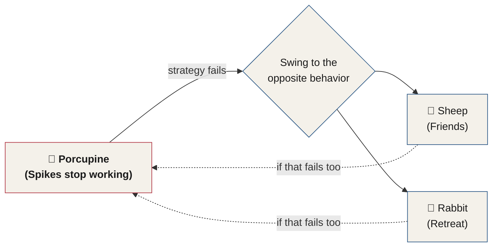

# Chapter 27 — Animal Behavior in Humans

> *"We start to see the creature as a result of what hurt it in the past, and what kept it safe."*

This chapter opens Section Five of the manual — **Profiling Human Behavior**. Everything up to this point has been about reading behavior in the moment: a gesture, a cell on the Behavioral Table of Elements, a flicker of stress crossing a face. This section turns to something deeper — not just *what* a person is doing, but *why* they became the kind of person who does it.

The creatures on our planet were shaped and formed in ways that changed over time. These changes were gradual, but they were the result of the things that hurt us and the things that kept us safe. Animals adapt by getting faster, smarter, growing thicker skin, becoming more dangerous to approach, or harder to hunt down. Proportionately, their predators would also risk extinction without an equally scale-tipping shift in their own capability. We've got a unique gift as humans — we're one of the most adaptable species on the planet.

---

## The Eel, Milton, and the Question That Changed My Life

I got bit by an eel. I was stationed in Pearl Harbor, Hawaii, and my friends and I would routinely go scuba diving along the gorgeous reef of Hawaii. On one Saturday afternoon, we were on the southeast coast of Oahu, and we had taken a series of stunning photos of the vibrant fish along the reefs.

A swell pushed me backward onto a reef, and I felt a sensation I can only describe as part of my arm being put into a blender. There was blood everywhere. When my friends pulled me up to the beach, everyone thought I'd been bitten by a shark because of the amount of blood. I spent six hours in the hospital and went home with a wrap around my arm, with unbelievable pain still shooting through my nerves like fire for several months.

I later realized I'd been bitten by a moray eel. Now's a good time to mention that a moray eel can grow up to 13 feet long, and they're one of the meanest-looking creatures you can imagine. We're talking horror-movie stuff.

Several weeks later, I was having lunch with Milton, a 72-year-old man who I viewed as my mentor. I was complaining about a total douchebag named Eric in my work, giving examples of how this guy's behavior was so atrocious. I explained how Eric would try so hard to act tough and cool, posturing in a weirdly aggressive manner so people would see how badass he was. Eric also had a natural tendency toward being angry whenever someone asked him a question, or suggested that he should do something differently. Just communicating this to my mentor made me visibly upset.

Milton could tell I was angry describing the guy. So he asked me a question that changed my life — and after twenty years became a part of the book that you're listening to now.

> **Milton:** "Did Eric rip the muscles in your arm in half?"

I stared at him, waiting for a punchline. He tilted his head and waited for an answer.

I shifted in my seat and cleared my throat. "Um, no. Why?"

He smiled. "Well, that eel that bit you did a lot more damage than Eric ever will. And you're not mad at the eel. I was just wondering why you'd be mad at Eric and not at the eel. Maybe you could hunt the eel down and kill it."

I squinted at him, trying to understand. "The eel? You want me to be mad at the eel? It's just a creature — it was scared and bit me to defend itself. This is how it evolved. It was scared. It was just protecting itself."

Milton set his coffee cup down onto the table and waited for my slow ass to finally grasp what I'd just said. When it happened, my shoulders fell, and the skin on my face relaxed into the *holy crap* moment of understanding.

---

## Seeing People as the Result of What Shaped Them

When we see someone who is prone to aggression and bouts of shouting, we may tend to make the mistake of shaking our heads in dismissal or disapproval. However, if — like a scientist — we look at this creature as the result of what has shaped its growth, everything suddenly changes. We start to see the creature as a result of what hurt it in the past, and what kept it safe.

This may cause an almost out-of-body experience: seeing this aggressive behavior as nothing but the result of, perhaps, an eight-year-old being bullied and taunted relentlessly on the playground, only to head home to an abusive, alcoholic father. We imagine this, and we see this child crying alone in bed, unconsciously vowing to never be hurt again. We'd understand their evolution into a loud, aggressive, and posturing individual who no one would ever consider attacking in the future.

How would this change you? If you had this type of x-ray vision when you saw people, what might this change for the world? The journey I'm about to take you on is going to change the way you see the world — and maybe yourself — forever.

---

## Animals and Behavior

If you confuse and anger a rattlesnake enough, it will bite itself and die.

We tend to harbor a lot of resentment, judgment, and anger toward other people. In the end, it winds up hurting us the most. If I took you through a magic portal where you could instantly see the private thoughts, insecurities, and maybe even the internet browsing history of everyone you know, your life would change both permanently and immediately. In the end, my sincere hope is that you never see the world the same way again. I want to fundamentally change the way you see people, forever.

When you can see through the masks people wear, and you grow to eventually see the reasons behind the shapes people take, everything changes. Every interaction you experience becomes a connection to something deeper — one with the power to transform not only that conversation, but your time on Earth.

We aren't here for long. Let's do our best to see that in others too.

---

## The Process — We've Been Changing Shape for a Long Time

As a species, humans have been adapting to all kinds of challenges for a very long time. I want you to meet a friend of mine. Her name is Amy. Amy lives in a time over 100,000 years before the iPhone came out — she's a cavewoman.

In Amy's time, she dealt with a lot of serious conflict. Tigers, famine, disease, lack of resources, and medical issues were daily threats to her existence. Amy couldn't order a pizza when she was a little hungry — she had to work with her tribe for resources.

Our ancestors left us a lot of tips written into our DNA:

- The reason we instinctively fear snakes as children and adults is that our ancestors did. It kept them alive.
- The reason we are obedient to authority and conform to group norms is that our ancestors were too. It kept them alive.
- We're born knowing how to smile, frown, and even show disgust on our faces. This is the result of millions of years of communication and survival, keeping our ancestors alive long enough to reproduce.

Since literally none of your ancestors died a virgin, you have some pretty good genes.

::: callout
**Ancestral Script, revisited.** This is the same mechanism named back in Chapter 4: an **Ancestral Script**, wired into us from birth because it kept our ancestors alive long enough to reproduce. Snake-fear, obedience to authority, and conformity to the group are all Ancestral Scripts running quietly in the background of your mind right now.
:::

We've not only evolved over the course of millennia, but we continue to evolve over the course of our lifetimes. Much of what we are as adults is a product of patterns of behavior we learned in childhood. Some of us were bullied. Some were coddled and spoiled. Some were dirt poor, and some were wealthy. As we age, our brains pick up on every behavior we need to stay safe, get along, and get rewarded — **in that order**. Those are the programs we've been running in the background of our minds since we were children.

---

## The Childhood Development Triangle

::: definition
**The Childhood Development Triangle** — the three needs a developing child's brain solves for, always in the same order: **stay safe**, **get along**, and **get rewarded**. The specific behaviors a child uses to satisfy each side of the triangle are what get carried into adulthood as **Life Scripts** — the same concept introduced in Chapter 4, now traced back to its origin.
:::

For a child with an alcoholic father who's abusive and mean, staying safe might have meant staying hidden, remaining quiet, and making as little fuss as possible.

For another child with a narcissistic parent, getting along meant complimenting their parent all the time — not only to stay safe, but to get along and to get rewarded. Then, as an adult, without knowing it, they carry forward these behavioral patterns of complimenting people a bit too much. Not because they're consciously aware this behavior is from childhood, but because it's just who they are.

In another case, a child who grew up in opulence and was wealthy beyond what most of us could dream about stayed safe by blending in, conforming to social rules, and keeping their manners in the highest possible form. Some in the same situation rebelled against the wealthy family, staying safe by revolting against the norms and becoming a child who sought safety in a group of non-conforming friends. Staying safe meant deviating from family rules as much as possible in order to get along with their tribe of friends. Their reward came in the form of belonging and feeling powerful by breaking from tradition and conformity.

In another instance, a child is bullied at school and consistently treated like a doormat by his parents. Somewhere around the age of nine, this little boy unconsciously makes a decision to never be hurt again. He overcorrects as a child — he yells at people, begins displaying bullying behaviors, and adopts an aggressive attitude, secretly hoping no one will ever see him as a target again.

Later, as an adult, he unknowingly brings this behavioral pattern — this **life script** — into his life. He postures at work, drives a vehicle that makes him look tough, and is loud and aggressive in his interactions. He's not aware that he's brought this fearful, protective behavior into adulthood. He's not aware that his actions are rooted in a deep fear of being hurt or attacked again. He's just continued the behaviors that kept him safe, got him into social groups, and gave him rewards: safety and a lack of fear.

These three needs that all children have end up building behavioral patterns that last a lifetime. The sad part is that most of us will never realize the behaviors that kept us safe and earned us rewards as children are still a large part of who we are today.

Our behavior isn't some random mixture of parenting styles and the other things psychologists like to talk about. Our adult behavior is a result of how each of us filled the three sides of the Childhood Development Triangle — and those three sides are different for us all. For some in dire circumstances, the reward might have been food. For others, it might have been praise from parents. For others, it might have been a feeling of accomplishment or success.

### Emily's Equation — When a Life Script Backfires

Here's another example. Emily is six years old. Her father works long hours and rarely pays her any attention. As she grows up, she realizes that when she becomes sick with a cold or hurt from a bicycle accident, her father shoots up from his living room chair and provides her with attention, care, and reassurance — everything she craves as a child.

Unconsciously, she forms a behavioral equation — a life script — in her head that she will later carry into adulthood: **being injured or hurt equals positive attention, praise, and affection from people.**

Notice how her equation didn't say *dad*. It said *people*. That's how our brains work as kids — parents and authority figures serve as the map for how the rest of the world works.

Now as an adult, Emily is employed at a car dealership. In her relationship, she uses these same behaviors to get what she needs from her partner. In her job, she uses the behavior to gain affection and belonging from others. Neither is very successful. The foundational beliefs she formed as a little girl are coloring every action she takes as an adult. Being hurt, injured, offended, crying, and complaining about stressful life events doesn't work very well to get her what she wants.

::: warning
**When the fix reinforces the wound.** Despite dozens of therapists trying to work with her, none has understood these scripts or how to spot them — and she's still suffering. She's unable to fully live life because the therapists feed her behavioral pattern, giving her all the belonging, affection, and appreciation she needs when she comes into the office and talks about her injuries. Not once has a therapist addressed the foundational beliefs she formed about the world as a child. Emily continues to devolve. Her relationships suffer, and her employment is eventually terminated — giving her more injury to use as a tool in the future, for the next relationship and the next employer.
:::

So much of what we see in others is the result of how they filled the three sides of their own Childhood Development Triangle. So much of who we are is a result of how we did the same in our own childhood. The moment we can understand others in this way, everything changes — and when we understand ourselves this way, our lives can change dramatically.

---

## Introducing the Animal Behavior Chart

I'm about to introduce you to a concept that I hope will change the course of your entire life: **the Animal Behavior Chart.**

Our childhood protective mechanisms transform into adult behaviors. There is nothing positive about any of the traits — they simply identify how we tend to solve problems and conflict in our lives.

The Animal Behavior Profiling Chart, found in the visual resources, is a chart that I developed to help children understand each other. I never could have imagined how impactful this would be for adults. I continue getting daily emails saying this chart has changed someone's life, or made their children more in tune with the world around them.

Let's meet the animals on this chart, to learn how animals and humans develop protective mechanisms and problem-solving methods to deal with the world around them.

| Animal | Tag | Core Defense | Human Behavioral Equivalent |
|---|---|---|---|
| **Porcupine** | Spikes | Injures anyone who gets too close — friend or foe | Pushes everyone away, so no one gets close enough to hurt them again |
| **Chihuahua** | Noise | Loud, escalation-ready posturing that warns bigger threats off | Aggressive, loud behavior in childhood that keeps bullies at a distance |
| **Turtle** | Shell | Retreats into a hard shell instead of running | Withdraws internally — sometimes into full dissociation — during conflict |
| **Rabbit** | Retreat | Outruns the threat rather than confronting it | Physically escapes conflict, whatever the cost |
| **Fox** | Stealth | Outwits predators by reading their individual psychology | Uses intellect and cunning, tailored to each "predator," to avoid conflict |
| **Wolf** | Vigilance | Constant environmental and pack awareness | Stays hyperaware, scanning for early signs of danger in others |
| **Sheep** | Friends | Safety through the herd — never faces a threat alone | Seeks safety and belonging through social groups |
| **Puppy** | Innocence | Submission and cuteness disarm attackers | Earns safety through submissiveness and likability |

*Table 27.1 — The eight archetypes of the Animal Behavior Chart, at a glance.*

### The Porcupine — Spikes

The porcupine uses its spikes to ensure no one can hurt it. Over the course of its evolution, it grew spikes because of frequent attacks that left it injured. The spikes wound up keeping the porcupine safe over the years so that it could live its life.

The spikes aren't for attacking anything, per se — but anything that attempts to get close and make contact with it, even a creature trying to help, will be injured by them. Underneath the spikes is soft hair and skin. The porcupine is a herbivore, and never seeks to attack any creature. The creatures who get injured are the ones who get too close to the porcupine, regardless of whether they were trying to help it or hurt it.

Of course, we can see similarities here — a human might grow up to become a porcupine, too.

### The Chihuahua — Noise

It's a bit of a stereotype, but let's talk about why Chihuahuas are known for barking and aggressive behavior. As a small dog, they developed this behavior to ward off attackers. They are typically more willing to escalate to aggression than most other animals — most dogs are social and will default to peace over conflict. The Chihuahua uses aggression, barking, and its willingness to escalate a situation to ensure it stays safe. These behaviors communicate their willingness to escalate before any other animal gets too close.

The barking isn't anger, hatred, or malice. It's fear. Fear is more likely to be the root feeling of most outwardly loud and aggressive behavior in humans as well. This behavior was essential for a smaller dog — larger animals would witness it and often choose to stay away from the Chihuahua.

When humans develop into this behavioral archetype, they obtain safety by showing aggressive behavior in childhood. Other children will simply keep their distance, including bullies at school.

### The Turtle — Shell

A turtle uses its hard shell to protect itself. In moments of conflict, the turtle has a very limited ability to run — so instead of running, which turtles cannot do, it pulls the essential part of itself into the protective shell and waits until the conflict is over. With a limited ability to physically escape, the turtle developed this shell over time so that it could stay protected during conflict.

People may develop similar behavioral habits in childhood. In many cases, this behavior might be called **dissociation**.

::: definition
**Dissociation** — a defense mechanism the mind uses to cope with severe emotional stress or conflict by detaching from reality. It occurs as a change of awareness in which a person becomes detached from their body, their environment, and other sensory information. In severe cases, this can lead to amnesia (Giesbrecht, Geraerts & Merckelbach, 2007).
:::

This dissociative mechanism can cause some people to lose awareness of their surroundings, which interferes with their ability to solve problems in their life. For others, they may simply retreat internally without dissociation — remaining in place and trying their best to stay in their shell during periods of conflict.

### The Rabbit — Retreat

Rabbits use their speed for protection. They solve conflicts by physically escaping the environment. The rabbit's ancestors developed faster and faster physiology to escape animals like the fox, whose speed was also evolving in order to catch the rabbit — the same predator-prey arms race described at the start of this chapter, playing out between fox and rabbit.

The rabbit avoids conflict at all costs, and this trait can lead to it abandoning its own babies in a moment of panic. A child who learns early in life that escape is an effective method for staying safe and avoiding conflict will continue this behavior into adulthood. Without consciously knowing the behavior is carrying over from childhood, it continues to show itself in their lives whenever conflict arises.

### The Fox — Stealth

The fox evolved to stealthily stalk enemies and use its intelligence to outwit both predator and prey. Foxes are closer to the bottom of the food chain than you might think — several animals prey on foxes for their survival. When faced with a predator, such as a large owl, they use that uncommon intellect to outwit the other animal. They tend to think ahead like a chess player and use every element of the environment to their advantage.

Surprisingly, foxes even behave differently based on which predator they're facing. Their stealth and cunning shift based on the psychology of their attacker, and they adapt their defense strategy to how the predator thinks, instead of relying on a single technique.

Children with higher intellects also develop conflict-avoidance behaviors tailored to the psychology of whichever "predator" they're facing. Bullies come in all shapes and sizes, and children who use stealth and cunning to avoid these conflicts build lifelong behavioral habits that they will use later in life to solve conflict and stay safe.

### The Wolf — Vigilance

Though intelligent, wolves can be outsmarted by many of their predators, and even more by the animals they prey on. They rely on their senses to spot opportunities around them. As wolves evolved, they became acutely more aware of their environment than other animals, observing fine details that allowed them to spot impending danger. But they also became sharply focused on observing the behavior of other wolves in their pack, so they could be aware of danger early — recognizing that the other wolves would also be acutely aware of their environment, a wolf could watch the other members of its pack for trouble signs.

Conflict is common in wolf packs, and spotting tribal conflict early was vital to a wolf's survival. Even the alpha of a wolf pack relies on vigilance to spot tribal conflict — the alpha gets challenged for its position almost daily, and if it doesn't see a challenging wolf's demeanor changing as it approaches, it could face severe consequences.

Humans who grow up in environments where conflict is a regular occurrence can develop a very similar pattern of constant vigilance. As children, they were forced to constantly pay attention to their pack or family, and this kept them safe. Conflicts happened so often that they learned to spot the signs — developing a type of radar for approaching problems.

Like all other behaviors, this has its downside. Staying in a constant state of hyperawareness is unhealthy, especially in humans. This type of hyperawareness can cause people to misinterpret normal behaviors as aggressive ones. Their constant overreactions can lead to an erosion of their social standing in no time at all.

### The Sheep — Friends

The sheep is a flock animal. They prefer to stay in their herd, where they feel safe and protected — gregarious, and secure when in a group. This group is their key defense against predators. Even when you take a sheep away from its herd and place it in another herd it has never met before, it will continue to rely on the group for protection. In fact, when a region has more predators, the sheep's flocking behavior becomes even stronger.

The sheep's instinct to flock is as strong as its instinct to follow. The sheep will follow the other sheep even when the direction they're going is dangerous or not in their best interest. This behavior can be exploited in sheep — they can be easily kept in areas without fences because of their flocking behavior. The herd matters more than their own individual survival in many situations.

This type of behavior can show up in human children who find solace, safety, and comfort in social groups. It can become a lifelong pattern if a social group is what kept them safe during times of real conflict or danger. Humans with this behavioral pattern have a powerful desire to make social connections, and an exceptional skill at keeping them. The danger that comes with this pattern is when a person is encouraged or influenced to act in ways that aren't in their best interest, by their social group.

### The Puppy — Innocence

The puppy has little to no defenses. Puppies are naturally trusting and open to the world around them, but this tends to lead them into danger. When it comes to their defenses, puppies use their innocence and vulnerability to their advantage. Many creatures are hardwired to respond to the innocence of baby animals with protective instincts, even across entirely different species. The puppy uses its innocence to reduce the chances it will be hurt, and to develop sympathy in would-be attackers.

In humans, you'll see this behavior in cases where a child was rewarded for their innocence, their submission, and for looking cute and harmless. If a developing child learns that the easiest way to fill all three sides of the Childhood Development Triangle — safety, belonging, and reward — is through innocent behavior, these behaviors get codified into patterns that become increasingly hard to change as they become adults.

People with this tendency have a strong need to be liked and will often be exploited through the deliberate creation of conflict — the predator knows that they will default to absolute submission. These people are often the unwitting targets of narcissists and parasitic partners. Their downfall can be severe if they are made to feel threatened for prolonged periods of time, without being able to innocence their way out of it.

When I've experienced this type of behavior in interrogation situations, puppy humans tend to morph into a porcupine when their attempts at innocence aren't effective, or even cause them harm.

---

## The Animal Pendulum — When a Strategy Stops Working

In many cases, when an adult reaches a situation on the Animal Behavior Chart where their go-to protection and defense strategy isn't working, the solution, from their perspective, is to embrace the opposite of what they have been doing. Instead of making small movements toward a center line, they tend to make a large shift toward the animal they see as opposite to where they fall on the chart.

For example, someone who has lived life as a porcupine, when they begin encountering difficult situations this strategy can no longer solve, will often shift to the behavior of the sheep or the rabbit — the opposite behavior of what they'd been doing.

*Figure 27.2 — The Animal Pendulum. Rather than adjusting gradually, a person whose default strategy stops working tends to swing to its opposite — and can swing back again if the new strategy fails too.*

When a person begins vacillating between animal behaviors on opposite ends of the spectrum, problems tend to occur. Their behavior can become more erratic, creating an **animal pendulum**.

---

## Key Takeaways

- **See people as the product of what shaped them.** An aggressive adult is rarely a bad person — more often, they're a scared eight-year-old's protective strategy, still running decades later.
- **The Childhood Development Triangle** — stay safe, get along, get rewarded, *in that order* — is the engine behind every **Life Script** (first named in Chapter 4). The specific behavior a child uses to fill each side becomes the behavior an adult unconsciously repeats.
- The **Animal Behavior Chart** has eight archetypes, each a defense mechanism carried from childhood into adulthood: **Porcupine** (spikes), **Chihuahua** (noise), **Turtle** (shell), **Rabbit** (retreat), **Fox** (stealth), **Wolf** (vigilance), **Sheep** (friends), and **Puppy** (innocence).
- None of these traits are inherently good or bad — they simply identify how a person tends to solve problems and conflict.
- When a person's default strategy stops working, they rarely adjust gradually. They tend to swing to the opposite archetype entirely — the **Animal Pendulum** — which can make their behavior more erratic, not less.
- Understanding this framework in others builds empathy where judgment used to live. Understanding it in yourself can change your life.

<!--
## Change Log

| Original (transcript) | Corrected | Reason |
|---|---|---|
| "Amore eel can grow up to 13 feet long" | "moray eel can grow up to 13 feet long" | ASR mishearing of species name; verified via web search that a moray eel (slender giant moray) can reach 13 feet, so only the name needed correction |
| "pulled me up to the beat" | "pulled me up to the beach" | ASR homophone error |
| "went home with a ramp around my arm" | "went home with a wrap around my arm" | ASR homophone error |
| "Eric would try so hard to act tough and cool. paving in a weirdly aggressive manner" | "Eric would try so hard to act tough and cool, posturing in a weirdly aggressive manner" | ASR mishearing; "posturing" is confirmed by identical usage later in the chapter describing the adult version of the bullied boy ("He postures at work") |
| "Squinted at him, trying to understand." | "I squinted at him, trying to understand." | restored dropped subject pronoun |
| "Proportionately, their predators would also risk extinction without an equally scale tipping shift in capability" | "...an equally scale-tipping shift in their own capability" | grammar/hyphenation cleanup |
| "Milton sat his coffee cup down" | "Milton set his coffee cup down" | grammar: "set" is correct transitive verb, not "sat" |
| "Skin on my face relaxed into the holy crap moment of understanding" | "the skin on my face relaxed into the *holy crap* moment of understanding" | grammar cleanup; preserved the author's colloquial phrase per voice rule |
| "an 8 year old being bullied, getting taunted relentlessly" | "an eight-year-old being bullied and taunted relentlessly" | grammar cleanup, numeral spelled per house style |
| "an almost out of body experience" | "an almost out-of-body experience" | hyphenation |
| "Everything chambers." | "everything changes." | ASR mishearing; "everything changes" is used identically earlier in this same chapter ("everything suddenly changes"), confirming the intended phrase |
| "Every interaction you experience becomes a connection to something deep. The power to transform not only that conversation, but your time on earth." | "Every interaction you experience becomes a connection to something deeper — one with the power to transform not only that conversation, but your time on Earth." | merged a sentence fragment into a complete sentence, preserving the stated meaning |
| "In the end, that's my sincere hope that you never see the world the same way again." | "In the end, my sincere hope is that you never see the world the same way again." | grammar cleanup of a doubled clause |
| "I want you to meet a friend of mine Her name is Amy." | "I want you to meet a friend of mine. Her name is Amy." | punctuation fix |
| "Tigers, famine, disease, lack of resources, and medical issues with daily threats to her existence" | "Tigers, famine, disease, lack of resources, and medical issues were daily threats to her existence" | grammar cleanup of a run-on clause |
| "The reasons we are obedient to authority and conform to group norms is because our ancestors did. And it kept them alive." | "The reason we are obedient to authority and conform to group norms is that our ancestors were too. It kept them alive." | grammar cleanup, preserved parallel rhythm with the snake-fear sentence above it |
| "This is the result of 1000000s of years of communication and survival" | "This is the result of millions of years of communication and survival" | numeral formatting cleanup |
| "Since literally 0 of your ancestors died a virgin, You have some pretty good genes." | "Since literally none of your ancestors died a virgin, you have some pretty good genes." | grammar/capitalization cleanup; phrasing echoes the same joke made in Chapter 4 ("none of your ancestors died without passing on their genes") |
| "As we age, our brains pick up on every behavior we need to stay safe. Get along, and get rewards. Stay safe. Get along. Get rewarded. In that order." | "our brains pick up on every behavior we need to stay safe, get along, and get rewarded — in that order." | repaired garbled, repeated ASR fragments into one clean sentence stating the Triangle for the first time |
| "Or a child with an alcoholic father" | "For a child with an alcoholic father" | ASR mishearing ("Or" for "For"), confirmed by sentence structure matching the next example ("For another child...") |
| "getting along, why is it meant complimenting their parent all the time, not only to stay safe. but to get along and to get rewarded" | "getting along meant complimenting their parent all the time — not only to stay safe, but to get along and to get rewarded" | repaired garbled clause ("why is it meant") and punctuation |
| "behavioral patterns of complementing people" | "behavioral patterns of complimenting people" | homophone correction (complementing/complimenting) |
| "begins displaying bully time behaviors" | "begins displaying bullying behaviors" | ASR mishearing |
| "He's not aware that his actions are rooted in a deep fear of someone hurting him. And avoiding an attack." | "He's not aware that his actions are rooted in a deep fear of being hurt or attacked again." | merged sentence fragment, preserved meaning |
| "He's just continued the behaviors that kept him safe. Gone him into social groups, and gave him a rewards. Safety and lack of fare." | "He's just continued the behaviors that kept him safe, got him into social groups, and gave him rewards: safety and a lack of fear." | repaired multiple garbled ASR fragments ("Gone him" → "got him"; "a rewards" → "rewards"; "fare" → "fear" homophone) into one coherent sentence |
| "These 3 drives that all children have end up building behavioral drives that last a lifetime" | "These three needs that all children have end up building behavioral patterns that last a lifetime" | numeral spelled out; second "drives" changed to "patterns" to avoid an awkward repeated word while preserving meaning |
| "What behavior isn't a random mixture of parenting and other boring things psychologists like to tell them. Our adult behavior is a result of a mixture of the childhood triangle of development. are different for us all." | "Our behavior isn't some random mixture of parenting styles and the other things psychologists like to talk about. Our adult behavior is a result of how each of us filled the three sides of the Childhood Development Triangle — and those three sides are different for us all." | reconstructed fragmented, run-on ASR output into coherent sentences, preserving the original contrast being drawn |
| "Emily is 6 years old. Father works long hours and rarely pays any attention to her." | "Emily is six years old. Her father works long hours and rarely pays her any attention." | grammar cleanup, restored missing possessive/object pronouns |
| "her father shoots from his living room chair" | "her father shoots up from his living room chair" | restored a likely dropped word needed for the sentence to parse ("shoots up from" = jumps up from) |
| "Parents and authority figures servers are map, how the rest of the world works" | "parents and authority figures serve as the map for how the rest of the world works" | repaired garbled ASR clause |
| "Now in adults, Emily is employed as a car dealership" | "Now as an adult, Emily is employed at a car dealership" | grammar cleanup |
| "Despite dozens of therapists who try to work with her without understanding these scripts or how to see them. She's still suffering." | "Despite dozens of therapists trying to work with her, none has understood these scripts or how to spot them — and she's still suffering." | merged sentence fragments into a complete sentence, preserving meaning |
| "So much of what we see in others is the result of how they achieved the 3 aspects of their child development triangle" | "So much of what we see in others is the result of how they filled the three sides of their own Childhood Development Triangle" | numeral spelled out; terminology standardized to the chapter's own established name for the framework |
| "The animal behavior child" (×2), "this charm" (×1), "this chance has changed someone's life" (×1) | "the Animal Behavior Chart" / "this chart" | consistent ASR mishearing of "chart" throughout this section, confirmed by context ("found in the visual resources," "chart that I developed") |
| "made their children more in tune to the world" | "made their children more in tune with the world" | preposition correction |
| "let's meet the animals on this charm" | "let's meet the animals on this chart" | ASR mishearing, see above |
| "The porcupine uses its spice to ensure no one can hurt it" | "The porcupine uses its spikes to ensure no one can hurt it" | ASR mishearing, confirmed by every subsequent reference to "spikes" in the same passage |
| "Porcupine is a herbivorm" | "The porcupine is a herbivore" | spelling correction |
| "The creatures who are injured are the ones who get too close to the porcupine, regardless of whether they are trying to help. or hurt it. Of course." | "The creatures who get injured are the ones who get too close to the porcupine — regardless of whether they were trying to help it or hurt it." | merged sentence fragments, dropped stray filler ("Of course.") |
| "let's talk about white chihuahuas are known for barking" | "let's talk about why Chihuahuas are known for barking" | reconstructed garbled ASR clause ("white" likely a mishearing of "why"), which restores standard sentence grammar |
| "It's fair." | "It's fear." | ASR homophone error, confirmed by the following sentence ("Fear is more likely to be the root feeling...") |
| "They obtain safety by showing aggressive behavior and childhood" | "they obtain safety by showing aggressive behavior in childhood" | preposition correction |
| "The turtle. Shout." | "The Turtle — Shell" | ASR mishearing of the chart's one-word tag; "Shout" directly contradicts the entry's own content (a turtle protects itself by retreating into its shell, not by making noise), while "Shell" matches every sentence that follows |
| "wait until the convict is over" | "wait until the conflict is over" | ASR homophone error |
| "cope with severe emotional stress or conflict by detention from reality" | "cope with severe emotional stress or conflict by detaching from reality" | ASR mishearing |
| "lose awareness of surroundings. which interferes" | "lose awareness of their surroundings, which interferes" | grammar cleanup |
| "retreat internally without dissociation. remaining in place" | "retreat internally without dissociation, remaining in place" | grammar cleanup |
| "Guisebrecht, 2007" | "Giesbrecht, Geraerts & Merckelbach, 2007" | proper name and full citation confirmed via web search: Giesbrecht, Geraerts & Merckelbach (2007), "Dissociation, memory commission errors, and heightened autonomic reactivity," Psychiatry Research |
| "The rabbits ancestors developed a faster and faster physiology" | "The rabbit's ancestors developed faster and faster physiology" | possessive apostrophe and grammar cleanup |
| "learns that escape is an effective method to stay safely for avoid conflicts in their early lives" | "learns early in life that escape is an effective method for staying safe and avoiding conflict" | grammar reconstruction of a garbled clause, preserving meaning |
| "use its intelligence to outlit both predator and prey" | "use its intelligence to outwit both predator and prey" | ASR mishearing, confirmed by "outwit" used correctly later in the same passage |
| "But Fox. Stealth." | "The Fox — Stealth" | ASR mishearing ("But" for "The"), consistent with every other animal's header format |
| "Their stealth and cunning shifts based on the psychology" | "Their stealth and cunning shift based on the psychology" | subject-verb agreement |
| "Children with higher intellects will also develop behaviors to avoid conflicts that are just in accordance with the psychology of the predator" | "Children with higher intellects also develop conflict-avoidance behaviors tailored to the psychology of whichever 'predator' they're facing" | grammar reconstruction of a garbled clause, preserving meaning |
| "observe the other members of their pet for trouble signs" | "watch the other members of its pack for trouble signs" | ASR mishearing ("pet" for "pack"), confirmed by repeated use of "pack" throughout the passage |
| "Conflict is common in wolfpanks, and sporting tribal conflict early" | "Conflict is common in wolf packs, and spotting tribal conflict early" | ASR mishearing on both "wolfpanks" and "sporting" |
| "developing a type of radar for approaching problem" | "developing a type of radar for approaching problems" | pluralization |
| "it's never meant before, you will continue to rely on the group for protection" | "it has never met before, it will continue to rely on the group for protection" | grammar reconstruction of a garbled clause |
| "The sheep's instinct to flog is as strong as their instinct to follow" | "The sheep's instinct to flock is as strong as its instinct to follow" | ASR mishearing ("flog" for "flock"), confirmed by "flocking behavior" used in the surrounding sentences |
| "The herd is more important than their own survival. in many situations." | "The herd matters more than their own individual survival in many situations." | grammar cleanup of a sentence fragment |
| "Humans with this behavioral pattern have a powerful desire to make social connections. and that exceptional skill in keeping them." | "Humans with this behavioral pattern have a powerful desire to make social connections, and an exceptional skill at keeping them." | grammar cleanup |
| "Obies are naturally trusting and open to the world around them" | "Puppies are naturally trusting and open to the world around them" | ASR mishearing ("Obies" is not a word; context confirms "puppies") |
| "to develop sympathy and would be attackers" | "to develop sympathy in would-be attackers" | grammar/ASR reconstruction |
| "rewarded for their innocence. their submission" | "rewarded for their innocence, their submission" | grammar cleanup |
| "the easiest way to earn the 3 sides of the childhood development triangle, safety, friends and reward, is through innocent behaviors" | "the easiest way to fill all three sides of the Childhood Development Triangle — safety, belonging, and reward — is through innocent behavior" | numeral spelled out; "friends" standardized to "belonging" to match the triangle's own terminology established earlier in the chapter ("get along") |
| "become increasingly hard to change as they become in adults" | "become increasingly hard to change as they become adults" | grammar cleanup |
| "their attempts at innocent aren't effective" | "their attempts at innocence aren't effective" | grammar correction (noun form required); the later phrase "without being able to innocence their way out of it" was left as-is, since it reads as the author's intentional verbing of the word, consistent with his voice elsewhere in the manual |
| "on the animal behavior chance where their common protection and defense strategy isn't working" | "on the Animal Behavior Chart where their go-to protection and defense strategy isn't working" | ASR mishearing ("chance" for "chart"), see chart-naming note above |
| "if someone lived life as a porcupine that begins to encounter difficult situations so they can no longer solve with this strategy, they often shift to the behavior of the sheep or rabbit. The opposite behavior of what they have been doing." | "someone who has lived life as a porcupine, when they begin encountering difficult situations this strategy can no longer solve, will often shift to the behavior of the sheep or the rabbit — the opposite behavior of what they'd been doing." | grammar reconstruction merging a run-on and a trailing fragment into one clean sentence |
-->
