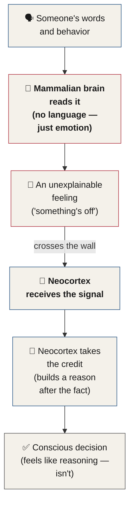
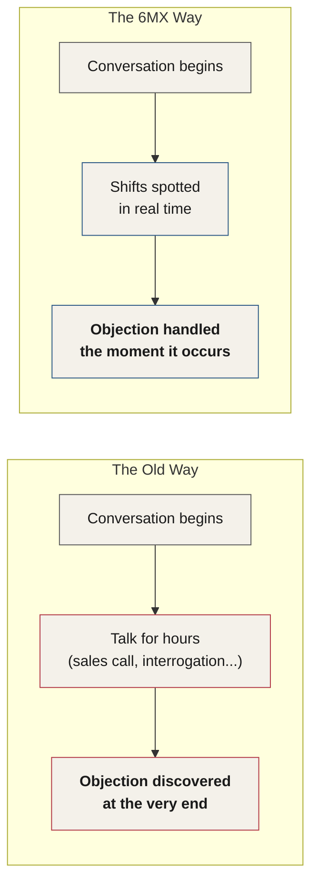

# Chapter 28 — The 6-Minute X-Ray

> *"When you have the ability to read people — not just see basic body language, but actually see behind the mask — everything changes."*

Chapter 27 explained why people become the animal they become — porcupine, sheep, fox — shaped one hidden decision at a time by the Childhood Development Triangle. This chapter hands you the instrument for reading that animal in real time.

::: definition
**The 6-Minute X-Ray (6MX)** — the profiling system this manual builds toward. Twenty-two years in the making, built to be learned one small skill at a time, so that anyone can develop a complete behavioral profile on another person in less than six minutes.
:::

There are four essential rules that govern influence, persuasion, and success at influencing and persuading. Learn them before anything else.

---

## Four Rules That Govern Influence and Persuasion

::: callout
**Four Rules That Govern Influence and Persuasion**

1. The extent to which someone can be persuaded varies for everyone.
2. The time it takes to get someone to the maximum level of influence also varies.
3. The person doing the persuading is typically more important than the techniques being used.
4. People who can read others enjoy a completely different world than others do.
:::

In point number four, I stated that people who can read others enjoy a completely different world than other people do. This is a fact. When you have the ability to read people — not just see basic body language, but actually see behind the mask — everything changes. Every interaction and conversation for the rest of your life will be drastically different.

I would like you to become **the most dangerous person in the room**. The skills you're about to learn are going to change your life. Many people think they have these skills. But in reality, less than 1% of people do.

---

## Skills and Techniques of Behavior Profiling

We can trace almost all of our failures back to three things.

| Root Cause | What It Governs |
|---|---|
| **Communication** | How we persuade — every time we convince someone of anything, from trying a new restaurant to answering questions in a job interview |
| **Observation** | How well we read people *and* situations — not just people, but the world they're standing in |
| **Self-Management** | How we carry ourselves — the daily habits, speech, walk, and movement that tell people about us before we say a word |

*Table 28.1 — Charles traces nearly every failure back to one of these three roots.*

When we communicate, we persuade — we do it all the time, whether we're convincing someone to try a new restaurant or answering questions during a job interview. Observation entails not only reading people, but reading situations as well; how well we observe the world drastically changes how we interact with it. A lack of observation and an inability to see the truth is likely responsible for many of our past failures. Self-management — how we manage and carry ourselves — matters just as much. Our choices in our daily habits have likely resulted in past failures of their own. The way we speak, walk, move, and interact with other people tells them a great deal about us, often before we've said a single word.

I'm sure that in the past, even with your best intentions, you failed to get the outcome you wanted. This is real: did you know the person had a negative gut feeling about you that set the stage for failure right from the beginning? This audiobook will teach you about observation — the critical superpower that makes the difference in every single interaction.

---

## Mastery

Mastery over a topic is something that's easy to gain, if you put in the work. In my extremely basic estimation, there are four levels of mastery.

### Level 4 — Surgeon

At the top level, we have a person who's put in countless hours toward a specific skill. It's not classroom education that gave them the skills of a surgeon — rather, it's the ingrained skills they've acquired from training and repetition. Although their education is necessary, no one becomes a surgeon without thousands of hours of practice and repetition. We would never allow someone to cut us open and mess with our organs if they hadn't done it many times before. We want the experience that comes from thousands of hours of practice.

I want you to get to this level. And I think you'll be very surprised when you discover just how fast it can be done. It may have taken me twenty-two years to develop the 6MX system, and I've done it in a way that makes it easy to learn and even easier to adapt into a skill. Developing the skills is on you, however. I'm the college that educated you and gave you the degree, but the practice is up to you. Although I'd love to be beside everyone listening to this, walking you through the steps, it just isn't realistic. But I have faith that once you see how powerful the system is, you'll be as addicted as I was.

I see my job as first showing you how powerful the system is, and then getting you addicted enough to keep working, putting in the daily practice, and eventually becoming the behavioral surgeon.

### Level 3 — Nurse

The nurse has put in the hours of practice, but still could never accomplish what the surgeon is capable of. The nurse has put in the work required for the education, and is able to perform some complex tasks and diagnoses. The nurse knows a lot about medicine, and knows enough to be dangerous, but will never see the world through the eyes of the surgeon.

### Level 2 — Paramedic

The paramedic was educated and has a variety of medical skills, but they are limited. It's easier to get to this level compared to Levels 3 and 4, and doesn't take that long relative to the others.

### Level 1 — "Grey's Anatomy Guy"

At level one, we have the person who's watched a few seasons of *Grey's Anatomy* and somehow thinks they're the surgeon — Level 4. This is called the Dunning-Kruger effect.

::: definition
**The Dunning-Kruger Effect, Revisited.** First named in Chapter 15: a cognitive bias in which people with low ability at a task overestimate their ability (Dunning & Kruger, 1999). It's related to the cognitive bias of **illusory superiority**, and comes from the same root cause — the inability of people to recognize their own lack of ability. People who have read a few articles or books, with genuinely limited skill in a subject, are far more likely to call themselves an expert.
:::

With regard to this manual, please be careful. Be suspicious if you find yourself thinking, *I've heard that before.* Chapter 15 warned about this exact trap. The best way to get the most from this audiobook is to get into the beginner's mindset — as if everything here is brand new. In the military, they have a common phrase I've heard thousands of times: *knowing is the enemy of learning.*

---

## Knowledge Versus Skill

I have a small online presence, but I'm amazed at how often I receive messages from people telling me how many journal articles they've read, books they've consumed, and websites they've researched on behavior. Of course, they're all well-meaning, and many of the things I've received have been fascinating. But as I noticed a trend over the years: people get addicted to information and knowledge. Many people have an insatiable appetite for information and knowledge, but they are rarely able to perform the techniques.

After a while, it struck me that these are the people teaching body language, people-reading, persuasion, and influence around the world. They have academic knowledge, but no real-world skills. This lack of real-world skills makes all the difference.

If we took the top salespeople from every Fortune 500 company and the top 100 interrogators in the world, sat down, and really got to know them — would we find: one, the person who's read every book on the techniques, tactics, and tricks for sales or interrogation? Or two, the person whose social skills are through the roof, who can read anyone they speak to, and can make anyone feel incredible?

Clearly the answer is number two. Because **skills beat information every time** — and that is what the 6MX process is all about.

This audiobook is presenting you with both information and skills. It may seem overwhelming at first, but please listen till the end. I'm going to show you how to learn one step at a time, in a way that won't overwhelm you. In fact, there's a method at the end of this section that takes about two minutes and fits on a Post-it note.

::: definition
**The Behavioral Compass** — the profiling method every skill in this manual culminates in. A technique simple enough to fit on a Post-it note, that allows you to develop a behavioral profile beyond what 99% of psychologists are capable of — in less than six minutes.
:::

This mirrors the Knowledge Proficiency Levels from Chapter 15 (KPL1 through KPL3) — the same climb from information to mastery, now told through four medical archetypes instead of three academic ones.

---

## The 2/3 Rule

There are many body language trainers around the world who enjoy citing a study done by a man named Albert Mehrabian at UCLA in the late 1960s. Mehrabian's study demonstrated that 93% of communication is nonverbal, with words making up the remaining 7%.

I, and many other experts — such as Mark Bowden, Scott Rouse, Greg Hartley, and Tonya Reiman — disagree. We call this **the body language myth**, a phrase coined by behavior expert Mark Bowden, who hosts The Behavior Panel show online with me.

If you watched a movie in a language you don't speak, you wouldn't understand what's being said by the characters in the movie. What's interesting is that the same university that published the study doesn't actually teach nonverbal communication at all. If you obtain a psychology PhD from UCLA, you will average eight minutes of learning about nonverbal communication over your many years of study. This isn't to say that UCLA is a bad college — in fact, all universities have about the same amount of training for psychologists in nonverbal communication.

So: if nonverbal communication is 93% of communication, and all psychological therapy is communication, why do schools spend less than 0.003% of the time training people in what is so critically important? I don't have an answer for this.

For the purposes of this section, let's conservatively estimate that about a third of communication is what's being said, and two-thirds is nonverbal. If the UCLA study shows us anything, it shows us that nonverbal communication is massively important, regardless of what precise number we assign it. For simplicity's sake, we'll simply use **the 2/3 rule**.

So why is nonverbal communication so important? The brain.

---

## The Brain

In the grand scheme of our time as humans on Earth, we only began talking to each other fairly recently. For tens of millions of years, if not more, we didn't have language at all. Our ability to communicate with each other was nonverbal — the same way animals communicate. In the same way that language evolved over time, our brains did too. Our brains evolved in three fundamental phases: the reptilian brain, the mammalian brain, and the neocortex.

The reptilian brain was the first to form in our heads. It's also called the basal ganglia, or brain stem. Its functions are mainly instinctive responses, impulses, and physical sensations. It's basically what's in a snake's head. Pretty basic.

The next phase of our mental development as humans was the mammalian brain. This is where we store implicit memories, emotional experiences, feelings, and desires. This part of our brain is literally right between our ears. For about 100 million years or so, this part of our brain has been communicating with other humans nonverbally. It predates language by a long shot. The mammalian part of our brain is what's behind most of the decisions we make in life. The mammalian brain reads the behaviors of other people. Over the millennia, this part of our brain has passed down nonverbal communication techniques to the next generation. Humans are capable of passing down genetic memories, and nonverbal communication is one of the pieces of software that comes pre-installed in all of us. This is the reason we're born with certain nonverbal communication skills. For instance, facial expressions are pre-installed, along with hundreds of other gestures and behaviors our ancestors used to communicate with each other before we all invented language. Babies smile, frown, and cry, all because our ancestors gave us these behaviors.

::: callout
**Old parts, familiar names.** You've already met these structures under other names. The **brain stem** and its role in ancestral, pre-conscious behavior was covered in Chapter 4. The **limbic system** — what this chapter calls the mammalian brain — was named directly as "the older, mammalian brain" in Chapter 11, alongside the **neocortex** covered there in full. Facial expressions being "pre-installed" is the same mechanism as an **Ancestral Script** (Chapter 4): a behavior wired in from birth because it kept our ancestors alive long enough to reproduce.
:::

### Why Gut Feelings Have No Words

Let's look at an example of the mammalian brain in action. Think back to a time you met someone, and their behaviors seemed to be great. They were well spoken and appeared to be a really cool person. But there was something about them that didn't feel right. Something was off. Something about the conversation didn't add up, but you couldn't quite put your finger on it. You had what we often call a gut feeling.

This happened for a few reasons.

First, the mammalian brain doesn't use language at all, so it makes sense that you cannot articulate the problem. The mammalian brain — the part of our brain that reads other people — deals in behavior and emotion only. Using the accumulation of millions of years of training, this part of your brain is constantly scanning people during every conversation and interaction that you have. However, without language, the mammalian brain can't let you know what it's seeing. It deals in emotions. So what we get is a feeling when it sees something that doesn't add up. We often refer to this as intuition. The reason we can't put our finger on it is that we're experiencing an emotional reaction to what our mammalian brain sees — not what it thinks about it.

Second, there's an information barrier from the mammalian brain to the neocortex. When the mammalian brain sees something relevant, the neocortex takes all the credit. Often we'll go back in time to rationalize what we saw in the conversation, and even fabricate memories of what took place to justify the gut feeling.

A perfect example of this is buying a product. We tell ourselves we're not manipulated by television commercials, advertisements, or other people. Instead, we insist that our decisions are based on research and facts — the neocortex. But in reality, it's far more likely that the decision was made by the mammalian brain, possibly in response to an advertisement or comments from an individual, that provoked a desire to buy the product.

*Figure 28.4 — Why a gut feeling has no explanation attached. The mammalian brain reads the signal and produces only a feeling; the neocortex receives it after the fact and manufactures the "reasoning."*

When we are exposed to communication that influences us, it lights up the animal brain. It creates emotional drives to action that flow upward to the neocortex. This is when all of us, as humans, reverse-rationalize the decision and convince ourselves that it was based on logic and facts. The funny part is, it wasn't.

Think of good communication as a tool that's able to break through the wall that separates the neocortex and the mammalian brain. By breaking down this wall, desire, action, impulse, and emotion are created. This is the same mechanism behind the Core Principle from Chapter 4: the closer to the brain stem a method is capable of reaching, the more effective it is.

::: callout
**On Gut Feelings, Revisited.** Chapter 11 named this exact mechanism: the limbic system doesn't traffic in language, so when it identifies something worth your attention, it hands you a feeling instead of a sentence. This chapter's "mammalian brain" and Chapter 11's "limbic system" are the same structure, described from two angles.
:::

The neocortex — the intellectual and executive functioning part of the brain, what makes us human — is relatively new compared to the reptilian and mammalian parts of our brain. The neocortex is where we process logic, creativity, questions, art, music, and poetry — arguably the reasons we even exist in the first place.

We read behavior using our genetically inherited skills. The reason the 6MX process is so effective is that it capitalizes on seeing behaviors that are not only unconscious but are deeply programmed into our brain. We are learning to see with the human part of our brains, in order to shine a light on what's hiding behind the mask.

---

## You're Competing With Social Media

For years now, an article has been circulating the internet suggesting that people's attention spans have been shrinking over time. It might make sense that this is factual, given that we're inundated with marketing pop-ups, ads, flashy videos, and nonstop notifications on our electronic devices — but it's totally not. Our attention spans aren't shrinking. **They're evolving.**

Because we're flooded with attention-grabbing material throughout our day, our brains have simply learned what to pay attention to and what to ignore.

::: callout
**Not an attention deficit — an interest deficit.** What has the appearance of an attention deficit is actually an interest deficit. Our brains simply learn what to pay attention to. You might struggle to focus during a horribly boring college lecture, but the capacity to binge-watch three seasons of *Game of Thrones* is still completely within you.
:::

We're able to selectively choose where our focus goes, and our brains are getting better at rapidly identifying something that's interesting or important. Our brains are highly adaptive. They're able to memorize patterns and instantly recognize when something is relevant or interesting.

With this new skill that our electronics have given us, we've become selective even in conversations. Scrolling through social media, and having the ability to flick away a video the moment it becomes boring or uninteresting, has led to the eventual development of a **hyper-screening brain**. And in conversations, you're competing for attention with clickbait and funny cat videos.

Later in this audiobook, I'll walk you through a surgical communication protocol, which will show you step by step how to create intense focus with anyone you speak to.

---

## The Wait-Till-the-End Fallacy

In sales, interrogations, or a host of other scenarios, people tend to wait until the end of the interaction to discover the other person has objections. Interrogations sometimes last hours, only for the officer to realize that he's not going to get a confession. Salespeople may also spend hours talking with a customer, only to find out at the end of the interaction that the customer is a hard no. This was one of the problems I spent years addressing.

The 6MX process will show you how you can spot these shifts as they happen, in real time.

*Figure 28.5 — The Wait-Till-the-End Fallacy. Talking longer doesn't surface an objection sooner — only real-time observation does.*

This will allow you to not only spot the objection, but deal with it the moment it occurs. You'll also be able to see every hidden and repressed disagreement your customer is experiencing, even if they aren't fully aware they're experiencing it.

It's not just negative behaviors you'll be trained to see. Because you interact with people, you'll be able to immediately spot when they are happy, excited, or interested in something you've mentioned. This is a valuable insight that will help you guide the conversation.

I'll tell you exactly how to build a behavioral profile in less than six minutes — a skill you'll be able to use in every conversation for the rest of your life. And no one will know.

---

## Summary

Human behavior matters so much more than most people realize. In every human decision and interaction, behavior takes the reins — mostly in the background and without our knowledge. So much of what influences us arrives through a nonverbal channel and secretly influences how we behave. As the human brain evolved, we became more complex creatures, but there's still a mammal in there that calls the shots when it counts.

Once we develop the ability to read behavior with clarity, the whole world changes. We see more, and therefore know more, about an interaction. And with this, we can almost see the future based on our observations of behavior.

In the next chapter, you're going to be shown the exact way that a true behavior profiler sees the world around them. Pay close attention — this skill has the ability to literally change your life overnight. The next chapter covers the four laws of behavior: the four ways you will start seeing people in your daily interactions. These four laws will make all the difference in your ability to read human behavior.

---

## Key Takeaways

- **Four rules govern influence and persuasion**: how far someone can be persuaded varies by person, the time it takes to reach maximum influence varies, the persuader matters more than the technique, and people who can read others live in a completely different world than everyone else.
- Nearly every failure traces back to three roots: **Communication** (how we persuade), **Observation** (how we read people and situations), and **Self-Management** (how we carry ourselves).
- The **Four Levels of Mastery** — Surgeon, Nurse, Paramedic, and "Grey's Anatomy Guy" — map the distance between borrowed confidence and real skill. Level 1 is the **Dunning-Kruger effect** (Dunning & Kruger, 1999, first named in Chapter 15) made visible.
- **Skills beat information every time.** The top salesperson or interrogator isn't the one who read the most books — it's the one whose social skills let them read anyone they speak to. This is the premise behind the **6-Minute X-Ray (6MX)** system and its capstone technique, **the Behavioral Compass**.
- The popular "93% of communication is nonverbal" statistic (Mehrabian, UCLA, late 1960s) describes a narrow experimental condition, not all communication. This manual adopts a more conservative **2/3 rule** instead: roughly one-third words, two-thirds nonverbal.
- The brain evolved in three phases — **reptilian, mammalian, and neocortex** — the same structures named in Chapters 4 and 11 as the brain stem, limbic system, and cortex. The mammalian brain produces gut feelings with no language attached; the neocortex receives the signal afterward and manufactures a "logical" reason for it.
- Attention spans aren't shrinking — they're evolving. What looks like an attention deficit is really an **interest deficit**, and every conversation now competes with a hyper-screening brain trained by social media.
- The **Wait-Till-the-End Fallacy**: in sales, interrogation, and beyond, most people only discover an objection after hours of conversation. The 6MX process spots the shift — objection or interest alike — the moment it happens.
- The system builds toward one goal: a complete behavioral profile on anyone, built in less than six minutes, that no one else will ever know you're running.

<!--
## Change Log

| Original (transcript) | Corrected | Reason |
|---|---|---|
| "less than one% of people do" | "less than 1% of people do" | numeral/percentage formatting |
| "We can trace almost all of our failures back to 3 things. Our communication, Our observation, Our self management." | "We can trace almost all of our failures back to three things." (triad recast as Table 28.1) | numeral spelled out; garbled capitalized fragments reorganized into a table for scannability, all content preserved |
| "How well we can observe the world, rastically changes how we interact with it" | "how well we observe the world drastically changes how we interact with it" | ASR mishearing ("rastically" → "drastically") |
| "A lack of observation and an inability to see the truth is likely responsible for many bypassed failures" | "...is likely responsible for many of our past failures" | ASR mishearing/garbled clause reconstructed, consistent with the chapter's repeated "past failures" phrasing |
| "Or choices in our daily habits have likely resulted in past failures" | "Our choices in our daily habits have likely resulted in past failures" | ASR homophone ("Or" → "Our") |
| "The way we speak, walk, walk, move, and interact with humans" | "The way we speak, walk, move, and interact with humans" | duplicated word removed |
| "Thizel, did you know that the person had a negative gut feeling about you" | "This is real: did you know the person had a negative gut feeling about you" | ASR garble reconstructed; "This is real." matches the author's own short-declarative-then-elaborate pattern used later in the chapter ("This is a fact.") |
| "This audiobook will teach you about observation.  The critical superpower that makes the difference in every single interaction." | merged with an em dash | sentence fragment repaired |
| "there are 4 levels of mastery" | "there are four levels of mastery" | numeral spelled out per house style |
| "It's not that classroom education that gave them the skills of a surgeon" | "It's not classroom education that gave them the skills of a surgeon" | redundant "that" removed |
| "no one becomes a surgeon without 1000s of hours of practice" / "the experience that comes from 1000s of hours of practice" | "...without thousands of hours of practice" / "...from thousands of hours of practice" | numeral-shorthand ASR artifact, spelled out (×2) |
| "Boats I have faith, that once you see how powerful the system is" | "But I have faith that once you see how powerful the system is" | ASR mishearing ("Boats" → "But") |
| "I see my job as 1st showing you" | "I see my job as first showing you" | ordinal ASR shorthand spelled out; the same "1st/2nd" → "first/second" pattern recurs several more times through the chapter and is corrected throughout without a separate log line each time |
| "Nurse, level 3." / "Paramedic. Level two." / "Grey's Anatomy Guy. Level one." | "Level 3 — Nurse" / "Level 2 — Paramedic" / "Level 1 — 'Grey's Anatomy Guy'" | standardized inconsistent digit/spelled numbering into one consistent label format matching "Level 4" |
| "Paramedic was educated and has a variety of medical skills" | "The paramedic was educated and has a variety of medical skills" | missing article restored, parallel to "The nurse..." |
| "somehow thinks they are the surgeon level four" | "somehow thinks they're the surgeon — Level 4" | punctuation clarity |
| "Dunning Kruger Effect, Dunning, 1999, is a cognitive bias in which people with low ability as a task overestimate their ability" | "The Dunning-Kruger effect (Dunning & Kruger, 1999) is a cognitive bias in which people with low ability at a task overestimate their ability" | citation format standardized to match the existing citation in Chapter 15; "as a task" → "at a task" |
| "get into the beginner mindset. As if everything here is brand new." | "get into the beginner's mindset — as if everything here is brand new" | possessive form matches Chapter 15's identical phrase ("a beginner's mindset"); fragment merged |
| "a common phrase, I've heard 1000s of times" | "a common phrase I've heard thousands of times" | numeral spelled out, comma splice removed |
| "how many journal articles they've read. books they've consumed, and websites they've researched" | "how many journal articles they've read, books they've consumed, and websites they've researched" | sentence fragment merged into a list |
| "Of course, they're all well-meaning and many of the things I've received have been fascinating. As I noticed a trend over the years.  People get addicted to information and knowledge." | "Of course, they're all well-meaning, and many of the things I've received have been fascinating. But as I noticed a trend over the years: people get addicted to information and knowledge." | garbled fragments reconstructed into two complete sentences, preserving all stated content |
| "these are the people teaching body language.  People reading, persuasion and influence around the world" | "these are the people teaching body language, people-reading, persuasion, and influence around the world" | fragment merged into a parallel list |
| "no real world skills. makes all the difference" | "no real-world skills. This lack of real-world skills makes all the difference" | hyphenation; fragment repaired |
| "sent down and really got to know them" | "sat down and really got to know them" | ASR mishearing |
| "Would they be one? The person who's read every book on the techniques, tactics, and tricks for sales or interrogation. Or two, The people who have the social skills that are through the roof, can read anyone they speak to, and can make anyone feel incredible." | "would we find: one, the person who's read every book on the techniques, tactics, and tricks for sales or interrogation? Or two, the person whose social skills are through the roof, who can read anyone they speak to, and can make anyone feel incredible?" | reconstructed into one grammatical either/or rhetorical question, preserving both options exactly as stated |
| "It may seem overwhelming at 1st" | "It may seem overwhelming at first" | ordinal spelled out |
| "a method at the end of this section that takes about 2 minutes and fits on a post-it note" | "...about two minutes and fits on a Post-it note" | numeral spelled out; brand capitalization |
| "All of these skills will culminate into one behavioral profiling method called the behavioral compass" | recast as a `::: definition` box for **The Behavioral Compass** | formatting only — content unchanged, given proper-noun treatment consistent with other named frameworks in this manual |
| "a study that was done by men named Albert Morabian at UCLA in the 1970s" | "a study done by a man named Albert Mehrabian at UCLA in the late 1960s" | proper name corrected via web search (Albert Mehrabian, UCLA); Mehrabian's studies were conducted in 1967 and popularized in his 1971 book *Silent Messages* — "the late 1960s" is the accurate window for the research itself |
| "Arabian study demonstrated that 93% of communication is nonverbal.  With words making of the remaining 7%" | "Mehrabian's study demonstrated that 93% of communication is nonverbal, with words making up the remaining 7%" | name restored; "making of" → "making up" |
| "Mark Bowden, Scott Rouse, Greg Hartley, and Tonya Raymond" | "Mark Bowden, Scott Rouse, Greg Hartley, and Tonya Reiman" | proper name corrected via web search — Tonya Reiman, author of *The Power of Body Language*, associated with the same Behavior Panel circle of experts |
| "who hosts the behavior panel show online with me" | "who hosts The Behavior Panel show online with me" | proper noun capitalized; verified via web search that The Behavior Panel is a real show whose panel includes Mark Bowden, Scott Rouse, and Greg Hartley alongside the author |
| "If you watched a movie and a language you don't speak" | "If you watched a movie in a language you don't speak" | ASR mishearing ("and" → "in") |
| "If you obtain a psychology PhD from UCLA, You will average 8 minutes" | "...you will average eight minutes" | capitalization fix; numeral spelled out |
| "This isn't saying the UCLA is a bad college" | "This isn't to say that UCLA is a bad college" | grammar cleanup |
| "So.  If nonverbal communication is 93% of communication, and all psychological therapy is communication. Why do schools spend less than .003% of the time" | "if nonverbal communication is 93% of communication, and all psychological therapy is communication, why do schools spend less than 0.003% of the time" | stray filler "So." dropped; fragments merged; leading zero added to decimal |
| "let's conservatively estimate that about 13rd of communication is what's being said" | "let's conservatively estimate that about a third of communication is what's being said" | ASR/transcription garble ("13rd" → "a third") |
| "If the UCLA study shows us anything, It shows us" | "If the UCLA study shows us anything, it shows us" | capitalization |
| "The simplicity's sake will simply use the 2 thirds rule" | "For simplicity's sake, we'll simply use the 2/3 rule" | garbled clause reconstructed |
| "why is nonverbal communications so important" | "why is nonverbal communication so important" | pluralization fix |
| "For 10s of 1000000s of years" | "For tens of millions of years" | numeral-shorthand ASR artifact spelled out |
| "Our rains evolved in 3 fundamental plants" | "Our brains evolved in three fundamental phases" | ASR mishearing ("rains" → "brains," "plants" → "phases"); numeral spelled out |
| "The reptilian brain.  The mammalian brain, the neo cortex." | "the reptilian brain, the mammalian brain, and the neocortex" | fragments merged into one list; "neo cortex" spelling standardized to "neocortex" per Chapter 11 |
| "About a 100000000 years or so" | "For about 100 million years or so" | numeral-shorthand ASR artifact spelled out |
| "The millennium, this part of our brain has passed down nonverbal communication techniques" | "Over the millennia, this part of our brain has passed down nonverbal communication techniques" | ASR mishearing reconstructed |
| "100s of other gestures and behaviors" | "hundreds of other gestures and behaviors" | numeral-shorthand ASR artifact spelled out |
| "their behaviors seem to be great" | "their behaviors seemed to be great" | tense agreement |
| "But There was something about them that didn't feel right" | "But there was something about them that didn't feel right" | capitalization |
| "the mammalian brain doesn't use language at all, so it makes sense so you cannot articulate the problem" | "...so it makes sense that you cannot articulate the problem" | repeated "so" corrected to "that" |
| "The mammalian bring, the part of our brain that reads other people" | "The mammalian brain, the part of our brain that reads other people" | typo/mishearing corrected |
| "Using the accumulation of 1000000s of years of training" | "Using the accumulation of millions of years of training" | numeral-shorthand ASR artifact spelled out |
| "The reason we can't put our finger on it is because we're experiencing an emotional reaction to what our mammalian brain sees.  Not what it thinks about it." | "The reason we can't put our finger on it is that we're experiencing an emotional reaction to what our mammalian brain sees — not what it thinks about it." | "is because" → "is that" grammar cleanup; fragment merged |
| "Often we'll go banquets in time to rationalize what we saw in the conversation, and even fabricate memories of what took place to justify the dumb feelings" | "Often we'll go back in time to rationalize what we saw in the conversation, and even fabricate memories of what took place to justify the gut feeling" | ASR garble reconstructed ("go banquets in time" → "go back in time"); "dumb feelings" corrected to "gut feeling," the term used consistently throughout this exact passage |
| "Perfect example of this is buying a product" | "A perfect example of this is buying a product" | missing article restored |
| "we insist that our decisions are based on research and facts, the neocortex" | "...based on research and facts — the neocortex" | punctuation clarity (em dash for the appositive) |
| "the decision was made by a mammalian brain" | "the decision was made by the mammalian brain" | article consistency |
| "break through the wall that separates a neocortex and the mammalian brain" | "...that separates the neocortex and the mammalian brain" | article consistency |
| "The neocortex, the intellectual and executive functioning part of the brain, is what makes us human. is relatively new compared to the reptilian and mammalian parts of our brain." | "The neocortex — the intellectual and executive functioning part of the brain, what makes us human — is relatively new compared to the reptilian and mammalian parts of our brain." | sentence fragment repaired |
| "process logic, creativity, questions, art, music, and poms are why we even exist in the 1st place" | "process logic, creativity, questions, art, music, and poetry — arguably the reasons we even exist in the first place" | ASR mishearing ("poms" → "poetry"); garbled trailing clause reconstructed; ordinal spelled out |
| "Well, it makes sense that this is factual, given that we are inundated with marketing, go-ups, ads, flashy videos, and non-storm notifications on our electronic devices, it's totally not." | "It might make sense that this is factual, given that we're inundated with marketing pop-ups, ads, flashy videos, and nonstop notifications on our electronic devices — but it's totally not." | ASR mishearings ("go-ups" → "pop-ups," "non-storm" → "nonstop"); missing contrastive "but" restored |
| "attention grabbing material" | "attention-grabbing material" | hyphenation |
| "Well, this has the appearance of an attention deficit is actually an interest deficit" | "What has the appearance of an attention deficit is actually an interest deficit" | garbled subject clause reconstructed |
| "binge watch 3 seasons of Game of Thrones" | "binge-watch three seasons of *Game of Thrones*" | hyphenation; numeral spelled out; title italicized |
| "memorize patterns, to instantly recognize when something is relevant" | "memorize patterns and instantly recognize when something is relevant" | redundant "to" removed for parallel structure |
| "hyper screening brain" | "hyper-screening brain" | hyphenation |
| "you're competing for attention with clickbait, funny camp videos. So we're even born." | "you're competing for attention with clickbait and funny cat videos." | "camp" corrected to "cat" (context: ubiquitous internet-video reference); trailing fragment "So we're even born" is an unrecoverable false start with no parseable content and was dropped as filler |
| "how to create intense focus with anyone who speaks to" | "how to create intense focus with anyone you speak to" | grammar repaired |
| "Wait till the end, fallacy." | "The Wait-Till-the-End Fallacy" (section heading) | reformatted the author's spoken section marker into a proper heading |
| "Sales may also spend hours talking with a customer" | "Salespeople may also spend hours talking with a customer" | subject corrected so the verb has a plausible actor |
| "the customer is a hard gnome" | "the customer is a hard no" | ASR mishearing |
| "This was one of the problems I spent in years addressing" | "This was one of the problems I spent years addressing" | stray preposition removed |
| "allow you to not only spot the objection, but to deal with them. the moment it occurs" | "allow you to not only spot the objection, but deal with it the moment it occurs" | pronoun agreement fixed; fragment merged |
| "every hidden and repressed disagreement that your customers experiencing" | "every hidden and repressed disagreement your customer is experiencing" | grammar repaired |
| "It's not just negative behaviors, you'll be trained to see." | "It's not just negative behaviors you'll be trained to see." | comma splice removed |
| "This is a valuable insight. will help you guide the conversation." | "This is a valuable insight that will help you guide the conversation." | fragment merged |
| "The skill you'll be able to use in every conversation you'll have for the rest of your life. And no one will know." | "...a skill you'll be able to use in every conversation for the rest of your life. And no one will know." | merged into the preceding sentence, redundant "you'll have" removed |
| "Human behavior matters so much more than most people realize. In every human decision and interaction. Behavior takes the reins." | "Human behavior matters so much more than most people realize. In every human decision and interaction, behavior takes the reins" | fragments merged |
| "We see more, and therefore no more about an interaction" | "We see more, and therefore know more, about an interaction" | ASR homophone ("no" → "know") |
| "Four laws of behavior, covered in the next chapter, are the 4 ways you will start seeing people in your daily interactions. These 4 laws will make all the difference" | "The next chapter covers the four laws of behavior: the four ways you will start seeing people in your daily interactions. These four laws will make all the difference" | numerals spelled out for consistency; restructured for grammatical flow |
-->
