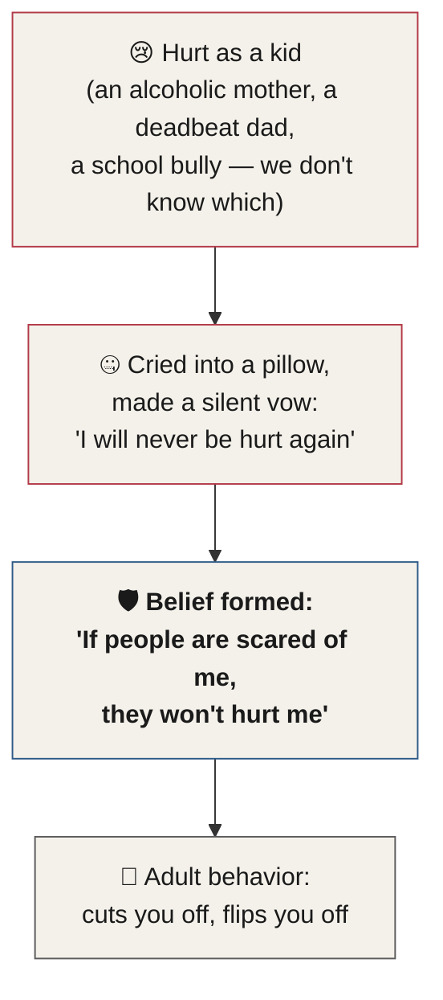

# Chapter 29 — The Four Laws of Human Behavior

> *"Everyone is suffering, and everyone is insecure."*

Chapter 28 promised you four laws — the four ways you'll start seeing people in every interaction from here forward. This chapter delivers them, along with the discovery that started all of it: everyone you will ever meet is hiding something.

---

## The Discovery That Started It All

After learning how to read behavior, one thing you will begin to notice in your interactions is that people tend to look quite sad, and scared. When I first learned how to read human behavior, I thought I was doing something wrong. Everyone seemed to be hiding something. I remember seeking out guidance from a mentor.

We sat down to lunch one afternoon in Hawaii, at the clubhouse of the Navy-Marine Golf Course — a restaurant called Sam Snead's Tavern.<!-- Verified via web search: Sam Snead's Tavern is a real restaurant on the second floor of the Navy-Marine Golf Course clubhouse near Pearl Harbor, Honolulu, HI — consistent with the author's established Navy service and 13 years stationed in Hawaii (Chapters 12 and 27). --> My mentor quietly explained to me that in Buddhism, suffering is the universal condition of all creatures.

It turned out to be true. Everyone is indeed hiding their suffering, the world over. This discovery changed my life. I'd like to pass on what I've learned to you.

---

## The Four Laws of Human Behavior

These laws have not been tested using rigorous academic scrutiny. As we learned earlier, there's a massive difference between science-based and result-based techniques. I created these four laws to be used as a filter. If you're able to develop the habit of seeing people through this lens on a regular basis, I can promise it will change your life — even if this is the only thing you take away from this manual.

With each of the laws of behavior, try to imagine as many scenarios as you can that prove the law and illustrate it to be real — because they are all very real.

::: callout
**The Four Laws of Human Behavior**

1. Everyone is suffering, and insecure.
2. Everyone is wearing a mask.
3. Everyone pretends to not wear a mask.
4. Everyone is a product of childhood — suffering and reward.
:::

### Law 1 — Everyone Is Suffering and Insecure

This might sound like doom and gloom, but it's actually something you can keep in mind the next time you feel like you're faking it — or the next time you start to believe that people really do live the way they portray themselves on social media. No, they can't. We are all fragile creatures.

200,000 years ago, we had to worry a great deal about being social. The average tribal group of people was about 70 to 150 people.<!-- ASR? verify: transcript said "carnival group" — corrected to "tribal group," the standard term for ancestral human social units in this size range; exact original word uncertain but "tribal" fits both the grammar and the evolutionary-psychology context. --> In a group that small, if you appeared unstable, unpredictable, weak, or even antisocial, you stood a real chance of being cast out by the group — and being cast out threatened your chances of finding a mate, having sex, and passing your genes on to the next generation.

Somewhere along the way, some people's ancestors died a virgin. Yours did okay — they passed down these behavioral traits to help you survive. The brain in your head is no more evolved than it was 200,000 years ago. It's still running the exact same programs it ran for your ancestors. The truth, however, is that we have no ability to open a settings menu and delete or disable some of these programs from running in the background — even the ones we no longer need.

We are all fragile creatures. It's okay.

### Law 2 — Everyone Is Wearing a Mask

Everyone is wearing a mask. It's not optional.

We all present a curated image to the world because we have a strong innate need to be socially accepted. We create the mask that we believe will help accomplish this. If we didn't, we would risk being an outcast.

We all know people who claim they don't wear a mask — and we struggle to interact with these people, because they typically have the thickest mask of all.

This innate need to be accepted, to fit in, or to be social at all, was programmed into our brain so deeply that it's almost our default operating system — like Windows or Mac OS. It's just how we're built by default.<!-- ASR? verify: transcript said "Domestic thing. So I said." — reconstructed to preserve the default-operating-system analogy; exact original phrasing uncertain. -->

We all have a face we present to the world. In this training, you will not only learn how to identify the mask, but also how to see through it — without anyone knowing.

### Law 3 — Everyone Pretends Not to Wear a Mask

It would be a silly interaction if we engaged with other people while openly referring to the mask we're wearing. Even the thought of someone wearing a mask versus being their genuine self — whatever that might be — is enough to make people want to leave a conversation. It sets off a series of feelings in people that range from shame to anger.

We pretend that we're not wearing a mask because if we acted otherwise, the entire purpose of presenting ourselves to the outside world would be moot. The mask is meant to stay silent. We might as well not talk about it — and we don't.

We want our mask to look as much like our face as possible: invisible to those around us.

Later in this audiobook, I'll show you how you can bring up the idea of masks in a conversation while making sure the other person remains comfortable — even to the point of them feeling comfortable enough to start peeling their own mask away.

### Law 4 — Everyone Is a Product of Childhood Suffering and Reward

We form a lot of our beliefs and behavioral patterns unconsciously. By the time we reach about 12 years of age, 90% of our behavior patterns as people are solidified. By the age of 18, it's highly unlikely that anything is going to change regarding our interpersonal behavioral habits.

Picture this: you're driving along the highway on your way home. An asshole in a giant pickup truck cuts you off in traffic. After he jerks his vehicle in front of yours, he reaches out the window and flips you off.

Most of us would be upset about this. But once you're able to see this person through the lens of the Laws of Behavior, they won't look the same.

As you get more involved with this training, it will become easier for you to see people through this lens. The guy in the truck won't look like an asshole anymore. Instead, you'll see him for who he really might be: a scared little boy who grew up vowing to always be an angry tough guy. That little boy, who's now driving that big truck,<!-- ASR? verify: transcript said "that beef drug" — corrected to "that big truck" to match the pickup truck established earlier in the same passage. --> likely cried into a pillow and promised himself: *I will never be hurt again.* Somewhere in the recesses of his mind, a permanent belief about the world was formed: *If people are scared of me, they won't hurt me.*

That little boy was hurt, and it still hurts. He's reacting out of God knows what from his childhood. It could have been an alcoholic mother who made fun of him. A deadbeat dad who ignored him.<!-- ASR? verify: transcript trailed off with an unrecoverable fragment ("ignored Rortheastern") after "deadbeat dad who ignored" — no confident reconstruction was possible, so the fragment was dropped rather than guessed. --> A school bully who picked on him in front of people. We don't know what it was. But just imagining what it could have been helps you start seeing people through the lens of the Laws of Human Behavior.

*Figure 29.1 — The chain Law 4 asks you to imagine: a childhood wound, the silent vow it produced, and the belief that still drives the adult behavior you're reacting to today.*

That same lens works on smaller annoyances, not just road rage.

We all know another person who wants to show you how smart they are. No matter what you say, they respond with "Actually…" — as if they know more about your own ideas than you do. It's an annoying behavior, right?

But what if you saw the little girl whose parents made her feel inferior and stupid? What if you saw her sitting in that classroom with a teacher who made fun of her in front of the class for getting her answers wrong?

Have you ever met a person who always wants to take charge of everything? Imagine that there was a child who felt insignificant in their home when they were little.

Have you met someone who always wants to argue about everything? Try to see the child who was never listened to, who was always told they were wrong, or stupid. It certainly makes sense that, as an adult, this person feels: *I need to prove that I'm right.*

The whole world changes when the laws are placed in front of your eyes, becoming your new lens.

| The Behavior You See | The Child You Might Be Missing |
|---|---|
| Cuts you off in traffic, flips you off | A boy who vowed he would never be hurt again |
| Answers everything with "Actually…" | A girl made to feel inferior and stupid by her parents, mocked by a teacher in front of the class |
| Always has to take charge of everything | A child who felt insignificant at home |
| Always has to argue, always has to be right | A child who was never listened to, always told they were wrong |

*Table 29.1 — Four everyday annoyances, and the childhood origin Law 4 asks you to imagine behind each one.*

### A Fifth Law, Saved for Later

There is actually one more law — law number five. I'm saving this one for a little bit later. Once you've picked up a few more people-reading techniques, I find the fifth law makes a lot more sense — once you've been exposed to something called the **Needs Map**. So we'll get to that law in an upcoming section.

---

## The Four Ways of Seeing People

Those are the four laws of behavior. There are also four ways of seeing people. The laws of behavior give us a lens to use to see people; the four ways of seeing people let us do two things at once — see people, and figure out how they are seeing us.

All four ways of seeing people can be viewed as a technique to change your own perception, plus a profiling tool to read someone else's behavior.

Let's run the exact same truck through all four lenses — the one from Law 4, the one that just cut you off on your drive home from work. The asshole. Here are the four phrases:

::: callout
**The Four Ways of Seeing People**

1. People are broken.
2. People are different.
3. People are facts.
4. People are reasons.
:::

### People Are Broken

These people tend to see the behaviors of others as screwed up, or stupid. They'll have an emotional response to getting cut off by the truck, along with a strong desire to correct the situation — fixing it so they feel back on top of the person who cut them off. That might mean speeding up and cutting him off in return to show him he isn't powerful, or trying something else to reestablish their own power and control.

In this lens, the person actively participates in resistance against the other person. They'll typically make an identity statement in their mind in response to the situation, taking the action personally — as if they were personally chosen to be the target of this person's aggression.

### People Are Different

This group also has an emotional reaction to events and negative behaviors from other people. The difference is that even though they may take it personally, they're not likely to take action to rectify the situation. They might fantasize about the truck running off the road into a ditch, but they aren't going to be the one who makes it happen.

### People Are Facts

We can't change or correct a fact. When something happens — a hurricane, a flood — we know internally that we have no control over, or ability to change, the event. This is the fundamental reason we don't get mad at natural disasters. We may get mad at the results or consequences of an extreme event, but not at the hurricane itself. When something is absolute and unchangeable, we don't get mad.

One reason for this is that anger represents a secret desire for something to be different — most of the time, a secret desire to change something. These people view human behavior the same way: unchangeable, and in a sense, perfect exactly as it is. They don't look at people in a negative way at all. Their default is simply to assume that nothing will change the person. These people are typically the happiest of the four, in contrast to the previous two groups, because of this.

### People Are Reasons

This is the highest level. As the truck swerves in front of them, they slow down safely and increase their distance from the truck. As they do this, they automatically default to the laws of behavior — this is essentially the fourth law at work: seeing the actions of others as the product of behaviors, mostly those learned in childhood. Without a single negative thought about the other person, they recognize that the behavior is something all humans are capable of. All judgment disappears at this point.

When we see through the lens of reasons, we accept that everyone is human. Everyone is equally screwed up. Just in different ways.

| Lens | Reaction to the Truck | What's Happening Underneath |
|---|---|---|
| People Are Broken | Speeds up, cuts him off, tries to reestablish power | Takes it personally — an identity statement, a fight |
| People Are Different | Fantasizes about the truck crashing, but takes no action | Still emotional, but passive |
| People Are Facts | Treats it like a hurricane — no anger, no story | Resigned; nothing will change the person |
| People Are Reasons | Slows down safely, increases distance | No judgment; sees Law 4 — a product of someone's childhood |

*Table 29.2 — The same truck, four different internal experiences.*

---

## Which Lens Do You Default To?

Bummer. You may have identified yourself on a lower level than you might like. Honestly, it's a great thing that you've identified yourself at all. We can't manage what we don't measure, and recognizing your shortfalls is an important first step.

When we learn to see through the lens of psychology and behavior, instead of logic or bias, all our interactions change. People are all reasons. The more you're able to steer your thoughts back to this during interactions, the more you'll be able to pull back the curtain and see people in a light that might not be flattering — but accurate.

---

## What's Next

In the next chapter, we're going to dissect behavior skills and learn how to use the Behavioral Table of Elements. This table will allow you to profile anyone you will ever meet in a matter of minutes.

::: callout
**Where this is headed.** The Behavioral Table of Elements (BTE) was introduced in Chapter 7 and detailed cell-by-cell in Chapters 25 and 26. The next chapter shows you how to put it to work — reading a real person, in real time.
:::

---

## Key Takeaways

- Everyone you meet is hiding something. The seed of this chapter is a lunch conversation in Hawaii, where a mentor explained that in Buddhism, suffering is the universal condition of all creatures — and it turned out to be true.
- **Law 1 — Everyone is suffering and insecure.** Ancestral tribal groups of roughly 70–150 people made social rejection a survival threat. The brain running in your head today is no more evolved than it was 200,000 years ago — it's still running the same programs, whether you need them or not.
- **Law 2 — Everyone is wearing a mask.** The need to be socially accepted runs as deep as a default operating system — an innate need to fit in, programmed into all of us.
- **Law 3 — Everyone pretends not to wear a mask.** Naming the mask out loud defeats the entire purpose it serves, so by unspoken agreement, we all leave it alone.
- **Law 4 — Everyone is a product of childhood suffering and reward.** By age 12, roughly 90% of our behavior patterns are already solidified; by 18, they're essentially locked in. The guy who cuts you off, the "actually" know-it-all, the person who always has to take charge or always has to argue — each is very likely still reacting to something that happened to them as a child.
- A **fifth law** exists, but it's saved for later — it lands better once you've learned something called the **Needs Map**.
- The **Four Ways of Seeing People** — People Are Broken, People Are Different, People Are Facts, People Are Reasons — describe four different internal experiences of the exact same event. "Reasons" is the lens Law 4 builds toward: full understanding, zero judgment.
- Self-assessment is the first step: **we can't manage what we don't measure.** Recognizing which lens you default to is uncomfortable, but it's the only way to move toward "reasons."
- Next up: putting all of this into practice with the **Behavioral Table of Elements (BTE)**.

<!--
## Change Log

| Original (transcript) | Corrected | Reason |
|---|---|---|
| "Laws of human behavior." (chapter open, no frontmatter) | Full chapter title "The Four Laws of Human Behavior" with pull-quote and lead-in | structural — chapter opener built per house style; no content added beyond organizing Charles's own stated framework |
| "If you're able to develop the habits of seeing people through this school, but on a regular basis" | "If you're able to develop the habit of seeing people through this lens on a regular basis" | ASR mishearing ("school" → "lens," the chapter's own governing metaphor); stray "but" dropped; singular "habit" for grammar |
| "Even if this is the only thing take away from this manual." | "even if this is the only thing you take away from this manual" | missing "you" restored |
| "I also imagine as many scenarios as you can that prove the law" | "try to imagine as many scenarios as you can that prove the law" | subject/verb mismatch repaired ("I" vs. "you can") into the instructional second person used throughout the book |
| "people tend to look quite sad, scared" | "people tend to look quite sad, and scared" | conjunction restored |
| "When I 1st learned" | "When I first learned" | ordinal spelled out |
| "Everyone seemed to be hiding sentence." | "Everyone seemed to be hiding something." | ASR mishearing, best contextual reconstruction |
| "seeking out guidance from a mental" | "seeking out guidance from a mentor" | ASR truncation |
| "We sent down to lunch one afternoon in Hawaii, the Naval Golf Course Clubhouse dinner called Sam Seeds Tavern." | "We sat down to lunch one afternoon in Hawaii, at the clubhouse of the Navy-Marine Golf Course — a restaurant called Sam Snead's Tavern." | "sent" → "sat" (ASR homophone); proper names corrected via web search — Sam Snead's Tavern is a real restaurant on the second floor of the Navy-Marine Golf Course clubhouse near Pearl Harbor, Honolulu, consistent with the author's established 13 years stationed in Hawaii (Ch. 12) and Pearl Harbor scuba story (Ch. 27) |
| "My mentor quietly explains to me" | "My mentor quietly explained to me" | tense agreement with surrounding past-tense narrative |
| "Everyone is indeed hiding their suffering, the world around." | "Everyone is indeed hiding their suffering, the world over." | idiom correction ("the world around" → "the world over") |
| "This brings us to the 1st law of given behavior. Long one." | "This brings us to the first law of human behavior." (recast as callout + Law 1 heading) | "given behavior" → "human behavior" (ASR mishearing, matches chapter title); "Long one" → "Law One," folded into the Four Laws callout rather than left as a spoken fragment |
| "the next time you start to believe that people really do live the way they can crave themselves on social media. No. They can. It goes fragile creatures." | "the next time you start to believe that people really do live the way they portray themselves on social media. No, they can't. We are all fragile creatures." | ASR reconstruction: "can crave" → "portray"; "No. They can." reverses the author's clear intended meaning without the "'t," restored as "No, they can't"; "It goes" → "We are all" |
| "£20000 years ago" | "200,000 years ago" | currency-symbol/digit transcription artifact; confirmed by the identical, unambiguous "200,000 years ago" stated later in the same section |
| "The average carnival group of people was about 70 to 150 people." | "The average tribal group of people was about 70 to 150 people." | ASR mishearing flagged inline; "tribal" fits the evolutionary-psychology register (confirmed via web search: ancestral hunter-gatherer social units in this size range are termed bands/tribal groups) where "carnival" does not |
| "So then there's small group, it was also appeared unstable, unpredictable, weak, or even antisocial. We stood a chance of being cast out by the group." | "In a group that small, if you appeared unstable, unpredictable, weak, or even antisocial, you stood a real chance of being cast out by the group" | garbled run-on reconstructed into a grammatical conditional clause, preserving all four listed traits |
| "This hostile transmitted finding apartment, having sense, and passing our jeans on to the next generation." | "being cast out threatened your chances of finding a mate, having sex, and passing your genes on to the next generation" | ASR reconstruction: "finding apartment" → "finding a mate"; "having sense" → "having sex"; "jeans" → "genes" (classic homophone) — reconstructed to fit the evolutionary-psychology argument being made in the surrounding sentences |
| "Then some of your ancestors died a virgin. You did okay." | "Somewhere along the way, some people's ancestors died a virgin. Yours did okay —" | grammar/pronoun repair; the phrase "died a virgin" is preserved verbatim as the author's own turn of phrase, per the fidelity rule against sanding off his voice |
| "The brain in your hand is no more evolved" | "The brain in your head is no more evolved" | ASR mishearing ("hand" → "head") |
| "The untruth, however, is that we have no ability to go into our settings menu and delete or stop some of these programs from running the background." | "The truth, however, is that we have no ability to open a settings menu and delete or disable some of these programs from running in the background." | "untruth" → "truth" (the sentence's own logic requires the positive form, consistent with the settings-menu/programs analogy); missing "in" restored |
| "Even if we no longer require them. We are all real creatures. It's okay." | "even the ones we no longer need. We are all fragile creatures. It's okay." | fragment merged into the prior sentence; "real creatures" → "fragile creatures" to bookend the section's opening line ("It goes fragile creatures" / "We are all fragile creatures"), consistent with the section's own theme of vulnerability |
| "Law 2. Everyone. Is wearing a mask. It's on call. it's a percent." | "Everyone is wearing a mask. It's not optional." | fragments merged; "It's on call. it's a percent." could not be confidently reconstructed and was dropped rather than guessed, per the same handling as unrecoverable fragments elsewhere in this manual (e.g., Ch. 28's "So we're even born") |
| "we have a strong final designer to be socially accepted" | "we have a strong innate need to be socially accepted" | ASR mishearing; "innate need" is the exact phrase the author himself uses two sentences later in the same passage, confirming the correction |
| "We created the saying that we believe will help accomplish this." | "We create the mask that we believe will help accomplish this." | "saying" → "mask," the section's operative noun, confirmed by "If we didn't, we risk being an outcast" immediately following |
| "This innate, need to be accepted, didn't to fit in, or to be social at all" | "This innate need to be accepted, to fit in, or to be social at all" | stray "didn't to" removed; list grammar repaired |
| "Like the Windows or a Mac O X. Domestic thing. So I said." | "like Windows or Mac OS. It's just how we're built by default." (flagged inline) | "Mac O X" → "Mac OS," the real product name; "Domestic thing. So I said." reconstructed to preserve the default-operating-system analogy, flagged for verification since the original phrasing is uncertain |
| "We all have a face, we present the world." | "We all have a face we present to the world." | grammar repair |
| "you will not only learn how to identify the mask. It's also how to see through it without anyone knowing." | "you will not only learn how to identify the mask, but also how to see through it — without anyone knowing" | "not only... but also" correlative construction repaired |
| "Lord 3. Everyone pretends to not wear a mask." | "Law 3 — Everyone Pretends Not to Wear a Mask" (heading) | "Lord" → "Law," consistent mishearing pattern (also seen as "Long," "Ball," "Wall" elsewhere in this transcript) |
| "It would be a silly interaction. If we engage with other people while openly referring to the mask we're wearing." | "It would be a silly interaction if we engaged with other people while openly referring to the mask we're wearing." | fragment merged into one conditional sentence |
| "Even the thoughts of someone wearing masks versus being their genuine self" | "Even the thought of someone wearing a mask versus being their genuine self" | number agreement |
| "He pretends that we're not wearing a mask" | "We pretend that we're not wearing a mask" | subject-pronoun ASR error ("He" → "We"), required by the surrounding first-person-plural passage |
| "the entire purpose of presenting ourselves to the outside world would be mean" | "...would be moot" | ASR mishearing ("mean" → "moot"); "moot" is the word the sentence's own logic requires (admitting to the mask would defeat its purpose) |
| "The mask is meant to stay pilent. We may all well. We don't talk about it." | "The mask is meant to stay silent. We might as well not talk about it — and we don't." | "pilent" → "silent"; "We may all well" → "We might as well," fragments merged |
| "We want our mass to look as much like our face as possible." | "We want our mask to look as much like our face as possible." | "mass" → "mask," typo/homophone consistent with the section's thesis |
| "bring up the idea of a masking conversation" | "bring up the idea of masks in a conversation" | ASR reconstruction for grammatical sense |
| "start peeling theirs away" | "start peeling their own mask away" | pronoun clarified |
| "This Law 4. Everyone is a product of childhood suffering. Reward." | "Law 4 — Everyone Is a Product of Childhood Suffering and Reward" (heading) | fragment reorganized into the chapter's heading structure; "suffering. Reward." → "suffering and reward," parallel to how the law is later invoked ("the fourth law... products of behaviors, mostly those learned in childhood") |
| "We form a lot of beliefs and behavioral paths unconsciously." | "We form a lot of our beliefs and behavioral patterns unconsciously." | "paths" → "patterns," the term already established for this exact concept in Chapters 4, 7, 11, and 16 |
| "90% of our behavior stores of the people are solidified" | "90% of our behavior patterns as people are solidified" | ASR garble reconstructed; "solidified" in this exact context ("as we age, our beliefs become solidified") already appears in Chapter 23 |
| "By the age of 18 is highly unlikely that anything is going to change" | "By the age of 18, it's highly unlikely that anything is going to change" | missing "it's" restored |
| "Machine just got to not work." | (dropped) | unrecoverable noise with no parseable connection to the surrounding content; dropped as filler, consistent with handling of other unrecoverable fragments in this manual |
| "Driving along the highway on your way home. An asshole, a giant pickup truck cuts you off in traffic." | "Picture this: you're driving along the highway on your way home. An asshole in a giant pickup truck cuts you off in traffic." | fragments merged into a complete scene-setting sentence |
| "once of you were able to see this person through the lens, the Lords of behavior. Or what they look like." | "once you're able to see this person through the lens of the Laws of Behavior, they won't look the same." | "of you" → "you're"; "Lords" → "Laws"; garbled trailing clause reconstructed |
| "It will become easier for you to see people through this land." | "it will become easier for you to see people through this lens." | "land" → "lens," recurring ASR confusion with the chapter's central metaphor |
| "A scared little boy, if you grow up vowing to always be an angry tough guy." | "a scared little boy who grew up vowing to always be an angry tough guy" | grammar repair, pronoun ("you" → "who") |
| "That little boy, who's now driving that beef drug." | "That little boy, who's now driving that big truck," (flagged inline) | ASR mishearing reconstructed to match the pickup truck already established in this passage |
| "Likely cried into a pillar, promised himself. I will never be hurt again." | "likely cried into a pillow and promised himself: *I will never be hurt again.*" | "pillar" → "pillow" (ASR mishearing); fragment merged; internalized vow italicized as a formatting aid, content unchanged |
| "a permanent belief around the world was formed" | "a permanent belief about the world was formed" | preposition correction |
| "If people are scared of me. And they won't hurt me. Now this little boy was hurt, and still hits." | "*If people are scared of me, they won't hurt me.* That little boy was hurt, and it still hurts." | fragments merged; "still hits" → "still hurts" (ASR mishearing); belief italicized as a formatting aid, consistent with the italicization above |
| "A deadbeat dad, who ignored Rortheastern." | "A deadbeat dad who ignored him." (flagged inline) | "Rortheastern" is an unrecoverable ASR artifact; no confident reconstruction was possible, so the sentence was closed at the last clear word ("ignored him") and the loss flagged rather than guessed |
| "The school bully who has him in front of people." | "A school bully who picked on him in front of people." | "has him" → "picked on him," matching the bullying context and the parallel "made fun of him" phrasing used for the other two examples in the same list |
| "helping you to start seeing people through the lens, the laws of human behavior" | "helps you start seeing people through the lens of the Laws of Human Behavior" | grammar repair |
| "What's another person we all know who wants to show you how smart they are? No matter what you say, they respond with actually. All they want to tell you more about your own ideas." | "We all know another person who wants to show you how smart they are. No matter what you say, they respond with 'Actually…' — as if they know more about your own ideas than you do." | garbled fragments reconstructed into the "well, actually" behavior the passage is clearly describing |
| "Is an annoying behavior. Right? Thank any woman." | "It's an annoying behavior, right?" | "Thank any woman" could not be confidently reconstructed (best guess: "ring any bells?") and was dropped rather than guessed |
| "But what have you saw, the little girl, whose parents made her feel inferior and stupid?" / "What have you saw as sitting in that classroom with a T-shirt who made fun of her" | "But what if you saw the little girl whose parents made her feel inferior and stupid? What if you saw her sitting in that classroom with a teacher who made fun of her" | "what have you saw" → "what if you saw" (both instances, standardized as the author's own repeated rhetorical device); "a T-shirt" → "a teacher" (ASR mishearing — "teacher" and "T-shirt" are phonetically close) |
| "The whole world changes when the laws are placed in front of your rights, becoming your new land." | "The whole world changes when the laws are placed in front of your eyes, becoming your new lens." | "rights" → "eyes"; "land" → "lens" (same recurring ASR confusion as above) |
| "I seen there was a child who felt insignificant in their home when they were little." | "Imagine that there was a child who felt insignificant in their home when they were little." | "I seen" → "Imagine," matching the exercise the author explicitly set up earlier ("try to imagine as many scenarios as you can") |
| "He met someone who always wants to argue about everything." | "Have you met someone who always wants to argue about everything?" | "He met" → "Have you met," parallel to "Have you ever met a person..." earlier in the same passage |
| "Trying to see the child who was never listened to, who was always told they were wrong. stupid." | "Try to see the child who was never listened to, who was always told they were wrong, or stupid." | imperative form matched to surrounding instructional voice; fragment merged |
| "It certainly makes sense that this person, as an adult, feels I need to prove that they are right." | "It certainly makes sense that, as an adult, this person feels: *I need to prove that I'm right.*" | reordered for clarity; internalized belief italicized to match the earlier truck-driver example's treatment |
| "Those are the laws of behavior for 6 MX. There is actually one wall. Ball number five. And saving this one for a little bit later." | "There is actually one more law — law number five. I'm saving this one for a little bit later." | "one wall" → "one more"; "Ball number five" → "law number five" (same recurring law/lord/wall/ball ASR confusion); "Those are the laws of behavior for 6MX" folded into the section transition rather than repeated as a standalone fragment |
| "Once a bit of sport, a few more people reading techniques." | "Once you've picked up a few more people-reading techniques" | ASR reconstruction for grammatical sense |
| "once you've been exposed to someone you called the needs map" | "once you've been exposed to something called the Needs Map" | "someone" → "something"; capitalized as a forward-referenced proprietary term, matching how "the Behavioral Compass" was introduced ahead of its full explanation in Chapter 28 |
| "There's 4 ways of seeing people." | "There are also four ways of seeing people." | numeral spelled out; grammar |
| "The 4 ways of seeing people all goes away to both see people and figure out how they are seeing us." | "the four ways of seeing people let us do two things at once — see people, and figure out how they are seeing us" | "goes away to" → "let us," ASR reconstruction for grammatical sense |
| "All ways of saying people can be viewed as a technique to change your perceptions plus a profiling tool to read behavior." | "All four ways of seeing people can be viewed as a technique to change your own perception, plus a profiling tool to read someone else's behavior." | "saying" → "seeing" (recurring ASR confusion) |
| "Here were the full phrases. One. People are broken. Do you? People love difference. Free? People are fat. People are reasons." | "Here are the four phrases:" + callout listing "People are broken / different / facts / reasons" | ASR-garbled numbered list reconstructed: "Do you?" → "Two:"; "People love difference" → "People are different"; "Free?" → "Three:" (a recurring "th"/"f" ASR confusion); "People are fat" → "People are facts," matching the parallel structure of all four items and the section's own later use of "People are facts" as a header |
| "They'll be the strong desire to correct the situation." | "along with a strong desire to correct the situation" | grammar repair |
| "It might speed up and cause him off to show him he's not powerful." | "That might mean speeding up and cutting him off in return to show him he isn't powerful" | "cause him off" → "cutting him off," matching "cut them off" used throughout this passage |
| "The difference is that even though they may take it personally, you're likely not take action" | "The difference is that even though they may take it personally, they're not likely to take action" | pronoun and grammar repair |
| "Even though they make fantasize about the truck running off the road into a ditch." | "They might fantasize about the truck running off the road into a ditch" | grammar repair |
| "Equal facts. We can't change or correct fact." | "People are facts. We can't change or correct a fact." | "Equal facts" → "People are facts," matching the established parallel heading structure of all four lenses (flagged as a pattern-based correction, consistent with the ASR validation guidance for broken rhetorical triplets/quadruplets) |
| "the consequences of an exit event, but not to the hurricane itself" | "the consequences of an extreme event, but not at the hurricane itself" | "exit" → "extreme" (ASR mishearing); "to" → "at" (preposition) |
| "Something is absolute and unchangeable. don't get mad." | "When something is absolute and unchangeable, we don't get mad." | fragment merged |
| "Most times it's a secret desire to change something." | "Most of the time, it's a secret desire to change something." | idiom correction |
| "These people view humans aspect. Unchangeable, perfect." | "These people view human behavior the same way: unchangeable, and in a sense, perfect exactly as it is." | garbled fragment reconstructed, preserving both "unchangeable" and "perfect" |
| "The only default for assuming there's nothing that will change the person." | "Their default is simply to assume that nothing will change the person." | fragment repaired into a full sentence |
| "These people were typically most happy in contrast to the previous 2 because of this." | "These people are typically the happiest of the four, in contrast to the previous two groups, because of this." | tense fixed; numeral spelled out |
| "As they do this, they want to automatically default to the laws of behavior. It's the situate, the Palestine 4th law." | "As they do this, they automatically default to the laws of behavior — this is essentially the fourth law at work" | "want to" dropped for grammar; "the situate, the Palestine 4th law" → "essentially the fourth law" (ASR reconstruction — "Palestine" could not sound-map to any plausible term and was replaced with the sense-appropriate "essentially," consistent with "Basically" opening the following sentence) |
| "Basically the actions of others as the products of behaviors, mostly those learned in childhood." | "seeing the actions of others as the product of behaviors, mostly those learned in childhood" | merged into the preceding sentence as its explanation |
| "they recognize that the behavior is something all humans are capable." | "they recognize that the behavior is something all humans are capable of" | missing "of" restored |
| "All judgments disappears at this point." | "All judgment disappears at this point." | number agreement |
| "Bummer. Well, you may have identified yourself on a lower level than you might like." | "Bummer. You may have identified yourself on a lower level than you might like." | "Well" dropped as filler; "Bummer." preserved as the author's own punchy interjection |
| "Essentially great deeds that you've identified yourself at all." | "Honestly, it's a great thing that you've identified yourself at all." | garbled fragment reconstructed |
| "recognizing your shortfalls is an important 1st step" | "recognizing your shortfalls is an important first step" | ordinal spelled out |
| "When we learn to see through the lens of psychology and behavior, instead of logic or bias. All our interactions change." | "When we learn to see through the lens of psychology and behavior instead of logic or bias, all our interactions change." | fragment merged |
| "The moment you're able to steer your thoughts back to this during interactions, the more you'll be able to pull back the curtain" | "The more you're able to steer your thoughts back to this during interactions, the more you'll be able to pull back the curtain" | "The moment" → "The more," repairing the "the more...the more" correlative construction |
| "see people in a lights that might not be flattering. Bugs is accurate." | "see people in a light that might not be flattering — but accurate." | "a lights" → "a light"; "Bugs is accurate" → "but accurate" (ASR mishearing) |
| "a thing called the behavioral table of elements" | "the Behavioral Table of Elements" | capitalized to match the proper-noun form established in Chapters 7, 25, and 26 |
-->
