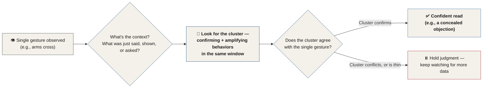
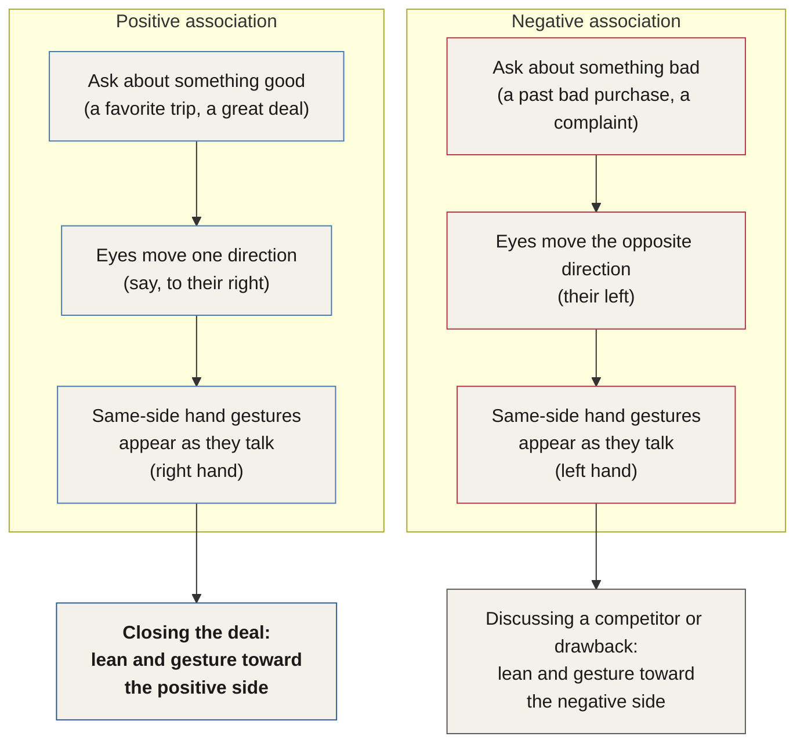

# Chapter 30 — Behavior Skills

> *"Without context, we fail. Without clusters, we don't know much."*

We see a lot of body language articles out there promising to deliver the secrets to when she's ready to be kissed, or the sure signs he's cheating on you. Nearly all of them make the same mistake — the attribution error — telling you that a single gesture carries one fixed, standalone meaning. This chapter is where the Behavioral Table of Elements graduates from theory into daily use: the eyes, the face, and the body, broken down into the specific, reliable signals worth watching for, and the context and clustering that make them mean anything at all.

## The Attribution Error

::: definition
**The attribution error** — the mistake of treating a single gesture as if it carries one fixed, standalone meaning, independent of the context that produced it.
:::

This is the error body language experts make when they tell you that someone crossing their arms is, categorically, dismissive, withholding, concealing, defensive, closed off, and so on.<!-- ASR? verify: source audio reads "disentive" — reconstructed as "dismissive," the most plausible reading in a list of near-synonyms for closed-off behavior --> It isn't true, and training people to think this way is deceptive in and of itself.

When we read behavior, context is everything. If you're in conversation with someone and you catch a tiny facial expression of disgust, recognizing the expression is only half the job — the training is close to useless if you haven't also learned how to establish the context, topic, or subject that caused it. For example, if you saw disgust flash across someone's face immediately after mentioning Hillary Clinton or Donald Trump, you'd immediately know a lot about how that person views the world — a small window into it, at least.<!-- ASR? verify: source audio reads "if you saw discussed immediately after mentioning Hillary Clinton or Donald Trump" — reconstructed as "if you saw disgust immediately after mentioning," matching the facial expression of disgust introduced one sentence earlier -->

The same is true in sales. If you're in a sales position and you see something Charles calls **lip compression** — where the lips squeeze together — you could assume you're watching someone withhold an opinion. But if you don't know what was actually being said in the conversation when you observed it, the skill of observation is next to meaningless. Say you're talking with a customer, you go over payment terms or interest rates, and they tell you it sounds good to them — but their lips compress as they nod in approval. You've got work to do. Not only have you spotted a concealed objection that has the potential to sink the sale, you've also identified exactly where to take the conversation next in order to disarm or overcome the unconscious objection.

## Clusters: Why the Table Looks Like a Periodic Table

Before briefly revisiting the Behavioral Table of Elements, there's one concept worth locking in first: **clusters**.

The table is laid out to resemble a periodic table of elements for two reasons. One, it looked cool and instantly recognizable. Two — and this is the important one — it shows us, just like the real periodic table, that individual elements get combined with each other to form something larger. Every cell in the Behavioral Table of Elements is laid out so that the elements of behavior must be combined together in order to form a cohesive opinion about a behavior. Without context, we fail. Without clusters, we don't know much.

Chapter 25 already gave this idea its formal name: a **Group** — a series or collection of several gestures and behaviors performed within a very small time frame, usually in response to a single stimulus. In casual, spoken language you'll hear this called a *cluster* just as often — same idea, same concept, just two names for it in practice.

*Figure 30.1 — From a single gesture to a conclusion: establish the context, find the cluster, and only then commit to a read.*

## The Behavioral Table of Elements, Briefly Revisited

Chapters 25 and 26 covered the BTE in full — its two axes, its fourteen data points, the color and letter coding, and a cell-by-cell field guide to every behavior on the table. This section won't repeat that work. What follows is the short refresher Charles gives before diving into the eyes, the face, and the body — plus one of the best stories in this entire manual.

### The Actual Origin Story

The Behavioral Table of Elements — the BTE — was designed by Charles over a decade ago, originally for analyzing the behavior of prisoners overseas undergoing interrogation. It has since been hung on the walls of the FBI Academy and is used in hundreds of police departments around the world.<!-- ASR? verify: "100s" reconstructed as "hundreds" — spoken-number formatting only, no factual change --> The goal was to develop a cohesive system that could track observations of human behavior in a way that could be communicated and understood by anyone.

As impressive as that sounds, the actual BTE origin story is a lot more interesting.<!-- Change: "the angual BTE origin story" corrected to "the actual BTE origin story" — ASR mishearing -->

In 2005, I was watching an episode of *The Bachelor* with my mom. Don't judge me. We sat in my parents' study in two leather chairs as she introduced me to a show I'd never seen before, each of us holding a glass of wine, fixated on the television. My mother walked me through how the show worked, and detailed at length both the girls she liked and the nasty qualities of the ones she didn't. It was a fascinating concept.

At one point, she pointed out one of the women on the show and remarked that she was really sweet and honest.<!-- Change: "Another pointed out one of the ladies on the show" corrected to "At one point, she pointed out one of the women on the show" — ASR mishearing/grammar repair --> I had to interrupt. We had TiVo, so I was able to rewind and point out to Mom that the sweet, honest woman had just lied to the Bachelor three times while they sat in a hot tub. I paused the TV at exactly the right moment, pointing at the deception indicators. She was very impressed, which made my evening. Who doesn't like impressing their mom?

*"A moment, Charles, I wish I could just borrow your eyes to watch this show."*<!-- Change: "Chase" corrected to "Charles" — the author's own name misheard by ASR, same error and same fix already applied in Chapter 9 (see that chapter's Change Log) -->

On one hand, it was humorous that she wanted to use nearly a million dollars' worth of training in interrogation and behavior analysis just to watch *The Bachelor*.<!-- Change: "$1000000" reconstructed as "a million dollars" — spoken-number formatting only --> But on the other hand, the statement really intrigued me.

Later that night, as I lay in the bedroom I grew up in, I couldn't help but think of my childhood. As a child, my mother kept a dozen or so educational placemats around<!-- Change: "kids placements" corrected to "educational placemats" — ASR mishearing, confirmed by "placemats"/"placemat" used correctly three more times later in this same anecdote -->, each featuring some type of educational material. I'd scarf down my cereal or oatmeal each morning and look at the placemats, learning something new — the continents, the planets, the list of U.S. presidents, the capital cities of the states on a colorful, waterproof map. As I lay in bed that night, I thought: *how can I translate every piece of training I have in behavior into something that could literally fit onto a placemat?*<!-- Change: "into a placement" corrected to "onto a placemat" — ASR mishearing -->

I spent years researching, and countless hours on my knees in my living room, arranging and rearranging note cards and cross-checking against academic research, to ensure I had something that was both complete and valuable. I learned a lot about behavior creating this table. But I reluctantly learned even more, it seems, about Microsoft Excel putting this beast together.

By the time I finally had a product, I sent it to my mom. She was impressed. She was also extremely confused.<!-- Change: "It's also extremely confused" corrected to "She was also extremely confused" — grammar repair; "It's" has no coherent referent, and the sentence is clearly still describing the mother's reaction --> Okay, I thought, I can fix this. So I built one more placemat that contained all the instructions on how to read the table. Just like that, it was done.

Every element of the BTE was broken down across Chapters 25 and 26 of this manual<!-- Change: "Each element of the BT is broken down in section 4 of this manual" corrected to "Every element of the BTE was broken down across Chapters 25 and 26 of this manual" — "BT" corrected to "BTE," and the internal "section 4" scaffolding replaced with an actual chapter cross-reference, consistent with how Chapter 25's own Change Log documents dropping this kind of internal section-numbering in favor of chapter references -->, and you can also download the entire Behavioral Table of Elements for free from the visual resources. It's something you can keep on your phone, your iPad, or anywhere you can refer to it often. I promise I'm not going to go through this thing cell by cell again<!-- Change: "sell by sell" corrected to "cell by cell" — ASR mishearing, consistent with "cell" used throughout Chapters 25–26 --> — but let me remind you how it works.

### As the World's First Behavior Profiling Tool

The Behavioral Table of Elements was designed to be used everywhere — from an overseas interrogation room to a first date. The table doesn't just allow advanced, standardized analysis of behavior; it also trains operators to recognize behavior signals and to see the crucial elements that most people miss during conversation.

### The Cell Key, Condensed

Every cell on the table packs in the same set of data points — Chapter 25 walks through all fourteen of them field by field, with a worked interrogation example. Here's the condensed version restated at the top of this chapter:

| Field | What It Tells You |
|---|---|
| Symbol | The cell's abbreviation, used to annotate it quickly on a report or in conversation |
| Name | A short description of the behavior |
| Confirming Gestures | Related behaviors that confirm the original intended meaning |
| Amplifying Gestures | Behaviors that add meaning on top of the original intended meaning |
| Microphysiological Amplifiers | Small physiological indicators used to measure the severity or intensity of the behavior |
| Variable Factors | How many variations of this single behavior have been identified |
| Cultural Prevalence | Whether a given culture is more or less likely to perform the behavior |
| Sexual Propensity | Whether men or women are more or less likely to perform the behavior |
| Gesture Type | Which of the four behavior types the behavior belongs to — Open, Closed, Aggressive, or Unsure |
| Conflicting Behaviors | Behaviors that, observed alongside this one, indicate a result other than the behavior's intended meaning |
| Body Region | Which body part or region is mostly involved with the behavior |
| Deception Rating Scale (DRS) | The likelihood of stress or deception, on a one-to-four scale |
| Deception Time Frame | Whether the behavior is likely to be seen before, during, or after a response is given |

*Table 30.1 — The BTE's cell-key fields, as restated in this chapter. For the full fourteen-point breakdown — including the Reference Number field and a worked interrogation example — see Chapter 25.*<!-- Change: "Perception rating scale. DRS." corrected to "Deception Rating Scale (DRS)" — ASR mishearing / factual correction, matching the term as established in Chapters 25–26 --><!-- Change: "Conflicting behaviors. AV is that indicate conflict with behaviors intended meaning" corrected and reworded to match the field's own established description in Chapter 25 -->

### Architecture and Colors

The BTE is laid out so the head sits at the top of the table<!-- Change: "so the top of the hand is on the top of the table" corrected to "so the head sits at the top of the table" — ASR mishearing, confirmed by Chapter 25's own description of the vertical axis -->, with the feet and lower body below it. Reading left to right, the table runs from the least stressful or deceptive behaviors to the most stressful or deceptive behaviors. The bottom two rows hold behaviors that are verbal, or that take place outside the body entirely — through objects and the environment.

Color and letter coding pack a huge amount of information into a small space:

::: definition
**Reading the Colors**
- **Green background** — the least stressful, most open behaviors on the chart.
- **Tan background** — behaviors indicating slight discomfort or stress.
- **Yellow background** — higher-discomfort behaviors.
- **Grey background** — the highest-stress behaviors on the table, rated 4.0.
- **Turquoise background** — facial expressions and microexpressions.
- **Blue background** — variable cells, which can present at different values (breathing rate running fast or slow, for instance) rather than a single fixed score.
- **Red letters** — if a behavior with red lettering is observed in the same window as another 4.0-rated behavior, it automatically becomes a 4.0 itself.
- **Blue letters** — temperature increases the frequency of this behavior in everyone. In cold environments, these behaviors can be discounted or lowered in point value.
:::
<!-- Change: this color legend is presented using Chapter 26's exact, already-established terminology ("Reading the Colors" block) rather than the transcript's own garbled version ("Loop background" → Blue background; "10 cells" → Tan cells; "Perhaps or slow" → fast or slow), per the terminology cross-reference report -->

::: callout
**Deception scoring, as a reminder.** Deception is rated per question-and-answer scenario. If a subject's behaviors tally more than 11 points on the Deception Rating Scale during a single question-and-answer window, deception is highly likely. (See Chapter 25's Mr. Phillips walkthrough, or Chapter 26's full field guide, for the worked math.)
:::

::: callout
**Knowledge Check**

1. How many points are needed to grade a response or statement as likely deceptive?
2. What does a green background represent in a cell?
3. What do blue letters signify on the BTE?
:::

With the table refreshed, the rest of this chapter narrows the lens — not the entire BTE, but the specific, most powerful and reliable behavioral indicators Charles has found across 15,000 hours of interviews, interrogation analysis, and research. Once you take these basics from information stage to skill stage, you'll start seeing the human matrix differently — even by the end of this chapter.

## The Eyes

We spend most of our time in conversation making eye contact. In fact, experts have suggested that people make eye contact roughly 50% of the time while speaking, and 70% of the time while listening — that's a lot of eye contact. Set aside the old trope about eyes being windows to the soul; what follows instead are results-based techniques for seeing behind the mask. Since we're making eye contact most of the time — even when addressing a group of people — the eyes are essential to watch. They reveal so much information that if you only studied the behavior of the human eye, you'd still be privy to more information than anyone else in the room.

### Blink Rate — BR

*BTE cross-reference: BR — Variable · Eyes.*

How often we blink reveals a great deal about our internal state of mind. In most conversations, the typical blink rate sits around nine times per minute, although it can climb to 20 or so without much happening at all. In stressful conversations or situations, blink rate can increase to upwards of 70 times per minute — when Charles took the math portion of his SAT exams (he'll be the first to tell you he's bad at math), he's certain his blink rate was at least in the high 70s. When we're calm, focused, interested, or relaxed, blink rate can decrease to as little as three times a minute. Think of the last movie that really captivated your focus and attention, or the last conversation with someone truly interesting — your blink rate was probably down around that same low number.

What's interesting is that we aren't aware of this shift at all. It's almost never in conscious awareness, and it's extremely difficult to control. Since it's a wholly unconscious behavior, it's a reliable indicator of stress, discomfort, interest, and focus. Almost every behavior in this chapter shares this same quality — hard to consciously control, and occurring outside our normal awareness.

The good news: you don't have to count blinks for a full 60 seconds. Instead, use this formula — count how many times you see a person blink in a roughly 15-second period, then multiply that number by four.<!-- Change: "Counts how many times you see a person blink in a roughly 152nd period. And multiply this number times four." corrected to the 15-second × 4 formula — self-evident ASR garble, confirmed by the surrounding blink-rate-per-minute math --> This trick works whether you're speaking to a large group or one on one. Once calculated, you'll know immediately whether someone is interested and focused, or stressed and bored — invaluable for directing speeches, trainings, lectures, sales presentations, or almost anything else.

If you don't want to spend conversations counting blinks like a behavior nerd<!-- Change: "counting blinks like a behaving nerd" corrected to "counting blinks like a behavior nerd" — ASR mishearing -->, here's what's recommended instead: at the start of a conversation, simply classify someone's blink rate as fast, average, or slow. From there, watch for changes as the conversation progresses. When you say something that captures someone's focus and interest, you'll be surprised how easy it is to see the shift from average or fast down to slow — easier to spot than you'd think. If you see the blink rate speed up instead, that's an immediate indicator of stress or disagreement; depending on context, you can pin down exactly what caused it.

For instance, say you're in a business negotiation and you mention a detail about the contract. One side's blink rate spikes from about 12 per minute to somewhere around 60. The mention of that detail is causing a negative reaction, and you've gained that insight the moment it happened — though you'd need to already understand the contract to know whether the reaction is simple stress, or fear about losing the negotiation.

Charles regularly trains legal teams for what's now called trial consulting, and blink rate is one of the many indicators taught for depositions, jury selection, and cross-examination. If you're speaking to a jury and want to be sure they're completely focused on a story or narrative, look for slow blink rates — jurors who show no change are telling you that you need to do more work to get them on board. If you want a jury to feel the stress of a crime being recounted, look for jurors with faster blink rates. This single indicator alone could spell the difference in a courtroom between failure and success — it tells you who's already on your side, and who needs more of your attention.

In any conversation, start by noting whether someone's blink rate is normal, fast, or slow. Most of the time, the goal isn't just to get someone to a slow blink rate — it's to identify exactly what causes their blink rate to change. If it speeds up, the immediate goal is to identify what caused the change and act on it. In sales, this lets you preempt objections before they're raised. On a legal team, it lets you shift course toward whatever subject brought a juror's blink rate down earlier in the conversation, or discuss something you already know they'll agree with before proceeding.

Identifying blink-rate changes is much easier than you'd think<!-- Change: "Identifying blink craters much easier than you think" corrected to "Identifying blink-rate changes is much easier than you'd think" — repeated ASR mishearing of "blink rate" throughout this section ("Link rains," "blink crate," "blink craters") corrected consistently -->. Just go onto YouTube and watch a few videos of celebrities getting grilled on sensitive issues — you'll see exactly how easy it is to spot the immediate shift in blink rate.

::: callout
**Compass notes.** Charles keeps stacks of journals full of research and notes.<!-- Change: "stanks of journals" corrected to "stacks of journals" — ASR mishearing --> Before performing an analysis of an interrogation or interview, he uses a simple symbol code to take notes on what he observes<!-- ASR? verify: source audio badly garbled here ("But I would perform an analysis of an interrogation or interview. Oh, she is a simple symbol code to take notes on what I observed.") — reconstructed to preserve the clear intent (a symbol-based note system used before/during analysis); exact original wording uncertain -->, deliberately designed so the note-taking system can't be deciphered by anyone glancing over his shoulder. He calls these **compass notes**.<!-- ASR? verify: "compass notes" as a term may be intentional wordplay foreshadowing the not-yet-introduced "Behavioral Compass" (Chapter 28's capstone technique), a wholly separate live-notation shorthand, or an ASR artifact for something like "shorthand notes" — kept as written per the terminology cross-reference report, since none of the above could be confirmed -->

For blink rate, the notes look like this: write a simple **BR** on the sheet.<!-- Change: "At a simple VR to a sheet" corrected to "write a simple BR on the sheet" — "VR" is almost certainly a mis-hearing of "BR," the established Blink Rate symbol used throughout this section and Chapter 26 --> If the blink rate is normal, add a hyphen next to it. If it's fast, add an up arrow. If it's slow, add a down arrow. When a change occurs, add that arrow to the notes.<!-- Change: "I'll hand that arrow to my notes" corrected to "add that arrow to the notes" — ASR mishearing --> If the cause of the change can be determined, circle the arrow.
:::

### Gestural Hemispheric Tendency — GHT

A lot of information about GHT circulates online and on cop shows — and most of it is inaccurate. Even popular shows like *CSI* have fallen for the trap. Many resources claim that if a person looks a specific direction, an observer can tell whether they're accessing certain types of memories, fabricated memories<!-- Change: "abricated memories" corrected to "fabricated memories" — ASR mishearing -->, or engaging in outright deception. In reality, that version has been shown to be unreliable at best.

::: callout
**A note on NLP.** This popular "lying tells" version of eye-accessing cues traces back to Neuro-Linguistic Programming — already flagged in Chapter 11 as a system "widely criticized by the scientific community as unproven." GHT, as taught here, is a narrower and more defensible claim than the NLP version: not that eye direction reveals *what kind* of memory someone is accessing, but that people are consistent, moment to moment, about *which side* they use for positive versus negative material.
:::

What experts eventually did agree on is narrower, but reliable: our eyes do move in order to access memories, and they move in specific, consistent ways depending on the type of memory being recalled.<!-- Change: "All right, do move in order to access our memories and then move when we think of certain types of memories in specific ways" corrected and reconstructed — ASR garble --> Ask someone about a car crash they experienced, or an ex-spouse they can't stand<!-- Change: "an ex-spouse, they disdain" reordered into "an ex-spouse they can't stand" — grammar repair -->, and you'll likely see their eyes move a certain way as they speak — say, to the left. Ask the same person about a fantastic vacation they went on, or a really good movie they saw, and you'll likely see their eyes move in the opposite direction. It doesn't stop at the eyes, either — people will also almost always use the same-side hand to gesture as they talk about whatever falls on that side, positive or negative.<!-- Change: "access +and negative memories" corrected to "access positive and negative memories" — "+and" is an ASR/transcription artifact of a "+" symbol standing in for "positive"; corrected here and at its second occurrence later in this section -->

If you're in sales and a customer is recounting an amazing trip they just got back from<!-- Change: "they just got banned from an amazing trip they took to Belize" corrected to "they just got back from an amazing trip they took to Belize" — "banned" makes no sense against the surrounding positive, GHT-favorable context; "back" is the plausible original --> — Belize, say — and their eyes go to their right, they'll likely gesture with their right hand while they talk about it. Ask them next about a previous company they were unhappy with, and they'll look in the opposite direction as they recall all the reasons they were displeased with it. Everyone is different — there's no strong correlation between the direction someone looks and whether they're right- or left-handed. Within the first 60 seconds of a conversation, you'll be able to identify which side of the body someone uses to discuss positive information. All of us move our eyes to send our mental file clerk into the brain to retrieve information; this is simply a technique for reading which side of the body a person's mental filing system prefers for positive versus negative material.

Let's unpack how to turn this into a behavioral tactic.<!-- Change: "unpank" corrected to "unpack" — ASR mishearing -->

::: callout
**Scenario.** It's a rainy morning. You're the lead salesperson at a car dealership, and you've just been introduced to a new customer interested in buying a pickup truck. You ask about his life, and he begins recounting the horrible experience he had the last time he bought a truck. As he does, his eyes move to his left, and he begins a series of small gestures with his left hand. By nothing more than elimination, you immediately identify that he's what's called "right positive" — if the left side is for accessing negative information, the right side is what he'll use for positive information.

As you begin to close the deal, you lean toward your left — his right side — and gesture with your left hand, also on his right side, while you describe the benefits of owning the new pickup truck. You've physically moved a bit to his right side, forcing his body and eyes to start moving in the direction of his positive memories and associations. To summarize: he looks a certain direction when he recalls positive information, and you move — and gesture — in that same direction as you close the sale.
:::

A bonus of identifying someone's GHT is that you also know which side they associate with, and access, to retrieve negative information. If you'd like a subject or topic viewed in a more negative light — a competitor, say — describe the type of experience you believe they'll have there while adjusting your posture and leaning in the negatively associated direction.

GHT is a powerful tool. You can go online today, and almost any video with people in it will show you how easily you can profile GHT.

*Figure 30.3 — GHT in practice: the direction someone's eyes move, paired with the same-side hand gesture, tells you which side of their body maps to positive association — and which side maps to negative.*

To take notes on GHT in a meeting, simply write **GHT** followed by **L-P** or **R-P** — standing for left positive and right positive.<!-- Change: "followed by LP, or rugby" corrected to "followed by L-P or R-P" — "rugby" is an ASR mishearing of the spoken letters "R-P" --> Charles's own notes might look like this: `GHT L-P`. It's simple, and no one glancing at the page will be able to figure out what the letters actually stand for.

::: callout
**Watch the collision.** This L-P/R-P shorthand is unrelated to the BTE's own **Lp** cell (Lint Picking, Chapter 26) — same two letters, completely different meaning. Keep the context in mind when this "LP" shows up in a margin note.
:::

### Shutter Speed

Blink rate identifies how often the eyes blink. **Shutter speed** identifies how fast they blink.<!-- Change: "Shorter speed identifies how fast they blink" corrected to "Shutter speed identifies how fast they blink" — ASR mishearing --> The term borrows from a camera shutter; in behavior profiling, it refers to the speed of the eyelid itself. When we blink, we reveal more than just rate — changes in the speed of the eyelid carry their own information, and shutter speed is a measurement of fear and stress.

Think of an animal with a reputation for being fearful — a Chihuahua comes to mind. In mammals, evolution has wired the eyelids to speed up when fear rises, minimizing the amount of time the animal can't see an approaching predator. The greater the degree of fear an animal is experiencing, the more concerned it is with that approaching predator, and the faster the eyelids move in an attempt to keep the eyes open as much as possible. When it comes to behavior, speed almost always equals fear. In humans experiencing fear about something, the eyelids do exactly what the Chihuahua's do — they close and open faster. In a conversation, a change in shutter speed signals either an increase or a decrease in the level of fear present.

::: warning
**Side note — the swimming pool rule.** Fear speeds up the whole body, not just the eyelids. Be aware of your own movements during every interaction: the other person's mammalian brain is unconsciously reading your behavior.<!-- ASR? verify: source audio reads "how them an alien brain is unconsciously reading your behavior" — reconstructed as "mammalian brain," matching Chapter 28's established claim that "the mammalian brain reads the behaviors of other people"; exact original wording uncertain --> In order to send the right signals, follow this rule of thumb: never move faster than you would if you were in a swimming pool. Following it will keep your own unconscious fear signals from revealing themselves during a conversation.
:::

### Pupil Dilation — PD

*BTE cross-reference: PD — Open · Eyes · 1.5 · DNL (constriction: -PD).*

How often do you notice the size of someone's pupils? Probably, like most people, not often. Pupils change in response to lighting conditions, but they also respond to visual stimuli, emotional reactions, and arousal.<!-- Change: "Our people's change in response to lighting conditions" corrected to "Pupils change in response to lighting conditions" — "people's"/"peoples" corrected to "pupils" throughout this section (header included), a recurring ASR mishearing --> Since we have no awareness of our own pupil size, and no conscious control over its constriction or dilation, it's a highly reliable, unconscious behavior. In a conversation held somewhere the lighting isn't changing, you can assume that any movement in pupil size is a psychological response rather than a physical one.

Pupils respond rapidly to threats — if an attack were imminent, pupils needed to enlarge to let in the maximum amount of light, letting our ancestors see, and therefore fight or escape, better. Pupils also respond to purely psychological stimuli: when we're attracted to someone, our pupils dilate as we look at them. When Charles teaches interrogation courses, he shows police officers how to display photos to suspects specifically to observe the pupillary response — if a suspect's pupils dilate while looking at a photo of a bloody crime scene, that's a strong clue about how they feel about the results of the crime. When we see or hear something we really like, our pupils dilate; things we dislike will cause our pupils to constrict.<!-- Change: "cause our peoples to construct" corrected to "cause our pupils to constrict" — two ASR mishearings in the same clause -->

Scientist Eckhard Hess pioneered what he called **pupillometrics**<!-- Fact-check: "Egghart Hess" corrected to "Eckhard Hess," and "pupil on it dream" reconstructed as "pupillometrics" — verified via web search; Hess is the real researcher who essentially founded the field of pupillometry, and separately ran the landmark mallard-duckling imprinting studies with A. O. Ramsay -->, a series of experiments that gave us the foundational body of knowledge on pupil dilation and animal imprinting. When a newborn looks at its parent, its pupils dilate.<!-- ASR? verify: source audio reads "When Beb is a firstborn, their pupils dilate when they look at their parents" — reconstructed as newborn/infant pupil dilation on recognizing a parent, consistent with Hess's imprinting research, but the exact original wording (and whether it referred to human infants or Hess's animal subjects) could not be confirmed --> As humans, when we look at a person with dilated pupils, we're more likely to find them attractive.

If you're out in bright sun, don't be discouraged if you notice someone's pupils are constricted and small — anytime the lighting is bright, you can ignore pupil size in conversation, since the light will automatically cause constriction and you won't be able to see any real fluctuation. In sales, you might see pupil dilation in response to something you're showing a customer — that's noteworthy. Likewise, pupil constriction can expose dislike or disagreement. Not everyone is equally easy to read here: people with lighter-colored irises will be a lot easier to spot than people with dark irises.<!-- Change: "People would lighter colored irises" corrected to "People with lighter colored irises" — ASR mishearing --> This is a behavior worth deliberately practicing in conversation — after just a few days, you'll be tracking changes automatically, and making much faster assessments of someone's agreement or disagreement.

### Confirmation Glances — CG

*BTE cross-reference: CG — Unsure · Face · 4.0 · BDA.*

A confirmation glance is something almost everyone does occasionally — some people more than others. When you're speaking with more than one person, a brief glance toward a third party for confirmation, occurring just before or just after they speak, is a confirmation glance. This lets you know they're nonverbally checking their opinion, or checking for approval, with someone else in the room. If you see the glance *before* they speak, it's likely the person they looked at is the decision maker, and can be persuaded. If you see it *after* they speak, you can assume that person is still the decision maker — but this time they also have the final say.

A confirmation glance is simply a way to determine who's in charge, who makes the decisions, and who you'll ultimately need to persuade.

When Charles teaches law firms about this behavior, he shows them how it plays out in the courtroom: a witness on the stand may glance at someone in the courtroom after they speak — that could mean a major red flag, or that you need to speak with this other person. In juries, jurors will typically select decision-makers before the end of the first day<!-- Change: "Injuries, the jurors will typically select decision makers before the end of the 1st day" corrected to "In juries, the jurors will typically select decision-makers before the end of the first day" — ASR homophone error -->; you'll see the jury's confirmation glances go toward those decision-makers anytime a fact or turning point is discussed in the courtroom.

In interrogations, a confirmation glance takes on a new meaning. When an interrogator is interviewing two suspects and one of them looks at the other before speaking, this behavior flags potential deception.<!-- Change: "Even interrogator is interviewing 2 suspects... this behavior flanks potential deception" corrected to "When an interrogator is interviewing two suspects... this behavior flags potential deception" — ASR mishearing --> If there are two interviewers and one suspect, deception potential is instead seen when the confirmation glance takes place *after* the person gives an answer<!-- Change: "perception potential is seen when the confirmation gland" corrected to "deception potential is seen when the confirmation glance" — ASR mishearing -->: Interviewer A asks the suspect a question, the suspect answers, then makes a brief glance at the other interrogator afterward, checking to see whether their story is being believed.

This behavior is culturally universal, and can be seen anywhere humans talk to each other. Try watching a celebrity being interviewed<!-- Change: "Try wanting a celebrity being interviewed" corrected to "Try watching a celebrity being interviewed" — ASR mishearing --> and notice whether their glances tend toward the host or toward the audience — you'll know exactly which one they most want to please.

### The Eyebrow Flash — EF

*BTE cross-reference: EF — Open · Eyes · 1.0 · DNL.*

Make an angry facial expression. Seriously, go ahead. Did you do it? Notice what your eyebrows just did — they pulled downward and together.

As primates, we've communicated with our bodies and faces for millions of years. If we wanted to show another primate that we were non-threatening, friendly, and open, we'd make a movement with our face above the tall grass to prevent conflict. The **eyebrow flash** — eyebrows going upward and apart — is the opposite of that anger expression. Think back to the last time you met someone you were genuinely excited to see: because you greeted them with enthusiasm, or introduced yourself, your eyebrows flashed upward to show them you weren't a threat. Millions of years of genetic memory were activated in that instant to show that you were friendly. This isn't something we do consciously — most of us have no idea our eyebrows are doing it.

As an experiment, try introducing yourself to someone today and deliberately perform an eyebrow flash. There's about a 90% chance the person you do this to returns the same flash — the only difference is that theirs will be completely unconscious.

We tend to exhibit a lot of the same behaviors primates do, entirely unconsciously — and there's plenty of research online showing our bodies play a role in our psychology the other direction, too: making a happiness expression can produce happiness chemicals in the brain; sitting up straight when we feel down can start to shift our mood.<!-- Change: "our nude will start to shift" corrected to "our mood will start to shift" — ASR mishearing --> Movement of the body creates mood; mood creates movement — a loop running in both directions.

What does that have to do with the eyebrow flash? Within the first few minutes of any conversation, you're already able to apply everything covered in this section — profiling eye movement, using the laws of behavior as a lens to see through. But the eyebrow flash is a tool you can use in the first few *seconds* of an interaction, never mind minutes. It's the first step toward something Charles developed for intelligence work and persuasion courses, called **behavioral entrainment**.

::: callout
**Coming later — behavioral entrainment.** Guiding a person into a gradually increasing number of compliant behaviors as a conversation progresses. This is your first sighting of it here — it gets a full treatment in a future chapter.
:::

The eyes communicate and reveal a tremendous amount — but only if you have the skill to identify it. Since we've been using our eyes to communicate for millions of years, they know what they're doing so well that they're on autopilot. If you studied nothing more than the eyes and made that your only skill, you'd still be better than 95% of people in the world at profiling behavior.<!-- Change: "You studied nothing more than the eyes and made this your only skill. You'd still be better than 95% of people..." reworked into a single conditional sentence — grammar repair --> Keep this in mind: reading people isn't just about seeing these behaviors once — it's about watching for changes, and identifying the causes of those changes.

| Behavior | What It Likely Means | BTE Symbol |
|---|---|---|
| Blink rate rising | Increasing stress, disagreement, or a stress point in the conversation | BR (↑) |
| Blink rate falling | Interest, focus, comfort | BR (↓) |
| Eyes + hand moving to one side | Positive association with the topic | GHT (personal notation: R-P / L-P) |
| Eyes + hand moving to the other side | Negative association with the topic | GHT |
| Shutter speed increasing | Rising fear | — |
| Shutter speed decreasing | Falling fear | — |
| Pupil dilation | Attraction, pleasure, positive emotional response | PD |
| Pupil constriction | Dislike, disgust, negative response | -PD |
| Glance toward a third party before speaking | That third party is likely the decision maker and can be persuaded | CG |
| Glance toward a third party after speaking | That third party is likely the decision maker with final say | CG |
| Eyebrows flash upward and apart | Friendliness, non-threat, openness | EF |

*Table 30.2 — Quick reference for the eye behaviors covered in this chapter.*

Since we're already making eye contact most of the time, let's look at the part of the body we glance at second-most: the face.

## The Face

We started with the eyes because we make eye contact constantly as humans. The next part of the body we look at most is the face — people glance at a conversational partner's face roughly 11 times per minute.

The most impactful researcher in facial movement science was Dr. Paul Ekman.<!-- Fact-check: "Eckman" corrected to "Ekman" throughout this section — verified via web search; real researcher, real 1967–72 fieldwork with the Fore people of Papua New Guinea testing the universality of facial expressions --> Ekman traveled to the depths of the jungle to seek out tribes who had never had contact with the outside world, in order to verify that facial movements and facial expressions are universal. We truly are born with the same facial expressions and nonverbal communication strategies, and Ekman proved it. His groundbreaking book, *Unmasking the Face* (with co-author Wallace V. Friesen, 1975)<!-- Citation: verified via web search — "Unmasking the Face: A Guide to Recognizing Emotions from Facial Clues," Ekman & Friesen, Prentice-Hall, 1975; co-author added per the fact-check report -->, paved the way for modern researchers in behavior science.

What follows is a walk through the essential elements of the face, in the order Charles ranks their relative importance.

### Lip Compression — LC

*BTE cross-reference: LC — Closed · Face · 2.0 · Before.*

When a person squeezes their lips together, they're performing one of the first ways humans ever learn how to say no — babies close their lips when they don't want to breastfeed. If Charles had to give you the most accurate two-word description of what this behavior means, it's **withheld opinions**. Lips compress to withhold.

In sales, if a customer is speaking to you and their lips compress right after they say, "Yeah, that sounds pretty good," you know you've got work to do — there's a hidden or concealed objection waiting for you at the end of the sale, and you'd better deal with it now. If you ask a close friend how they like their new job and the answer is "Oh, it's great," followed by lip compression, try it yourself right now — you'll be able to feel exactly how withholding something feels.

In the courtroom, when you see lip compression in a jury<!-- Change: "rip compression" corrected to "lip compression" — ASR mishearing -->, you've got work to do. If you're deposing someone and they answer a question followed by lip compression, you know something's being held back. As always, context is critical here — it's essential to identify the cause of the lip compression, or spotting the behavior is next to useless. If you're discussing the price of a product or service and you see lip compression, that's the detail to take note of. You can deal with the objection in the moment, or keep the information in your pocket until you start closing the deal, and bring it up and overcome it before they can raise it themselves.

### Object Insertion — OM

*BTE cross-reference: OM (Object in Mouth) — Unsure · Face · 2.5 · Before.*

**Object insertion** means exactly what it sounds like: something being put into the mouth. A pencil, the end of a pen, a strand of hair, even a person's own lips — once something passes the barrier of the teeth, it qualifies as object insertion. This behavior is indicative of a need for reassurance. Regardless of the situation, seeing it in conversation should be a red flag notifying you that you have work to do.

Once you spot this behavior, the priority is identifying the subject matter or topic the person reacted to with object insertion. From there, you have the option to immediately provide some kind of reassurance about the issue, or to save the information and preemptively address it later — providing the needed comfort just as the person's desire to be reassured comes to a head.

### True Versus False Facial Expressions

In conversations, it's a valuable skill to know when a facial expression of disagreement, happiness, or even surprise is authentic or not.<!-- Change: "Crew versus false facial expressions" (section header) corrected to "True Versus False Facial Expressions" — ASR mishearing --> In negotiations, for example, a false expression of disagreement tells you that the offer you just made is likely to be accepted, even if the other party says otherwise out loud. In the courtroom, a witness might smile while talking about how happy their home life is, then make a confirmation glance at someone in the gallery — spotting the expression as false lets you immediately sharpen your next round of questions around that topic.

Regardless of the environment, our faces tend to betray us the moment we try to express something we don't really feel.<!-- Change: "our faces tend to betrayals when we express ourselves to others" corrected to "our faces tend to betray us the moment we try to express something we don't really feel" — ASR mishearing/grammar repair --> We've been making facial expressions and sending nonverbal cues for millions of years, and we've only been speaking, relatively, for a short time. Our nonverbal, mammalian brain has been generating genuine facial expressions and passing that behavior down for millennia<!-- Change: "Those are non-verbal mammalian brain has been making genuine facial expressions" corrected to "Our nonverbal, mammalian brain has been generating genuine facial expressions" — grammar repair -->, and it's very good at getting the right expression onto our face. Genuine facial expressions are automatic, generated the moment we feel emotion. False facial expressions come from a completely different part of the brain — a difference that hands us two reliable ways to catch a fake.

#### Stop Versus Fade

False facial expressions will drop off the face instead of fading.<!-- Change: "All spatial expressions will drop off the face instead of fading" corrected to "False facial expressions will drop off the face instead of fading" — ASR mishearing --> Real expressions come from our mammalian brain, whereas false expressions come from our neocortex — the newer, more distinctly human part of the brain. The neocortex is so inexperienced in the art of facial expressions that it will stop the expression right after it makes it.<!-- Change: "so inexperienced... but it will stop" corrected to "so inexperienced... that it will stop" — grammar repair to restore cause-and-effect --> True facial expressions, by contrast, are chemically based<!-- Change: "Rue facial expressions are chemically based" corrected to "True facial expressions are chemically based" — ASR mishearing -->, and as the chemicals wear off in the body, a genuine expression gradually fades off the face instead of just stopping suddenly.

::: callout
**Our takeaway.** Genuine facial expressions fade. False facial expressions stop suddenly.
:::

#### The Asymmetry Rule

Since the neocortex is comparatively so inexperienced at making facial expressions, it lacks the precision the mammalian brain has for equally tightening facial muscles.<!-- Change: "it lengths the precision the mammalian brain does" corrected to "it lacks the precision the mammalian brain has" — ASR mishearing --> The mammalian brain has millions of years of practice at expressions<!-- Change: "1000000s of years of practice as expressions" corrected to "millions of years of practice at expressions" — ASR mishearing/spoken-number formatting -->, and true facial expressions are therefore almost always symmetrical. False expressions are more likely to have more muscular tension in the face on one side than the other.<!-- Change: "Pulse expressions are likely to have more muscular tension" corrected to "False expressions are more likely to have more muscular tension" — ASR mishearing --> You'll be able to see the asymmetry when someone tells you they agree — when they actually don't.

<!-- Cross-reference: Chapter 26's Contempt (CO) cell already establishes this same rule from the other direction — Contempt is "the only genuine facial expression that shows stronger on one side of the face," making it the one deliberate exception to the symmetry rule stated here. -->

### The Artificial Smile

*BTE cross-reference: HA (Happiness) — Open · Eyes · 1.0 · DNL.*

An artificial smile isn't inherently deceptive. Humans are social animals, and much of how we get along in life depends on social skill — we smile at people all the time to be polite, with no intent to deceive, only to get along and share respect. Chapter 26 calls the fake or polite version **the Pan Am, or social smile**: mostly a lower-face movement, and often slightly asymmetrical.

The artificial smile is easy to spot — it's something you could scroll through social media right now and find. In a genuine smile, the upper half of the face is very involved: the cheeks raise, producing what are called **crow's feet** in the outer corners of the eyes, regardless of age. Even babies display this when smiling genuinely. One study was able to show that people who smiled genuinely in their college yearbook photos were happier decades later than those who displayed false smiles.<!-- Citation: this corresponds to a real, verifiable study — Harker & Keltner's analysis of the 1960 Mills College yearbook, tracking subjects' well-being into their 50s. No researcher name or paper title was given in the source audio, so none is invented here. -->

You should be able to cover up the entire lower half of someone's face and still see that they're smiling<!-- Change: "other up the entire lower half of the face" corrected to "cover up the entire lower half of someone's face" — ASR mishearing -->, if the smile is genuine. When it comes to smiles, always watch the eyes.

### Nostril / Wing Dilation — WD

*BTE cross-reference: WD — Aggressive · Face · 3.0 · BDA.*

In behavior science, nostril flaring is called **wing dilation**. It's mostly a response to a spike in adrenaline: as adrenaline levels rise, the brain needs more oxygen, so the nasal opening widens. Because we're social creatures, when the body needs air we don't open our mouths wide and pull in a huge volume of it — especially while trying to hide an emotion — so the nostrils flare instead. Adrenaline can be a product of strong excitement, happiness, or even anger, so it's up to you to determine the context.<!-- Change: "So to you to determine the context" corrected to "so it's up to you to determine the context" — ASR mishearing -->

If you're in a sales situation going over how much<!-- ASR? verify: source audio reads "how much small you'll have to pay in order to use your service" — "small" appears to be a fragment of a dropped word; reconstructed here without it, since no confident replacement wording could be determined --> a customer will have to pay in order to use your service, and you see lip compression paired with nostril flaring, you can assume this isn't a good sign. All emotions leave clues — the job is to figure out not who done it, but *what* done it.

Learning to spot this behavior doesn't take much time at all, since you're already looking at the face most of the time anyway — you won't have to divert attention away from the conversation to catch it. It's also worth noting that nostril flaring can indicate attraction: if someone shows it while you're speaking, it can mean they're attracted to you. The evolutionary root of this traces to a desire to smell the breath of someone we find attractive, or view as a potential partner.

### Hushing — HU

*BTE cross-reference: HU — Unsure · Hands · 4.0 · BDA.*

Another behavior we see children do all the time is **hushing**<!-- Change: "Pushing" (section header) corrected to "Hushing" — ASR mishearing, confirmed by the section's own content --> — the hand instinctively coming up to cover the mouth. If you accidentally dropped an F-bomb in front of your parents for the first time as a kid, hushing<!-- Change: "Cushing is a natural reaction" corrected to "Hushing is a natural reaction" — ASR mishearing --> is a natural reaction. We don't outgrow the impulse as adults — we just figure out ways to mask it. Any behavior that obscures the mouth from view counts as a hushing behavior.

Hushing can indicate a few things.<!-- Change: "Wishing can indicate a few things" corrected to "Hushing can indicate a few things" — ASR mishearing --> It can signal a person wants to stay quiet out of respect while listening<!-- Change: "Listening, pushing can indicate a person wants to stay quiet out of respect" corrected to "It can signal a person wants to stay quiet out of respect while listening" — ASR mishearing/grammar repair -->, casually bringing a hand to the mouth. Context is as important here as anywhere. Mouth covering and facial touching have proven to be among the most reliable potential deception indicators<!-- Change: "Health covering and facial touching" corrected to "Mouth covering and facial touching" — ASR mishearing -->, but remember: no behavior indicates deception on its own — only stress does.

Imagine you're discussing interest rates on a loan, and the person tells you it sounds good to them — but they also touch their face as they say it. You've got work to do. In the courtroom, jurors, witnesses, and even the judge will show facial touching and hushing behavior when a topic creates internal stress. If you're explaining something someone might object to and you see mouth covering, take it as a signal that you need to explain further, or to ask directly whether they have any reservations or questions about the issue.

The face is our first major source of information about how we're doing in a conversation — stress, agreement, concealment, and even deception show themselves more often than you'd realize.

| Behavior | What It Likely Means | BTE Symbol |
|---|---|---|
| Lips squeeze together | Withheld opinion — a concealed objection worth surfacing | LC |
| Object passes the teeth (pen, hair, lips) | Need for reassurance | OM |
| Expression fades gradually | Genuine emotion | — |
| Expression stops abruptly | False or performed emotion | — |
| Symmetrical expression | Genuine (Contempt is the one built-in exception) | — |
| Asymmetrical expression | Likely false | — |
| Smile with crow's feet at the eyes | Genuine smile | HA |
| Smile involving only the lower face | Social/polite ("Pan Am") smile — not necessarily deceptive | HA |
| Nostrils flare | Rising adrenaline — could be excitement, anger, or attraction | WD |
| Hand rises to cover the mouth | Nervousness, self-consciousness, or respectful listening | HU |

*Table 30.3 — Quick reference for the facial behaviors covered in this chapter.*

::: callout
**Knowledge Check**

1. What is the likely meaning of lip compression?
2. What does it mean if someone places a pen into their mouth during a negotiation?
:::

Moving to the next section: the body — some of the most exposing and, once you know what to look for, easiest behaviors to spot, revealing what people would much rather keep hidden.

## The Body

Over the years of developing the 6MX process, Charles has concentrated the research and training down to the most reliable and most common behaviors worth spotting — the ones that give the most accurate information about who you're communicating with. Body behavior is just as reliable as facial behavior, but we spend less time in conversation actually looking at the body. This section covers the essential behaviors you'll observe on occasion, plus others you'll pick up through peripheral vision while maintaining eye contact.

### Crossed Arms — ACC

*BTE cross-reference: ACC — Closed · Arms · 2.0 · After.*

Countless articles cover the supposedly varied meanings of crossed arms<!-- Change: "Are countless articles" corrected to "Countless articles" — ASR mishearing -->, and most of it is unreliable. The causes and reasons behind arm crossing vary so widely that reading it in isolation produces an inaccurate assessment. As a general rule: if you observe arm-crossing behavior, ignore it.

There are two exceptions:

1. **When the palms are in contact with the body**, this is a **self-hug** — a reassuring or pacifying behavior that can indicate a need for reassurance or insecurity. This behavior is not considered arm crossing at all.<!-- BTE cross-reference: SHG — Unsure · Arms · 2.0 · DNL. -->
2. **When the person is making fists** instead of simply crossing their arms — this is significant, and can indicate anger, restraint, or serious disagreement.

If you see a simple, normal-looking arm cross, you can generally ignore it — with one caveat: watch the fingers. The tension in the fingers illustrates the psychology of the person doing it. Relaxed fingers show that this person is generally relaxed, and that the behavior is simply an extension of that. If the fingers are curled and dig into the arm, you're seeing discomfort, stress, or disagreement. This finger movement is called **digital flexion**<!-- Change: "digital fraction" corrected to "digital flexion" throughout this chapter — recurring ASR mishearing; the term's own dedicated section later in this chapter correctly says "digital flexion," and Chapter 26 already established "Digital Flexion — DF" -->, covered in full later in this section.

::: callout
**Watch the movement, not the still image.** A common error in learning behavior and body language is thinking in terms of still images. As you picture each of these behaviors, imagine the movement from one state to another — instead of memorizing what curled fingers mean on a crossed arm, picture a moving image of the fingers going from relaxed to curled, right there on the arm. Now you can place the behavior inside the context that actually created it. In all of behavior analysis, we are watching for changes and movement, not still images.
:::

### Genital Protection

Men and women perform different actions that qualify as genital protection. Men perform a behavior known as the **fig leaf**, while women perform something called a **single arm wrap**. Both behaviors communicate the same internal feelings: vulnerable, threatened, or insecure.

#### The Fig Leaf

*BTE cross-reference: GPR (Groin Protecting) — Unsure · Hands · 4.0 · BDA; also GS (Groin Shield), Closed · Object · 2.0 · BDA, for object-based versions of the same barrier.*

With the fig leaf, a man's hands retract toward the genitals, eventually ending up held together in front of them. This is a familiar sight in a standing position — a man on stage, both hands clasped in front of the groin. The same behavior can be observed seated, with one or both hands covering the area. Movement is what you're watching for: a man's hands resting comfortably on his legs, then sliding backward toward the groin the instant a certain topic comes up. That movement is what tips you off to the context that created the emotion.

::: callout
**Scenario.** You're a therapist speaking to a patient with depression. As you mention their relationship with their mother, their hands shift, settling in front of their genitals. You know immediately you need to ask questions about this.
:::

::: callout
**Scenario.** You're in a high-stakes business negotiation. As you talk through the terms of the deal, you mention that a new board member will be appointed to the company. As you say the name of that new board member, you observe the hands retreat toward the genitals. That's your cue to ask more questions about their relationship with this potential new board member.
:::

These examples show ways you may be seeing vulnerability, insecurity, or the feeling of being threatened.

#### The Single Arm Wrap — WP

*BTE cross-reference: WP — Closed · Arm · 2.0 · DNL.*

Women exhibit the single arm wrap when experiencing the same feelings.

::: callout
**Scenario.** You're hiring a manager at a financial firm. You sit down to interview a young woman, and everything seems to be going well. As you ask her about why she left her previous employer, she says, "Everything was fine there — I just needed a change of scenery." As she begins this statement, you notice her arm fold over her lower abdomen, her hand gently grasping her forearm. You've identified genital protection. You know you have work to do here.
:::

::: callout
**Scenario.** You're a doctor. A female patient comes in complaining of headaches. While gathering her medical history, you ask about feelings of depression or self-harm. As she denies having these feelings, she crosses one arm across her belly, her hand coming to rest on the opposite forearm. Again — this is a sign that more questions may be appropriate.
:::

Genital protection is woven into our entire psychology. While we no longer have to protect our reproductive organs from attacks by tigers and lions, the instinct to do so is still alive and well within us — and through these small actions, internal feelings end up on public display.

### Digital Extension — DE

*BTE cross-reference: DE — Open · Hands · 1.0 · DNL.*

Fingers reveal a lot about how we feel. Typically, the further a body part sits from the head, the harder it is to consciously control under stress — and our fingers sit about as far as it gets. As a result, **digital extension** is a behavior that can reveal comfort, agreement, relaxation, and focus. It's a small movement of the fingers away from the palm<!-- Change: "away from the pump" corrected to "away from the palm" — ASR mishearing -->, moving from a curled position (not a fist) toward a less curled one.<!-- Change: "to a less cold position" corrected to "to a less curled position" — ASR mishearing --> They're relaxing.

This behavior can be picked up in your peripheral vision without much practice; a few online videos will show you exactly how common it is and how easy it is to spot. In most seated conversations, hands are placed on the table or somewhere in view. If they aren't in view, there's nothing to profile<!-- Change: "you can obviously ignore the need profile bands" corrected to "there's nothing to profile" — ASR mishearing -->, but when they are, they're a reliable barometer of how the conversation is progressing.

::: callout
**Scenario.** You're a senior executive negotiating a massive deal with another company. Amid the tension, you go through your list of points, and the moment you make your initial pricing offer, you notice digital extension across the table. This is a good sign — the number you offered is favorable to the other party.
:::

::: callout
**Scenario.** While checking into your flight, you mention the topic of cocktails and observe digital extension in the airline employee. This discovery tells you the topic is favorable, so you decide to elaborate on it — and wind up upgraded to first class.
:::

Digital extension is a great barometer for a conversation. Whenever you see it, take special note of what's being discussed — it's something worth bringing back up at the end of the conversation, when it's time to ask for a favor. Over the course of a conversation, negotiation, or discussion, digital extension flags every detail that causes the other person to relax and pay attention.

### Digital Flexion — DF

*BTE cross-reference: DF — Closed · Hands · 2.0 · BDA.*

**Digital flexion** is a negative behavior. It can illustrate disagreement, doubt, anger, stress, and even fear. Since you'll already be watching for digital extension, digital flexion is equally easy to spot — think of it as the reverse: fingers curling inward toward the palm instead of extending outward. This isn't the making of a fist; it's a gradual, often subtle behavior that can involve minimal movement of the fingers. Context is, as always, essential — when you see digital flexion, its meaning is unknown until you understand the topics, subjects, or events that likely created it.

::: callout
**Scenario.** In a sales office, a customer shows digital flexion at the very same moment you mention a warranty. You catch it immediately and ask, "I realize there's a whole lot here — this warranty thing is especially confusing sometimes. Do you have any concerns about it?"
:::

::: callout
**Scenario.** It's Friday night, and you've been dragged to a speed-dating event with friends. You sit down at a table with a man who is charming and friendly. You make a casual joke about criminal records, and you spot strong digital flexion. He hands you his number at the end of the evening. Instead of calling him right away, you search online and discover a felony assault charge. Yikes.
:::

Digital flexion isn't a surefire indicator of deception or even concealment — but once you've been trained, it becomes a relevant data point the moment you see it, worth looking for others alongside. Anytime you catch digital flexion, identify the context and treat it as a valuable data point, either to deal with in the moment or to contrast against future behaviors.

### Fidgeting — FI

*BTE cross-reference: FI — Unsure · Hands · 2.0 · Before/During.*

**Fidgeting**<!-- Change: "Bidgeting" (section header) and "Digiting" (used throughout this section's body) corrected to "Fidgeting" — recurring ASR mishearing --> is constantly written about in body language articles and books. It happens when a person repetitively makes small movements with the feet or hands. This behavior typically serves no real purpose, but it can point to a few possible causes: fidgeting occurs when adrenaline rises, or when the brain is understimulated or bored and is trying to keep the mind active. A good rule of thumb from body-language expert Joe Navarro<!-- Fact-check: "Joan Navarro" corrected to "Joe Navarro" — verified via web search; former FBI counterintelligence agent and author of *What Every BODY Is Saying*, whose core published thesis (repetitive self-touching as "pacifying"/self-soothing behavior) matches this paraphrase --> is that all repetitive behavior is self-soothing.

If you observe this behavior, the person you're speaking with is likely either excited or bored — or possibly neither. Once you've taken the context into account, along with any other visible behaviors, you'll be able to determine the likely cause. Fidgeting serves as only one data point among many, and it isn't a behavior Charles recommends paying especially close attention to — that said, it's worth noting whenever you see it, along with the context surrounding it.

### Feet Honesty

Our feet are honest. What does that mean? Feet tell a story about intent. Approach a group of people talking, and you'll notice everyone's feet point toward whoever's getting the most attention in the group — usually the leader, or the person most socially connected to everyone present.

The direction feet point tells you quite a bit, and the good news is you don't have to stare at them during a conversation to catch it. Feet sit furthest from the head<!-- Change: "the fees are furthest from the head" corrected to "feet sit furthest from the head" — ASR mishearing -->, which makes them far more likely to betray intent nonverbally than body parts that live closer to the brain and are easier to consciously manage. In any conversation, make an occasional note of which direction feet are pointed. If they're pointed at you, that's a great sign. If they move from pointing at you to pointing at an exit, this might indicate a desire to leave the conversation.

**Feet broadcast intent and focus.**<!-- Change: "Beat, broadcast, intent and focus" (section header) corrected to "Feet broadcast intent and focus" — ASR mishearing --> When speaking to multiple people, note where feet are pointed as well — if you're speaking to two people and notice that feet generally point toward one of them, you've probably identified the decision maker in the group. Feet will also be the first body part to display fidgeting, though it's less likely to be observed if you're making eye contact or seated at a table.

### Arms Behind the Back / The Truth Plane

*BTE cross-reference: BB — Unsure · Shoulder · 2.0 · DNL.*

This behavior is similar to the arm cross, and just as widely misunderstood. Our species once walked on all fours, and our soft bellies were protected from predators by the hard ground below us. Now that we're upright creatures, we walk around with our abdomens exposed. Behavior expert Mark Bowden — introduced back in Chapter 28 as one of Charles's fellow *Behavior Panel* co-hosts — has coined the term **Truth Plane** to describe this area. People who speak with exposed palms just above waist level, leaving their abdomen exposed, are more likely to be trusted by others. Bowden refers to this as **navel height**<!-- Fact-check: "naval height" corrected to "navel height" — verified via web search; Mark Bowden's real, trademarked TruthPlane concept describes open-palm gestures at navel height (not "naval," which would relate to the navy) -->, wherein the hands are used with exposed palms at belly-button height<!-- Fact-check: "belly buzz and height" corrected to "belly-button height" --> while communicating.

When someone places their hands behind their back<!-- Change: "And someone places their hands behind their bag" corrected to "When someone places their hands behind their back" — ASR mishearing -->, they're showing that they feel no need to protect the abdomen at all, which means they don't feel threatened. Authority figures also do this unconsciously, to illustrate their confidence. In reality, it usually just means the person feels fine.

There is one exception: when the arms are behind the back and one hand is clasping the other arm or wrist. This is indicative of self-restraint — it can indicate that someone is restraining themselves, either out of anger or out of fear that they'll do something they'd rather not. You can see the anger scenario in courtrooms, as a suspect stands to hear a jury's verdict. You can see the fear scenario in someone who doesn't want to bungee jump, peering at the equipment looming near the edge of the platform.

### Handedness

Identifying someone's dominant hand is something almost anyone can do — from seeing which pocket they carry a wallet in, to simply watching them write. Our dominant hand, and that entire side of the body, plays a much bigger role in behavior than most people think.

In courses Charles teaches for police and government, he shows people how to predict violent behavior before it happens. One of the most common indicators of pre-violence<!-- Change: "previolence" corrected to "pre-violence" — hyphenation/spelling only --> is a behavior called **dominant leg retreat**. Picture yourself standing normally: if you were to get into a fighting stance, even without a punching bag to hit, your dominant foot would draw backward to prepare your body for action.<!-- Change: "get into a fighting stance without a hit a punching bag" corrected to "get into a fighting stance, even without a punching bag to hit" — grammar repair of an ASR garble --> In police encounters — and especially when someone is attempting to conceal their intent to attack — this dominant-leg movement is very subtle<!-- Change: "this banquet leg movement" corrected to "this dominant-leg movement" — ASR mishearing -->, sometimes moving only a few inches backward.

After decades of watching human behavior, Charles has discovered a parallel: when a person experiences strong disagreement with you, their **dominant shoulder** moves backward, just like the foot does before a fight. If you're seated, imagine the person across from you pulling their dominant shoulder away from you — most of the time, it will be a very subtle movement, only an inch or two backward. This behavior is a reliable indicator that the person is experiencing a strong negative reaction to something in the conversation, and it's easy to spot without staring at the shoulders — which may save you a lot of money and time once you're able to spot it.

::: callout
**The invisible red circle.** Here's the method Charles teaches interrogators and law firms around the country: first identify whether someone is left- or right-handed, then place an imaginary red circle in front of their dominant shoulder. It only takes a second — and even once the circle "vanishes," your brain stays primed to watch for movement in that exact area of the person's body, making the shoulder retreat far easier to catch.
:::

### Breathing Location

If you watch a baby sleeping, you'll always see one thing they all have in common: they breathe into their abdomens, their bellies rising and falling with every breath. We do the same when we sleep<!-- Change: "Well, let's do the same when we sleep" corrected to "We do the same when we sleep" — ASR mishearing/filler removal -->; in fact, anytime we're fully relaxed, we breathe into the abdomen. Most of us, however, breathe into the chest area, especially in new social situations. Chest breathing can indicate disagreement, but it can also simply be someone's default behavior. What's important about identifying breathing location early in a conversation<!-- Change: "It's important about identifying breathing location" corrected to "What's important about identifying breathing location" — ASR mishearing --> is that it lets you catch the moment it *changes* to a different area.

If someone is breathing into their chest in an interrogation room and you notice a shift to abdominal breathing, that's a good data point. Conversely, if someone relaxed and breathing into their abdomen shifts to chest breathing, that can indicate something is off. Even if you're looking at someone's face rather than their torso, you can tell whether their chest is rising and falling — if it isn't, you can assume they're breathing into their abdomen.

::: callout
**Scenario.** You're on a date. The conversation is going well, and you casually mention reading an article about shoplifting. As you do, your date's breathing immediately shifts from relaxed, abdominal breathing to chest breathing. This may not indicate your date is a serial shoplifter, but you now have a data point that can help guide the conversation. Later, once you've established more data points, you can decide if you need to run.
:::

::: callout
**Scenario.** You're selling life insurance. After speaking with a client for a few minutes, you know they're a chest breather by nature. But as you begin talking about renting an RV for a family vacation, you see their breathing shift into the abdomen. This gives you valuable information about what's important to this person, and lets you discuss the benefits of the policy in a way the client will actually appreciate.
:::

Breathing location matters — but only when you see it change.

### The Shoulder Shrug — SH — and the Single-Sided Shrug — SS

*BTE cross-reference: SH — Open · Neck/Shoulder · 1.0 · DNL. SS — Unsure · Shoulder · 4.0 · During.*

A shrug of the shoulders can mean a few different things. It can indicate submission, an apology, or a lack of information. When both shoulders go up, the body communicates that we're sorry — think of what you'd do, almost without meaning to, if someone asked which gate a flight was leaving from and you had no idea.

Our shoulders also come up when we're fearful. With the fear of large predators still in us from long ago, our shoulders raise to protect the neck — all fear behaviors protect the arteries and blood vessels in one way or another. Raising our shoulders<!-- Change: "Drugging our shoulders" corrected to "Raising our shoulders" — ASR mishearing --> also serves to make us smaller, and can therefore reveal fear of a situation or a person. In Charles's police training, one indicator he teaches officers to watch for during domestic violence calls is shoulder shrugging: does the victim show raised shoulders in the presence of the abuser? This can help an officer see what's really going on beneath the surface.

This expression is also a way to show deference to authority figures — subordinates may approach a boss with shoulders raised, or a child who wants something from their parents may do this to show deference. In general, people experiencing fear of any kind will raise their shoulders, and people with anxiety will carry their shoulders high most of the time until they fully relax. When you see shoulders dropping or relaxing, that's a wonderful sign you've made someone comfortable. In conversation, watch for this behavior: raised shoulders show you when someone is feeling fearful or uncertain, while relaxing shoulders expose exactly which conversational topics they're comfortable with and interested in.

::: callout
**Compass notes — SH.** Abbreviate this as SH.<!-- Change: "abbreviates using SH" corrected to "abbreviate this as SH" — grammar repair --> Raised shoulders get an up arrow, circled if you're able to identify the cause of the behavior; lowering shoulders get a down arrow, circled for the same reason.
:::

The **single-sided shrug** occurs when someone quickly raises one shoulder. This differs from the general shoulder shrug in that it communicates an entirely different message: a lack of confidence in what's being said. It doesn't always imply someone is lying, but it can certainly show when someone has little to no faith in the statement they're making. Imagine asking a friend how they like their new job — they say, "It's great," and one shoulder spikes up. You know they don't fully believe what they just said.

::: callout
**Scenario.** As a newly minted salesperson at a car dealership, you're speaking with a couple about buying a new SUV. When you ask if a particular model is the one they're looking for, you see the woman's shoulder rise quickly as she says yes. Right away, you know you should explore a few more models and see if any land better.
:::

::: callout
**Scenario.** You're on a date with someone you met online. The moment they tell you they'd like to go on a second date, you observe a single-sided shrug. You've either got work to do — or better luck next time.
:::

### Barrier Behavior

Countries and cities erect barriers, and so do we — most of the time, without noticing. The table between you and a client is clear, nothing on it. Then they take a sip of water and set the glass down between you and them. That's a barrier. We place objects between ourselves and others whenever we feel a need to distance, conceal, or protect ourselves from the conversation or the person in it.

Barriers can take many forms.<!-- BTE cross-reference: this umbrella covers several distinct cells from Chapter 26 — BAR (Barrier Gesture), OB (Object Barrier), JB (Jacket Buttoning), and CC (Clothing Covering). --> One suddenly buttoning their jacket in a meeting could be a barrier behavior. A woman pulling a sweater closed as she speaks to someone can be a barrier gesture. Even something as small as placing a phone between you and the other person can be a barrier. It's important, when you're the one communicating, to eliminate these on your own end as much as possible — unbutton the jacket<!-- Change: "But in the jacket" corrected to "unbutton the jacket" — ASR mishearing -->, move that water glass, loosen the tie, and scoot that notepad a little to the side. Removing barriers — even your own crossed arms — can show transparency and honesty, letting the other person's subconscious process the information you give them with more openness and trust.

Here are two points to consider when assessing barrier behavior in someone else:

1. **Identification.** As accurately as you can, identify what caused the discomfort.<!-- Change: "identify the things taking place that of course discomfort" corrected to "identify what caused the discomfort" — ASR mishearing --> If you identify the placement of a barrier, ask yourself: what were we just talking about, right before the barrier behavior was performed? You may need to backtrack in the conversation and address the issue, or simply decide not to mention it again.
2. **Removal.** If you see a barrier placed, try to get the other person to remove it. If someone places a glass between you and them on a table, for instance, showing them something on your phone often makes them have to move the glass to the side to see it.

### Chest Touching — TCH

*BTE cross-reference: TCH — Unsure · Hands · 2.0 · Before/During.*

We tend to touch our chests<!-- Change: "We tends to touch our chests" corrected to "We tend to touch our chests" — grammar repair --> when we express something we feel emotionally sincere about. This behavior can indicate someone feels strongly about an issue or topic, and this knowledge can help you steer the conversation. If you see this behavior appear suddenly, make note of what was being discussed.

### Hygienic Behaviors — GM

*BTE cross-reference: GM (Grooming) — Unsure · Legs · 2.0 · After; overlapping with LP (Lint Picking) and JB (Jacket Buttoning).*

Any behavior with the intention of improving physical appearance is considered hygienic. These behaviors include lip licking, adjusting hair, picking lint from clothing, adjusting to a more upright posture, smoothing wrinkles on clothing, and adjusting clothing such as a jacket or tie. What they reveal depends heavily on the context of the situation.

In interrogations, these behaviors will most often be seen right before someone begins to speak — subconsciously designed to improve physical appearance and help you believe the story being told. In sales conversations, this can reveal the moment someone is becoming excited about how they might use a product or service, or that they're preparing to talk about something they're proud of, like an accomplishment or achievement. In normal conversations, this behavior can indicate arousal, attraction, and interest — and not all of that is romantic. People do this regularly with people they've just met, or people they admire. Unless you're interrogating someone, or speaking with someone who may be deceptive, these behaviors are usually a good sign.

The body moves a lot. But now that you know what you're looking for, spotting these important movements won't take long to master. Understanding these data points gives you the ability to see well into the subconscious of anyone you speak to — and this is only the beginning.

| Behavior | What It Likely Means | BTE Symbol |
|---|---|---|
| Arms crossed, relaxed fingers | Generally ignore | ACC |
| Arms crossed, palms on the body | Self-soothing, need for reassurance | SHG |
| Arms crossed into fists | Anger, restraint, serious disagreement | ACC (+ digital flexion) |
| Hands retreat toward the groin (men) | Vulnerability, threat, insecurity | GPR |
| Single arm wraps the midsection (women) | Vulnerability, threat, insecurity | WP |
| Fingers uncurl, open | Comfort, agreement, relaxation | DE |
| Fingers curl inward | Disagreement, doubt, stress, fear | DF |
| Small repetitive movements | Excitement, boredom, or self-soothing | FI |
| Feet point toward a person | That person has the group's attention | — |
| Feet point toward an exit | Desire to leave | — |
| Hands clasped behind the back | Confidence, no felt threat | BB1 |
| One hand clasping the other arm behind the back | Self-restraint (anger or fear) | BB2 |
| Dominant leg or shoulder retreats | Pre-violence or strong disagreement | — |
| Breathing shifts to the chest | Rising discomfort or disagreement | — |
| Breathing shifts to the abdomen | Rising comfort and relaxation | — |
| Both shoulders rise | Submission, apology, fear, or deference | SH |
| One shoulder rises quickly | Doubt in one's own statement | SS |
| An object placed between you and them | A barrier — distance, concealment, self-protection | BAR / OB / JB / CC |
| Hand touches the chest | Emotional sincerity about the topic | TCH |
| Grooming behavior appears | Arousal, attraction, interest, or (right before speech) rehearsed reassurance | GM |

*Table 30.4 — Quick reference for the body behaviors covered in this chapter.*

## Key Takeaways

- The **attribution error** is treating a single gesture as if it has one fixed meaning — a crossed-arm read or a flash of disgust means nothing without first establishing the context that caused it.
- Behaviors cluster into **Groups** (Chapter 25) — informally called "clusters" here — and the BTE's periodic-table layout exists specifically to force elements of behavior to be combined, never read in isolation.
- The BTE recap: fourteen data points condensed to a working set; green/tan/yellow/grey/turquoise/blue background colors; red-letter and blue-letter rules; and the more-than-11-points Deception Rating Scale threshold for "highly likely" deception (full depth in Chapters 25–26).
- **Blink rate (BR)** runs roughly 3/min calm and focused, 9/min as a conversational baseline, up to 20/min with no real stress required, and up to 70/min or more under acute stress — count 15 seconds, then multiply by four.
- **GHT** (gestural hemispheric tendency) pairs eye direction with same-side hand gestures to reveal which side of a person's body maps to positive association, and which to negative — a narrower, more defensible claim than the popular NLP-style "lie detection" version already debunked in Chapter 11.
- **Shutter speed** — the speed of the eyelid opening and closing — measures fear, independent of blink rate.
- **Pupil dilation (PD)** signals attraction and positive stimuli; constriction (-PD) signals dislike — neither is readable in bright light.
- **Confirmation glances (CG)** reveal who the real decision maker is, and whether they can still be swayed (a glance before answering) or have already decided (a glance after).
- The **eyebrow flash (EF)** is a friendliness signal nearly universal across cultures, mirrored unconsciously roughly 90% of the time — and the first foothold of a technique called behavioral entrainment, covered in a future chapter.
- **Lip compression (LC)** signals withheld opinion; **object insertion (OM)** signals a need for reassurance.
- Genuine facial expressions **fade** and are **symmetrical**; false ones **stop abruptly** and run **asymmetrical** — because they originate from the neocortex rather than the mammalian brain.
- The artificial ("Pan Am") smile isn't inherently deceptive; a genuine smile shows in the eyes, with crow's feet, not just the mouth.
- **Nostril/wing dilation (WD)** and **hushing (HU)** both point to rising stress or self-consciousness — but neither, alone, proves deception.
- **Crossed arms (ACC)** can usually be ignored, except for the self-hug (SHG) and clenched-fist exceptions — and always watch the movement into the position, never the still image.
- **Genital protection** — the fig leaf (GPR) in men, the single arm wrap (WP) in women — signals vulnerability, threat, or insecurity.
- **Digital extension (DE)** and **digital flexion (DF)** are opposite barometers of comfort and discomfort in the fingers, one of the body's fastest-moving, hardest-to-consciously-control extremities.
- **Feet honesty**, **arms behind the back** (with the Truth Plane and navel-height concept), **handedness** (dominant leg and shoulder retreat), and **breathing location** all reveal intent and comfort through parts of the body people rarely think to manage.
- The **shoulder shrug (SH)** signals submission, fear, or deference; the **single-sided shrug (SS)** specifically signals doubt in one's own statement.
- **Barrier behavior** — water glasses, buttoned jackets, phones on the table — should be identified, traced back to its cause, and, where possible, removed to build trust.
- **Chest touching (TCH)** signals emotional sincerity; **hygienic behaviors (GM)** signal arousal, attraction, or interest — and, timed right before speech, sometimes rehearsed reassurance.

Every behavior in this chapter measures one thing: stress. None of them, alone, prove deception. That's exactly where this manual goes next — lying, and deception.

<!--
## Change Log

| Original (transcript) | Corrected | Reason |
|---|---|---|
| "A moment, Chase, I wish I could just borrow your eyes to watch this show." | "A moment, Charles, I wish I could just borrow your eyes to watch this show." | ASR error — author's own name misheard; identical error and fix already documented in Chapter 9's Change Log |
| "Most impactful researcher and facial movement science was Dr. Paul Eckman." / "Eckman traveled..." / "Dr. Eckman proved him." (×3) | "Paul Ekman" throughout; "Ekman proved it" | Real researcher's name corrected via web search; "proved him" grammar-repaired to "proved it" |
| "His groundbreaking book, Unmasking the Face, paved away for modern researchers" | "...Unmasking the Face (with co-author Wallace V. Friesen, 1975), paved the way for modern researchers" | Co-author and publication year added per fact-check (Prentice-Hall, 1975); "paved away" corrected to "paved the way" |
| "Scientist Egghart Hess pioneered the art of what he called pupil on it dream." | "Scientist Eckhard Hess pioneered what he called pupillometrics." | Real researcher's name and coined term corrected via web search |
| "When Beb is a firstborn, their pupils dilate when they look at their parents." | "When a newborn looks at its parent, its pupils dilate." | Reconstructed; exact original wording unrecoverable — flagged inline with an ASR? verify comment per the fact-check report |
| "A good rule of thumb from body language expert Joan Navarro" | "...Joe Navarro" | Real person is male; verified via web search (ex-FBI agent, author of *What Every BODY Is Saying*) |
| "Mark Bowden refers to this as naval height, wherein the hands are used with exposed palms at belly buzz and height" | "...navel height, wherein the hands are used with exposed palms at belly-button height" | Spelling/homophone correction verified via web search — Bowden's real, trademarked TruthPlane concept |
| "People's dilation." (section header) / "Our people's change in response to lighting conditions" / "cause our peoples to construct" | "Pupil Dilation." / "Pupils change in response to lighting conditions" / "cause our pupils to constrict" | Recurring ASR mishearing of "pupils" as "people's/peoples," and "constrict" as "construct" |
| "People would lighter colored irises will be a lot easier to spot" | "People with lighter colored irises will be a lot easier to spot" | ASR mishearing ("would" → "with") |
| "Counts how many times you see a person blink in a roughly 152nd period. And multiply this number times four." | "Count how many times you see a person blink in a roughly 15-second period, then multiply that number by four." | Self-evident ASR garble of the 15-second × 4 blink-rate formula |
| "digital fraction" (Digital Flexion section, ×4; Crossed Arms section, ×1) / "Digital function is a negative behavior" | "digital flexion" throughout | Recurring ASR mishearing; the section's own heading correctly reads "Digital flexion," and Chapter 26 already established "Digital Flexion — DF" |
| "Bidgeting" (section header) / "Digiting" (used repeatedly through the section) | "Fidgeting" throughout | Recurring ASR mishearing |
| "Let's unpank how to turn this into a behavioral tactic." | "Let's unpack how to turn this into a behavioral tactic." | ASR mishearing |
| "the angual BTE origin story" | "the actual BTE origin story" | ASR mishearing |
| "one icy regularly is when body language experts tell you..." | "one example, regularly, is when body language experts tell you..." | ASR mishearing/reconstruction |
| "abricated memories" | "fabricated memories" | ASR mishearing |
| "our nude will start to shift" | "our mood will start to shift" | ASR mishearing |
| "the fees are furthest from the head" | "feet sit furthest from the head" | ASR mishearing |
| "Beat, broadcast, intent and focus." (section header) | "Feet broadcast intent and focus." | ASR mishearing, reconstructed against the section's own content |
| "this banquet leg movement is very subtle" | "this dominant-leg movement is very subtle" | ASR mishearing, reconstructed against "dominant leg retreat" established one sentence earlier |
| "previolence" | "pre-violence" | Spelling/hyphenation |
| "they just got banned from an amazing trip they took to Belize" | "they just got back from an amazing trip they took to Belize" | ASR mishearing — "banned" is incoherent against the surrounding positive-association context |
| "someone crossing their arms is disentive, withholding, concealing..." | "...is dismissive, withholding, concealing..." | ASR mishearing |
| "if you saw discussed immediately after mentioning Hillary Clinton or Donald Trump" | "if you saw disgust immediately after mentioning Hillary Clinton or Donald Trump" | ASR mishearing, confirmed against "a tiny facial expression of disgust" one sentence earlier |
| "I promise, I'm not going to go through this thing sell by sell again" | "...cell by cell again" | ASR mishearing |
| "Conflicting behaviors. AV is that indicate conflict with behaviors intended meaning." | "Conflicting Behaviors — behaviors that, observed alongside this one, indicate a result other than the behavior's intended meaning." | ASR mishearing, reworded to match the field's own established description in Chapter 25 |
| "Perception rating scale. DRS. Likelihood of stress or deception on a one to 4 scale." | "Deception Rating Scale (DRS) — the likelihood of stress or deception, on a one-to-four scale." | ASR mishearing / factual correction to match the term established in Chapters 25–26 |
| "BTE is laid out, so the top of the hand is on the top of the table." | "The BTE is laid out so the head sits at the top of the table." | ASR mishearing, confirmed against Chapter 25's description of the vertical axis |
| "Loop background indicates variable behaviors..." / "10 cells indicate slight discomfort..." / "such as breathing rate. Perhaps or slow." | "Blue background..." / "Tan cells..." / "...fast or slow." | ASR mishearing corrected to match Chapter 26's already-established color legend exactly, per the terminology cross-reference report |
| "my mother had a dozen or so kids placements" / "fit into a placement" / "I built one more placement" | "educational placemats" / "onto a placemat" / "one more placemat" | ASR mishearing, confirmed by "placemats"/"placemat" used correctly elsewhere in the same anecdote |
| "It's also extremely confused." (re: the author's mother) | "She was also extremely confused." | Grammar repair — "It's" has no coherent referent; sentence is still describing the mother's reaction |
| "Each element of the BT is broken down in section 4 of this manual" | "Every element of the BTE was broken down across Chapters 25 and 26 of this manual" | "BT" corrected to "BTE"; internal "section" scaffolding replaced with an actual chapter cross-reference, consistent with Chapter 25's own precedent of dropping internal section-numbering |
| "$1000000 worth of training" / "used in 100s of police departments" / "1000000s of years" (×3, Eyebrow Flash and Asymmetry Rule sections) | "a million dollars' worth of training" / "hundreds of police departments" / "millions of years" | Spoken-number formatting only, no factual change |
| "All right, do move in order to access our memories and then move when we think of certain types of memories in specific ways." | "Our eyes do move in order to access memories, and they move in specific, consistent ways depending on the type of memory being recalled." | ASR garble, reconstructed |
| "access +and negative memories" / "access +and negative information" | "access positive and negative memories" / "...positive and negative information" | "+and" is an ASR/transcription artifact of a "+" symbol standing in for "positive" |
| "followed by LP, or rugby. Standing for left positive and right positive." | "followed by L-P or R-P — standing for left positive and right positive." | ASR mishearing ("rugby" for the spoken letters "R-P") |
| "Shorter speed identifies how fast they blink." / "So to speed." (section header) / "Link rains." (section header) / "Link rate identifies..." / repeated "blink crate(s)/craters" / "counting links" | "Shutter speed identifies how fast they blink." / "Shutter Speed" / "Blink Rate" / "Blink rate identifies..." / "blink rate" / "counting blinks" | Recurring ASR mishearings of "shutter" and "blink rate" throughout the Eyes section |
| "how them an alien brain is unconsciously reading your behavior" | "the other person's mammalian brain is unconsciously reading your behavior" | ASR garble, reconstructed against Chapter 28's established claim that "the mammalian brain reads the behaviors of other people" |
| "Injuries, the jurors will typically select decision makers before the end of the 1st day." | "In juries, the jurors will typically select decision-makers before the end of the first day." | ASR homophone error |
| "Even interrogator is interviewing 2 suspects... this behavior flanks potential deception." | "When an interrogator is interviewing two suspects... this behavior flags potential deception." | ASR mishearing |
| "perception potential is seen when the confirmation gland takes place" | "deception potential is seen when the confirmation glance takes place" | ASR mishearing (×2 errors in one clause) |
| "Try wanting a celebrity being interviewed" | "Try watching a celebrity being interviewed" | ASR mishearing |
| "B compression." (section header) | "Lip Compression" | ASR mishearing, confirmed by the section's own content |
| "In the courtroom, when you see rip compression in a jury" | "...you see lip compression in a jury" | ASR mishearing |
| "Crew versus false facial expressions." (section header) | "True Versus False Facial Expressions" | ASR mishearing |
| "our faces tend to betrayals when we express ourselves to others" | "our faces tend to betray us the moment we try to express something we don't really feel" | ASR mishearing / grammar repair |
| "Those are non-verbal mammalian brain has been making genuine facial expressions" | "Our nonverbal, mammalian brain has been generating genuine facial expressions" | Grammar repair |
| "All spatial expressions will drop off the face instead of fading." | "False facial expressions will drop off the face instead of fading." | ASR mishearing |
| "so inexperienced... but it will stop the expression" | "so inexperienced... that it will stop the expression" | Grammar repair to restore cause-and-effect |
| "Rue facial expressions are chemically based" | "True facial expressions are chemically based" | ASR mishearing |
| "it lengths the precision the mammalian brain does" | "it lacks the precision the mammalian brain has" | ASR mishearing |
| "Pulse expressions are likely to have more muscular tension" | "False expressions are more likely to have more muscular tension" | ASR mishearing |
| "other up the entire lower half of the face" | "cover up the entire lower half of someone's face" | ASR mishearing |
| "So to you to determine the context." | "...so it's up to you to determine the context." | ASR mishearing |
| "how much small you'll have to pay in order to use your service" | Kept as "how much [...] a customer will have to pay," with "small" dropped | Fragment of a dropped word; no confident replacement determined — flagged inline with an ASR? verify comment |
| "Pushing." (section header) / "Cushing is a natural reaction" / "Wishing can indicate a few things" / "Listening, pushing can indicate..." | "Hushing" throughout | Recurring ASR mishearing |
| "Health covering and facial touching have proven to be one of the most reliable..." | "Mouth covering and facial touching have proven to be among the most reliable..." | ASR mishearing |
| "Are countless articles that cover the many varied meanings..." | "Countless articles cover the many varied meanings..." | ASR mishearing/grammar repair |
| "away from the pump" / "a less cold position" | "away from the palm" / "a less curled position" | ASR mishearing (Digital Extension section) |
| "you can obviously ignore the need profile bands" | "there's nothing to profile" | ASR mishearing, reconstructed |
| "And someone places their hands behind their bag, they're showing us..." | "When someone places their hands behind their back, they're showing..." | ASR mishearing |
| "get into a fighting stance without a hit a punching bag" | "get into a fighting stance, even without a punching bag to hit" | ASR garble, reconstructed |
| "Well, let's do the same when we sleep." | "We do the same when we sleep." | ASR mishearing/filler removal |
| "It's important about identifying breathing location early in the conversation" | "What's important about identifying breathing location early in the conversation" | ASR mishearing |
| "Drugging our shoulders also serves to make us smaller" | "Raising our shoulders also serves to make us smaller" | ASR mishearing |
| "abbreviates using SH" | "abbreviate this as SH" | Grammar repair |
| "But in the jacket, move that water glass, loosen the tie" | "Unbutton the jacket, move that water glass, loosen the tie" | ASR mishearing |
| "identify the things taking place that of course discomfort" | "identify what caused the discomfort" | ASR mishearing |
| "And to chest." (section header) | "Chest Touching" | ASR mishearing, reconstructed against the section's own content and the later heading convention used for this cell |
| "We tends to touch our chests" | "We tend to touch our chests" | Grammar repair |
| "Older movement. The shoulder shrug." | Dropped "Older movement." fragment; retained "The Shoulder Shrug" as the section's own heading | Garbled section-transition scaffolding with no recoverable meaning, dropped per the same precedent Chapter 25's Change Log documents for "10 and four" and other internal section-numbering fragments |
| "Object insertion. Object insertion." (duplicated section header) | "Object Insertion" (single heading) | Removed accidental repetition |
| "In the coming sanctions, we're going to investigate..." | "...in the coming sections, we're going to investigate..." | ASR mishearing |
| "I have stanks of journals locked away" | "I have stacks of journals locked away" | ASR mishearing |
| "But I would perform an analysis of an interrogation or interview. Oh, she is a simple symbol code to take notes on what I observed." | "Before performing an analysis of an interrogation or interview, he uses a simple symbol code to take notes on what he observes." | ASR garble, reconstructed to preserve clear intent |
| "At a simple VR to a sheet." | "write a simple BR on the sheet" | ASR mishearing ("VR" for the established Blink Rate symbol "BR") |
| "I'll hand that arrow to my notes." | "add that arrow to the notes" | ASR mishearing |
| "Summary." / "Knowledge check." (used as internal transition labels after the BTE recap and after the Face section) | "Summary." dropped as a visible label, its content folded into surrounding prose; "Knowledge check." questions preserved verbatim as styled callout boxes per this chapter's specific brief | Consistent with Chapter 25/26 precedent of dropping internal manual/audiobook scaffolding labels ("10 and four," "Section one," etc.) and folding them into prose or headings; Knowledge Check content itself was explicitly preserved rather than dropped, since this is the first chapter to use the device and the brief calls for rendering it as a callout |
| Reading the Colors block (Green/Tan/Yellow/Grey/Turquoise/Blue backgrounds; Red/Blue letters) | Presented verbatim using Chapter 26's own already-established "Reading the Colors" wording | Per the terminology cross-reference report's explicit instruction to use Chapter 26's exact legend language rather than the transcript's garbled version |
| "clusters" (used informally throughout the opening) | Explicitly tied back to Chapter 25's formal term **Group** | Per the terminology cross-reference report's alert #1 — Chapter 25 already formally defines this concept as "Group"; this chapter's "clusters" is presented as the same idea under its casual, spoken name, not as a new coinage |
| GHT's personal shorthand "LP"/"RP" | Rendered as "L-P"/"R-P" with an explicit disambiguation callout against the BTE's own Lp (Lint Picking) cell | Per the terminology cross-reference report's alert #4 — avoids silently overloading the same two-letter symbol with two unrelated meanings |
| "something I developed... called behavioral entrainment... you'll learn more about this in the coming chapters" | Presented as a forward-reference-only callout, not defined in full | Per the terminology cross-reference report — "behavioral entrainment" has zero prior occurrences anywhere in the book and is explicitly flagged by the transcript itself as forward-referenced |
| Various minor grammar, filler, and punctuation repairs throughout (merged sentence fragments, added missing "the"/"a", tense corrections) not individually itemized above | Cleaned for readability | No content added or removed, per the skill's standard "grammar/punctuation that impedes reading" allowance |
| "belly-button height[inline editorial note]while communicating" (rendering bug: the inline editorial note butted directly up against "while," with no space on the closing side) | Added a space so the rendered sentence reads "at belly-button height while communicating" | Verification-pass fix — the missing space would have rendered as the literal typo "heightwhile" once the inline editorial note was stripped out at render time; confirmed fixed live in the running app |
| `chapter30_blink_rate_scale.svg`: the top title, subtitle, and rotated "BLINKS PER MINUTE" axis label were painted directly in `fill="#5B5B5B"` on the transparent SVG background, with no chip backing (unlike every other text element in the same figure) | Gave all three the same light `#F4F1EA` chip-and-border treatment already used for the bars, zone labels, and field-method note | Verification-pass fix — measured contrast of `#5B5B5B` against the app's dark-mode page background (`#17160F`) at ~2.67:1, well under the ~4.5:1 WCAG AA floor these three text elements would need without a chip; the chipped text sits at ~15.4:1 regardless of theme. Confirmed via a rendered screenshot in both light and dark mode after the fix |
-->

