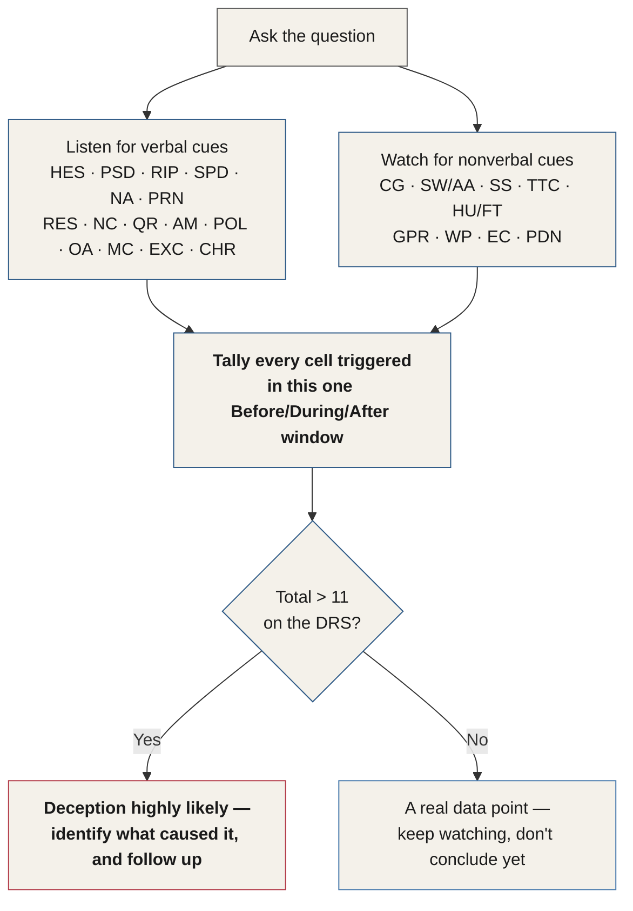

# Chapter 31 — Deception Detection and Stress

> *"There's no behavior that indicates deception. There are only behaviors that indicate stress."*

There are no behaviors that directly indicate someone is deceiving or lying. Instead, what we're looking for is discomfort, stress, and uncertainty while someone is speaking. So although you're learning how to detect when deception is *likely* in a conversation, what you're actually learning is how to detect stress. This skill reveals internal emotion of every kind — in sales, in medicine, in negotiation, in any situation where you speak to another human being.

Becoming a stress detector has tremendous benefits. You start to see exactly where disagreement, discomfort, and uncertainty creep into the mind of anyone you speak to. Once you can see these behaviors, you can identify the precise moment they occur — and what was being discussed that might have caused them.

This chapter covers both verbal and nonverbal deception indicators. Verbal indicators are given first, since they're the tool most directly built to address deception — but listen through all of them with the wider intent of applying them to identify any form of stress, in any conversation you're part of.

## About Lying

There is no machine or human that can detect lies. Even the polygraph is a machine that measures only stress responses. One of the reasons polygraph results are inadmissible in court is the machine's fundamental unreliability — polygraphs are prone to subjective interpretation and manipulation, and are even biased against truth-tellers.

To get proficient at determining the likelihood of deception, you have to read behaviors in groups and clusters. A single data point is never enough — when you see one, you need another before you can make any real determination about deception in someone's statement. Chapter 30 already gave this idea its formal name: a **Group** (Chapter 25), covered informally there as a "cluster" — same concept, two names.

The reason the Behavioral Table of Elements is designed to resemble the periodic table of elements — aside from the fact that it looks cool — is to make exactly this point visually: just like chemical elements, behaviors combine to form something larger. Reading behavior works the same way. We need to combine multiple data points to form a cohesive opinion about an interaction. (Chapter 30 tells the full story of how the table came to look the way it does, for anyone who wants the fuller version.)

## The Truth Bias

We're all affected during conversations by something called the **truth bias**.

::: definition
**Truth bias** — the tendency, when we like someone (even just a little), for our brains to make a decision, without our knowledge, to see only truth. Perceptive indicators and warning signs get quietly deleted from our memory of experiences with people we like.
:::

Our brains are working to do the right thing: once we interact with someone we like, they seek confirmation of that liking, and largely ignore anything that conflicts with it. Truth bias can strike anywhere — from the courtroom to the sales floor, and in almost any conversation we have. It isn't just something spouses and interrogators deal with. Something as small as looking like someone, sharing the same first name, or even being the same race as someone can trigger it.

There's no cure to prevent this from happening, but being aware of it can help. Before an important conversation, examine the situation and determine whether you're likely to suffer from truth bias, and keep that in mind during the interaction itself. While it can't be prevented, awareness can certainly limit the bias's influence on you.

## The Verbal Deception Indicators

::: callout
**A promise kept.** Chapter 25's Mr. Phillips walkthrough scored a resume statement and a non-contracted denial before either was formally defined — and flagged psychological distancing with an explicit promise: "PSD will be covered in depth later." This is that chapter: the full **Direct Verbal Behavior** region of the BTE, all fifteen cells Chapter 26 catalogued, every one of them worth a flat **4.0** on the Deception Rating Scale.
:::

Let's walk through them.

### Hesitancy — HES

*BTE cross-reference: HES — Verbal · 4.0 · During.*

Hesitancy occurs in two forms.

The first is an unusual pause before a person answers a question. How do we know what counts as "unusual"? Only by comparison — we measure how unusual a pause is against how the same person has responded to every other question in the conversation, a miniature version of the baselining Chapter 25 formally introduced.

The second form hesitancy takes is a direct repetition of the question. Ask someone, "What's the reason you decided to do that?" and hear back, "What's the reason I decided to do that?" — that's hesitancy. The person has echoed the entire question back before answering, buying time and giving themselves room to prepare an answer in their head.

If someone repeats only *part* of the question, though, it's most likely for clarification, not for buying time. Ask the same question and hear back simply, "The reason...?" — that's a partial repetition for clarification, and it does not qualify as hesitancy.

### Psychological Distancing — PSD

*BTE cross-reference: PSD — Verbal · 4.0 · During.*

When someone speaks about something they feel guilty about, they soften the severity of the act and put linguistic distance between themselves and the object of the question. In police work, criminals reach for words that describe crimes as less revolting or severe than they actually are:

| Specific Word | Softened Word |
|---|---|
| Kill | Hurt |
| Rape | Have sex with |
| Assault | Hit |
| Stab | Hurt |
| Steal | Take |
| Molest | Interfere with, or touch |
| Shoot | Harm |

*Table 31.1 — Crime language, softened. Innocent people rarely hesitate to use the specific, harsh word for what happened; guilty people tend to soften how bad it sounds.*

People do this in business too, describing negative workplace actions with far less severity than an innocent person would use. People do the same thing with names: criminals are less likely to use a victim's name at all, reaching instead for "he," "she," or "the woman." In the workplace, employees do the same for people they either disdain or may have victimized.

Consider a statement you've probably heard before:

> *"I did not have sexual relations with that woman."*

Two instances of psychological distancing live inside this single sentence: *sex* has become *sexual relations*, and the name of the subject — Monica — has been omitted entirely. Only after this distancing phrase was spoken was her name actually used, and even then, only after a pause.

::: callout
**Turning the skill around.** When Charles trains interrogation teams, one piece of advice he always gives is the mirror image of this chapter's detection skill: an interviewer's own language should use psychological distancing too. Never reach for the harsh or criminal word to describe the event under discussion — always soften the severity instead. Suspects already have a tendency to assign blame, minimize how serious the act was, and rationalize their own actions; the interviewer's job is to help them do exactly that. Of the seven specific tasks an interrogator must accomplish, minimizing the seriousness of the situation is one of them — and psychological distancing, used deliberately by the interviewer, is how it's done.
:::

### Rising Vocal Pitch — RIP

*BTE cross-reference: RIP — Verbal · 4.0 · During.*

The tone of our voice tends to rise when we lie. Stress creates adrenaline, and adrenaline tightens the muscles in the neck around the vocal cords — a deceptive statement will likely sound higher-pitched than the rest of the conversation around it.

This indicator is easy to notice once you know to listen for it, but it doesn't sound the way you'd expect. When Charles first started playing with this idea, he imagined something like Dennis the Menace lying to Mr. Wilson about the baseball that just flew through his living room window. Reality turned out far less dramatic: the pitch increases only slightly, in contrast to everything else in the conversation.

::: callout
**Scenario.** You're interviewing a new hire for your company. The moment you ask why they left their previous employer, the pitch of their voice rises. Everything else about the answer looks entirely believable — but you decide to call the previous employer anyway, and discover they were fired for stealing from the company. Crisis averted.
:::

### Increased Vocal Speed — SPD

*BTE cross-reference: SPD — Verbal · 4.0 · During.*

Liars increase the speed of potentially deceptive statements, unconsciously, like every other indicator in this chapter. This typically has one of two roots in the subconscious mind.

First, the brain is stressed, and delivering the statement as fast as possible minimizes the time spent experiencing that stress — the speed stands out against the rest of the conversation. Second, a deceptive person speeds up specifically to avoid being interrupted: a pause, to their brain, looks like an opportunity for the listener to jump in and question some part of the statement.

::: callout
**Scenario.** In a business-merger discussion, the CEO of one company speeds up while describing the company's integrity and how forthright they've been in submitting all the requested paperwork. A week later, the U.S. Securities and Exchange Commission (SEC) announces it's investigating the company's directors for insider trading. Try watching footage of Enron staff making similar statements — the pattern is easy to spot once you know what you're listening for.
:::

### Non-Answer Statements — NA

*BTE cross-reference: NA — Verbal · 4.0 · During.*

If a person responds to a question in a way that doesn't actually answer it, that's a non-answer. This one comes back again and again through the rest of this chapter — several of the indicators ahead (Question Reversal, especially) automatically double as a non-answer, stacking their own points on top of it and raising the total DRS score for that single response.

### Pronoun Absence — PRN

*BTE cross-reference: PRN — Verbal · 4.0 · During.*

Pronouns are built into the fabric of how we speak. Deceptive statements contain fewer of them than normal speech — sometimes they're missing almost entirely. Oddly, technical manuals share this quality: read the instructions for a new washing machine, and there's a good chance you won't find a single pronoun in the entire document. In the subconscious, a lack of pronouns reads as highly technical — like a list of facts rather than a lived memory. Our brains recall untrue events with fewer pronouns for much the same reason: we didn't actually experience them.

Ask someone what they did last night, and imagine this answer: "Left the house about nine, went to the bar, had like six or seven drinks, stopped at the store on the way home, got a six-pack, got home about eleven, and played Xbox until about two in the morning." Pronouns are missing from the entire story. Real deceptive statements are rarely this obvious — but once you start listening for it, you'll notice pronouns thinning out in exactly the moments that matter.

::: callout
**Further reading.** James W. Pennebaker's *The Secret Life of Pronouns: What Our Words Say About Us* (2011) covers this phenomenon, and many other fascinating findings about what our word choices reveal, in far more depth than this chapter has room for.
:::

::: callout
**Scenario.** You're talking with a coworker about a recent vacation. As they describe a short trip to Miami, you notice their description has almost no pronouns in it. You file the observation away — and only a week later discover they were actually interviewing for a job in New York City, not sunbathing in Miami.
:::

### Resume Statements — RES

*BTE cross-reference: RES — Verbal · 4.0 · During.*

Most of us, accused of something we didn't do, would simply deny it. Deceptive people often reach for a different, unconscious tool instead: the **resume statement**. Questioned about something, they respond with a long list of reasons they'd never do such a thing — a resume of sorts, detailing exactly why they're a good, honest, caring person, full of integrity. People who talk often, and unprompted, about their own integrity may be handing out resume statements pre-emptively to everyone they meet — to remove doubt, or to quiet their own guilt or shame.

::: callout
**Scenario.** You're a senior interrogator, tasked with interviewing a suspect in a sexual-assault case involving a minor. You ask where they were when the victim says the crime took place, and this is the response:

> *"I've volunteered coaching that softball team for over seven years. I have a master's degree in psychology. I know what inappropriate touching would do to a kid. Not only do I respect people in my life, I've also been teaching Sunday school at Riverside Baptist for the last four years."*

An impressive resume statement. But consider: did it answer the question? Nope. (Two of this chapter's own patterns are quietly at work here, too — "inappropriate touching" softens the act itself, and "a kid" keeps the victim unnamed: the same two distancing moves defined earlier in this chapter.)

In this one response we have a non-answer statement, two instances of psychological distancing, and a resume statement:

| Behavior Triggered | Points |
|---|---|
| Non-Answer (NA) | 4.0 |
| Psychological Distancing (PSD) | 4.0 |
| Psychological Distancing (PSD) | 4.0 |
| Resume Statement (RES) | 4.0 |
| **Total** | **16.0** |

Not including any nonverbal behavior at all, the total score is 16 on the Deception Rating Scale.
:::

### Non-Contracting Statements — NC

*BTE cross-reference: NC — Verbal · 4.0 · During.*

We already know the brain defaults to the most logical, technical-sounding language it can manage when it's trying to deceive — a lie has to sound believable to work. That washing-machine manual from a few sections ago, the one without pronouns, is missing something else too: contractions. Where you'd normally tell someone, "Don't use chemicals to clean the washing machine," the manual instead says, "**Do not** use chemicals to clean the washing machine." This non-contracted, technical language isn't something people switch on and off consciously — it's something the brain defaults to when it isn't telling the truth. The exact reason is still debated, but the pattern itself is well documented:

| Contracted | Non-Contracted |
|---|---|
| Don't | Do not |
| Can't | Cannot |
| Wouldn't | Would not |
| Shouldn't | Should not |

Look again at the statement from the Psychological Distancing section:

> *"I did not have sexual relations with that woman."*

If the former president routinely spoke this way, this could easily be discounted as non-deceptive — just normal speech for him. But thousands of hours of him speaking on the record tell us this isn't his baseline. The non-contraction alone scores a 4 on the DRS. Add the two instances of psychological distancing already identified in the same sentence, and the statement climbs to 12 — well past the likely-deception threshold, and that's before any nonverbal behavior is even counted.

::: callout
**A ceiling worth knowing.** It's true that everyone slips into non-contracted, distanced language now and then. In practice, these slips rarely tally past 11 on the DRS — even for people who lean on several of this chapter's indicators as part of their normal, everyday speech.
:::

### Question Reversal — QR

*BTE cross-reference: QR — Verbal · 4.0 · During.*

Question reversal happens when you ask someone a question and they lob a question back at you instead — the same question, or a close variant of it — with a tone of defiance or indignance. Ask, "What were you up to Monday evening?" and hear back, "Well, what were you up to Monday evening?" — that's a question reversal, and it's an interesting data point on its own.

What makes it more interesting: a question reversal never answers the original question, so it automatically qualifies as a non-answer statement too.

::: callout
**Why 8, not 4?** A question reversal is a compound trigger. Because it never answers the question, it always doubles as a Non-Answer Statement (NA) — 4.0 points — stacked on top of Question Reversal (QR) itself, another 4.0. That's why almost every question reversal scores an 8 on the DRS.
:::

### Ambiguity — AM

*BTE cross-reference: AM — Verbal · 4.0 · During.*

Ambiguity means the answer someone gives isn't fully functional as an answer. Ask someone in a business setting, "John, what were you doing after hours in the office around 9 p.m. on Saturday?" and an ambiguous answer might sound like, "Well, I usually come in to check emails."

This one is easy to get tripped up on. Phrases like this let our brains — always eager to fill in gaps — assume the question got answered, and move on. Worse, once the brain half-notices the ambiguity, it often reaches for a follow-up that hands the person their escape route. A reply like, "So you just checked your email?" lets John off with a simple "Yup" — the perfect exit, leaving little room for any further deception detection. Look closer, though, and John's original answer never actually addressed the question at all, which makes it a non-answer statement too.

### Politeness — POL

*BTE cross-reference: POL — Verbal · 4.0 · During.*

Good manners don't mean deception. What we're watching for, in detecting deception, is a *sudden rise* in the respect someone shows the interviewer — a shift away from their own baseline, not politeness itself.

::: callout
**Scenario.** Charles had an interrogation case in Los Angeles involving a hotel concierge suspected of stealing money. The suspect addressed him as "dude" and "bro" through the first twenty minutes of the conversation. Then Charles raised the question of whether any other employees — or a security camera — might have seen him take the money:

> *"Oh no, no, sir. Absolutely not, sir. I mean, that kind of thing is not something I would do, Mr. Huge."*

A drastic deviation from his baseline behavior toward Charles for the first twenty minutes of the conversation — the politeness spiked in direct response to the one question about the actual event.
:::

### Over-Apologies — OA

*BTE cross-reference: OA — Verbal · 4.0 · During/After.*

A sudden spike in apologetic speech is just as unusual — relative to a person's own baseline — as a spike in politeness. Ask a pointed question and hear something like this, and treat it as a strong signal of potential deception:

> *"What did you guys do on Thursday evening again? ... Sorry, I don't know how I can possibly recall everything you want. I apologize, my memory isn't perfect. I don't know what else you want. I'm sorry."*

### Mini-Confession — MC

*BTE cross-reference: MC — Verbal · 4.0 · During.*

The need to confess is almost hardwired into us. As guilt about something rises, so does the pull to confess it — to get it off our chest, to release our troubles onto someone else. Some religions even build a dedicated outlet for it, such as confession in the Catholic Church.

There's a second reason someone might confess, too: to derail the interview. In a police interrogation, a suspect may confess to a smaller crime specifically to appear honest, throw the interviewer off course, and satisfy the underlying need to confess, all at once. These small confessions are typically unrelated to the actual event in question.

If you hear one, it's tempting to get sidetracked and open a whole new line of questioning around it. Don't. The mini-confession will still be sitting there at the end of the conversation. The better move is to stay on track, and calmly let the person know the mini-confession is no big deal and not what you're actually interested in.

::: callout
**Scenario.** You're an FBI agent, in the middle of interviewing a suspect in a homicide investigation, when they suddenly say: "I didn't have anything to do with that — but I've been meaning to tell someone, I have nineteen grams of heroin in the trunk of my car, which is parked right outside." That's a lot of heroin — enough to make the news. It's exciting, and it makes you want to go search the car immediately. Instead, you stay the course: you continue your original line of questioning, dismiss the confession as no big deal, and reassure the suspect that you're not in the drug business. Once they realize you have no intention of latching onto the smaller confession, and see that it really is no big deal, they become far more likely to confess to the larger event, if they were involved. Your visible comfort with everything else they've admitted gradually raises their own comfort level — right up to the moment it matters.
:::

::: callout
**Scenario.** You're casually looking for a recipe on your partner's phone when you notice an almost-entirely-deleted conversation with someone named Nicole — a name you don't recognize. You walk the phone over and ask about it, and hear this: "Oh yeah, that's someone from work, it's nothing. But — I've been meaning to tell you something. A few weeks ago I downloaded a dating app and chatted with a few people. It was just a social-networking thing. I deleted it afterward." You dodge the mini-confession immediately and dismiss it as nothing, knowing it will still be there when the conversation is over. Once your partner sees that the mini-confession didn't land, they confess to even more inappropriate contact with people at work.
:::

### Exclusions — EXC

*BTE cross-reference: EXC — Verbal · 4.0 · During.*

Exclusions are everywhere in politics — phrases like "to the best of my knowledge" or "as far as I recall" are so normal there that we barely register them anymore. An exclusion removes the speaker from the original answer by building in a caveat that gives them an escape from anything definitive:

- "As far as I know"
- "To the best of my knowledge"
- "As I recall"
- "If memory serves"
- "As far as I'm aware"
- "As far as I've been made aware of"

These phrases are stock-in-trade for politicians, and we hear them daily on the news too. One caveat before scoring anything as an exclusion: these replies can be entirely appropriate in the right circumstance. If someone asks whether the neighbor four houses down is selling drugs, "not to the best of my knowledge" is a perfectly reasonable answer. But if someone asks whether *you're* selling drugs, that same phrase should raise an eyebrow. Before scoring an exclusion on the DRS, make sure the question is something the person could reasonably be expected to have direct knowledge of.

### Chronology — CHR

*BTE cross-reference: CHR — Verbal · 4.0 · During.*
<!-- ASR? verify: this section is headed "Knowledge." in the raw transcript, but its content — unprompted chronological order as a deception signal, void once the interviewer explicitly asks for events "in order" — is a verbatim match for Chapter 26's already-established Chronology (CHR) cell. Retitled to the established BTE name for continuity; "Knowledge" may reflect a genuinely different spoken section title lost to poor audio, or a mis-transcription. -->

We tend to assume we tell our stories chronologically. In practice, when we're recounting an emotional event, or a specific day when something significant happened, we tend to lead with the emotional moment instead. Ask someone who was in a car accident on Wednesday, "What happened on Wednesday?" and they'll likely start by talking about the accident — we open our stories with action, movement, and whatever was emotionally charged, not with what came first on the clock.

If a recollection instead comes back with unnecessary detail, following a tidy, complete timeline, that's more likely to be deception — with one exception: if the person was specifically asked to walk through events in order, a chronological answer tells you nothing, since you're the one who prompted the order.

::: callout
**Technique — asking for it backwards.** We've all made up a story at some point — most of us as kids, some of us as adults. Once a story is invented, it gets rehearsed: told and retold until it's memorized and polished into a perfect narrative. There's a catch, though. Rehearse something enough times forward — think of how many times you've recited the alphabet — and you get remarkably good at it. Ask the same person to say the alphabet *backwards*, and no amount of forward rehearsal helps at all. Truthful events, unlike rehearsed lies, can be recalled in reverse without much extra difficulty — you can likely reverse-recall what you were doing this time yesterday right now, with barely a pause. So: if a chronological story sounds like it may be rehearsed and overly detailed, ask the person to walk you through it in reverse. A truthful memory holds up. A rehearsed one falls apart.
:::

### The Direct Verbal Behaviors, at a Glance

| Behavior | Symbol | What a Positive Reading Signals |
|---|---|---|
| Hesitancy | HES | Buying time — an unusual pause, or the whole question echoed back |
| Psychological Distancing | PSD | Guilt — the act or the victim's name gets softened or dropped |
| Rising Vocal Pitch | RIP | Stress tightening the vocal cords |
| Increased Vocal Speed | SPD | Minimizing stress exposure, or heading off interruption |
| Non-Answer Statements | NA | The question never actually got answered |
| Pronoun Absence | PRN | An account that wasn't really lived through |
| Resume Statements | RES | Pre-emptively managing how they're perceived, not answering |
| Non-Contracting Statements | NC | Overly technical, deliberate-sounding denial |
| Question Reversal | QR | Deflection — and, by definition, also a non-answer |
| Ambiguity | AM | A functionally empty answer, dressed as a real one |
| Politeness | POL | A sudden spike away from baseline respect |
| Over-Apologies | OA | A sudden spike away from baseline apology |
| Mini-Confession | MC | A small, unrelated admission meant to derail or build cover |
| Exclusions | EXC | A built-in escape hatch from anything definitive |
| Chronology | CHR | A suspiciously tidy, unprompted, detail-heavy timeline |

*Table 31.2 — The fifteen cells of the BTE's Direct Verbal Behavior region (Chapter 26). Every one of them is individually worth a flat 4.0 on the Deception Rating Scale.*

## The Nonverbal Signals, Revisited

Several nonverbal signals belong in this same conversation — some of them already toured in Chapter 30's walk through the eyes, the face, and the body. Here they return specifically through the lens of deception scoring, inside the same before/during/after window as everything above.

### Confirmation Glance — CG

*BTE cross-reference: CG — Unsure · Face · 4.0 · BDA.*

We look around at other people constantly in conversation. At certain moments, though, where we look reveals quite a bit about our psychology and our relationships. Two specific moments count as a confirmation glance, and both score a flat 4.0 on the DRS: a glance at a friend right *before* telling a story, and a glance at another interviewer right *after* telling one.

If you're speaking with someone while a coworker is present, the tell is this: the person you're talking to holds eye contact with you, then glances at your coworker right after saying something — checking in with them for confirmation. Talking to two people at once, the same tell shows up as one person glancing at the other just before their story or answer begins.

::: callout
**Scenario.** Newly promoted to sales manager at a real estate company, you sit down with a reluctant husband and wife who have concerns about buying a home. The moment you ask if they're ready to buy, the man immediately looks at his wife before answering. You've just confirmed she's likely the real decision-maker — and you can tailor the rest of the conversation to her communication style and priorities. They end up buying a home.
:::

### The Swallow Movement — SW / AA

*BTE cross-reference: SW (Swallowing) — Closed · Neck · 3.5 · Before/During; AA (Adam's Apple Jump) — Unsure · Neck · 4.0 · Before/After.*
<!-- ASR? verify: this section is headed "Bree swallow movement" in the raw transcript. Reconstructed as "The Swallow Movement" — "Bree" is most plausibly an ASR mishearing of "Pre" (a plosive-consonant confusion), fitting the section's own opening line, "Just as we begin to swallow..." -->

Just as we begin to swallow, the throat visibly moves upward. Try it: place a hand on your neck, and you'll feel the trachea rise as you prepare to swallow. Under stress or anxiety, that same rise becomes visible to an observer. Anxiety associated with deception doesn't just raise the throat — it also increases saliva production, and can cause a sensation in the throat called **globus pharyngeus**: the familiar "lump in the throat."

You'll most often catch this behavior while a question is still being asked — as the person realizes the severity or consequences of what's being asked, the throat's response is immediate.

::: callout
**Scenario.** You're a medical doctor. A patient comes in asking for a prescription for a controlled substance. During your questioning, you ask whether they've seen any other healthcare providers for the same issue — and their throat rises almost an inch. You spot the behavior, and call the pharmacy they've named. You confirm they've received several scripts for this exact medication in the past week alone.
:::

### Single-Sided Shrug — SS

*BTE cross-reference: SS — Unsure · Shoulder · 4.0 · During.*

We see this behavior constantly: one shoulder rises as someone explains something. Like every behavior in this manual, it doesn't indicate deception on its own — a single-sided shrug most likely indicates a lack of confidence in whatever's being said. Ask a close friend how they like their new job, watch them say "It's great" while one shoulder spikes up, and you'll know they may not like the job quite that much.

In a high-ticket sales situation, that same shrug appearing as you ask whether the client feels good about the deal means you've got work to do. Spotting it buys you a choice: address the concern right away, or ask about it later — either way, you know ahead of time, which beats finding out at the end.

### Throat Clasping — TTC

*BTE cross-reference: TTC — Unsure · Hands · 4.0 · During/After.*
<!-- ASR? verify: this section is headed "Bro clasping" in the raw transcript. Reconstructed as "Throat Clasping" — the section's own content ("touches their neck or throat... throat-clasping behavior") makes this an unambiguous ASR mishearing of "Throat." -->

Context always has to be identified to actually understand a behavior — spotting it and knowing what it means in the abstract is only half the job. If someone you're speaking with touches their neck or throat, it can strongly indicate a self-soothing or pacifying behavior. The hand doesn't need to fully wrap around the neck — any contact with the neck can illustrate doubt, or a need for reassurance. Once you spot throat-clasping behavior, identify the point in the conversation that caused it; that's your opening to address the doubt or uncertainty the person is feeling in the moment.

### Hushing and Facial Touching — HU / FT

*BTE cross-reference: HU (Hushing) — Unsure · Hands · 4.0 · BDA; FT (Facial Touching) — Unsure · Hands · 4.0 · During/After.*

We inherit a great deal from our ancestors. Every nonverbal behavior we carry today traces back to one of two needs: signaling to other humans, or protecting ourselves from predators. These behaviors are so deeply ingrained that we never fully grow out of them.

**Hushing** is any behavior that obscures the mouth from view — a cough, a scratch of the nose, or a hand directly covering the mouth. Picture a child accidentally dropping an F-bomb in front of their parents for the first time: we all instinctively picture that child's hand flying up to cover their own mouth, because that's exactly what we'd do ourselves. The impulse is so ingrained that the behavior becomes compulsive. Unlike with clothes, we don't grow out of these behaviors as we age — we just get more creative about masking them. The same impulse to cover the mouth might show up instead as a scratched nose, or a head turned briefly to cough. The impulse gets satisfied, and social standing stays intact.

Not every instance of this points to deception, or even stress. In social settings, covering the mouth while listening reads as respectful — a way of subconsciously stopping ourselves from interrupting. But research suggests facial touching is the single most commonly seen indicator of deception in Westernized countries (Chapter 26 cites over ninety behavioral studies pointing the same direction). In sales or interviewing, it's worth noting every time you see it — it can mean respect, concern, uncertainty, or deception, and only the surrounding context tells you which.

### The Fig Leaf — GPR

*BTE cross-reference: GPR (Groin Protecting) — Unsure · Hands · 4.0 · BDA.*

A man folding his hands in front of his genitals — hands drawing inward to rest over or cover the crotch area — is the gesture body-language researcher Allan Pease popularized as the **fig leaf**. Picture it in motion, not as a still image: hands resting comfortably on the legs, then sliding backward toward the groin the instant a particular topic comes up. That movement is the tell — it's what points you back to the exact moment that created the emotion. The fig leaf tends to mean a person is feeling vulnerable, threatened, or insecure.

::: callout
**Scenario.** You're seated with someone, going over the details of a contract. His hands rest gently on his legs as he listens. The moment you mention the payment terms, his hands retreat toward his crotch. You notice, and ask a few questions about the terms to see whether something needs to change — and he opens up, admitting he doesn't actually agree with the extended timeline and would like it changed. You caught the movement as genital-protective behavior, and resolved the issue before it became a problem.
:::

### The Single Arm Wrap — WP

*BTE cross-reference: WP — Closed · Arm · 2.0 · DNL.*

Women tend to perform the **single arm wrap** in the same circumstances that produce the fig leaf in men — instinctively crossing one arm across the body and holding the opposite arm, covering the area near the uterus. You'll see this constantly on high-school and college campuses, wherever women find themselves in new social situations among unfamiliar groups. As with the fig leaf, the movement itself is what you're watching for — the moment one arm folds across the lower abdomen is the moment to identify what was just said.

::: callout
**Scenario.** As a therapist, you're interviewing a young woman describing symptoms of depression. She talks through her family life and childhood — and the moment she says the word "stepfather," she performs a single arm wrap. You note the behavior and sense there may be more here. In the next session, you ask about it, and uncover a traumatic history she wouldn't have shared without the question.
:::

### Elbow Closure — EC

*BTE cross-reference: EC — Unsure · Arms · 4.0 · During.*
<!-- ASR? verify: this section is headed "Eldo closure" in the raw transcript. Reconstructed as "Elbow Closure" — the content ("the humerus... closure is when these bones move inward toward the torso... arms will instinctively pull into the body to protect the brachial artery") is a verbatim match for Chapter 26's already-established Elbow Closure (EC) cell. -->

Fear makes us protect our arteries — an old, effective reaction originally built to save us from predators, even though the predators we face today rarely have teeth. The upper-arm bone is the humerus, and **elbow closure** is what happens when the elbows draw inward, pulling those bones in toward the torso. If someone you're speaking with suddenly pulls their upper arms inward, that's a strong data point worth following up on. Chapter 26 also flags this one as temperature-sensitive — a cold room raises its baseline frequency in everyone, so weigh it accordingly. The behavior is only visible in a seated subject, and — like every fear-based behavior — its real job is protecting the brachial artery near the armpit.

::: callout
**Scenario.** You're at a party, just met someone, and you both sit down to chat. The moment you mention swimming, you notice instant elbow closure. Later, you learn she has a fear of water rooted in a childhood trauma. You put her in touch with a friend who specializes in phobias, and save the day.
:::

### Downward Palms — PDN

*BTE cross-reference: PDN — Closed · Hands · 3.5 · During/After.*

We expose our palms to signal sincerity — picture a child pleading innocence to a parent, arms out, palms open. You've almost certainly seen this gesture tens of thousands of times across a lifetime of conversation without ever consciously registering it. Palms exposed signal sincerity and openness; palms turned downward signal close to the opposite. Seated, most people rest their hands on their legs, the table, or the arms of a chair — **downward palms** is what happens when those resting hands turn to face down, further hiding the palm from view. It's a subtle shift, but it becomes easy to catch with a bit of practice, and depending on context it can point to disagreement, stress, concealment, deception, or anger. In sales, it often flags an unspoken objection to whatever's being discussed; in a courtroom, it can mean reluctance to proceed, or a concealment of information.

::: callout
**Scenario.** You're at your doctor's office, walking her through your symptoms while she takes notes. Before prescribing anything, she asks what other medications you're currently taking. You mention a prescription from another doctor, and notice her palms turn down toward her legs as she listens. Later, you ask whether she thinks you should keep taking that other prescription, and she talks you out of it. She was reluctant to undermine another doctor outright — but given your condition, she lets you know the medication could be more dangerous than you realized.
:::

| Behavior | Symbol | DRS | What It Likely Means |
|---|---|---|---|
| Confirmation Glance | CG | 4.0 | Checking with someone else for confirmation or approval |
| The swallow / throat rise | SW / AA | 3.5 / 4.0 | Stress activating the swallow reflex |
| Single-Sided Shrug | SS | 4.0 | Doubt in one's own statement |
| Throat Clasping | TTC | 4.0 | Self-soothing; doubt or a need for reassurance |
| Hushing / Facial Touching | HU / FT | 4.0 | Nervousness, self-consciousness — or respectful listening |
| The Fig Leaf | GPR | 4.0 | Vulnerability, threat, insecurity (men) |
| Single Arm Wrap | WP | 2.0 | Vulnerability, threat, insecurity (women) |
| Elbow Closure | EC | 4.0 | Fear-based protection of the brachial artery |
| Downward Palms | PDN | 3.5 | Disagreement, concealment, or an unspoken objection |

*Table 31.3 — Nonverbal deception indicators revisited in this chapter, with their established BTE ratings (Chapters 26 and 30).*

## Putting It Together

Every indicator in this chapter — verbal or nonverbal — answers the same underlying question: what, in this single question-and-answer exchange, is costing this person effort to manage?

*Figure 31.2 — Scoring a single exchange: verbal and nonverbal cues feed the same tally, inside the same before/during/after window, against the same greater-than-11 threshold.*

## Summary

There's no behavior that indicates deception. There are only behaviors that indicate stress.

Whether you're watching for these behaviors locked in an interrogation room with a suspect, or sitting in your teenager's room discussing drug use, the same behaviors help you understand the person in front of you. If this feels like a lot, don't worry — it is. To help, this manual closes with a learning plan and a training guide, built to help you progress through the material one skill at a time.

Coming up: the techniques FBI spy hunters and intelligence operatives actually use to get information out of people — without those people ever knowing it happened.

## Key Takeaways

- No behavior indicates deception on its own — only discomfort, stress, and uncertainty. Learning to spot "deception" is really learning to become a stress detector, useful everywhere from sales to medicine to negotiation.
- No machine or human can detect lies directly. Even the polygraph only measures stress — which is exactly why polygraph results are inadmissible in court.
- The **truth bias** unconsciously filters out red flags with people we like, triggered by things as small as a shared name or resemblance. It can't be prevented, only limited — through deliberate self-awareness going into an important conversation.
- Chapter 26's **Direct Verbal Behavior** region holds fifteen cells — Hesitancy (HES), Psychological Distancing (PSD), Rising Vocal Pitch (RIP), Increased Vocal Speed (SPD), Non-Answer Statements (NA), Pronoun Absence (PRN), Resume Statements (RES), Non-Contracting Statements (NC), Question Reversal (QR), Ambiguity (AM), Politeness (POL), Over-Apologies (OA), Mini-Confession (MC), Exclusions (EXC), and Chronology (CHR) — and every one of them is worth a flat 4.0 on the DRS.
- The math stacks: a resume-statement reply (NA + PSD×2 + RES) totals 16; a non-contracted denial (NC + PSD×2) totals 12; a typical question reversal (QR + NA) totals 8 — all measured against the greater-than-11 threshold for "deception highly likely" set in Chapters 25–26.
- Mini-confessions should be acknowledged and set aside, never chased — pursuing one derails the interview and teaches the subject that confessing works as a distraction.
- Chronology cuts against intuition: truthful accounts tend to lead with the emotional or dramatic moment, not the start of the timeline. A suspiciously tidy, unprompted, detail-heavy chronological account is the deception signal — and asking someone to recall it in reverse exposes a rehearsed story, since truthful memories hold up backwards and rehearsed ones don't.
- Several nonverbal signals return from Chapter 30 through the deception-scoring lens: Confirmation Glance (CG), the swallow / Adam's Apple Jump (SW/AA), Single-Sided Shrug (SS), Throat Clasp (TTC), Hushing and Facial Touching (HU/FT), the Fig Leaf (GPR) and Single Arm Wrap (WP), Elbow Closure (EC), and Downward Palms (PDN) — all high-DRS, and all meaningless without the context that caused them.
- Every behavior in this chapter, verbal or nonverbal, measures exactly one thing: stress. None of them, alone, prove deception.

<!--
## Change Log

| Original (transcript) | Corrected | Reason |
|---|---|---|
| "Burbal indicators are given to address deception" | "Verbal indicators are given first to address deception" | ASR mishearing ("Burbal" → "Verbal"), consistent with "verbal and nonverbal deception indicators" one sentence earlier. |
| "Preceptive indicators and warnings are deleted..." | "Perceptive indicators and warning signs get quietly deleted..." | ASR mishearing ("Preceptive" → "Perceptive"). |
| "even being the same racist someone" | "even being the same race as someone" | ASR mishearing/garble — "racist" does not fit as an adjective for a trigger of truth bias; "race as" is the plausible original. |
| "This weren't prevented, it can certainly limit the influence of the bias on you." | "While it can't be prevented, awareness can certainly limit the bias's influence on you." | ASR garble, reconstructed to close the paragraph's own "no cure, but awareness helps" argument. |
| "Havior is the same in that we need to combine..." | "Reading behavior works the same way. We need to combine..." | ASR mishearing — sentence-initial "Be" of "Behavior" dropped. |
| "hill becoming hurt" | "Kill becoming hurt" | ASR mishearing; fits the pattern of violent-crime words softened to vaguer injury words. |
| "Salt becoming it. Stab? Becoming hurt." | "Assault becoming hit. Stab becoming hurt." | ASR garble reconstructed as two separate softening pairs; "Salt" as a clipped "assault," "it" as a clipped "hit." Moderate confidence — flagged for review. |
| "Steel becoming take" | "Steal becoming take" | ASR homophone error. |
| "shoot becoming arm" | "Shoot becoming harm" | ASR mishearing (dropped initial "h"), fitting the pattern of the surrounding softened-injury-word list. Moderate confidence. |
| "the name of the subject, in this case moniker, has been omitted" | "the name of the subject — Monica — has been omitted entirely" | ASR mishearing ("moniker" for "Monica," the real first name from the well-known 1998 quotation this passage describes); "moniker" (meaning "name") does not logically follow "the name... has been omitted." |
| "I was 1st playing with this. I imagine Dennis the Menace..." | "When Charles first started playing with this idea, he imagined something like Dennis the Menace..." | Grammar repair of a garbled clause; third-person narration matches this chapter's established voice for anecdotes. |
| "Prices averted." | "Crisis averted." | ASR mishearing (phonetically close), and the only reading that fits as a scenario closer. |
| "Securities Exchange Commission, SEC" | "U.S. Securities and Exchange Commission (SEC)" | Factual correction — the agency's actual name includes "and." |
| "got a 6 bank" | "got a six-pack" | ASR mishearing, fits "stopped at the store" + "drinks" context. |
| "case against Reminder" | "case involving a minor" | ASR garble reconstructed — "a minor" fits the scenario's own content (a softball coach, "what inappropriate touching would do to a kid"); "Reminder" has no coherent reading. Moderate-high confidence. |
| "I volunteered coaching that softball team" | "I've volunteered coaching that softball team" | Grammar repair (missing contraction). |
| "Didn't answer the question. Nope." | "But consider: did it answer the question? Nope." | Grammar repair of a fragment into a coherent rhetorical question. |
| "He scores a 4 on the DRS here." | "The non-contraction alone scores a 4 on the DRS." | Grammar repair — "He" has no antecedent in the non-contraction discussion; the score belongs to the statement/behavior, not a person. |
| "Bree swallow movement" (section header) | "The Swallow Movement" | ASR mishearing, reconstructed (see inline comment at point of use). |
| "the throats called globus pharyngis" | "the throat called globus pharyngeus" | Spelling standardized to the more common current medical term for this term, verified via web search; "globus pharyngis" is a valid but less common variant. |
| "the pharmacy they're requested" | "the pharmacy they've named" | Grammar repair of a garbled possessive/contraction. |
| "My lap." (stray fragment, Single-Sided Shrug section) | Dropped | Unrecoverable ASR noise/filler with no coherent reading; consistent with precedent (Ch. 25, Ch. 30) for dropping meaningless transcript fragments. |
| "how they learned their new job" | "how they like their new job" | ASR mishearing, consistent with the near-identical line already established in Chapter 30's Single-Sided Shrug section ("Imagine asking a friend how they like their new job"). |
| "Bro clasping" (section header) | "Throat Clasping" | ASR mishearing, reconstructed (see inline comment at point of use). |
| "one of the reasons polygraph results are inadmissible... They are prone to subjective interpretation, manipulation, and are even biased against truth tellers." | Lightly repunctuated into two sentences; no content change. | Grammar/readability only. |
| "in deception, this may be the most reliable indicator of a line" | "in deception, this may be the most reliable indicator of a lie" | ASR mishearing ("line" for "lie"), confirmed by "deception" and "facial touching is the most commonly seen indicator of deception" one sentence later. |
| "The term for this behavior was coined by Alan Pease." | "...popularized by Allan Pease." | Spelling corrected ("Alan" → "Allan"), verified via web search. Softened "coined" to "popularized" — Pease's authorship of "the fig leaf" specifically (as opposed to documenting/popularizing it) could not be confirmed with the same confidence as his authorship of "hushing," already credited to him in Chapter 26. |
| "covering the area near their uterus" | Retained as written | Not a factual error — consistent with this same passage's own framing ("protect our reproductive organs"); Chapters 26 and 30 use "midsection"/"lower abdomen" for the same gesture without contradicting this more specific anatomical detail. |
| "he performs a single arm wrap" (describing a female therapy patient) | "she performs a single arm wrap" | Grammar/pronoun repair — ASR error; the subject throughout this scenario is "a young woman." |
| "Eldo closure" (section header) | "Elbow Closure" | ASR mishearing, reconstructed (see inline comment at point of use). |
| "The upper burn in your arm is called the humerus." | "The upper-arm bone is the humerus." | ASR mishearing ("burn" for "bone"). |
| "you refer her to a good friend who deals with phobias and saved the day" | "...and save the day" | Tense repair for consistency with the surrounding present-tense scenario narration. |
| "This weren't prevented" / other scattered filler, false starts, and run-on sentences throughout | Cleaned for readability | No content added or removed, per the skill's standard "grammar/punctuation that impedes reading" allowance. |
| "Mr Hughes" (Politeness scenario, suspect addressing the author) | "Mr. Huge" | Corrected to the author's established name, per the identical, repeated correction already made in Chapters 9, 21, 23, and 24 (each independently confirms "Hughes"/"Chase Hughes" as an ASR mishearing of "Charles Huge," the name used consistently in every chapter's frontmatter). |
-->
