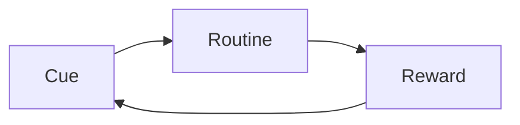

# Behavior Ops — Editorial & Design Style Guide

This is the design system every chapter follows. The `format-chapter` skill
relies on it. Keep it short and concrete.

## Voice
- Keep **Charles Huge's** voice: direct, practical, conversational-but-authoritative.
- Second person ("you") when addressing the reader, as in the talks.
- Preserve his examples and analogies verbatim in spirit — never sand them off.

## Fidelity rule (non-negotiable)
- No content from the transcript is dropped. Reorganize and clean; never summarize away.
- Corrections are limited to: transcription errors, filler, grammar, and factual
  errors vs. the original manual. Log every substantive correction in the chapter's
  Change Log table.

## Structure of a chapter
1. Chapter number + title (H1).
2. Opening pull-quote (a real line from the chapter).
3. Lead-in paragraph(s).
4. Body sections (H2) and subsections (H3) — invented to expose Charles's structure.
5. **Key Takeaways** — bulleted, each traceable to the text.

## Elements (Markdown the React app renders)

Callout boxes use pandoc fenced divs:

```
::: callout
**Principle.** The behavior you reward is the behavior you repeat.
:::

::: definition
**Operant conditioning** — learning driven by the consequences of behavior.
:::

::: warning
**Watch out.** Punishment suppresses behavior without teaching a replacement.
:::
```

**Diagrams — choose the right tool:**

| Need | Tool |
|---|---|
| Flow, sequence, mindmap, 2×2 | Mermaid fenced block (auto-themed, no files) |
| Pyramid, spectrum, layered model, any shape | SVG file in `public/assets/diagrams/` |
| Chart of numbers Charles stated | Python/matplotlib PNG in `public/assets/diagrams/` |

**Mermaid** (rendered live, no build step):
````

````
Use: `flowchart` (processes), `sequenceDiagram` (interactions), `quadrantChart` (2×2 models), `mindmap`/`graph` (concept maps).

**SVG** — for shapes Mermaid cannot draw (pyramids, scales, layered models):
- Save to `public/assets/diagrams/chapter-NN-name.svg`
- Always set `width` and `height` on the `<svg>` element alongside `viewBox`
- Reference as ``
- Hard-code palette tokens (SVG via `` cannot inherit page CSS)
- Use transparent background so it works in both light and dark mode

**Data charts**: write a matplotlib script in `assets/diagrams/`, save PNG to
`public/assets/diagrams/`, include with ``.

## Captions & references
- Every figure/table gets a caption and is referenced in prose ("see Figure 3.2").
- Number figures by chapter: Figure NN.M.

## Color palette (defined in `src/theme.js` `:root`-style tokens)
- Ink `#1A1A1A`, Accent (deep blue) `#2E5A87`, Warn (muted red) `#B23A48`,
  Paper `#F4F1EA`, Rule `#C9C2B2`. Each has a dark-mode counterpart in the theme.

## Reading layout
- Responsive, centered reading column (serif body, Palatino/Iowan with web-font
  fallbacks; sans headings). Defined in `src/components/BookProse.jsx` — not a
  fixed print page. Light and dark modes both supported.
